# 问题一计算结果与验证报告

**本次采用统一简化相变模型：六个相变系数全部固定为明确说明来源的参考值，只用−20℃数据校准交换电流密度j₀，再用−25℃留出验证。冻结系数不再由电压、温度自由拟合，也不为冻结单独增加成核或JMAK模型。**

主解冰量明显增加，但增加本身不是模型已被证实的证据。附件没有冰量观测，正式冰量仍是给定相变时间尺度、膜水阈值及接口闭合下的条件预测。六系数统一敏感性与冻结剖面用于量化这一限制。

## 1. 工作数据与比较口径

- [含双极板主工作数据：两工况352行](../data/含双极板修订_两工况352行工作数据.csv)：各176行，0、0.2、…、35 s。
- [五层结构对照：两工况352行](../data/五层基线_两工况352行工作数据.csv)：与主解使用相同相变处理，分别校准j₀。
- [算法模型与实现说明](算法模型与实现说明.md)、[参数与新增假设清单](非题给参数与新增假设清单.md)、[完整数据字典](数据字段说明.md)。

模型温度是相应完整热域的厚度加权平均：五层326.7 μm，含双极板4326.7 μm；含板结果另存仅MEA平均温度T_MEA_C。实验温度与哪一种平均严格对应缺少独立测温定义，因此保留两种输出。最大冰体积分数为max(mi/ρi)，按控制体总体积计；孔隙饱和度则除以原始孔隙率，不能混用。

电压误差为|V模型−V实验|/|V实验|；温度主相对误差采用摄氏温度绝对值分母，并同时给出开尔文口径、绝对误差和RMSE。相变速率输出是前一采样时刻至当前时刻的区间平均，不是采样点瞬时导数。

## 2. 数据来源与结构诊断

附件2每工况184行、0–36.6 s，本次截取0–35 s各176行。加载采用F列A/m²，因其与E列A/cm²一致；附件电流与25 cm²面积不一致，详细CSV保留原电流及按25 cm²重算电流，不混用于方程。实验V、T仅用于校准目标和事后比较，不替代物理状态。

| 工况 | 实测热量推算面热容 J/(m²·K) | 附件双板面热容 J/(m²·K) | 电流/电流密度隐含面积中位数 cm² |
| --- | --- | --- | --- |
| minus20 | 6117.77 | 6066.72 | 310.628 |
| minus25 | 6309.9 | 6066.72 | 303 |

上述表观热容忽略相变热与温差分布，仅为独立结构诊断，不将实测V或T输入正式热计算。五层基线的严重温度失配说明其热域不足；含板改进与相变处理的影响应分开评价。

## 3. 相变系数如何统一处理

| 系数 | 过程 | 固定参考值 s⁻¹ | 原始附件行 | 来源/闭合限定 |
| --- | --- | --- | --- | --- |
| kf | 冻结 | 1 | 48 | 膜水-冰系数扩展至孔液冻结；过冷度归一化另属闭合 |
| km | 融化 | 1 | 48 | 膜水-冰系数扩展至融化；过热度归一化另属闭合 |
| kcond | 凝结 | 1 | 49 | 附件权重采用1秒参考时间转成有效速率 |
| kevap | 蒸发 | 1 | 49 | 附件权重采用1秒参考时间转成有效速率 |
| kdep | 凝华 | 0.0001 | 50 | 附件权重采用1秒参考时间转成有效速率 |
| ksub | 升华 | 0.0001 | 50 | 由凝华权重对称扩展；附件未独立给升华值 |

附件的相变参数单位为“−”，不是直接给定的s⁻¹物性。本次对所有相变统一采用1 s参考时间：有效系数=附件权重/参考时间；kf/km从膜水—冰项扩展至孔液冻结/孔冰融化，ksub由凝华权重对称扩展，均明确列为闭合假设。该处理提供一致、可复现的基准，不能声称已从实验确定绝对相变时间尺度。

保留简化有限速率源项；液/汽交换使用液水面饱和蒸气压，冰/汽交换使用冰面饱和蒸气压；补齐升华的质量转移与吸热。所有转移受供体库存约束，接收相增加的质量与供体扣除相等。膜内仍采用固定不可冻水阈值λnf=3，与孔隙水共享简化冻结系数，这是待验证假设。

## 4. 校准、求解与精度

一维非均匀有限体积，隐式输运、有限量相变、热—电压Picard迭代；正式MEA58格，含板74格，最大步长0.0125 s。仅辨识j₀：先在log10(j₀)∈[−5,3]粗扫描，再有界一维搜索，最后用正式网格细化。目标是176个时刻的电压与摄氏温度相对残差平方和的平均，没有冻结参数正则项。

| 模型 | j₀ / (A/m²) | 固定kf / s⁻¹ | 校准目标 | 评估次数 |
| --- | --- | --- | --- | --- |
| 五层基线 | 161.9092135 | 1 | 0.752522 | 28 |
| 含双极板修订 | 0.10255839 | 1 | 0.0106797 | 21 |

两个模型分别只用−20℃工况校准；−25℃未用于调参、选择情景或阈值。留出验证仅在固定结构、初始条件和闭合下成立，不能称为整个建模流程的盲验。五层模型的j₀补偿热结构失配，不宜视作可靠电化学物性。

| 模型/工况 | 用途 | V RMSE / V | V平均相对误差 / % | V最大相对误差 / % | T RMSE / ℃ | T平均相对误差 / % | T最大相对误差 / % |
| --- | --- | --- | --- | --- | --- | --- | --- |
| 五层基线 / −20℃ | 校准 | 0.353589 | 57.489 | 95.6092 | 9.71789 | 52.2389 | 99.3946 |
| 五层基线 / −25℃ | 留出验证 | 0.338984 | 55.6622 | 92.4707 | 10.6182 | 43.4884 | 80.828 |
| 含双极板修订 / −20℃ | 校准 | 0.0594881 | 8.65985 | 20.6432 | 0.116238 | 0.527098 | 2.87006 |
| 含双极板修订 / −25℃ | 留出验证 | 0.0607742 | 9.02335 | 17.6144 | 0.232258 | 0.694616 | 3.9202 |

含板模型改善了温度预测，但电压谷与后期回升仍有系统偏差；本次不通过增设经验电压补偿来掩盖偏差。固定相变基准主要解决参数处理不一致和冻结系数被误差目标压至下界的问题，并不保证更低的V/T误差。

## 5. 第一问每5秒结果表

完整工作数据保留0.2 s全部采样；下表实验值来自附件2原始精度，误差不基于提前四舍五入的温度。

### 含双极板 / −20℃

| t / s | 实验V / V | 模型V / V | V误差 / % | 实验T / ℃ | 模型T / ℃ | T误差 / % | 最大冰体积分数 |
| --- | --- | --- | --- | --- | --- | --- | --- |
| 0 | 0.799 | 0.769731 | 3.66319 | -19.9954 | -20 | 0.0232315 | 0 |
| 5 | 0.801 | 0.762745 | 4.77591 | -19.9621 | -19.9659 | 0.0189593 | 0.000465254 |
| 10 | 0.538 | 0.624812 | 16.1361 | -19.6517 | -19.6758 | 0.122697 | 0.00237243 |
| 15 | 0.521 | 0.579803 | 11.2866 | -18.4098 | -18.5197 | 0.597384 | 0.0125071 |
| 20 | 0.599 | 0.585546 | 2.24616 | -17.0805 | -17.1789 | 0.575544 | 0.0295262 |
| 25 | 0.626 | 0.580184 | 7.31893 | -15.9041 | -15.9084 | 0.0269375 | 0.0499057 |
| 30 | 0.633 | 0.560552 | 11.4451 | -14.2733 | -14.1326 | 0.985239 | 0.0742311 |
| 35 | 0.666 | 0.565082 | 15.1528 | -12.6656 | -12.3021 | 2.87006 | 0.0995201 |

### 含双极板 / −25℃

| t / s | 实验V / V | 模型V / V | V误差 / % | 实验T / ℃ | 模型T / ℃ | T误差 / % | 最大冰体积分数 |
| --- | --- | --- | --- | --- | --- | --- | --- |
| 0 | 0.799 | 0.751969 | 5.88622 | -24.9954 | -25 | 0.0183374 | 0 |
| 5 | 0.8 | 0.751914 | 6.01069 | -24.9621 | -24.9628 | 0.00287133 | 0.00059503 |
| 10 | 0.537 | 0.607482 | 13.1251 | -24.6453 | -24.6463 | 0.00407169 | 0.0031147 |
| 15 | 0.518 | 0.562155 | 8.52408 | -23.3806 | -23.4273 | 0.199721 | 0.0182123 |
| 20 | 0.592 | 0.567582 | 4.12471 | -22.0326 | -22.0258 | 0.030803 | 0.0415272 |
| 25 | 0.618 | 0.560438 | 9.31425 | -20.8461 | -20.6928 | 0.73513 | 0.0685887 |
| 30 | 0.621 | 0.539458 | 13.1308 | -19.2012 | -18.82 | 1.98549 | 0.101085 |
| 35 | 0.644 | 0.54336 | 15.6274 | -17.588 | -16.8985 | 3.9202 | 0.135035 |

## 6. 冰量、相变贡献与未激活通道

| 模型/工况 | 35s最大冰体积分数 | 孔隙最大冰体积分数 | 膜最大冰体积分数 | 最大冰所在层 | 冰库存 g/m² | 冰库存/累计产水 |
| --- | --- | --- | --- | --- | --- | --- |
| 五层基线 / −20℃ | 0.0246678 | 0.011257 | 0.0246678 | PEM | 0.600664 | 0.108332 |
| 五层基线 / −25℃ | 0.0523306 | 0.0202959 | 0.0523306 | PEM | 1.27011 | 0.222802 |
| 含双极板修订 / −20℃ | 0.0995201 | 0.0339491 | 0.0995201 | PEM | 2.222 | 0.400745 |
| 含双极板修订 / −25℃ | 0.135035 | 0.0440696 | 0.135035 | PEM | 2.73292 | 0.479406 |

最后一列是冰库存与累计产水的质量比，既不是冻结概率，也不是产水的冻结转化率：冰还可能来自初始膜水，同一份水也可能多次相变。全域最大冰、孔隙最大冰、膜最大冰可位于不同位置，不可将它们相加。

| 模型/工况 | 累计凝结 g/m² | 累计蒸发 g/m² | 累计凝华 g/m² | 累计升华 g/m² | 累计冻结 g/m² | 累计融化 g/m² |
| --- | --- | --- | --- | --- | --- | --- |
| 五层基线 / −20℃ | 0 | 0.00695646 | 0 | 5.72692e-07 | 0.601219 | 0.000554473 |
| 五层基线 / −25℃ | 0 | 0.00511946 | 0 | 4.74746e-07 | 1.27011 | 0 |
| 含双极板修订 / −20℃ | 0 | 0.00265629 | 0 | 2.27023e-07 | 2.222 | 0 |
| 含双极板修订 / −25℃ | 0 | 0.00175178 | 0 | 1.42696e-07 | 2.73292 | 0 |

本次模型规定反应产水先进入cCL孔液并使用干气边界；水蒸气是否达到液/冰面饱和状态由求解决定。因此凝结或凝华累计量为零是该窗口/闭合的结果，不能据此删去方程或认定相应系数不重要。含板两工况局部温度在0–35 s均低于0℃，融化未激活；五层−20℃局部可越过0℃，微量融化也被保留，不能把两种结构一概称为无融化。

## 7. 六系数公平敏感性与共同时间尺度

每个系数均独立改成基准的0.1、1、10倍，j₀不重新拟合；四组模型/工况使用同一规则。下表取0.1/10倍中较大的影响，V和T为全时段最大绝对变化，冰为35 s最大冰体积分数的绝对变化。敏感性及其基准均为网格倍数2、0.025 s；不与正式0.0125 s结果末位直接比较。

### 五层基线

| 系数 | 工况 | max \|ΔV\| / V | max \|ΔT\| / ℃ | \|Δ最大冰35s\| |
| --- | --- | --- | --- | --- |
| kf（冻结） | minus20 | 0.0314081 | 1.30889 | 0.0828945 |
| kf（冻结） | minus25 | 0.046927 | 2.10096 | 0.132676 |
| km（融化） | minus20 | 5.12643e-05 | 0.00516449 | 0.000265735 |
| km（融化） | minus25 | 0 | 0 | 0 |
| kcond（凝结） | minus20 | 0 | 0 | 0 |
| kcond（凝结） | minus25 | 0 | 0 | 0 |
| kevap（蒸发） | minus20 | 0.00033433 | 0.0946283 | 0.00062209 |
| kevap（蒸发） | minus25 | 0.000239541 | 0.0688149 | 0.000840816 |
| kdep（凝华） | minus20 | 0 | 0 | 0 |
| kdep（凝华） | minus25 | 0 | 0 | 0 |
| ksub（升华） | minus20 | 2.68351e-08 | 1.15036e-05 | 8.9052e-08 |
| ksub（升华） | minus25 | 1.83984e-08 | 9.39576e-06 | 1.29437e-07 |

### 含双极板修订

| 系数 | 工况 | max \|ΔV\| / V | max \|ΔT\| / ℃ | \|Δ最大冰35s\| |
| --- | --- | --- | --- | --- |
| kf（冻结） | minus20 | 0.120114 | 0.674073 | 0.236222 |
| kf（冻结） | minus25 | 0.165156 | 0.833572 | 0.281666 |
| km（融化） | minus20 | 0 | 0 | 0 |
| km（融化） | minus25 | 0 | 0 | 0 |
| kcond（凝结） | minus20 | 0 | 0 | 0 |
| kcond（凝结） | minus25 | 0 | 0 | 0 |
| kevap（蒸发） | minus20 | 0.000121326 | 0.00293041 | 0.000876656 |
| kevap（蒸发） | minus25 | 0.000128195 | 0.00152681 | 0.00107306 |
| kdep（凝华） | minus20 | 0 | 0 | 0 |
| kdep（凝华） | minus25 | 0 | 0 | 0 |
| ksub（升华） | minus20 | 2.09861e-08 | 2.28425e-07 | 1.44797e-07 |
| ksub（升华） | minus25 | 1.98704e-08 | 2.42191e-07 | 1.63354e-07 |

所有相变同时乘0.1/10倍，等价于改变共同参考时间，检验“附件无量纲权重→秒尺度”这一共同假设。它与单独扰动kf不是同一种检验。

| 模型 | 工况 | 共同倍率 | V RMSE / V | T RMSE / ℃ | 35s最大冰体积分数 |
| --- | --- | --- | --- | --- | --- |
| 五层基线 | minus20 | 0.1 | 0.355998 | 9.5495 | 0.0029882 |
| 五层基线 | minus25 | 0.1 | 0.342832 | 10.3012 | 0.00677083 |
| 五层基线 | minus20 | 10.0 | 0.339655 | 10.4075 | 0.0923506 |
| 五层基线 | minus25 | 10.0 | 0.317893 | 11.7943 | 0.188359 |
| 含双极板修订 | minus20 | 0.1 | 0.0540949 | 0.0838085 | 0.0135814 |
| 含双极板修订 | minus25 | 0.1 | 0.052394 | 0.140004 | 0.0195544 |
| 含双极板修订 | minus20 | 10.0 | 0.102516 | 0.343521 | 0.339896 |
| 含双极板修订 | minus25 | 10.0 | 0.121419 | 0.531438 | 0.4216 |

固定λnf与膜/CL交换系数的结构敏感性也保存在同一CSV。单参数试验不覆盖全部参数交互作用；无效状态通过valid_samples和ever_invalid明确记录，不将无效结果当作可靠预测。

## 8. 冻结剖面与近优情景范围

另行扫描kf=10⁻⁴、10⁻³、0.01、0.03、0.1、0.3、1、3、10 s⁻¹；对每个kf只用−20℃重新估计j₀，再预测−25℃。这不是主解的参数选取程序，而是检验V/T是否足以识别冰量。所有剖面采用较粗网格及0.05 s步长。

| 模型 | 工况 | 工程目标容差 | 纳入离散情景数 | kf最小 / s⁻¹ | kf最大 / s⁻¹ | 35s冰分数最小 | 35s冰分数最大 |
| --- | --- | --- | --- | --- | --- | --- | --- |
| 五层基线 | minus20 | 1% | 6 | 0.0001 | 0.3 | 3.00731e-06 | 0.00831959 |
| 五层基线 | minus25 | 1% | 6 | 0.0001 | 0.3 | 6.78101e-06 | 0.0183769 |
| 五层基线 | minus20 | 5% | 8 | 0.0001 | 3 | 3.00731e-06 | 0.0549629 |
| 五层基线 | minus25 | 5% | 8 | 0.0001 | 3 | 6.78101e-06 | 0.104235 |
| 五层基线 | minus20 | 10% | 9 | 0.0001 | 10 | 3.00731e-06 | 0.106139 |
| 五层基线 | minus25 | 10% | 9 | 0.0001 | 10 | 6.78101e-06 | 0.179113 |
| 含双极板修订 | minus20 | 1% | 4 | 0.0001 | 0.03 | 1.34376e-05 | 0.00398204 |
| 含双极板修订 | minus25 | 1% | 4 | 0.0001 | 0.03 | 1.94062e-05 | 0.00573135 |
| 含双极板修订 | minus20 | 5% | 5 | 0.0001 | 0.1 | 1.34376e-05 | 0.0129033 |
| 含双极板修订 | minus25 | 5% | 5 | 0.0001 | 0.1 | 1.94062e-05 | 0.0184314 |
| 含双极板修订 | minus20 | 10% | 6 | 0.0001 | 0.3 | 1.34376e-05 | 0.0358371 |
| 含双极板修订 | minus25 | 10% | 6 | 0.0001 | 0.3 | 1.94062e-05 | 0.0502124 |

5%近优集合定义为J−20(kf)≤1.05×扫描中的最小J−20，同一集合原样用于−25℃。1%和10%阈值同时展示，避免选择单一阈值制造确定性。阴影是有限离散情景的逐时刻最小/最大值，**不是统计置信区间、不是概率区间，也不是所有物理可行情景的边界**。本次仍保留固定附件基准主解；若基准不在某个近优集合中，也应如实展示。

含板模型的固定kf=1基准未进入本次5%近优集合；这表明附件参考时间假设与仅按V/T最小化的偏好存在差异。主解保留的是统一参数基准，并非剖面中的拟合最优点；不能把基准冰量解释成由实验唯一反演的结果。

## 9. 独立一致性、守恒与离散误差

| 模型/工况 | 水残差 kg/m² | 冰预算残差 kg/m² | 离散能量残差 J/m² | 相变热重建误差 J/m² | 有效采样 |
| --- | --- | --- | --- | --- | --- |
| 五层基线 / −20℃ | 2.67459e-17 | 1.51788e-18 | 1.063e-07 | 6.39488e-13 | 176/176 |
| 五层基线 / −25℃ | 1.32788e-16 | 2.60209e-18 | 1.17154e-07 | 8.81073e-13 | 176/176 |
| 含双极板修订 / −20℃ | 4.54281e-17 | 2.38524e-18 | 1.56665e-07 | 1.02318e-12 | 176/176 |
| 含双极板修订 / −25℃ | 1.01508e-16 | 1.73472e-18 | 2.43534e-07 | 1.13687e-12 | 176/176 |

六个通道分别检查质量配对、非负库存、正确激活与潜热符号；连同零载、关闭成冰及全部相变关闭测试，共27项全部通过。另从导出的局部场独立重算平均温度、最大冰和总水量；从累计相变重算区间平均速率、冰库存预算和相变热。详细检查见最终交付独立核验CSV。

verify_phase_exports.py另从全部CSV独立核验正式四轨迹、两个中文352行表、108条敏感性轨迹和36条冻结剖面轨迹，检查区间速率积分、法拉第产水、冰库存及潜热收支；结果见相变输出独立核验CSV。

水残差为现存−初始−累计产水＋累计排水；冰残差为冰库存−冻结−凝华＋融化＋升华。相变热重建为Lc(凝结−蒸发)+(Lc+Lf)(凝华−升华)+Lf(冻结−融化)+等效吸附热。离散能量预算使用ΣCeff(new)ΔTΔx路径，不包含完整开放系统焓输运，不能写成严格全热力学能量守恒。

| 模型/工况 | 细化检查 | max ΔV / V | max ΔT / ℃ | max Δ最大冰分数 | 冰差/基准峰 |
| --- | --- | --- | --- | --- | --- |
| 五层基线/minus20 | time_half | 1.47805e-05 | 0.0053511 | 0.000200715 | 0.00812644 |
| 五层基线/minus20 | grid_double | 5.80581e-05 | 0.00240792 | 0.000898903 | 0.0363943 |
| 五层基线/minus20 | grid_double_time_half | 6.50032e-05 | 0.00629286 | 0.000525829 | 0.0212895 |
| 五层基线/minus25 | time_half | 1.65456e-05 | 0.00569843 | 0.00033833 | 0.00646523 |
| 五层基线/minus25 | grid_double | 8.68841e-05 | 0.00345467 | 0.00191958 | 0.0366818 |
| 五层基线/minus25 | grid_double_time_half | 9.72073e-05 | 0.00707163 | 0.00126891 | 0.024248 |
| 含双极板修订/minus20 | time_half | 2.14268e-05 | 0.000147786 | 0.0005273 | 0.00529842 |
| 含双极板修订/minus20 | grid_double | 0.000158446 | 0.000853209 | 0.00410269 | 0.0412248 |
| 含双极板修订/minus20 | grid_double_time_half | 0.000178144 | 0.00101497 | 0.00304644 | 0.0306113 |
| 含双极板修订/minus25 | time_half | 2.82651e-05 | 0.000205019 | 0.000659183 | 0.00488158 |
| 含双极板修订/minus25 | grid_double | 0.00022843 | 0.00126356 | 0.00630607 | 0.0466996 |
| 含双极板修订/minus25 | grid_double_time_half | 0.000254249 | 0.00147872 | 0.00496464 | 0.0367656 |

网格/步长检查只反映数值离散误差，不能替代物理参数验证；所有正式轨迹内部步均监测水/气非负、剩余孔隙率、正电导率及j<jlim，未把超限电流剪裁后冒充可行。

## 10. 图表与直接数据来源

### 01_main_experiment_comparison

五层基线电压、温度与实验采样值的对比；模型结果与实验数据采用相同采样时刻。

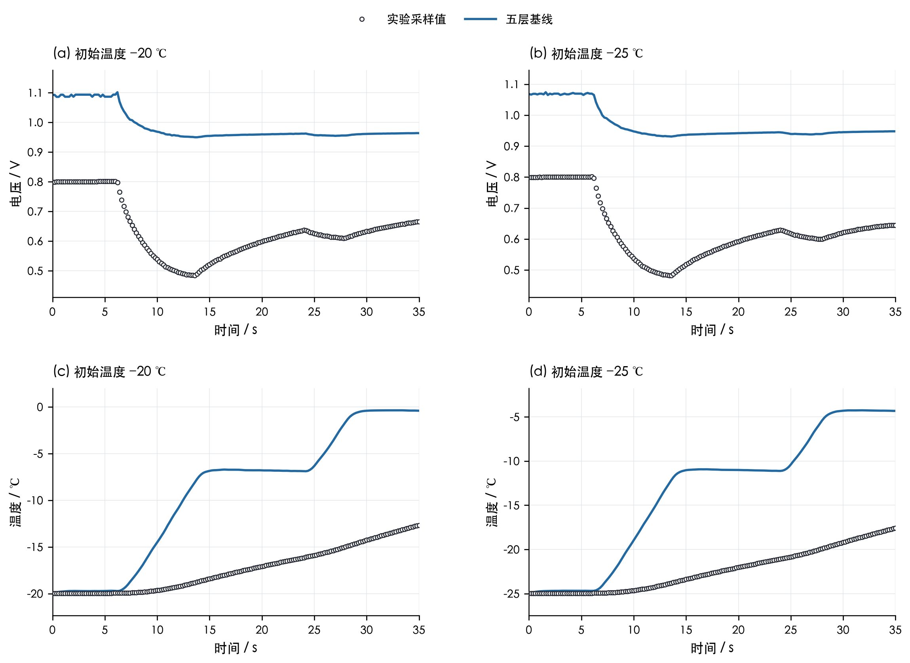

[矢量PDF](../figures/01_main_experiment_comparison.pdf)；数据：[main_minus20.csv](../data/main_minus20.csv)、[main_minus25.csv](../data/main_minus25.csv)。

### 02_bp_structural_comparison

五层基线与含双极板修订模型的电压、温度响应。BP 曲线为纳入双极板热容量后的修订计算结果，与五层基线分开表示。

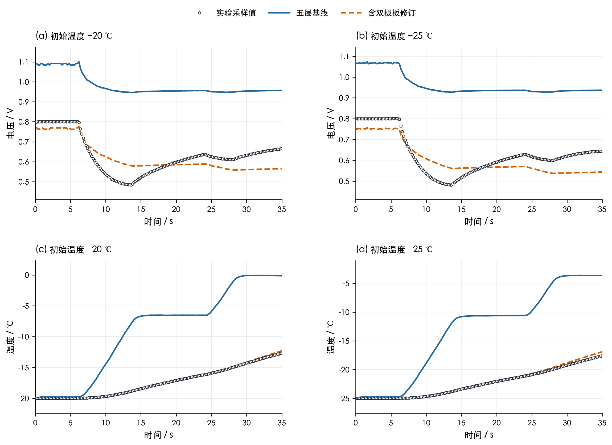

[矢量PDF](../figures/02_bp_structural_comparison.pdf)；数据：[main_minus20.csv](../data/main_minus20.csv)、[main_minus25.csv](../data/main_minus25.csv)、[bp_minus20.csv](../data/bp_minus20.csv)、[bp_minus25.csv](../data/bp_minus25.csv)。

### 03_sample_relative_errors

各采样时刻的电压与温度相对误差；温度按建模推导文件使用实验摄氏温度的绝对值作为分母；开尔文分母误差另存 CSV。

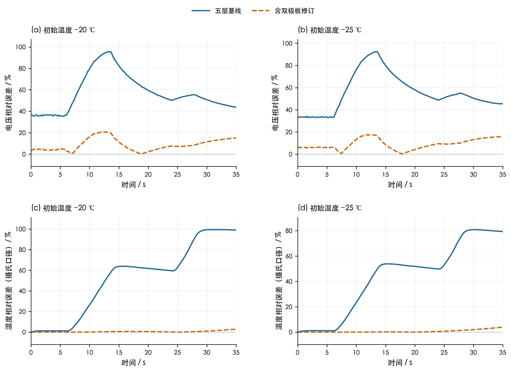

[矢量PDF](../figures/03_sample_relative_errors.pdf)；数据：[main_minus20.csv](../data/main_minus20.csv)、[main_minus25.csv](../data/main_minus25.csv)、[bp_minus20.csv](../data/bp_minus20.csv)、[bp_minus25.csv](../data/bp_minus25.csv)。

### 04_ice_fraction_saturation

四组计算的最大总冰、孔隙冰、膜相冰体积分数及最大孔隙冰饱和度。各最大值可位于不同空间位置。

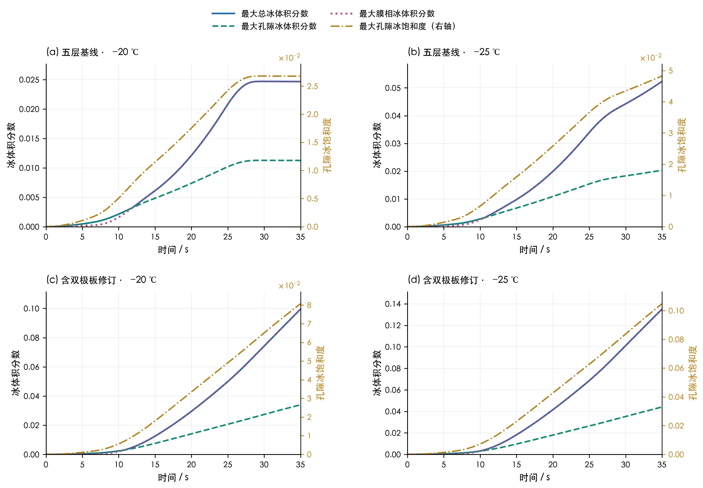

[矢量PDF](../figures/04_ice_fraction_saturation.pdf)；数据：[main_minus20.csv](../data/main_minus20.csv)、[main_minus25.csv](../data/main_minus25.csv)、[bp_minus20.csv](../data/bp_minus20.csv)、[bp_minus25.csv](../data/bp_minus25.csv)。

### 05_voltage_loss_decomposition

模型电压与活化、欧姆、浓差损失的堆叠分解；虚线表示可逆电压。

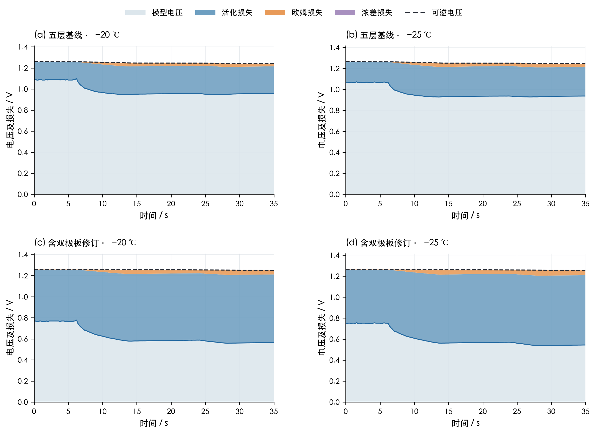

[矢量PDF](../figures/05_voltage_loss_decomposition.pdf)；数据：[main_minus20.csv](../data/main_minus20.csv)、[main_minus25.csv](../data/main_minus25.csv)、[bp_minus20.csv](../data/bp_minus20.csv)、[bp_minus25.csv](../data/bp_minus25.csv)。

### 06_bp_water_energy_balances

含双极板修订模型的累计水量、累计热量及守恒残差。储水变化扣除初始存水量；相变热正号表示放热。灰色点线残差采用各面板右轴单独刻度。

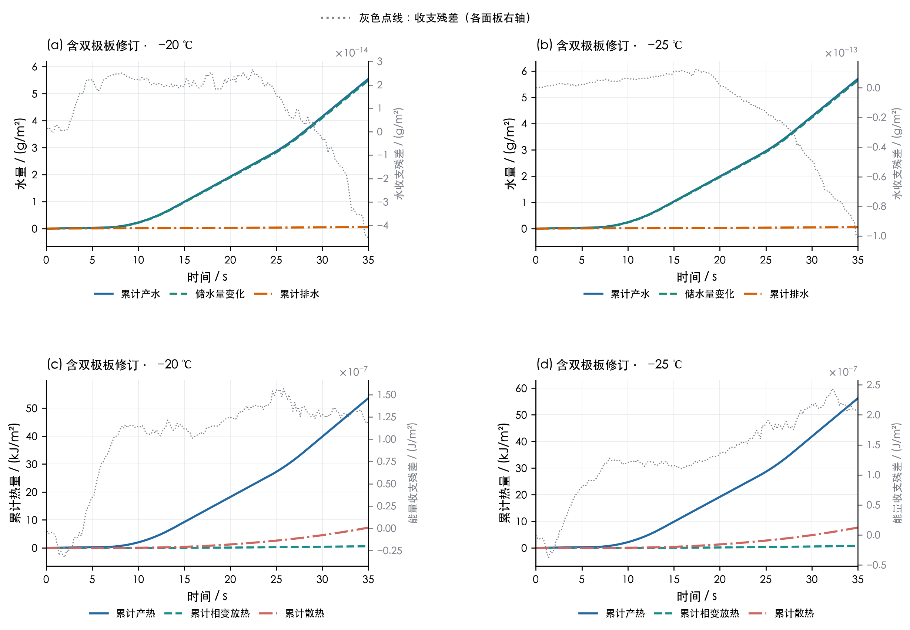

[矢量PDF](../figures/06_bp_water_energy_balances.pdf)；数据：[bp_minus20.csv](../data/bp_minus20.csv)、[bp_minus25.csv](../data/bp_minus25.csv)。

### 07_main_spacetime_fields

五层基线局部温度与总冰体积分数时空分布。虚线表示计算层界面；同一行采用统一色标。

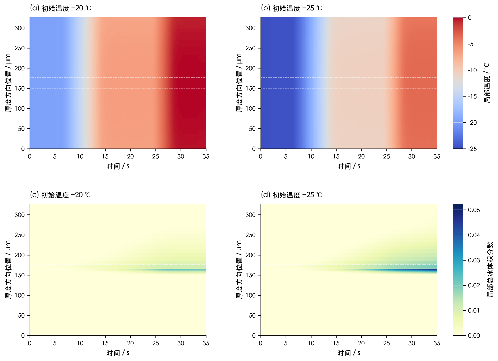

[矢量PDF](../figures/07_main_spacetime_fields.pdf)；数据：[fields_main_minus20.csv](../data/fields_main_minus20.csv)、[fields_main_minus25.csv](../data/fields_main_minus25.csv)。

### 08_bp_spacetime_fields

含双极板修订模型局部温度与总冰体积分数时空分布。虚线表示计算层界面；同一行采用统一色标。双极板修订模型温度图显示整域，冰图显示 MEA 区域。

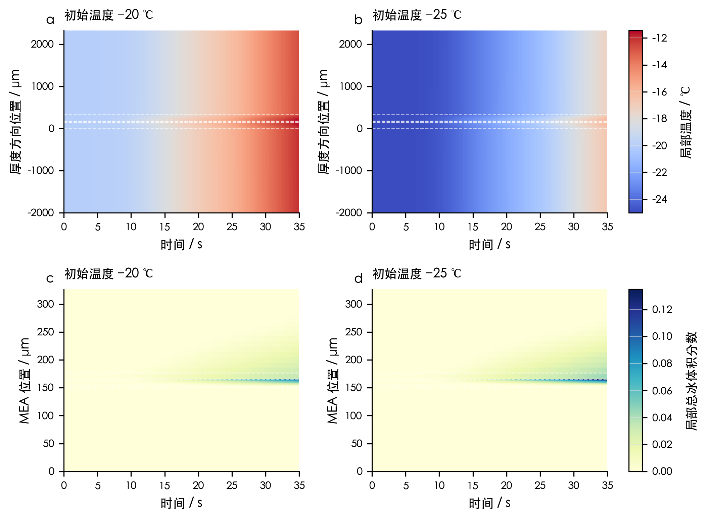

[矢量PDF](../figures/08_bp_spacetime_fields.pdf)；数据：[fields_bp_minus20.csv](../data/fields_bp_minus20.csv)、[fields_bp_minus25.csv](../data/fields_bp_minus25.csv)。

### 09_freezing_identifiability

冻结系数剖面：每个固定 kf 仅用−20℃重新拟合 j0，再预测−25℃。所有曲线采用粗网格和0.05 s步长，不能与正式细网格末位混比；竖线表示固定基准kf=1。剖面用于判断参数非唯一性，不是置信区间。

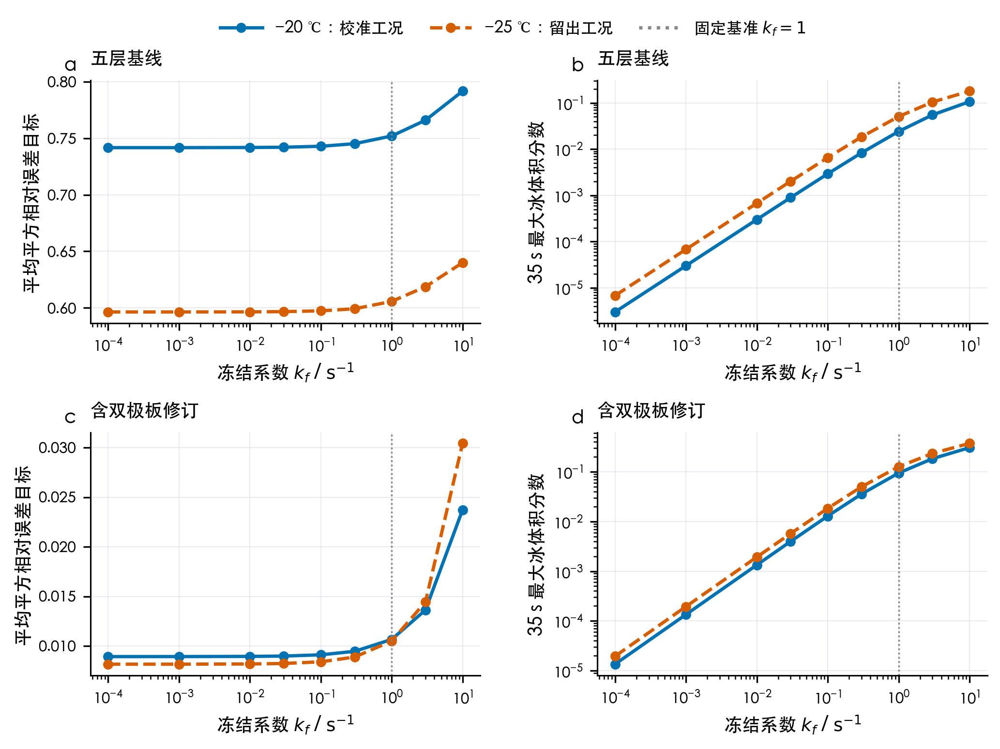

[矢量PDF](../figures/09_freezing_identifiability.pdf)；数据：[冻结系数剖面.csv](../data/冻结系数剖面.csv)。

### 10_phase_coefficient_sensitivity

六相变系数按完全相同的0.1倍/10倍扰动规则逐一检验，j0保持正式校准值。数字为两种扰动的最大绝对影响；V、T取全时段最大差，冰取35 s最大冰体积分数差并换算为百分点。所有敏感性轨迹及各自基准采用同网格、0.025 s步长。零影响仅表明本工况/窗口内没有激活或影响低于数值输出精度，不证明参数普遍不重要。

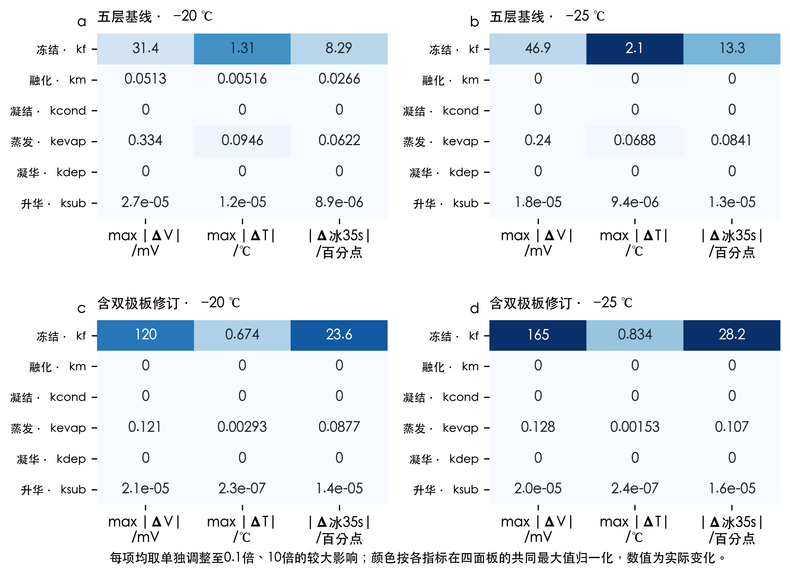

[矢量PDF](../figures/10_phase_coefficient_sensitivity.pdf)；数据：[参数与闭合敏感性.csv](../data/参数与闭合敏感性.csv)。

### 11_phase_cumulative_amounts

冻结、融化、凝结、蒸发、凝华、升华六通道的累计转化水量，均为模型输出。各面板纵轴独立；全零通道明确标注未激活。累计相变量允许同一份水反复转化，不能相加当作互斥水库存，也不能直接除以产水解释为冻结概率。

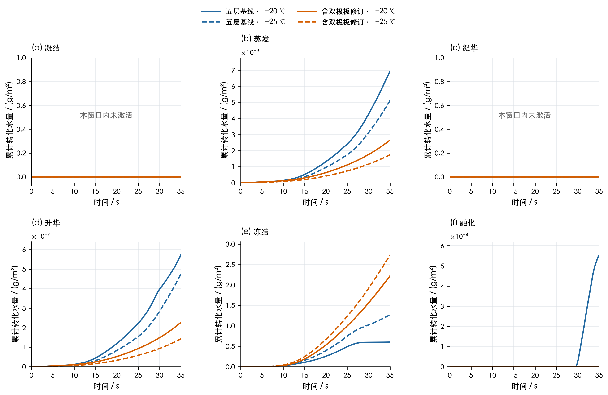

[矢量PDF](../figures/11_phase_cumulative_amounts.pdf)；数据：[main_minus20.csv](../data/main_minus20.csv)、[main_minus25.csv](../data/main_minus25.csv)、[bp_minus20.csv](../data/bp_minus20.csv)、[bp_minus25.csv](../data/bp_minus25.csv)。

### 12_near_optimal_ice_scenarios

仅由−20℃校准目标挑选不超过扫描最小值1.05倍的离散冻结情景，原样应用于−25℃，阴影为逐采样时刻最小/最大值。5%是工程误差容差而非统计显著性，范围不是置信区间，亦不是全部物理不确定性；1%/10%阈值另存CSV。橙色参考与阴影同采用粗网格0.05 s，正式主解另见图04。

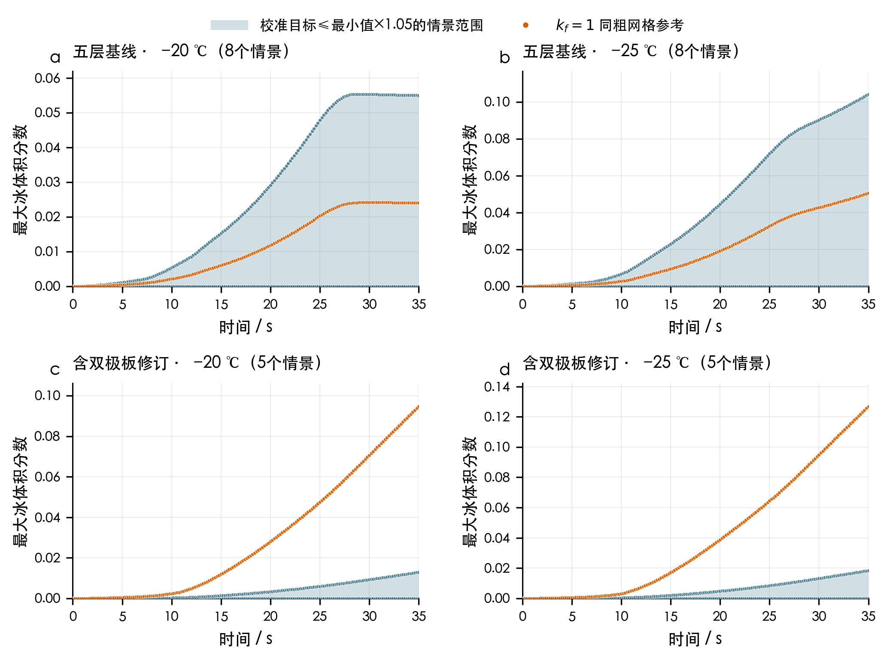

[矢量PDF](../figures/12_near_optimal_ice_scenarios.pdf)；数据：[近优冻结情景范围_非置信区间.csv](../data/近优冻结情景范围_非置信区间.csv)、[冻结系数情景全时序.csv](../data/冻结系数情景全时序.csv)、[近优阈值敏感性.csv](../data/近优阈值敏感性.csv)。

## 11. 文件索引与可复现性

运行方式见[README](../README.md)。生成顺序为求解、绘图、报告与独立核验；所有数字从本轮CSV生成，没有沿用旧报告的校准数值或“kf触底”主解结论。

| CSV文件 | 用途 |
| --- | --- |
| [bp_minus20.csv](../data/bp_minus20.csv) | 完整英文时序，含相变质量/速率/热/冰预算 |
| [bp_minus25.csv](../data/bp_minus25.csv) | 完整英文时序，含相变质量/速率/热/冰预算 |
| [calibration_trace_bp.csv](../data/calibration_trace_bp.csv) | j₀校准每次模型评估日志 |
| [calibration_trace_main.csv](../data/calibration_trace_main.csv) | j₀校准每次模型评估日志 |
| [fields_bp_minus20.csv](../data/fields_bp_minus20.csv) | 所有采样时刻各空间单元的局部状态 |
| [fields_bp_minus25.csv](../data/fields_bp_minus25.csv) | 所有采样时刻各空间单元的局部状态 |
| [fields_main_minus20.csv](../data/fields_main_minus20.csv) | 所有采样时刻各空间单元的局部状态 |
| [fields_main_minus25.csv](../data/fields_main_minus25.csv) | 所有采样时刻各空间单元的局部状态 |
| [main_minus20.csv](../data/main_minus20.csv) | 完整英文时序，含相变质量/速率/热/冰预算 |
| [main_minus25.csv](../data/main_minus25.csv) | 完整英文时序，含相变质量/速率/热/冰预算 |
| [五层基线_minus20_0至35秒全部采样数据.csv](../data/五层基线_minus20_0至35秒全部采样数据.csv) | 单工况中文全部176采样数据 |
| [五层基线_minus20_每5秒结果表.csv](../data/五层基线_minus20_每5秒结果表.csv) | 第一问每5秒结果表 |
| [五层基线_minus25_0至35秒全部采样数据.csv](../data/五层基线_minus25_0至35秒全部采样数据.csv) | 单工况中文全部176采样数据 |
| [五层基线_minus25_每5秒结果表.csv](../data/五层基线_minus25_每5秒结果表.csv) | 第一问每5秒结果表 |
| [五层基线_两工况352行工作数据.csv](../data/五层基线_两工况352行工作数据.csv) | 两工况合并中文工作数据 |
| [冻结系数剖面.csv](../data/冻结系数剖面.csv) | 固定kf、仅−20℃重估j₀及−25℃验证 |
| [冻结系数情景全时序.csv](../data/冻结系数情景全时序.csv) | 各冻结剖面情景的全部采样与收支 |
| [原始数据与单位审计.csv](../data/原始数据与单位审计.csv) | 电流密度输入及面积冲突审计 |
| [参数与闭合敏感性.csv](../data/参数与闭合敏感性.csv) | 六系数统一扰动、共同时间尺度与结构闭合敏感性 |
| [含双极板修订_minus20_0至35秒全部采样数据.csv](../data/含双极板修订_minus20_0至35秒全部采样数据.csv) | 单工况中文全部176采样数据 |
| [含双极板修订_minus20_每5秒结果表.csv](../data/含双极板修订_minus20_每5秒结果表.csv) | 第一问每5秒结果表 |
| [含双极板修订_minus25_0至35秒全部采样数据.csv](../data/含双极板修订_minus25_0至35秒全部采样数据.csv) | 单工况中文全部176采样数据 |
| [含双极板修订_minus25_每5秒结果表.csv](../data/含双极板修订_minus25_每5秒结果表.csv) | 第一问每5秒结果表 |
| [含双极板修订_两工况352行工作数据.csv](../data/含双极板修订_两工况352行工作数据.csv) | 两工况合并中文工作数据 |
| [最终交付独立核验.csv](../data/最终交付独立核验.csv) | 全采样、相变速率、场均值及预算的独立重算 |
| [热容与面积诊断.csv](../data/热容与面积诊断.csv) | 实测值驱动的独立结构诊断 |
| [相变参数来源与处理.csv](../data/相变参数来源与处理.csv) | 六系数来源、参考时间及新增闭合 |
| [相变敏感性全时序.csv](../data/相变敏感性全时序.csv) | 所有敏感性情景的逐采样状态 |
| [相变输出独立核验.csv](../data/相变输出独立核验.csv) | 全部正式/敏感性/剖面轨迹、速率积分、产水和冰热收支独立核验 |
| [网格与时间步收敛.csv](../data/网格与时间步收敛.csv) | 四工况独立网格、步长及同时细化 |
| [近优冻结情景范围_非置信区间.csv](../data/近优冻结情景范围_非置信区间.csv) | 5%工程容差筛选后的逐时刻范围，非置信区间 |
| [近优阈值敏感性.csv](../data/近优阈值敏感性.csv) | 1%、5%、10%工程容差比较，非置信区间 |
| [退化与守恒测试.csv](../data/退化与守恒测试.csv) | 六通道单独激活与质量/潜热/退化测试 |
| [附件1参数原值.csv](../data/附件1参数原值.csv) | 附件参数原值及行号 |

环境、校准参数及追溯文件：[calibration_bp.json](../data/calibration_bp.json)；[calibration_main.json](../data/calibration_main.json)；[summary.json](../data/summary.json)；[运行记录与来源哈希.json](../data/运行记录与来源哈希.json)。

主要限制：共同1 s参考时间、共享冻结系数、固定膜不可冻水阈值、CL膜水交换及温度测量算子的对应均待独立证据约束。改进后可以审查相变预算与参数敏感性，但没有将模型冰量变成实测量。