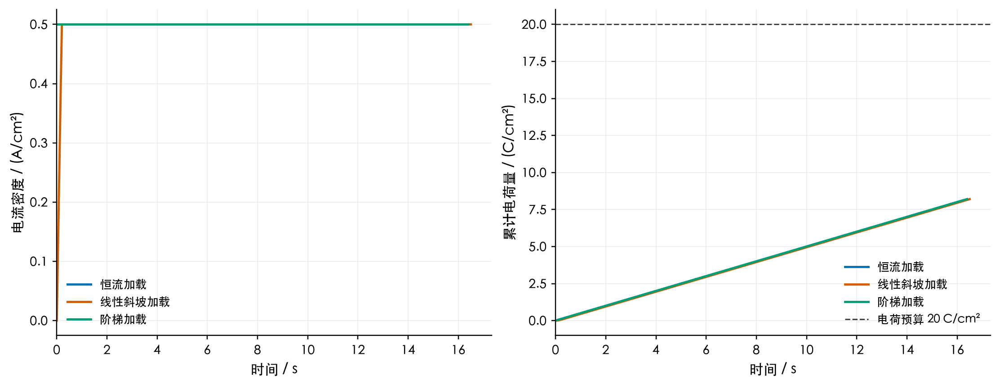
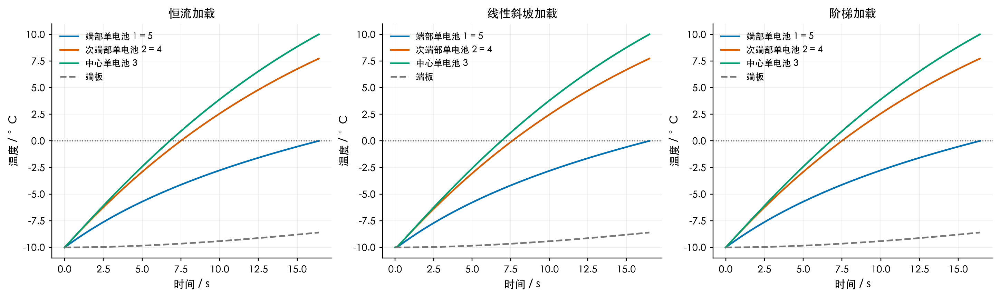
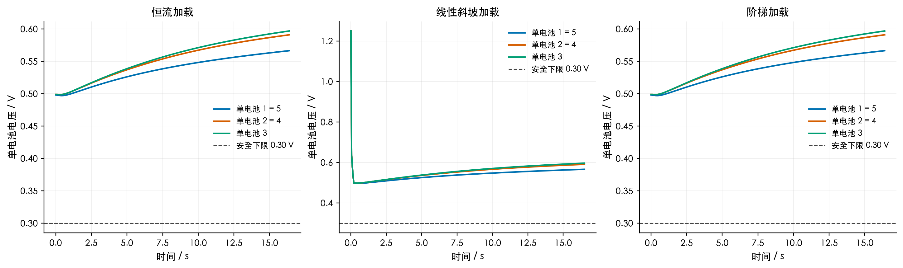
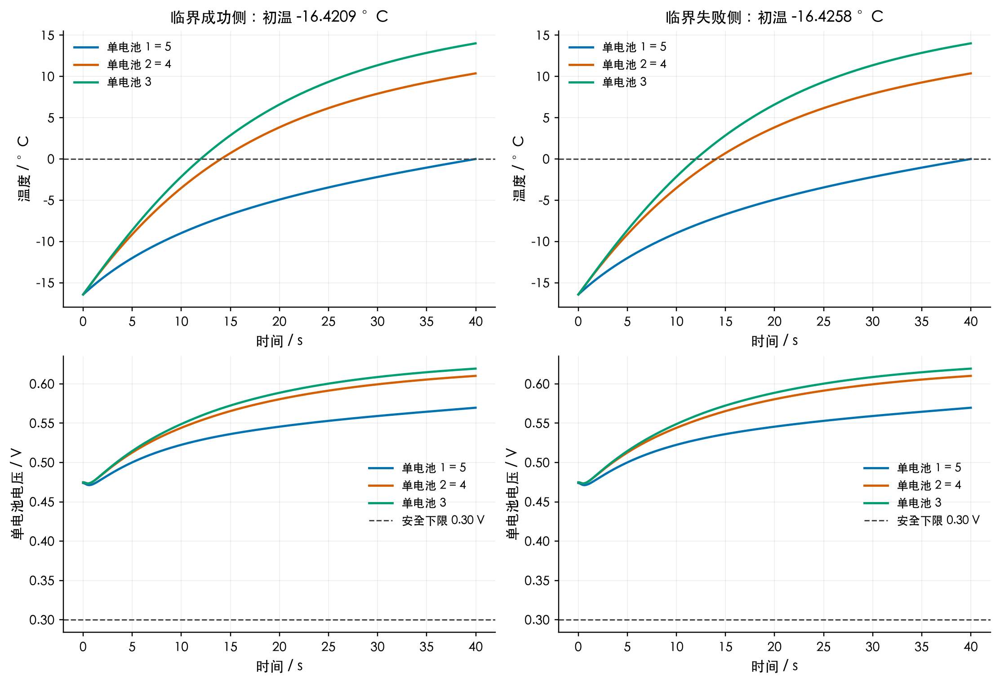
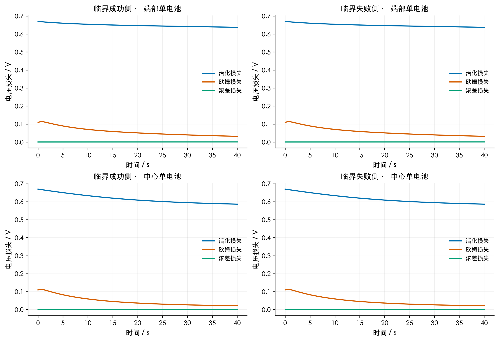
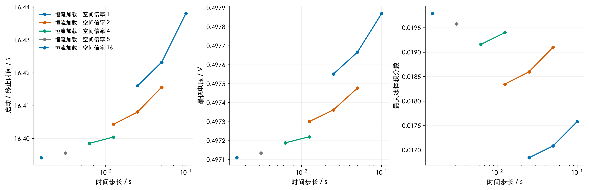
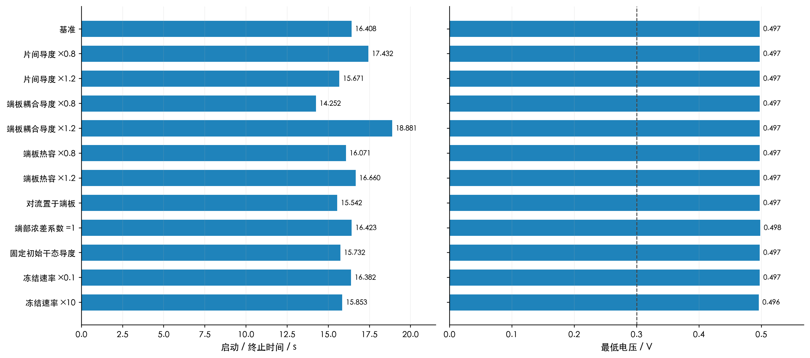

# 问题2 电堆自冷启动优化计算结果

本报告完成第二问的两项任务：在−10 ℃比较恒流、线性升载、三段阶梯；在相同20 C/cm²电荷预算和0.5 A/cm²电流上限下确定可自启动初温边界，并定位失败电池。结果来自用户MD框架与已有问题一含双极板标定模型的耦合求解，属于该模型及相变闭合假设下的条件预测。

本次已修正共享极板重复计数：五个MEA对应四块内部共用板及两块外侧终端流场板，各厚2 mm；共用板热容各半分配给相邻电池。端部节点的板热容为4550.04，中间节点为3033.36 J/(m²·K)，整堆板热容为18200.16 J/(m²·K)。片间导热只穿过一块2 mm板，MEA中心节距为2.3267 mm。所有策略搜索、工作数据、临界温度、收敛与敏感性结果均基于此修正重算。相变参数和对流边界沿用原定义。

## 1 表3 最优策略比较

| 加载策略 | 最优加载参数 | 启动时间 / s | 累计电荷 / C·cm⁻² | 最大电流 / A·cm⁻² | 最低电压 / V | 最大冰体积分数 | 结果 |
|---|---|---|---|---|---|---|---|
| 恒流 | j=0.5 | 16.3956 | 8.19782 | 0.500 | 0.497135 | 0.019578 | 成功 |
| 线性升载（有限范围） | a=2.5，jp=0.5，tp=0.2 s | 16.5021 | 8.20104 | 0.500 | 0.497143 | 0.019598 | 成功 |
| 三段阶梯（退化） | j1=j2=j3=0.5；t1=8 s，t2=16 s | 16.3956 | 8.19782 | 0.500 | 0.497135 | 0.019578 | 成功 |

加载参数的电流单位为A/cm²，斜率单位为A/(cm²·s)。最大冰体积分数取整个启动期间、五片电池所有MEA网格的最大值，**包含膜冰**，并非孔隙冰饱和度。恒流下仅多孔层最大冰体积分数为0.007373，最大孔隙冰饱和度为0.017525，两者另存于表3 CSV。

恒流搜索得到j=0.5；三段阶梯允许电流相等，故最优控制退化为同一条恒流曲线。t1=8 s和t2=16 s只是等价表示，三档相等时切换时刻不影响物理控制，不能把它们解释为可识别的唯一最优参数。

**线性升载的最优性需要限定。** 题目没有给斜率上限，MD中的t_min也未指定。有限参数搜索采用平台到达时间tp∈[0.2,120] s，平台电流jp≤0.5；所得边界解a=2.5、jp=0.5对应0.2 s升满载。`ramp_slope_limit.csv`继续计算tp=0.1、0.05、0.02、0.01 s，结果趋近恒流。因而2.5不是原题无限斜率范围的全局最优斜率；在本次搜索观察下，从零升载的启动时间下确界趋近16.3956 s。若要求三种曲线必须严格不同，需额外规定斜率上限或最小档差，原题没有这些约束。

本模型下−10 ℃满载最低电压仍为0.497135 V，电压裕度约0.197 V，冰占孔也很小。因此优化首要效果是尽早产热，降低端板吸热和环境散热的累计损失。原MD关于“先低后高严格优于恒流”的推断在当前参数下没有得到计算支持。

## 2 第二小问 最低初始温度

恒流及等价阶梯策略的临界初温位于 **(-16.425781, -16.420898] ℃**，数值上约为 **-16.4 ℃**。这里冷端是预算耗尽前未达到启动条件的初温，暖端是已找到成功轨迹的初温；区间宽度为0.004883 ℃。

| 策略 | 失败侧初温 / ℃ | 成功侧初温 / ℃ |
|---|---|---|
| 恒流 | -16.425781 | -16.420898 |
| 线性升载（有限范围） | -16.425781 | -16.420898 |
| 三段阶梯（退化） | -16.425781 | -16.420898 |

搜索先在−10、−11、−12、−12.5、−12.75、−13、−14、−16、−20 ℃逐点重新优化三类策略，再对已优化曲线二分，并在更细网格上复核分界两侧。所检查的成功工况中，最优加载仍趋向满载恒流；失败工况保留最小惩罚评分候选，仅表示未找到可行解，不将它解释为最优启动策略。该区间是给定模型与所搜索策略空间的可行边界，不构成对任意无限维电流控制的全局不可行性证明；实际模型误差和参数不确定性远大于0.005 ℃的二分分辨率，不宜把这些小数当成实物测温精度。

### 2.1 首要失效是端部能量不足

临界失败侧T0=-16.425781 ℃，电荷达到20.000000 C/cm²时，端部最低温度仍为-0.001425 ℃，全程最低电压0.471291 V。

以更清楚的-18 ℃工况为例，0.5 A/cm²在40 s耗尽20 C/cm²电荷，端部1、5温度仍为-1.5527 ℃，中部3已升到12.4066 ℃。全程最低电压0.464365 V，最大孔隙冰饱和度0.099345，均未达到电压或孔隙堵塞失效。因此关键电池为**两端第1和第5片**，直接失败原因是**电荷预算耗尽时仍未越过0 ℃**。

端部必须向大热容端板供热，并承担对流散热；中间电池没有这两项边界负担。冰量增加和损失变化存在，但在临界点附近没有成为先触发的硬约束，不能将该失败写成“电压率先跌破0.30 V”。

| -18 ℃终止时位置 | 温度 / ℃ | 电压 / V | 活化损失 / V | 欧姆损失 / V | 浓差损失 / V | 最大冰体积分数 |
|---|---|---|---|---|---|---|
| 端部1和5 | -1.552689 | 0.559375 | 0.646002 | 0.035676 | 0.001253 | 0.152387 |
| 次端部2和4 | 8.740558 | 0.605218 | 0.603512 | 0.024352 | 0.000126 | 0.023924 |
| 中部3 | 12.406575 | 0.615040 | 0.592058 | 0.022743 | 0.000127 | 0.014832 |

## 3 模型与算法

详见[算法模型与代码说明](算法模型与代码说明.md)。热网络有五个单片温度和两个端板温度；每片内部仍用一维有限体积求解膜水、液水、水蒸气、冰、氢气和氧气。温度反馈相变与电化学，再由实际电压与潜热更新热源，未重放实验温度、电压或固定单片热源。

空间输运与热网络采用后向欧拉，热源用Picard迭代收敛。利用镜像对称求解三个独立单片状态和四个独立温度，按[2,2,1]和两块端板权重计算整堆预算。电荷按策略解析积分；成功事件通过当前时间步重新积分并二分定位，不允许越过20 C/cm²后仍继续用电。

外层采用恒流网格加有界标量优化、升载与阶梯差分进化多种子搜索加Powell局部精修。已保存7087条候选评估，成功/失败、参数、目标、硬约束指标均可追溯。失败轨迹记录终止时间而不标成启动时间。所有“最优”均为已定义搜索范围内发现的最优可行解，没有全局解析最优证书。

## 4 数值核验和精度

正式表3使用每片232个输运网格、时间步0.003125 s，轨迹CSV通常按0.05 s输出并保留初末、切换和极值行；路径最小电压、最大冰量仍在每个内部积分步统计。进一步使用464个网格、0.0015625 s核验，恒流启动时间变化0.001473 s，最大冰体积分数变化1.070%。冰量比启动时间更敏感，报告六位小数便于复核，不表示六位有效物理精度。

极板六板总库存、端/中热容分配和单板厚度导度均通过独立核算。模型独立核验32项、最终CSV独立核验28项，共60项全部通过。加速内核与已有问题一的同温度输运、电化学和物性逐项对照误差在约10⁻¹³量级；完整七节点与对称降维热解一致。最终CSV核验另覆盖解析电荷、路径极值、成功条件、五片导出对称性及最细网格临界两侧状态。正式恒流累计热量残差2.934e-09 J/m²，水量残差4.688e-14 kg/m²。上述守恒是所采用离散模型的收支闭合，不等于证明经验闭合在实物上准确。

## 5 来源与局限

几何与物性来自附件1。j0继承已有含双极板问题一标定，只有j0被拟合；−25 ℃留出验证已有电压RMSE约0.06077 V、温度RMSE约0.23226 K。校准文件与当前参考源码经换行符规范化后哈希一致。这里的温度集中化是第二问MD的降阶假设，并未用附件2重新辨识热网络。

附件2的总电流与电流密度不能同时按25 cm²解释；本次沿用旧标定使用的电流密度列，完整差异见`附件2电流单位核验.csv`。相变参数原始单位是无量纲权重，转成时间率依赖参考时间1 s；冻结速率、热网络参数和对流边界位置均做敏感性检查，详见`sensitivity.csv`，不能把计算边界视为不依赖这些假设的实验结论。

敏感性计算统一使用58个输运网格/片、Δt=0.025 s，表中显式记录grid_scale=2和dt_s；其基准启动时间与正式232网格结果略有离散差异，应在敏感性表内部比较。

完整MD修正见[推导核验](MD推导核验.md)。原题、附件和同步修订后的MD保存在inputs；原路径的建模推导、代码、工作数据及图表已覆盖更新。本次物理模型修改仅涉及共享极板计数、节点极板热容、片间极板热阻与节距；水、冰、电化学参数、端板热容及原对流边界保持原定义。

## 6 全部图表与数据索引

| 图表 | PNG | PDF | 数据来源 |
|---|---|---|---|
| 最优加载策略与电荷消耗 | [查看](../figures/01_加载策略与累计电荷.png) | [下载](../figures/01_加载策略与累计电荷.pdf) | [trajectory_constant.csv](../data/trajectory_constant.csv)、[trajectory_ramp.csv](../data/trajectory_ramp.csv)、[trajectory_step.csv](../data/trajectory_step.csv) |
| 轴向温度非均匀性 | [查看](../figures/02_各单电池与端板温度.png) | [下载](../figures/02_各单电池与端板温度.pdf) | [trajectory_constant.csv](../data/trajectory_constant.csv)、[trajectory_ramp.csv](../data/trajectory_ramp.csv)、[trajectory_step.csv](../data/trajectory_step.csv) |
| 全过程单电池电压 | [查看](../figures/03_各单电池电压与安全约束.png) | [下载](../figures/03_各单电池电压与安全约束.pdf) | [trajectory_constant.csv](../data/trajectory_constant.csv)、[trajectory_ramp.csv](../data/trajectory_ramp.csv)、[trajectory_step.csv](../data/trajectory_step.csv) |
| 总体积基准冰体积分数 | [查看](../figures/04_总体积基准冰体积分数.png) | [下载](../figures/04_总体积基准冰体积分数.pdf) | [trajectory_constant.csv](../data/trajectory_constant.csv)、[trajectory_ramp.csv](../data/trajectory_ramp.csv)、[trajectory_step.csv](../data/trajectory_step.csv) |
| 孔隙内冰占比与堵塞风险 | [查看](../figures/05_孔隙冰饱和度.png) | [下载](../figures/05_孔隙冰饱和度.pdf) | [trajectory_constant.csv](../data/trajectory_constant.csv)、[trajectory_ramp.csv](../data/trajectory_ramp.csv)、[trajectory_step.csv](../data/trajectory_step.csv) |
| 五片单电池与两块端板的全局热预算 | [查看](../figures/06_全局热预算与能量守恒.png) | [下载](../figures/06_全局热预算与能量守恒.pdf) | [trajectory_constant.csv](../data/trajectory_constant.csv)、[trajectory_ramp.csv](../data/trajectory_ramp.csv)、[trajectory_step.csv](../data/trajectory_step.csv) |
| 临界初温两侧的温度与电压 | [查看](../figures/07_最低启动温度两侧轨迹.png) | [下载](../figures/07_最低启动温度两侧轨迹.pdf) | [trajectory_critical_success.csv](../data/trajectory_critical_success.csv)、[trajectory_critical_failure.csv](../data/trajectory_critical_failure.csv) |
| 临界冷启动的电压损失构成 | [查看](../figures/08_临界启动电压损失分解.png) | [下载](../figures/08_临界启动电压损失分解.pdf) | [trajectory_critical_success.csv](../data/trajectory_critical_success.csv)、[trajectory_critical_failure.csv](../data/trajectory_critical_failure.csv) |
| 最低启动初温的数值搜索 | [查看](../figures/09_最低初温可行性搜索.png) | [下载](../figures/09_最低初温可行性搜索.pdf) | [temperature_search.csv](../data/temperature_search.csv) |
| 恒流最优方案的时间与空间离散收敛性 | [查看](../figures/10_时间空间离散收敛性.png) | [下载](../figures/10_时间空间离散收敛性.pdf) | [convergence.csv](../data/convergence.csv) |
| 参数与边界假设敏感性（蓝：成功；橙：失败） | [查看](../figures/11_参数与边界假设敏感性.png) | [下载](../figures/11_参数与边界假设敏感性.pdf) | [sensitivity.csv](../data/sensitivity.csv) |
| 升载时间趋零时的性能极限 | [查看](../figures/12_线性升载斜率极限.png) | [下载](../figures/12_线性升载斜率极限.pdf) | [ramp_slope_limit.csv](../data/ramp_slope_limit.csv) |
