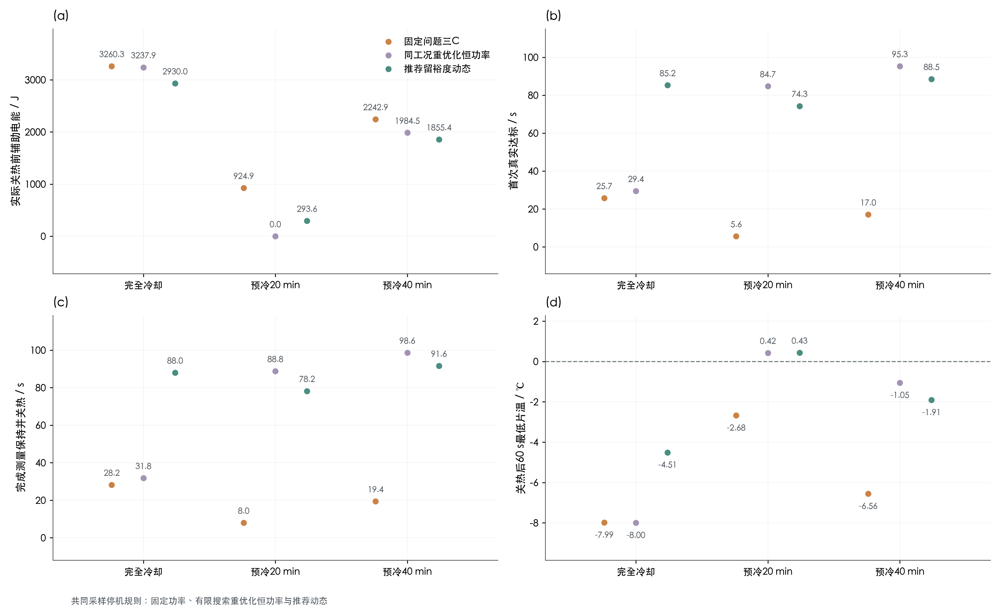
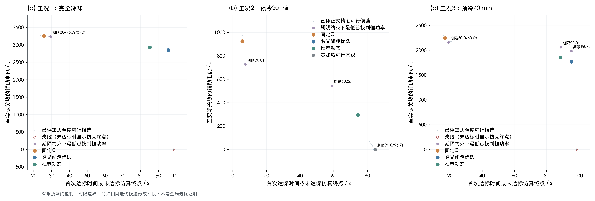
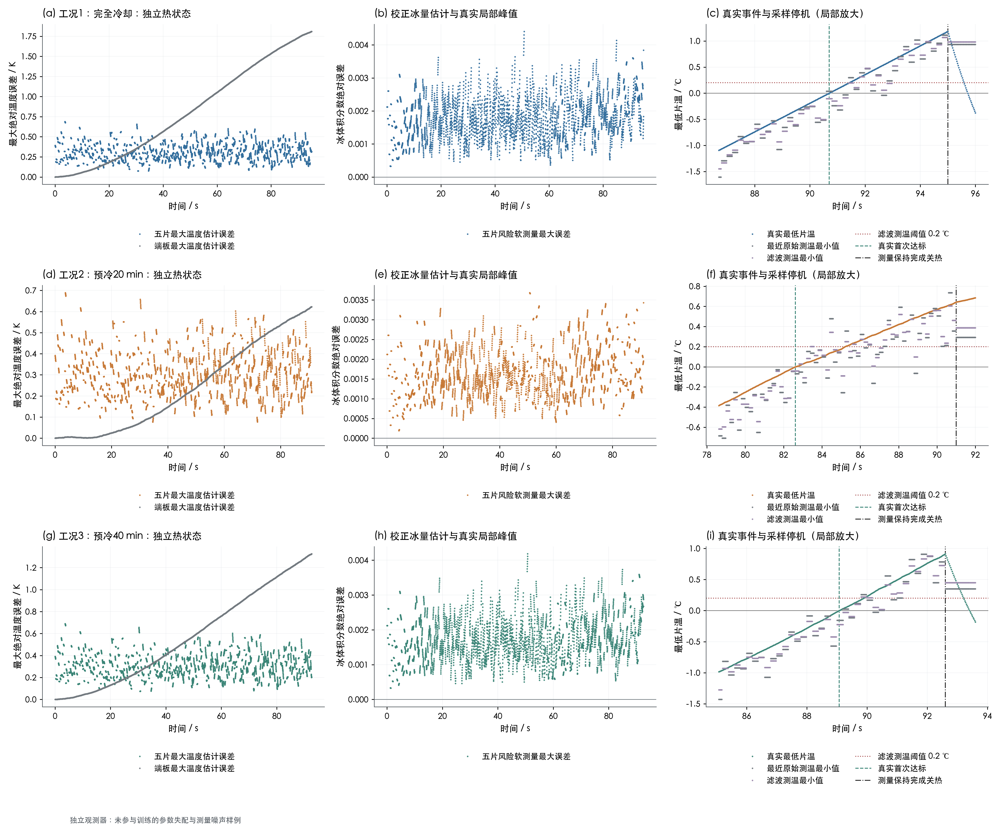

# 问题四：动态辅助加热控制与预冷过程——修订后的完整数值求解

本报告由本目录本轮重算的CSV自动生成。推荐结果为留温度与时间裕度的动态反馈方案；名义能耗优选、问题三固定恒功率、同工况重优化恒功率及失败候选分别保留。先报告可复核结果，再解释模型、求解过程和适用范围。全部结论只在已给物理模型、加载曲线、有限搜索及有限扰动试验范围内成立。

## 1. 结果概览与比较口径

工况1：完全冷却：推荐动态辅助电能2929.996 J；真实状态首次达标85.24438 s；传感反馈确认并关热88.00000 s。固定问题三功率按相同测量停机规则耗电3260.281 J，推荐动态能耗下降10.131%。推荐策略本工况独立扰动通过30/30次；名义可行性为是。

工况2：预冷20 min：推荐动态辅助电能293.609 J；真实状态首次达标74.30838 s；传感反馈确认并关热78.20000 s。固定问题三功率按相同测量停机规则耗电924.902 J，推荐动态能耗下降68.255%。推荐策略本工况独立扰动通过30/30次；名义可行性为是。

工况3：预冷40 min：推荐动态辅助电能1855.385 J；真实状态首次达标88.53877 s；传感反馈确认并关热91.60000 s。固定问题三功率按相同测量停机规则耗电2242.888 J，推荐动态能耗下降17.277%。推荐策略本工况独立扰动通过30/30次；名义可行性为是。

### 表1 推荐策略数值概览

| 工况 | 推荐动态能耗_J | 固定恒功率能耗_J | 相对固定C节能率_pct | 动态首次达标_s | 动态关热_s | 动态可行 | 独立验证通过 | 独立验证总数 |
| --- | --- | --- | --- | --- | --- | --- | --- | --- |
| 工况1：完全冷却 | 2929.99649 | 3260.28065 | 10.13054 | 85.24438 | 88 | 是 | 30 | 30 |
| 工况2：预冷20 min | 293.60883 | 924.90231 | 68.25515 | 74.30838 | 78.2 | 是 | 30 | 30 |
| 工况3：预冷40 min | 1855.38499 | 2242.88811 | 17.27697 | 88.53877 | 91.6 | 是 | 30 | 30 |

名义能耗优选方案在原噪声/初场试验组通过20/90次；推荐方案在独立种子组通过90/90次。不同种子组比例不是严格配对试验或数学鲁棒性证明。失败试验全部保留；失败时消耗的电能不能作为成功节能样本计算成功组均值。

关热后持续运行检验仍有限制：工况1：完全冷却、工况3：预冷40 min至少有一项持续暖态/电压/冰量标准未满足。本文的启动成功指规定的首次达标与测量保持过程完成，不能改写为关热后长期保持暖态。后验段不重新加热，完整最低温度与约束极值单独列示。

重新优化的恒功率类同样包含零功率。当该基准也达到0 J时，应理解为此工况在模型内可利用反应热自启动，不能把相对原固定C的100%辅助节电全部归因于动态反馈优势。

节约量仅指辅助电热丝电能。较慢启动会利用更多电化学反应热，并改变累计加载电荷；不能把辅助电能下降百分比直接解释为氢耗、净输出电能或全系统总能耗下降百分比。

## 2. 输入、模型修正及物理假设

### 输入参数与来源

| 扰动参数 | value | 单位 | source_or_assumption |
| --- | --- | --- | --- |
| active_area | 25 | cm2 | 题给 |
| ambient_temperature | -30 | degC | 题给 |
| initial_precooling_temperature | 25 | degC | 题给 |
| N_cell | 5 | 1 | 题给 |
| q_max | 1 | W/cm2 | 题给 |
| h | 40 | W/m2/K | 题给 |
| EP_capacity | 39500 | J/m2/K | 附件rho cp thickness |
| BP_capacity | 3033.36 | J/m2/K | 1980*766*.002 |
| BP_k | 95 | W/m/K | 附件1 |
| EP_k | 15 | W/m/K | 附件1 |
| J0 | 0.102558 | A/m2 | 继承问题1/2/3标定值；本问未重新拟合 |
| end_beta | 10 | 1 | 继承问题2/3端部浓差经验因子 |
| kf | 1 | 1/s | 继承问题1/2/3相变参考情景 |
| km | 1 | 1/s | 继承问题1/2/3相变参考情景 |
| kcond | 1 | 1/s | 继承问题1/2/3参考情景 |
| kevap | 1 | 1/s | 继承问题1/2/3参考情景 |
| kdep | 0.0001 | 1/s | 继承问题1/2/3参考情景 |
| ksub | 0.0001 | 1/s | 继承问题1/2/3参考情景 |
| lambda_initial_nonfreezing | 3 | 1 | 继承膜初始含水量及非冻结水假设 |
| MEA_initial_capacity | 50.22753 | J/m2/K | 启动有效物性；含孔隙/气体/膜水 |
| MEA_initial_resistance | 0.00281 | m2 K/W | 启动有效物性；含孔隙/气体/膜水 |
| G_cell_initial | 353.16698 | W/m2/K | 由启动物性推得 |
| voltage_safe | 0.3 | V | 题给式8 |
| ice_critical | 0.99 | bulk fraction | 题给式7 |
| load_ramp | 0.005 | A/cm2/s | 题给 |
| load_plateau | 0.3 | A/cm2 | 题给 |
| charge_budget | 20 | C/cm2 | 按问题3建模继承解释 |
| horizon | 96.66667 | s | 由电荷预算及加载积分推得 |
| hold | 2 | s | 用户建模文档的附加保持逻辑；固定并用于两策略共同比较 |
| dt | 0.025 | s | 本次数值设置 |
| control_period | 0.2 | s | 本次采样周期 |
| mesh_scale | 2 | 1 | 每片58个质量控制体；7个热节点 |
| post_stop_observation | 60 | s | 关热后后验观察，不计主表成本 |
| sensor_stop_margin | 0.2 | degC | 测量停机滤波温度裕度；本次数值设计 |
| energy_tie_band | 0.0005 | relative | 最小辅助能耗0.05%带内按首次时间及温差排序 |
| training_time_reserve | 2 | s | 推荐策略训练要求真实首次成功早于预算截止2s |
| training_stop_deadline | 94.66667 | s | 推荐策略训练还要求完成测量停机；相对最终允许窗口留4s |

预冷初态25 ℃，环境−30 ℃，两端真实外表面换热系数40 W/(m²·K)。结构为2块端板、6块共享双极板和5组MEA，每组MEA显式包含阳极GDL、阳极CL、膜、阴极CL和阴极GDL。两端电池分摊1.5块BP，中间电池分摊1块；端板保留独立节点，电熱丝面积每片25 cm²。

### 表2 关键逻辑修正

| 项目 | 实现 | 修正原因 |
| --- | --- | --- |
| 外法向边界 | 左端 kTₓ=h(T−Tₐ)，右端 −kTₓ=h(T−Tₐ) | 修正源文档(4.3)符号 |
| 半网格对流热阻 | g_b=(1/h+Δx/(2k))⁻¹ | 控制体中心不等于真实外表面 |
| BP共享与初温映射 | 按实际半片几何分配，热容加权投影 | 不重复计数且映射守恒 |
| 安全增强 | 先渐缩，再取max(q渐缩,q安全)，最后限幅 | 渐缩不能清零安全增强 |
| 停机锁存 | 测量条件连续成立后停机，之后q恒为0 | 避免成功后重新加热 |
| 真实事件与测量停机 | 真实首次事件仅用于评价；停机由采样观测决定 | 明确可实施的反馈信息范围 |
| 能耗窗口 | 分别保存首次真实达标和实际关热电能 | 共同测量保持策略才可直接比较 |
| 时间预算 | 首次真实成功受预算约束，实际关热允许额外保持时间 | 不把2 s保持误算入首次成功预算 |
| 零时刻判据 | 初态已满足首次条件则t_s=0、E_first=0 | 修复10 min扫描的虚假加热 |
| 有限优化与扰动 | 保存搜索域、候选、失败率和关热后状态 | 不宣称未经证明的全局最优或硬安全保证 |

预冷名义整堆单位面积热容由附件原值求得97503.9583000 J/(m²·K)。启动内核采用孔隙、气体、离聚物及膜含水量修正的有效热物性；两阶段热容近似并非完全相同。启动初态由预冷温度映射得到，不将两套近似混称为同一绝对焓模型。预冷散热位于端板外表面；主启动沿用问题三端电池对流热网络，这一建模近似也保留说明。

启动统一电流为j(t)=min(0.005t,0.3) A/cm²。水相、气体传输、电压和产热继承问题三校准内核；启动前自由液水与冰为0，膜保留λ=3的结合水。吹扫不意味着质子传导所需膜含水量也置零。题给阈值与材料值、前序校准参数、为计算引入的搜索边界在输入清单中区分。

## 3. 预冷方程、完整温度场与初始条件

```text
C_i dT_i/dτ = g_(i−1/2)(T_(i−1)−T_i)+g_(i+1/2)(T_(i+1)−T_i)
C_i=(ρc_p)_iΔx_i；g_(i+1/2)=[Δx_i/(2k_i)+Δx_(i+1)/(2k_(i+1))]⁻¹
两端增加g_b(T_amb−T_i)，g_b=(1/h+Δx/(2k))⁻¹
u=T−T_amb；(C/Δτ+L)u^(m+1)=(C/Δτ)u^m
T_node = Σ_(CV属于node) C_i T_i / Σ_(CV属于node) C_i
```

模型包含33个材料区、146个控制体，总厚度33.6335000 mm。后向欧拉正式步长0.25 s，要求时刻精确落点。空间场所有控制体温度在precooling_fields.csv保存，包含位置、宽度、物性和节点归属；热容加权、厚度加权、七节点算术平均分别保存。

### 表3 三工况七节点初温与全场极值

| 工况 | 预冷/min | 左端板均温/℃ | 电池1均温/℃ | 电池2均温/℃ | 电池3均温/℃ | 电池4均温/℃ | 电池5均温/℃ | 右端板均温/℃ | 热容加权均温/℃ | 全场温差/K | 五片初始温差/K |
| --- | --- | --- | --- | --- | --- | --- | --- | --- | --- | --- | --- |
| 工况1：完全冷却 | -1 | -30 | -30 | -30 | -30 | -30 | -30 | -30 | -30 | 0 | 7.10543e-15 |
| 工况2：预冷20 min | 20 | -9.25541 | -9.08788 | -8.97901 | -8.94929 | -8.97901 | -9.08789 | -9.25544 | -9.21232 | 0.50698 | 0.138602 |
| 工况3：预冷40 min | 40 | -22.15913 | -22.0958 | -22.05465 | -22.04342 | -22.05465 | -22.09581 | -22.15914 | -22.14284 | 0.191624 | 0.052388 |

数据源：[initial_temperature_cases.csv](data/initial_temperature_cases.csv)；共 3 行，CSV保留工作精度。

### 三种均温与空间梯度定义

| 工况 | 热容加权均温/℃ | 厚度加权均温/℃ | 七节点算术均温/℃ | 全场最低温/℃ | 全场最高温/℃ | 中片−左端板/K | 左外表面/℃ | 右外表面/℃ | 堆级Bi |
| --- | --- | --- | --- | --- | --- | --- | --- | --- | --- |
| 工况1：完全冷却 | -30 | -30 | -30 | -30 | -30 | 3.55271e-15 | -30 | -30 | 0.139637 |
| 工况2：预冷20 min | -9.21232 | -9.16252 | -9.08485 | -9.45603 | -8.94905 | 0.306125 | -9.456 | -9.45603 | 0.139637 |
| 工况3：预冷40 min | -22.14284 | -22.12401 | -22.09466 | -22.23495 | -22.04333 | 0.115707 | -22.23494 | -22.23495 | 0.139637 |

数据源：[initial_temperature_cases.csv](data/initial_temperature_cases.csv)；共 3 行，CSV保留工作精度。

### 10–100 min全部预冷节点结果

| 预冷/min | 左端板均温/℃ | 电池1均温/℃ | 电池2均温/℃ | 电池3均温/℃ | 电池4均温/℃ | 电池5均温/℃ | 右端板均温/℃ | 热容加权均温/℃ | 全场温差/K | 五片初始温差/K |
| --- | --- | --- | --- | --- | --- | --- | --- | --- | --- | --- |
| 10 | 3.74232 | 4.01482 | 4.19191 | 4.24025 | 4.19191 | 4.0148 | 3.74227 | 3.81241 | 0.824633 | 0.225445 |
| 15 | -3.54305 | -3.32938 | -3.19053 | -3.15262 | -3.19053 | -3.32939 | -3.54308 | -3.48809 | 0.646586 | 0.176769 |
| 20 | -9.25541 | -9.08788 | -8.97901 | -8.94929 | -8.97901 | -9.08789 | -9.25544 | -9.21232 | 0.50698 | 0.138602 |
| 25 | -13.73441 | -13.60305 | -13.51769 | -13.49439 | -13.51769 | -13.60306 | -13.73444 | -13.70063 | 0.397517 | 0.108676 |
| 30 | -17.24635 | -17.14335 | -17.07641 | -17.05814 | -17.07641 | -17.14335 | -17.24636 | -17.21986 | 0.311688 | 0.085212 |
| 35 | -20.00001 | -19.91925 | -19.86677 | -19.85244 | -19.86677 | -19.91926 | -20.00002 | -19.97924 | 0.244391 | 0.066814 |
| 40 | -22.15913 | -22.0958 | -22.05465 | -22.04342 | -22.05465 | -22.09581 | -22.15914 | -22.14284 | 0.191624 | 0.052388 |
| 45 | -23.85206 | -23.80241 | -23.77015 | -23.76134 | -23.77015 | -23.80242 | -23.85207 | -23.83929 | 0.15025 | 0.041077 |
| 50 | -25.17948 | -25.14054 | -25.11525 | -25.10834 | -25.11525 | -25.14055 | -25.17948 | -25.16946 | 0.11781 | 0.032208 |
| 55 | -26.22028 | -26.18976 | -26.16992 | -26.16451 | -26.16992 | -26.18976 | -26.22029 | -26.21243 | 0.092373 | 0.025254 |
| 60 | -27.03637 | -27.01243 | -26.99688 | -26.99263 | -26.99688 | -27.01244 | -27.03637 | -27.03021 | 0.072429 | 0.019801 |
| 65 | -27.67625 | -27.65749 | -27.64529 | -27.64196 | -27.64529 | -27.65749 | -27.67625 | -27.67142 | 0.05679 | 0.015526 |
| 70 | -28.17798 | -28.16326 | -28.1537 | -28.15109 | -28.1537 | -28.16326 | -28.17798 | -28.17419 | 0.044529 | 0.012174 |
| 75 | -28.57137 | -28.55984 | -28.55234 | -28.55029 | -28.55234 | -28.55984 | -28.57137 | -28.56841 | 0.034914 | 0.009545 |
| 80 | -28.87983 | -28.87078 | -28.8649 | -28.8633 | -28.8649 | -28.87078 | -28.87983 | -28.8775 | 0.027376 | 0.007484 |
| 85 | -29.12169 | -29.11459 | -29.10999 | -29.10873 | -29.10999 | -29.1146 | -29.12169 | -29.11986 | 0.021465 | 0.005868 |
| 90 | -29.31133 | -29.30576 | -29.30215 | -29.30116 | -29.30215 | -29.30576 | -29.31133 | -29.3099 | 0.016831 | 0.004601 |
| 95 | -29.46002 | -29.45566 | -29.45282 | -29.45205 | -29.45282 | -29.45566 | -29.46002 | -29.4589 | 0.013197 | 0.003608 |
| 100 | -29.57661 | -29.57319 | -29.57097 | -29.57036 | -29.57097 | -29.57319 | -29.57661 | -29.57573 | 0.010347 | 0.002829 |

数据源：[precooling_nodes.csv](data/precooling_nodes.csv)；共 19 行，CSV保留工作精度。

慢模态时间常数为1233.256479 s（20.554275 min）；它与C_tot/(2h)的集总近似接近但不完全相同。半堆热阻包含端板、3块BP和2.5组MEA，基准Bi=0.13963743。温差必须按实际统计口径报告，不能将五片节点温差代替含表面的全场温差。

### 预冷慢模态与初态激发幅值

| 模态 | 特征值/s⁻¹ | 时间常数/s | 当前初场最大激发幅值/K |
| --- | --- | --- | --- |
| 1 | -0.000811 | 1233.25648 | 55.69447 |
| 2 | -0.008568 | 116.71122 | 4.13597e-05 |
| 3 | -0.106717 | 9.37056 | 0.863719 |
| 4 | -0.286451 | 3.49099 | 2.18530e-05 |
| 5 | -0.357023 | 2.80094 | 0.249055 |
| 6 | -0.46932 | 2.13074 | 1.03542e-05 |
| 7 | -0.769579 | 1.29941 | 0.082736 |
| 8 | -1.05745 | 0.945673 | 1.75923e-06 |
| 9 | -1.34871 | 0.741452 | 0.073108 |
| 10 | -1.3519 | 0.739699 | 0.000407 |

数据源：[precooling_slow_modes.csv](data/precooling_slow_modes.csv)；共 10 行，CSV保留工作精度。

### 映射后的节点热容

| 节点 | 单位面积热容/J·m⁻²·K⁻¹ | 节点总热容/J·K⁻¹ |
| --- | --- | --- |
| T1_C | 4610.79966 | 11.527 |
| T2_C | 3094.11966 | 7.7353 |
| T3_C | 3094.11966 | 7.7353 |
| T4_C | 3094.11966 | 7.7353 |
| T5_C | 4610.79966 | 11.527 |
| TEL_C | 39500 | 98.75 |
| TER_C | 39500 | 98.75 |

数据源：[precooling_node_capacities.csv](data/precooling_node_capacities.csv)；共 7 行，CSV保留工作精度。


全场温度与局部梯度。下载：[PDF](figures/图01_预冷温度场族.pdf)、[可编辑 SVG](figures/图01_预冷温度场族.svg)、[300 dpi PNG](figures/图01_预冷温度场族.png)。


三种温差定义与随预冷时间的变化。下载：[PDF](figures/图02_预冷均温与温差.pdf)、[可编辑 SVG](figures/图02_预冷均温与温差.svg)、[300 dpi PNG](figures/图02_预冷均温与温差.png)。


三工况初场；各图独立纵轴。下载：[PDF](figures/图03_三工况初始温度.pdf)、[可编辑 SVG](figures/图03_三工况初始温度.svg)、[300 dpi PNG](figures/图03_三工况初始温度.png)。

## 4. 启动被控对象、观测器、状态机与终止事件

```text
C_k(X)dT_k/dt = Σ_l G_kl(T_l−T_k)−h_k(T_k−T_amb)+q_gen,k+q_phase,k+10⁴q_k
q_gen,k=10⁴j(t)(1.48−V_k)；q_k以W/cm²计
V_k=E_rev−η_act−η_ohm−η_con
E_aux(t)=25Σ_k∫_0^t q_k(s)ds；0≤q_k≤1 W/cm²
路径约束：min V≥0.30 V，max_(k,x) ε_ice<0.99
附加诊断：j/j_lim<1，气相孔隙率≥0，质子电导>0，库存非负（数值容差内）
```

每片水相/气体状态采用有限体积离散，热网络包含五片均温与两个端板温度。每步推进质量与相变后，通过Picard迭代求解后向欧拉热方程及温度依赖电压；正式步长0.025 s、每片58个基础传输控制体、控制采样周期0.2 s。质量、能量、物理约束与非线性迭代误差随时间导出。首次温度跨零事件通过子步重积分及二分定位，而非仅取较晚采样时刻。

观测器使用独立副本状态，由电流输入、已施加功率及温度/电压采样推进；控制律不直接读取被控对象的真实冰、水、气体库存或真实端板温度。温度和电压经低通滤波并计算滤波速率；独立水相先验与其预测电压减去实测电压的有符号残差组合，冰量估计限幅到[0,1]。真实温度和真实冰量仅用于数值评估与估计误差检查，不作为隐藏的控制输入。观测器仍基于相同类型的物理模型，其模型误差覆盖范围以实际扰动试验为准。

```text
T_ref,k = T0,k+(T_target−T0,k)min(t/t_plan,1)
e_k=T_ref,k−T_filtered,k
q_nom,k = q_ff,k + K_P,eff e_k + I_k + 温升不足补偿
I_k增量=K_I e_k Δt_c；积分限幅并作饱和方向抗积分饱和
q_ff,k依据独立观测模型的热容、导热、端板状态及反应热计算
低风险近目标时先渐缩q_nom；低压、冰量或电压下降风险触发时
q_k = clip(max(q_tapered,k,q_boost,k),0,1)
关热锁存后所有q_k永久置零
```

### 控制状态机

| 状态码 | 判定 | 动作 |
| --- | --- | --- |
| 1 | 低压或结冰风险 | 安全增强优先 |
| 2 | 低温且升温不足 | 前馈+PI+温升补偿 |
| 3 | 正常跟踪 | 调节名义功率 |
| 4 | 接近目标且风险低 | 渐缩加热 |
| 5 | 测量保持完成 | 关热锁存 |

真实首次成功t_first由五片真实均温均超过数值零阈值、当时状态和历史路径约束满足来评价。测量停机独立地检查每次采样的滤波温度裕度、滤波电压及观测冰量，连续满足2 s后才关热；本次实际温度裕度为0.2 ℃，保持计时在条件失效时清零。由采样确定的停机时刻可以晚于真实首次成功2 s以上，这一差异通过表格和图16显示。零时刻已达标的首次事件直接记t_first=0；已温暖初场无需冷启动干预的分支允许初态直接结束。

沿用问题三累计电荷20 C/cm²的比较预算得到真实首次成功期限96.6667 s（前60 s加载9 C/cm²，随后0.3 A/cm²加载剩余11 C/cm²）。本轮只将该期限用于首次真实成功；测量保持及实际关热允许延伸到相应保持窗口内。该预算是本次继承比较的边界，不能冒充问题四另外给出的题设条件。

主策略能耗、最低电压、最大冰量和最大同刻五片温差均统计到实际关热；first_success_energy_J单独表示首次真实成功窗口。constant_first保留问题三理想首次成功口径。关热后继续加载60 s，q严格锁存为0，后验段的极值与能量单独保存，不混入启动主窗口。测量误停和实际首次达标超时均应判为不可行，不能只看测得温度宣布仿真成功。

## 5. 优化范围、候选覆盖与推荐策略选择

采用参数化闭环控制律进行有限搜索。常规六维参数为目标温度、规划时间、比例增益、积分增益、渐缩带和温升补偿增益；先做零名义辅助分支检查，再做差分进化候选搜索、正式精度复算与局部整定。安全阈值、采样、停机条件对比较策略保持同一口径。所有阶段、候选参数和可行性保存在搜索CSV中，不能把未成功或仅粗精度成功候选计作最终优选。

### 本轮动态优化参数边界

| 扰动参数 | lower | upper |
| --- | --- | --- |
| T_target_C | 0.4 | 5 |
| t_plan_s | 15 | 150 |
| K_P | 0.015 | 0.5 |
| K_I | 0.001 | 0.08 |
| taper_K | 0.1 | 2 |
| rate_gain | 0 | 0.4 |

数据源：[optimization_parameter_bounds.csv](data/optimization_parameter_bounds.csv)；共 6 行，CSV保留工作精度。

```text
主目标：min E_aux（满足共同物理约束、真实首次期限与测量保持）
可行候选归一化评分J=E_aux/E_ref；不可行候选使用较高罚值
正式精度候选中先找E_min；在E≤1.0005E_min的0.05%近最优带内
依次按首次真实成功时间、最大同刻温差和辅助电能排序
独立零名义功率分支：K_P=K_I=rate_gain=ff_factor=0，保留风险后备
推荐方案另要求在保存的扰动训练集内全部通过，再依能耗选取
有限候选搜索不提供连续控制函数空间的全局极小证明
```

本轮以辅助电能为首要目标；0.05%近最优带用于避免工作精度级别能耗差压倒明显的时间差。规划时间t_plan是参考轨迹参数，可以超过实际首次成功期限。动态搜索使用两个固定随机种子，多起点复核后粗精度差分进化，再将优选候选以正式精度重排并局部整定；各次评估精度与阶段在候选CSV中记录。恒功率固定C沿用问题三分配[1,1,0.6245115587719579,1,1] W/cm²；新增同工况恒功率再优化用于区分“优于固定旧分配”与“优于重新整定的恒功率”。

### 名义能耗优选的全部控制参数

| 工况 | 目标温度/℃ | 规划时间/s | 比例增益 | 积分增益 | 渐缩带/K | 保持/s | 安全增强起值/W·cm⁻² | 冰量预警 | 电压预警带/V | 综合风险阈值 | 电压校正增益 | 温升不足补偿增益 | 前馈倍率 |
| --- | --- | --- | --- | --- | --- | --- | --- | --- | --- | --- | --- | --- | --- |
| 工况1：完全冷却 | 0.452269 | 97.15711 | 0.494662 | 0.023284 | 0.262151 | 2 | 0.6 | 0.8 | 0.1 | 0.7 | 0.02 | 0.366432 | 1 |
| 工况2：预冷20 min | 1 | 60 | 0 | 0 | 1 | 2 | 0.6 | 0.8 | 0.1 | 0.7 | 0.02 | 0 | 0 |
| 工况3：预冷40 min | 0.733566 | 98.57205 | 0.216771 | 0.035175 | 0.606985 | 2 | 0.6 | 0.8 | 0.1 | 0.7 | 0.02 | 0.20018 | 1 |

数据源：[optimized_parameters.csv](data/optimized_parameters.csv)；共 3 行，CSV保留工作精度。

### 推荐留裕度方案的全部控制参数

| 工况 | selected_training_candidate | 目标温度/℃ | 规划时间/s | 比例增益 | 积分增益 | 渐缩带/K | 保持/s | 安全增强起值/W·cm⁻² | 冰量预警 | 电压预警带/V | 综合风险阈值 | 电压校正增益 | 温升不足补偿增益 | 前馈倍率 |
| --- | --- | --- | --- | --- | --- | --- | --- | --- | --- | --- | --- | --- | --- | --- |
| 工况1：完全冷却 | 3 | 3.5 | 95.21397 | 0.494662 | 0.023284 | 0.262151 | 2 | 0.6 | 0.8 | 0.1 | 0.7 | 0.02 | 0.366432 | 1 |
| 工况2：预冷20 min | 7 | 1 | 95 | 0.05 | 0.005 | 1 | 2 | 0.6 | 0.8 | 0.1 | 0.7 | 0.02 | 0.05 | 0 |
| 工况3：预冷40 min | 2 | 2 | 96.60061 | 0.216771 | 0.035175 | 0.606985 | 2 | 0.6 | 0.8 | 0.1 | 0.7 | 0.02 | 0.20018 | 1 |

数据源：[guarded_parameters.csv](data/guarded_parameters.csv)；共 3 行，CSV保留工作精度。

### 名义搜索各阶段覆盖数量与可行目标值

| 工况 | 搜索阶段 | 候选数 | 可行候选数 | 最低可行J | 最低可行辅助电能/J | 最低可行首次达标/s | 最低可行关热时刻/s |
| --- | --- | --- | --- | --- | --- | --- | --- |
| 工况1：完全冷却 | warm_start_recheck | 8 | 4 | 0.884235 | 2882.85504 | 76.33747 | 79.8 |
| 工况1：完全冷却 | default_recheck | 1 | 1 | 1.03042 | 3359.44663 | 68.75639 | 76.8 |
| 工况1：完全冷却 | DE_seed_260927 | 390 | 239 | 0.882483 | 2877.14344 | 46.01298 | 49 |
| 工况1：完全冷却 | DE_seed_42026 | 390 | 239 | 0.880863 | 2871.86062 | 46.47817 | 49.4 |
| 工况1：完全冷却 | fine_rerank | 16 | 16 | 0.879543 | 2867.55653 | 93.62383 | 96.4 |
| 工况1：完全冷却 | fine_Powell | 87 | 39 | 0.875569 | 2854.60187 | 61.3081 | 64.2 |
| 工况2：预冷20 min | zero_energy_lower_bound | 1 | 1 | 0 | 0 | 84.7246 | 88.8 |
| 工况3：预冷40 min | warm_start_recheck | 8 | 6 | 0.796955 | 1787.48017 | 74.18842 | 77 |
| 工况3：预冷40 min | default_recheck | 1 | 1 | 0.90883 | 2038.40366 | 57.35022 | 60.4 |
| 工况3：预冷40 min | DE_seed_260927 | 390 | 253 | 0.789029 | 1769.70357 | 27.07076 | 30 |
| 工况3：预冷40 min | DE_seed_42026 | 390 | 252 | 0.788097 | 1767.61364 | 26.81435 | 29.8 |
| 工况3：预冷40 min | fine_rerank | 16 | 16 | 0.787813 | 1766.97561 | 94.40012 | 97.4 |
| 工况3：预冷40 min | fine_Powell | 88 | 52 | 0.787527 | 1766.33599 | 64.45985 | 71.2 |

数据源：[optimization_search.csv](data/optimization_search.csv)；共 13 行，CSV保留工作精度。

### 推荐方案全部候选与训练筛选

| 工况 | 候选编号 | 目标温度/℃ | 规划时间/s | 训练通过数 | 训练总数 | 训练全通过 | 训练最大关热/s | training_first_deadline_s | training_stop_deadline_s | 可行 | 辅助电能/J | 首次达标/s | 关热时刻/s | 最低电压/V | 最大冰体积分数 |
| --- | --- | --- | --- | --- | --- | --- | --- | --- | --- | --- | --- | --- | --- | --- | --- |
| 工况1：完全冷却 | 0 | 0.452269 | 97.15711 | 0 | 6 | 否 | -1 | 94.66667 | 94.66667 | 是 | 2856.15451 | 95.66898 | 98.4 | 0.550707 | 0.354253 |
| 工况1：完全冷却 | 1 | 1 | 95.21397 | 0 | 6 | 否 | 97.4 | 94.66667 | 94.66667 | 是 | 2894.9415 | 92.09607 | 94.8 | 0.553859 | 0.328969 |
| 工况1：完全冷却 | 2 | 2 | 95.21397 | 5 | 6 | 否 | 95.6 | 94.66667 | 94.66667 | 是 | 2916.33533 | 89.21571 | 92 | 0.556571 | 0.308973 |
| 工况1：完全冷却 | 3 | 3.5 | 95.21397 | 6 | 6 | 是 | 93.6 | 94.66667 | 94.66667 | 是 | 2930.71839 | 85.24511 | 88 | 0.560621 | 0.281846 |
| 工况1：完全冷却 | 4 | 1 | 91.32768 | 5 | 6 | 否 | 95.4 | 94.66667 | 94.66667 | 是 | 2911.93766 | 88.33372 | 91 | 0.557435 | 0.302925 |
| 工况1：完全冷却 | 5 | 2 | 91.32768 | 6 | 6 | 是 | 93.8 | 94.66667 | 94.66667 | 是 | 2932.3091 | 85.58197 | 88.4 | 0.560249 | 0.284212 |
| 工况1：完全冷却 | 6 | 3.5 | 91.32768 | 6 | 6 | 是 | 91.2 | 94.66667 | 94.66667 | 是 | 2956.88979 | 82.20099 | 85 | 0.56445 | 0.259084 |
| 工况1：完全冷却 | 7 | 1 | 87.4414 | 6 | 6 | 是 | 92.8 | 94.66667 | 94.66667 | 是 | 2932.30109 | 84.64577 | 87.4 | 0.561309 | 0.277547 |
| 工况1：完全冷却 | 8 | 2 | 87.4414 | 6 | 6 | 是 | 92 | 94.66667 | 94.66667 | 是 | 2957.48546 | 82.35758 | 85.2 | 0.564233 | 0.2603 |
| 工况1：完全冷却 | 9 | 3.5 | 87.4414 | 6 | 6 | 是 | 89.4 | 94.66667 | 94.66667 | 是 | 2994.44786 | 79.47664 | 82.4 | 0.568597 | 0.237509 |
| 工况1：完全冷却 | 10 | 1 | 81.61197 | 6 | 6 | 是 | 89.6 | 94.66667 | 94.66667 | 是 | 2981.30275 | 79.98515 | 82.8 | 0.567768 | 0.241582 |
| 工况1：完全冷却 | 11 | 2 | 81.61197 | 6 | 6 | 是 | 88.2 | 94.66667 | 94.66667 | 是 | 3007.57021 | 78.16116 | 81 | 0.570874 | 0.226917 |
| 工况1：完全冷却 | 12 | 3.5 | 81.61197 | 6 | 6 | 是 | 87.4 | 94.66667 | 94.66667 | 是 | 3039.71455 | 75.80527 | 78.6 | 0.575511 | 0.207837 |
| 工况1：完全冷却 | 13 | 1 | 72.86783 | 6 | 6 | 是 | 86.8 | 94.66667 | 94.66667 | 是 | 3064.93118 | 74.21028 | 77 | 0.578993 | 0.194869 |
| 工况1：完全冷却 | 14 | 2 | 72.86783 | 6 | 6 | 是 | 85.8 | 94.66667 | 94.66667 | 是 | 3097.03277 | 73.04463 | 76 | 0.581289 | 0.185343 |
| 工况1：完全冷却 | 15 | 3.5 | 72.86783 | 6 | 6 | 是 | 84.6 | 94.66667 | 94.66667 | 是 | 3117.7497 | 71.64035 | 74.4 | 0.583953 | 0.174013 |
| 工况2：预冷20 min | 0 | 1 | 60 | 2 | 6 | 否 | 95.4 | 94.66667 | 94.66667 | 是 | 0 | 84.72909 | 88.8 | 0.596537 | 0.137299 |
| 工况2：预冷20 min | 1 | 1 | 75 | 6 | 6 | 是 | 73.6 | 94.66667 | 94.66667 | 是 | 464.70715 | 62.10251 | 65.8 | 0.610431 | 0.063395 |
| 工况2：预冷20 min | 2 | 1 | 75 | 6 | 6 | 是 | 73.8 | 94.66667 | 94.66667 | 是 | 488.01522 | 63.17577 | 67 | 0.610636 | 0.0612 |
| 工况2：预冷20 min | 3 | 1 | 75 | 6 | 6 | 是 | 75 | 94.66667 | 94.66667 | 是 | 470.66458 | 67.69111 | 71.4 | 0.609172 | 0.066399 |
| 工况2：预冷20 min | 4 | 1 | 85 | 6 | 6 | 是 | 80.2 | 94.66667 | 94.66667 | 是 | 378.58441 | 68.86158 | 73.2 | 0.607411 | 0.075635 |
| 工况2：预冷20 min | 5 | 1 | 85 | 6 | 6 | 是 | 82.6 | 94.66667 | 94.66667 | 是 | 373.21363 | 71.4942 | 75.4 | 0.607126 | 0.077319 |
| 工况2：预冷20 min | 6 | 1 | 85 | 6 | 6 | 是 | 84.6 | 94.66667 | 94.66667 | 是 | 351.95463 | 73.09338 | 77 | 0.605555 | 0.084468 |
| 工况2：预冷20 min | 7 | 1 | 95 | 6 | 6 | 是 | 89.4 | 94.66667 | 94.66667 | 是 | 293.64952 | 74.3097 | 78.2 | 0.605022 | 0.088727 |
| 工况2：预冷20 min | 8 | 1 | 95 | 6 | 6 | 是 | 92.2 | 94.66667 | 94.66667 | 是 | 294.17859 | 74.69095 | 78.6 | 0.604449 | 0.090561 |
| 工况2：预冷20 min | 9 | 1 | 95 | 5 | 6 | 否 | 95 | 94.66667 | 94.66667 | 是 | 283.0881 | 75.45754 | 79.4 | 0.603561 | 0.095577 |
| 工况2：预冷20 min | 10 | 1 | 105 | 5 | 6 | 否 | 95.6 | 94.66667 | 94.66667 | 是 | 239.40762 | 76.4458 | 80.4 | 0.603122 | 0.09816 |
| 工况2：预冷20 min | 11 | 1 | 105 | 5 | 6 | 否 | 96.4 | 94.66667 | 94.66667 | 是 | 241.81449 | 76.58497 | 80.6 | 0.602819 | 0.099461 |
| 工况2：预冷20 min | 12 | 1 | 105 | 5 | 6 | 否 | 89.2 | 94.66667 | 94.66667 | 是 | 236.84586 | 77.00345 | 81 | 0.602291 | 0.102897 |
| 工况3：预冷40 min | 0 | 0.733566 | 98.57205 | 0 | 6 | 否 | -1 | 94.66667 | 94.66667 | 是 | 1767.5839 | 95.36356 | 98.4 | 0.568864 | 0.282688 |
| 工况3：预冷40 min | 1 | 1 | 96.60061 | 0 | 6 | 否 | 98.2 | 94.66667 | 94.66667 | 是 | 1808.49048 | 92.37571 | 95.4 | 0.570791 | 0.26522 |
| 工况3：预冷40 min | 2 | 2 | 96.60061 | 6 | 6 | 是 | 93.2 | 94.66667 | 94.66667 | 是 | 1855.8433 | 88.53846 | 91.6 | 0.573448 | 0.243302 |
| 工况3：预冷40 min | 3 | 3.5 | 96.60061 | 6 | 6 | 是 | 87.2 | 94.66667 | 94.66667 | 是 | 1900.02611 | 83.34487 | 86.2 | 0.577417 | 0.214638 |
| 工况3：预冷40 min | 4 | 1 | 92.65773 | 4 | 6 | 否 | 96.6 | 94.66667 | 94.66667 | 是 | 1847.52911 | 88.60198 | 91.6 | 0.573402 | 0.243659 |
| 工况3：预冷40 min | 5 | 2 | 92.65773 | 6 | 6 | 是 | 88.8 | 94.66667 | 94.66667 | 是 | 1886.08063 | 84.92115 | 87.8 | 0.576163 | 0.22321 |
| 工况3：预冷40 min | 6 | 3.5 | 92.65773 | 6 | 6 | 是 | 84.2 | 94.66667 | 94.66667 | 是 | 1930.13129 | 79.93996 | 82.8 | 0.580287 | 0.196526 |
| 工况3：预冷40 min | 7 | 1 | 88.71485 | 6 | 6 | 是 | 90.4 | 94.66667 | 94.66667 | 是 | 1883.44494 | 84.82797 | 87.8 | 0.576236 | 0.222699 |
| 工况3：预冷40 min | 8 | 2 | 88.71485 | 6 | 6 | 是 | 85.6 | 94.66667 | 94.66667 | 是 | 1919.59586 | 81.3041 | 84.2 | 0.579109 | 0.203715 |
| 工况3：预冷40 min | 9 | 3.5 | 88.71485 | 6 | 6 | 是 | 80.8 | 94.66667 | 94.66667 | 是 | 1957.76448 | 76.53577 | 79.4 | 0.583401 | 0.178999 |
| 工况3：预冷40 min | 10 | 1 | 82.80053 | 6 | 6 | 是 | 86.4 | 94.66667 | 94.66667 | 是 | 1928.83364 | 79.16775 | 82 | 0.580971 | 0.192497 |
| 工况3：预冷40 min | 11 | 2 | 82.80053 | 6 | 6 | 是 | 80.2 | 94.66667 | 94.66667 | 是 | 1964.73024 | 75.87983 | 78.8 | 0.584032 | 0.175691 |
| 工况3：预冷40 min | 12 | 3.5 | 82.80053 | 6 | 6 | 是 | 75.4 | 94.66667 | 94.66667 | 是 | 1990.66239 | 71.43117 | 74.2 | 0.588604 | 0.153889 |
| 工况3：预冷40 min | 13 | 1 | 73.92904 | 6 | 6 | 是 | 79.4 | 94.66667 | 94.66667 | 是 | 1985.28373 | 70.68101 | 73.4 | 0.589429 | 0.150326 |
| 工况3：预冷40 min | 14 | 2 | 73.92904 | 6 | 6 | 是 | 71.2 | 94.66667 | 94.66667 | 是 | 2016.1515 | 67.74619 | 70.6 | 0.592824 | 0.136715 |
| 工况3：预冷40 min | 15 | 3.5 | 73.92904 | 6 | 6 | 是 | 67.4 | 94.66667 | 94.66667 | 是 | 2034.95444 | 63.7706 | 66.6 | 0.597895 | 0.119171 |

数据源：[guarded_design_search.csv](data/guarded_design_search.csv)；共 45 行，CSV保留工作精度。

推荐候选训练记录共45行；实际训练次数、通过次数与最坏停机时间逐候选列示。选择使用的训练随机种子与推荐策略独立验证种子分离；独立验证结果不反向用于同一验证集的逐次参数挑选。

裕度训练联合施加初温平移、片间导热、端板导热与对流偏差，并包含温度/电压采样噪声；最终规则要求真实首次成功和测量确认停机均不晚于94.6667 s。实际停机相对98.6667 s最终评价窗口留出4 s裕度。粗训练存活候选在正式步长下再确认，最终从正式确认通过的候选选择名义辅助能耗最低者。所有训练扰动与正式确认行如下表，独立验证另列。

### 全部训练扰动及正式精度确认

| 工况 | 候选编号 | 搜索阶段 | 随机种子 | 初场平移/K | G_factor | G_EP_factor | h_factor | 温度噪声标准差/K | 电压噪声标准差/V | 可行 | 辅助电能/J | 首次达标/s | 关热时刻/s | 真实状态连续保持完成 | 观测器最大温度误差/K | 观测冰先验最大误差 |
| --- | --- | --- | --- | --- | --- | --- | --- | --- | --- | --- | --- | --- | --- | --- | --- | --- |
| 工况1：完全冷却 | 0 | training | 2000 | -1 | 1 | 1.2 | 1.2 | 0.2 | 0.005 | 否 | 3380.35607 | 97.01005 | -1 | 0 | 1.73875 | 0.001617 |
| 工况1：完全冷却 | 0 | training | 2001 | 0 | 1 | 1.2 | 1 | 0.2 | 0.005 | 否 | 3191.67126 | 95.89479 | -1 | 0 | 1.70891 | 0.000677 |
| 工况1：完全冷却 | 0 | training | 2002 | 1 | 0.8 | 1 | 0.8 | 0.2 | 0.005 | 否 | 2686.6496 | 96.30556 | -1 | 0 | 0.772445 | 0.000754 |
| 工况1：完全冷却 | 0 | training | 2003 | -1 | 1 | 1 | 1 | 0.2 | 0.005 | 否 | 2996.33304 | 95.90639 | -1 | 0 | 0.667057 | 0.000697 |
| 工况1：完全冷却 | 0 | training | 2004 | 0 | 1.2 | 1 | 1.2 | 0.2 | 0.005 | 否 | 2895.29898 | 96.12929 | -1 | 0 | 0.782566 | 0.001045 |
| 工况1：完全冷却 | 0 | training | 2005 | 1 | 1 | 0.8 | 1 | 0.2 | 0.005 | 否 | 2326.26577 | 95.90623 | -1 | 0 | 1.99664 | 0.001211 |
| 工况1：完全冷却 | 1 | training | 2000 | -1 | 1 | 1.2 | 1.2 | 0.2 | 0.005 | 是 | 3492.96337 | 94.51831 | 97.4 | 1 | 1.76864 | 0.001795 |
| 工况1：完全冷却 | 1 | training | 2001 | 0 | 1 | 1.2 | 1 | 0.2 | 0.005 | 是 | 3271.09195 | 92.62015 | 96.2 | 1 | 1.72791 | 0.000616 |
| 工况1：完全冷却 | 1 | training | 2002 | 1 | 0.8 | 1 | 0.8 | 0.2 | 0.005 | 是 | 2749.82427 | 92.41354 | 95.6 | 1 | 0.772453 | 0.000653 |
| 工况1：完全冷却 | 1 | training | 2003 | -1 | 1 | 1 | 1 | 0.2 | 0.005 | 是 | 3067.64659 | 92.61545 | 96 | 1 | 0.667057 | 0.00066 |
| 工况1：完全冷却 | 1 | training | 2004 | 0 | 1.2 | 1 | 1.2 | 0.2 | 0.005 | 是 | 2949.70067 | 92.54115 | 95.6 | 1 | 0.691482 | 0.000912 |
| 工况1：完全冷却 | 1 | training | 2005 | 1 | 1 | 0.8 | 1 | 0.2 | 0.005 | 是 | 2419.83597 | 92.27742 | 96.6 | 1 | 2.02865 | 0.001323 |
| 工况1：完全冷却 | 2 | training | 2000 | -1 | 1 | 1.2 | 1.2 | 0.2 | 0.005 | 是 | 3536.70352 | 92.66218 | 95.6 | 1 | 1.78333 | 0.001767 |
| 工况1：完全冷却 | 2 | training | 2001 | 0 | 1 | 1.2 | 1 | 0.2 | 0.005 | 是 | 3310.7913 | 90.31069 | 93.8 | 1 | 1.73649 | 0.000571 |
| 工况1：完全冷却 | 2 | training | 2002 | 1 | 0.8 | 1 | 0.8 | 0.2 | 0.005 | 是 | 2760.3744 | 89.31065 | 92.2 | 1 | 0.772454 | 0.000656 |
| 工况1：完全冷却 | 2 | training | 2003 | -1 | 1 | 1 | 1 | 0.2 | 0.005 | 是 | 3087.75486 | 90.07168 | 93.2 | 1 | 0.667057 | 0.000633 |
| 工况1：完全冷却 | 2 | training | 2004 | 0 | 1.2 | 1 | 1.2 | 0.2 | 0.005 | 是 | 3001.52878 | 89.52049 | 93.2 | 1 | 0.691692 | 0.000824 |
| 工况1：完全冷却 | 2 | training | 2005 | 1 | 1 | 0.8 | 1 | 0.2 | 0.005 | 是 | 2452.88061 | 89.50027 | 93.4 | 1 | 2.02174 | 0.001082 |
| 工况1：完全冷却 | 3 | training | 2000 | -1 | 1 | 1.2 | 1.2 | 0.2 | 0.005 | 是 | 3604.9052 | 90.27709 | 93.6 | 1 | 1.80386 | 0.001631 |
| 工况1：完全冷却 | 3 | training | 2001 | 0 | 1 | 1.2 | 1 | 0.2 | 0.005 | 是 | 3370.26242 | 87.44358 | 91.2 | 1 | 1.74997 | 0.000506 |
| 工况1：完全冷却 | 3 | training | 2002 | 1 | 0.8 | 1 | 0.8 | 0.2 | 0.005 | 是 | 2796.56662 | 85.32023 | 88.4 | 1 | 0.772454 | 0.000706 |
| 工况1：完全冷却 | 3 | training | 2003 | -1 | 1 | 1 | 1 | 0.2 | 0.005 | 是 | 3113.75275 | 86.62409 | 89.8 | 1 | 0.667057 | 0.000593 |
| 工况1：完全冷却 | 3 | training | 2004 | 0 | 1.2 | 1 | 1.2 | 0.2 | 0.005 | 是 | 3000.49831 | 85.91595 | 89 | 1 | 0.692013 | 0.000766 |
| 工况1：完全冷却 | 3 | training | 2005 | 1 | 1 | 0.8 | 1 | 0.2 | 0.005 | 是 | 2433.90337 | 85.30239 | 88.2 | 1 | 1.97442 | 0.000911 |
| 工况1：完全冷却 | 4 | training | 2000 | -1 | 1 | 1.2 | 1.2 | 0.2 | 0.005 | 是 | 3556.60731 | 92.04388 | 95.4 | 1 | 1.79161 | 0.001774 |
| 工况1：完全冷却 | 4 | training | 2001 | 0 | 1 | 1.2 | 1 | 0.2 | 0.005 | 是 | 3304.25733 | 89.66112 | 93 | 1 | 1.73582 | 0.000557 |
| 工况1：完全冷却 | 4 | training | 2002 | 1 | 0.8 | 1 | 0.8 | 0.2 | 0.005 | 是 | 2773.27396 | 88.62139 | 91.8 | 1 | 0.772455 | 0.000663 |
| 工况1：完全冷却 | 4 | training | 2003 | -1 | 1 | 1 | 1 | 0.2 | 0.005 | 是 | 3078.82027 | 89.13767 | 92.2 | 1 | 0.667057 | 0.000623 |
| 工况1：完全冷却 | 4 | training | 2004 | 0 | 1.2 | 1 | 1.2 | 0.2 | 0.005 | 是 | 2965.01135 | 88.69343 | 91.8 | 1 | 0.69176 | 0.000808 |
| 工况1：完全冷却 | 4 | training | 2005 | 1 | 1 | 0.8 | 1 | 0.2 | 0.005 | 是 | 2411.66612 | 88.71756 | 91.8 | 1 | 1.99725 | 0.001009 |
| 工况1：完全冷却 | 5 | training | 2000 | -1 | 1 | 1.2 | 1.2 | 0.2 | 0.005 | 是 | 3604.64147 | 90.42039 | 93.8 | 1 | 1.80334 | 0.001626 |
| 工况1：完全冷却 | 5 | training | 2001 | 0 | 1 | 1.2 | 1 | 0.2 | 0.005 | 是 | 3354.12018 | 87.68276 | 91.2 | 1 | 1.74498 | 0.000513 |
| 工况1：完全冷却 | 5 | training | 2002 | 1 | 0.8 | 1 | 0.8 | 0.2 | 0.005 | 是 | 2800.30893 | 85.79809 | 89 | 1 | 0.772452 | 0.000705 |
| 工况1：完全冷却 | 5 | training | 2003 | -1 | 1 | 1 | 1 | 0.2 | 0.005 | 是 | 3102.11054 | 86.8157 | 89.8 | 1 | 0.667057 | 0.000596 |
| 工况1：完全冷却 | 5 | training | 2004 | 0 | 1.2 | 1 | 1.2 | 0.2 | 0.005 | 是 | 2992.45289 | 86.23168 | 89.2 | 1 | 0.691982 | 0.00077 |
| 工况1：完全冷却 | 5 | training | 2005 | 1 | 1 | 0.8 | 1 | 0.2 | 0.005 | 是 | 2418.82181 | 85.85639 | 88.4 | 1 | 1.96964 | 0.0009 |
| 工况1：完全冷却 | 6 | training | 2000 | -1 | 1 | 1.2 | 1.2 | 0.2 | 0.005 | 是 | 3630.97161 | 88.21668 | 91.2 | 1 | 1.80486 | 0.001661 |
| 工况1：完全冷却 | 6 | training | 2001 | 0 | 1 | 1.2 | 1 | 0.2 | 0.005 | 是 | 3385.40524 | 85.17801 | 88.4 | 1 | 1.74953 | 0.000469 |
| 工况1：完全冷却 | 6 | training | 2002 | 1 | 0.8 | 1 | 0.8 | 0.2 | 0.005 | 是 | 2822.88548 | 81.83508 | 85.2 | 1 | 0.772454 | 0.000669 |
| 工况1：完全冷却 | 6 | training | 2003 | -1 | 1 | 1 | 1 | 0.2 | 0.005 | 是 | 3151.38063 | 83.93806 | 87.2 | 1 | 0.667057 | 0.000549 |
| 工况1：完全冷却 | 6 | training | 2004 | 0 | 1.2 | 1 | 1.2 | 0.2 | 0.005 | 是 | 3015.28979 | 82.86262 | 85.8 | 1 | 0.69231 | 0.000706 |
| 工况1：完全冷却 | 6 | training | 2005 | 1 | 1 | 0.8 | 1 | 0.2 | 0.005 | 是 | 2447.72716 | 81.60281 | 84.6 | 1 | 1.95091 | 0.000821 |
| 工况1：完全冷却 | 7 | training | 2000 | -1 | 1 | 1.2 | 1.2 | 0.2 | 0.005 | 是 | 3596.85269 | 89.77369 | 92.8 | 1 | 1.79938 | 0.001642 |
| 工况1：完全冷却 | 7 | training | 2001 | 0 | 1 | 1.2 | 1 | 0.2 | 0.005 | 是 | 3379.73581 | 87.00671 | 91.2 | 1 | 1.75639 | 0.000494 |
| 工况1：完全冷却 | 7 | training | 2002 | 1 | 0.8 | 1 | 0.8 | 0.2 | 0.005 | 是 | 2772.87998 | 84.92014 | 87.6 | 1 | 0.772456 | 0.000709 |
| 工况1：完全冷却 | 7 | training | 2003 | -1 | 1 | 1 | 1 | 0.2 | 0.005 | 是 | 3112.74596 | 85.96163 | 89.2 | 1 | 0.667057 | 0.000582 |
| 工况1：完全冷却 | 7 | training | 2004 | 0 | 1.2 | 1 | 1.2 | 0.2 | 0.005 | 是 | 2981.56019 | 85.33321 | 88 | 1 | 0.692069 | 0.000756 |
| 工况1：完全冷却 | 7 | training | 2005 | 1 | 1 | 0.8 | 1 | 0.2 | 0.005 | 是 | 2430.65647 | 84.88848 | 87.8 | 1 | 1.97178 | 0.000895 |
| 工况1：完全冷却 | 8 | training | 2000 | -1 | 1 | 1.2 | 1.2 | 0.2 | 0.005 | 是 | 3667.73371 | 88.26272 | 92 | 1 | 1.81596 | 0.001679 |
| 工况1：完全冷却 | 8 | training | 2001 | 0 | 1 | 1.2 | 1 | 0.2 | 0.005 | 是 | 3377.07056 | 85.30129 | 88.4 | 1 | 1.74691 | 0.000469 |
| 工况1：完全冷却 | 8 | training | 2002 | 1 | 0.8 | 1 | 0.8 | 0.2 | 0.005 | 是 | 2807.04788 | 82.16691 | 85.2 | 1 | 0.772456 | 0.000667 |
| 工况1：完全冷却 | 8 | training | 2003 | -1 | 1 | 1 | 1 | 0.2 | 0.005 | 是 | 3147.63653 | 83.99674 | 87.2 | 1 | 0.667057 | 0.00055 |
| 工况1：完全冷却 | 8 | training | 2004 | 0 | 1.2 | 1 | 1.2 | 0.2 | 0.005 | 是 | 3026.11384 | 83.02116 | 86.2 | 1 | 0.692294 | 0.000709 |
| 工况1：完全冷却 | 8 | training | 2005 | 1 | 1 | 0.8 | 1 | 0.2 | 0.005 | 是 | 2459.00043 | 81.88946 | 85.2 | 1 | 1.9593 | 0.000817 |
| 工况1：完全冷却 | 9 | training | 2000 | -1 | 1 | 1.2 | 1.2 | 0.2 | 0.005 | 是 | 3674.88533 | 86.3189 | 89.4 | 1 | 1.80992 | 0.001476 |
| 工况1：完全冷却 | 9 | training | 2001 | 0 | 1 | 1.2 | 1 | 0.2 | 0.005 | 是 | 3470.67254 | 83.07909 | 87.2 | 1 | 1.77227 | 0.000477 |
| 工况1：完全冷却 | 9 | training | 2002 | 1 | 0.8 | 1 | 0.8 | 0.2 | 0.005 | 是 | 2822.64745 | 78.73114 | 81.6 | 1 | 0.772427 | 0.000694 |
| 工况1：完全冷却 | 9 | training | 2003 | -1 | 1 | 1 | 1 | 0.2 | 0.005 | 是 | 3180.40704 | 81.46464 | 84.6 | 1 | 0.667057 | 0.000513 |
| 工况1：完全冷却 | 9 | training | 2004 | 0 | 1.2 | 1 | 1.2 | 0.2 | 0.005 | 是 | 3049.8491 | 80.18006 | 83.2 | 1 | 0.692569 | 0.00065 |
| 工况1：完全冷却 | 9 | training | 2005 | 1 | 1 | 0.8 | 1 | 0.2 | 0.005 | 是 | 2469.64007 | 78.36601 | 81.2 | 1 | 1.92467 | 0.00071 |
| 工况1：完全冷却 | 10 | training | 2000 | -1 | 1 | 1.2 | 1.2 | 0.2 | 0.005 | 是 | 3661.33072 | 86.57488 | 89.6 | 1 | 1.808 | 0.00148 |
| 工况1：完全冷却 | 10 | training | 2001 | 0 | 1 | 1.2 | 1 | 0.2 | 0.005 | 是 | 3433.24413 | 83.47494 | 87.2 | 1 | 1.76316 | 0.000477 |
| 工况1：完全冷却 | 10 | training | 2002 | 1 | 0.8 | 1 | 0.8 | 0.2 | 0.005 | 是 | 2815.33911 | 79.50653 | 82.6 | 1 | 0.772435 | 0.000689 |
| 工况1：完全冷却 | 10 | training | 2003 | -1 | 1 | 1 | 1 | 0.2 | 0.005 | 是 | 3302.41759 | 81.8054 | 88.4 | 1 | 0.667057 | 0.000518 |
| 工况1：完全冷却 | 10 | training | 2004 | 0 | 1.2 | 1 | 1.2 | 0.2 | 0.005 | 是 | 3030.69465 | 80.6891 | 83.6 | 1 | 0.692525 | 0.000662 |
| 工况1：完全冷却 | 10 | training | 2005 | 1 | 1 | 0.8 | 1 | 0.2 | 0.005 | 是 | 2470.8815 | 79.08171 | 82.6 | 1 | 1.94605 | 0.000818 |
| 工况1：完全冷却 | 11 | training | 2000 | -1 | 1 | 1.2 | 1.2 | 0.2 | 0.005 | 是 | 3681.46482 | 85.39762 | 88.2 | 1 | 1.8071 | 0.001374 |
| 工况1：完全冷却 | 11 | training | 2001 | 0 | 1 | 1.2 | 1 | 0.2 | 0.005 | 是 | 3461.23669 | 82.0725 | 85.6 | 1 | 1.76371 | 0.000481 |
| 工况1：完全冷却 | 11 | training | 2002 | 1 | 0.8 | 1 | 0.8 | 0.2 | 0.005 | 是 | 2846.01495 | 77.14934 | 80.4 | 1 | 0.772415 | 0.000693 |
| 工况1：完全冷却 | 11 | training | 2003 | -1 | 1 | 1 | 1 | 0.2 | 0.005 | 是 | 3245.98612 | 80.13474 | 84.2 | 1 | 0.667057 | 0.000496 |
| 工况1：完全冷却 | 11 | training | 2004 | 0 | 1.2 | 1 | 1.2 | 0.2 | 0.005 | 是 | 3073.33786 | 78.83701 | 82 | 1 | 0.692638 | 0.00062 |
| 工况1：完全冷却 | 11 | training | 2005 | 1 | 1 | 0.8 | 1 | 0.2 | 0.005 | 是 | 2499.46908 | 76.61627 | 80 | 1 | 1.92847 | 0.000706 |
| 工况1：完全冷却 | 12 | training | 2000 | -1 | 1 | 1.2 | 1.2 | 0.2 | 0.005 | 是 | 3745.31978 | 83.99034 | 87.4 | 1 | 1.82113 | 0.00126 |
| 工况1：完全冷却 | 12 | training | 2001 | 0 | 1 | 1.2 | 1 | 0.2 | 0.005 | 是 | 3496.07361 | 80.29662 | 83.8 | 1 | 1.7643 | 0.000488 |
| 工况1：完全冷却 | 12 | training | 2002 | 1 | 0.8 | 1 | 0.8 | 0.2 | 0.005 | 是 | 2844.17097 | 74.18723 | 77 | 1 | 0.772385 | 0.000512 |
| 工况1：完全冷却 | 12 | training | 2003 | -1 | 1 | 1 | 1 | 0.2 | 0.005 | 是 | 3256.12984 | 78.03475 | 81.6 | 1 | 0.667057 | 0.000461 |
| 工况1：完全冷却 | 12 | training | 2004 | 0 | 1.2 | 1 | 1.2 | 0.2 | 0.005 | 是 | 3103.00115 | 76.48086 | 79.6 | 1 | 0.692675 | 0.000575 |
| 工况1：完全冷却 | 12 | training | 2005 | 1 | 1 | 0.8 | 1 | 0.2 | 0.005 | 是 | 2510.212 | 72.95012 | 76.4 | 1 | 1.89565 | 0.000681 |
| 工况1：完全冷却 | 13 | training | 2000 | -1 | 1 | 1.2 | 1.2 | 0.2 | 0.005 | 是 | 3774.67051 | 82.94117 | 86.8 | 1 | 1.82763 | 0.001183 |
| 工况1：完全冷却 | 13 | training | 2001 | 0 | 1 | 1.2 | 1 | 0.2 | 0.005 | 是 | 3529.59115 | 79.20445 | 83.2 | 1 | 1.77175 | 0.000499 |
| 工况1：完全冷却 | 13 | training | 2002 | 1 | 0.8 | 1 | 0.8 | 0.2 | 0.005 | 是 | 2885.29394 | 72.40865 | 76 | 1 | 0.772379 | 0.000503 |
| 工况1：完全冷却 | 13 | training | 2003 | -1 | 1 | 1 | 1 | 0.2 | 0.005 | 是 | 3281.93904 | 76.50657 | 80.4 | 1 | 0.667057 | 0.000463 |
| 工况1：完全冷却 | 13 | training | 2004 | 0 | 1.2 | 1 | 1.2 | 0.2 | 0.005 | 是 | 3118.77904 | 74.87196 | 78 | 1 | 0.692703 | 0.000539 |
| 工况1：完全冷却 | 13 | training | 2005 | 1 | 1 | 0.8 | 1 | 0.2 | 0.005 | 是 | 2475.21757 | 70.54872 | 73.4 | 1 | 1.84772 | 0.000715 |
| 工况1：完全冷却 | 14 | training | 2000 | -1 | 1 | 1.2 | 1.2 | 0.2 | 0.005 | 是 | 3801.47339 | 82.15321 | 85.8 | 1 | 1.82871 | 0.001184 |
| 工况1：完全冷却 | 14 | training | 2001 | 0 | 1 | 1.2 | 1 | 0.2 | 0.005 | 是 | 3509.02135 | 78.33889 | 81.2 | 1 | 1.75417 | 0.000506 |
| 工况1：完全冷却 | 14 | training | 2002 | 1 | 0.8 | 1 | 0.8 | 0.2 | 0.005 | 是 | 2900.58613 | 70.88966 | 74 | 1 | 0.772368 | 0.000503 |
| 工况1：完全冷却 | 14 | training | 2003 | -1 | 1 | 1 | 1 | 0.2 | 0.005 | 是 | 3265.76672 | 75.4335 | 78.2 | 1 | 0.667057 | 0.000468 |
| 工况1：完全冷却 | 14 | training | 2004 | 0 | 1.2 | 1 | 1.2 | 0.2 | 0.005 | 是 | 3160.27848 | 73.64827 | 77 | 1 | 0.692749 | 0.000488 |
| 工况1：完全冷却 | 14 | training | 2005 | 1 | 1 | 0.8 | 1 | 0.2 | 0.005 | 是 | 2516.67136 | 68.2746 | 71.6 | 1 | 1.84189 | 0.000722 |
| 工况1：完全冷却 | 15 | training | 2000 | -1 | 1 | 1.2 | 1.2 | 0.2 | 0.005 | 是 | 3834.05759 | 80.64628 | 84.6 | 1 | 1.83226 | 0.001185 |
| 工况1：完全冷却 | 15 | training | 2001 | 0 | 1 | 1.2 | 1 | 0.2 | 0.005 | 是 | 3553.44471 | 77.19034 | 80.4 | 1 | 1.76199 | 0.000516 |
| 工况1：完全冷却 | 15 | training | 2002 | 1 | 0.8 | 1 | 0.8 | 0.2 | 0.005 | 是 | 2932.56289 | 69.08951 | 72.2 | 1 | 0.772374 | 0.00049 |
| 工况1：完全冷却 | 15 | training | 2003 | -1 | 1 | 1 | 1 | 0.2 | 0.005 | 是 | 3322.13236 | 74.06332 | 77.4 | 1 | 0.667057 | 0.000475 |
| 工况1：完全冷却 | 15 | training | 2004 | 0 | 1.2 | 1 | 1.2 | 0.2 | 0.005 | 是 | 3183.18244 | 72.18924 | 75.4 | 1 | 0.692817 | 0.000441 |
| 工况1：完全冷却 | 15 | training | 2005 | 1 | 1 | 0.8 | 1 | 0.2 | 0.005 | 是 | 2515.28034 | 65.24666 | 68.4 | 1 | 1.79725 | 0.000653 |
| 工况1：完全冷却 | 3 | fine_confirmation | 2000 | -1 | 1 | 1.2 | 1.2 | 0.2 | 0.005 | 是 | 3604.30367 | 90.27418 | 93.6 | 1 | 1.80634 | 0.001699 |
| 工况1：完全冷却 | 3 | fine_confirmation | 2001 | 0 | 1 | 1.2 | 1 | 0.2 | 0.005 | 是 | 3369.65584 | 87.44146 | 91.2 | 1 | 1.75203 | 0.000494 |
| 工况1：完全冷却 | 3 | fine_confirmation | 2002 | 1 | 0.8 | 1 | 0.8 | 0.2 | 0.005 | 是 | 2795.88552 | 85.32044 | 88.4 | 1 | 0.778656 | 0.000716 |
| 工况1：完全冷却 | 3 | fine_confirmation | 2003 | -1 | 1 | 1 | 1 | 0.2 | 0.005 | 是 | 3113.04035 | 86.62198 | 89.8 | 1 | 0.670601 | 0.000581 |
| 工况1：完全冷却 | 3 | fine_confirmation | 2004 | 0 | 1.2 | 1 | 1.2 | 0.2 | 0.005 | 是 | 2999.7636 | 85.91482 | 89 | 1 | 0.697578 | 0.000772 |
| 工况1：完全冷却 | 3 | fine_confirmation | 2005 | 1 | 1 | 0.8 | 1 | 0.2 | 0.005 | 是 | 2433.17255 | 85.3034 | 88.2 | 1 | 1.97665 | 0.000984 |
| 工况1：完全冷却 | 7 | fine_confirmation | 2000 | -1 | 1 | 1.2 | 1.2 | 0.2 | 0.005 | 是 | 3596.27568 | 89.77057 | 92.8 | 1 | 1.80187 | 0.001711 |
| 工况1：完全冷却 | 7 | fine_confirmation | 2001 | 0 | 1 | 1.2 | 1 | 0.2 | 0.005 | 是 | 3379.12064 | 87.00439 | 91.2 | 1 | 1.75849 | 0.000483 |
| 工况1：完全冷却 | 7 | fine_confirmation | 2002 | 1 | 0.8 | 1 | 0.8 | 0.2 | 0.005 | 是 | 2772.20839 | 84.92055 | 87.6 | 1 | 0.778657 | 0.000719 |
| 工况1：完全冷却 | 7 | fine_confirmation | 2003 | -1 | 1 | 1 | 1 | 0.2 | 0.005 | 是 | 3112.03346 | 85.95871 | 89.2 | 1 | 0.670601 | 0.000569 |
| 工况1：完全冷却 | 7 | fine_confirmation | 2004 | 0 | 1.2 | 1 | 1.2 | 0.2 | 0.005 | 是 | 2980.82307 | 85.33225 | 88 | 1 | 0.697606 | 0.000762 |
| 工况1：完全冷却 | 7 | fine_confirmation | 2005 | 1 | 1 | 0.8 | 1 | 0.2 | 0.005 | 是 | 2429.94159 | 84.88889 | 87.8 | 1 | 1.97402 | 0.000967 |
| 工况1：完全冷却 | 5 | fine_confirmation | 2000 | -1 | 1 | 1.2 | 1.2 | 0.2 | 0.005 | 是 | 3604.13966 | 90.41707 | 93.8 | 1 | 1.80586 | 0.001695 |
| 工况1：完全冷却 | 5 | fine_confirmation | 2001 | 0 | 1 | 1.2 | 1 | 0.2 | 0.005 | 是 | 3353.50557 | 87.68067 | 91.2 | 1 | 1.74703 | 0.000501 |
| 工况1：完全冷却 | 5 | fine_confirmation | 2002 | 1 | 0.8 | 1 | 0.8 | 0.2 | 0.005 | 是 | 2799.62584 | 85.79836 | 89 | 1 | 0.778656 | 0.000715 |
| 工况1：完全冷却 | 5 | fine_confirmation | 2003 | -1 | 1 | 1 | 1 | 0.2 | 0.005 | 是 | 3101.394 | 86.81357 | 89.8 | 1 | 0.670601 | 0.000584 |
| 工况1：完全冷却 | 5 | fine_confirmation | 2004 | 0 | 1.2 | 1 | 1.2 | 0.2 | 0.005 | 是 | 2991.71577 | 86.2304 | 89.2 | 1 | 0.697562 | 0.000777 |
| 工况1：完全冷却 | 5 | fine_confirmation | 2005 | 1 | 1 | 0.8 | 1 | 0.2 | 0.005 | 是 | 2418.09147 | 85.85744 | 88.4 | 1 | 1.97187 | 0.000973 |
| 工况1：完全冷却 | 6 | fine_confirmation | 2000 | -1 | 1 | 1.2 | 1.2 | 0.2 | 0.005 | 是 | 3630.40403 | 88.21366 | 91.2 | 1 | 1.80736 | 0.001729 |
| 工况1：完全冷却 | 6 | fine_confirmation | 2001 | 0 | 1 | 1.2 | 1 | 0.2 | 0.005 | 是 | 3384.89408 | 85.1743 | 88.4 | 1 | 1.75163 | 0.00051 |
| 工况1：完全冷却 | 6 | fine_confirmation | 2002 | 1 | 0.8 | 1 | 0.8 | 0.2 | 0.005 | 是 | 2822.21891 | 81.83461 | 85.2 | 1 | 0.778654 | 0.000675 |
| 工况1：完全冷却 | 6 | fine_confirmation | 2003 | -1 | 1 | 1 | 1 | 0.2 | 0.005 | 是 | 3150.71576 | 83.93481 | 87.2 | 1 | 0.670601 | 0.000537 |
| 工况1：完全冷却 | 6 | fine_confirmation | 2004 | 0 | 1.2 | 1 | 1.2 | 0.2 | 0.005 | 是 | 3014.59896 | 82.86016 | 85.8 | 1 | 0.697727 | 0.000709 |
| 工况1：完全冷却 | 6 | fine_confirmation | 2005 | 1 | 1 | 0.8 | 1 | 0.2 | 0.005 | 是 | 2447.01158 | 81.60317 | 84.6 | 1 | 1.95311 | 0.000891 |
| 工况2：预冷20 min | 0 | training | 2000 | -1 | 1 | 1.2 | 1.2 | 0.2 | 0.005 | 否 | 0 | -1 | -1 | 0 | 0.705442 | 0.001954 |
| 工况2：预冷20 min | 0 | training | 2001 | 0 | 1 | 1.2 | 1 | 0.2 | 0.005 | 否 | 0 | 91.27854 | -1 | 0 | 0.686107 | 0.000727 |
| 工况2：预冷20 min | 0 | training | 2002 | 1 | 0.8 | 1 | 0.8 | 0.2 | 0.005 | 是 | 0 | 74.90529 | 80.4 | 1 | 0.773034 | 0.000441 |
| 工况2：预冷20 min | 0 | training | 2003 | -1 | 1 | 1 | 1 | 0.2 | 0.005 | 否 | 0 | 93.36744 | -1 | 0 | 0.667058 | 0.000592 |
| 工况2：预冷20 min | 0 | training | 2004 | 0 | 1.2 | 1 | 1.2 | 0.2 | 0.005 | 是 | 0 | 88.11316 | 95.4 | 1 | 0.691286 | 0.000598 |
| 工况2：预冷20 min | 0 | training | 2005 | 1 | 1 | 0.8 | 1 | 0.2 | 0.005 | 是 | 0 | 70.41034 | 76.4 | 1 | 0.800754 | 0.000592 |
| 工况2：预冷20 min | 1 | training | 2000 | -1 | 1 | 1.2 | 1.2 | 0.2 | 0.005 | 是 | 710.63301 | 66.46412 | 73.6 | 1 | 0.705466 | 0.000556 |
| 工况2：预冷20 min | 1 | training | 2001 | 0 | 1 | 1.2 | 1 | 0.2 | 0.005 | 是 | 543.63774 | 63.57639 | 68.6 | 1 | 0.686303 | 0.000542 |
| 工况2：预冷20 min | 1 | training | 2002 | 1 | 0.8 | 1 | 0.8 | 0.2 | 0.005 | 是 | 360.65446 | 60.19029 | 66.4 | 1 | 0.772776 | 0.000379 |
| 工况2：预冷20 min | 1 | training | 2003 | -1 | 1 | 1 | 1 | 0.2 | 0.005 | 是 | 559.4828 | 64.58829 | 71.2 | 1 | 0.667058 | 0.000617 |
| 工况2：预冷20 min | 1 | training | 2004 | 0 | 1.2 | 1 | 1.2 | 0.2 | 0.005 | 是 | 509.67256 | 62.41689 | 67.4 | 1 | 0.66789 | 0.000449 |
| 工况2：预冷20 min | 1 | training | 2005 | 1 | 1 | 0.8 | 1 | 0.2 | 0.005 | 是 | 329.69206 | 58.76721 | 62.6 | 1 | 0.69263 | 0.000575 |
| 工况2：预冷20 min | 2 | training | 2000 | -1 | 1 | 1.2 | 1.2 | 0.2 | 0.005 | 是 | 737.53565 | 66.68444 | 73.8 | 1 | 0.705468 | 0.000554 |
| 工况2：预冷20 min | 2 | training | 2001 | 0 | 1 | 1.2 | 1 | 0.2 | 0.005 | 是 | 565.77256 | 64.61351 | 70.2 | 1 | 0.686311 | 0.000543 |
| 工况2：预冷20 min | 2 | training | 2002 | 1 | 0.8 | 1 | 0.8 | 0.2 | 0.005 | 是 | 352.77568 | 63.16229 | 68.4 | 1 | 0.772647 | 0.000472 |
| 工况2：预冷20 min | 2 | training | 2003 | -1 | 1 | 1 | 1 | 0.2 | 0.005 | 是 | 585.34587 | 65.51744 | 71.8 | 1 | 0.667058 | 0.000625 |
| 工况2：预冷20 min | 2 | training | 2004 | 0 | 1.2 | 1 | 1.2 | 0.2 | 0.005 | 是 | 542.18551 | 62.81362 | 70.6 | 1 | 0.667569 | 0.000478 |
| 工况2：预冷20 min | 2 | training | 2005 | 1 | 1 | 0.8 | 1 | 0.2 | 0.005 | 是 | 342.38598 | 60.30055 | 66 | 1 | 0.800363 | 0.000611 |
| 工况2：预冷20 min | 3 | training | 2000 | -1 | 1 | 1.2 | 1.2 | 0.2 | 0.005 | 是 | 743.22269 | 69.14588 | 75 | 1 | 0.705472 | 0.00064 |
| 工况2：预冷20 min | 3 | training | 2001 | 0 | 1 | 1.2 | 1 | 0.2 | 0.005 | 是 | 557.20094 | 68.33597 | 74.2 | 1 | 0.686322 | 0.00053 |
| 工况2：预冷20 min | 3 | training | 2002 | 1 | 0.8 | 1 | 0.8 | 0.2 | 0.005 | 是 | 317.2548 | 65.96521 | 70.2 | 1 | 0.772356 | 0.000371 |
| 工况2：预冷20 min | 3 | training | 2003 | -1 | 1 | 1 | 1 | 0.2 | 0.005 | 是 | 579.05093 | 69.31747 | 73.4 | 1 | 0.667058 | 0.000627 |
| 工况2：预冷20 min | 3 | training | 2004 | 0 | 1.2 | 1 | 1.2 | 0.2 | 0.005 | 是 | 540.74403 | 66.50295 | 72 | 1 | 0.667515 | 0.00063 |
| 工况2：预冷20 min | 3 | training | 2005 | 1 | 1 | 0.8 | 1 | 0.2 | 0.005 | 是 | 331.31828 | 62.08706 | 67 | 1 | 0.800106 | 0.000583 |
| 工况2：预冷20 min | 4 | training | 2000 | -1 | 1 | 1.2 | 1.2 | 0.2 | 0.005 | 是 | 621.56482 | 73.91156 | 80.2 | 1 | 0.705463 | 0.000921 |
| 工况2：预冷20 min | 4 | training | 2001 | 0 | 1 | 1.2 | 1 | 0.2 | 0.005 | 是 | 460.23761 | 70.39913 | 77.4 | 1 | 0.686286 | 0.000605 |
| 工况2：预冷20 min | 4 | training | 2002 | 1 | 0.8 | 1 | 0.8 | 0.2 | 0.005 | 是 | 279.03463 | 65.71323 | 70.2 | 1 | 0.772793 | 0.000377 |
| 工况2：预冷20 min | 4 | training | 2003 | -1 | 1 | 1 | 1 | 0.2 | 0.005 | 是 | 461.65099 | 72.63343 | 80.2 | 1 | 0.667058 | 0.000601 |
| 工况2：预冷20 min | 4 | training | 2004 | 0 | 1.2 | 1 | 1.2 | 0.2 | 0.005 | 是 | 422.18952 | 69.39725 | 76.4 | 1 | 0.691735 | 0.00067 |
| 工况2：预冷20 min | 4 | training | 2005 | 1 | 1 | 0.8 | 1 | 0.2 | 0.005 | 是 | 260.86348 | 62.87505 | 68 | 1 | 0.80043 | 0.000641 |
| 工况2：预冷20 min | 5 | training | 2000 | -1 | 1 | 1.2 | 1.2 | 0.2 | 0.005 | 是 | 628.15463 | 75.34439 | 82.6 | 1 | 0.705464 | 0.000941 |
| 工况2：预冷20 min | 5 | training | 2001 | 0 | 1 | 1.2 | 1 | 0.2 | 0.005 | 是 | 447.61387 | 73.2279 | 79 | 1 | 0.686292 | 0.000726 |
| 工况2：预冷20 min | 5 | training | 2002 | 1 | 0.8 | 1 | 0.8 | 0.2 | 0.005 | 是 | 269.43737 | 66.91143 | 70.4 | 1 | 0.772696 | 0.000371 |
| 工况2：预冷20 min | 5 | training | 2003 | -1 | 1 | 1 | 1 | 0.2 | 0.005 | 是 | 456.71716 | 74.89863 | 80.6 | 1 | 0.667058 | 0.000671 |
| 工况2：预冷20 min | 5 | training | 2004 | 0 | 1.2 | 1 | 1.2 | 0.2 | 0.005 | 是 | 425.83246 | 71.2914 | 77.6 | 1 | 0.691659 | 0.000616 |
| 工况2：预冷20 min | 5 | training | 2005 | 1 | 1 | 0.8 | 1 | 0.2 | 0.005 | 是 | 272.10113 | 63.12952 | 68 | 1 | 0.800276 | 0.00065 |
| 工况2：预冷20 min | 6 | training | 2000 | -1 | 1 | 1.2 | 1.2 | 0.2 | 0.005 | 是 | 604.64579 | 78.05587 | 84.6 | 1 | 0.705468 | 0.00094 |
| 工况2：预冷20 min | 6 | training | 2001 | 0 | 1 | 1.2 | 1 | 0.2 | 0.005 | 是 | 408.44789 | 76.46071 | 81.2 | 1 | 0.6863 | 0.000748 |
| 工况2：预冷20 min | 6 | training | 2002 | 1 | 0.8 | 1 | 0.8 | 0.2 | 0.005 | 是 | 253.68061 | 67.83383 | 73.8 | 1 | 0.772395 | 0.000359 |
| 工况2：预冷20 min | 6 | training | 2003 | -1 | 1 | 1 | 1 | 0.2 | 0.005 | 是 | 428.48539 | 77.41134 | 84.2 | 1 | 0.667058 | 0.00063 |
| 工况2：预冷20 min | 6 | training | 2004 | 0 | 1.2 | 1 | 1.2 | 0.2 | 0.005 | 是 | 413.0927 | 73.01701 | 78 | 1 | 0.691669 | 0.000597 |
| 工况2：预冷20 min | 6 | training | 2005 | 1 | 1 | 0.8 | 1 | 0.2 | 0.005 | 是 | 270.17627 | 63.763 | 68.4 | 1 | 0.800155 | 0.000643 |
| 工况2：预冷20 min | 7 | training | 2000 | -1 | 1 | 1.2 | 1.2 | 0.2 | 0.005 | 是 | 510.64113 | 83.04888 | 89.4 | 1 | 0.705461 | 0.00117 |
| 工况2：预冷20 min | 7 | training | 2001 | 0 | 1 | 1.2 | 1 | 0.2 | 0.005 | 是 | 354.462 | 77.88182 | 83.2 | 1 | 0.686272 | 0.00071 |
| 工况2：预冷20 min | 7 | training | 2002 | 1 | 0.8 | 1 | 0.8 | 0.2 | 0.005 | 是 | 222.12362 | 68.11046 | 73.8 | 1 | 0.772815 | 0.000365 |
| 工况2：预冷20 min | 7 | training | 2003 | -1 | 1 | 1 | 1 | 0.2 | 0.005 | 是 | 349.29855 | 80.26997 | 88.4 | 1 | 0.667058 | 0.000678 |
| 工况2：预冷20 min | 7 | training | 2004 | 0 | 1.2 | 1 | 1.2 | 0.2 | 0.005 | 是 | 332.13499 | 75.5276 | 81 | 1 | 0.691526 | 0.000584 |
| 工况2：预冷20 min | 7 | training | 2005 | 1 | 1 | 0.8 | 1 | 0.2 | 0.005 | 是 | 215.34542 | 64.52869 | 69.2 | 1 | 0.800389 | 0.000635 |
| 工况2：预冷20 min | 8 | training | 2000 | -1 | 1 | 1.2 | 1.2 | 0.2 | 0.005 | 是 | 486.80645 | 85.59472 | 92.2 | 1 | 0.705462 | 0.001351 |
| 工况2：预冷20 min | 8 | training | 2001 | 0 | 1 | 1.2 | 1 | 0.2 | 0.005 | 是 | 339.4604 | 78.92543 | 87.2 | 1 | 0.686277 | 0.000702 |
| 工况2：预冷20 min | 8 | training | 2002 | 1 | 0.8 | 1 | 0.8 | 0.2 | 0.005 | 是 | 217.55168 | 68.57833 | 73.8 | 1 | 0.77273 | 0.00036 |
| 工况2：预冷20 min | 8 | training | 2003 | -1 | 1 | 1 | 1 | 0.2 | 0.005 | 是 | 346.03584 | 80.90647 | 88.4 | 1 | 0.667058 | 0.000661 |
| 工况2：预冷20 min | 8 | training | 2004 | 0 | 1.2 | 1 | 1.2 | 0.2 | 0.005 | 是 | 337.66354 | 75.75332 | 81 | 1 | 0.691547 | 0.000585 |
| 工况2：预冷20 min | 8 | training | 2005 | 1 | 1 | 0.8 | 1 | 0.2 | 0.005 | 是 | 225.75146 | 64.54299 | 69.2 | 1 | 0.800298 | 0.000627 |
| 工况2：预冷20 min | 9 | training | 2000 | -1 | 1 | 1.2 | 1.2 | 0.2 | 0.005 | 是 | 451.6734 | 87.09596 | 95 | 1 | 0.705465 | 0.00151 |
| 工况2：预冷20 min | 9 | training | 2001 | 0 | 1 | 1.2 | 1 | 0.2 | 0.005 | 是 | 313.94679 | 80.15411 | 87.2 | 1 | 0.686281 | 0.000698 |
| 工况2：预冷20 min | 9 | training | 2002 | 1 | 0.8 | 1 | 0.8 | 0.2 | 0.005 | 是 | 213.59079 | 68.9318 | 73.8 | 1 | 0.772429 | 0.000353 |
| 工况2：预冷20 min | 9 | training | 2003 | -1 | 1 | 1 | 1 | 0.2 | 0.005 | 是 | 329.96273 | 81.82634 | 88.8 | 1 | 0.667058 | 0.00062 |
| 工况2：预冷20 min | 9 | training | 2004 | 0 | 1.2 | 1 | 1.2 | 0.2 | 0.005 | 是 | 331.79763 | 76.37316 | 81 | 1 | 0.691561 | 0.000581 |
| 工况2：预冷20 min | 9 | training | 2005 | 1 | 1 | 0.8 | 1 | 0.2 | 0.005 | 是 | 229.45087 | 64.83225 | 69.2 | 1 | 0.800227 | 0.000587 |
| 工况2：预冷20 min | 10 | training | 2000 | -1 | 1 | 1.2 | 1.2 | 0.2 | 0.005 | 是 | 391.60557 | 90.53703 | 95.6 | 1 | 0.705459 | 0.001761 |
| 工况2：预冷20 min | 10 | training | 2001 | 0 | 1 | 1.2 | 1 | 0.2 | 0.005 | 是 | 284.90358 | 80.88419 | 87.4 | 1 | 0.686262 | 0.000684 |
| 工况2：预冷20 min | 10 | training | 2002 | 1 | 0.8 | 1 | 0.8 | 0.2 | 0.005 | 是 | 184.00381 | 69.39997 | 74 | 1 | 0.772836 | 0.000357 |
| 工况2：预冷20 min | 10 | training | 2003 | -1 | 1 | 1 | 1 | 0.2 | 0.005 | 是 | 280.63785 | 83.20548 | 89.2 | 1 | 0.667058 | 0.000612 |
| 工况2：预冷20 min | 10 | training | 2004 | 0 | 1.2 | 1 | 1.2 | 0.2 | 0.005 | 是 | 275.31496 | 77.97933 | 83.2 | 1 | 0.691471 | 0.000574 |
| 工况2：预冷20 min | 10 | training | 2005 | 1 | 1 | 0.8 | 1 | 0.2 | 0.005 | 是 | 183.71636 | 65.51414 | 70.8 | 1 | 0.800402 | 0.000586 |
| 工况2：预冷20 min | 11 | training | 2000 | -1 | 1 | 1.2 | 1.2 | 0.2 | 0.005 | 是 | 370.01099 | 91.67062 | 96.4 | 1 | 0.70546 | 0.001803 |
| 工况2：预冷20 min | 11 | training | 2001 | 0 | 1 | 1.2 | 1 | 0.2 | 0.005 | 是 | 275.24366 | 81.42818 | 87.6 | 1 | 0.686265 | 0.000684 |
| 工况2：预冷20 min | 11 | training | 2002 | 1 | 0.8 | 1 | 0.8 | 0.2 | 0.005 | 是 | 182.62613 | 69.64536 | 74 | 1 | 0.772753 | 0.000353 |
| 工况2：预冷20 min | 11 | training | 2003 | -1 | 1 | 1 | 1 | 0.2 | 0.005 | 是 | 281.59324 | 83.36586 | 89.2 | 1 | 0.667058 | 0.000609 |
| 工况2：预冷20 min | 11 | training | 2004 | 0 | 1.2 | 1 | 1.2 | 0.2 | 0.005 | 是 | 280.62893 | 78.03485 | 83.2 | 1 | 0.691489 | 0.000574 |
| 工况2：预冷20 min | 11 | training | 2005 | 1 | 1 | 0.8 | 1 | 0.2 | 0.005 | 是 | 193.4072 | 65.44827 | 70.8 | 1 | 0.800339 | 0.000584 |
| 工况2：预冷20 min | 12 | training | 2000 | -1 | 1 | 1.2 | 1.2 | 0.2 | 0.005 | 否 | 342.22282 | 92.99184 | -1 | 0 | 0.705463 | 0.001834 |
| 工况2：预冷20 min | 12 | training | 2001 | 0 | 1 | 1.2 | 1 | 0.2 | 0.005 | 是 | 258.19845 | 82.32318 | 87.6 | 1 | 0.686265 | 0.000681 |
| 工况2：预冷20 min | 12 | training | 2002 | 1 | 0.8 | 1 | 0.8 | 0.2 | 0.005 | 是 | 186.23371 | 69.684 | 74 | 1 | 0.772459 | 0.000349 |
| 工况2：预冷20 min | 12 | training | 2003 | -1 | 1 | 1 | 1 | 0.2 | 0.005 | 是 | 273.18577 | 83.89148 | 89.2 | 1 | 0.667058 | 0.000603 |
| 工况2：预冷20 min | 12 | training | 2004 | 0 | 1.2 | 1 | 1.2 | 0.2 | 0.005 | 是 | 278.1535 | 78.39565 | 83.2 | 1 | 0.6915 | 0.00057 |
| 工况2：预冷20 min | 12 | training | 2005 | 1 | 1 | 0.8 | 1 | 0.2 | 0.005 | 是 | 200.81346 | 65.54838 | 70.8 | 1 | 0.800282 | 0.000566 |
| 工况2：预冷20 min | 7 | fine_confirmation | 2000 | -1 | 1 | 1.2 | 1.2 | 0.2 | 0.005 | 是 | 510.57232 | 83.05196 | 89.4 | 1 | 0.710823 | 0.001217 |
| 工况2：预冷20 min | 7 | fine_confirmation | 2001 | 0 | 1 | 1.2 | 1 | 0.2 | 0.005 | 是 | 354.41518 | 77.88312 | 83.2 | 1 | 0.689923 | 0.000672 |
| 工况2：预冷20 min | 7 | fine_confirmation | 2002 | 1 | 0.8 | 1 | 0.8 | 0.2 | 0.005 | 是 | 222.10846 | 68.10875 | 73.8 | 1 | 0.778872 | 0.000353 |
| 工况2：预冷20 min | 7 | fine_confirmation | 2003 | -1 | 1 | 1 | 1 | 0.2 | 0.005 | 是 | 349.23646 | 80.26985 | 88.4 | 1 | 0.670601 | 0.000669 |
| 工况2：预冷20 min | 7 | fine_confirmation | 2004 | 0 | 1.2 | 1 | 1.2 | 0.2 | 0.005 | 是 | 332.08833 | 75.52646 | 81 | 1 | 0.697332 | 0.000585 |
| 工况2：预冷20 min | 7 | fine_confirmation | 2005 | 1 | 1 | 0.8 | 1 | 0.2 | 0.005 | 是 | 215.33815 | 64.52529 | 69.2 | 1 | 0.802745 | 0.00065 |
| 工况2：预冷20 min | 8 | fine_confirmation | 2000 | -1 | 1 | 1.2 | 1.2 | 0.2 | 0.005 | 是 | 486.75763 | 85.59484 | 92.2 | 1 | 0.710824 | 0.001395 |
| 工况2：预冷20 min | 8 | fine_confirmation | 2001 | 0 | 1 | 1.2 | 1 | 0.2 | 0.005 | 是 | 339.41757 | 78.92527 | 87.2 | 1 | 0.689925 | 0.000665 |
| 工况2：预冷20 min | 8 | fine_confirmation | 2002 | 1 | 0.8 | 1 | 0.8 | 0.2 | 0.005 | 是 | 217.53446 | 68.57603 | 73.8 | 1 | 0.778834 | 0.000347 |
| 工况2：预冷20 min | 8 | fine_confirmation | 2003 | -1 | 1 | 1 | 1 | 0.2 | 0.005 | 是 | 345.97349 | 80.90552 | 88.4 | 1 | 0.670601 | 0.000652 |
| 工况2：预冷20 min | 8 | fine_confirmation | 2004 | 0 | 1.2 | 1 | 1.2 | 0.2 | 0.005 | 是 | 337.61397 | 75.75189 | 81 | 1 | 0.697342 | 0.000586 |
| 工况2：预冷20 min | 8 | fine_confirmation | 2005 | 1 | 1 | 0.8 | 1 | 0.2 | 0.005 | 是 | 225.73592 | 64.53961 | 69.2 | 1 | 0.8027 | 0.000641 |
| 工况2：预冷20 min | 6 | fine_confirmation | 2000 | -1 | 1 | 1.2 | 1.2 | 0.2 | 0.005 | 是 | 604.61115 | 78.05009 | 84.6 | 1 | 0.710826 | 0.00098 |
| 工况2：预冷20 min | 6 | fine_confirmation | 2001 | 0 | 1 | 1.2 | 1 | 0.2 | 0.005 | 是 | 408.41617 | 76.45849 | 81.2 | 1 | 0.689936 | 0.000711 |
| 工况2：预冷20 min | 6 | fine_confirmation | 2002 | 1 | 0.8 | 1 | 0.8 | 0.2 | 0.005 | 是 | 253.60918 | 67.83299 | 73.8 | 1 | 0.778667 | 0.000345 |
| 工况2：预冷20 min | 6 | fine_confirmation | 2003 | -1 | 1 | 1 | 1 | 0.2 | 0.005 | 是 | 428.43102 | 77.40497 | 84.2 | 1 | 0.670601 | 0.00062 |
| 工况2：预冷20 min | 6 | fine_confirmation | 2004 | 0 | 1.2 | 1 | 1.2 | 0.2 | 0.005 | 是 | 413.02553 | 73.01558 | 78 | 1 | 0.697403 | 0.000598 |
| 工况2：预冷20 min | 6 | fine_confirmation | 2005 | 1 | 1 | 0.8 | 1 | 0.2 | 0.005 | 是 | 270.10742 | 63.76111 | 68.4 | 1 | 0.802628 | 0.000655 |
| 工况2：预冷20 min | 5 | fine_confirmation | 2000 | -1 | 1 | 1.2 | 1.2 | 0.2 | 0.005 | 是 | 628.07822 | 75.34581 | 82.6 | 1 | 0.710825 | 0.000973 |
| 工况2：预冷20 min | 5 | fine_confirmation | 2001 | 0 | 1 | 1.2 | 1 | 0.2 | 0.005 | 是 | 447.55339 | 73.23019 | 79 | 1 | 0.689933 | 0.000689 |
| 工况2：预冷20 min | 5 | fine_confirmation | 2002 | 1 | 0.8 | 1 | 0.8 | 0.2 | 0.005 | 是 | 269.40551 | 66.91027 | 70.4 | 1 | 0.778817 | 0.000358 |
| 工况2：预冷20 min | 5 | fine_confirmation | 2003 | -1 | 1 | 1 | 1 | 0.2 | 0.005 | 是 | 456.6278 | 74.90058 | 80.6 | 1 | 0.670601 | 0.00066 |
| 工况2：预冷20 min | 5 | fine_confirmation | 2004 | 0 | 1.2 | 1 | 1.2 | 0.2 | 0.005 | 是 | 425.75391 | 71.29441 | 77.6 | 1 | 0.697399 | 0.00062 |
| 工况2：预冷20 min | 5 | fine_confirmation | 2005 | 1 | 1 | 0.8 | 1 | 0.2 | 0.005 | 是 | 272.06979 | 63.1275 | 68 | 1 | 0.802689 | 0.000663 |
| 工况3：预冷40 min | 0 | training | 2000 | -1 | 1 | 1.2 | 1.2 | 0.2 | 0.005 | 否 | 2237.28008 | 95.84014 | -1 | 0 | 1.30882 | 0.001755 |
| 工况3：预冷40 min | 0 | training | 2001 | 0 | 1 | 1.2 | 1 | 0.2 | 0.005 | 否 | 2021.71937 | 95.66228 | -1 | 0 | 1.27563 | 0.000513 |
| 工况3：预冷40 min | 0 | training | 2002 | 1 | 0.8 | 1 | 0.8 | 0.2 | 0.005 | 否 | 1591.14146 | 95.49659 | -1 | 0 | 0.772495 | 0.00078 |
| 工况3：预冷40 min | 0 | training | 2003 | -1 | 1 | 1 | 1 | 0.2 | 0.005 | 否 | 1908.60714 | 95.68118 | -1 | 0 | 0.667057 | 0.000552 |
| 工况3：预冷40 min | 0 | training | 2004 | 0 | 1.2 | 1 | 1.2 | 0.2 | 0.005 | 否 | 1819.45498 | 95.50293 | -1 | 0 | 0.783728 | 0.000735 |
| 工况3：预冷40 min | 0 | training | 2005 | 1 | 1 | 0.8 | 1 | 0.2 | 0.005 | 否 | 1343.32395 | 95.38618 | -1 | 0 | 1.46285 | 0.001199 |
| 工况3：预冷40 min | 1 | training | 2000 | -1 | 1 | 1.2 | 1.2 | 0.2 | 0.005 | 是 | 2270.36195 | 92.97243 | 95.6 | 1 | 1.31508 | 0.001734 |
| 工况3：预冷40 min | 1 | training | 2001 | 0 | 1 | 1.2 | 1 | 0.2 | 0.005 | 是 | 2109.1715 | 92.4188 | 97.6 | 1 | 1.29977 | 0.000505 |
| 工况3：预冷40 min | 1 | training | 2002 | 1 | 0.8 | 1 | 0.8 | 0.2 | 0.005 | 是 | 1680.1925 | 92.34913 | 98.2 | 1 | 0.772473 | 0.000765 |
| 工况3：预冷40 min | 1 | training | 2003 | -1 | 1 | 1 | 1 | 0.2 | 0.005 | 是 | 1998.11174 | 92.95104 | 98 | 1 | 0.667057 | 0.000549 |
| 工况3：预冷40 min | 1 | training | 2004 | 0 | 1.2 | 1 | 1.2 | 0.2 | 0.005 | 是 | 1893.17327 | 92.60077 | 97.4 | 1 | 0.783878 | 0.000675 |
| 工况3：预冷40 min | 1 | training | 2005 | 1 | 1 | 0.8 | 1 | 0.2 | 0.005 | 是 | 1404.89501 | 92.43215 | 96.6 | 1 | 1.47695 | 0.001217 |
| 工况3：预冷40 min | 2 | training | 2000 | -1 | 1 | 1.2 | 1.2 | 0.2 | 0.005 | 是 | 2346.13874 | 89.15715 | 92.8 | 1 | 1.33183 | 0.001611 |
| 工况3：预冷40 min | 2 | training | 2001 | 0 | 1 | 1.2 | 1 | 0.2 | 0.005 | 是 | 2113.20105 | 88.75909 | 91.8 | 1 | 1.2802 | 0.000448 |
| 工况3：预冷40 min | 2 | training | 2002 | 1 | 0.8 | 1 | 0.8 | 0.2 | 0.005 | 是 | 1694.88494 | 88.31419 | 91.8 | 1 | 0.772483 | 0.000774 |
| 工况3：预冷40 min | 2 | training | 2003 | -1 | 1 | 1 | 1 | 0.2 | 0.005 | 是 | 2009.10433 | 89.27758 | 92.6 | 1 | 0.667057 | 0.000497 |
| 工况3：预冷40 min | 2 | training | 2004 | 0 | 1.2 | 1 | 1.2 | 0.2 | 0.005 | 是 | 1947.94998 | 88.80961 | 93.2 | 1 | 0.691369 | 0.000614 |
| 工况3：预冷40 min | 2 | training | 2005 | 1 | 1 | 0.8 | 1 | 0.2 | 0.005 | 是 | 1445.68872 | 88.37555 | 91.8 | 1 | 1.45871 | 0.000947 |
| 工况3：预冷40 min | 3 | training | 2000 | -1 | 1 | 1.2 | 1.2 | 0.2 | 0.005 | 是 | 2368.29006 | 84.06632 | 87.2 | 1 | 1.3183 | 0.00118 |
| 工况3：预冷40 min | 3 | training | 2001 | 0 | 1 | 1.2 | 1 | 0.2 | 0.005 | 是 | 2183.95077 | 83.48728 | 87.2 | 1 | 1.28693 | 0.000449 |
| 工况3：预冷40 min | 3 | training | 2002 | 1 | 0.8 | 1 | 0.8 | 0.2 | 0.005 | 是 | 1757.56558 | 83.11537 | 86.6 | 1 | 0.772454 | 0.000753 |
| 工况3：预冷40 min | 3 | training | 2003 | -1 | 1 | 1 | 1 | 0.2 | 0.005 | 是 | 2044.70363 | 83.90916 | 87.2 | 1 | 0.667057 | 0.000466 |
| 工况3：预冷40 min | 3 | training | 2004 | 0 | 1.2 | 1 | 1.2 | 0.2 | 0.005 | 是 | 1964.68234 | 83.6766 | 87 | 1 | 0.691724 | 0.00055 |
| 工况3：预冷40 min | 3 | training | 2005 | 1 | 1 | 0.8 | 1 | 0.2 | 0.005 | 是 | 1501.95047 | 82.98137 | 86.2 | 1 | 1.43118 | 0.000725 |
| 工况3：预冷40 min | 4 | training | 2000 | -1 | 1 | 1.2 | 1.2 | 0.2 | 0.005 | 是 | 2386.35321 | 89.04162 | 95 | 1 | 1.35462 | 0.001746 |
| 工况3：预冷40 min | 4 | training | 2001 | 0 | 1 | 1.2 | 1 | 0.2 | 0.005 | 是 | 2112.10517 | 88.81793 | 92.2 | 1 | 1.28209 | 0.000448 |
| 工况3：预冷40 min | 4 | training | 2002 | 1 | 0.8 | 1 | 0.8 | 0.2 | 0.005 | 是 | 1683.34809 | 88.54944 | 92 | 1 | 0.772477 | 0.000772 |
| 工况3：预冷40 min | 4 | training | 2003 | -1 | 1 | 1 | 1 | 0.2 | 0.005 | 是 | 2001.3919 | 89.17948 | 92.6 | 1 | 0.667057 | 0.000495 |
| 工况3：预冷40 min | 4 | training | 2004 | 0 | 1.2 | 1 | 1.2 | 0.2 | 0.005 | 是 | 1927.37117 | 88.86675 | 93.2 | 1 | 0.691365 | 0.000616 |
| 工况3：预冷40 min | 4 | training | 2005 | 1 | 1 | 0.8 | 1 | 0.2 | 0.005 | 是 | 1501.85764 | 88.65851 | 96.6 | 1 | 1.52472 | 0.001221 |
| 工况3：预冷40 min | 5 | training | 2000 | -1 | 1 | 1.2 | 1.2 | 0.2 | 0.005 | 是 | 2342.24632 | 85.38762 | 88.2 | 1 | 1.31301 | 0.00129 |
| 工况3：预冷40 min | 5 | training | 2001 | 0 | 1 | 1.2 | 1 | 0.2 | 0.005 | 是 | 2155.87396 | 85.07288 | 88.4 | 1 | 1.28215 | 0.000446 |
| 工况3：预冷40 min | 5 | training | 2002 | 1 | 0.8 | 1 | 0.8 | 0.2 | 0.005 | 是 | 1739.77015 | 84.7951 | 88.4 | 1 | 0.772477 | 0.000766 |
| 工况3：预冷40 min | 5 | training | 2003 | -1 | 1 | 1 | 1 | 0.2 | 0.005 | 是 | 2039.39753 | 85.3826 | 88.8 | 1 | 0.667057 | 0.000464 |
| 工况3：预冷40 min | 5 | training | 2004 | 0 | 1.2 | 1 | 1.2 | 0.2 | 0.005 | 是 | 1944.21075 | 85.30907 | 88.4 | 1 | 0.691612 | 0.000568 |
| 工况3：预冷40 min | 5 | training | 2005 | 1 | 1 | 0.8 | 1 | 0.2 | 0.005 | 是 | 1487.81966 | 84.85017 | 88.2 | 1 | 1.44557 | 0.000793 |
| 工况3：预冷40 min | 6 | training | 2000 | -1 | 1 | 1.2 | 1.2 | 0.2 | 0.005 | 是 | 2385.77815 | 80.60219 | 83.6 | 1 | 1.31408 | 0.001117 |
| 工况3：预冷40 min | 6 | training | 2001 | 0 | 1 | 1.2 | 1 | 0.2 | 0.005 | 是 | 2192.90881 | 79.85618 | 83.2 | 1 | 1.2664 | 0.000461 |
| 工况3：预冷40 min | 6 | training | 2002 | 1 | 0.8 | 1 | 0.8 | 0.2 | 0.005 | 是 | 1790.66643 | 79.95502 | 83.2 | 1 | 0.772406 | 0.000775 |
| 工况3：预冷40 min | 6 | training | 2003 | -1 | 1 | 1 | 1 | 0.2 | 0.005 | 是 | 2088.55898 | 80.62186 | 84.2 | 1 | 0.667057 | 0.000471 |
| 工况3：预冷40 min | 6 | training | 2004 | 0 | 1.2 | 1 | 1.2 | 0.2 | 0.005 | 是 | 1982.67569 | 80.14287 | 83.2 | 1 | 0.69198 | 0.000496 |
| 工况3：预冷40 min | 6 | training | 2005 | 1 | 1 | 0.8 | 1 | 0.2 | 0.005 | 是 | 1559.55688 | 79.75331 | 83.6 | 1 | 1.43291 | 0.000704 |
| 工况3：预冷40 min | 7 | training | 2000 | -1 | 1 | 1.2 | 1.2 | 0.2 | 0.005 | 是 | 2375.96996 | 85.1744 | 89.4 | 1 | 1.33276 | 0.001389 |
| 工况3：预冷40 min | 7 | training | 2001 | 0 | 1 | 1.2 | 1 | 0.2 | 0.005 | 是 | 2195.45343 | 84.97778 | 90.4 | 1 | 1.30865 | 0.000445 |
| 工况3：预冷40 min | 7 | training | 2002 | 1 | 0.8 | 1 | 0.8 | 0.2 | 0.005 | 是 | 1727.29385 | 84.85767 | 88.4 | 1 | 0.772478 | 0.000766 |
| 工况3：预冷40 min | 7 | training | 2003 | -1 | 1 | 1 | 1 | 0.2 | 0.005 | 是 | 2035.01665 | 85.13127 | 88.8 | 1 | 0.667057 | 0.000464 |
| 工况3：预冷40 min | 7 | training | 2004 | 0 | 1.2 | 1 | 1.2 | 0.2 | 0.005 | 是 | 1942.17006 | 85.22404 | 88.4 | 1 | 0.691619 | 0.000567 |
| 工况3：预冷40 min | 7 | training | 2005 | 1 | 1 | 0.8 | 1 | 0.2 | 0.005 | 是 | 1480.31342 | 84.91732 | 88.4 | 1 | 1.44779 | 0.000794 |
| 工况3：预冷40 min | 8 | training | 2000 | -1 | 1 | 1.2 | 1.2 | 0.2 | 0.005 | 是 | 2370.64633 | 81.78982 | 84.6 | 1 | 1.31154 | 0.001115 |
| 工况3：预冷40 min | 8 | training | 2001 | 0 | 1 | 1.2 | 1 | 0.2 | 0.005 | 是 | 2218.84733 | 81.38886 | 85.6 | 1 | 1.29097 | 0.000456 |
| 工况3：预冷40 min | 8 | training | 2002 | 1 | 0.8 | 1 | 0.8 | 0.2 | 0.005 | 是 | 1788.7008 | 81.38075 | 85.2 | 1 | 0.772433 | 0.000764 |
| 工况3：预冷40 min | 8 | training | 2003 | -1 | 1 | 1 | 1 | 0.2 | 0.005 | 是 | 2072.18335 | 81.78621 | 85.2 | 1 | 0.667057 | 0.000469 |
| 工况3：预冷40 min | 8 | training | 2004 | 0 | 1.2 | 1 | 1.2 | 0.2 | 0.005 | 是 | 1978.15691 | 81.5664 | 84.8 | 1 | 0.691875 | 0.000506 |
| 工况3：预冷40 min | 8 | training | 2005 | 1 | 1 | 0.8 | 1 | 0.2 | 0.005 | 是 | 1527.72234 | 81.15834 | 84.6 | 1 | 1.4302 | 0.000734 |
| 工况3：预冷40 min | 9 | training | 2000 | -1 | 1 | 1.2 | 1.2 | 0.2 | 0.005 | 是 | 2406.97941 | 77.29071 | 80.2 | 1 | 1.30234 | 0.000942 |
| 工况3：预冷40 min | 9 | training | 2001 | 0 | 1 | 1.2 | 1 | 0.2 | 0.005 | 是 | 2204.19221 | 76.46747 | 79.4 | 1 | 1.25593 | 0.000476 |
| 工况3：预冷40 min | 9 | training | 2002 | 1 | 0.8 | 1 | 0.8 | 0.2 | 0.005 | 是 | 1840.7265 | 76.48865 | 80.4 | 1 | 0.772375 | 0.000645 |
| 工况3：预冷40 min | 9 | training | 2003 | -1 | 1 | 1 | 1 | 0.2 | 0.005 | 是 | 2108.33247 | 77.24688 | 80.6 | 1 | 0.667057 | 0.000478 |
| 工况3：预冷40 min | 9 | training | 2004 | 0 | 1.2 | 1 | 1.2 | 0.2 | 0.005 | 是 | 2003.36439 | 76.76426 | 79.6 | 1 | 0.692264 | 0.000468 |
| 工况3：预冷40 min | 9 | training | 2005 | 1 | 1 | 0.8 | 1 | 0.2 | 0.005 | 是 | 1611.28799 | 76.23599 | 80.8 | 1 | 1.42723 | 0.000609 |
| 工况3：预冷40 min | 10 | training | 2000 | -1 | 1 | 1.2 | 1.2 | 0.2 | 0.005 | 是 | 2490.54586 | 79.43153 | 86.4 | 1 | 1.36387 | 0.001116 |
| 工况3：预冷40 min | 10 | training | 2001 | 0 | 1 | 1.2 | 1 | 0.2 | 0.005 | 是 | 2206.29697 | 79.04789 | 83.2 | 1 | 1.27536 | 0.000464 |
| 工况3：预冷40 min | 10 | training | 2002 | 1 | 0.8 | 1 | 0.8 | 0.2 | 0.005 | 是 | 1791.48421 | 79.5607 | 83.2 | 1 | 0.772402 | 0.000771 |
| 工况3：预冷40 min | 10 | training | 2003 | -1 | 1 | 1 | 1 | 0.2 | 0.005 | 是 | 2084.32665 | 79.50904 | 83.2 | 1 | 0.667057 | 0.000473 |
| 工况3：预冷40 min | 10 | training | 2004 | 0 | 1.2 | 1 | 1.2 | 0.2 | 0.005 | 是 | 1988.52663 | 79.41577 | 82.8 | 1 | 0.692042 | 0.000497 |
| 工况3：预冷40 min | 10 | training | 2005 | 1 | 1 | 0.8 | 1 | 0.2 | 0.005 | 是 | 1554.62669 | 79.36473 | 83.6 | 1 | 1.43709 | 0.000708 |
| 工况3：预冷40 min | 11 | training | 2000 | -1 | 1 | 1.2 | 1.2 | 0.2 | 0.005 | 是 | 2422.13906 | 76.49086 | 79.6 | 1 | 1.3027 | 0.000893 |
| 工况3：预冷40 min | 11 | training | 2001 | 0 | 1 | 1.2 | 1 | 0.2 | 0.005 | 是 | 2218.66785 | 75.77711 | 79 | 1 | 1.25835 | 0.000479 |
| 工况3：预冷40 min | 11 | training | 2002 | 1 | 0.8 | 1 | 0.8 | 0.2 | 0.005 | 是 | 1796.18733 | 75.96667 | 78.4 | 1 | 0.772355 | 0.000571 |
| 工况3：预冷40 min | 11 | training | 2003 | -1 | 1 | 1 | 1 | 0.2 | 0.005 | 是 | 2131.17469 | 76.38459 | 80.2 | 1 | 0.667057 | 0.000479 |
| 工况3：预冷40 min | 11 | training | 2004 | 0 | 1.2 | 1 | 1.2 | 0.2 | 0.005 | 是 | 2031.99384 | 76.14058 | 79.6 | 1 | 0.692322 | 0.000458 |
| 工况3：预冷40 min | 11 | training | 2005 | 1 | 1 | 0.8 | 1 | 0.2 | 0.005 | 是 | 1573.06432 | 75.75333 | 78.8 | 1 | 1.39006 | 0.000611 |
| 工况3：预冷40 min | 12 | training | 2000 | -1 | 1 | 1.2 | 1.2 | 0.2 | 0.005 | 是 | 2429.11238 | 72.09423 | 75 | 1 | 1.27586 | 0.000889 |
| 工况3：预冷40 min | 12 | training | 2001 | 0 | 1 | 1.2 | 1 | 0.2 | 0.005 | 是 | 2271.57159 | 71.43951 | 75.2 | 1 | 1.25356 | 0.000502 |
| 工况3：预冷40 min | 12 | training | 2002 | 1 | 0.8 | 1 | 0.8 | 0.2 | 0.005 | 是 | 1860.27829 | 71.30435 | 74.6 | 1 | 0.772303 | 0.000444 |
| 工况3：预冷40 min | 12 | training | 2003 | -1 | 1 | 1 | 1 | 0.2 | 0.005 | 是 | 2131.99532 | 72.09416 | 75.2 | 1 | 0.667057 | 0.00049 |
| 工况3：预冷40 min | 12 | training | 2004 | 0 | 1.2 | 1 | 1.2 | 0.2 | 0.005 | 是 | 2074.13643 | 71.59958 | 75.4 | 1 | 0.692795 | 0.000463 |
| 工况3：预冷40 min | 12 | training | 2005 | 1 | 1 | 0.8 | 1 | 0.2 | 0.005 | 是 | 1619.12598 | 71.04533 | 74.2 | 1 | 1.3585 | 0.000665 |
| 工况3：预冷40 min | 13 | training | 2000 | -1 | 1 | 1.2 | 1.2 | 0.2 | 0.005 | 是 | 2586.42198 | 71.08723 | 79.4 | 1 | 1.36759 | 0.000904 |
| 工况3：预冷40 min | 13 | training | 2001 | 0 | 1 | 1.2 | 1 | 0.2 | 0.005 | 是 | 2276.37331 | 70.71838 | 75.2 | 1 | 1.26159 | 0.000507 |
| 工况3：预冷40 min | 13 | training | 2002 | 1 | 0.8 | 1 | 0.8 | 0.2 | 0.005 | 是 | 1904.16109 | 70.85484 | 76.8 | 1 | 0.772301 | 0.000441 |
| 工况3：预冷40 min | 13 | training | 2003 | -1 | 1 | 1 | 1 | 0.2 | 0.005 | 是 | 2123.49129 | 71.12735 | 74.2 | 1 | 0.667057 | 0.000493 |
| 工况3：预冷40 min | 13 | training | 2004 | 0 | 1.2 | 1 | 1.2 | 0.2 | 0.005 | 是 | 2076.85008 | 70.85489 | 75.4 | 1 | 0.692769 | 0.000466 |
| 工况3：预冷40 min | 13 | training | 2005 | 1 | 1 | 0.8 | 1 | 0.2 | 0.005 | 是 | 1615.0361 | 70.68311 | 74 | 1 | 1.35928 | 0.000671 |
| 工况3：预冷40 min | 14 | training | 2000 | -1 | 1 | 1.2 | 1.2 | 0.2 | 0.005 | 是 | 2447.24225 | 68.21546 | 71.2 | 1 | 1.26706 | 0.000804 |
| 工况3：预冷40 min | 14 | training | 2001 | 0 | 1 | 1.2 | 1 | 0.2 | 0.005 | 是 | 2276.59031 | 67.86997 | 71.2 | 1 | 1.22856 | 0.000526 |
| 工况3：预冷40 min | 14 | training | 2002 | 1 | 0.8 | 1 | 0.8 | 0.2 | 0.005 | 是 | 1860.68096 | 67.70126 | 70.4 | 1 | 0.772296 | 0.00041 |
| 工况3：预冷40 min | 14 | training | 2003 | -1 | 1 | 1 | 1 | 0.2 | 0.005 | 是 | 2147.62284 | 68.37519 | 71.2 | 1 | 0.667057 | 0.000502 |
| 工况3：预冷40 min | 14 | training | 2004 | 0 | 1.2 | 1 | 1.2 | 0.2 | 0.005 | 是 | 2054.63661 | 67.83926 | 70.6 | 1 | 0.666911 | 0.000482 |
| 工况3：预冷40 min | 14 | training | 2005 | 1 | 1 | 0.8 | 1 | 0.2 | 0.005 | 是 | 1652.72555 | 67.62388 | 70.8 | 1 | 1.33293 | 0.000656 |
| 工况3：预冷40 min | 15 | training | 2000 | -1 | 1 | 1.2 | 1.2 | 0.2 | 0.005 | 是 | 2437.80625 | 64.41494 | 67 | 1 | 1.23674 | 0.000574 |
| 工况3：预冷40 min | 15 | training | 2001 | 0 | 1 | 1.2 | 1 | 0.2 | 0.005 | 是 | 2272.22317 | 64.05167 | 66.8 | 1 | 1.19429 | 0.000558 |
| 工况3：预冷40 min | 15 | training | 2002 | 1 | 0.8 | 1 | 0.8 | 0.2 | 0.005 | 是 | 1897.24082 | 63.63657 | 66.6 | 1 | 0.772262 | 0.000427 |
| 工况3：预冷40 min | 15 | training | 2003 | -1 | 1 | 1 | 1 | 0.2 | 0.005 | 是 | 2167.09904 | 64.29227 | 67.4 | 1 | 0.667057 | 0.000517 |
| 工况3：预冷40 min | 15 | training | 2004 | 0 | 1.2 | 1 | 1.2 | 0.2 | 0.005 | 是 | 2082.16522 | 63.83615 | 66.8 | 1 | 0.666854 | 0.000386 |
| 工况3：预冷40 min | 15 | training | 2005 | 1 | 1 | 0.8 | 1 | 0.2 | 0.005 | 是 | 1696.11077 | 63.58737 | 67 | 1 | 1.30024 | 0.000661 |
| 工况3：预冷40 min | 2 | fine_confirmation | 2000 | -1 | 1 | 1.2 | 1.2 | 0.2 | 0.005 | 是 | 2345.66528 | 89.15793 | 92.8 | 1 | 1.33377 | 0.001668 |
| 工况3：预冷40 min | 2 | fine_confirmation | 2001 | 0 | 1 | 1.2 | 1 | 0.2 | 0.005 | 是 | 2112.77795 | 88.75886 | 91.8 | 1 | 1.28169 | 0.000449 |
| 工况3：预冷40 min | 2 | fine_confirmation | 2002 | 1 | 0.8 | 1 | 0.8 | 0.2 | 0.005 | 是 | 1694.49171 | 88.31423 | 91.8 | 1 | 0.778701 | 0.000792 |
| 工况3：预冷40 min | 2 | fine_confirmation | 2003 | -1 | 1 | 1 | 1 | 0.2 | 0.005 | 是 | 2008.60701 | 89.27834 | 92.6 | 1 | 0.670601 | 0.000487 |
| 工况3：预冷40 min | 2 | fine_confirmation | 2004 | 0 | 1.2 | 1 | 1.2 | 0.2 | 0.005 | 是 | 1947.46466 | 88.80945 | 93.2 | 1 | 0.697249 | 0.000628 |
| 工况3：预冷40 min | 2 | fine_confirmation | 2005 | 1 | 1 | 0.8 | 1 | 0.2 | 0.005 | 是 | 1445.24934 | 88.37592 | 91.8 | 1 | 1.46037 | 0.001003 |
| 工况3：预冷40 min | 7 | fine_confirmation | 2000 | -1 | 1 | 1.2 | 1.2 | 0.2 | 0.005 | 是 | 2375.53332 | 85.1745 | 89.4 | 1 | 1.33473 | 0.001445 |
| 工况3：预冷40 min | 7 | fine_confirmation | 2001 | 0 | 1 | 1.2 | 1 | 0.2 | 0.005 | 是 | 2195.07471 | 84.97812 | 90.4 | 1 | 1.31022 | 0.00046 |
| 工况3：预冷40 min | 7 | fine_confirmation | 2002 | 1 | 0.8 | 1 | 0.8 | 0.2 | 0.005 | 是 | 1726.91551 | 84.85716 | 88.4 | 1 | 0.778698 | 0.000782 |
| 工况3：预冷40 min | 7 | fine_confirmation | 2003 | -1 | 1 | 1 | 1 | 0.2 | 0.005 | 是 | 2034.55009 | 85.13241 | 88.8 | 1 | 0.670601 | 0.000456 |
| 工况3：预冷40 min | 7 | fine_confirmation | 2004 | 0 | 1.2 | 1 | 1.2 | 0.2 | 0.005 | 是 | 1941.70389 | 85.22452 | 88.4 | 1 | 0.697375 | 0.000579 |
| 工况3：预冷40 min | 7 | fine_confirmation | 2005 | 1 | 1 | 0.8 | 1 | 0.2 | 0.005 | 是 | 1479.89291 | 84.91762 | 88.4 | 1 | 1.44946 | 0.000851 |
| 工况3：预冷40 min | 5 | fine_confirmation | 2000 | -1 | 1 | 1.2 | 1.2 | 0.2 | 0.005 | 是 | 2341.77295 | 85.38761 | 88.2 | 1 | 1.31493 | 0.001347 |
| 工况3：预冷40 min | 5 | fine_confirmation | 2001 | 0 | 1 | 1.2 | 1 | 0.2 | 0.005 | 是 | 2155.44545 | 85.07326 | 88.4 | 1 | 1.28366 | 0.00046 |
| 工况3：预冷40 min | 5 | fine_confirmation | 2002 | 1 | 0.8 | 1 | 0.8 | 0.2 | 0.005 | 是 | 1739.37617 | 84.7946 | 88.4 | 1 | 0.778697 | 0.000782 |
| 工况3：预冷40 min | 5 | fine_confirmation | 2003 | -1 | 1 | 1 | 1 | 0.2 | 0.005 | 是 | 2038.90223 | 85.38356 | 88.8 | 1 | 0.670601 | 0.000456 |
| 工况3：预冷40 min | 5 | fine_confirmation | 2004 | 0 | 1.2 | 1 | 1.2 | 0.2 | 0.005 | 是 | 1943.73317 | 85.3095 | 88.4 | 1 | 0.697372 | 0.00058 |
| 工况3：预冷40 min | 5 | fine_confirmation | 2005 | 1 | 1 | 0.8 | 1 | 0.2 | 0.005 | 是 | 1487.38635 | 84.85045 | 88.2 | 1 | 1.44722 | 0.00085 |
| 工况3：预冷40 min | 3 | fine_confirmation | 2000 | -1 | 1 | 1.2 | 1.2 | 0.2 | 0.005 | 是 | 2367.81486 | 84.06667 | 87.2 | 1 | 1.32023 | 0.001239 |
| 工况3：预冷40 min | 3 | fine_confirmation | 2001 | 0 | 1 | 1.2 | 1 | 0.2 | 0.005 | 是 | 2183.52083 | 83.4879 | 87.2 | 1 | 1.28845 | 0.000466 |
| 工况3：预冷40 min | 3 | fine_confirmation | 2002 | 1 | 0.8 | 1 | 0.8 | 0.2 | 0.005 | 是 | 1757.17505 | 83.11471 | 86.6 | 1 | 0.778684 | 0.000763 |
| 工况3：预冷40 min | 3 | fine_confirmation | 2003 | -1 | 1 | 1 | 1 | 0.2 | 0.005 | 是 | 2044.21029 | 83.91007 | 87.2 | 1 | 0.670601 | 0.000457 |
| 工况3：预冷40 min | 3 | fine_confirmation | 2004 | 0 | 1.2 | 1 | 1.2 | 0.2 | 0.005 | 是 | 1964.20419 | 83.67697 | 87 | 1 | 0.697429 | 0.000561 |
| 工况3：预冷40 min | 3 | fine_confirmation | 2005 | 1 | 1 | 0.8 | 1 | 0.2 | 0.005 | 是 | 1501.5218 | 82.98133 | 86.2 | 1 | 1.43281 | 0.000778 |

数据源：[guarded_training_trials.csv](data/guarded_training_trials.csv)；共 342 行，CSV保留工作精度。

### 同工况重优化恒功率参数

| 工况 | 保持/s | 首次真实成功期限/s | 电池1功率/W·cm⁻² | 电池2功率/W·cm⁻² | 电池3功率/W·cm⁻² | 电池4功率/W·cm⁻² | 电池5功率/W·cm⁻² |
| --- | --- | --- | --- | --- | --- | --- | --- |
| 工况1：完全冷却 | 2 | 96.66667 | 0.997588 | 0.975031 | 0.127561 | 0.975031 | 0.997588 |
| 工况2：预冷20 min | 2 | 96.66667 | 0 | 0 | 0 | 0 | 0 |
| 工况3：预冷40 min | 2 | 96.66667 | 0.396465 | 0.002368 | 0.007393 | 0.002368 | 0.396465 |

数据源：[optimized_constant_parameters.csv](data/optimized_constant_parameters.csv)；共 3 行，CSV保留工作精度。

### 恒功率再优化的范围、精度与总候选数

| elapsed_wall_s | workers | coarse_dt_s | coarse_mesh_scale | final_dt_s | final_mesh_scale | 保持/s | 首次真实成功期限/s | DE_maxiter | DE_popsize | evaluated_unique_candidates | target | optimality_claim | phase | ray_shape_count | ray_level_count | bracket_steps |
| --- | --- | --- | --- | --- | --- | --- | --- | --- | --- | --- | --- | --- | --- | --- | --- | --- |
| 425.98523 | 4 | 0.05 | 1 | 0.025 | 2 | 2 | 96.66667 | 15 | 7 | 2844 | minimum_auxiliary_energy_subject_to_common_success_hold_and_deadline | finite_search_best_found | — | — | — | — |
| 369.2502 | 4 | — | — | — | — | — | — | — | — | 3704 | — | finite_search_best_found | deterministic_low_power_ray_refinement | 4 | 13 | 9 |

数据源：[constant_search_metadata.csv](data/constant_search_metadata.csv)；共 2 行，CSV保留工作精度。

恒功率再优化先在对称三维功率域[0,1]³搜索[q端,q次端,q中,q次端,q端]，再检查保存的非对称五维邻域扰动。每个期限下进行差分进化和有界局部搜索，候选以正式精度复算；有限非对称邻域检查不能证明全五维域的全局最优。最终期限前沿从所有已评正式精度候选的并集中重新选择，保证更宽期限不会因候选集缩小而虚假增耗。

### 恒功率再优化搜索覆盖

| 工况 | 搜索阶段 | 候选数 | 可行候选数 | 最低可行辅助电能/J | 最低可行首次达标/s | 最低可行关热时刻/s |
| --- | --- | --- | --- | --- | --- | --- |
| 工况1：完全冷却 | fine_baseline | 3 | 2 | 3260.28065 | 23.84518 | 26.2 |
| 工况1：完全冷却 | seed | 6 | 3 | 3260.28065 | 23.85126 | 26.2 |
| 工况1：完全冷却 | DE_deadline_30 | 186 | 180 | 3237.87616 | 24.43755 | 26.8 |
| 工况1：完全冷却 | Powell_deadline_30 | 44 | 44 | 3243.14945 | 26.16679 | 28.6 |
| 工况1：完全冷却 | asymmetry_check_deadline_30 | 24 | 24 | 3254.0266 | 29.25811 | 31.8 |
| 工况1：完全冷却 | fine_deadline_30 | 6 | 6 | 3237.87616 | 28.21766 | 30.6 |
| 工况1：完全冷却 | DE_deadline_60 | 188 | 183 | 3238.04802 | 25.99883 | 28.4 |
| 工况1：完全冷却 | Powell_deadline_60 | 36 | 36 | 3265.8414 | 28.48241 | 31 |
| 工况1：完全冷却 | asymmetry_check_deadline_60 | 24 | 24 | 3248.07353 | 29.3231 | 31.8 |
| 工况1：完全冷却 | fine_deadline_60 | 1 | 1 | 3238.04802 | 29.58658 | 32 |
| 工况1：完全冷却 | DE_deadline_90 | 188 | 180 | 3248.6432 | 25.89465 | 28.4 |
| 工况1：完全冷却 | asymmetry_check_deadline_90 | 23 | 23 | 3245.23665 | 29.08386 | 31.6 |
| 工况1：完全冷却 | DE_deadline_96.6667 | 334 | 331 | 3240.60205 | 25.96919 | 28.4 |
| 工况1：完全冷却 | Powell_deadline_96.6667 | 2 | 2 | 3290.30437 | 30.2197 | 32.6 |
| 工况1：完全冷却 | asymmetry_check_deadline_96.6667 | 24 | 24 | 3245.00977 | 29.27785 | 31.8 |
| 工况1：完全冷却 | deterministic_low_power_rays | 47 | 14 | 3240 | 29.91611 | 32.4 |
| 工况1：完全冷却 | ray_deadline_bracket | 112 | 92 | 3352.5 | 27.43287 | 29.8 |
| 工况1：完全冷却 | ray_seeded_Powell | 91 | 91 | 3242.26634 | 29.24928 | 31.8 |
| 工况1：完全冷却 | ray_fine_rerank | 1 | 1 | 3240 | 29.90751 | 32.4 |
| 工况2：预冷20 min | fine_baseline | 3 | 3 | 0 | 5.50992 | 7.8 |
| 工况2：预冷20 min | seed | 6 | 6 | 0 | 5.51337 | 7.8 |
| 工况2：预冷20 min | DE_deadline_30 | 188 | 188 | 738.40775 | 6.04652 | 8.4 |
| 工况2：预冷20 min | Powell_deadline_30 | 44 | 44 | 735.52348 | 6.71293 | 9 |
| 工况2：预冷20 min | asymmetry_check_deadline_30 | 24 | 24 | 740.16659 | 7.19976 | 9.6 |
| 工况2：预冷20 min | fine_deadline_30 | 6 | 6 | 735.52348 | 7.55823 | 9.8 |
| 工况2：预冷20 min | DE_deadline_60 | 188 | 188 | 733.38701 | 6.54758 | 9 |
| 工况2：预冷20 min | Powell_deadline_60 | 44 | 44 | 737.92736 | 6.65831 | 9 |
| 工况2：预冷20 min | asymmetry_check_deadline_60 | 24 | 24 | 736.34388 | 6.84871 | 9.2 |
| 工况2：预冷20 min | fine_deadline_60 | 3 | 3 | 733.38701 | 7.06826 | 9.4 |
| 工况2：预冷20 min | deterministic_low_power_rays | 47 | 47 | 27.3125 | 7.01125 | 9.4 |
| 工况2：预冷20 min | ray_deadline_bracket | 72 | 72 | 492 | 24.89073 | 27.8 |
| 工况2：预冷20 min | ray_seeded_Powell | 118 | 118 | 490.89262 | 7.10991 | 9.6 |
| 工况2：预冷20 min | ray_fine_rerank | 22 | 22 | 27.3125 | 7.47536 | 9.8 |
| 工况3：预冷40 min | fine_baseline | 3 | 2 | 2242.88811 | 16.03921 | 18.4 |
| 工况3：预冷40 min | seed | 6 | 4 | 2242.88811 | 16.04398 | 18.4 |
| 工况3：预冷40 min | DE_deadline_30 | 187 | 186 | 2185.60909 | 16.88557 | 19.2 |
| 工况3：预冷40 min | Powell_deadline_30 | 44 | 44 | 2177.70972 | 18.57367 | 21 |
| 工况3：预冷40 min | asymmetry_check_deadline_30 | 24 | 24 | 2179.10111 | 20.79542 | 23.2 |
| 工况3：预冷40 min | fine_deadline_30 | 6 | 6 | 2177.70972 | 21.18502 | 23.6 |
| 工况3：预冷40 min | DE_deadline_60 | 188 | 186 | 2178.47851 | 17.00598 | 19.4 |
| 工况3：预冷40 min | Powell_deadline_60 | 44 | 44 | 2174.93905 | 18.14977 | 20.6 |
| 工况3：预冷40 min | asymmetry_check_deadline_60 | 24 | 24 | 2181.32235 | 20.55924 | 23 |
| 工况3：预冷40 min | fine_deadline_60 | 5 | 5 | 2174.93905 | 20.60652 | 23 |
| 工况3：预冷40 min | DE_deadline_90 | 188 | 185 | 2186.53557 | 17.4692 | 19.8 |
| 工况3：预冷40 min | Powell_deadline_90 | 44 | 44 | 2197.35105 | 19.02761 | 21.4 |
| 工况3：预冷40 min | asymmetry_check_deadline_90 | 24 | 24 | 2178.40255 | 20.49634 | 23 |
| 工况3：预冷40 min | DE_deadline_96.6667 | 334 | 310 | 2023.31033 | 19.14515 | 21.6 |
| 工况3：预冷40 min | Powell_deadline_96.6667 | 74 | 62 | 1984.95406 | 47.18882 | 49.8 |
| 工况3：预冷40 min | asymmetry_check_deadline_96.6667 | 24 | 14 | 1999.19709 | 87.80237 | 91 |
| 工况3：预冷40 min | fine_deadline_96.6667 | 6 | 6 | 1984.95406 | 95.22136 | 98.6 |
| 工况3：预冷40 min | deterministic_low_power_rays | 47 | 19 | 2145 | 19.2344 | 21.6 |
| 工况3：预冷40 min | ray_deadline_bracket | 128 | 114 | 2016.05225 | 25.58518 | 28 |
| 工况3：预冷40 min | ray_seeded_Powell | 156 | 148 | 1984.46976 | 19.3388 | 21.8 |
| 工况3：预冷40 min | ray_fine_rerank | 19 | 19 | 1984.46976 | 19.22895 | 21.6 |

数据源：[constant_optimization_search.csv](data/constant_optimization_search.csv)；共 54 行，CSV保留工作精度。

## 6. 第(1)问：推荐策略主表及全部比较结果

### 表4 题目要求的推荐动态与问题三固定C对比

| 工况 | 策略 | 可行 | 辅助电能/J | 首次达标/s | 关热时刻/s | 最大五片温差/K | 最低电压/V | 最大冰体积分数 | 峰值单片功率/W·cm⁻² |
| --- | --- | --- | --- | --- | --- | --- | --- | --- | --- |
| 工况1：完全冷却 | 推荐留裕度动态 | 是 | 2929.99649 | 85.24438 | 88 | 6.06034 | 0.560443 | 0.277253 | 1 |
| 工况2：预冷20 min | 推荐留裕度动态 | 是 | 293.60883 | 74.30838 | 78.2 | 9.05431 | 0.604971 | 0.087293 | 0.124293 |
| 工况3：预冷40 min | 推荐留裕度动态 | 是 | 1855.38499 | 88.53877 | 91.6 | 7.2429 | 0.573319 | 0.239568 | 0.597824 |
| 工况1：完全冷却 | 恒功率＋2 s保持 | 是 | 3260.28065 | 25.74123 | 28.2 | 27.00274 | 0.661849 | 0.01213 | 1 |
| 工况2：预冷20 min | 恒功率＋2 s保持 | 是 | 924.90231 | 5.60609 | 8 | 8.71551 | 0.736206 | 9.52753e-05 | 1 |
| 工况3：预冷40 min | 恒功率＋2 s保持 | 是 | 2242.88811 | 17.03688 | 19.4 | 19.85233 | 0.684861 | 0.002818 | 1 |

数据源：[guarded_results.csv](data/guarded_results.csv)、[main_results.csv](data/main_results.csv)；共 6 行，CSV保留工作精度。

### 名义能耗优选及问题三两种统计窗口

| 工况 | 策略 | 可行 | 辅助电能/J | 首次达标/s | 关热时刻/s | 最大五片温差/K | 最低电压/V | 最大冰体积分数 | 峰值单片功率/W·cm⁻² |
| --- | --- | --- | --- | --- | --- | --- | --- | --- | --- |
| 工况1：完全冷却 | 名义能耗优选动态 | 是 | 2855.40835 | 95.66929 | 98.4 | 6.65194 | 0.550511 | 0.348859 | 0.914326 |
| 工况1：完全冷却 | 恒功率＋2 s保持 | 是 | 3260.28065 | 25.74123 | 28.2 | 27.00274 | 0.661849 | 0.01213 | 1 |
| 工况1：完全冷却 | 恒功率首次过零（Q3口径） | 是 | 2976.01525 | 25.74123 | 25.74123 | 25.18128 | 0.662058 | 0.01213 | 1 |
| 工况2：预冷20 min | 名义能耗优选动态 | 是 | 0 | 84.7246 | 88.8 | 8.83426 | 0.596473 | 0.135273 | 0 |
| 工况2：预冷20 min | 恒功率＋2 s保持 | 是 | 924.90231 | 5.60609 | 8 | 8.71551 | 0.736206 | 9.52753e-05 | 1 |
| 工况2：预冷20 min | 恒功率首次过零（Q3口径） | 是 | 648.13565 | 5.60609 | 5.60609 | 6.29775 | 0.747379 | 9.52753e-05 | 1 |
| 工况3：预冷40 min | 名义能耗优选动态 | 是 | 1767.14601 | 95.36385 | 98.4 | 7.49215 | 0.568727 | 0.278549 | 0.536673 |
| 工况3：预冷40 min | 恒功率＋2 s保持 | 是 | 2242.88811 | 17.03688 | 19.4 | 19.85233 | 0.684861 | 0.002818 | 1 |
| 工况3：预冷40 min | 恒功率首次过零（Q3口径） | 是 | 1969.68103 | 17.03688 | 17.03688 | 17.46864 | 0.686836 | 0.002818 | 1 |

数据源：[main_results.csv](data/main_results.csv)；共 9 行，CSV保留工作精度。

### 同工况重优化恒功率完整结果

| 工况 | 策略 | 可行 | 辅助电能/J | 首次达标/s | 关热时刻/s | 最大五片温差/K | 最低电压/V | 最大冰体积分数 | 峰值单片功率/W·cm⁻² | 首次达标辅助电能/J | 关热最低片温/℃ | 关热后最低片温/℃ | 关热后辅助电能/J |
| --- | --- | --- | --- | --- | --- | --- | --- | --- | --- | --- | --- | --- | --- |
| 工况1：完全冷却 | 同工况重优化恒功率 | 是 | 3237.87616 | 29.41559 | 31.8 | 19.5899 | 0.653734 | 0.016604 | 0.997588 | 2995.09537 | 1.56915 | -7.99627 | 0 |
| 工况2：预冷20 min | 同工况重优化恒功率 | 是 | 0 | 84.7246 | 88.8 | 8.83426 | 0.596473 | 0.135273 | 0 | 0 | 0.422668 | 0.422668 | 0 |
| 工况3：预冷40 min | 同工况重优化恒功率 | 是 | 1984.46976 | 95.28745 | 98.6 | 8.05024 | 0.5763 | 0.241857 | 0.396465 | 1917.79992 | 0.549854 | -1.05335 | 0 |

数据源：[optimized_constant_results.csv](data/optimized_constant_results.csv)；共 3 行，CSV保留工作精度。

### 重优化恒功率与推荐动态的实际差值

| 工况 | 推荐动态能耗/J | 重优化恒功率能耗/J | 动态减恒功率/J | 动态减恒功率关热时间/s | 推荐动态可行 | 恒功率可行 |
| --- | --- | --- | --- | --- | --- | --- |
| 工况1：完全冷却 | 2929.99649 | 3237.87616 | -307.87967 | 56.2 | 是 | 是 |
| 工况2：预冷20 min | 293.60883 | 0 | 293.60883 | -10.6 | 是 | 是 |
| 工况3：预冷40 min | 1855.38499 | 1984.46976 | -129.08477 | -7 | 是 | 是 |

推荐动态与重新优化恒功率的能耗差以本表为准，不预设动态必然更低。理论上任意时间函数控制类包含恒功率控制，但本次参数化反馈类与有限算法搜索可能没有包含或找到全部恒功率最优行为，因此不能据有限搜索结果反推连续最优控制的结构。

### 零辅助加热、固定C及满功率的完整基线

| 工况 | 策略 | 电池1功率/W·cm⁻² | 电池2功率/W·cm⁻² | 电池3功率/W·cm⁻² | 电池4功率/W·cm⁻² | 电池5功率/W·cm⁻² | 首次达标/s | 关热时刻/s | 仿真总时长/s | 辅助电能/J | 反应产热/J | 相变净释热/J | 环境散热/J | 离散显热增量/J | 能量残差/J | 终点水量残差/kg | 最低电压/V | 最大冰体积分数 | 最大五片温差/K | 关热最低片温/℃ | 关热最高片温/℃ | 关热左端板/℃ | 最小气相孔隙率 | 最大j/jlim | 最小质子电导/S·m⁻¹ | 最小库存（内核单位） | 最大Picard误差/K | 峰值单片功率/W·cm⁻² | 首次达标累计电荷/C·cm⁻² | 关热后最低片温/℃ | 关热后最低电压/V | 关热后最大冰体积分数 | 关热后辅助电能/J | 首次达标辅助电能/J | 最大水量残差绝对值/kg | 首次窗口最低电压/V | 首次窗口最大冰量 | 首次窗口最大温差/K | 关热累计电荷/C·cm⁻² | 真实状态连续保持完成 | 真实连续达标时长/s | 观测器最大温度误差/K | 观测冰先验最大误差 | 后验段最大迭代误差/K | 启动仿真窗口终点/s | 可行 | 停机口径 | 滤波测温裕度/℃ |
| --- | --- | --- | --- | --- | --- | --- | --- | --- | --- | --- | --- | --- | --- | --- | --- | --- | --- | --- | --- | --- | --- | --- | --- | --- | --- | --- | --- | --- | --- | --- | --- | --- | --- | --- | --- | --- | --- | --- | --- | --- | --- | --- | --- | --- | --- | --- | --- | --- |
| 工况1：完全冷却 | 零辅助加热 | 0 | 0 | 0 | 0 | 0 | -1 | -1 | 98.66667 | 0 | 2438.24385 | 50.09654 | 129.1762 | 2359.16418 | 2.80068e-10 | -2.10959e-18 | 0.471109 | 0.674662 | 8.9562 | -15.50564 | -7.14689 | -22.27942 | 0.215672 | 0.013803 | 0.414473 | 0 | 9.74460e-10 | 0 | -1 | — | — | — | — | — | 3.48896e-18 | — | — | — | -1 | 0 | 0 | 0 | 0 | 0 | 98.66667 | 否 | sensor | 0.2 |
| 工况1：完全冷却 | 固定问题三C | 1 | 1 | 0.624512 | 1 | 1 | 25.74123 | 28.2 | 88.2 | 3260.28065 | 194.95892 | -1.1169 | 105.03237 | 3349.0903 | 2.87358e-10 | 3.35832e-19 | 0.661849 | 0.01213 | 27.00274 | 1.92653 | 28.92927 | -23.37378 | 0.3916 | 0.004749 | 0.433086 | 0 | 2.56755e-11 | 1 | 1.65653 | -7.98619 | 0.576876 | 0.272359 | 0 | 2976.01525 | 6.38427e-17 | 0.662058 | 0.01213 | 25.18128 | 1.9881 | 1 | 2.45877 | 0 | 0 | 3.40279e-11 | 98.66667 | 是 | sensor | 0.2 |
| 工况1：完全冷却 | 全片满功率 | 1 | 1 | 1 | 1 | 1 | 23.84518 | 26.2 | 86.2 | 3275 | 166.58056 | -1.08171 | 96.36939 | 3344.12946 | 2.98016e-10 | 3.74253e-19 | 0.6665 | 0.010165 | 33.43476 | 2.06135 | 35.49611 | -23.86214 | 0.3916 | 0.004399 | 0.433086 | 0 | 2.54659e-11 | 1 | 1.42148 | -7.96132 | 0.577619 | 0.261098 | 0 | 2980.64758 | 4.84638e-17 | 0.666593 | 0.010165 | 31.35475 | 1.7161 | 1 | 2.35482 | 0 | 0 | 3.44968e-11 | 98.66667 | 是 | sensor | 0.2 |
| 工况2：预冷20 min | 零辅助加热 | 0 | 0 | 0 | 0 | 0 | 84.7246 | 88.8 | 148.8 | 0 | 1884.83526 | -0.65876 | 435.26785 | 1448.90865 | 1.06922e-10 | 5.09526e-17 | 0.596473 | 0.135273 | 8.83426 | 0.422668 | 9.2523 | -5.00403 | 0.325132 | 0.011929 | 0.636772 | 0 | 9.73758e-10 | 0 | 16.41738 | 0.422668 | 0.609722 | 0.134847 | 0 | 0 | 8.23907e-16 | 0.596473 | 0.135273 | 8.82917 | 17.64 | 1 | 4.0754 | 0 | 0 | 6.84963e-12 | 98.66667 | 是 | sensor | 0.2 |
| 工况2：预冷20 min | 固定问题三C | 1 | 1 | 0.624512 | 1 | 1 | 5.60609 | 8 | 68 | 924.90231 | 14.37686 | -0.333089 | 44.00376 | 894.94232 | 3.42766e-11 | 7.77576e-20 | 0.736206 | 9.52753e-05 | 8.71551 | 3.02678 | 11.74228 | -8.50793 | 0.3916 | 0.001318 | 0.654533 | 0 | 3.95062e-12 | 1 | 0.078571 | -2.6768 | 0.61795 | 0.030161 | 0 | 648.13565 | 1.99591e-17 | 0.747379 | 9.52753e-05 | 6.29775 | 0.16 | 1 | 2.39391 | 0 | 0 | 1.86500e-11 | 98.66667 | 是 | sensor | 0.2 |
| 工况2：预冷20 min | 全片满功率 | 1 | 1 | 1 | 1 | 1 | 5.50992 | 7.8 | 67.8 | 975 | 13.59701 | -0.325736 | 42.82003 | 945.45124 | 2.35971e-11 | 6.96769e-20 | 0.737628 | 9.21167e-05 | 12.04394 | 3.05733 | 15.10127 | -8.53156 | 0.3916 | 0.001285 | 0.654533 | 0 | 4.36451e-12 | 1 | 0.075898 | -2.28862 | 0.619223 | 0.024889 | 0 | 688.7398 | 1.98336e-17 | 0.748273 | 9.21167e-05 | 8.42182 | 0.1521 | 1 | 2.29008 | 0 | 0 | 1.79980e-11 | 98.66667 | 是 | sensor | 0.2 |
| 工况3：预冷40 min | 零辅助加热 | 0 | 0 | 0 | 0 | 0 | -1 | -1 | 98.66667 | 0 | 2344.91811 | 35.95836 | 267.5042 | 2113.37227 | 5.53143e-10 | 6.45426e-18 | 0.526953 | 0.500978 | 8.58507 | -9.28112 | -1.2612 | -15.24607 | 0.260552 | 0.013016 | 0.493296 | 0 | 9.96423e-10 | 0 | -1 | — | — | — | — | — | 6.45426e-18 | — | — | — | -1 | 0 | 0 | 0 | 0 | 0 | 98.66667 | 否 | sensor | 0.2 |
| 工况3：预冷40 min | 固定问题三C | 1 | 1 | 0.624512 | 1 | 1 | 17.03688 | 19.4 | 79.4 | 2242.88811 | 89.98253 | -0.808891 | 84.48516 | 2247.57659 | 1.44169e-10 | 3.22279e-19 | 0.684861 | 0.002818 | 19.85233 | 2.12008 | 21.97241 | -18.61832 | 0.3916 | 0.00323 | 0.510362 | 0 | 1.60760e-11 | 1 | 0.725638 | -6.55629 | 0.592336 | 0.178504 | 0 | 1969.68103 | 1.33381e-17 | 0.686836 | 0.002818 | 17.46864 | 0.9409 | 1 | 2.36312 | 0 | 0 | 1.64029e-11 | 98.66667 | 是 | sensor | 0.2 |
| 工况3：预冷40 min | 全片满功率 | 1 | 1 | 1 | 1 | 1 | 16.03921 | 18.4 | 78.4 | 2300 | 80.24357 | -0.781418 | 79.73958 | 2299.72258 | 1.49669e-10 | 3.70526e-19 | 0.688408 | 0.002445 | 25.96671 | 2.35414 | 28.32086 | -18.80844 | 0.3916 | 0.00306 | 0.510362 | 0 | 1.64064e-11 | 1 | 0.643141 | -6.20696 | 0.593838 | 0.16789 | 0 | 2004.90147 | 1.38566e-17 | 0.690235 | 0.002445 | 23.16848 | 0.8464 | 1 | 2.36079 | 0 | 0 | 1.80709e-11 | 98.66667 | 是 | sensor | 0.2 |

数据源：[constant_baselines.csv](data/constant_baselines.csv)；共 9 行，CSV保留工作精度。

### 全部恒功率能耗—时间限制候选

| 首次真实成功期限/s | optimality_claim | 工况 | 搜索阶段 | search_deadline_s | 数值步长/s | mesh_scale | 电池1功率/W·cm⁻² | 电池2功率/W·cm⁻² | 电池3功率/W·cm⁻² | 电池4功率/W·cm⁻² | 电池5功率/W·cm⁻² | 首次达标/s | 关热时刻/s | 仿真总时长/s | 辅助电能/J | 反应产热/J | 相变净释热/J | 环境散热/J | 离散显热增量/J | 能量残差/J | 终点水量残差/kg | 最低电压/V | 最大冰体积分数 | 最大五片温差/K | 关热最低片温/℃ | 关热最高片温/℃ | 关热左端板/℃ | 最小气相孔隙率 | 最大j/jlim | 最小质子电导/S·m⁻¹ | 最小库存（内核单位） | 最大Picard误差/K | 峰值单片功率/W·cm⁻² | 首次达标累计电荷/C·cm⁻² | 关热后最低片温/℃ | 关热后最低电压/V | 关热后最大冰体积分数 | 关热后辅助电能/J | 首次达标辅助电能/J | 最大水量残差绝对值/kg | 首次窗口最低电压/V | 首次窗口最大冰量 | 首次窗口最大温差/K | 关热累计电荷/C·cm⁻² | 真实状态连续保持完成 | 真实连续达标时长/s | 观测器最大温度误差/K | 观测冰先验最大误差 | 后验段最大迭代误差/K | 启动仿真窗口终点/s | 可行 | 停机口径 | 滤波测温裕度/℃ | candidate_id |
| --- | --- | --- | --- | --- | --- | --- | --- | --- | --- | --- | --- | --- | --- | --- | --- | --- | --- | --- | --- | --- | --- | --- | --- | --- | --- | --- | --- | --- | --- | --- | --- | --- | --- | --- | --- | --- | --- | --- | --- | --- | --- | --- | --- | --- | --- | --- | --- | --- | --- | --- | --- | --- | --- | --- |
| 30 | finite_search_best_found | 工况1：完全冷却 | fine_deadline_30 | 30 | 0.025 | 2 | 0.997588 | 0.975031 | 0.127561 | 0.975031 | 0.997588 | 29.41559 | 31.8 | 31.8 | 3237.87616 | 252.01713 | -1.13072 | 119.99487 | 3368.76769 | 4.70962e-10 | 2.09658e-19 | 0.653734 | 0.016604 | 19.5899 | 1.56915 | 21.15905 | -22.555 | 0.391078 | 0.005388 | 0.433086 | 0 | 2.63967e-11 | 0.997588 | 2.16319 | 1.56915 | 0.653734 | 0.016491 | 0 | 2995.09537 | 2.41303e-19 | 0.654039 | 0.016604 | 18.65111 | 2.5281 | 1 | 2.38441 | 0 | 0 | 0 | 98.66667 | 是 | sensor | 0.2 | 263 |
| 60 | finite_search_best_found | 工况1：完全冷却 | fine_deadline_30 | 30 | 0.025 | 2 | 0.997588 | 0.975031 | 0.127561 | 0.975031 | 0.997588 | 29.41559 | 31.8 | 31.8 | 3237.87616 | 252.01713 | -1.13072 | 119.99487 | 3368.76769 | 4.70962e-10 | 2.09658e-19 | 0.653734 | 0.016604 | 19.5899 | 1.56915 | 21.15905 | -22.555 | 0.391078 | 0.005388 | 0.433086 | 0 | 2.63967e-11 | 0.997588 | 2.16319 | 1.56915 | 0.653734 | 0.016491 | 0 | 2995.09537 | 2.41303e-19 | 0.654039 | 0.016604 | 18.65111 | 2.5281 | 1 | 2.38441 | 0 | 0 | 0 | 98.66667 | 是 | sensor | 0.2 | 263 |
| 90 | finite_search_best_found | 工况1：完全冷却 | fine_deadline_30 | 30 | 0.025 | 2 | 0.997588 | 0.975031 | 0.127561 | 0.975031 | 0.997588 | 29.41559 | 31.8 | 31.8 | 3237.87616 | 252.01713 | -1.13072 | 119.99487 | 3368.76769 | 4.70962e-10 | 2.09658e-19 | 0.653734 | 0.016604 | 19.5899 | 1.56915 | 21.15905 | -22.555 | 0.391078 | 0.005388 | 0.433086 | 0 | 2.63967e-11 | 0.997588 | 2.16319 | 1.56915 | 0.653734 | 0.016491 | 0 | 2995.09537 | 2.41303e-19 | 0.654039 | 0.016604 | 18.65111 | 2.5281 | 1 | 2.38441 | 0 | 0 | 0 | 98.66667 | 是 | sensor | 0.2 | 263 |
| 96.66667 | finite_search_best_found | 工况1：完全冷却 | fine_deadline_30 | 30 | 0.025 | 2 | 0.997588 | 0.975031 | 0.127561 | 0.975031 | 0.997588 | 29.41559 | 31.8 | 31.8 | 3237.87616 | 252.01713 | -1.13072 | 119.99487 | 3368.76769 | 4.70962e-10 | 2.09658e-19 | 0.653734 | 0.016604 | 19.5899 | 1.56915 | 21.15905 | -22.555 | 0.391078 | 0.005388 | 0.433086 | 0 | 2.63967e-11 | 0.997588 | 2.16319 | 1.56915 | 0.653734 | 0.016491 | 0 | 2995.09537 | 2.41303e-19 | 0.654039 | 0.016604 | 18.65111 | 2.5281 | 1 | 2.38441 | 0 | 0 | 0 | 98.66667 | 是 | sensor | 0.2 | 263 |
| 30 | finite_search_best_found | 工况2：预冷20 min | ray_fine_rerank | 30 | 0.025 | 2 | 0.964917 | 0.336838 | 0.3607 | 0.336838 | 0.964917 | 7.47577 | 9.8 | 9.8 | 726.23133 | 22.1734 | -0.400143 | 53.40821 | 694.59637 | 3.59535e-11 | 1.34068e-19 | 0.722268 | 0.000225 | 1.1971 | 1.778 | 2.9751 | -8.38328 | 0.3916 | 0.00162 | 0.654533 | 0 | 5.65562e-10 | 0.964917 | 0.139718 | 1.778 | 0.722268 | 0.000222 | 0 | 553.99344 | 1.73964e-19 | 0.732342 | 0.000225 | 0.944533 | 0.2401 | 1 | 2.32423 | 0 | 0 | 0 | 98.66667 | 是 | sensor | 0.2 | 672 |
| 60 | finite_search_best_found | 工况2：预冷20 min | ray_fine_rerank | 60 | 0.025 | 2 | 0.140395 | 0.035101 | 0 | 0.035101 | 0.140395 | 58.97891 | 62 | 62 | 544.03953 | 1008.98747 | -1.55087 | 310.85599 | 1240.62013 | 6.26983e-11 | 3.70120e-18 | 0.612549 | 0.056758 | 7.89126 | 0.632242 | 8.5235 | -6.03225 | 0.367139 | 0.01092 | 0.648555 | 0 | 9.69411e-10 | 0.140395 | 8.69628 | 0.632242 | 0.614146 | 0.056559 | 0 | 517.53 | 3.70120e-18 | 0.612906 | 0.056758 | 7.44333 | 9.6 | 1 | 3.02109 | 0 | 0 | 0 | 98.66667 | 是 | sensor | 0.2 | 775 |
| 90 | finite_search_best_found | 工况2：预冷20 min | fine_baseline | 96.66667 | 0.025 | 2 | 0 | 0 | 0 | 0 | 0 | 84.7246 | 88.8 | 88.8 | 0 | 1884.83526 | -0.65876 | 435.26785 | 1448.90865 | 1.06922e-10 | 5.09526e-17 | 0.596473 | 0.135273 | 8.83426 | 0.422668 | 9.2523 | -5.00403 | 0.325132 | 0.011929 | 0.636772 | 0 | 9.73758e-10 | 0 | 16.41738 | 0.422668 | 0.609722 | 0.134847 | 0 | 0 | 5.09526e-17 | 0.596473 | 0.135273 | 8.82917 | 17.64 | 1 | 4.0754 | 0 | 0 | 0 | 98.66667 | 是 | sensor | 0.2 | 0 |
| 96.66667 | finite_search_best_found | 工况2：预冷20 min | fine_baseline | 96.66667 | 0.025 | 2 | 0 | 0 | 0 | 0 | 0 | 84.7246 | 88.8 | 88.8 | 0 | 1884.83526 | -0.65876 | 435.26785 | 1448.90865 | 1.06922e-10 | 5.09526e-17 | 0.596473 | 0.135273 | 8.83426 | 0.422668 | 9.2523 | -5.00403 | 0.325132 | 0.011929 | 0.636772 | 0 | 9.73758e-10 | 0 | 16.41738 | 0.422668 | 0.609722 | 0.134847 | 0 | 0 | 5.09526e-17 | 0.596473 | 0.135273 | 8.82917 | 17.64 | 1 | 4.0754 | 0 | 0 | 0 | 98.66667 | 是 | sensor | 0.2 | 0 |
| 30 | finite_search_best_found | 工况3：预冷40 min | ray_fine_rerank | 30 | 0.025 | 2 | 1 | 1 | 0 | 1 | 1 | 19.22895 | 21.6 | 21.6 | 2160 | 113.35941 | -0.853232 | 95.06727 | 2177.4389 | 1.62970e-10 | 2.63258e-19 | 0.677873 | 0.00374 | 14.48817 | 1.73633 | 16.2245 | -18.19809 | 0.3916 | 0.003607 | 0.510362 | 0 | 1.57812e-11 | 1 | 0.924382 | 1.73633 | 0.677873 | 0.003712 | 0 | 1922.89521 | 2.72406e-19 | 0.679999 | 0.00374 | 13.20903 | 1.1664 | 1 | 2.37105 | 0 | 0 | 0 | 98.66667 | 是 | sensor | 0.2 | 1348 |
| 60 | finite_search_best_found | 工况3：预冷40 min | ray_fine_rerank | 30 | 0.025 | 2 | 1 | 1 | 0 | 1 | 1 | 19.22895 | 21.6 | 21.6 | 2160 | 113.35941 | -0.853232 | 95.06727 | 2177.4389 | 1.62970e-10 | 2.63258e-19 | 0.677873 | 0.00374 | 14.48817 | 1.73633 | 16.2245 | -18.19809 | 0.3916 | 0.003607 | 0.510362 | 0 | 1.57812e-11 | 1 | 0.924382 | 1.73633 | 0.677873 | 0.003712 | 0 | 1922.89521 | 2.72406e-19 | 0.679999 | 0.00374 | 13.20903 | 1.1664 | 1 | 2.37105 | 0 | 0 | 0 | 98.66667 | 是 | sensor | 0.2 | 1348 |
| 90 | finite_search_best_found | 工况3：预冷40 min | ray_fine_rerank | 90 | 0.025 | 2 | 0.417426 | 0.030289 | 0.001455 | 0.030289 | 0.417426 | 88.75872 | 92 | 92 | 2062.837 | 2024.84616 | 4.80649 | 378.96233 | 3713.52732 | 1.16017e-10 | 4.16285e-17 | 0.580276 | 0.209654 | 8.41818 | 0.570558 | 8.91633 | -9.49592 | 0.307526 | 0.012127 | 0.50215 | 0 | 6.98620e-10 | 0.417426 | 17.62761 | 0.570558 | 0.599109 | 0.208951 | 0 | 1990.16047 | 4.16285e-17 | 0.580276 | 0.209654 | 8.41818 | 18.6 | 1 | 3.24128 | 0 | 0 | 0 | 98.66667 | 是 | sensor | 0.2 | 1487 |
| 96.66667 | finite_search_best_found | 工况3：预冷40 min | ray_fine_rerank | 96.66667 | 0.025 | 2 | 0.396465 | 0.002368 | 0.007393 | 0.002368 | 0.396465 | 95.28745 | 98.6 | 98.6 | 1984.46976 | 2249.78442 | 6.30022 | 405.40492 | 3835.14948 | -1.45292e-10 | 7.88426e-17 | 0.5763 | 0.241857 | 8.05024 | 0.549854 | 8.39392 | -8.81533 | 0.296093 | 0.012426 | 0.501288 | 0 | 6.59952e-10 | 0.396465 | 19.58624 | 0.549854 | 0.596071 | 0.241058 | 0 | 1917.79992 | 7.88426e-17 | 0.5763 | 0.241857 | 8.05024 | 20.58 | 1 | 3.31255 | 0 | 0 | 0 | 98.66667 | 是 | sensor | 0.2 | 1572 |

数据源：[constant_time_frontier.csv](data/constant_time_frontier.csv)；共 12 行，CSV保留工作精度。

能耗—时间图为已求候选的可行前沿或截止时间约束下的有限解集，未经连续域完备搜索不得称全局Pareto前沿。不可行点保留在CSV中；图中叉号只表示失败候选，不代表成功启动。


推荐动态与固定C采用共同测量保持规则。下载：[PDF](figures/图07_三工况主指标比较.pdf)、[可编辑 SVG](figures/图07_三工况主指标比较.svg)、[300 dpi PNG](figures/图07_三工况主指标比较.png)。



同工况恒功率再优化与推荐动态比较。下载：[PDF](figures/图14_重优化恒功率与推荐动态.pdf)、[可编辑 SVG](figures/图14_重优化恒功率与推荐动态.svg)、[300 dpi PNG](figures/图14_重优化恒功率与推荐动态.png)。



已计算候选的能耗—时间取舍。下载：[PDF](figures/图15_能耗时间候选前沿.pdf)、[可编辑 SVG](figures/图15_能耗时间候选前沿.svg)、[300 dpi PNG](figures/图15_能耗时间候选前沿.png)。


工况1：完全冷却推荐动态的五路功率、温度、电压和冰量；阴影为关热后观察。下载：[PDF](figures/图04_case1_动态控制轨迹.pdf)、[可编辑 SVG](figures/图04_case1_动态控制轨迹.svg)、[300 dpi PNG](figures/图04_case1_动态控制轨迹.png)。


工况2：预冷20 min推荐动态的五路功率、温度、电压和冰量；阴影为关热后观察。下载：[PDF](figures/图05_case2_动态控制轨迹.pdf)、[可编辑 SVG](figures/图05_case2_动态控制轨迹.svg)、[300 dpi PNG](figures/图05_case2_动态控制轨迹.png)。


工况3：预冷40 min推荐动态的五路功率、温度、电压和冰量；阴影为关热后观察。下载：[PDF](figures/图06_case3_动态控制轨迹.pdf)、[可编辑 SVG](figures/图06_case3_动态控制轨迹.svg)、[300 dpi PNG](figures/图06_case3_动态控制轨迹.png)。

### 两种能耗窗口、关热状态与累计加载量

| 工况 | 策略 | 首次达标/s | 首次达标辅助电能/J | 首次达标累计电荷/C·cm⁻² | 首次窗口最低电压/V | 首次窗口最大冰量 | 首次窗口最大温差/K | 关热时刻/s | 辅助电能/J | 关热累计电荷/C·cm⁻² | 关热最低片温/℃ | 关热最高片温/℃ | 关热左端板/℃ | 仿真总时长/s |
| --- | --- | --- | --- | --- | --- | --- | --- | --- | --- | --- | --- | --- | --- | --- |
| 工况1：完全冷却 | 推荐留裕度动态 | 85.24438 | 2792.21557 | 16.57331 | 0.560443 | 0.277253 | 6.06034 | 88 | 2929.99649 | 17.4 | 0.881909 | 6.7625 | -14.47141 | 148 |
| 工况2：预冷20 min | 推荐留裕度动态 | 74.30838 | 293.60883 | 13.29252 | 0.604971 | 0.087293 | 8.95688 | 78.2 | 293.60883 | 14.46 | 0.432521 | 9.48683 | -5.11507 | 138.2 |
| 工况3：预冷40 min | 推荐留裕度动态 | 88.53877 | 1765.0954 | 17.56163 | 0.573319 | 0.239568 | 7.2429 | 91.6 | 1855.38499 | 18.48 | 0.763164 | 7.67341 | -10.28811 | 151.6 |
| 工况1：完全冷却 | 名义能耗优选动态 | 95.66929 | 2749.26453 | 19.70079 | 0.550511 | 0.348859 | 6.65194 | 98.4 | 2855.40835 | 20.52 | 0.216732 | 6.74894 | -13.06073 | 158.4 |
| 工况1：完全冷却 | 恒功率＋2 s保持 | 25.74123 | 2976.01525 | 1.65653 | 0.662058 | 0.01213 | 25.18128 | 28.2 | 3260.28065 | 1.9881 | 1.92653 | 28.92927 | -23.37378 | 88.2 |
| 工况1：完全冷却 | 恒功率首次过零（Q3口径） | 25.74123 | 2976.01525 | 1.65653 | 0.662058 | 0.01213 | 25.18128 | 25.74123 | 2976.01525 | 1.65653 | 1.02842e-07 | 25.18128 | -24.27448 | 85.74123 |
| 工况2：预冷20 min | 名义能耗优选动态 | 84.7246 | 0 | 16.41738 | 0.596473 | 0.135273 | 8.82917 | 88.8 | 0 | 17.64 | 0.422668 | 9.2523 | -5.00403 | 148.8 |
| 工况2：预冷20 min | 恒功率＋2 s保持 | 5.60609 | 648.13565 | 0.078571 | 0.747379 | 9.52753e-05 | 6.29775 | 8 | 924.90231 | 0.16 | 3.02678 | 11.74228 | -8.50793 | 68 |
| 工况2：预冷20 min | 恒功率首次过零（Q3口径） | 5.60609 | 648.13565 | 0.078571 | 0.747379 | 9.52753e-05 | 6.29775 | 5.60609 | 648.13565 | 0.078571 | 1.03082e-07 | 6.29775 | -8.86127 | 65.60609 |
| 工况3：预冷40 min | 名义能耗优选动态 | 95.36385 | 1697.18478 | 19.60915 | 0.568727 | 0.278549 | 7.49215 | 98.4 | 1767.14601 | 20.52 | 0.301923 | 7.57667 | -9.61936 | 158.4 |
| 工况3：预冷40 min | 恒功率＋2 s保持 | 17.03688 | 1969.68103 | 0.725638 | 0.686836 | 0.002818 | 17.46864 | 19.4 | 2242.88811 | 0.9409 | 2.12008 | 21.97241 | -18.61832 | 79.4 |
| 工况3：预冷40 min | 恒功率首次过零（Q3口径） | 17.03688 | 1969.68103 | 0.725638 | 0.686836 | 0.002818 | 17.46864 | 17.03688 | 1969.68103 | 0.725638 | 1.02574e-07 | 17.46864 | -19.30634 | 77.03688 |
| 工况1：完全冷却 | 同工况重优化恒功率 | 29.41559 | 2995.09537 | 2.16319 | 0.654039 | 0.016604 | 18.65111 | 31.8 | 3237.87616 | 2.5281 | 1.56915 | 21.15905 | -22.555 | 91.8 |
| 工况2：预冷20 min | 同工况重优化恒功率 | 84.7246 | 0 | 16.41738 | 0.596473 | 0.135273 | 8.82917 | 88.8 | 0 | 17.64 | 0.422668 | 9.2523 | -5.00403 | 148.8 |
| 工况3：预冷40 min | 同工况重优化恒功率 | 95.28745 | 1917.79992 | 19.58624 | 0.5763 | 0.241857 | 8.05024 | 98.6 | 1984.46976 | 20.58 | 0.549854 | 8.39392 | -8.81533 | 158.6 |

数据源：[guarded_results.csv](data/guarded_results.csv)、[main_results.csv](data/main_results.csv)；共 15 行，CSV保留工作精度。

### 观测误差与测量停机诊断

| 工况 | 策略 | 可行 | 真实状态连续保持完成 | 真实连续达标时长/s | 观测器最大温度误差/K | 观测冰先验最大误差 | 滤波测温裕度/℃ |
| --- | --- | --- | --- | --- | --- | --- | --- |
| 工况1：完全冷却 | 推荐留裕度动态 | 是 | 1 | 2.75562 | 0 | 0 | 0.2 |
| 工况2：预冷20 min | 推荐留裕度动态 | 是 | 1 | 3.89162 | 0 | 0 | 0.2 |
| 工况3：预冷40 min | 推荐留裕度动态 | 是 | 1 | 3.06123 | 0 | 0 | 0.2 |
| 工况1：完全冷却 | 名义能耗优选动态 | 是 | 1 | 2.73071 | 0 | 0 | 0.2 |
| 工况1：完全冷却 | 恒功率＋2 s保持 | 是 | 1 | 2.45877 | 0 | 0 | 0.2 |
| 工况1：完全冷却 | 恒功率首次过零（Q3口径） | 是 | 1 | 0 | 0 | 0 | 0 |
| 工况2：预冷20 min | 名义能耗优选动态 | 是 | 1 | 4.0754 | 0 | 0 | 0.2 |
| 工况2：预冷20 min | 恒功率＋2 s保持 | 是 | 1 | 2.39391 | 0 | 0 | 0.2 |
| 工况2：预冷20 min | 恒功率首次过零（Q3口径） | 是 | 1 | 0 | 0 | 0 | 0 |
| 工况3：预冷40 min | 名义能耗优选动态 | 是 | 1 | 3.03615 | 0 | 0 | 0.2 |
| 工况3：预冷40 min | 恒功率＋2 s保持 | 是 | 1 | 2.36312 | 0 | 0 | 0.2 |
| 工况3：预冷40 min | 恒功率首次过零（Q3口径） | 是 | 1 | 0 | 0 | 0 | 0 |
| 工况1：完全冷却 | 同工况重优化恒功率 | 是 | 1 | 2.38441 | 0 | 0 | 0.2 |
| 工况2：预冷20 min | 同工况重优化恒功率 | 是 | 1 | 4.0754 | 0 | 0 | 0.2 |
| 工况3：预冷40 min | 同工况重优化恒功率 | 是 | 1 | 3.31255 | 0 | 0 | 0.2 |

数据源：[guarded_results.csv](data/guarded_results.csv)、[main_results.csv](data/main_results.csv)；共 15 行，CSV保留工作精度。



观测状态误差、温度测量与真实首次事件/测量停机时刻。下载：[PDF](figures/图16_观测器误差与测量停机.pdf)、[可编辑 SVG](figures/图16_观测器误差与测量停机.svg)、[300 dpi PNG](figures/图16_观测器误差与测量停机.png)。

### 关热后60 s独立状态检查

| 工况 | 策略 | 关热后最低片温/℃ | 关热后最低电压/V | 关热后最大冰体积分数 | 关热后辅助电能/J |
| --- | --- | --- | --- | --- | --- |
| 工况1：完全冷却 | 推荐留裕度动态 | -4.50752 | 0.559667 | 0.501042 | 0 |
| 工况2：预冷20 min | 推荐留裕度动态 | 0.432521 | 0.613762 | 0.087024 | 0 |
| 工况3：预冷40 min | 推荐留裕度动态 | -1.90992 | 0.588533 | 0.295656 | 0 |
| 工况1：完全冷却 | 名义能耗优选动态 | -3.8441 | 0.556538 | 0.52704 | 0 |
| 工况1：完全冷却 | 恒功率＋2 s保持 | -7.98619 | 0.576876 | 0.272359 | 0 |
| 工况1：完全冷却 | 恒功率首次过零（Q3口径） | -9.57145 | 0.568611 | 0.293493 | 0 |
| 工况2：预冷20 min | 名义能耗优选动态 | 0.422668 | 0.609722 | 0.134847 | 0 |
| 工况2：预冷20 min | 恒功率＋2 s保持 | -2.6768 | 0.61795 | 0.030161 | 0 |
| 工况2：预冷20 min | 恒功率首次过零（Q3口径） | -4.54137 | 0.611225 | 0.058134 | 0 |
| 工况3：预冷40 min | 名义能耗优选动态 | -1.69662 | 0.585204 | 0.324356 | 0 |
| 工况3：预冷40 min | 恒功率＋2 s保持 | -6.55629 | 0.592336 | 0.178504 | 0 |
| 工况3：预冷40 min | 恒功率首次过零（Q3口径） | -8.16285 | 0.584927 | 0.201476 | 0 |
| 工况1：完全冷却 | 同工况重优化恒功率 | -7.99627 | 0.575673 | 0.291774 | 0 |
| 工况2：预冷20 min | 同工况重优化恒功率 | 0.422668 | 0.609722 | 0.134847 | 0 |
| 工况3：预冷40 min | 同工况重优化恒功率 | -1.05335 | 0.592968 | 0.263232 | 0 |

数据源：[guarded_results.csv](data/guarded_results.csv)、[main_results.csv](data/main_results.csv)；共 15 行，CSV保留工作精度。

### 每片辅助电能、功率与加热时长

| 工况 | 策略 | cell | energy_J | average_power_W_cm2 | peak_power_W_cm2 | heating_duration_s |
| --- | --- | --- | --- | --- | --- | --- |
| 工况1：完全冷却 | 名义能耗优选动态 | 1 | 1386.4022 | 0.563578 | 0.914326 | 98.4 |
| 工况1：完全冷却 | 名义能耗优选动态 | 2 | 27.56195 | 0.011204 | 0.451753 | 22 |
| 工况1：完全冷却 | 名义能耗优选动态 | 3 | 27.48005 | 0.011171 | 0.451753 | 22 |
| 工况1：完全冷却 | 名义能耗优选动态 | 4 | 27.56195 | 0.011204 | 0.451753 | 22 |
| 工况1：完全冷却 | 名义能耗优选动态 | 5 | 1386.4022 | 0.563578 | 0.914326 | 98.4 |
| 工况1：完全冷却 | 恒功率＋2 s保持 | 1 | 705 | 1 | 1 | 28.2 |
| 工况1：完全冷却 | 恒功率＋2 s保持 | 2 | 705 | 1 | 1 | 28.2 |
| 工况1：完全冷却 | 恒功率＋2 s保持 | 3 | 440.28065 | 0.624512 | 0.624512 | 28.2 |
| 工况1：完全冷却 | 恒功率＋2 s保持 | 4 | 705 | 1 | 1 | 28.2 |
| 工况1：完全冷却 | 恒功率＋2 s保持 | 5 | 705 | 1 | 1 | 28.2 |
| 工况1：完全冷却 | 恒功率首次过零（Q3口径） | 1 | 643.53072 | 1 | 1 | 25.74123 |
| 工况1：完全冷却 | 恒功率首次过零（Q3口径） | 2 | 643.53072 | 1 | 1 | 25.74123 |
| 工况1：完全冷却 | 恒功率首次过零（Q3口径） | 3 | 401.89237 | 0.624512 | 0.624512 | 25.74123 |
| 工况1：完全冷却 | 恒功率首次过零（Q3口径） | 4 | 643.53072 | 1 | 1 | 25.74123 |
| 工况1：完全冷却 | 恒功率首次过零（Q3口径） | 5 | 643.53072 | 1 | 1 | 25.74123 |
| 工况2：预冷20 min | 名义能耗优选动态 | 1 | 0 | 0 | 0 | 0 |
| 工况2：预冷20 min | 名义能耗优选动态 | 2 | 0 | 0 | 0 | 0 |
| 工况2：预冷20 min | 名义能耗优选动态 | 3 | 0 | 0 | 0 | 0 |
| 工况2：预冷20 min | 名义能耗优选动态 | 4 | 0 | 0 | 0 | 0 |
| 工况2：预冷20 min | 名义能耗优选动态 | 5 | 0 | 0 | 0 | 0 |
| 工况2：预冷20 min | 恒功率＋2 s保持 | 1 | 200 | 1 | 1 | 8 |
| 工况2：预冷20 min | 恒功率＋2 s保持 | 2 | 200 | 1 | 1 | 8 |
| 工况2：预冷20 min | 恒功率＋2 s保持 | 3 | 124.90231 | 0.624512 | 0.624512 | 8 |
| 工况2：预冷20 min | 恒功率＋2 s保持 | 4 | 200 | 1 | 1 | 8 |
| 工况2：预冷20 min | 恒功率＋2 s保持 | 5 | 200 | 1 | 1 | 8 |
| 工况2：预冷20 min | 恒功率首次过零（Q3口径） | 1 | 140.15224 | 1 | 1 | 5.60609 |
| 工况2：预冷20 min | 恒功率首次过零（Q3口径） | 2 | 140.15224 | 1 | 1 | 5.60609 |
| 工况2：预冷20 min | 恒功率首次过零（Q3口径） | 3 | 87.52669 | 0.624512 | 0.624512 | 5.60609 |
| 工况2：预冷20 min | 恒功率首次过零（Q3口径） | 4 | 140.15224 | 1 | 1 | 5.60609 |
| 工况2：预冷20 min | 恒功率首次过零（Q3口径） | 5 | 140.15224 | 1 | 1 | 5.60609 |
| 工况3：预冷40 min | 名义能耗优选动态 | 1 | 859.5107 | 0.349395 | 0.536673 | 98.4 |
| 工况3：预冷40 min | 名义能耗优选动态 | 2 | 16.09402 | 0.006542 | 0.213406 | 17.2 |
| 工况3：预冷40 min | 名义能耗优选动态 | 3 | 15.93582 | 0.006478 | 0.213033 | 17.2 |
| 工况3：预冷40 min | 名义能耗优选动态 | 4 | 16.09407 | 0.006542 | 0.213406 | 17.2 |
| 工况3：预冷40 min | 名义能耗优选动态 | 5 | 859.5114 | 0.349395 | 0.536673 | 98.4 |
| 工况3：预冷40 min | 恒功率＋2 s保持 | 1 | 485 | 1 | 1 | 19.4 |
| 工况3：预冷40 min | 恒功率＋2 s保持 | 2 | 485 | 1 | 1 | 19.4 |
| 工况3：预冷40 min | 恒功率＋2 s保持 | 3 | 302.88811 | 0.624512 | 0.624512 | 19.4 |
| 工况3：预冷40 min | 恒功率＋2 s保持 | 4 | 485 | 1 | 1 | 19.4 |
| 工况3：预冷40 min | 恒功率＋2 s保持 | 5 | 485 | 1 | 1 | 19.4 |
| 工况3：预冷40 min | 恒功率首次过零（Q3口径） | 1 | 425.92196 | 1 | 1 | 17.03688 |
| 工况3：预冷40 min | 恒功率首次过零（Q3口径） | 2 | 425.92196 | 1 | 1 | 17.03688 |
| 工况3：预冷40 min | 恒功率首次过零（Q3口径） | 3 | 265.99319 | 0.624512 | 0.624512 | 17.03688 |
| 工况3：预冷40 min | 恒功率首次过零（Q3口径） | 4 | 425.92196 | 1 | 1 | 17.03688 |
| 工况3：预冷40 min | 恒功率首次过零（Q3口径） | 5 | 425.92196 | 1 | 1 | 17.03688 |
| 工况1：完全冷却 | 推荐留裕度动态 | 1 | 1413.24607 | 0.642385 | 1 | 88 |
| 工况1：完全冷却 | 推荐留裕度动态 | 2 | 34.5286 | 0.015695 | 0.464798 | 24.4 |
| 工况1：完全冷却 | 推荐留裕度动态 | 3 | 34.44714 | 0.015658 | 0.464798 | 24.6 |
| 工况1：完全冷却 | 推荐留裕度动态 | 4 | 34.5286 | 0.015695 | 0.464798 | 24.4 |
| 工况1：完全冷却 | 推荐留裕度动态 | 5 | 1413.24607 | 0.642385 | 1 | 88 |
| 工况2：预冷20 min | 推荐留裕度动态 | 1 | 134.3471 | 0.06872 | 0.124292 | 67.4 |
| 工况2：预冷20 min | 推荐留裕度动态 | 2 | 9.67364 | 0.004948 | 0.024672 | 21.6 |
| 工况2：预冷20 min | 推荐留裕度动态 | 3 | 5.56615 | 0.002847 | 0.016669 | 17.4 |
| 工况2：预冷20 min | 推荐留裕度动态 | 4 | 9.67377 | 0.004948 | 0.024672 | 21.6 |
| 工况2：预冷20 min | 推荐留裕度动态 | 5 | 134.34817 | 0.06872 | 0.124293 | 67.4 |
| 工况3：预冷40 min | 推荐留裕度动态 | 1 | 899.9267 | 0.392981 | 0.597824 | 91.6 |
| 工况3：预冷40 min | 推荐留裕度动态 | 2 | 18.56618 | 0.008108 | 0.219323 | 18.4 |
| 工况3：预冷40 min | 推荐留裕度动态 | 3 | 18.39853 | 0.008034 | 0.21895 | 18.4 |
| 工况3：预冷40 min | 推荐留裕度动态 | 4 | 18.56623 | 0.008108 | 0.219323 | 18.4 |
| 工况3：预冷40 min | 推荐留裕度动态 | 5 | 899.92735 | 0.392981 | 0.597824 | 91.6 |
| 工况1：完全冷却 | 同工况重优化恒功率 | 1 | 793.08256 | 0.997588 | 0.997588 | 31.8 |
| 工况1：完全冷却 | 同工况重优化恒功率 | 2 | 775.14992 | 0.975031 | 0.975031 | 31.8 |
| 工况1：完全冷却 | 同工况重优化恒功率 | 3 | 101.41119 | 0.127561 | 0.127561 | 31.8 |
| 工况1：完全冷却 | 同工况重优化恒功率 | 4 | 775.14992 | 0.975031 | 0.975031 | 31.8 |
| 工况1：完全冷却 | 同工况重优化恒功率 | 5 | 793.08256 | 0.997588 | 0.997588 | 31.8 |
| 工况2：预冷20 min | 同工况重优化恒功率 | 1 | 0 | 0 | 0 | 0 |
| 工况2：预冷20 min | 同工况重优化恒功率 | 2 | 0 | 0 | 0 | 0 |
| 工况2：预冷20 min | 同工况重优化恒功率 | 3 | 0 | 0 | 0 | 0 |
| 工况2：预冷20 min | 同工况重优化恒功率 | 4 | 0 | 0 | 0 | 0 |
| 工况2：预冷20 min | 同工况重优化恒功率 | 5 | 0 | 0 | 0 | 0 |
| 工况3：预冷40 min | 同工况重优化恒功率 | 1 | 977.28657 | 0.396465 | 0.396465 | 98.6 |
| 工况3：预冷40 min | 同工况重优化恒功率 | 2 | 5.83667 | 0.002368 | 0.002368 | 98.6 |
| 工况3：预冷40 min | 同工况重优化恒功率 | 3 | 18.22329 | 0.007393 | 0.007393 | 98.6 |
| 工况3：预冷40 min | 同工况重优化恒功率 | 4 | 5.83667 | 0.002368 | 0.002368 | 98.6 |
| 工况3：预冷40 min | 同工况重优化恒功率 | 5 | 977.28657 | 0.396465 | 0.396465 | 98.6 |

数据源：[per_cell_heater_energy.csv](data/per_cell_heater_energy.csv)；共 75 行，CSV保留工作精度。

### 逐片控制状态累计时长

| 工况 | 策略 | cell | state | duration_s |
| --- | --- | --- | --- | --- |
| 工况1：完全冷却 | 名义能耗优选动态 | 1 | 0 | 0 |
| 工况1：完全冷却 | 名义能耗优选动态 | 1 | 1 | 0 |
| 工况1：完全冷却 | 名义能耗优选动态 | 1 | 2 | 0.4 |
| 工况1：完全冷却 | 名义能耗优选动态 | 1 | 3 | 95.4 |
| 工况1：完全冷却 | 名义能耗优选动态 | 1 | 4 | 2.6 |
| 工况1：完全冷却 | 名义能耗优选动态 | 1 | 5 | 0 |
| 工况1：完全冷却 | 名义能耗优选动态 | 2 | 0 | 0 |
| 工况1：完全冷却 | 名义能耗优选动态 | 2 | 1 | 0 |
| 工况1：完全冷却 | 名义能耗优选动态 | 2 | 2 | 2.4 |
| 工况1：完全冷却 | 名义能耗优选动态 | 2 | 3 | 77.8 |
| 工况1：完全冷却 | 名义能耗优选动态 | 2 | 4 | 18.2 |
| 工况1：完全冷却 | 名义能耗优选动态 | 2 | 5 | 0 |
| 工况1：完全冷却 | 名义能耗优选动态 | 3 | 0 | 0 |
| 工况1：完全冷却 | 名义能耗优选动态 | 3 | 1 | 0 |
| 工况1：完全冷却 | 名义能耗优选动态 | 3 | 2 | 2.4 |
| 工况1：完全冷却 | 名义能耗优选动态 | 3 | 3 | 72.2 |
| 工况1：完全冷却 | 名义能耗优选动态 | 3 | 4 | 23.8 |
| 工况1：完全冷却 | 名义能耗优选动态 | 3 | 5 | 0 |
| 工况1：完全冷却 | 名义能耗优选动态 | 4 | 0 | 0 |
| 工况1：完全冷却 | 名义能耗优选动态 | 4 | 1 | 0 |
| 工况1：完全冷却 | 名义能耗优选动态 | 4 | 2 | 2.4 |
| 工况1：完全冷却 | 名义能耗优选动态 | 4 | 3 | 77.8 |
| 工况1：完全冷却 | 名义能耗优选动态 | 4 | 4 | 18.2 |
| 工况1：完全冷却 | 名义能耗优选动态 | 4 | 5 | 0 |
| 工况1：完全冷却 | 名义能耗优选动态 | 5 | 0 | 0 |
| 工况1：完全冷却 | 名义能耗优选动态 | 5 | 1 | 0 |
| 工况1：完全冷却 | 名义能耗优选动态 | 5 | 2 | 0.4 |
| 工况1：完全冷却 | 名义能耗优选动态 | 5 | 3 | 95.4 |
| 工况1：完全冷却 | 名义能耗优选动态 | 5 | 4 | 2.6 |
| 工况1：完全冷却 | 名义能耗优选动态 | 5 | 5 | 0 |
| 工况1：完全冷却 | 恒功率＋2 s保持 | 1 | 0 | 28.2 |
| 工况1：完全冷却 | 恒功率＋2 s保持 | 1 | 1 | 0 |
| 工况1：完全冷却 | 恒功率＋2 s保持 | 1 | 2 | 0 |
| 工况1：完全冷却 | 恒功率＋2 s保持 | 1 | 3 | 0 |
| 工况1：完全冷却 | 恒功率＋2 s保持 | 1 | 4 | 0 |
| 工况1：完全冷却 | 恒功率＋2 s保持 | 1 | 5 | 0 |
| 工况1：完全冷却 | 恒功率＋2 s保持 | 2 | 0 | 28.2 |
| 工况1：完全冷却 | 恒功率＋2 s保持 | 2 | 1 | 0 |
| 工况1：完全冷却 | 恒功率＋2 s保持 | 2 | 2 | 0 |
| 工况1：完全冷却 | 恒功率＋2 s保持 | 2 | 3 | 0 |
| 工况1：完全冷却 | 恒功率＋2 s保持 | 2 | 4 | 0 |
| 工况1：完全冷却 | 恒功率＋2 s保持 | 2 | 5 | 0 |
| 工况1：完全冷却 | 恒功率＋2 s保持 | 3 | 0 | 28.2 |
| 工况1：完全冷却 | 恒功率＋2 s保持 | 3 | 1 | 0 |
| 工况1：完全冷却 | 恒功率＋2 s保持 | 3 | 2 | 0 |
| 工况1：完全冷却 | 恒功率＋2 s保持 | 3 | 3 | 0 |
| 工况1：完全冷却 | 恒功率＋2 s保持 | 3 | 4 | 0 |
| 工况1：完全冷却 | 恒功率＋2 s保持 | 3 | 5 | 0 |
| 工况1：完全冷却 | 恒功率＋2 s保持 | 4 | 0 | 28.2 |
| 工况1：完全冷却 | 恒功率＋2 s保持 | 4 | 1 | 0 |
| 工况1：完全冷却 | 恒功率＋2 s保持 | 4 | 2 | 0 |
| 工况1：完全冷却 | 恒功率＋2 s保持 | 4 | 3 | 0 |
| 工况1：完全冷却 | 恒功率＋2 s保持 | 4 | 4 | 0 |
| 工况1：完全冷却 | 恒功率＋2 s保持 | 4 | 5 | 0 |
| 工况1：完全冷却 | 恒功率＋2 s保持 | 5 | 0 | 28.2 |
| 工况1：完全冷却 | 恒功率＋2 s保持 | 5 | 1 | 0 |
| 工况1：完全冷却 | 恒功率＋2 s保持 | 5 | 2 | 0 |
| 工况1：完全冷却 | 恒功率＋2 s保持 | 5 | 3 | 0 |
| 工况1：完全冷却 | 恒功率＋2 s保持 | 5 | 4 | 0 |
| 工况1：完全冷却 | 恒功率＋2 s保持 | 5 | 5 | 0 |
| 工况1：完全冷却 | 恒功率首次过零（Q3口径） | 1 | 0 | 25.74123 |
| 工况1：完全冷却 | 恒功率首次过零（Q3口径） | 1 | 1 | 0 |
| 工况1：完全冷却 | 恒功率首次过零（Q3口径） | 1 | 2 | 0 |
| 工况1：完全冷却 | 恒功率首次过零（Q3口径） | 1 | 3 | 0 |
| 工况1：完全冷却 | 恒功率首次过零（Q3口径） | 1 | 4 | 0 |
| 工况1：完全冷却 | 恒功率首次过零（Q3口径） | 1 | 5 | 0 |
| 工况1：完全冷却 | 恒功率首次过零（Q3口径） | 2 | 0 | 25.74123 |
| 工况1：完全冷却 | 恒功率首次过零（Q3口径） | 2 | 1 | 0 |
| 工况1：完全冷却 | 恒功率首次过零（Q3口径） | 2 | 2 | 0 |
| 工况1：完全冷却 | 恒功率首次过零（Q3口径） | 2 | 3 | 0 |
| 工况1：完全冷却 | 恒功率首次过零（Q3口径） | 2 | 4 | 0 |
| 工况1：完全冷却 | 恒功率首次过零（Q3口径） | 2 | 5 | 0 |
| 工况1：完全冷却 | 恒功率首次过零（Q3口径） | 3 | 0 | 25.74123 |
| 工况1：完全冷却 | 恒功率首次过零（Q3口径） | 3 | 1 | 0 |
| 工况1：完全冷却 | 恒功率首次过零（Q3口径） | 3 | 2 | 0 |
| 工况1：完全冷却 | 恒功率首次过零（Q3口径） | 3 | 3 | 0 |
| 工况1：完全冷却 | 恒功率首次过零（Q3口径） | 3 | 4 | 0 |
| 工况1：完全冷却 | 恒功率首次过零（Q3口径） | 3 | 5 | 0 |
| 工况1：完全冷却 | 恒功率首次过零（Q3口径） | 4 | 0 | 25.74123 |
| 工况1：完全冷却 | 恒功率首次过零（Q3口径） | 4 | 1 | 0 |
| 工况1：完全冷却 | 恒功率首次过零（Q3口径） | 4 | 2 | 0 |
| 工况1：完全冷却 | 恒功率首次过零（Q3口径） | 4 | 3 | 0 |
| 工况1：完全冷却 | 恒功率首次过零（Q3口径） | 4 | 4 | 0 |
| 工况1：完全冷却 | 恒功率首次过零（Q3口径） | 4 | 5 | 0 |
| 工况1：完全冷却 | 恒功率首次过零（Q3口径） | 5 | 0 | 25.74123 |
| 工况1：完全冷却 | 恒功率首次过零（Q3口径） | 5 | 1 | 0 |
| 工况1：完全冷却 | 恒功率首次过零（Q3口径） | 5 | 2 | 0 |
| 工况1：完全冷却 | 恒功率首次过零（Q3口径） | 5 | 3 | 0 |
| 工况1：完全冷却 | 恒功率首次过零（Q3口径） | 5 | 4 | 0 |
| 工况1：完全冷却 | 恒功率首次过零（Q3口径） | 5 | 5 | 0 |
| 工况2：预冷20 min | 名义能耗优选动态 | 1 | 0 | 0 |
| 工况2：预冷20 min | 名义能耗优选动态 | 1 | 1 | 0 |
| 工况2：预冷20 min | 名义能耗优选动态 | 1 | 2 | 84.8 |
| 工况2：预冷20 min | 名义能耗优选动态 | 1 | 3 | 0 |
| 工况2：预冷20 min | 名义能耗优选动态 | 1 | 4 | 4 |
| 工况2：预冷20 min | 名义能耗优选动态 | 1 | 5 | 0 |
| 工况2：预冷20 min | 名义能耗优选动态 | 2 | 0 | 0 |
| 工况2：预冷20 min | 名义能耗优选动态 | 2 | 1 | 0 |
| 工况2：预冷20 min | 名义能耗优选动态 | 2 | 2 | 27.4 |
| 工况2：预冷20 min | 名义能耗优选动态 | 2 | 3 | 25.2 |
| 工况2：预冷20 min | 名义能耗优选动态 | 2 | 4 | 36.2 |
| 工况2：预冷20 min | 名义能耗优选动态 | 2 | 5 | 0 |
| 工况2：预冷20 min | 名义能耗优选动态 | 3 | 0 | 0 |
| 工况2：预冷20 min | 名义能耗优选动态 | 3 | 1 | 0 |
| 工况2：预冷20 min | 名义能耗优选动态 | 3 | 2 | 22 |
| 工况2：预冷20 min | 名义能耗优选动态 | 3 | 3 | 26 |
| 工况2：预冷20 min | 名义能耗优选动态 | 3 | 4 | 40.8 |
| 工况2：预冷20 min | 名义能耗优选动态 | 3 | 5 | 0 |
| 工况2：预冷20 min | 名义能耗优选动态 | 4 | 0 | 0 |
| 工况2：预冷20 min | 名义能耗优选动态 | 4 | 1 | 0 |
| 工况2：预冷20 min | 名义能耗优选动态 | 4 | 2 | 27.4 |
| 工况2：预冷20 min | 名义能耗优选动态 | 4 | 3 | 25.2 |
| 工况2：预冷20 min | 名义能耗优选动态 | 4 | 4 | 36.2 |
| 工况2：预冷20 min | 名义能耗优选动态 | 4 | 5 | 0 |
| 工况2：预冷20 min | 名义能耗优选动态 | 5 | 0 | 0 |
| 工况2：预冷20 min | 名义能耗优选动态 | 5 | 1 | 0 |
| 工况2：预冷20 min | 名义能耗优选动态 | 5 | 2 | 84.8 |
| 工况2：预冷20 min | 名义能耗优选动态 | 5 | 3 | 0 |
| 工况2：预冷20 min | 名义能耗优选动态 | 5 | 4 | 4 |
| 工况2：预冷20 min | 名义能耗优选动态 | 5 | 5 | 0 |
| 工况2：预冷20 min | 恒功率＋2 s保持 | 1 | 0 | 8 |
| 工况2：预冷20 min | 恒功率＋2 s保持 | 1 | 1 | 0 |
| 工况2：预冷20 min | 恒功率＋2 s保持 | 1 | 2 | 0 |
| 工况2：预冷20 min | 恒功率＋2 s保持 | 1 | 3 | 0 |
| 工况2：预冷20 min | 恒功率＋2 s保持 | 1 | 4 | 0 |
| 工况2：预冷20 min | 恒功率＋2 s保持 | 1 | 5 | 0 |
| 工况2：预冷20 min | 恒功率＋2 s保持 | 2 | 0 | 8 |
| 工况2：预冷20 min | 恒功率＋2 s保持 | 2 | 1 | 0 |
| 工况2：预冷20 min | 恒功率＋2 s保持 | 2 | 2 | 0 |
| 工况2：预冷20 min | 恒功率＋2 s保持 | 2 | 3 | 0 |
| 工况2：预冷20 min | 恒功率＋2 s保持 | 2 | 4 | 0 |
| 工况2：预冷20 min | 恒功率＋2 s保持 | 2 | 5 | 0 |
| 工况2：预冷20 min | 恒功率＋2 s保持 | 3 | 0 | 8 |
| 工况2：预冷20 min | 恒功率＋2 s保持 | 3 | 1 | 0 |
| 工况2：预冷20 min | 恒功率＋2 s保持 | 3 | 2 | 0 |
| 工况2：预冷20 min | 恒功率＋2 s保持 | 3 | 3 | 0 |
| 工况2：预冷20 min | 恒功率＋2 s保持 | 3 | 4 | 0 |
| 工况2：预冷20 min | 恒功率＋2 s保持 | 3 | 5 | 0 |
| 工况2：预冷20 min | 恒功率＋2 s保持 | 4 | 0 | 8 |
| 工况2：预冷20 min | 恒功率＋2 s保持 | 4 | 1 | 0 |
| 工况2：预冷20 min | 恒功率＋2 s保持 | 4 | 2 | 0 |
| 工况2：预冷20 min | 恒功率＋2 s保持 | 4 | 3 | 0 |
| 工况2：预冷20 min | 恒功率＋2 s保持 | 4 | 4 | 0 |
| 工况2：预冷20 min | 恒功率＋2 s保持 | 4 | 5 | 0 |
| 工况2：预冷20 min | 恒功率＋2 s保持 | 5 | 0 | 8 |
| 工况2：预冷20 min | 恒功率＋2 s保持 | 5 | 1 | 0 |
| 工况2：预冷20 min | 恒功率＋2 s保持 | 5 | 2 | 0 |
| 工况2：预冷20 min | 恒功率＋2 s保持 | 5 | 3 | 0 |
| 工况2：预冷20 min | 恒功率＋2 s保持 | 5 | 4 | 0 |
| 工况2：预冷20 min | 恒功率＋2 s保持 | 5 | 5 | 0 |
| 工况2：预冷20 min | 恒功率首次过零（Q3口径） | 1 | 0 | 5.60609 |
| 工况2：预冷20 min | 恒功率首次过零（Q3口径） | 1 | 1 | 0 |
| 工况2：预冷20 min | 恒功率首次过零（Q3口径） | 1 | 2 | 0 |
| 工况2：预冷20 min | 恒功率首次过零（Q3口径） | 1 | 3 | 0 |
| 工况2：预冷20 min | 恒功率首次过零（Q3口径） | 1 | 4 | 0 |
| 工况2：预冷20 min | 恒功率首次过零（Q3口径） | 1 | 5 | 0 |
| 工况2：预冷20 min | 恒功率首次过零（Q3口径） | 2 | 0 | 5.60609 |
| 工况2：预冷20 min | 恒功率首次过零（Q3口径） | 2 | 1 | 0 |
| 工况2：预冷20 min | 恒功率首次过零（Q3口径） | 2 | 2 | 0 |
| 工况2：预冷20 min | 恒功率首次过零（Q3口径） | 2 | 3 | 0 |
| 工况2：预冷20 min | 恒功率首次过零（Q3口径） | 2 | 4 | 0 |
| 工况2：预冷20 min | 恒功率首次过零（Q3口径） | 2 | 5 | 0 |
| 工况2：预冷20 min | 恒功率首次过零（Q3口径） | 3 | 0 | 5.60609 |
| 工况2：预冷20 min | 恒功率首次过零（Q3口径） | 3 | 1 | 0 |
| 工况2：预冷20 min | 恒功率首次过零（Q3口径） | 3 | 2 | 0 |
| 工况2：预冷20 min | 恒功率首次过零（Q3口径） | 3 | 3 | 0 |
| 工况2：预冷20 min | 恒功率首次过零（Q3口径） | 3 | 4 | 0 |
| 工况2：预冷20 min | 恒功率首次过零（Q3口径） | 3 | 5 | 0 |
| 工况2：预冷20 min | 恒功率首次过零（Q3口径） | 4 | 0 | 5.60609 |
| 工况2：预冷20 min | 恒功率首次过零（Q3口径） | 4 | 1 | 0 |
| 工况2：预冷20 min | 恒功率首次过零（Q3口径） | 4 | 2 | 0 |
| 工况2：预冷20 min | 恒功率首次过零（Q3口径） | 4 | 3 | 0 |
| 工况2：预冷20 min | 恒功率首次过零（Q3口径） | 4 | 4 | 0 |
| 工况2：预冷20 min | 恒功率首次过零（Q3口径） | 4 | 5 | 0 |
| 工况2：预冷20 min | 恒功率首次过零（Q3口径） | 5 | 0 | 5.60609 |
| 工况2：预冷20 min | 恒功率首次过零（Q3口径） | 5 | 1 | 0 |
| 工况2：预冷20 min | 恒功率首次过零（Q3口径） | 5 | 2 | 0 |
| 工况2：预冷20 min | 恒功率首次过零（Q3口径） | 5 | 3 | 0 |
| 工况2：预冷20 min | 恒功率首次过零（Q3口径） | 5 | 4 | 0 |
| 工况2：预冷20 min | 恒功率首次过零（Q3口径） | 5 | 5 | 0 |
| 工况3：预冷40 min | 名义能耗优选动态 | 1 | 0 | 0 |
| 工况3：预冷40 min | 名义能耗优选动态 | 1 | 1 | 0 |
| 工况3：预冷40 min | 名义能耗优选动态 | 1 | 2 | 0.2 |
| 工况3：预冷40 min | 名义能耗优选动态 | 1 | 3 | 95.4 |
| 工况3：预冷40 min | 名义能耗优选动态 | 1 | 4 | 2.8 |
| 工况3：预冷40 min | 名义能耗优选动态 | 1 | 5 | 0 |
| 工况3：预冷40 min | 名义能耗优选动态 | 2 | 0 | 0 |
| 工况3：预冷40 min | 名义能耗优选动态 | 2 | 1 | 0 |
| 工况3：预冷40 min | 名义能耗优选动态 | 2 | 2 | 0.2 |
| 工况3：预冷40 min | 名义能耗优选动态 | 2 | 3 | 71.2 |
| 工况3：预冷40 min | 名义能耗优选动态 | 2 | 4 | 27 |
| 工况3：预冷40 min | 名义能耗优选动态 | 2 | 5 | 0 |
| 工况3：预冷40 min | 名义能耗优选动态 | 3 | 0 | 0 |
| 工况3：预冷40 min | 名义能耗优选动态 | 3 | 1 | 0 |
| 工况3：预冷40 min | 名义能耗优选动态 | 3 | 2 | 0.2 |
| 工况3：预冷40 min | 名义能耗优选动态 | 3 | 3 | 64.6 |
| 工况3：预冷40 min | 名义能耗优选动态 | 3 | 4 | 33.6 |
| 工况3：预冷40 min | 名义能耗优选动态 | 3 | 5 | 0 |
| 工况3：预冷40 min | 名义能耗优选动态 | 4 | 0 | 0 |
| 工况3：预冷40 min | 名义能耗优选动态 | 4 | 1 | 0 |
| 工况3：预冷40 min | 名义能耗优选动态 | 4 | 2 | 0.2 |
| 工况3：预冷40 min | 名义能耗优选动态 | 4 | 3 | 71.2 |
| 工况3：预冷40 min | 名义能耗优选动态 | 4 | 4 | 27 |
| 工况3：预冷40 min | 名义能耗优选动态 | 4 | 5 | 0 |
| 工况3：预冷40 min | 名义能耗优选动态 | 5 | 0 | 0 |
| 工况3：预冷40 min | 名义能耗优选动态 | 5 | 1 | 0 |
| 工况3：预冷40 min | 名义能耗优选动态 | 5 | 2 | 0.2 |
| 工况3：预冷40 min | 名义能耗优选动态 | 5 | 3 | 95.4 |
| 工况3：预冷40 min | 名义能耗优选动态 | 5 | 4 | 2.8 |
| 工况3：预冷40 min | 名义能耗优选动态 | 5 | 5 | 0 |
| 工况3：预冷40 min | 恒功率＋2 s保持 | 1 | 0 | 19.4 |
| 工况3：预冷40 min | 恒功率＋2 s保持 | 1 | 1 | 0 |
| 工况3：预冷40 min | 恒功率＋2 s保持 | 1 | 2 | 0 |
| 工况3：预冷40 min | 恒功率＋2 s保持 | 1 | 3 | 0 |
| 工况3：预冷40 min | 恒功率＋2 s保持 | 1 | 4 | 0 |
| 工况3：预冷40 min | 恒功率＋2 s保持 | 1 | 5 | 0 |
| 工况3：预冷40 min | 恒功率＋2 s保持 | 2 | 0 | 19.4 |
| 工况3：预冷40 min | 恒功率＋2 s保持 | 2 | 1 | 0 |
| 工况3：预冷40 min | 恒功率＋2 s保持 | 2 | 2 | 0 |
| 工况3：预冷40 min | 恒功率＋2 s保持 | 2 | 3 | 0 |
| 工况3：预冷40 min | 恒功率＋2 s保持 | 2 | 4 | 0 |
| 工况3：预冷40 min | 恒功率＋2 s保持 | 2 | 5 | 0 |
| 工况3：预冷40 min | 恒功率＋2 s保持 | 3 | 0 | 19.4 |
| 工况3：预冷40 min | 恒功率＋2 s保持 | 3 | 1 | 0 |
| 工况3：预冷40 min | 恒功率＋2 s保持 | 3 | 2 | 0 |
| 工况3：预冷40 min | 恒功率＋2 s保持 | 3 | 3 | 0 |
| 工况3：预冷40 min | 恒功率＋2 s保持 | 3 | 4 | 0 |
| 工况3：预冷40 min | 恒功率＋2 s保持 | 3 | 5 | 0 |
| 工况3：预冷40 min | 恒功率＋2 s保持 | 4 | 0 | 19.4 |
| 工况3：预冷40 min | 恒功率＋2 s保持 | 4 | 1 | 0 |
| 工况3：预冷40 min | 恒功率＋2 s保持 | 4 | 2 | 0 |
| 工况3：预冷40 min | 恒功率＋2 s保持 | 4 | 3 | 0 |
| 工况3：预冷40 min | 恒功率＋2 s保持 | 4 | 4 | 0 |
| 工况3：预冷40 min | 恒功率＋2 s保持 | 4 | 5 | 0 |
| 工况3：预冷40 min | 恒功率＋2 s保持 | 5 | 0 | 19.4 |
| 工况3：预冷40 min | 恒功率＋2 s保持 | 5 | 1 | 0 |
| 工况3：预冷40 min | 恒功率＋2 s保持 | 5 | 2 | 0 |
| 工况3：预冷40 min | 恒功率＋2 s保持 | 5 | 3 | 0 |
| 工况3：预冷40 min | 恒功率＋2 s保持 | 5 | 4 | 0 |
| 工况3：预冷40 min | 恒功率＋2 s保持 | 5 | 5 | 0 |
| 工况3：预冷40 min | 恒功率首次过零（Q3口径） | 1 | 0 | 17.03688 |
| 工况3：预冷40 min | 恒功率首次过零（Q3口径） | 1 | 1 | 0 |
| 工况3：预冷40 min | 恒功率首次过零（Q3口径） | 1 | 2 | 0 |
| 工况3：预冷40 min | 恒功率首次过零（Q3口径） | 1 | 3 | 0 |
| 工况3：预冷40 min | 恒功率首次过零（Q3口径） | 1 | 4 | 0 |
| 工况3：预冷40 min | 恒功率首次过零（Q3口径） | 1 | 5 | 0 |
| 工况3：预冷40 min | 恒功率首次过零（Q3口径） | 2 | 0 | 17.03688 |
| 工况3：预冷40 min | 恒功率首次过零（Q3口径） | 2 | 1 | 0 |
| 工况3：预冷40 min | 恒功率首次过零（Q3口径） | 2 | 2 | 0 |
| 工况3：预冷40 min | 恒功率首次过零（Q3口径） | 2 | 3 | 0 |
| 工况3：预冷40 min | 恒功率首次过零（Q3口径） | 2 | 4 | 0 |
| 工况3：预冷40 min | 恒功率首次过零（Q3口径） | 2 | 5 | 0 |
| 工况3：预冷40 min | 恒功率首次过零（Q3口径） | 3 | 0 | 17.03688 |
| 工况3：预冷40 min | 恒功率首次过零（Q3口径） | 3 | 1 | 0 |
| 工况3：预冷40 min | 恒功率首次过零（Q3口径） | 3 | 2 | 0 |
| 工况3：预冷40 min | 恒功率首次过零（Q3口径） | 3 | 3 | 0 |
| 工况3：预冷40 min | 恒功率首次过零（Q3口径） | 3 | 4 | 0 |
| 工况3：预冷40 min | 恒功率首次过零（Q3口径） | 3 | 5 | 0 |
| 工况3：预冷40 min | 恒功率首次过零（Q3口径） | 4 | 0 | 17.03688 |
| 工况3：预冷40 min | 恒功率首次过零（Q3口径） | 4 | 1 | 0 |
| 工况3：预冷40 min | 恒功率首次过零（Q3口径） | 4 | 2 | 0 |
| 工况3：预冷40 min | 恒功率首次过零（Q3口径） | 4 | 3 | 0 |
| 工况3：预冷40 min | 恒功率首次过零（Q3口径） | 4 | 4 | 0 |
| 工况3：预冷40 min | 恒功率首次过零（Q3口径） | 4 | 5 | 0 |
| 工况3：预冷40 min | 恒功率首次过零（Q3口径） | 5 | 0 | 17.03688 |
| 工况3：预冷40 min | 恒功率首次过零（Q3口径） | 5 | 1 | 0 |
| 工况3：预冷40 min | 恒功率首次过零（Q3口径） | 5 | 2 | 0 |
| 工况3：预冷40 min | 恒功率首次过零（Q3口径） | 5 | 3 | 0 |
| 工况3：预冷40 min | 恒功率首次过零（Q3口径） | 5 | 4 | 0 |
| 工况3：预冷40 min | 恒功率首次过零（Q3口径） | 5 | 5 | 0 |
| 工况1：完全冷却 | 推荐留裕度动态 | 1 | 0 | 0 |
| 工况1：完全冷却 | 推荐留裕度动态 | 1 | 1 | 0 |
| 工况1：完全冷却 | 推荐留裕度动态 | 1 | 2 | 0.4 |
| 工况1：完全冷却 | 推荐留裕度动态 | 1 | 3 | 85 |
| 工况1：完全冷却 | 推荐留裕度动态 | 1 | 4 | 2.6 |
| 工况1：完全冷却 | 推荐留裕度动态 | 1 | 5 | 0 |
| 工况1：完全冷却 | 推荐留裕度动态 | 2 | 0 | 0 |
| 工况1：完全冷却 | 推荐留裕度动态 | 2 | 1 | 0 |
| 工况1：完全冷却 | 推荐留裕度动态 | 2 | 2 | 1.2 |
| 工况1：完全冷却 | 推荐留裕度动态 | 2 | 3 | 71.2 |
| 工况1：完全冷却 | 推荐留裕度动态 | 2 | 4 | 15.6 |
| 工况1：完全冷却 | 推荐留裕度动态 | 2 | 5 | 0 |
| 工况1：完全冷却 | 推荐留裕度动态 | 3 | 0 | 0 |
| 工况1：完全冷却 | 推荐留裕度动态 | 3 | 1 | 0 |
| 工况1：完全冷却 | 推荐留裕度动态 | 3 | 2 | 1.2 |
| 工况1：完全冷却 | 推荐留裕度动态 | 3 | 3 | 67.4 |
| 工况1：完全冷却 | 推荐留裕度动态 | 3 | 4 | 19.4 |
| 工况1：完全冷却 | 推荐留裕度动态 | 3 | 5 | 0 |
| 工况1：完全冷却 | 推荐留裕度动态 | 4 | 0 | 0 |
| 工况1：完全冷却 | 推荐留裕度动态 | 4 | 1 | 0 |
| 工况1：完全冷却 | 推荐留裕度动态 | 4 | 2 | 1.2 |
| 工况1：完全冷却 | 推荐留裕度动态 | 4 | 3 | 71.2 |
| 工况1：完全冷却 | 推荐留裕度动态 | 4 | 4 | 15.6 |
| 工况1：完全冷却 | 推荐留裕度动态 | 4 | 5 | 0 |
| 工况1：完全冷却 | 推荐留裕度动态 | 5 | 0 | 0 |
| 工况1：完全冷却 | 推荐留裕度动态 | 5 | 1 | 0 |
| 工况1：完全冷却 | 推荐留裕度动态 | 5 | 2 | 0.4 |
| 工况1：完全冷却 | 推荐留裕度动态 | 5 | 3 | 85 |
| 工况1：完全冷却 | 推荐留裕度动态 | 5 | 4 | 2.6 |
| 工况1：完全冷却 | 推荐留裕度动态 | 5 | 5 | 0 |
| 工况2：预冷20 min | 推荐留裕度动态 | 1 | 0 | 0 |
| 工况2：预冷20 min | 推荐留裕度动态 | 1 | 1 | 0 |
| 工况2：预冷20 min | 推荐留裕度动态 | 1 | 2 | 12 |
| 工况2：预冷20 min | 推荐留裕度动态 | 1 | 3 | 62.4 |
| 工况2：预冷20 min | 推荐留裕度动态 | 1 | 4 | 3.8 |
| 工况2：预冷20 min | 推荐留裕度动态 | 1 | 5 | 0 |
| 工况2：预冷20 min | 推荐留裕度动态 | 2 | 0 | 0 |
| 工况2：预冷20 min | 推荐留裕度动态 | 2 | 1 | 0 |
| 工况2：预冷20 min | 推荐留裕度动态 | 2 | 2 | 7.4 |
| 工况2：预冷20 min | 推荐留裕度动态 | 2 | 3 | 38.8 |
| 工况2：预冷20 min | 推荐留裕度动态 | 2 | 4 | 32 |
| 工况2：预冷20 min | 推荐留裕度动态 | 2 | 5 | 0 |
| 工况2：预冷20 min | 推荐留裕度动态 | 3 | 0 | 0 |
| 工况2：预冷20 min | 推荐留裕度动态 | 3 | 1 | 0 |
| 工况2：预冷20 min | 推荐留裕度动态 | 3 | 2 | 6.2 |
| 工况2：预冷20 min | 推荐留裕度动态 | 3 | 3 | 36.6 |
| 工况2：预冷20 min | 推荐留裕度动态 | 3 | 4 | 35.4 |
| 工况2：预冷20 min | 推荐留裕度动态 | 3 | 5 | 0 |
| 工况2：预冷20 min | 推荐留裕度动态 | 4 | 0 | 0 |
| 工况2：预冷20 min | 推荐留裕度动态 | 4 | 1 | 0 |
| 工况2：预冷20 min | 推荐留裕度动态 | 4 | 2 | 7.4 |
| 工况2：预冷20 min | 推荐留裕度动态 | 4 | 3 | 38.8 |
| 工况2：预冷20 min | 推荐留裕度动态 | 4 | 4 | 32 |
| 工况2：预冷20 min | 推荐留裕度动态 | 4 | 5 | 0 |
| 工况2：预冷20 min | 推荐留裕度动态 | 5 | 0 | 0 |
| 工况2：预冷20 min | 推荐留裕度动态 | 5 | 1 | 0 |
| 工况2：预冷20 min | 推荐留裕度动态 | 5 | 2 | 12 |
| 工况2：预冷20 min | 推荐留裕度动态 | 5 | 3 | 62.4 |
| 工况2：预冷20 min | 推荐留裕度动态 | 5 | 4 | 3.8 |
| 工况2：预冷20 min | 推荐留裕度动态 | 5 | 5 | 0 |
| 工况3：预冷40 min | 推荐留裕度动态 | 1 | 0 | 0 |
| 工况3：预冷40 min | 推荐留裕度动态 | 1 | 1 | 0 |
| 工况3：预冷40 min | 推荐留裕度动态 | 1 | 2 | 0.2 |
| 工况3：预冷40 min | 推荐留裕度动态 | 1 | 3 | 88.6 |
| 工况3：预冷40 min | 推荐留裕度动态 | 1 | 4 | 2.8 |
| 工况3：预冷40 min | 推荐留裕度动态 | 1 | 5 | 0 |
| 工况3：预冷40 min | 推荐留裕度动态 | 2 | 0 | 0 |
| 工况3：预冷40 min | 推荐留裕度动态 | 2 | 1 | 0 |
| 工况3：预冷40 min | 推荐留裕度动态 | 2 | 2 | 0.2 |
| 工况3：预冷40 min | 推荐留裕度动态 | 2 | 3 | 67.2 |
| 工况3：预冷40 min | 推荐留裕度动态 | 2 | 4 | 24.2 |
| 工况3：预冷40 min | 推荐留裕度动态 | 2 | 5 | 0 |
| 工况3：预冷40 min | 推荐留裕度动态 | 3 | 0 | 0 |
| 工况3：预冷40 min | 推荐留裕度动态 | 3 | 1 | 0 |
| 工况3：预冷40 min | 推荐留裕度动态 | 3 | 2 | 0.2 |
| 工况3：预冷40 min | 推荐留裕度动态 | 3 | 3 | 62.2 |
| 工况3：预冷40 min | 推荐留裕度动态 | 3 | 4 | 29.2 |
| 工况3：预冷40 min | 推荐留裕度动态 | 3 | 5 | 0 |
| 工况3：预冷40 min | 推荐留裕度动态 | 4 | 0 | 0 |
| 工况3：预冷40 min | 推荐留裕度动态 | 4 | 1 | 0 |
| 工况3：预冷40 min | 推荐留裕度动态 | 4 | 2 | 0.2 |
| 工况3：预冷40 min | 推荐留裕度动态 | 4 | 3 | 67.2 |
| 工况3：预冷40 min | 推荐留裕度动态 | 4 | 4 | 24.2 |
| 工况3：预冷40 min | 推荐留裕度动态 | 4 | 5 | 0 |
| 工况3：预冷40 min | 推荐留裕度动态 | 5 | 0 | 0 |
| 工况3：预冷40 min | 推荐留裕度动态 | 5 | 1 | 0 |
| 工况3：预冷40 min | 推荐留裕度动态 | 5 | 2 | 0.2 |
| 工况3：预冷40 min | 推荐留裕度动态 | 5 | 3 | 88.6 |
| 工况3：预冷40 min | 推荐留裕度动态 | 5 | 4 | 2.8 |
| 工况3：预冷40 min | 推荐留裕度动态 | 5 | 5 | 0 |
| 工况1：完全冷却 | 同工况重优化恒功率 | 1 | 0 | 31.8 |
| 工况1：完全冷却 | 同工况重优化恒功率 | 1 | 1 | 0 |
| 工况1：完全冷却 | 同工况重优化恒功率 | 1 | 2 | 0 |
| 工况1：完全冷却 | 同工况重优化恒功率 | 1 | 3 | 0 |
| 工况1：完全冷却 | 同工况重优化恒功率 | 1 | 4 | 0 |
| 工况1：完全冷却 | 同工况重优化恒功率 | 1 | 5 | 0 |
| 工况1：完全冷却 | 同工况重优化恒功率 | 2 | 0 | 31.8 |
| 工况1：完全冷却 | 同工况重优化恒功率 | 2 | 1 | 0 |
| 工况1：完全冷却 | 同工况重优化恒功率 | 2 | 2 | 0 |
| 工况1：完全冷却 | 同工况重优化恒功率 | 2 | 3 | 0 |
| 工况1：完全冷却 | 同工况重优化恒功率 | 2 | 4 | 0 |
| 工况1：完全冷却 | 同工况重优化恒功率 | 2 | 5 | 0 |
| 工况1：完全冷却 | 同工况重优化恒功率 | 3 | 0 | 31.8 |
| 工况1：完全冷却 | 同工况重优化恒功率 | 3 | 1 | 0 |
| 工况1：完全冷却 | 同工况重优化恒功率 | 3 | 2 | 0 |
| 工况1：完全冷却 | 同工况重优化恒功率 | 3 | 3 | 0 |
| 工况1：完全冷却 | 同工况重优化恒功率 | 3 | 4 | 0 |
| 工况1：完全冷却 | 同工况重优化恒功率 | 3 | 5 | 0 |
| 工况1：完全冷却 | 同工况重优化恒功率 | 4 | 0 | 31.8 |
| 工况1：完全冷却 | 同工况重优化恒功率 | 4 | 1 | 0 |
| 工况1：完全冷却 | 同工况重优化恒功率 | 4 | 2 | 0 |
| 工况1：完全冷却 | 同工况重优化恒功率 | 4 | 3 | 0 |
| 工况1：完全冷却 | 同工况重优化恒功率 | 4 | 4 | 0 |
| 工况1：完全冷却 | 同工况重优化恒功率 | 4 | 5 | 0 |
| 工况1：完全冷却 | 同工况重优化恒功率 | 5 | 0 | 31.8 |
| 工况1：完全冷却 | 同工况重优化恒功率 | 5 | 1 | 0 |
| 工况1：完全冷却 | 同工况重优化恒功率 | 5 | 2 | 0 |
| 工况1：完全冷却 | 同工况重优化恒功率 | 5 | 3 | 0 |
| 工况1：完全冷却 | 同工况重优化恒功率 | 5 | 4 | 0 |
| 工况1：完全冷却 | 同工况重优化恒功率 | 5 | 5 | 0 |
| 工况2：预冷20 min | 同工况重优化恒功率 | 1 | 0 | 88.8 |
| 工况2：预冷20 min | 同工况重优化恒功率 | 1 | 1 | 0 |
| 工况2：预冷20 min | 同工况重优化恒功率 | 1 | 2 | 0 |
| 工况2：预冷20 min | 同工况重优化恒功率 | 1 | 3 | 0 |
| 工况2：预冷20 min | 同工况重优化恒功率 | 1 | 4 | 0 |
| 工况2：预冷20 min | 同工况重优化恒功率 | 1 | 5 | 0 |
| 工况2：预冷20 min | 同工况重优化恒功率 | 2 | 0 | 88.8 |
| 工况2：预冷20 min | 同工况重优化恒功率 | 2 | 1 | 0 |
| 工况2：预冷20 min | 同工况重优化恒功率 | 2 | 2 | 0 |
| 工况2：预冷20 min | 同工况重优化恒功率 | 2 | 3 | 0 |
| 工况2：预冷20 min | 同工况重优化恒功率 | 2 | 4 | 0 |
| 工况2：预冷20 min | 同工况重优化恒功率 | 2 | 5 | 0 |
| 工况2：预冷20 min | 同工况重优化恒功率 | 3 | 0 | 88.8 |
| 工况2：预冷20 min | 同工况重优化恒功率 | 3 | 1 | 0 |
| 工况2：预冷20 min | 同工况重优化恒功率 | 3 | 2 | 0 |
| 工况2：预冷20 min | 同工况重优化恒功率 | 3 | 3 | 0 |
| 工况2：预冷20 min | 同工况重优化恒功率 | 3 | 4 | 0 |
| 工况2：预冷20 min | 同工况重优化恒功率 | 3 | 5 | 0 |
| 工况2：预冷20 min | 同工况重优化恒功率 | 4 | 0 | 88.8 |
| 工况2：预冷20 min | 同工况重优化恒功率 | 4 | 1 | 0 |
| 工况2：预冷20 min | 同工况重优化恒功率 | 4 | 2 | 0 |
| 工况2：预冷20 min | 同工况重优化恒功率 | 4 | 3 | 0 |
| 工况2：预冷20 min | 同工况重优化恒功率 | 4 | 4 | 0 |
| 工况2：预冷20 min | 同工况重优化恒功率 | 4 | 5 | 0 |
| 工况2：预冷20 min | 同工况重优化恒功率 | 5 | 0 | 88.8 |
| 工况2：预冷20 min | 同工况重优化恒功率 | 5 | 1 | 0 |
| 工况2：预冷20 min | 同工况重优化恒功率 | 5 | 2 | 0 |
| 工况2：预冷20 min | 同工况重优化恒功率 | 5 | 3 | 0 |
| 工况2：预冷20 min | 同工况重优化恒功率 | 5 | 4 | 0 |
| 工况2：预冷20 min | 同工况重优化恒功率 | 5 | 5 | 0 |
| 工况3：预冷40 min | 同工况重优化恒功率 | 1 | 0 | 98.6 |
| 工况3：预冷40 min | 同工况重优化恒功率 | 1 | 1 | 0 |
| 工况3：预冷40 min | 同工况重优化恒功率 | 1 | 2 | 0 |
| 工况3：预冷40 min | 同工况重优化恒功率 | 1 | 3 | 0 |
| 工况3：预冷40 min | 同工况重优化恒功率 | 1 | 4 | 0 |
| 工况3：预冷40 min | 同工况重优化恒功率 | 1 | 5 | 0 |
| 工况3：预冷40 min | 同工况重优化恒功率 | 2 | 0 | 98.6 |
| 工况3：预冷40 min | 同工况重优化恒功率 | 2 | 1 | 0 |
| 工况3：预冷40 min | 同工况重优化恒功率 | 2 | 2 | 0 |
| 工况3：预冷40 min | 同工况重优化恒功率 | 2 | 3 | 0 |
| 工况3：预冷40 min | 同工况重优化恒功率 | 2 | 4 | 0 |
| 工况3：预冷40 min | 同工况重优化恒功率 | 2 | 5 | 0 |
| 工况3：预冷40 min | 同工况重优化恒功率 | 3 | 0 | 98.6 |
| 工况3：预冷40 min | 同工况重优化恒功率 | 3 | 1 | 0 |
| 工况3：预冷40 min | 同工况重优化恒功率 | 3 | 2 | 0 |
| 工况3：预冷40 min | 同工况重优化恒功率 | 3 | 3 | 0 |
| 工况3：预冷40 min | 同工况重优化恒功率 | 3 | 4 | 0 |
| 工况3：预冷40 min | 同工况重优化恒功率 | 3 | 5 | 0 |
| 工况3：预冷40 min | 同工况重优化恒功率 | 4 | 0 | 98.6 |
| 工况3：预冷40 min | 同工况重优化恒功率 | 4 | 1 | 0 |
| 工况3：预冷40 min | 同工况重优化恒功率 | 4 | 2 | 0 |
| 工况3：预冷40 min | 同工况重优化恒功率 | 4 | 3 | 0 |
| 工况3：预冷40 min | 同工况重优化恒功率 | 4 | 4 | 0 |
| 工况3：预冷40 min | 同工况重优化恒功率 | 4 | 5 | 0 |
| 工况3：预冷40 min | 同工况重优化恒功率 | 5 | 0 | 98.6 |
| 工况3：预冷40 min | 同工况重优化恒功率 | 5 | 1 | 0 |
| 工况3：预冷40 min | 同工况重优化恒功率 | 5 | 2 | 0 |
| 工况3：预冷40 min | 同工况重优化恒功率 | 5 | 3 | 0 |
| 工况3：预冷40 min | 同工况重优化恒功率 | 5 | 4 | 0 |
| 工况3：预冷40 min | 同工况重优化恒功率 | 5 | 5 | 0 |

数据源：[controller_state_duration.csv](data/controller_state_duration.csv)；共 450 行，CSV保留工作精度。

## 7. 第(2)问：10–100 min固定恒功率启动的完整扫描

对10、15、…、100 min共19个预冷初场，固定问题三功率和相同电流加载逐一计算；采用理想首次真实达标口径，保持时间为0。全部轨迹保存为trajectory_scan_XXXmin.csv。已满足初始判据时，首次启动时间和辅助电能均为0；这不等于任意后续负载下的长期可用性证明。

### 19点全部启动主结果

| 预冷/min | 热容加权均温/℃ | 可行 | 辅助电能/J | 首次达标/s | 最大五片温差/K | 最低电压/V | 最大冰体积分数 | 关热最低片温/℃ | 关热最高片温/℃ |
| --- | --- | --- | --- | --- | --- | --- | --- | --- | --- |
| 10 | 3.81241 | 是 | 0 | 0 | 0.225445 | 1.23732 | 0 | 4.0148 | 4.24025 |
| 15 | -3.48809 | 是 | 214.37318 | 1.85423 | 2.38859 | 0.802626 | 1.45357e-06 | 1.07957e-07 | 2.38859 |
| 20 | -9.21232 | 是 | 648.13565 | 5.60609 | 6.29775 | 0.747379 | 9.52753e-05 | 1.03082e-07 | 6.29775 |
| 25 | -13.70063 | 是 | 1053.51253 | 9.11242 | 9.67394 | 0.721724 | 0.000463 | 1.05040e-07 | 9.67394 |
| 30 | -17.21986 | 是 | 1412.28787 | 12.21567 | 12.45965 | 0.705668 | 0.001066 | 1.05785e-07 | 12.45965 |
| 35 | -19.97924 | 是 | 1717.17763 | 14.85283 | 15.17377 | 0.694689 | 0.001805 | 1.02569e-07 | 15.17377 |
| 40 | -22.14284 | 是 | 1969.68103 | 17.03688 | 17.46864 | 0.686836 | 0.002818 | 1.02574e-07 | 17.46864 |
| 45 | -23.83929 | 是 | 2175.44349 | 18.81663 | 19.23205 | 0.681054 | 0.004044 | 1.04267e-07 | 19.23205 |
| 50 | -25.16946 | 是 | 2341.36042 | 20.25174 | 20.58296 | 0.676716 | 0.005262 | 1.04333e-07 | 20.58296 |
| 55 | -26.21243 | 是 | 2474.18634 | 21.40063 | 21.61911 | 0.673419 | 0.006398 | 1.00306e-07 | 21.61911 |
| 60 | -27.03021 | 是 | 2579.97772 | 22.31568 | 22.41584 | 0.670891 | 0.007411 | 1.04357e-07 | 22.41584 |
| 65 | -27.67142 | 是 | 2663.92549 | 23.04179 | 23.03035 | 0.668941 | 0.008287 | 1.00178e-07 | 23.03035 |
| 70 | -28.17419 | 是 | 2730.35516 | 23.61638 | 23.50568 | 0.667429 | 0.009026 | 1.01363e-07 | 23.50568 |
| 75 | -28.56841 | 是 | 2782.81204 | 24.07011 | 23.87427 | 0.666255 | 0.009639 | 1.02315e-07 | 23.87427 |
| 80 | -28.8775 | 是 | 2824.16896 | 24.42782 | 24.16071 | 0.665339 | 0.010141 | 1.02847e-07 | 24.16071 |
| 85 | -29.11986 | 是 | 2856.73463 | 24.7095 | 24.38368 | 0.664626 | 0.010548 | 1.01836e-07 | 24.38368 |
| 90 | -29.3099 | 是 | 2882.35394 | 24.9311 | 24.55751 | 0.664068 | 0.010876 | 1.00647e-07 | 24.55751 |
| 95 | -29.4589 | 是 | 2902.49375 | 25.1053 | 24.69318 | 0.663632 | 0.011138 | 1.01142e-07 | 24.69318 |
| 100 | -29.57573 | 是 | 2918.31702 | 25.24216 | 24.79918 | 0.663291 | 0.011347 | 1.03817e-07 | 24.79918 |

数据源：[constant_scan.csv](data/constant_scan.csv)；共 19 行，CSV保留工作精度。

### 19点能量与物理诊断

| 预冷/min | 反应产热/J | 相变净释热/J | 环境散热/J | 离散显热增量/J | 能量残差/J | 终点水量残差/kg | 最小气相孔隙率 | 最大j/jlim | 最小质子电导/S·m⁻¹ | 最大Picard误差/K |
| --- | --- | --- | --- | --- | --- | --- | --- | --- | --- | --- |
| 10 | 0 | 0 | 0 | 0 | 0 | 0 | 0.3916 | 0 | 0.821332 | 0 |
| 15 | 0.702755 | -0.074844 | 10.53053 | 204.47056 | 3.11928e-12 | 3.24202e-20 | 0.3916 | 0.000306 | 0.725169 | 2.83329e-13 |
| 20 | 6.96223 | -0.227269 | 28.89374 | 625.97686 | 2.09113e-11 | 7.23874e-20 | 0.3916 | 0.000928 | 0.654533 | 2.07567e-12 |
| 25 | 19.02389 | -0.36781 | 43.4872 | 1028.68141 | 4.42526e-11 | 1.17585e-19 | 0.3916 | 0.001511 | 0.602078 | 4.98979e-12 |
| 30 | 34.86494 | -0.487541 | 54.80013 | 1391.86515 | 8.01705e-11 | 2.02543e-19 | 0.3916 | 0.00203 | 0.562745 | 8.13216e-12 |
| 35 | 52.20868 | -0.583855 | 63.37267 | 1705.42978 | 1.11001e-10 | 2.55092e-19 | 0.3916 | 0.002473 | 0.533006 | 1.10436e-11 |
| 40 | 69.30619 | -0.659696 | 69.79612 | 1968.53139 | 1.26605e-10 | 2.47537e-19 | 0.3916 | 0.002842 | 0.510362 | 1.34968e-11 |
| 45 | 85.08733 | -0.716073 | 74.59712 | 2185.21762 | 1.61236e-10 | 2.70441e-19 | 0.3916 | 0.003145 | 0.493021 | 1.55183e-11 |
| 50 | 99.03009 | -0.75979 | 78.19402 | 2361.4367 | 1.43388e-10 | 3.01883e-19 | 0.3916 | 0.00339 | 0.479678 | 1.71632e-11 |
| 55 | 110.97996 | -0.791473 | 80.9013 | 2503.47353 | 1.82069e-10 | 3.21398e-19 | 0.3916 | 0.003586 | 0.469371 | 5.69891e-10 |
| 60 | 121.00109 | -0.81564 | 82.95003 | 2617.21314 | 1.97772e-10 | 2.96258e-19 | 0.3916 | 0.003744 | 0.461385 | 1.94618e-11 |
| 65 | 129.27186 | -0.834116 | 84.50901 | 2707.85423 | 2.05546e-10 | 2.87449e-19 | 0.3916 | 0.003869 | 0.455181 | 2.02718e-11 |
| 70 | 136.01718 | -0.84779 | 85.70132 | 2779.82323 | 2.22357e-10 | 2.71999e-19 | 0.3916 | 0.003968 | 0.450353 | 2.09042e-11 |
| 75 | 141.46913 | -0.857932 | 86.61725 | 2836.80598 | 2.00217e-10 | 2.64681e-19 | 0.3916 | 0.004047 | 0.44659 | 2.14015e-11 |
| 80 | 145.84561 | -0.865564 | 87.32357 | 2881.82544 | 2.34309e-10 | 2.22261e-19 | 0.3916 | 0.004109 | 0.443653 | 2.18101e-11 |
| 85 | 149.34035 | -0.871501 | 87.86998 | 2917.3335 | 2.56776e-10 | 2.41574e-19 | 0.3916 | 0.004158 | 0.441358 | 2.21050e-11 |
| 90 | 152.11976 | -0.876318 | 88.29384 | 2945.30355 | 2.26734e-10 | 2.42861e-19 | 0.3916 | 0.004196 | 0.439564 | 2.23501e-11 |
| 95 | 154.32333 | -0.880073 | 88.62334 | 2967.31368 | 2.31182e-10 | 2.24836e-19 | 0.3916 | 0.004227 | 0.43816 | 2.25455e-11 |
| 100 | 156.06613 | -0.882958 | 88.87993 | 2984.62026 | 2.56918e-10 | 2.12165e-19 | 0.3916 | 0.00425 | 0.437061 | 2.26770e-11 |

数据源：[constant_scan.csv](data/constant_scan.csv)；共 19 行，CSV保留工作精度。

离散扫描可行数为19/19。没有发现失败网格点，不输出未识别的临界冷却时间。

初始温差与启动中温差是不同指标：较长预冷使初温趋于环境且绝对空间梯度减小；启动中的端板热汇、散热、产热与局部融冰会重新形成不均匀。完整场和过程结果应联合解释。


全部19点恒功率扫描结果。下载：[PDF](figures/图08_预冷时间扫描.pdf)、[可编辑 SVG](figures/图08_预冷时间扫描.svg)、[300 dpi PNG](figures/图08_预冷时间扫描.png)。

## 8. 能量、水量、独立检验与数值收敛

```text
预冷残差=AΣ_i C_i[T_i(0)−T_i(τ)]−AΣ_m Δτ_m g_b[u_L^(m+1)+u_R^(m+1)]
启动离散能量残差=E_sensible−E_aux−E_gen−E_phase+E_loss
水量残差=A(最终库存−初始库存−累计生成+累计边界流出)
E_sensible逐步累计Σ C(X_new)ΔT；不是变热容时简单的端点CT之差
```

预冷对流累计采用与后向欧拉一致的端点积分；相变净释热冻结为正、融化为负。近机器精度的离散残差证明数值账目闭合，不证明所有热物理近似都无误差。另用矩阵指数、绝热极限、非均匀绝热守恒、最大值原理、网格与时间步加密提供独立证据。

### 全部策略启动能量与水量收支

| 工况 | 策略 | 辅助电能/J | 反应产热/J | 相变净释热/J | 环境散热/J | 离散显热增量/J | 能量残差/J | 终点水量残差/kg | 最大水量残差绝对值/kg |
| --- | --- | --- | --- | --- | --- | --- | --- | --- | --- |
| 工况1：完全冷却 | 推荐留裕度动态 | 2929.99649 | 1941.57239 | 13.45385 | 272.96099 | 4612.06173 | 2.03613e-10 | 1.17343e-17 | 1.72519e-16 |
| 工况2：预冷20 min | 推荐留裕度动态 | 293.60883 | 1533.8621 | -2.02027 | 394.05557 | 1431.3951 | 2.61480e-11 | 1.05347e-17 | 5.86807e-16 |
| 工况3：预冷40 min | 推荐留裕度动态 | 1855.38499 | 2027.4843 | 8.31831 | 354.47404 | 3536.71357 | 6.66773e-11 | 1.17896e-17 | 4.66955e-16 |
| 工况1：完全冷却 | 名义能耗优选动态 | 2855.40835 | 2305.65427 | 17.25878 | 303.88056 | 4874.44085 | 2.84274e-10 | 5.00251e-18 | 2.29010e-16 |
| 工况1：完全冷却 | 恒功率＋2 s保持 | 3260.28065 | 194.95892 | -1.1169 | 105.03237 | 3349.0903 | 2.87358e-10 | 3.35832e-19 | 6.38427e-17 |
| 工况1：完全冷却 | 恒功率首次过零（Q3口径） | 2976.01525 | 162.50699 | -0.892997 | 89.79869 | 3047.83055 | 2.67548e-10 | 2.78369e-19 | 4.00770e-17 |
| 工况2：预冷20 min | 名义能耗优选动态 | 0 | 1884.83526 | -0.65876 | 435.26785 | 1448.90865 | 1.06922e-10 | 5.09526e-17 | 8.23907e-16 |
| 工况2：预冷20 min | 恒功率＋2 s保持 | 924.90231 | 14.37686 | -0.333089 | 44.00376 | 894.94232 | 3.42766e-11 | 7.77576e-20 | 1.99591e-17 |
| 工况2：预冷20 min | 恒功率首次过零（Q3口径） | 648.13565 | 6.96223 | -0.227269 | 28.89374 | 625.97686 | 2.09113e-11 | 7.23874e-20 | 1.22333e-17 |
| 工况3：预冷40 min | 名义能耗优选动态 | 1767.14601 | 2258.64355 | 9.90311 | 380.09697 | 3655.59571 | 1.54898e-10 | 5.06490e-17 | 4.94679e-16 |
| 工况3：预冷40 min | 恒功率＋2 s保持 | 2242.88811 | 89.98253 | -0.808891 | 84.48516 | 2247.57659 | 1.44169e-10 | 3.22279e-19 | 1.33381e-17 |
| 工况3：预冷40 min | 恒功率首次过零（Q3口径） | 1969.68103 | 69.30619 | -0.659696 | 69.79612 | 1968.53139 | 1.26605e-10 | 2.47537e-19 | 1.32381e-17 |
| 工况1：完全冷却 | 同工况重优化恒功率 | 3237.87616 | 252.01713 | -1.13072 | 119.99487 | 3368.76769 | 3.42197e-10 | 1.88651e-19 | 9.11402e-17 |
| 工况2：预冷20 min | 同工况重优化恒功率 | 0 | 1884.83526 | -0.65876 | 435.26785 | 1448.90865 | 1.06922e-10 | 5.09526e-17 | 8.23907e-16 |
| 工况3：预冷40 min | 同工况重优化恒功率 | 1984.46976 | 2249.78442 | 6.30022 | 405.40492 | 3835.14948 | 1.27784e-10 | 7.90194e-17 | 3.85199e-16 |

数据源：[guarded_results.csv](data/guarded_results.csv)、[main_results.csv](data/main_results.csv)、[optimized_constant_results.csv](data/optimized_constant_results.csv)；共 15 行，CSV保留工作精度。

### 全部策略物理可行性诊断

| 工况 | 策略 | 最小气相孔隙率 | 最大j/jlim | 最小质子电导/S·m⁻¹ | 最小库存（内核单位） | 最大Picard误差/K |
| --- | --- | --- | --- | --- | --- | --- |
| 工况1：完全冷却 | 推荐留裕度动态 | 0.295885 | 0.012071 | 0.433086 | 0 | 6.73200e-10 |
| 工况2：预冷20 min | 推荐留裕度动态 | 0.343959 | 0.011501 | 0.640814 | 0 | 9.91715e-10 |
| 工况3：预冷40 min | 推荐留裕度动态 | 0.303473 | 0.012137 | 0.509304 | 0 | 8.96943e-10 |
| 工况1：完全冷却 | 名义能耗优选动态 | 0.275185 | 0.012593 | 0.432388 | 0 | 9.13595e-10 |
| 工况1：完全冷却 | 恒功率＋2 s保持 | 0.3916 | 0.004749 | 0.433086 | 0 | 2.56755e-11 |
| 工况1：完全冷却 | 恒功率首次过零（Q3口径） | 0.3916 | 0.004337 | 0.433086 | 0 | 2.32205e-11 |
| 工况2：预冷20 min | 名义能耗优选动态 | 0.325132 | 0.011929 | 0.636772 | 0 | 9.73758e-10 |
| 工况2：预冷20 min | 恒功率＋2 s保持 | 0.3916 | 0.001318 | 0.654533 | 0 | 3.95062e-12 |
| 工况2：预冷20 min | 恒功率首次过零（Q3口径） | 0.3916 | 0.000928 | 0.654533 | 0 | 2.07567e-12 |
| 工况3：预冷40 min | 名义能耗优选动态 | 0.291401 | 0.01246 | 0.508529 | 0 | 8.72596e-10 |
| 工况3：预冷40 min | 恒功率＋2 s保持 | 0.3916 | 0.00323 | 0.510362 | 0 | 1.60760e-11 |
| 工况3：预冷40 min | 恒功率首次过零（Q3口径） | 0.3916 | 0.002842 | 0.510362 | 0 | 1.34968e-11 |
| 工况1：完全冷却 | 同工况重优化恒功率 | 0.391078 | 0.005388 | 0.433086 | 0 | 2.63931e-11 |
| 工况2：预冷20 min | 同工况重优化恒功率 | 0.325132 | 0.011929 | 0.636772 | 0 | 9.73758e-10 |
| 工况3：预冷40 min | 同工况重优化恒功率 | 0.296093 | 0.012426 | 0.501288 | 0 | 6.59956e-10 |

数据源：[guarded_results.csv](data/guarded_results.csv)、[main_results.csv](data/main_results.csv)、[optimized_constant_results.csv](data/optimized_constant_results.csv)；共 15 行，CSV保留工作精度。


推荐动态与固定C的能量闭合及动态累计辅助电能。下载：[PDF](figures/图09_能量收支与累积能耗.pdf)、[可编辑 SVG](figures/图09_能量收支与累积能耗.svg)、[300 dpi PNG](figures/图09_能量收支与累积能耗.png)。

### 全部预冷能量守恒

| 预冷/min | 内能减少/J | 端面对流累计散热/J | 残差/J | 相对残差 | 左外表面/℃ | 右外表面/℃ | 热容加权均温/℃ |
| --- | --- | --- | --- | --- | --- | --- | --- |
| 10 | 5164.68582 | 5164.68582 | -6.07490e-08 | 1.17624e-11 | 3.41606 | 3.41601 | 3.81241 |
| 15 | 6944.25419 | 6944.25419 | -8.16700e-08 | 1.17608e-11 | -3.79886 | -3.7989 | -3.48809 |
| 20 | 8339.59277 | 8339.59277 | -9.80834e-08 | 1.17612e-11 | -9.456 | -9.45603 | -9.21232 |
| 25 | 9433.6613 | 9433.6613 | -1.10950e-07 | 1.17610e-11 | -13.89169 | -13.89171 | -13.70063 |
| 30 | 10291.50754 | 10291.50755 | -1.21045e-07 | 1.17617e-11 | -17.36966 | -17.36968 | -17.21986 |
| 35 | 10964.13467 | 10964.13467 | -1.28944e-07 | 1.17605e-11 | -20.0967 | -20.09672 | -19.97924 |
| 40 | 11491.53367 | 11491.53367 | -1.35168e-07 | 1.17624e-11 | -22.23494 | -22.23495 | -22.14284 |
| 45 | 11905.06101 | 11905.06101 | -1.40029e-07 | 1.17621e-11 | -23.91151 | -23.91152 | -23.83929 |
| 50 | 12229.30292 | 12229.30292 | -1.43824e-07 | 1.17606e-11 | -25.22609 | -25.22609 | -25.16946 |
| 55 | 12483.53718 | 12483.53718 | -1.46816e-07 | 1.17608e-11 | -26.25683 | -26.25684 | -26.21243 |
| 60 | 12682.87927 | 12682.87927 | -1.49156e-07 | 1.17604e-11 | -27.06502 | -27.06503 | -27.03021 |
| 65 | 12839.18105 | 12839.18105 | -1.51000e-07 | 1.17609e-11 | -27.69872 | -27.69872 | -27.67142 |
| 70 | 12961.73543 | 12961.73543 | -1.52411e-07 | 1.17585e-11 | -28.19559 | -28.1956 | -28.17419 |
| 75 | 13057.82888 | 13057.82888 | -1.53561e-07 | 1.17601e-11 | -28.58519 | -28.58519 | -28.56841 |
| 80 | 13133.17462 | 13133.17462 | -1.54488e-07 | 1.17632e-11 | -28.89066 | -28.89066 | -28.8775 |
| 85 | 13192.25233 | 13192.25233 | -1.55191e-07 | 1.17638e-11 | -29.13018 | -29.13018 | -29.11986 |
| 90 | 13238.57446 | 13238.57446 | -1.55740e-07 | 1.17641e-11 | -29.31798 | -29.31799 | -29.3099 |
| 95 | 13274.8951 | 13274.8951 | -1.56187e-07 | 1.17656e-11 | -29.46524 | -29.46524 | -29.4589 |
| 100 | 13303.37369 | 13303.37369 | -1.56497e-07 | 1.17637e-11 | -29.5807 | -29.5807 | -29.57573 |

数据源：[precooling_energy_balance.csv](data/precooling_energy_balance.csv)；共 19 行，CSV保留工作精度。

### 预冷验证

| 检验项目 | 观测量 | 容差 | 单位 | 通过 | 说明 |
| --- | --- | --- | --- | --- | --- |
| total_thickness | 6.93889e-18 | 1.00000e-13 | m | 是 | 2 EP + 6 BP + 25 MEA constituent layers |
| total_capacity | 0 | 1.00000e-08 | J/m2/K | 是 | Original material values, no rounded rho*cp |
| seven_node_energy_mapping | 4.65661e-10 | 1.00000e-08 | J/m2 | 是 | All CVs belong to exactly one node; BP halves split geometrically |
| implicit_energy_balance | 1.56497e-07 | 2.00000e-05 | J | 是 | Backward Euler loss quadrature matched to thermal equation |
| BE_vs_matrix_exponential | 0.002076 | 0.004 | K | 是 | dt=0.25 s, 10:5:100 min |
| adiabatic_uniform_limit | 2.71127e-09 | 2.00000e-06 | K | 是 | h=0, initial 25 C |
| adiabatic_nonuniform_conservation | 2.18160e-09 | 1.00000e-06 | J | 是 | h=0, nonuniform initial field |
| long_time_ambient_limit | 0 | 1.00000e-08 | K | 是 | 24 hours |
| maximum_principle | 0 | 1.00000e-10 | K | 是 | No new extrema under cooling |
| pointwise_monotonic_cooling | 0 | 1.00000e-10 | K | 是 | Every control volume cools over the sampled times |
| approximate_mirror_symmetry | 4.69128e-05 | 0.001 | K | 是 | aCL and cCL thicknesses differ; actual oriented five-layer MEA is only approximately mirror symmetric |

数据源：[precooling_validation.csv](data/precooling_validation.csv)；共 11 行，CSV保留工作精度。

### 预冷时间与空间收敛

| 检验类型 | 网格倍率 | 控制体数 | 数值步长/s | 预冷/min | 最大温度场误差/K | 最大节点投影误差/K | 独立参考 |
| --- | --- | --- | --- | --- | --- | --- | --- |
| time | 1 | 146 | 2 | 20 | 0.016596 | 0.016596 | same mesh, matrix exponential |
| time | 1 | 146 | 2 | 40 | 0.012549 | 0.012549 | same mesh, matrix exponential |
| time | 1 | 146 | 2 | 100 | 0.001696 | 0.001696 | same mesh, matrix exponential |
| time | 1 | 146 | 1 | 20 | 0.008301 | 0.008301 | same mesh, matrix exponential |
| time | 1 | 146 | 1 | 40 | 0.006276 | 0.006276 | same mesh, matrix exponential |
| time | 1 | 146 | 1 | 100 | 0.000847 | 0.000847 | same mesh, matrix exponential |
| time | 1 | 146 | 0.5 | 20 | 0.004151 | 0.004151 | same mesh, matrix exponential |
| time | 1 | 146 | 0.5 | 40 | 0.003138 | 0.003138 | same mesh, matrix exponential |
| time | 1 | 146 | 0.5 | 100 | 0.000424 | 0.000424 | same mesh, matrix exponential |
| time | 1 | 146 | 0.25 | 20 | 0.002076 | 0.002076 | same mesh, matrix exponential |
| time | 1 | 146 | 0.25 | 40 | 0.001569 | 0.001569 | same mesh, matrix exponential |
| time | 1 | 146 | 0.25 | 100 | 0.000212 | 0.000212 | same mesh, matrix exponential |
| time | 1 | 146 | 0.125 | 20 | 0.001038 | 0.001038 | same mesh, matrix exponential |
| time | 1 | 146 | 0.125 | 40 | 0.000785 | 0.000785 | same mesh, matrix exponential |
| time | 1 | 146 | 0.125 | 100 | 0.000106 | 0.000106 | same mesh, matrix exponential |
| space | 1 | 146 | 0 | 20 | — | 0.000179 | scale=8 seven-node energy projection, matrix exponential |
| space | 1 | 146 | 0 | 40 | — | 0.000121 | scale=8 seven-node energy projection, matrix exponential |
| space | 1 | 146 | 0 | 100 | — | 1.53025e-05 | scale=8 seven-node energy projection, matrix exponential |
| space | 2 | 292 | 0 | 20 | — | 4.27272e-05 | scale=8 seven-node energy projection, matrix exponential |
| space | 2 | 292 | 0 | 40 | — | 2.90805e-05 | scale=8 seven-node energy projection, matrix exponential |
| space | 2 | 292 | 0 | 100 | — | 3.66413e-06 | scale=8 seven-node energy projection, matrix exponential |
| space | 4 | 584 | 0 | 20 | — | 8.96079e-06 | scale=8 seven-node energy projection, matrix exponential |
| space | 4 | 584 | 0 | 40 | — | 6.12966e-06 | scale=8 seven-node energy projection, matrix exponential |
| space | 4 | 584 | 0 | 100 | — | 7.75111e-07 | scale=8 seven-node energy projection, matrix exponential |

数据源：[precooling_convergence.csv](data/precooling_convergence.csv)；共 24 行，CSV保留工作精度。

### 名义固定控制参数的启动收敛

| 工况 | 数值步长/s | 网格倍率 | 控制周期/s | 首次达标/s | 关热时刻/s | 仿真总时长/s | 辅助电能/J | 反应产热/J | 相变净释热/J | 环境散热/J | 离散显热增量/J | 能量残差/J | 终点水量残差/kg | 最低电压/V | 最大冰体积分数 | 最大五片温差/K | 关热最低片温/℃ | 关热最高片温/℃ | 关热左端板/℃ | 最小气相孔隙率 | 最大j/jlim | 最小质子电导/S·m⁻¹ | 最小库存（内核单位） | 最大Picard误差/K | 峰值单片功率/W·cm⁻² | 首次达标累计电荷/C·cm⁻² | 关热后最低片温/℃ | 关热后最低电压/V | 关热后最大冰体积分数 | 关热后辅助电能/J | 首次达标辅助电能/J | 最大水量残差绝对值/kg | 首次窗口最低电压/V | 首次窗口最大冰量 | 首次窗口最大温差/K | 关热累计电荷/C·cm⁻² | 真实状态连续保持完成 | 真实连续达标时长/s | 观测器最大温度误差/K | 观测冰先验最大误差 | 后验段最大迭代误差/K | 启动仿真窗口终点/s | 可行 | 停机口径 | 滤波测温裕度/℃ |
| --- | --- | --- | --- | --- | --- | --- | --- | --- | --- | --- | --- | --- | --- | --- | --- | --- | --- | --- | --- | --- | --- | --- | --- | --- | --- | --- | --- | --- | --- | --- | --- | --- | --- | --- | --- | --- | --- | --- | --- | --- | --- | --- | --- | --- | --- |
| 工况1：完全冷却 | 0.1 | 1 | 0.2 | 95.66839 | 98.4 | 98.4 | 2859.74212 | 2303.39806 | 17.94 | 304.10486 | 4876.97532 | -1.68825e-11 | 2.26598e-19 | 0.551573 | 0.339024 | 6.62812 | 0.21723 | 6.73269 | -13.04637 | 0.276526 | 0.01258 | 0.433086 | 0 | 9.95872e-10 | 0.914789 | 19.70052 | 0.21723 | 0.578714 | 0.338367 | 0 | 2753.64116 | 2.64139e-18 | 0.551573 | 0.339024 | 6.62812 | 20.52 | 1 | 2.73161 | 0 | 0 | 0 | 98.66667 | 是 | sensor | 0.2 |
| 工况1：完全冷却 | 0.05 | 1 | 0.2 | 95.66902 | 98.4 | 98.4 | 2857.88802 | 2304.38301 | 17.51089 | 303.95539 | 4875.82654 | 8.51514e-11 | 4.89409e-18 | 0.551134 | 0.33408 | 6.63771 | 0.2169 | 6.74045 | -13.05291 | 0.27622 | 0.012579 | 0.433086 | 0 | 3.53328e-10 | 0.91441 | 19.70071 | 0.2169 | 0.578089 | 0.333428 | 0 | 2751.76925 | 4.89409e-18 | 0.551134 | 0.33408 | 6.63771 | 20.52 | 1 | 2.73098 | 0 | 0 | 0 | 98.66667 | 是 | sensor | 0.2 |
| 工况1：完全冷却 | 0.025 | 1 | 0.2 | 95.66933 | 98.4 | 98.4 | 2856.96942 | 2304.88214 | 17.24912 | 303.88056 | 4875.22012 | 2.98940e-10 | -2.71647e-18 | 0.550911 | 0.331546 | 6.64251 | 0.216734 | 6.74436 | -13.05634 | 0.276062 | 0.012579 | 0.433086 | 0 | 9.13595e-10 | 0.914221 | 19.7008 | 0.216734 | 0.577775 | 0.330896 | 0 | 2750.84105 | 3.39599e-18 | 0.550911 | 0.331546 | 6.64251 | 20.52 | 1 | 2.73067 | 0 | 0 | 0 | 98.66667 | 是 | sensor | 0.2 |
| 工况1：完全冷却 | 0.025 | 2 | 0.2 | 95.66929 | 98.4 | 98.4 | 2855.40835 | 2305.65427 | 17.25878 | 303.88056 | 4874.44085 | 2.84274e-10 | 5.00251e-18 | 0.550511 | 0.348859 | 6.65194 | 0.216732 | 6.74894 | -13.06073 | 0.275185 | 0.012593 | 0.432388 | 0 | 9.13595e-10 | 0.914326 | 19.70079 | 0.216732 | 0.577327 | 0.348175 | 0 | 2749.26453 | 1.54141e-17 | 0.550511 | 0.348859 | 6.65194 | 20.52 | 1 | 2.73071 | 0 | 0 | 0 | 98.66667 | 是 | sensor | 0.2 |
| 工况1：完全冷却 | 0.0125 | 2 | 0.2 | 95.66945 | 98.4 | 98.4 | 2855.04039 | 2305.87601 | 17.12055 | 303.84312 | 4874.19384 | 4.24620e-11 | 2.86788e-17 | 0.550412 | 0.346144 | 6.65389 | 0.216648 | 6.75049 | -13.06212 | 0.275139 | 0.012593 | 0.432352 | 0 | 9.67148e-10 | 0.914249 | 19.70083 | 0.216648 | 0.577189 | 0.345465 | 0 | 2748.88934 | 2.86788e-17 | 0.550412 | 0.346144 | 6.65389 | 20.52 | 1 | 2.73055 | 0 | 0 | 0 | 98.66667 | 是 | sensor | 0.2 |
| 工况1：完全冷却 | 0.025 | 4 | 0.2 | 95.66928 | 98.4 | 98.4 | 2854.69117 | 2306.1931 | 17.24818 | 303.88054 | 4874.25191 | 2.94563e-10 | 1.58603e-17 | 0.550242 | 0.362106 | 6.65638 | 0.216732 | 6.7512 | -13.0619 | 0.274679 | 0.012601 | 0.431206 | 0 | 9.13605e-10 | 0.914347 | 19.70078 | 0.216732 | 0.577031 | 0.361397 | 0 | 2748.54417 | 7.20100e-17 | 0.550242 | 0.362106 | 6.65638 | 20.52 | 1 | 2.73072 | 0 | 0 | 0 | 98.66667 | 是 | sensor | 0.2 |
| 工况1：完全冷却 | 0.025 | 2 | 0.1 | 95.6364 | 98.4 | 98.4 | 2857.60757 | 2305.50077 | 17.22225 | 304.08833 | 4876.24226 | 3.22984e-10 | 1.49132e-18 | 0.550567 | 0.348509 | 6.65119 | 0.216688 | 6.75873 | -13.05258 | 0.275238 | 0.012593 | 0.432414 | 0 | 6.54296e-10 | 0.914752 | 19.69092 | 0.216688 | 0.577387 | 0.347815 | 0 | 2750.32735 | 1.19918e-17 | 0.550567 | 0.348509 | 6.65119 | 20.52 | 1 | 2.7636 | 0 | 0 | 0 | 98.66667 | 是 | sensor | 0.2 |
| 工况2：预冷20 min | 0.1 | 1 | 0.2 | 84.76558 | 88.8 | 88.8 | 0 | 1884.2423 | -0.085672 | 435.30466 | 1448.85196 | 1.81899e-12 | 1.31113e-17 | 0.596873 | 0.133672 | 8.82881 | 0.41849 | 9.24329 | -5.00289 | 0.325735 | 0.011922 | 0.639913 | 0 | 9.97476e-10 | 0 | 16.42968 | 0.41849 | 0.610202 | 0.133268 | 0 | 0 | 1.31113e-17 | 0.596873 | 0.133672 | 8.82329 | 17.64 | 1 | 4.03442 | 0 | 0 | 0 | 98.66667 | 是 | sensor | 0.2 |
| 工况2：预冷20 min | 0.05 | 1 | 0.2 | 84.75102 | 88.8 | 88.8 | 0 | 1884.44583 | -0.465902 | 435.26894 | 1448.71099 | -3.63798e-12 | 5.66062e-18 | 0.596739 | 0.131646 | 8.8334 | 0.419934 | 9.24913 | -5.00435 | 0.325708 | 0.011921 | 0.639608 | 0 | 4.41963e-10 | 0 | 16.42531 | 0.419934 | 0.610056 | 0.13124 | 0 | 0 | 7.99436e-18 | 0.596739 | 0.131646 | 8.82801 | 17.64 | 1 | 4.04898 | 0 | 0 | 0 | 98.66667 | 是 | sensor | 0.2 |
| 工况2：预冷20 min | 0.025 | 1 | 0.2 | 84.74523 | 88.8 | 88.8 | 0 | 1884.55357 | -0.699812 | 435.24885 | 1448.60491 | 8.31619e-11 | 1.12052e-17 | 0.596669 | 0.130603 | 8.8357 | 0.420494 | 9.25189 | -5.00522 | 0.325696 | 0.01192 | 0.639406 | 0 | 9.73758e-10 | 0 | 16.42357 | 0.420494 | 0.60998 | 0.130197 | 0 | 0 | 1.12052e-17 | 0.596669 | 0.130603 | 8.83038 | 17.64 | 1 | 4.05477 | 0 | 0 | 0 | 98.66667 | 是 | sensor | 0.2 |
| 工况2：预冷20 min | 0.025 | 2 | 0.2 | 84.7246 | 88.8 | 88.8 | 0 | 1884.83526 | -0.65876 | 435.26785 | 1448.90865 | 1.06922e-10 | 5.09526e-17 | 0.596473 | 0.135273 | 8.83426 | 0.422668 | 9.2523 | -5.00403 | 0.325132 | 0.011929 | 0.636772 | 0 | 9.73758e-10 | 0 | 16.41738 | 0.422668 | 0.609722 | 0.134847 | 0 | 0 | 5.09526e-17 | 0.596473 | 0.135273 | 8.82917 | 17.64 | 1 | 4.0754 | 0 | 0 | 0 | 98.66667 | 是 | sensor | 0.2 |
| 工况2：预冷20 min | 0.0125 | 2 | 0.2 | 84.72281 | 88.8 | 88.8 | 0 | 1884.88781 | -0.783479 | 435.25683 | 1448.8475 | 1.50919e-10 | 2.75615e-17 | 0.59644 | 0.134252 | 8.83525 | 0.422827 | 9.2534 | -5.00446 | 0.325135 | 0.011929 | 0.63667 | 0 | 9.99991e-10 | 0 | 16.41684 | 0.422827 | 0.609688 | 0.133828 | 0 | 0 | 3.46744e-17 | 0.59644 | 0.134252 | 8.8302 | 17.64 | 1 | 4.07719 | 0 | 0 | 0 | 98.66667 | 是 | sensor | 0.2 |
| 工况2：预冷20 min | 0.025 | 4 | 0.2 | 84.71328 | 88.8 | 88.8 | 0 | 1885.00217 | -0.649894 | 435.27771 | 1449.07457 | 9.93055e-11 | 1.36592e-16 | 0.596356 | 0.139143 | 8.83377 | 0.42387 | 9.25284 | -5.00342 | 0.324833 | 0.011934 | 0.635205 | 0 | 9.73758e-10 | 0 | 16.41398 | 0.42387 | 0.609574 | 0.138703 | 0 | 0 | 1.36592e-16 | 0.596356 | 0.139143 | 8.8288 | 17.64 | 1 | 4.08672 | 0 | 0 | 0 | 98.66667 | 是 | sensor | 0.2 |
| 工况2：预冷20 min | 0.025 | 2 | 0.1 | 84.7246 | 88.8 | 88.8 | 0 | 1884.83526 | -0.65876 | 435.26785 | 1448.90865 | 1.03000e-10 | 5.03064e-17 | 0.596473 | 0.135273 | 8.83426 | 0.422668 | 9.2523 | -5.00403 | 0.325132 | 0.011929 | 0.636772 | 0 | 9.73758e-10 | 0 | 16.41738 | 0.422668 | 0.609722 | 0.134847 | 0 | 0 | 5.03064e-17 | 0.596473 | 0.135273 | 8.82917 | 17.64 | 1 | 4.0754 | 0 | 0 | 0 | 98.66667 | 是 | sensor | 0.2 |
| 工况3：预冷40 min | 0.1 | 1 | 0.2 | 95.363 | 98.4 | 98.4 | 1769.70357 | 2257.08201 | 10.56247 | 380.26432 | 3657.08374 | -2.30784e-11 | 1.31367e-17 | 0.569506 | 0.272739 | 7.47361 | 0.302718 | 7.56639 | -9.61094 | 0.292445 | 0.012449 | 0.51018 | 0 | 9.99874e-10 | 0.536964 | 19.6089 | 0.302718 | 0.590957 | 0.272098 | 0 | 1699.7482 | 1.31367e-17 | 0.569506 | 0.272739 | 7.47361 | 20.52 | 1 | 3.037 | 0 | 0 | 0 | 98.66667 | 是 | sensor | 0.2 |
| 工况3：预冷40 min | 0.05 | 1 | 0.2 | 95.3636 | 98.4 | 98.4 | 1768.59177 | 2257.70769 | 10.13656 | 380.15278 | 3656.28324 | 2.54090e-11 | 2.21069e-18 | 0.569205 | 0.268833 | 7.48164 | 0.302189 | 7.57198 | -9.61546 | 0.292283 | 0.012448 | 0.510086 | 0 | 2.67835e-10 | 0.536758 | 19.60908 | 0.302189 | 0.59055 | 0.268195 | 0 | 1698.63488 | 7.96618e-18 | 0.569205 | 0.268833 | 7.48164 | 20.52 | 1 | 3.0364 | 0 | 0 | 0 | 98.66667 | 是 | sensor | 0.2 |
| 工况3：预冷40 min | 0.025 | 1 | 0.2 | 95.36389 | 98.4 | 98.4 | 1768.05678 | 2258.02622 | 9.87536 | 380.09695 | 3655.86142 | 1.41711e-10 | 1.09157e-17 | 0.569052 | 0.266823 | 7.48566 | 0.301922 | 7.57481 | -9.61783 | 0.2922 | 0.012447 | 0.510015 | 0 | 8.72589e-10 | 0.536658 | 19.60917 | 0.301922 | 0.590345 | 0.266187 | 0 | 1698.09825 | 1.09157e-17 | 0.569052 | 0.266823 | 7.48566 | 20.52 | 1 | 3.03611 | 0 | 0 | 0 | 98.66667 | 是 | sensor | 0.2 |
| 工况3：预冷40 min | 0.025 | 2 | 0.2 | 95.36385 | 98.4 | 98.4 | 1767.14601 | 2258.64355 | 9.90311 | 380.09697 | 3655.59571 | 1.54898e-10 | 5.06490e-17 | 0.568727 | 0.278549 | 7.49215 | 0.301923 | 7.57667 | -9.61936 | 0.291401 | 0.01246 | 0.508529 | 0 | 8.72596e-10 | 0.536673 | 19.60915 | 0.301923 | 0.589951 | 0.277885 | 0 | 1697.18478 | 5.06490e-17 | 0.568727 | 0.278549 | 7.49215 | 20.52 | 1 | 3.03615 | 0 | 0 | 0 | 98.66667 | 是 | sensor | 0.2 |
| 工况3：预冷40 min | 0.0125 | 2 | 0.2 | 95.36399 | 98.4 | 98.4 | 1766.93469 | 2258.78751 | 9.76441 | 380.06904 | 3655.41757 | 1.85253e-10 | 1.81338e-17 | 0.568658 | 0.276463 | 7.49379 | 0.301786 | 7.57778 | -9.62035 | 0.291382 | 0.012459 | 0.508487 | 0 | 9.84322e-10 | 0.536635 | 19.6092 | 0.301786 | 0.589861 | 0.275803 | 0 | 1696.97107 | 3.85748e-17 | 0.568658 | 0.276463 | 7.49379 | 20.52 | 1 | 3.03601 | 0 | 0 | 0 | 98.66667 | 是 | sensor | 0.2 |
| 工况3：预冷40 min | 0.025 | 4 | 0.2 | 95.36383 | 98.4 | 98.4 | 1766.68326 | 2259.04722 | 9.90238 | 380.09697 | 3655.53589 | 1.38812e-10 | 1.56123e-16 | 0.568521 | 0.287764 | 7.49538 | 0.301928 | 7.57772 | -9.61977 | 0.290961 | 0.012467 | 0.50738 | 0 | 8.72603e-10 | 0.536662 | 19.60915 | 0.301928 | 0.589708 | 0.287078 | 0 | 1696.72354 | 1.56123e-16 | 0.568521 | 0.287764 | 7.49538 | 20.52 | 1 | 3.03617 | 0 | 0 | 0 | 98.66667 | 是 | sensor | 0.2 |
| 工况3：预冷40 min | 0.025 | 2 | 0.1 | 95.33111 | 98.4 | 98.4 | 1768.69658 | 2258.54061 | 9.87727 | 380.24922 | 3656.86524 | 1.55808e-10 | 4.84622e-17 | 0.568766 | 0.278279 | 7.49206 | 0.301832 | 7.58402 | -9.61365 | 0.291434 | 0.01246 | 0.508584 | 0 | 8.72596e-10 | 0.537019 | 19.59933 | 0.301832 | 0.589993 | 0.277609 | 0 | 1698.13324 | 4.84622e-17 | 0.568766 | 0.278279 | 7.49206 | 20.52 | 1 | 3.06889 | 0 | 0 | 0 | 98.66667 | 是 | sensor | 0.2 |
| 工况1：完全冷却 | 0.025 | 8 | 0.2 | 95.66927 | 98.4 | 98.4 | 2854.39704 | 2306.50007 | 17.21252 | 303.88051 | 4874.22912 | 3.69880e-10 | 1.11241e-16 | 0.550092 | 0.376859 | 6.6583 | 0.216732 | 6.75216 | -13.06211 | 0.274401 | 0.012605 | 0.430423 | 0 | 9.13595e-10 | 0.914357 | 19.70078 | 0.216732 | 0.57687 | 0.376121 | 0 | 2748.24881 | 1.19947e-16 | 0.550092 | 0.376859 | 6.6583 | 20.52 | 1 | 2.73073 | 0 | 0 | 0 | 98.66667 | 是 | sensor | 0.2 |
| 工况2：预冷20 min | 0.025 | 8 | 0.2 | 84.70848 | 88.8 | 88.8 | 0 | 1885.09549 | -0.669813 | 435.28155 | 1449.14412 | 8.74820e-11 | -6.51470e-16 | 0.596292 | 0.143837 | 8.83352 | 0.424382 | 9.25302 | -5.00315 | 0.324683 | 0.011937 | 0.634212 | 0 | 9.73758e-10 | 0 | 16.41255 | 0.424382 | 0.609495 | 0.143381 | 0 | 0 | 6.51470e-16 | 0.596292 | 0.143837 | 8.8286 | 17.64 | 1 | 4.09152 | 0 | 0 | 0 | 98.66667 | 是 | sensor | 0.2 |
| 工况3：预冷40 min | 0.025 | 8 | 0.2 | 95.36381 | 98.4 | 98.4 | 1766.48383 | 2259.27438 | 9.87265 | 380.09696 | 3655.5339 | 1.53022e-10 | -6.21098e-16 | 0.568406 | 0.298391 | 7.49679 | 0.301931 | 7.57817 | -9.61982 | 0.290729 | 0.01247 | 0.50659 | 0 | 8.72600e-10 | 0.536656 | 19.60914 | 0.301931 | 0.589578 | 0.29768 | 0 | 1696.52485 | 6.21098e-16 | 0.568406 | 0.298391 | 7.49679 | 20.52 | 1 | 3.03619 | 0 | 0 | 0 | 98.66667 | 是 | sensor | 0.2 |

数据源：[startup_convergence.csv](data/startup_convergence.csv)；共 24 行，CSV保留工作精度。

### 推荐控制参数的步长、网格和采样周期变化

| 工况 | 策略 | 数值步长/s | 网格倍率 | 控制周期/s | 首次达标/s | 关热时刻/s | 仿真总时长/s | 辅助电能/J | 反应产热/J | 相变净释热/J | 环境散热/J | 离散显热增量/J | 能量残差/J | 终点水量残差/kg | 最低电压/V | 最大冰体积分数 | 最大五片温差/K | 关热最低片温/℃ | 关热最高片温/℃ | 关热左端板/℃ | 最小气相孔隙率 | 最大j/jlim | 最小质子电导/S·m⁻¹ | 最小库存（内核单位） | 最大Picard误差/K | 峰值单片功率/W·cm⁻² | 首次达标累计电荷/C·cm⁻² | 关热后最低片温/℃ | 关热后最低电压/V | 关热后最大冰体积分数 | 关热后辅助电能/J | 首次达标辅助电能/J | 最大水量残差绝对值/kg | 首次窗口最低电压/V | 首次窗口最大冰量 | 首次窗口最大温差/K | 关热累计电荷/C·cm⁻² | 真实状态连续保持完成 | 真实连续达标时长/s | 观测器最大温度误差/K | 观测冰先验最大误差 | 后验段最大迭代误差/K | 启动仿真窗口终点/s | 可行 | 停机口径 | 滤波测温裕度/℃ |
| --- | --- | --- | --- | --- | --- | --- | --- | --- | --- | --- | --- | --- | --- | --- | --- | --- | --- | --- | --- | --- | --- | --- | --- | --- | --- | --- | --- | --- | --- | --- | --- | --- | --- | --- | --- | --- | --- | --- | --- | --- | --- | --- | --- | --- | --- | --- |
| 工况1：完全冷却 | 推荐留裕度动态 | 0.05 | 1 | 0.2 | 85.24543 | 88 | 88 | 2932.43778 | 1940.62453 | 13.6788 | 273.03684 | 4613.70426 | 8.41283e-12 | -2.91650e-19 | 0.56101 | 0.265635 | 6.04822 | 0.881136 | 6.75322 | -14.46211 | 0.296809 | 0.012061 | 0.433086 | 0 | 3.67731e-10 | 1 | 16.57363 | 0.881136 | 0.587507 | 0.264464 | 0 | 2794.70936 | 2.30149e-18 | 0.56101 | 0.265635 | 6.04822 | 17.4 | 1 | 2.75457 | 0 | 0 | 0 | 98.66667 | 是 | sensor | 0.2 |
| 工况1：完全冷却 | 推荐留裕度动态 | 0.025 | 1 | 0.2 | 85.24445 | 88 | 88 | 2931.56195 | 1940.99175 | 13.44376 | 272.961 | 4613.03646 | 2.34195e-10 | -3.09269e-18 | 0.560809 | 0.263461 | 6.05253 | 0.881943 | 6.75687 | -14.46593 | 0.296683 | 0.01206 | 0.433086 | 0 | 6.73200e-10 | 1 | 16.57333 | 0.881943 | 0.58726 | 0.262287 | 0 | 2793.78436 | 3.48517e-18 | 0.560809 | 0.263461 | 6.05253 | 17.4 | 1 | 2.75555 | 0 | 0 | 0 | 98.66667 | 是 | sensor | 0.2 |
| 工况1：完全冷却 | 推荐留裕度动态 | 0.025 | 2 | 0.2 | 85.24438 | 88 | 88 | 2929.99649 | 1941.57239 | 13.45385 | 272.96099 | 4612.06173 | 2.07478e-10 | 1.22537e-17 | 0.560443 | 0.277253 | 6.06034 | 0.881909 | 6.7625 | -14.47141 | 0.295885 | 0.012071 | 0.433086 | 0 | 6.73200e-10 | 1 | 16.57331 | 0.881909 | 0.586857 | 0.276018 | 0 | 2792.21557 | 1.32460e-17 | 0.560443 | 0.277253 | 6.06034 | 17.4 | 1 | 2.75562 | 0 | 0 | 0 | 98.66667 | 是 | sensor | 0.2 |
| 工况1：完全冷却 | 推荐留裕度动态 | 0.0125 | 2 | 0.2 | 85.24402 | 88 | 88 | 2929.63905 | 1941.73633 | 13.32946 | 272.92301 | 4611.78183 | -1.60071e-10 | 4.59160e-19 | 0.560354 | 0.274942 | 6.0621 | 0.882205 | 6.76392 | -14.47299 | 0.295851 | 0.012071 | 0.433086 | 0 | 9.95080e-10 | 1 | 16.5732 | 0.882205 | 0.58675 | 0.273711 | 0 | 2791.83984 | 7.67859e-18 | 0.560354 | 0.274942 | 6.0621 | 17.4 | 1 | 2.75598 | 0 | 0 | 0 | 98.66667 | 是 | sensor | 0.2 |
| 工况1：完全冷却 | 推荐留裕度动态 | 0.025 | 4 | 0.2 | 85.2443 | 88 | 88 | 2929.27499 | 1941.98246 | 13.44532 | 272.961 | 4611.74178 | 2.50679e-10 | 5.07580e-17 | 0.560196 | 0.288015 | 6.06424 | 0.88195 | 6.76538 | -14.47331 | 0.295424 | 0.012077 | 0.432941 | 0 | 6.73204e-10 | 1 | 16.57329 | 0.88195 | 0.58659 | 0.286732 | 0 | 2791.4899 | 6.39999e-17 | 0.560196 | 0.288015 | 6.06424 | 17.4 | 1 | 2.7557 | 0 | 0 | 0 | 98.66667 | 是 | sensor | 0.2 |
| 工况1：完全冷却 | 推荐留裕度动态 | 0.025 | 2 | 0.1 | 85.21002 | 88 | 88 | 2932.6861 | 1941.43923 | 13.42073 | 273.17383 | 4614.37224 | 1.67290e-10 | 1.07889e-17 | 0.560505 | 0.276928 | 6.05975 | 0.892817 | 6.77433 | -14.46236 | 0.295941 | 0.01207 | 0.433086 | 0 | 6.73200e-10 | 1 | 16.563 | 0.892817 | 0.586941 | 0.275663 | 0 | 2793.18687 | 1.22396e-17 | 0.560505 | 0.276928 | 6.05975 | 17.4 | 1 | 2.78998 | 0 | 0 | 0 | 98.66667 | 是 | sensor | 0.2 |
| 工况1：完全冷却 | 推荐留裕度动态 | 0.025 | 2 | 0.4 | 85.28792 | 88 | 88 | 2926.31794 | 1941.75629 | 13.50411 | 272.6993 | 4608.87904 | 2.35161e-10 | 1.09672e-17 | 0.560346 | 0.277747 | 6.05915 | 0.867611 | 6.74649 | -14.48401 | 0.295793 | 0.012072 | 0.433086 | 0 | 8.43109e-10 | 1 | 16.58638 | 0.867611 | 0.586737 | 0.276549 | 0 | 2790.71383 | 1.24100e-17 | 0.560346 | 0.277747 | 6.05915 | 17.4 | 1 | 2.71208 | 0 | 0 | 0 | 98.66667 | 是 | sensor | 0.2 |
| 工况2：预冷20 min | 推荐留裕度动态 | 0.05 | 1 | 0.2 | 74.3179 | 78.2 | 78.2 | 293.802 | 1533.6109 | -1.85437 | 394.07247 | 1431.48605 | -7.38964e-12 | 6.14959e-18 | 0.605195 | 0.085057 | 9.05339 | 0.431332 | 9.48472 | -5.11425 | 0.344395 | 0.011496 | 0.643353 | 0 | 3.72758e-10 | 0.124336 | 13.29537 | 0.431332 | 0.614035 | 0.084798 | 0 | 293.802 | 6.14959e-18 | 0.605195 | 0.085057 | 8.95536 | 14.46 | 1 | 3.8821 | 0 | 0 | 0 | 98.66667 | 是 | sensor | 0.2 |
| 工况2：预冷20 min | 推荐留裕度动态 | 0.025 | 1 | 0.2 | 74.31602 | 78.2 | 78.2 | 293.75633 | 1533.68364 | -2.05953 | 394.05 | 1431.33044 | 3.52998e-11 | -2.31043e-18 | 0.60514 | 0.084316 | 9.05563 | 0.431571 | 9.4872 | -5.1153 | 0.344391 | 0.011495 | 0.64318 | 0 | 9.91715e-10 | 0.124313 | 13.29481 | 0.431571 | 0.61398 | 0.084057 | 0 | 293.75633 | 2.33103e-18 | 0.60514 | 0.084316 | 8.9578 | 14.46 | 1 | 3.88398 | 0 | 0 | 0 | 98.66667 | 是 | sensor | 0.2 |
| 工况2：预冷20 min | 推荐留裕度动态 | 0.025 | 2 | 0.2 | 74.30838 | 78.2 | 78.2 | 293.60883 | 1533.8621 | -2.02027 | 394.05557 | 1431.3951 | 2.61480e-11 | 1.05347e-17 | 0.604971 | 0.087293 | 9.05431 | 0.432521 | 9.48683 | -5.11507 | 0.343959 | 0.011501 | 0.640814 | 0 | 9.91715e-10 | 0.124293 | 13.29252 | 0.432521 | 0.613762 | 0.087024 | 0 | 293.60883 | 1.68661e-17 | 0.604971 | 0.087293 | 8.95688 | 14.46 | 1 | 3.89162 | 0 | 0 | 0 | 98.66667 | 是 | sensor | 0.2 |
| 工况2：预冷20 min | 推荐留裕度动态 | 0.0125 | 2 | 0.2 | 74.30786 | 78.2 | 78.2 | 293.59514 | 1533.89854 | -2.12995 | 394.04406 | 1431.31967 | 1.59162e-11 | 2.90534e-17 | 0.604945 | 0.086568 | 9.0553 | 0.432585 | 9.48788 | -5.11556 | 0.343964 | 0.011501 | 0.640726 | 0 | 9.99492e-10 | 0.124283 | 13.29236 | 0.432585 | 0.613737 | 0.086301 | 0 | 293.59514 | 2.90534e-17 | 0.604945 | 0.086568 | 8.95797 | 14.46 | 1 | 3.89214 | 0 | 0 | 0 | 98.66667 | 是 | sensor | 0.2 |
| 工况2：预冷20 min | 推荐留裕度动态 | 0.025 | 4 | 0.2 | 74.30378 | 78.2 | 78.2 | 293.5292 | 1533.96897 | -2.01022 | 394.05872 | 1431.42922 | 3.41061e-11 | 5.32181e-18 | 0.604871 | 0.089871 | 9.05392 | 0.433096 | 9.48702 | -5.115 | 0.343722 | 0.011505 | 0.639344 | 0 | 9.91715e-10 | 0.124282 | 13.29113 | 0.433096 | 0.613636 | 0.089594 | 0 | 293.5292 | 6.31930e-17 | 0.604871 | 0.089871 | 8.95668 | 14.46 | 1 | 3.89622 | 0 | 0 | 0 | 98.66667 | 是 | sensor | 0.2 |
| 工况2：预冷20 min | 推荐留裕度动态 | 0.025 | 2 | 0.1 | 74.27862 | 78.2 | 78.2 | 294.36433 | 1533.83424 | -2.02848 | 394.10748 | 1432.06261 | 3.05249e-11 | 9.68193e-18 | 0.604994 | 0.08717 | 9.05545 | 0.435746 | 9.4912 | -5.11256 | 0.343969 | 0.011501 | 0.640823 | 0 | 9.68731e-10 | 0.124496 | 13.28358 | 0.435746 | 0.613785 | 0.086898 | 0 | 294.36433 | 1.67038e-17 | 0.604994 | 0.08717 | 8.95707 | 14.46 | 1 | 3.92138 | 0 | 0 | 0 | 98.66667 | 是 | sensor | 0.2 |
| 工况2：预冷20 min | 推荐留裕度动态 | 0.025 | 2 | 0.4 | 74.31589 | 78.4 | 78.4 | 293.01124 | 1540.26936 | -2.04889 | 395.22355 | 1436.00817 | 3.49587e-11 | 9.53231e-18 | 0.604943 | 0.087396 | 9.05669 | 0.452583 | 9.50928 | -5.09669 | 0.343685 | 0.011508 | 0.640799 | 0 | 9.65708e-10 | 0.124064 | 13.29477 | 0.452583 | 0.613839 | 0.087101 | 0 | 293.01124 | 1.72090e-17 | 0.604943 | 0.087396 | 8.95479 | 14.52 | 1 | 4.08411 | 0 | 0 | 0 | 98.66667 | 是 | sensor | 0.2 |
| 工况3：预冷40 min | 推荐留裕度动态 | 0.05 | 1 | 0.2 | 88.5385 | 91.6 | 91.6 | 1856.83221 | 2026.70343 | 8.53818 | 354.53085 | 3537.54297 | 3.02975e-11 | 7.47612e-18 | 0.573772 | 0.231218 | 7.23334 | 0.763215 | 7.66805 | -10.28341 | 0.304285 | 0.012127 | 0.510362 | 0 | 2.76210e-10 | 0.597925 | 17.56155 | 0.763215 | 0.595417 | 0.230247 | 0 | 1766.5169 | 7.73578e-18 | 0.573772 | 0.231218 | 7.23334 | 18.48 | 1 | 3.0615 | 0 | 0 | 0 | 98.66667 | 是 | sensor | 0.2 |
| 工况3：预冷40 min | 推荐留裕度动态 | 0.025 | 1 | 0.2 | 88.53881 | 91.6 | 91.6 | 1856.2795 | 2026.96984 | 8.2939 | 354.47402 | 3537.06923 | 2.27374e-13 | -1.76671e-18 | 0.573628 | 0.229399 | 7.23715 | 0.763155 | 7.67075 | -10.28604 | 0.304213 | 0.012127 | 0.510362 | 0 | 8.96943e-10 | 0.597817 | 17.56164 | 0.763155 | 0.595239 | 0.228429 | 0 | 1765.99091 | 3.59359e-18 | 0.573628 | 0.229399 | 7.23715 | 18.48 | 1 | 3.06119 | 0 | 0 | 0 | 98.66667 | 是 | sensor | 0.2 |
| 工况3：预冷40 min | 推荐留裕度动态 | 0.025 | 2 | 0.2 | 88.53877 | 91.6 | 91.6 | 1855.38499 | 2027.4843 | 8.31831 | 354.47404 | 3536.71357 | 5.75255e-11 | 9.75619e-18 | 0.573319 | 0.239568 | 7.2429 | 0.763164 | 7.67341 | -10.28811 | 0.303473 | 0.012137 | 0.509304 | 0 | 8.96947e-10 | 0.597824 | 17.56163 | 0.763164 | 0.594873 | 0.238555 | 0 | 1765.0954 | 1.27014e-17 | 0.573319 | 0.239568 | 7.2429 | 18.48 | 1 | 3.06123 | 0 | 0 | 0 | 98.66667 | 是 | sensor | 0.2 |
| 工况3：预冷40 min | 推荐留裕度动态 | 0.0125 | 2 | 0.2 | 88.53893 | 91.6 | 91.6 | 1855.1625 | 2027.60523 | 8.18849 | 354.44561 | 3536.51061 | 1.90198e-10 | 3.65804e-17 | 0.573254 | 0.237687 | 7.24446 | 0.763134 | 7.67444 | -10.28922 | 0.303457 | 0.012137 | 0.509269 | 0 | 9.98778e-10 | 0.597782 | 17.56168 | 0.763134 | 0.594794 | 0.236678 | 0 | 1764.88437 | 3.66206e-17 | 0.573254 | 0.237687 | 7.24446 | 18.48 | 1 | 3.06107 | 0 | 0 | 0 | 98.66667 | 是 | sensor | 0.2 |
| 工况3：预冷40 min | 推荐留裕度动态 | 0.025 | 4 | 0.2 | 88.53875 | 91.6 | 91.6 | 1854.93182 | 2027.82371 | 8.31704 | 354.47404 | 3536.59854 | 4.33715e-11 | 2.68996e-17 | 0.573121 | 0.247665 | 7.24586 | 0.763169 | 7.67489 | -10.28883 | 0.303063 | 0.012143 | 0.508242 | 0 | 8.96947e-10 | 0.597812 | 17.56163 | 0.763169 | 0.594646 | 0.246617 | 0 | 1764.64393 | 6.40606e-17 | 0.573121 | 0.247665 | 7.24586 | 18.48 | 1 | 3.06125 | 0 | 0 | 0 | 98.66667 | 是 | sensor | 0.2 |
| 工况3：预冷40 min | 推荐留裕度动态 | 0.025 | 2 | 0.1 | 88.50632 | 91.5 | 91.5 | 1854.30011 | 2024.14279 | 8.32356 | 354.01497 | 3532.7515 | 4.50200e-11 | 9.74915e-18 | 0.573361 | 0.23931 | 7.24305 | 0.746405 | 7.65992 | -10.30449 | 0.303628 | 0.012134 | 0.509365 | 0 | 8.96947e-10 | 0.597681 | 17.5519 | 0.746405 | 0.594841 | 0.238342 | 0 | 1766.03827 | 1.30148e-17 | 0.573361 | 0.23931 | 7.24305 | 18.45 | 1 | 2.99368 | 0 | 0 | 0 | 98.66667 | 是 | sensor | 0.2 |
| 工况3：预冷40 min | 推荐留裕度动态 | 0.025 | 2 | 0.4 | 88.57722 | 91.6 | 91.6 | 1853.01909 | 2027.61926 | 8.3501 | 354.28217 | 3534.70629 | 6.19593e-11 | 1.07005e-17 | 0.573266 | 0.239892 | 7.24241 | 0.753295 | 7.66298 | -10.29591 | 0.303427 | 0.012138 | 0.509374 | 0 | 8.96947e-10 | 0.597152 | 17.57317 | 0.753295 | 0.594797 | 0.238903 | 0 | 1763.86919 | 1.31722e-17 | 0.573266 | 0.239892 | 7.24241 | 18.48 | 1 | 3.02278 | 0 | 0 | 0 | 98.66667 | 是 | sensor | 0.2 |

数据源：[guarded_convergence.csv](data/guarded_convergence.csv)；共 21 行，CSV保留工作精度。

### 推荐策略的空间与时间联合加密

| 工况 | 策略 | 数值步长/s | 网格倍率 | 控制周期/s | 首次达标/s | 关热时刻/s | 仿真总时长/s | 辅助电能/J | 反应产热/J | 相变净释热/J | 环境散热/J | 离散显热增量/J | 能量残差/J | 终点水量残差/kg | 最低电压/V | 最大冰体积分数 | 最大五片温差/K | 关热最低片温/℃ | 关热最高片温/℃ | 关热左端板/℃ | 最小气相孔隙率 | 最大j/jlim | 最小质子电导/S·m⁻¹ | 最小库存（内核单位） | 最大Picard误差/K | 峰值单片功率/W·cm⁻² | 首次达标累计电荷/C·cm⁻² | 关热后最低片温/℃ | 关热后最低电压/V | 关热后最大冰体积分数 | 关热后辅助电能/J | 首次达标辅助电能/J | 最大水量残差绝对值/kg | 首次窗口最低电压/V | 首次窗口最大冰量 | 首次窗口最大温差/K | 关热累计电荷/C·cm⁻² | 真实状态连续保持完成 | 真实连续达标时长/s | 观测器最大温度误差/K | 观测冰先验最大误差 | 后验段最大迭代误差/K | 启动仿真窗口终点/s | 可行 | 停机口径 | 滤波测温裕度/℃ |
| --- | --- | --- | --- | --- | --- | --- | --- | --- | --- | --- | --- | --- | --- | --- | --- | --- | --- | --- | --- | --- | --- | --- | --- | --- | --- | --- | --- | --- | --- | --- | --- | --- | --- | --- | --- | --- | --- | --- | --- | --- | --- | --- | --- | --- | --- | --- |
| 工况1：完全冷却 | 推荐留裕度动态 | 0.025 | 2 | 0.2 | 85.24438 | 88 | 88 | 2929.99649 | 1941.57239 | 13.45385 | 272.96099 | 4612.06173 | 2.07478e-10 | 1.22537e-17 | 0.560443 | 0.277253 | 6.06034 | 0.881909 | 6.7625 | -14.47141 | 0.295885 | 0.012071 | 0.433086 | 0 | 6.73200e-10 | 1 | 16.57331 | 0.881909 | 0.586857 | 0.276018 | 0 | 2792.21557 | 1.32460e-17 | 0.560443 | 0.277253 | 6.06034 | 17.4 | 1 | 2.75562 | 0 | 0 | 0 | 98.66667 | 是 | sensor | 0.2 |
| 工况1：完全冷却 | 推荐留裕度动态 | 0.0125 | 4 | 0.2 | 85.24399 | 88 | 88 | 2928.95329 | 1942.13485 | 13.33062 | 272.923 | 4611.49575 | -1.72179e-10 | 4.33833e-17 | 0.560114 | 0.283414 | 6.06582 | 0.882198 | 6.76662 | -14.4747 | 0.295406 | 0.012076 | 0.432946 | 0 | 9.95083e-10 | 1 | 16.5732 | 0.882198 | 0.58649 | 0.282145 | 0 | 2791.15278 | 4.33833e-17 | 0.560114 | 0.283414 | 6.06582 | 17.4 | 1 | 2.75601 | 0 | 0 | 0 | 98.66667 | 是 | sensor | 0.2 |
| 工况1：完全冷却 | 推荐留裕度动态 | 0.00625 | 8 | 0.2 | 85.24385 | 88 | 88 | 2928.50764 | 1942.43794 | 13.26637 | 272.90398 | 4611.30796 | 3.88980e-10 | 2.39101e-16 | 0.559938 | 0.286584 | 6.06828 | 0.882298 | 6.76843 | -14.47583 | 0.295159 | 0.012079 | 0.432362 | 0 | 9.98014e-10 | 1 | 16.57316 | 0.882298 | 0.586297 | 0.285297 | 0 | 2790.70024 | 2.82739e-16 | 0.559938 | 0.286584 | 6.06828 | 17.4 | 1 | 2.75615 | 0 | 0 | 0 | 98.66667 | 是 | sensor | 0.2 |
| 工况2：预冷20 min | 推荐留裕度动态 | 0.025 | 2 | 0.2 | 74.30838 | 78.2 | 78.2 | 293.60883 | 1533.8621 | -2.02027 | 394.05557 | 1431.3951 | 2.61480e-11 | 1.05347e-17 | 0.604971 | 0.087293 | 9.05431 | 0.432521 | 9.48683 | -5.11507 | 0.343959 | 0.011501 | 0.640814 | 0 | 9.91715e-10 | 0.124293 | 13.29252 | 0.432521 | 0.613762 | 0.087024 | 0 | 293.60883 | 1.68661e-17 | 0.604971 | 0.087293 | 8.95688 | 14.46 | 1 | 3.89162 | 0 | 0 | 0 | 98.66667 | 是 | sensor | 0.2 |
| 工况2：预冷20 min | 推荐留裕度动态 | 0.0125 | 4 | 0.2 | 74.30331 | 78.2 | 78.2 | 293.51428 | 1534.00385 | -2.11207 | 394.0472 | 1431.35887 | 6.48015e-12 | 1.08253e-16 | 0.604847 | 0.088495 | 9.05485 | 0.433152 | 9.488 | -5.11545 | 0.343731 | 0.011505 | 0.639307 | 0 | 9.99620e-10 | 0.124271 | 13.29099 | 0.433152 | 0.613613 | 0.088221 | 0 | 293.51428 | 1.08253e-16 | 0.604847 | 0.088495 | 8.95771 | 14.46 | 1 | 3.89669 | 0 | 0 | 0 | 98.66667 | 是 | sensor | 0.2 |
| 工况2：预冷20 min | 推荐留裕度动态 | 0.00625 | 8 | 0.2 | 74.30081 | 78.2 | 78.2 | 293.46881 | 1534.07905 | -2.16 | 394.04297 | 1431.34489 | 1.16017e-10 | 5.75131e-17 | 0.604781 | 0.089115 | 9.0551 | 0.433464 | 9.48857 | -5.11562 | 0.343617 | 0.011506 | 0.638505 | 0 | 9.98911e-10 | 0.12426 | 13.29024 | 0.433464 | 0.613537 | 0.088839 | 0 | 293.46881 | 2.53973e-16 | 0.604781 | 0.089115 | 8.95811 | 14.46 | 1 | 3.89919 | 0 | 0 | 0 | 98.66667 | 是 | sensor | 0.2 |
| 工况3：预冷40 min | 推荐留裕度动态 | 0.025 | 2 | 0.2 | 88.53877 | 91.6 | 91.6 | 1855.38499 | 2027.4843 | 8.31831 | 354.47404 | 3536.71357 | 5.75255e-11 | 9.75619e-18 | 0.573319 | 0.239568 | 7.2429 | 0.763164 | 7.67341 | -10.28811 | 0.303473 | 0.012137 | 0.509304 | 0 | 8.96947e-10 | 0.597824 | 17.56163 | 0.763164 | 0.594873 | 0.238555 | 0 | 1765.0954 | 1.27014e-17 | 0.573319 | 0.239568 | 7.2429 | 18.48 | 1 | 3.06123 | 0 | 0 | 0 | 98.66667 | 是 | sensor | 0.2 |
| 工况3：预冷40 min | 推荐留裕度动态 | 0.0125 | 4 | 0.2 | 88.53891 | 91.6 | 91.6 | 1854.72944 | 2027.93657 | 8.19709 | 354.44562 | 3536.41749 | 9.51559e-11 | 1.20016e-16 | 0.573061 | 0.243973 | 7.24726 | 0.763138 | 7.67577 | -10.28982 | 0.303058 | 0.012143 | 0.508241 | 0 | 9.98778e-10 | 0.597775 | 17.56167 | 0.763138 | 0.594573 | 0.242937 | 0 | 1764.45231 | 1.21327e-16 | 0.573061 | 0.243973 | 7.24726 | 18.48 | 1 | 3.06109 | 0 | 0 | 0 | 98.66667 | 是 | sensor | 0.2 |
| 工况3：预冷40 min | 推荐留裕度动态 | 0.00625 | 8 | 0.2 | 88.53898 | 91.6 | 91.6 | 1854.43635 | 2028.17757 | 8.13372 | 354.4314 | 3536.31624 | 4.07169e-10 | 1.33416e-16 | 0.572925 | 0.24623 | 7.2492 | 0.763125 | 7.67678 | -10.29042 | 0.302848 | 0.012146 | 0.507614 | 0 | 9.97943e-10 | 0.597752 | 17.56169 | 0.763125 | 0.594417 | 0.245182 | 0 | 1764.16498 | 2.67183e-16 | 0.572925 | 0.24623 | 7.2492 | 18.48 | 1 | 3.06102 | 0 | 0 | 0 | 98.66667 | 是 | sensor | 0.2 |

数据源：[coupled_convergence.csv](data/coupled_convergence.csv)；共 9 行，CSV保留工作精度。

启动加密保持控制参数固定，从而把离散误差与重新优化效果分开。局部冰峰值可能比总能耗对水相网格与顺序分裂更敏感；应依据上表实际变化评价，不因所有值均低于0.99就宣称局部峰值已经网格无关。表中显示的小数位是工作精度，不能直接解释为实物预测精度。


预冷独立参考和启动离散参数变化。下载：[PDF](figures/图10_网格步长与控制周期检验.pdf)、[可编辑 SVG](figures/图10_网格步长与控制周期检验.svg)、[300 dpi PNG](figures/图10_网格步长与控制周期检验.png)。

### 补充独立检验：constant_parameter_validation

| 工况 | 策略 | 初场平移/K | G_factor | G_EP_factor | h_factor | 随机种子 | 温度噪声标准差/K | 电压噪声标准差/V | 首次达标/s | 关热时刻/s | 仿真总时长/s | 辅助电能/J | 反应产热/J | 相变净释热/J | 环境散热/J | 离散显热增量/J | 能量残差/J | 终点水量残差/kg | 最低电压/V | 最大冰体积分数 | 最大五片温差/K | 关热最低片温/℃ | 关热最高片温/℃ | 关热左端板/℃ | 最小气相孔隙率 | 最大j/jlim | 最小质子电导/S·m⁻¹ | 最小库存（内核单位） | 最大Picard误差/K | 峰值单片功率/W·cm⁻² | 首次达标累计电荷/C·cm⁻² | 关热后最低片温/℃ | 关热后最低电压/V | 关热后最大冰体积分数 | 关热后辅助电能/J | 首次达标辅助电能/J | 最大水量残差绝对值/kg | 首次窗口最低电压/V | 首次窗口最大冰量 | 首次窗口最大温差/K | 关热累计电荷/C·cm⁻² | 真实状态连续保持完成 | 真实连续达标时长/s | 观测器最大温度误差/K | 观测冰先验最大误差 | 后验段最大迭代误差/K | 启动仿真窗口终点/s | 可行 | 停机口径 | 滤波测温裕度/℃ |
| --- | --- | --- | --- | --- | --- | --- | --- | --- | --- | --- | --- | --- | --- | --- | --- | --- | --- | --- | --- | --- | --- | --- | --- | --- | --- | --- | --- | --- | --- | --- | --- | --- | --- | --- | --- | --- | --- | --- | --- | --- | --- | --- | --- | --- | --- | --- | --- | --- | --- | --- |
| 工况1：完全冷却 | 恒功率＋2 s保持 | 0 | 0.8 | 1 | 1 | 7000 | 0.2 | 0.005 | 26.9872 | 29.6 | 29.6 | 3422.13855 | 214.3104 | -1.23902 | 110.96102 | 3524.24891 | 7.24896e-11 | 4.30022e-19 | 0.659027 | 0.013666 | 31.94404 | 1.95561 | 33.89965 | -23.04333 | 0.3916 | 0.004994 | 0.433086 | 0 | 2.99849e-11 | 1 | 1.82077 | 1.95561 | 0.659027 | 0.013539 | 0 | 3120.06489 | 4.30022e-19 | 0.659205 | 0.013666 | 29.61501 | 2.1904 | 1 | 2.6128 | 0.657733 | 0.000133 | 0 | 98.66667 | 是 | sensor | 0.2 |
| 工况1：完全冷却 | 恒功率＋2 s保持 | 0 | 1.2 | 1 | 1 | 7001 | 0.2 | 0.005 | 24.83543 | 27.2 | 27.2 | 3144.66786 | 181.66595 | -1.03875 | 100.89661 | 3224.39845 | -4.03944e-10 | 3.03915e-19 | 0.663971 | 0.011062 | 23.39043 | 1.9143 | 25.30473 | -23.6062 | 0.3916 | 0.004574 | 0.433086 | 0 | 2.28120e-11 | 1 | 1.542 | 1.9143 | 0.663971 | 0.010972 | 0 | 2871.29307 | 3.06084e-19 | 0.664213 | 0.011062 | 21.90185 | 1.8496 | 1 | 2.36457 | 0.587779 | 0.000105 | 0 | 98.66667 | 是 | sensor | 0.2 |
| 工况1：完全冷却 | 恒功率＋2 s保持 | 0 | 1 | 0.8 | 1 | 7002 | 0.2 | 0.005 | 22.34202 | 24.8 | 24.8 | 2867.19717 | 150.21522 | -0.946987 | 91.53587 | 2924.92953 | 1.48802e-10 | 2.43065e-19 | 0.670378 | 0.008535 | 22.69679 | 2.2935 | 24.99029 | -25.19119 | 0.3916 | 0.004155 | 0.433086 | 0 | 2.35829e-11 | 1 | 1.24792 | 2.2935 | 0.67039 | 0.008447 | 0 | 2583.02373 | 2.64681e-19 | 0.670488 | 0.008535 | 20.65572 | 1.5376 | 1 | 2.45798 | 1.0442 | 8.77461e-05 | 0 | 98.66667 | 是 | sensor | 0.2 |
| 工况1：完全冷却 | 恒功率＋2 s保持 | 0 | 1 | 1.2 | 1 | 7003 | 0.2 | 0.005 | 29.19563 | 32.4 | 32.4 | 3745.85436 | 258.28188 | -1.38127 | 123.1397 | 3879.61528 | 4.50086e-10 | 3.70797e-19 | 0.654225 | 0.016765 | 30.95807 | 2.20354 | 33.1616 | -21.1318 | 0.390678 | 0.005488 | 0.433086 | 0 | 2.80380e-11 | 1 | 2.13096 | 2.20354 | 0.654234 | 0.01655 | 0 | 3375.38861 | 3.73237e-19 | 0.654378 | 0.016765 | 28.96869 | 2.6244 | 1 | 3.20437 | 1.23007 | 0.000184 | 0 | 98.66667 | 是 | sensor | 0.2 |
| 工况1：完全冷却 | 恒功率＋2 s保持 | 0 | 1 | 1 | 0.8 | 7004 | 0.2 | 0.005 | 25.40807 | 27.8 | 27.8 | 3214.03553 | 189.40791 | -1.09238 | 82.58576 | 3319.76531 | 2.94804e-10 | 2.81622e-19 | 0.662649 | 0.011763 | 26.55373 | 1.91181 | 28.46555 | -23.47545 | 0.3916 | 0.004679 | 0.433086 | 0 | 2.54410e-11 | 1 | 1.61393 | 1.91181 | 0.662649 | 0.011665 | 0 | 2937.49794 | 3.03509e-19 | 0.662834 | 0.011763 | 24.76328 | 1.9321 | 1 | 2.39193 | 0.650308 | 0.000144 | 0 | 98.66667 | 是 | sensor | 0.2 |
| 工况1：完全冷却 | 恒功率＋2 s保持 | 0 | 1 | 1 | 1.2 | 7005 | 0.2 | 0.005 | 26.0806 | 28.6 | 28.6 | 3306.52576 | 200.59291 | -1.14136 | 128.18372 | 3377.7936 | 3.02578e-10 | 3.01544e-19 | 0.661042 | 0.01251 | 27.44622 | 1.93514 | 29.38136 | -23.27328 | 0.3916 | 0.004819 | 0.433086 | 0 | 2.59099e-11 | 1 | 1.70049 | 1.93514 | 0.661042 | 0.012399 | 0 | 3015.25121 | 3.21398e-19 | 0.661276 | 0.01251 | 25.59994 | 2.0449 | 1 | 2.5194 | 0.653091 | 6.55774e-05 | 0 | 98.66667 | 是 | sensor | 0.2 |
| 工况1：完全冷却 | 恒功率＋2 s保持 | -1 | 0.8 | 1.2 | 1.2 | 7010 | 0.2 | 0.005 | 32.47437 | 34.8 | 34.8 | 4023.32506 | 298.05024 | -1.50726 | 152.65091 | 4167.21713 | 1.92699e-10 | 7.26551e-19 | 0.647512 | 0.022841 | 37.52406 | 1.51081 | 39.03486 | -21.45107 | 0.387303 | 0.005927 | 0.423858 | 0 | 6.75797e-10 | 1 | 2.63646 | 1.51081 | 0.647581 | 0.022696 | 0 | 3754.45226 | 7.41865e-19 | 0.647521 | 0.022841 | 35.83661 | 3.0276 | 1 | 2.32563 | 1.28477 | 0.000412 | 0 | 98.66667 | 是 | sensor | 0.2 |
| 工况1：完全冷却 | 恒功率＋2 s保持 | 1 | 1.2 | 0.8 | 0.8 | 7011 | 0.2 | 0.005 | 20.45107 | 23 | 23 | 2659.09415 | 128.92013 | -0.873072 | 69.40251 | 2717.73869 | 2.72777e-10 | 2.49502e-19 | 0.675574 | 0.006557 | 18.93265 | 2.5583 | 21.49096 | -24.65735 | 0.3916 | 0.003843 | 0.442435 | 0 | 2.02505e-11 | 1 | 1.04562 | 2.5583 | 0.675575 | 0.006479 | 0 | 2364.40566 | 2.53907e-19 | 0.675778 | 0.006557 | 17.06177 | 1.3225 | 1 | 2.54893 | 0.94947 | 8.17926e-05 | 0 | 98.66667 | 是 | sensor | 0.2 |
| 工况1：完全冷却 | 同工况重优化恒功率 | 0 | 0.8 | 1 | 1 | 7000 | 0.2 | 0.005 | 30.56291 | 33.4 | 33.4 | 3400.78817 | 277.57667 | -1.27264 | 127.59221 | 3549.5 | 9.28111e-11 | 1.66561e-19 | 0.651399 | 0.018231 | 23.63468 | 1.79742 | 25.43211 | -22.13867 | 0.389705 | 0.005671 | 0.433086 | 0 | 3.07416e-11 | 0.997588 | 2.33523 | 1.79742 | 0.651399 | 0.018063 | 0 | 3111.91563 | 1.98680e-19 | 0.651696 | 0.018231 | 22.29292 | 2.7889 | 1 | 2.83709 | 0.662884 | 0.000146 | 0 | 98.66667 | 是 | sensor | 0.2 |
| 工况1：完全冷却 | 同工况重优化恒功率 | 0 | 1.2 | 1 | 1 | 7001 | 0.2 | 0.005 | 28.57693 | 31.4 | 31.4 | 3197.14816 | 245.99499 | -1.11054 | 119.36311 | 3322.6695 | -4.98574e-10 | 1.48942e-19 | 0.655435 | 0.015453 | 16.97459 | 1.90092 | 18.8755 | -22.58022 | 0.3916 | 0.005313 | 0.433086 | 0 | 2.41265e-11 | 0.997588 | 2.0416 | 1.90092 | 0.655435 | 0.015303 | 0 | 2909.70352 | 2.19280e-19 | 0.655803 | 0.015453 | 16.0423 | 2.4649 | 1 | 2.82307 | 0.592404 | 0.000114 | 0 | 98.66667 | 是 | sensor | 0.2 |
| 工况1：完全冷却 | 同工况重优化恒功率 | 0 | 1 | 0.8 | 1 | 7002 | 0.2 | 0.005 | 25.22887 | 27.8 | 27.8 | 2830.59614 | 191.65724 | -0.964836 | 104.46809 | 2916.82045 | 1.62515e-10 | 2.13249e-19 | 0.662985 | 0.011295 | 16.78707 | 2.00209 | 18.78916 | -24.57266 | 0.3916 | 0.004678 | 0.433086 | 0 | 2.42260e-11 | 0.997588 | 1.59124 | 2.00209 | 0.662985 | 0.011189 | 0 | 2568.80318 | 2.22261e-19 | 0.66333 | 0.011295 | 15.59674 | 1.9321 | 1 | 2.57113 | 1.15837 | 0.000104 | 0 | 98.66667 | 是 | sensor | 0.2 |
| 工况1：完全冷却 | 同工况重优化恒功率 | 0 | 1 | 1.2 | 1 | 7003 | 0.2 | 0.005 | 33.52772 | 36 | 36 | 3665.52018 | 324.50142 | -1.3119 | 136.32391 | 3852.38579 | 4.88342e-10 | 2.75523e-19 | 0.645654 | 0.023371 | 21.7925 | 1.45238 | 23.24488 | -20.3744 | 0.386682 | 0.006144 | 0.433086 | 0 | 2.84572e-11 | 0.997588 | 2.81027 | 1.45238 | 0.645654 | 0.023219 | 0 | 3413.7922 | 2.93683e-19 | 0.645825 | 0.023371 | 21.00324 | 3.24 | 1 | 2.47228 | 1.29884 | 0.000177 | 0 | 98.66667 | 是 | sensor | 0.2 |
| 工况1：完全冷却 | 同工况重优化恒功率 | 0 | 1 | 1 | 0.8 | 7004 | 0.2 | 0.005 | 28.989 | 31.4 | 31.4 | 3197.14816 | 245.60773 | -1.11345 | 94.71023 | 3346.93221 | 3.19631e-10 | 1.59920e-19 | 0.654632 | 0.016041 | 19.32046 | 1.61921 | 20.93967 | -22.64151 | 0.391481 | 0.005316 | 0.433086 | 0 | 2.62190e-11 | 0.997588 | 2.10091 | 1.61921 | 0.654632 | 0.015927 | 0 | 2951.66016 | 2.14130e-19 | 0.654925 | 0.016041 | 18.35913 | 2.4649 | 1 | 2.411 | 0.65021 | 0.000145 | 0 | 98.66667 | 是 | sensor | 0.2 |
| 工况1：完全冷却 | 同工况重优化恒功率 | 0 | 1 | 1 | 1.2 | 7005 | 0.2 | 0.005 | 29.85052 | 32 | 32 | 3258.24016 | 255.31094 | -1.12698 | 144.39313 | 3368.031 | 3.16817e-10 | 2.05321e-19 | 0.652849 | 0.01719 | 19.78081 | 1.38747 | 21.16828 | -22.54146 | 0.390775 | 0.005425 | 0.433086 | 0 | 3.73603e-10 | 0.997588 | 2.22763 | 1.38747 | 0.652849 | 0.017097 | 0 | 3039.37997 | 2.08099e-19 | 0.653146 | 0.01719 | 18.94242 | 2.56 | 1 | 2.14948 | 0.653087 | 0.00016 | 0 | 98.66667 | 是 | sensor | 0.2 |
| 工况1：完全冷却 | 同工况重优化恒功率 | -1 | 0.8 | 1.2 | 1.2 | 7010 | 0.2 | 0.005 | 37.01134 | 39.6 | 39.6 | 4032.0722 | 393.14366 | -1.5071 | 176.81684 | 4246.89191 | 2.20950e-10 | 2.25921e-19 | 0.639174 | 0.031112 | 27.0717 | 1.44659 | 28.51829 | -20.22328 | 0.382406 | 0.006807 | 0.423858 | 0 | 3.49232e-11 | 0.997588 | 3.4246 | 1.44659 | 0.639234 | 0.030902 | 0 | 3768.49484 | 2.50044e-19 | 0.639187 | 0.031112 | 26.13175 | 3.9204 | 1 | 2.58866 | 1.40768 | 0.000565 | 0 | 98.66667 | 是 | sensor | 0.2 |
| 工况1：完全冷却 | 同工况重优化恒功率 | 1 | 1.2 | 0.8 | 0.8 | 7011 | 0.2 | 0.005 | 23.14158 | 25.6 | 25.6 | 2606.59213 | 162.04353 | -0.882099 | 78.0349 | 2689.71865 | 3.16774e-10 | 1.55719e-19 | 0.668103 | 0.008772 | 13.76963 | 2.05783 | 15.82746 | -24.16266 | 0.3916 | 0.004295 | 0.442435 | 0 | 2.06981e-11 | 0.997588 | 1.33883 | 2.05783 | 0.668103 | 0.008691 | 0 | 2356.27537 | 2.23142e-19 | 0.668567 | 0.008772 | 12.75023 | 1.6384 | 1 | 2.45842 | 1.04099 | 0.000113 | 0 | 98.66667 | 是 | sensor | 0.2 |
| 工况2：预冷20 min | 恒功率＋2 s保持 | 0 | 0.8 | 1 | 1 | 7000 | 0.2 | 0.005 | 5.73124 | 8 | 8 | 924.90231 | 14.37389 | -0.333106 | 43.82862 | 895.11448 | 1.82894e-11 | 9.92384e-20 | 0.735545 | 0.0001 | 9.58092 | 2.75706 | 12.33798 | -8.52013 | 0.3916 | 0.001319 | 0.654533 | 0 | 4.04654e-12 | 1 | 0.082118 | 2.75706 | 0.735545 | 9.90383e-05 | 0 | 662.60412 | 1.02694e-19 | 0.746238 | 0.0001 | 6.98462 | 0.16 | 1 | 2.26876 | 0.512989 | 2.32846e-06 | 0 | 98.66667 | 是 | sensor | 0.2 |
| 工况2：预冷20 min | 恒功率＋2 s保持 | 0 | 1.2 | 1 | 1 | 7001 | 0.2 | 0.005 | 5.50264 | 7.8 | 7.8 | 901.77975 | 13.65703 | -0.323921 | 42.8326 | 872.28026 | -1.49285e-11 | 7.03376e-20 | 0.737519 | 9.12169e-05 | 7.82519 | 3.01255 | 10.83774 | -8.53074 | 0.3916 | 0.001285 | 0.654533 | 0 | 3.68416e-12 | 1 | 0.075698 | 3.01255 | 0.737519 | 9.00600e-05 | 0 | 636.17527 | 1.01568e-19 | 0.748341 | 9.12169e-05 | 5.74343 | 0.1521 | 1 | 2.29736 | 0.531065 | 2.37657e-06 | 0 | 98.66667 | 是 | sensor | 0.2 |
| 工况2：预冷20 min | 恒功率＋2 s保持 | 0 | 1 | 0.8 | 1 | 7002 | 0.2 | 0.005 | 5.28147 | 7.8 | 7.8 | 901.77975 | 13.64422 | -0.324376 | 43.17256 | 871.92704 | 2.35687e-11 | 7.31667e-20 | 0.738881 | 8.30509e-05 | 7.92777 | 3.5679 | 11.49567 | -8.65205 | 0.3916 | 0.001284 | 0.654533 | 0 | 3.82094e-12 | 1 | 0.069735 | 3.5679 | 0.738881 | 8.16852e-05 | 0 | 610.60576 | 9.08189e-20 | 0.750455 | 8.30509e-05 | 5.59949 | 0.1521 | 1 | 2.51853 | 0.548196 | 1.81372e-06 | 0 | 98.66667 | 是 | sensor | 0.2 |
| 工况2：预冷20 min | 恒功率＋2 s保持 | 0 | 1 | 1.2 | 1 | 7003 | 0.2 | 0.005 | 5.96835 | 8.6 | 8.6 | 994.26999 | 16.66937 | -0.360273 | 47.44825 | 963.13083 | -2.68940e-11 | 1.07133e-19 | 0.732147 | 0.00011 | 9.87782 | 2.94615 | 12.82397 | -8.29082 | 0.3916 | 0.001418 | 0.654533 | 0 | 4.42490e-12 | 1 | 0.089053 | 2.94615 | 0.732147 | 0.000108 | 0 | 690.01799 | 1.19855e-19 | 0.744137 | 0.00011 | 7.05613 | 0.1849 | 1 | 2.63165 | 0.685412 | 2.27107e-06 | 0 | 98.66667 | 是 | sensor | 0.2 |
| 工况2：预冷20 min | 恒功率＋2 s保持 | 0 | 1 | 1 | 0.8 | 7004 | 0.2 | 0.005 | 5.49004 | 7.8 | 7.8 | 901.77975 | 13.65102 | -0.324106 | 34.29113 | 880.81554 | 3.14557e-11 | 7.27262e-20 | 0.737474 | 8.99746e-05 | 8.37542 | 2.99381 | 11.36923 | -8.52865 | 0.3916 | 0.001285 | 0.654533 | 0 | 3.79252e-12 | 1 | 0.075351 | 2.99381 | 0.737474 | 8.88332e-05 | 0 | 634.71861 | 8.11627e-20 | 0.748461 | 8.99746e-05 | 6.05905 | 0.1521 | 1 | 2.30996 | 0.588079 | 1.45351e-06 | 0 | 98.66667 | 是 | sensor | 0.2 |
| 工况2：预冷20 min | 恒功率＋2 s保持 | 0 | 1 | 1 | 1.2 | 7005 | 0.2 | 0.005 | 5.72603 | 8 | 8 | 924.90231 | 14.38072 | -0.332897 | 52.58357 | 886.36656 | 3.34737e-11 | 1.02152e-19 | 0.735694 | 0.000101 | 8.8579 | 2.81799 | 11.67589 | -8.52066 | 0.3916 | 0.001319 | 0.654533 | 0 | 6.29480e-10 | 1 | 0.081969 | 2.81799 | 0.735694 | 9.97377e-05 | 0 | 662.00278 | 1.05506e-19 | 0.746284 | 0.000101 | 6.54207 | 0.16 | 1 | 2.27397 | 0.603262 | 3.52917e-06 | 0 | 98.66667 | 是 | sensor | 0.2 |
| 工况2：预冷20 min | 恒功率＋2 s保持 | -1 | 0.8 | 1.2 | 1.2 | 7010 | 0.2 | 0.005 | 7.15146 | 9.6 | 9.6 | 1109.88277 | 20.91838 | -0.403883 | 62.10868 | 1068.28859 | 2.78888e-11 | 1.26377e-19 | 0.724995 | 0.00019 | 12.15528 | 2.44469 | 14.59998 | -9.12734 | 0.3916 | 0.001585 | 0.642694 | 0 | 5.52447e-12 | 1 | 0.127858 | 2.44469 | 0.724995 | 0.000188 | 0 | 826.79979 | 1.36067e-19 | 0.734671 | 0.00019 | 9.22638 | 0.2304 | 1 | 2.44854 | 0.702046 | 5.31302e-06 | 0 | 98.66667 | 是 | sensor | 0.2 |
| 工况2：预冷20 min | 恒功率＋2 s保持 | 1 | 1.2 | 0.8 | 0.8 | 7011 | 0.2 | 0.005 | 4.48393 | 6.8 | 6.8 | 786.16696 | 10.28092 | -0.280836 | 30.53884 | 765.62821 | 3.13491e-11 | 8.12982e-20 | 0.746102 | 4.68122e-05 | 6.3374 | 3.54689 | 9.88429 | -7.77351 | 0.3916 | 0.001119 | 0.666499 | 0 | 2.94520e-12 | 1 | 0.050264 | 3.54689 | 0.746102 | 4.61095e-05 | 0 | 518.39997 | 9.09713e-20 | 0.758832 | 4.68122e-05 | 4.4196 | 0.1156 | 1 | 2.31607 | 0.533023 | 2.73145e-06 | 0 | 98.66667 | 是 | sensor | 0.2 |
| 工况2：预冷20 min | 同工况重优化恒功率 | 0 | 0.8 | 1 | 1 | 7000 | 0.2 | 0.005 | 87.0123 | 92.4 | 92.4 | 0 | 1997.15733 | -1.30269 | 454.46113 | 1541.39351 | 7.37259e-11 | 8.37644e-17 | 0.595526 | 0.143088 | 10.83045 | 0.556489 | 11.38362 | -4.76315 | 0.319777 | 0.012075 | 0.636518 | 0 | 9.86169e-10 | 0 | 17.10369 | 0.556489 | 0.609748 | 0.142304 | 0 | 0 | 8.37644e-17 | 0.595526 | 0.143088 | 10.81191 | 18.72 | 1 | 5.3877 | 0.679724 | 0.000404 | 0 | 98.66667 | 是 | sensor | 0.2 |
| 工况2：预冷20 min | 同工况重优化恒功率 | 0 | 1.2 | 1 | 1 | 7001 | 0.2 | 0.005 | 83.14273 | 88.8 | 88.8 | 0 | 1886.71998 | -0.619824 | 437.22203 | 1448.87813 | -4.80327e-11 | 4.37508e-17 | 0.597171 | 0.129953 | 7.45445 | 0.582778 | 8.01635 | -4.90554 | 0.325469 | 0.011924 | 0.636999 | 0 | 9.61558e-10 | 0 | 15.94282 | 0.582778 | 0.610761 | 0.129169 | 0 | 0 | 4.37508e-17 | 0.597171 | 0.129953 | 7.45338 | 17.64 | 1 | 5.65727 | 0.691031 | 0.000797 | 0 | 98.66667 | 是 | sensor | 0.2 |
| 工况2：预冷20 min | 同工况重优化恒功率 | 0 | 1 | 0.8 | 1 | 7002 | 0.2 | 0.005 | 76.78338 | 83.2 | 83.2 | 0 | 1702.86678 | -0.842762 | 407.19155 | 1294.83247 | 3.20028e-11 | 1.12513e-17 | 0.598752 | 0.116302 | 8.67655 | 0.769893 | 9.44644 | -5.85183 | 0.333657 | 0.011696 | 0.636543 | 0 | 9.60103e-10 | 0 | 14.03501 | 0.769893 | 0.611755 | 0.115242 | 0 | 0 | 1.55887e-17 | 0.598752 | 0.116302 | 8.48905 | 15.96 | 1 | 6.41662 | 0.766785 | 0.000937 | 0 | 98.66667 | 是 | sensor | 0.2 |
| 工况2：预冷20 min | 同工况重优化恒功率 | 0 | 1 | 1.2 | 1 | 7003 | 0.2 | 0.005 | 91.2766 | 96.6 | 96.6 | 0 | 2137.06184 | -0.934593 | 477.26208 | 1658.86516 | -1.63709e-10 | 1.09323e-16 | 0.594709 | 0.154086 | 8.89762 | 0.524294 | 9.27086 | -3.95691 | 0.313614 | 0.012255 | 0.636983 | 0 | 9.87139e-10 | 0 | 18.38298 | 0.524294 | 0.609076 | 0.153303 | 0 | 0 | 1.09723e-16 | 0.594709 | 0.154086 | 8.89762 | 19.98 | 1 | 5.3234 | 0.700252 | 0.000667 | 0 | 98.66667 | 是 | sensor | 0.2 |
| 工况2：预冷20 min | 同工况重优化恒功率 | 0 | 1 | 1 | 0.8 | 7004 | 0.2 | 0.005 | 80.22103 | 86.8 | 86.8 | 0 | 1818.11181 | -1.19552 | 342.91317 | 1474.00312 | 8.41851e-11 | 3.57234e-17 | 0.598236 | 0.122079 | 8.79064 | 0.739633 | 9.53028 | -4.94804 | 0.328841 | 0.011837 | 0.638235 | 0 | 9.83944e-10 | 0 | 15.06631 | 0.739633 | 0.611776 | 0.12099 | 0 | 0 | 3.57234e-17 | 0.598236 | 0.122079 | 8.72655 | 17.04 | 1 | 6.57897 | 0.69452 | 0.000499 | 0 | 98.66667 | 是 | sensor | 0.2 |
| 工况2：预冷20 min | 同工况重优化恒功率 | 0 | 1 | 1 | 1.2 | 7005 | 0.2 | 0.005 | 89.73634 | 97.8 | 97.8 | 0 | 2175.50391 | -1.42245 | 581.1785 | 1592.90296 | 1.27329e-10 | 1.02499e-16 | 0.594752 | 0.150229 | 8.87328 | 0.75814 | 9.51572 | -4.34804 | 0.311758 | 0.012303 | 0.635308 | 0 | 9.58613e-10 | 0 | 17.9209 | 0.75814 | 0.610218 | 0.148551 | 0 | 0 | 1.08090e-16 | 0.594752 | 0.150229 | 8.87328 | 20.34 | 1 | 8.06366 | 0.765618 | 0.00062 | 0 | 98.66667 | 是 | sensor | 0.2 |
| 工况2：预冷20 min | 同工况重优化恒功率 | -1 | 0.8 | 1.2 | 1.2 | 7010 | 0.2 | 0.005 | -1 | -1 | 98.66667 | 0 | 2213.12541 | 2.58739 | 555.79898 | 1659.91382 | 8.57199e-11 | 1.00102e-16 | 0.587746 | 0.219724 | 10.88961 | -0.844825 | 9.88591 | -5.05479 | 0.306542 | 0.012402 | 0.623676 | 0 | 9.36664e-10 | 0 | -1 | — | — | — | — | — | 1.13125e-16 | — | — | — | -1 | 0 | 0 | 0.689524 | 0.001812 | 0 | 98.66667 | 否 | sensor | 0.2 |
| 工况2：预冷20 min | 同工况重优化恒功率 | 1 | 1.2 | 0.8 | 0.8 | 7011 | 0.2 | 0.005 | 66.07233 | 71.4 | 71.4 | 0 | 1318.07374 | -0.93572 | 284.2759 | 1032.86212 | 3.30260e-11 | 1.74795e-17 | 0.605941 | 0.081307 | 6.97945 | 0.855628 | 7.83508 | -5.79688 | 0.352848 | 0.011246 | 0.650188 | 0 | 9.95872e-10 | 0 | 10.8217 | 0.855628 | 0.613888 | 0.080619 | 0 | 0 | 1.75904e-17 | 0.605941 | 0.081307 | 6.61791 | 12.42 | 1 | 5.32767 | 0.661634 | 0.000964 | 0 | 98.66667 | 是 | sensor | 0.2 |
| 工况3：预冷40 min | 恒功率＋2 s保持 | 0 | 0.8 | 1 | 1 | 7000 | 0.2 | 0.005 | 17.8012 | 20.4 | 20.4 | 2358.50089 | 99.42752 | -0.873699 | 89.50616 | 2367.54856 | 6.21299e-11 | 3.37661e-19 | 0.682213 | 0.003151 | 23.04838 | 2.1926 | 25.24098 | -18.411 | 0.3916 | 0.0034 | 0.510362 | 0 | 1.86340e-11 | 1 | 0.792207 | 2.1926 | 0.682213 | 0.003118 | 0 | 2058.04613 | 3.38068e-19 | 0.68435 | 0.003151 | 19.99619 | 1.0404 | 1 | 2.5988 | 0.627178 | 4.17043e-05 | 0 | 98.66667 | 是 | sensor | 0.2 |
| 工况3：预冷40 min | 恒功率＋2 s保持 | 0 | 1.2 | 1 | 1 | 7001 | 0.2 | 0.005 | 16.46711 | 18.8 | 18.8 | 2173.52043 | 84.54637 | -0.77266 | 81.70724 | 2175.58691 | 1.27088e-10 | 2.85281e-19 | 0.6868 | 0.00258 | 17.55929 | 2.18752 | 19.74681 | -18.72821 | 0.3916 | 0.003128 | 0.510362 | 0 | 1.44489e-11 | 1 | 0.677914 | 2.18752 | 0.6868 | 0.002556 | 0 | 1903.80817 | 2.92125e-19 | 0.688761 | 0.00258 | 15.51347 | 0.8836 | 1 | 2.33289 | 0.588172 | 4.04019e-05 | 0 | 98.66667 | 是 | sensor | 0.2 |
| 工况3：预冷40 min | 恒功率＋2 s保持 | 0 | 1 | 0.8 | 1 | 7002 | 0.2 | 0.005 | 15.08197 | 17.6 | 17.6 | 2034.78509 | 73.79798 | -0.721974 | 76.6537 | 2031.20738 | 7.34133e-11 | 2.72541e-19 | 0.691735 | 0.002119 | 16.52028 | 2.68007 | 19.20035 | -19.51933 | 0.3916 | 0.002923 | 0.510362 | 0 | 1.46976e-11 | 1 | 0.568664 | 2.68007 | 0.691735 | 0.002093 | 0 | 1743.66842 | 2.94496e-19 | 0.693714 | 0.002119 | 13.95978 | 0.7744 | 1 | 2.51803 | 0.600445 | 9.65900e-06 | 0 | 98.66667 | 是 | sensor | 0.2 |
| 工况3：预冷40 min | 恒功率＋2 s保持 | 0 | 1 | 1.2 | 1 | 7003 | 0.2 | 0.005 | 19.15558 | 22 | 22 | 2543.48136 | 116.14525 | -0.954348 | 97.10845 | 2561.56381 | -2.53380e-11 | 2.74913e-19 | 0.677969 | 0.003845 | 23.55192 | 2.2055 | 25.75742 | -17.40645 | 0.3916 | 0.003672 | 0.510362 | 0 | 1.80727e-11 | 1 | 0.917341 | 2.2055 | 0.677969 | 0.003801 | 0 | 2214.63057 | 2.94767e-19 | 0.680169 | 0.003845 | 20.87353 | 1.21 | 1 | 2.84442 | 0.694751 | 5.55974e-05 | 0 | 98.66667 | 是 | sensor | 0.2 |
| 工况3：预冷40 min | 恒功率＋2 s保持 | 0 | 1 | 1 | 0.8 | 7004 | 0.2 | 0.005 | 16.77541 | 19.2 | 19.2 | 2219.76555 | 88.09653 | -0.799775 | 66.99172 | 2240.07058 | 1.31450e-10 | 3.57245e-19 | 0.685693 | 0.002702 | 19.48185 | 2.21826 | 21.70011 | -18.64319 | 0.3916 | 0.003196 | 0.510362 | 0 | 2.15021e-10 | 1 | 0.703536 | 2.21826 | 0.685693 | 0.002675 | 0 | 1939.4515 | 3.57245e-19 | 0.687713 | 0.002702 | 17.02782 | 0.9216 | 1 | 2.42459 | 0.591258 | 3.70741e-05 | 0 | 98.66667 | 是 | sensor | 0.2 |
| 工况3：预冷40 min | 恒功率＋2 s保持 | 0 | 1 | 1 | 1.2 | 7005 | 0.2 | 0.005 | 17.30393 | 19.8 | 19.8 | 2289.13322 | 93.78173 | -0.831627 | 103.80799 | 2278.27534 | 1.49697e-10 | 3.29259e-19 | 0.683888 | 0.002939 | 20.41257 | 2.19161 | 22.60419 | -18.5339 | 0.3916 | 0.003298 | 0.510362 | 0 | 1.64242e-11 | 1 | 0.748565 | 2.19161 | 0.683888 | 0.00291 | 0 | 2000.55595 | 3.39491e-19 | 0.685952 | 0.002939 | 17.91285 | 0.9801 | 1 | 2.49607 | 0.644099 | 2.07630e-05 | 0 | 98.66667 | 是 | sensor | 0.2 |
| 工况3：预冷40 min | 恒功率＋2 s保持 | -1 | 0.8 | 1.2 | 1.2 | 7010 | 0.2 | 0.005 | 21.75609 | 24.4 | 24.4 | 2820.95205 | 143.22432 | -1.08779 | 126.52329 | 2836.56529 | 6.76721e-11 | 4.61938e-19 | 0.671119 | 0.005703 | 28.92032 | 1.87736 | 30.79768 | -17.76334 | 0.3916 | 0.004087 | 0.500157 | 0 | 2.25775e-11 | 1 | 1.18332 | 1.87736 | 0.671119 | 0.005652 | 0 | 2515.2824 | 4.78336e-19 | 0.672776 | 0.005703 | 26.12382 | 1.4884 | 1 | 2.64391 | 0.774587 | 9.14339e-05 | 0 | 98.66667 | 是 | sensor | 0.2 |
| 工况3：预冷40 min | 恒功率＋2 s保持 | 1 | 1.2 | 0.8 | 0.8 | 7011 | 0.2 | 0.005 | 13.64498 | 16.2 | 16.2 | 1872.92718 | 62.28986 | -0.661654 | 57.60844 | 1876.94695 | -1.48937e-10 | 2.37101e-19 | 0.697095 | 0.001687 | 13.75809 | 2.94387 | 16.70196 | -18.81311 | 0.3916 | 0.002686 | 0.520692 | 0 | 1.24274e-11 | 1 | 0.465463 | 2.94387 | 0.697095 | 0.001664 | 0 | 1577.53379 | 2.37101e-19 | 0.699376 | 0.001687 | 11.44342 | 0.6561 | 1 | 2.55502 | 0.56753 | 2.09818e-05 | 0 | 98.66667 | 是 | sensor | 0.2 |
| 工况3：预冷40 min | 同工况重优化恒功率 | 0 | 0.8 | 1 | 1 | 7000 | 0.2 | 0.005 | 96.59158 | -1 | 98.66667 | 1985.81153 | 2249.34864 | 5.94278 | 403.39664 | 3837.70631 | 2.32262e-10 | 8.99801e-17 | 0.575424 | 0.249827 | 9.83793 | 0.34822 | 10.06289 | -8.93673 | 0.29555 | 0.012437 | 0.500723 | 0 | 6.60169e-10 | 0.396465 | 19.97747 | — | — | — | — | 1944.04726 | 8.99801e-17 | 0.575424 | 0.249827 | 9.83793 | -1 | 0 | 0 | 0.680028 | 0.000601 | 0 | 98.66667 | 否 | sensor | 0.2 |
| 工况3：预冷40 min | 同工况重优化恒功率 | 0 | 1.2 | 1 | 1 | 7001 | 0.2 | 0.005 | 94.39448 | -1 | 98.66667 | 1985.81153 | 2254.01706 | 6.66693 | 407.57801 | 3838.9175 | 4.42697e-10 | 6.85736e-17 | 0.576968 | 0.236272 | 6.80854 | 0.703369 | 7.25787 | -8.70717 | 0.296394 | 0.012422 | 0.501837 | 0 | 6.59735e-10 | 0.396465 | 19.31834 | — | — | — | — | 1899.82749 | 6.85736e-17 | 0.576968 | 0.236272 | 6.80854 | -1 | 0 | 0 | 0.691346 | 0.000737 | 0 | 98.66667 | 否 | sensor | 0.2 |
| 工况3：预冷40 min | 同工况重优化恒功率 | 0 | 1 | 0.8 | 1 | 7002 | 0.2 | 0.005 | 84.5264 | 88.8 | 88.8 | 1787.23037 | 1920.18112 | 4.57294 | 367.03202 | 3344.95241 | 3.37934e-10 | 1.57632e-17 | 0.582966 | 0.189436 | 7.97403 | 0.732968 | 8.70684 | -11.35145 | 0.313245 | 0.011983 | 0.501359 | 0 | 7.60340e-10 | 0.396465 | 16.35792 | 0.732968 | 0.601501 | 0.188356 | 0 | 1701.2179 | 1.57632e-17 | 0.582966 | 0.189436 | 7.95521 | 17.64 | 1 | 4.2736 | 1.58229 | 0.000986 | 0 | 98.66667 | 是 | sensor | 0.2 |
| 工况3：预冷40 min | 同工况重优化恒功率 | 0 | 1 | 1.2 | 1 | 7003 | 0.2 | 0.005 | -1 | -1 | 98.66667 | 1985.81153 | 2262.8325 | 9.84412 | 389.03072 | 3869.45742 | 2.86150e-10 | 6.30187e-17 | 0.571413 | 0.284191 | 8.09235 | -0.616665 | 7.1593 | -8.35974 | 0.292696 | 0.012485 | 0.501219 | 0 | 6.57433e-10 | 0.396465 | -1 | — | — | — | — | — | 6.30323e-17 | — | — | — | -1 | 0 | 0 | 1.21552 | 0.000618 | 0 | 98.66667 | 否 | sensor | 0.2 |
| 工况3：预冷40 min | 同工况重优化恒功率 | 0 | 1 | 1 | 0.8 | 7004 | 0.2 | 0.005 | 92.455 | 97.4 | 97.4 | 1960.318 | 2207.8729 | 5.54093 | 322.525 | 3851.20683 | 1.32047e-10 | 7.58025e-17 | 0.577639 | 0.229056 | 7.99252 | 0.850923 | 8.67026 | -8.80256 | 0.29871 | 0.012359 | 0.501331 | 0 | 6.71548e-10 | 0.396465 | 18.7365 | 0.850923 | 0.598362 | 0.227308 | 0 | 1860.79263 | 7.58025e-17 | 0.577639 | 0.229056 | 7.99252 | 20.22 | 1 | 4.945 | 0.69429 | 0.000745 | 0 | 98.66667 | 是 | sensor | 0.2 |
| 工况3：预冷40 min | 同工况重优化恒功率 | 0 | 1 | 1 | 1.2 | 7005 | 0.2 | 0.005 | 98.22092 | -1 | 98.66667 | 1985.81153 | 2255.06838 | 7.4019 | 480.91303 | 3767.36878 | 9.36780e-11 | 8.10728e-17 | 0.574991 | 0.2554 | 8.10498 | 0.071332 | 7.96161 | -9.04987 | 0.295047 | 0.012448 | 0.501244 | 0 | 6.48356e-10 | 0.396465 | 20.46628 | — | — | — | — | 1976.84028 | 8.10728e-17 | 0.574991 | 0.2554 | 8.10498 | -1 | 0 | 0 | 0.765407 | 0.000496 | 0 | 98.66667 | 否 | sensor | 0.2 |
| 工况3：预冷40 min | 同工况重优化恒功率 | -1 | 0.8 | 1.2 | 1.2 | 7010 | 0.2 | 0.005 | -1 | -1 | 98.66667 | 1985.81153 | 2273.45312 | 12.65409 | 437.44715 | 3834.47159 | 4.35989e-10 | 4.48301e-17 | 0.564956 | 0.332465 | 9.92983 | -2.08548 | 7.59673 | -9.60986 | 0.287595 | 0.012566 | 0.490112 | 0 | 6.54801e-10 | 0.396465 | -1 | — | — | — | — | — | 4.48301e-17 | — | — | — | -1 | 0 | 0 | 1.18065 | 0.001464 | 0 | 98.66667 | 否 | sensor | 0.2 |
| 工况3：预冷40 min | 同工况重优化恒功率 | 1 | 1.2 | 0.8 | 0.8 | 7011 | 0.2 | 0.005 | 75.87616 | 80.6 | 80.6 | 1622.19333 | 1645.80507 | 3.81084 | 270.41479 | 3001.39445 | -1.58423e-10 | 1.37612e-17 | 0.589675 | 0.150958 | 6.64676 | 0.901367 | 7.54813 | -11.76506 | 0.328061 | 0.011638 | 0.512562 | 0 | 6.68027e-10 | 0.396465 | 13.76285 | 0.901367 | 0.605314 | 0.149783 | 0 | 1527.11902 | 1.56608e-17 | 0.589675 | 0.150958 | 6.53783 | 15.18 | 1 | 4.72384 | 1.46551 | 0.001118 | 0 | 98.66667 | 是 | sensor | 0.2 |

数据源：[constant_parameter_validation.csv](data/constant_parameter_validation.csv)；共 48 行，CSV保留工作精度。

### 补充独立检验：constant_pilot_parameter_validation

| 工况 | 策略 | 初场平移/K | G_factor | G_EP_factor | h_factor | 随机种子 | 温度噪声标准差/K | 电压噪声标准差/V | 首次达标/s | 关热时刻/s | 仿真总时长/s | 辅助电能/J | 反应产热/J | 相变净释热/J | 环境散热/J | 离散显热增量/J | 能量残差/J | 终点水量残差/kg | 最低电压/V | 最大冰体积分数 | 最大五片温差/K | 关热最低片温/℃ | 关热最高片温/℃ | 关热左端板/℃ | 最小气相孔隙率 | 最大j/jlim | 最小质子电导/S·m⁻¹ | 最小库存（内核单位） | 最大Picard误差/K | 峰值单片功率/W·cm⁻² | 首次达标累计电荷/C·cm⁻² | 关热后最低片温/℃ | 关热后最低电压/V | 关热后最大冰体积分数 | 关热后辅助电能/J | 首次达标辅助电能/J | 最大水量残差绝对值/kg | 首次窗口最低电压/V | 首次窗口最大冰量 | 首次窗口最大温差/K | 关热累计电荷/C·cm⁻² | 真实状态连续保持完成 | 真实连续达标时长/s | 观测器最大温度误差/K | 观测冰先验最大误差 | 后验段最大迭代误差/K | 启动仿真窗口终点/s | 可行 | 停机口径 | 滤波测温裕度/℃ |
| --- | --- | --- | --- | --- | --- | --- | --- | --- | --- | --- | --- | --- | --- | --- | --- | --- | --- | --- | --- | --- | --- | --- | --- | --- | --- | --- | --- | --- | --- | --- | --- | --- | --- | --- | --- | --- | --- | --- | --- | --- | --- | --- | --- | --- | --- | --- | --- | --- | --- | --- |
| 工况1：完全冷却 | 恒功率＋2 s保持 | 0 | 0.8 | 1 | 1 | 5000 | 0.2 | 0.005 | 26.9872 | 29.6 | 29.6 | 3422.13855 | 214.3104 | -1.23902 | 110.96102 | 3524.24891 | 7.24896e-11 | 4.30022e-19 | 0.659027 | 0.013666 | 31.94404 | 1.95561 | 33.89965 | -23.04333 | 0.3916 | 0.004994 | 0.433086 | 0 | 2.99849e-11 | 1 | 1.82077 | 1.95561 | 0.659027 | 0.013539 | 0 | 3120.06489 | 4.30022e-19 | 0.659205 | 0.013666 | 29.61501 | 2.1904 | 1 | 2.6128 | 0.672999 | 9.18727e-05 | 0 | 98.66667 | 是 | sensor | 0.2 |
| 工况1：完全冷却 | 恒功率＋2 s保持 | 0 | 1.2 | 1 | 1 | 5001 | 0.2 | 0.005 | 24.83543 | 27.6 | 27.6 | 3190.91298 | 187.04116 | -1.07564 | 103.46325 | 3273.41524 | -4.11035e-10 | 2.95242e-19 | 0.66396 | 0.011062 | 23.62759 | 2.23144 | 25.85903 | -23.45489 | 0.3916 | 0.004641 | 0.433086 | 0 | 2.31708e-11 | 1 | 1.542 | 2.23144 | 0.66396 | 0.010938 | 0 | 2871.29307 | 3.06084e-19 | 0.664213 | 0.011062 | 21.90185 | 1.9044 | 1 | 2.76457 | 0.676746 | 7.19333e-05 | 0 | 98.66667 | 是 | sensor | 0.2 |
| 工况1：完全冷却 | 恒功率＋2 s保持 | 0 | 1 | 0.8 | 1 | 5002 | 0.2 | 0.005 | 22.34202 | 24.8 | 24.8 | 2867.19717 | 150.21522 | -0.946987 | 91.53587 | 2924.92953 | 1.48802e-10 | 2.43065e-19 | 0.670378 | 0.008535 | 22.69679 | 2.2935 | 24.99029 | -25.19119 | 0.3916 | 0.004155 | 0.433086 | 0 | 2.35829e-11 | 1 | 1.24792 | 2.2935 | 0.67039 | 0.008447 | 0 | 2583.02373 | 2.64681e-19 | 0.670488 | 0.008535 | 20.65572 | 1.5376 | 1 | 2.45798 | 1.04312 | 9.53006e-05 | 0 | 98.66667 | 是 | sensor | 0.2 |
| 工况1：完全冷却 | 恒功率＋2 s保持 | 0 | 1 | 1.2 | 1 | 5003 | 0.2 | 0.005 | 29.19563 | 32 | 32 | 3699.60925 | 251.96092 | -1.33433 | 120.57359 | 3829.66224 | 4.51905e-10 | 3.41524e-19 | 0.654225 | 0.016765 | 30.72477 | 1.93198 | 32.65675 | -21.29898 | 0.390879 | 0.005419 | 0.433086 | 0 | 2.77041e-11 | 1 | 2.13096 | 1.93198 | 0.654226 | 0.0166 | 0 | 3375.38861 | 3.48164e-19 | 0.654378 | 0.016765 | 28.96869 | 2.56 | 1 | 2.80437 | 1.20436 | 0.00015 | 0 | 98.66667 | 是 | sensor | 0.2 |
| 工况1：完全冷却 | 恒功率＋2 s保持 | 0 | 1 | 1 | 0.8 | 5004 | 0.2 | 0.005 | 25.40807 | 28 | 28 | 3237.15809 | 192.13466 | -1.11195 | 83.60977 | 3344.57104 | 2.94577e-10 | 2.71051e-19 | 0.662648 | 0.011763 | 26.69603 | 2.069 | 28.76504 | -23.40021 | 0.3916 | 0.004713 | 0.433086 | 0 | 2.56399e-11 | 1 | 1.61393 | 2.069 | 0.662648 | 0.011649 | 0 | 2937.49794 | 3.03509e-19 | 0.662834 | 0.011763 | 24.76328 | 1.96 | 1 | 2.59193 | 0.622029 | 5.32474e-05 | 0 | 98.66667 | 是 | sensor | 0.2 |
| 工况1：完全冷却 | 恒功率＋2 s保持 | 0 | 1 | 1 | 1.2 | 5005 | 0.2 | 0.005 | 26.0806 | 28.8 | 28.8 | 3329.64832 | 203.39983 | -1.16149 | 129.72068 | 3402.16598 | 3.04425e-10 | 3.19569e-19 | 0.661038 | 0.01251 | 27.58509 | 2.08608 | 29.67117 | -23.19845 | 0.3916 | 0.004852 | 0.433086 | 0 | 2.60911e-11 | 1 | 1.70049 | 2.08608 | 0.661038 | 0.012381 | 0 | 3015.25121 | 3.21398e-19 | 0.661276 | 0.01251 | 25.59994 | 2.0736 | 1 | 2.7194 | 0.644521 | 5.31542e-05 | 0 | 98.66667 | 是 | sensor | 0.2 |
| 工况1：完全冷却 | 恒功率＋2 s保持 | -1 | 0.8 | 1.2 | 1.2 | 5010 | 0.2 | 0.005 | 32.47437 | 35.4 | 35.4 | 4092.69273 | 308.35489 | -1.59413 | 157.21745 | 4242.23604 | 1.94404e-10 | 8.11119e-19 | 0.647512 | 0.022841 | 37.93486 | 1.89702 | 39.83187 | -21.20056 | 0.387004 | 0.006031 | 0.423858 | 0 | 6.75797e-10 | 1 | 2.63646 | 1.89702 | 0.647634 | 0.022612 | 0 | 3754.45226 | 8.11119e-19 | 0.647521 | 0.022841 | 35.83661 | 3.1329 | 1 | 2.92563 | 1.30995 | 0.000289 | 0 | 98.66667 | 是 | sensor | 0.2 |
| 工况1：完全冷却 | 恒功率＋2 s保持 | 1 | 1.2 | 0.8 | 0.8 | 5011 | 0.2 | 0.005 | 20.45107 | 23 | 23 | 2659.09415 | 128.92013 | -0.873072 | 69.40251 | 2717.73869 | 2.72777e-10 | 2.49502e-19 | 0.675574 | 0.006557 | 18.93265 | 2.5583 | 21.49096 | -24.65735 | 0.3916 | 0.003843 | 0.442435 | 0 | 2.02505e-11 | 1 | 1.04562 | 2.5583 | 0.675575 | 0.006479 | 0 | 2364.40566 | 2.53907e-19 | 0.675778 | 0.006557 | 17.06177 | 1.3225 | 1 | 2.54893 | 0.945444 | 0.000112 | 0 | 98.66667 | 是 | sensor | 0.2 |
| 工况1：完全冷却 | 同工况重优化恒功率 | 0 | 0.8 | 1 | 1 | 5000 | 0.2 | 0.005 | 30.56291 | 33.4 | 33.4 | 3400.78817 | 277.57667 | -1.27264 | 127.59221 | 3549.5 | 9.28111e-11 | 1.66561e-19 | 0.651399 | 0.018231 | 23.63468 | 1.79742 | 25.43211 | -22.13867 | 0.389705 | 0.005671 | 0.433086 | 0 | 3.07416e-11 | 0.997588 | 2.33523 | 1.79742 | 0.651399 | 0.018063 | 0 | 3111.91563 | 1.98680e-19 | 0.651696 | 0.018231 | 22.29292 | 2.7889 | 1 | 2.83709 | 0.660692 | 0.000115 | 0 | 98.66667 | 是 | sensor | 0.2 |
| 工况1：完全冷却 | 同工况重优化恒功率 | 0 | 1.2 | 1 | 1 | 5001 | 0.2 | 0.005 | 28.57693 | 31.6 | 31.6 | 3217.51216 | 249.14233 | -1.13041 | 120.64213 | 3344.88195 | -5.01487e-10 | 1.40811e-19 | 0.655422 | 0.015453 | 17.03656 | 2.03328 | 19.06984 | -22.50705 | 0.391584 | 0.005347 | 0.433086 | 0 | 2.42935e-11 | 0.997588 | 2.0416 | 2.03328 | 0.655422 | 0.015281 | 0 | 2909.70352 | 2.19280e-19 | 0.655803 | 0.015453 | 16.0423 | 2.4964 | 1 | 3.02307 | 0.67761 | 9.54674e-05 | 0 | 98.66667 | 是 | sensor | 0.2 |
| 工况1：完全冷却 | 同工况重优化恒功率 | 0 | 1 | 0.8 | 1 | 5002 | 0.2 | 0.005 | 25.22887 | 27.8 | 27.8 | 2830.59614 | 191.65724 | -0.964836 | 104.46809 | 2916.82045 | 1.62515e-10 | 2.13249e-19 | 0.662985 | 0.011295 | 16.78707 | 2.00209 | 18.78916 | -24.57266 | 0.3916 | 0.004678 | 0.433086 | 0 | 2.42260e-11 | 0.997588 | 1.59124 | 2.00209 | 0.662985 | 0.011189 | 0 | 2568.80318 | 2.22261e-19 | 0.66333 | 0.011295 | 15.59674 | 1.9321 | 1 | 2.57113 | 1.15435 | 0.000103 | 0 | 98.66667 | 是 | sensor | 0.2 |
| 工况1：完全冷却 | 同工况重优化恒功率 | 0 | 1 | 1.2 | 1 | 5003 | 0.2 | 0.005 | 33.52772 | 36.2 | 36.2 | 3685.88418 | 328.11807 | -1.33538 | 137.58462 | 3875.08224 | 4.87944e-10 | 2.67933e-19 | 0.645651 | 0.023371 | 21.85276 | 1.56892 | 23.42168 | -20.29495 | 0.386581 | 0.006179 | 0.433086 | 0 | 2.86207e-11 | 0.997588 | 2.81027 | 1.56892 | 0.645651 | 0.023193 | 0 | 3413.7922 | 2.93683e-19 | 0.645825 | 0.023371 | 21.00324 | 3.2761 | 1 | 2.67228 | 1.308 | 0.000248 | 0 | 98.66667 | 是 | sensor | 0.2 |
| 工况1：完全冷却 | 同工况重优化恒功率 | 0 | 1 | 1 | 0.8 | 5004 | 0.2 | 0.005 | 28.989 | 31.4 | 31.4 | 3197.14816 | 245.60773 | -1.11345 | 94.71023 | 3346.93221 | 3.19631e-10 | 1.59920e-19 | 0.654632 | 0.016041 | 19.32046 | 1.61921 | 20.93967 | -22.64151 | 0.391481 | 0.005316 | 0.433086 | 0 | 2.62190e-11 | 0.997588 | 2.10091 | 1.61921 | 0.654632 | 0.015927 | 0 | 2951.66016 | 2.14130e-19 | 0.654925 | 0.016041 | 18.35913 | 2.4649 | 1 | 2.411 | 0.622128 | 8.23177e-05 | 0 | 98.66667 | 是 | sensor | 0.2 |
| 工况1：完全冷却 | 同工况重优化恒功率 | 0 | 1 | 1 | 1.2 | 5005 | 0.2 | 0.005 | 29.85052 | 32.4 | 32.4 | 3298.96816 | 261.73455 | -1.16846 | 147.41934 | 3412.11491 | 3.20682e-10 | 2.06947e-19 | 0.652817 | 0.01719 | 19.92932 | 1.64247 | 21.57179 | -22.39788 | 0.390566 | 0.005494 | 0.433086 | 0 | 3.73603e-10 | 0.997588 | 2.22763 | 1.64247 | 0.652817 | 0.017059 | 0 | 3039.37997 | 2.08099e-19 | 0.653146 | 0.01719 | 18.94242 | 2.6244 | 1 | 2.54948 | 0.64448 | 5.18014e-05 | 0 | 98.66667 | 是 | sensor | 0.2 |
| 工况1：完全冷却 | 同工况重优化恒功率 | -1 | 0.8 | 1.2 | 1.2 | 5010 | 0.2 | 0.005 | 37.01134 | 39.8 | 39.8 | 4052.4362 | 397.11429 | -1.53556 | 178.32928 | 4269.68565 | 2.22940e-10 | 2.13859e-19 | 0.639174 | 0.031112 | 27.1404 | 1.55777 | 28.69817 | -20.14332 | 0.38231 | 0.006842 | 0.423858 | 0 | 3.51008e-11 | 0.997588 | 3.4246 | 1.55777 | 0.639248 | 0.030868 | 0 | 3768.49484 | 2.50044e-19 | 0.639187 | 0.031112 | 26.13175 | 3.9601 | 1 | 2.78866 | 1.41126 | 0.000363 | 0 | 98.66667 | 是 | sensor | 0.2 |
| 工况1：完全冷却 | 同工况重优化恒功率 | 1 | 1.2 | 0.8 | 0.8 | 5011 | 0.2 | 0.005 | 23.14158 | 25.6 | 25.6 | 2606.59213 | 162.04353 | -0.882099 | 78.0349 | 2689.71865 | 3.16774e-10 | 1.55719e-19 | 0.668103 | 0.008772 | 13.76963 | 2.05783 | 15.82746 | -24.16266 | 0.3916 | 0.004295 | 0.442435 | 0 | 2.06981e-11 | 0.997588 | 1.33883 | 2.05783 | 0.668103 | 0.008691 | 0 | 2356.27537 | 2.23142e-19 | 0.668567 | 0.008772 | 12.75023 | 1.6384 | 1 | 2.45842 | 1.03842 | 0.000108 | 0 | 98.66667 | 是 | sensor | 0.2 |
| 工况2：预冷20 min | 恒功率＋2 s保持 | 0 | 0.8 | 1 | 1 | 5000 | 0.2 | 0.005 | 5.73124 | 8.2 | 8.2 | 948.02487 | 15.11455 | -0.342322 | 45.14404 | 917.65305 | 1.86731e-11 | 1.07099e-19 | 0.734788 | 0.0001 | 9.80562 | 2.98526 | 12.79088 | -8.48732 | 0.3916 | 0.001352 | 0.654533 | 0 | 4.22951e-12 | 1 | 0.082118 | 2.98526 | 0.734788 | 9.88314e-05 | 0 | 662.60412 | 1.07522e-19 | 0.746238 | 0.0001 | 6.98462 | 0.1681 | 1 | 2.46876 | 0.614776 | 4.05769e-06 | 0 | 98.66667 | 是 | sensor | 0.2 |
| 工况2：预冷20 min | 恒功率＋2 s保持 | 0 | 1.2 | 1 | 1 | 5001 | 0.2 | 0.005 | 5.50264 | 8 | 8 | 924.90231 | 14.37949 | -0.333068 | 44.15868 | 894.79006 | -1.53690e-11 | 6.86266e-20 | 0.736778 | 9.12169e-05 | 8.00128 | 3.25992 | 11.2612 | -8.49714 | 0.3916 | 0.001318 | 0.654533 | 0 | 3.84581e-12 | 1 | 0.075698 | 3.25992 | 0.736778 | 8.98545e-05 | 0 | 636.17527 | 1.01568e-19 | 0.748341 | 9.12169e-05 | 5.74343 | 0.16 | 1 | 2.49736 | 0.525821 | 1.96943e-06 | 0 | 98.66667 | 是 | sensor | 0.2 |
| 工况2：预冷20 min | 恒功率＋2 s保持 | 0 | 1 | 0.8 | 1 | 5002 | 0.2 | 0.005 | 5.28147 | 7.8 | 7.8 | 901.77975 | 13.64422 | -0.324376 | 43.17256 | 871.92704 | 2.35687e-11 | 7.31667e-20 | 0.738881 | 8.30509e-05 | 7.92777 | 3.5679 | 11.49567 | -8.65205 | 0.3916 | 0.001284 | 0.654533 | 0 | 3.82094e-12 | 1 | 0.069735 | 3.5679 | 0.738881 | 8.16852e-05 | 0 | 610.60576 | 9.08189e-20 | 0.750455 | 8.30509e-05 | 5.59949 | 0.1521 | 1 | 2.51853 | 0.560095 | 4.59234e-06 | 0 | 98.66667 | 是 | sensor | 0.2 |
| 工况2：预冷20 min | 恒功率＋2 s保持 | 0 | 1 | 1.2 | 1 | 5003 | 0.2 | 0.005 | 5.96835 | 8.4 | 8.4 | 971.14743 | 15.88987 | -0.351003 | 46.13408 | 940.55221 | -2.80238e-11 | 1.10978e-19 | 0.73289 | 0.00011 | 9.66962 | 2.73579 | 12.4054 | -8.32942 | 0.3916 | 0.001385 | 0.654533 | 0 | 4.25082e-12 | 1 | 0.089053 | 2.73579 | 0.73289 | 0.000108 | 0 | 690.01799 | 1.19855e-19 | 0.744137 | 0.00011 | 7.05613 | 0.1764 | 1 | 2.43165 | 0.564786 | 2.95110e-06 | 0 | 98.66667 | 是 | sensor | 0.2 |
| 工况2：预冷20 min | 恒功率＋2 s保持 | 0 | 1 | 1 | 0.8 | 5004 | 0.2 | 0.005 | 5.49004 | 7.8 | 7.8 | 901.77975 | 13.65102 | -0.324106 | 34.29113 | 880.81554 | 3.14557e-11 | 7.27262e-20 | 0.737474 | 8.99746e-05 | 8.37542 | 2.99381 | 11.36923 | -8.52865 | 0.3916 | 0.001285 | 0.654533 | 0 | 3.79252e-12 | 1 | 0.075351 | 2.99381 | 0.737474 | 8.88332e-05 | 0 | 634.71861 | 8.11627e-20 | 0.748461 | 8.99746e-05 | 6.05905 | 0.1521 | 1 | 2.30996 | 0.593589 | 1.63297e-06 | 0 | 98.66667 | 是 | sensor | 0.2 |
| 工况2：预冷20 min | 恒功率＋2 s保持 | 0 | 1 | 1 | 1.2 | 5005 | 0.2 | 0.005 | 5.72603 | 8 | 8 | 924.90231 | 14.38072 | -0.332897 | 52.58357 | 886.36656 | 3.34737e-11 | 1.02152e-19 | 0.735694 | 0.000101 | 8.8579 | 2.81799 | 11.67589 | -8.52066 | 0.3916 | 0.001319 | 0.654533 | 0 | 6.29480e-10 | 1 | 0.081969 | 2.81799 | 0.735694 | 9.97377e-05 | 0 | 662.00278 | 1.05506e-19 | 0.746284 | 0.000101 | 6.54207 | 0.16 | 1 | 2.27397 | 0.466741 | 2.72028e-06 | 0 | 98.66667 | 是 | sensor | 0.2 |
| 工况2：预冷20 min | 恒功率＋2 s保持 | -1 | 0.8 | 1.2 | 1.2 | 5010 | 0.2 | 0.005 | 7.15146 | 9.6 | 9.6 | 1109.88277 | 20.91838 | -0.403883 | 62.10868 | 1068.28859 | 2.78888e-11 | 1.26377e-19 | 0.724995 | 0.00019 | 12.15528 | 2.44469 | 14.59998 | -9.12734 | 0.3916 | 0.001585 | 0.642694 | 0 | 5.52447e-12 | 1 | 0.127858 | 2.44469 | 0.724995 | 0.000188 | 0 | 826.79979 | 1.36067e-19 | 0.734671 | 0.00019 | 9.22638 | 0.2304 | 1 | 2.44854 | 0.612604 | 1.04513e-05 | 0 | 98.66667 | 是 | sensor | 0.2 |
| 工况2：预冷20 min | 恒功率＋2 s保持 | 1 | 1.2 | 0.8 | 0.8 | 5011 | 0.2 | 0.005 | 4.48393 | 7 | 7 | 809.28952 | 10.90657 | -0.289857 | 31.61757 | 788.28866 | 3.23155e-11 | 7.73680e-20 | 0.745287 | 4.68122e-05 | 6.49914 | 3.83725 | 10.33639 | -7.74708 | 0.3916 | 0.001151 | 0.666499 | 0 | 3.09974e-12 | 1 | 0.050264 | 3.83725 | 0.745287 | 4.59856e-05 | 0 | 518.39997 | 9.09713e-20 | 0.758832 | 4.68122e-05 | 4.4196 | 0.1225 | 1 | 2.51607 | 0.504528 | 2.51829e-06 | 0 | 98.66667 | 是 | sensor | 0.2 |
| 工况2：预冷20 min | 同工况重优化恒功率 | 0 | 0.8 | 1 | 1 | 5000 | 0.2 | 0.005 | 87.0123 | 93.4 | 93.4 | 0 | 2028.99601 | -1.505 | 460.58283 | 1566.90818 | 7.36691e-11 | 8.94353e-17 | 0.595526 | 0.143088 | 10.83045 | 0.6579 | 11.48014 | -4.65756 | 0.31841 | 0.012114 | 0.636518 | 0 | 9.86169e-10 | 0 | 17.10369 | 0.6579 | 0.61017 | 0.141989 | 0 | 0 | 8.94353e-17 | 0.595526 | 0.143088 | 10.81191 | 19.02 | 1 | 6.3877 | 0.698017 | 0.000849 | 0 | 98.66667 | 是 | sensor | 0.2 |
| 工况2：预冷20 min | 同工况重优化恒功率 | 0 | 1.2 | 1 | 1 | 5001 | 0.2 | 0.005 | 83.14273 | 90.8 | 90.8 | 0 | 1950.70785 | -1.02872 | 449.49571 | 1500.18341 | -4.62705e-11 | 5.73977e-17 | 0.597171 | 0.129953 | 7.45445 | 0.782659 | 8.19716 | -4.69136 | 0.322764 | 0.012 | 0.636999 | 0 | 9.61558e-10 | 0 | 15.94282 | 0.782659 | 0.611618 | 0.128525 | 0 | 0 | 5.73977e-17 | 0.597171 | 0.129953 | 7.45338 | 18.24 | 1 | 7.65727 | 0.679608 | 0.000688 | 0 | 98.66667 | 是 | sensor | 0.2 |
| 工况2：预冷20 min | 同工况重优化恒功率 | 0 | 1 | 0.8 | 1 | 5002 | 0.2 | 0.005 | 76.78338 | 82.6 | 82.6 | 0 | 1683.70123 | -0.721856 | 403.50311 | 1279.47627 | 3.22871e-11 | 8.40040e-18 | 0.598752 | 0.116302 | 8.66513 | 0.701114 | 9.36624 | -5.9122 | 0.334441 | 0.011675 | 0.636543 | 0 | 9.60103e-10 | 0 | 14.03501 | 0.701114 | 0.611454 | 0.115428 | 0 | 0 | 1.55887e-17 | 0.598752 | 0.116302 | 8.48905 | 15.78 | 1 | 5.81662 | 0.712221 | 0.000566 | 0 | 98.66667 | 是 | sensor | 0.2 |
| 工况2：预冷20 min | 同工况重优化恒功率 | 0 | 1 | 1.2 | 1 | 5003 | 0.2 | 0.005 | 91.2766 | 97 | 97 | 0 | 2149.84043 | -1.01586 | 479.70569 | 1669.11888 | -1.63880e-10 | 1.09244e-16 | 0.594709 | 0.154086 | 8.89762 | 0.563389 | 9.30181 | -3.9135 | 0.313058 | 0.012272 | 0.636983 | 0 | 9.87139e-10 | 0 | 18.38298 | 0.563389 | 0.609234 | 0.153181 | 0 | 0 | 1.09916e-16 | 0.594709 | 0.154086 | 8.89762 | 20.1 | 1 | 5.7234 | 0.780353 | 0.001082 | 0 | 98.66667 | 是 | sensor | 0.2 |
| 工况2：预冷20 min | 同工况重优化恒功率 | 0 | 1 | 1 | 0.8 | 5004 | 0.2 | 0.005 | 80.22103 | 86.2 | 86.2 | 0 | 1798.95846 | -1.07493 | 339.96518 | 1457.91835 | 8.24230e-11 | 3.13855e-17 | 0.598236 | 0.122079 | 8.78971 | 0.673997 | 9.4637 | -5.01384 | 0.32964 | 0.011815 | 0.638235 | 0 | 9.83944e-10 | 0 | 15.06631 | 0.673997 | 0.611496 | 0.121177 | 0 | 0 | 3.13855e-17 | 0.598236 | 0.122079 | 8.72655 | 16.86 | 1 | 5.97897 | 0.686987 | 0.001127 | 0 | 98.66667 | 是 | sensor | 0.2 |
| 工况2：预冷20 min | 同工况重优化恒功率 | 0 | 1 | 1 | 1.2 | 5005 | 0.2 | 0.005 | 89.73634 | 95.6 | 95.6 | 0 | 2105.25525 | -0.96643 | 564.99131 | 1539.2975 | 1.30740e-10 | 1.03503e-16 | 0.594752 | 0.150229 | 8.87328 | 0.55429 | 9.34785 | -4.57445 | 0.31481 | 0.012212 | 0.635308 | 0 | 9.58613e-10 | 0 | 17.9209 | 0.55429 | 0.609364 | 0.149337 | 0 | 0 | 1.03503e-16 | 0.594752 | 0.150229 | 8.87328 | 19.68 | 1 | 5.86366 | 0.671829 | 0.000569 | 0 | 98.66667 | 是 | sensor | 0.2 |
| 工况2：预冷20 min | 同工况重优化恒功率 | -1 | 0.8 | 1.2 | 1.2 | 5010 | 0.2 | 0.005 | -1 | -1 | 98.66667 | 0 | 2213.12541 | 2.58739 | 555.79898 | 1659.91382 | 8.57199e-11 | 1.00102e-16 | 0.587746 | 0.219724 | 10.88961 | -0.844825 | 9.88591 | -5.05479 | 0.306542 | 0.012402 | 0.623676 | 0 | 9.36664e-10 | 0 | -1 | — | — | — | — | — | 1.13125e-16 | — | — | — | -1 | 0 | 0 | 0.701496 | 0.00158 | 0 | 98.66667 | 否 | sensor | 0.2 |
| 工况2：预冷20 min | 同工况重优化恒功率 | 1 | 1.2 | 0.8 | 0.8 | 5011 | 0.2 | 0.005 | 66.07233 | 70.2 | 70.2 | 0 | 1279.64529 | -0.72282 | 278.36867 | 1000.5538 | 2.93880e-11 | 1.73006e-17 | 0.605941 | 0.081307 | 6.91153 | 0.673209 | 7.58474 | -5.91084 | 0.354321 | 0.011209 | 0.650188 | 0 | 9.95872e-10 | 0 | 10.8217 | 0.673209 | 0.613121 | 0.080889 | 0 | 0 | 1.73006e-17 | 0.605941 | 0.081307 | 6.61791 | 12.06 | 1 | 4.12767 | 0.735809 | 0.000339 | 0 | 98.66667 | 是 | sensor | 0.2 |
| 工况3：预冷40 min | 恒功率＋2 s保持 | 0 | 0.8 | 1 | 1 | 5000 | 0.2 | 0.005 | 17.8012 | 20.2 | 20.2 | 2335.37834 | 97.48318 | -0.859294 | 88.22135 | 2343.78088 | 6.09930e-11 | 3.34341e-19 | 0.682351 | 0.003151 | 22.8212 | 2.0274 | 24.8486 | -18.47087 | 0.3916 | 0.003367 | 0.510362 | 0 | 1.83888e-11 | 1 | 0.792207 | 2.0274 | 0.682351 | 0.003123 | 0 | 2058.04613 | 3.37932e-19 | 0.68435 | 0.003151 | 19.99619 | 1.0201 | 1 | 2.3988 | 0.673639 | 5.58730e-05 | 0 | 98.66667 | 是 | sensor | 0.2 |
| 工况3：预冷40 min | 恒功率＋2 s保持 | 0 | 1.2 | 1 | 1 | 5001 | 0.2 | 0.005 | 16.46711 | 18.8 | 18.8 | 2173.52043 | 84.54637 | -0.77266 | 81.70724 | 2175.58691 | 1.27088e-10 | 2.85281e-19 | 0.6868 | 0.00258 | 17.55929 | 2.18752 | 19.74681 | -18.72821 | 0.3916 | 0.003128 | 0.510362 | 0 | 1.44489e-11 | 1 | 0.677914 | 2.18752 | 0.6868 | 0.002556 | 0 | 1903.80817 | 2.92125e-19 | 0.688761 | 0.00258 | 15.51347 | 0.8836 | 1 | 2.33289 | 0.676671 | 2.14440e-05 | 0 | 98.66667 | 是 | sensor | 0.2 |
| 工况3：预冷40 min | 恒功率＋2 s保持 | 0 | 1 | 0.8 | 1 | 5002 | 0.2 | 0.005 | 15.08197 | 17.6 | 17.6 | 2034.78509 | 73.79798 | -0.721974 | 76.6537 | 2031.20738 | 7.34133e-11 | 2.72541e-19 | 0.691735 | 0.002119 | 16.52028 | 2.68007 | 19.20035 | -19.51933 | 0.3916 | 0.002923 | 0.510362 | 0 | 1.46976e-11 | 1 | 0.568664 | 2.68007 | 0.691735 | 0.002093 | 0 | 1743.66842 | 2.94496e-19 | 0.693714 | 0.002119 | 13.95978 | 0.7744 | 1 | 2.51803 | 0.59419 | 2.34150e-05 | 0 | 98.66667 | 是 | sensor | 0.2 |
| 工况3：预冷40 min | 恒功率＋2 s保持 | 0 | 1 | 1.2 | 1 | 5003 | 0.2 | 0.005 | 19.15558 | 21.6 | 21.6 | 2497.23624 | 111.94457 | -0.924332 | 94.5434 | 2513.71308 | -2.07621e-11 | 2.81893e-19 | 0.67823 | 0.003845 | 23.19329 | 1.90126 | 25.09455 | -17.54329 | 0.3916 | 0.003606 | 0.510362 | 0 | 1.76854e-11 | 1 | 0.917341 | 1.90126 | 0.67823 | 0.003812 | 0 | 2214.63057 | 2.94767e-19 | 0.680169 | 0.003845 | 20.87353 | 1.1664 | 1 | 2.44442 | 0.679643 | 4.90593e-05 | 0 | 98.66667 | 是 | sensor | 0.2 |
| 工况3：预冷40 min | 恒功率＋2 s保持 | 0 | 1 | 1 | 0.8 | 5004 | 0.2 | 0.005 | 16.77541 | 19.2 | 19.2 | 2219.76555 | 88.09653 | -0.799775 | 66.99172 | 2240.07058 | 1.31450e-10 | 3.57245e-19 | 0.685693 | 0.002702 | 19.48185 | 2.21826 | 21.70011 | -18.64319 | 0.3916 | 0.003196 | 0.510362 | 0 | 2.15021e-10 | 1 | 0.703536 | 2.21826 | 0.685693 | 0.002675 | 0 | 1939.4515 | 3.57245e-19 | 0.687713 | 0.002702 | 17.02782 | 0.9216 | 1 | 2.42459 | 0.593587 | 3.73201e-05 | 0 | 98.66667 | 是 | sensor | 0.2 |
| 工况3：预冷40 min | 恒功率＋2 s保持 | 0 | 1 | 1 | 1.2 | 5005 | 0.2 | 0.005 | 17.30393 | 19.8 | 19.8 | 2289.13322 | 93.78173 | -0.831627 | 103.80799 | 2278.27534 | 1.49697e-10 | 3.29259e-19 | 0.683888 | 0.002939 | 20.41257 | 2.19161 | 22.60419 | -18.5339 | 0.3916 | 0.003298 | 0.510362 | 0 | 1.64242e-11 | 1 | 0.748565 | 2.19161 | 0.683888 | 0.00291 | 0 | 2000.55595 | 3.39491e-19 | 0.685952 | 0.002939 | 17.91285 | 0.9801 | 1 | 2.49607 | 0.644846 | 2.24338e-05 | 0 | 98.66667 | 是 | sensor | 0.2 |
| 工况3：预冷40 min | 恒功率＋2 s保持 | -1 | 0.8 | 1.2 | 1.2 | 5010 | 0.2 | 0.005 | 21.75609 | 24.6 | 24.6 | 2844.07461 | 145.5837 | -1.10531 | 128.05717 | 2860.49582 | 6.88374e-11 | 4.73458e-19 | 0.671017 | 0.005703 | 29.12167 | 2.01708 | 31.13875 | -17.69407 | 0.3916 | 0.00412 | 0.500157 | 0 | 2.27942e-11 | 1 | 1.18332 | 2.01708 | 0.671017 | 0.005644 | 0 | 2515.2824 | 4.79285e-19 | 0.672776 | 0.005703 | 26.12382 | 1.5129 | 1 | 2.84391 | 0.774649 | 0.000107 | 0 | 98.66667 | 是 | sensor | 0.2 |
| 工况3：预冷40 min | 恒功率＋2 s保持 | 1 | 1.2 | 0.8 | 0.8 | 5011 | 0.2 | 0.005 | 13.64498 | 16.2 | 16.2 | 1872.92718 | 62.28986 | -0.661654 | 57.60844 | 1876.94695 | -1.48937e-10 | 2.37101e-19 | 0.697095 | 0.001687 | 13.75809 | 2.94387 | 16.70196 | -18.81311 | 0.3916 | 0.002686 | 0.520692 | 0 | 1.24274e-11 | 1 | 0.465463 | 2.94387 | 0.697095 | 0.001664 | 0 | 1577.53379 | 2.37101e-19 | 0.699376 | 0.001687 | 11.44342 | 0.6561 | 1 | 2.55502 | 0.641214 | 1.52560e-05 | 0 | 98.66667 | 是 | sensor | 0.2 |
| 工况3：预冷40 min | 同工况重优化恒功率 | 0 | 0.8 | 1 | 1 | 5000 | 0.2 | 0.005 | 96.59158 | -1 | 98.66667 | 1985.81153 | 2249.34864 | 5.94278 | 403.39664 | 3837.70631 | 2.32262e-10 | 8.99801e-17 | 0.575424 | 0.249827 | 9.83793 | 0.34822 | 10.06289 | -8.93673 | 0.29555 | 0.012437 | 0.500723 | 0 | 6.60169e-10 | 0.396465 | 19.97747 | — | — | — | — | 1944.04726 | 8.99801e-17 | 0.575424 | 0.249827 | 9.83793 | -1 | 0 | 0 | 0.697594 | 0.001021 | 0 | 98.66667 | 否 | sensor | 0.2 |
| 工况3：预冷40 min | 同工况重优化恒功率 | 0 | 1.2 | 1 | 1 | 5001 | 0.2 | 0.005 | 94.39448 | -1 | 98.66667 | 1985.81153 | 2254.01706 | 6.66693 | 407.57801 | 3838.9175 | 4.42697e-10 | 6.85736e-17 | 0.576968 | 0.236272 | 6.80854 | 0.703369 | 7.25787 | -8.70717 | 0.296394 | 0.012422 | 0.501837 | 0 | 6.59735e-10 | 0.396465 | 19.31834 | — | — | — | — | 1899.82749 | 6.85736e-17 | 0.576968 | 0.236272 | 6.80854 | -1 | 0 | 0 | 0.680537 | 0.000522 | 0 | 98.66667 | 否 | sensor | 0.2 |
| 工况3：预冷40 min | 同工况重优化恒功率 | 0 | 1 | 0.8 | 1 | 5002 | 0.2 | 0.005 | 84.5264 | 88.4 | 88.4 | 1779.17979 | 1907.2743 | 4.68058 | 364.57593 | 3326.55873 | 3.37025e-10 | 1.26028e-17 | 0.582966 | 0.189436 | 7.97403 | 0.664939 | 8.63897 | -11.42848 | 0.313747 | 0.011969 | 0.501359 | 0 | 7.60340e-10 | 0.396465 | 16.35792 | 0.664939 | 0.601227 | 0.188549 | 0 | 1701.2179 | 1.31413e-17 | 0.582966 | 0.189436 | 7.95521 | 17.52 | 1 | 3.8736 | 1.58653 | 0.000652 | 0 | 98.66667 | 是 | sensor | 0.2 |
| 工况3：预冷40 min | 同工况重优化恒功率 | 0 | 1 | 1.2 | 1 | 5003 | 0.2 | 0.005 | -1 | -1 | 98.66667 | 1985.81153 | 2262.8325 | 9.84412 | 389.03072 | 3869.45742 | 2.86150e-10 | 6.30187e-17 | 0.571413 | 0.284191 | 8.09235 | -0.616665 | 7.1593 | -8.35974 | 0.292696 | 0.012485 | 0.501219 | 0 | 6.57433e-10 | 0.396465 | -1 | — | — | — | — | — | 6.30323e-17 | — | — | — | -1 | 0 | 0 | 1.21188 | 0.001038 | 0 | 98.66667 | 否 | sensor | 0.2 |
| 工况3：预冷40 min | 同工况重优化恒功率 | 0 | 1 | 1 | 0.8 | 5004 | 0.2 | 0.005 | 92.455 | 97.8 | 97.8 | 1968.36859 | 2220.78692 | 5.42552 | 324.5018 | 3870.07922 | 1.33184e-10 | 7.85635e-17 | 0.577639 | 0.229056 | 7.99252 | 0.919792 | 8.73044 | -8.72253 | 0.298205 | 0.012374 | 0.501331 | 0 | 6.71548e-10 | 0.396465 | 18.7365 | 0.919792 | 0.598637 | 0.227014 | 0 | 1860.79263 | 7.85635e-17 | 0.577639 | 0.229056 | 7.99252 | 20.34 | 1 | 5.345 | 0.686856 | 0.001189 | 0 | 98.66667 | 是 | sensor | 0.2 |
| 工况3：预冷40 min | 同工况重优化恒功率 | 0 | 1 | 1 | 1.2 | 5005 | 0.2 | 0.005 | 98.22092 | -1 | 98.66667 | 1985.81153 | 2255.06838 | 7.4019 | 480.91303 | 3767.36878 | 9.36780e-11 | 8.10728e-17 | 0.574991 | 0.2554 | 8.10498 | 0.071332 | 7.96161 | -9.04987 | 0.295047 | 0.012448 | 0.501244 | 0 | 6.48356e-10 | 0.396465 | 20.46628 | — | — | — | — | 1976.84028 | 8.10728e-17 | 0.574991 | 0.2554 | 8.10498 | -1 | 0 | 0 | 0.671676 | 0.000717 | 0 | 98.66667 | 否 | sensor | 0.2 |
| 工况3：预冷40 min | 同工况重优化恒功率 | -1 | 0.8 | 1.2 | 1.2 | 5010 | 0.2 | 0.005 | -1 | -1 | 98.66667 | 1985.81153 | 2273.45312 | 12.65409 | 437.44715 | 3834.47159 | 4.35989e-10 | 4.48301e-17 | 0.564956 | 0.332465 | 9.92983 | -2.08548 | 7.59673 | -9.60986 | 0.287595 | 0.012566 | 0.490112 | 0 | 6.54801e-10 | 0.396465 | -1 | — | — | — | — | — | 4.48301e-17 | — | — | — | -1 | 0 | 0 | 1.16395 | 0.001261 | 0 | 98.66667 | 否 | sensor | 0.2 |
| 工况3：预冷40 min | 同工况重优化恒功率 | 1 | 1.2 | 0.8 | 0.8 | 5011 | 0.2 | 0.005 | 75.87616 | 79.4 | 79.4 | 1598.04157 | 1607.0454 | 4.10635 | 264.50284 | 2944.69048 | -1.58707e-10 | 1.45283e-17 | 0.589675 | 0.150958 | 6.62665 | 0.676347 | 7.303 | -11.99702 | 0.329519 | 0.011599 | 0.512562 | 0 | 6.68027e-10 | 0.396465 | 13.76285 | 0.676347 | 0.604405 | 0.150302 | 0 | 1527.11902 | 1.56608e-17 | 0.589675 | 0.150958 | 6.53783 | 14.82 | 1 | 3.52384 | 1.4441 | 0.000863 | 0 | 98.66667 | 是 | sensor | 0.2 |

数据源：[constant_pilot_parameter_validation.csv](data/constant_pilot_parameter_validation.csv)；共 48 行，CSV保留工作精度。

### 补充独立检验：delivery_validation

| check | 通过 | detail |
| --- | --- | --- |
| report_local_links_exist | 是 | [] |
| 16_png_and_16_svg | 是 | 16/16 |
| image_readable_图01_预冷温度场族 | 是 | (3844, 1534) |
| image_readable_图02_预冷均温与温差 | 是 | (3844, 1414) |
| image_readable_图03_三工况初始温度 | 是 | (3964, 1324) |
| image_readable_图04_case1_动态控制轨迹 | 是 | (3844, 2464) |
| image_readable_图05_case2_动态控制轨迹 | 是 | (3844, 2464) |
| image_readable_图06_case3_动态控制轨迹 | 是 | (3844, 2464) |
| image_readable_图07_三工况主指标比较 | 是 | (3964, 2464) |
| image_readable_图08_预冷时间扫描 | 是 | (3964, 2404) |
| image_readable_图09_能量收支与累积能耗 | 是 | (3904, 1564) |
| image_readable_图10_网格步长与控制周期检验 | 是 | (3844, 2404) |
| image_readable_图11_物理参数与控制器敏感性 | 是 | (3964, 2584) |
| image_readable_图12_测量噪声与初场扰动 | 是 | (3844, 2464) |
| image_readable_图13_名义与留裕度备选 | 是 | (3784, 2464) |
| image_readable_图14_重优化恒功率与推荐动态 | 是 | (3964, 2464) |
| image_readable_图15_能耗时间候选前沿 | 是 | (4564, 1564) |
| image_readable_图16_观测器误差与测量停机 | 是 | (4714, 3214) |
| rows_main_results.csv | 是 | 9 |
| rows_constant_scan.csv | 是 | 19 |
| rows_guarded_results.csv | 是 | 3 |
| rows_robustness.csv | 是 | 90 |
| rows_guarded_robustness.csv | 是 | 90 |
| rows_coupled_convergence.csv | 是 | 9 |
| rows_optimized_constant_results.csv | 是 | 3 |
| rows_guarded_parameter_validation.csv | 是 | 24 |
| rows_guarded_convergence.csv | 是 | 21 |
| rows_constant_robustness.csv | 是 | 180 |
| rows_constant_parameter_validation.csv | 是 | 48 |
| rows_observer_example_results.csv | 是 | 3 |
| checks_independent_export_validation.csv | 是 | 2025/2025 |
| checks_model_validation.csv | 是 | 29/29 |
| checks_precooling_validation.csv | 是 | 11/11 |
| checks_revision_validation.csv | 是 | 878/878 |
| state_durations_cover_startup | 是 | 1.4210854715202004e-14 |
| shutdown_state_has_zero_startup_duration | 是 | 0.0 |
| constant_startup_state_code_zero | 是 | 0.0 |

数据源：[delivery_validation.csv](data/delivery_validation.csv)；共 37 行，CSV保留工作精度。

### 补充独立检验：guarded_pilot_parameter_validation

| 工况 | 随机种子 | 温度噪声标准差/K | 电压噪声标准差/V | 初场平移/K | G_factor | G_EP_factor | h_factor | 首次达标/s | 关热时刻/s | 仿真总时长/s | 辅助电能/J | 反应产热/J | 相变净释热/J | 环境散热/J | 离散显热增量/J | 能量残差/J | 终点水量残差/kg | 最低电压/V | 最大冰体积分数 | 最大五片温差/K | 关热最低片温/℃ | 关热最高片温/℃ | 关热左端板/℃ | 最小气相孔隙率 | 最大j/jlim | 最小质子电导/S·m⁻¹ | 最小库存（内核单位） | 最大Picard误差/K | 峰值单片功率/W·cm⁻² | 首次达标累计电荷/C·cm⁻² | 关热后最低片温/℃ | 关热后最低电压/V | 关热后最大冰体积分数 | 关热后辅助电能/J | 首次达标辅助电能/J | 最大水量残差绝对值/kg | 首次窗口最低电压/V | 首次窗口最大冰量 | 首次窗口最大温差/K | 关热累计电荷/C·cm⁻² | 真实状态连续保持完成 | 真实连续达标时长/s | 观测器最大温度误差/K | 观测冰先验最大误差 | 后验段最大迭代误差/K | 启动仿真窗口终点/s | 可行 | 停机口径 | 滤波测温裕度/℃ |
| --- | --- | --- | --- | --- | --- | --- | --- | --- | --- | --- | --- | --- | --- | --- | --- | --- | --- | --- | --- | --- | --- | --- | --- | --- | --- | --- | --- | --- | --- | --- | --- | --- | --- | --- | --- | --- | --- | --- | --- | --- | --- | --- | --- | --- | --- | --- | --- | --- | --- |
| 工况1：完全冷却 | 5000 | 0.2 | 0.005 | 0 | 0.8 | 1 | 1 | 92.47429 | 95.8 | 95.8 | 2950.153 | 2206.95447 | 14.2271 | 299.3474 | 4871.98717 | 5.71845e-10 | 4.06955e-18 | 0.553127 | 0.32728 | 7.95423 | 0.426556 | 8.38078 | -13.29287 | 0.281065 | 0.012451 | 0.433086 | 0 | 8.35559e-10 | 1 | 18.74229 | 0.426556 | 0.580656 | 0.325431 | 0 | 2803.48707 | 1.29898e-17 | 0.553127 | 0.32728 | 7.85407 | 19.74 | 1 | 3.32571 | 0.697286 | 0.000774 | 0 | 98.66667 | 是 | sensor | 0.2 |
| 工况1：完全冷却 | 5001 | 0.2 | 0.005 | 0 | 1.2 | 1 | 1 | 92.56021 | 95.2 | 95.2 | 2879.1078 | 2194.177 | 17.09432 | 296.58976 | 4793.78936 | -3.72097e-10 | 1.00224e-17 | 0.553715 | 0.325164 | 5.66019 | 0.562021 | 5.78795 | -13.42288 | 0.28199 | 0.012419 | 0.433086 | 0 | 7.19613e-10 | 0.997226 | 18.76806 | 0.562021 | 0.58101 | 0.323752 | 0 | 2761.73498 | 1.42459e-17 | 0.553715 | 0.325164 | 5.66019 | 19.56 | 1 | 2.63979 | 0.679777 | 0.000498 | 0 | 98.66667 | 是 | sensor | 0.2 |
| 工况1：完全冷却 | 5002 | 0.2 | 0.005 | 0 | 1 | 0.8 | 1 | 92.52336 | 95.6 | 95.6 | 2504.69343 | 2203.98053 | 15.68384 | 299.39389 | 4424.96392 | 4.87660e-10 | 5.30337e-18 | 0.553588 | 0.32537 | 6.58798 | 0.587144 | 6.88895 | -15.40963 | 0.281601 | 0.012436 | 0.433086 | 0 | 7.71685e-10 | 0.912969 | 18.75701 | 0.587144 | 0.581202 | 0.323822 | 0 | 2384.89161 | 1.39667e-17 | 0.553588 | 0.32537 | 6.58798 | 19.68 | 1 | 3.07664 | 2.09429 | 0.00075 | 0 | 98.66667 | 是 | sensor | 0.2 |
| 工况1：完全冷却 | 5003 | 0.2 | 0.005 | 0 | 1 | 1.2 | 1 | 92.69715 | 95.6 | 95.6 | 3244.46714 | 2204.98468 | 15.89524 | 297.45635 | 5167.89072 | 2.60911e-10 | 5.58039e-18 | 0.552833 | 0.327752 | 6.56794 | 0.558795 | 6.84742 | -11.63123 | 0.281096 | 0.012442 | 0.433086 | 0 | 6.46338e-10 | 1 | 18.80914 | 0.558795 | 0.580723 | 0.326259 | 0 | 3105.44197 | 1.40274e-17 | 0.552833 | 0.327752 | 6.56794 | 19.68 | 1 | 2.90285 | 1.71256 | 0.001132 | 0 | 98.66667 | 是 | sensor | 0.2 |
| 工况1：完全冷却 | 5004 | 0.2 | 0.005 | 0 | 1 | 1 | 0.8 | 92.39416 | 95.4 | 95.4 | 2853.2448 | 2197.63825 | 15.77114 | 238.09235 | 4828.56184 | 4.24166e-10 | 5.08708e-18 | 0.553507 | 0.325788 | 6.64018 | 0.654357 | 6.85721 | -13.36085 | 0.281739 | 0.012425 | 0.433086 | 0 | 6.77858e-10 | 0.981663 | 18.71825 | 0.654357 | 0.581372 | 0.324017 | 0 | 2720.76097 | 1.42535e-17 | 0.553507 | 0.325788 | 6.64018 | 19.62 | 1 | 3.00584 | 0.686821 | 0.000944 | 0 | 98.66667 | 是 | sensor | 0.2 |
| 工况1：完全冷却 | 5005 | 0.2 | 0.005 | 0 | 1 | 1 | 1.2 | 92.51229 | 95.6 | 95.6 | 2968.50688 | 2204.51923 | 15.78858 | 357.87808 | 4830.93661 | 4.34454e-10 | 6.25476e-18 | 0.553214 | 0.326382 | 6.59589 | 0.471294 | 6.8781 | -13.33939 | 0.281344 | 0.01244 | 0.433086 | 0 | 7.40155e-10 | 1 | 18.75369 | 0.471294 | 0.58078 | 0.324777 | 0 | 2830.8672 | 1.42182e-17 | 0.553214 | 0.326382 | 6.59589 | 19.68 | 1 | 3.08771 | 0.671573 | 0.000983 | 0 | 98.66667 | 是 | sensor | 0.2 |
| 工况1：完全冷却 | 5010 | 0.2 | 0.005 | -1 | 0.8 | 1.2 | 1.2 | 94.83361 | -1 | 98.66667 | 3565.53378 | 2308.28664 | 14.56139 | 365.26352 | 5523.11829 | 1.87867e-10 | 8.50719e-18 | 0.550022 | 0.342221 | 8.09298 | 0.597024 | 8.69 | -11.25181 | 0.274819 | 0.012593 | 0.423858 | 0 | 8.32262e-10 | 1 | 19.45008 | — | — | — | — | 3387.54441 | 1.30722e-17 | 0.550022 | 0.342221 | 7.77772 | -1 | 0 | 0 | 1.77232 | 0.001411 | 0 | 98.66667 | 否 | sensor | 0.2 |
| 工况1：完全冷却 | 5011 | 0.2 | 0.005 | 1 | 1.2 | 0.8 | 0.8 | 92.53483 | 95.2 | 95.2 | 2296.66479 | 2188.10964 | 16.07739 | 245.44292 | 4255.4089 | 1.42762e-10 | 8.22747e-18 | 0.556198 | 0.315599 | 5.74595 | 0.760732 | 5.90507 | -14.95047 | 0.284215 | 0.012397 | 0.442435 | 0 | 7.19762e-10 | 0.859455 | 18.76045 | 0.760732 | 0.583108 | 0.314322 | 0 | 2194.19515 | 1.41537e-17 | 0.556198 | 0.315599 | 5.74595 | 19.56 | 1 | 2.66517 | 2.0135 | 0.001303 | 0 | 98.66667 | 是 | sensor | 0.2 |
| 工况2：预冷20 min | 5000 | 0.2 | 0.005 | 0 | 0.8 | 1 | 1 | 78.10532 | 83.2 | 83.2 | 258.4493 | 1692.58198 | -2.40584 | 420.04807 | 1528.57736 | 1.95485e-10 | 1.93536e-17 | 0.602717 | 0.100039 | 11.00872 | 0.556992 | 11.56571 | -4.8429 | 0.336488 | 0.011691 | 0.640501 | 0 | 9.87136e-10 | 0.142138 | 14.4316 | 0.556992 | 0.613558 | 0.09952 | 0 | 258.4493 | 1.93536e-17 | 0.602717 | 0.100039 | 10.86891 | 15.96 | 1 | 5.09468 | 0.69808 | 0.000524 | 0 | 98.66667 | 是 | sensor | 0.2 |
| 工况2：预冷20 min | 5001 | 0.2 | 0.005 | 0 | 1.2 | 1 | 1 | 75.14903 | 81.6 | 81.6 | 233.4369 | 1645.51112 | -2.01572 | 412.69017 | 1464.24213 | -4.23483e-11 | 3.95463e-18 | 0.603469 | 0.093796 | 7.61971 | 0.708846 | 8.32855 | -4.87104 | 0.339036 | 0.011624 | 0.640912 | 0 | 9.37844e-10 | 0.1318 | 13.54471 | 0.708846 | 0.614375 | 0.093007 | 0 | 233.4369 | 1.64370e-17 | 0.603469 | 0.093796 | 7.5578 | 15.48 | 1 | 6.45097 | 0.679611 | 0.0007 | 0 | 98.66667 | 是 | sensor | 0.2 |
| 工况2：预冷20 min | 5002 | 0.2 | 0.005 | 0 | 1 | 0.8 | 1 | 70.66847 | 74.8 | 74.8 | 206.42702 | 1425.24158 | -1.54549 | 373.99644 | 1256.12667 | 7.43512e-11 | 1.56952e-17 | 0.604664 | 0.085996 | 8.64377 | 0.549508 | 9.19328 | -5.99479 | 0.348477 | 0.011375 | 0.640308 | 0 | 9.63027e-10 | 0.130926 | 12.20054 | 0.549508 | 0.613459 | 0.085636 | 0 | 206.42702 | 1.73952e-17 | 0.604664 | 0.085996 | 8.4264 | 13.44 | 1 | 4.13153 | 0.712258 | 0.00054 | 0 | 98.66667 | 是 | sensor | 0.2 |
| 工况2：预冷20 min | 5003 | 0.2 | 0.005 | 0 | 1 | 1.2 | 1 | 80.94495 | 87.2 | 87.2 | 282.79037 | 1823.86067 | -2.50468 | 442.54372 | 1661.60264 | -1.09253e-10 | 4.48307e-17 | 0.602197 | 0.105685 | 9.12395 | 0.636516 | 9.72611 | -3.9998 | 0.330745 | 0.011847 | 0.640366 | 0 | 9.82755e-10 | 0.143376 | 15.28349 | 0.636516 | 0.613808 | 0.104916 | 0 | 282.79037 | 4.48307e-17 | 0.602197 | 0.105685 | 9.1228 | 17.16 | 1 | 6.25505 | 0.780489 | 0.000889 | 0 | 98.66667 | 是 | sensor | 0.2 |
| 工况2：预冷20 min | 5004 | 0.2 | 0.005 | 0 | 1 | 1 | 0.8 | 73.72172 | 78.4 | 78.4 | 201.66553 | 1541.03798 | -1.80836 | 315.20726 | 1425.68789 | 3.49019e-11 | 1.03146e-17 | 0.603697 | 0.091858 | 8.8661 | 0.565129 | 9.43123 | -5.15903 | 0.343419 | 0.011507 | 0.641481 | 0 | 9.88274e-10 | 0.124639 | 13.11652 | 0.565129 | 0.613607 | 0.091412 | 0 | 201.66553 | 1.64278e-17 | 0.603697 | 0.091858 | 8.71975 | 14.52 | 1 | 4.67828 | 0.687065 | 0.001099 | 0 | 98.66667 | 是 | sensor | 0.2 |
| 工况2：预冷20 min | 5005 | 0.2 | 0.005 | 0 | 1 | 1 | 1.2 | 79.19409 | 85 | 85 | 287.93893 | 1753.03818 | -2.38695 | 516.43154 | 1522.15862 | 3.89946e-11 | 2.88821e-17 | 0.602709 | 0.101121 | 9.11965 | 0.582858 | 9.70035 | -4.69867 | 0.333951 | 0.01176 | 0.639489 | 0 | 9.81103e-10 | 0.148721 | 14.75823 | 0.582858 | 0.61381 | 0.100494 | 0 | 287.93893 | 2.88821e-17 | 0.602709 | 0.101121 | 9.09259 | 16.5 | 1 | 5.80591 | 0.671952 | 0.00046 | 0 | 98.66667 | 是 | sensor | 0.2 |
| 工况2：预冷20 min | 5010 | 0.2 | 0.005 | -1 | 0.8 | 1.2 | 1.2 | 91.45783 | 97 | 97 | 421.78847 | 2139.81686 | -2.5717 | 583.52725 | 1975.50638 | 9.17453e-11 | 9.88115e-17 | 0.59849 | 0.136509 | 11.30002 | 0.507418 | 11.61987 | -3.80904 | 0.314484 | 0.012269 | 0.627252 | 0 | 9.41613e-10 | 0.177557 | 18.43735 | 0.507418 | 0.611118 | 0.135818 | 0 | 421.50988 | 1.08344e-16 | 0.59849 | 0.136509 | 11.30002 | 20.1 | 1 | 5.54217 | 0.70129 | 0.001688 | 0 | 98.66667 | 是 | sensor | 0.2 |
| 工况2：预冷20 min | 5011 | 0.2 | 0.005 | 1 | 1.2 | 0.8 | 0.8 | 62.6893 | 66.2 | 66.2 | 141.23071 | 1146.22203 | -1.47476 | 268.31416 | 1017.66381 | -1.32445e-11 | 1.04943e-17 | 0.609971 | 0.063923 | 6.80174 | 0.619302 | 7.42104 | -5.79806 | 0.361906 | 0.011063 | 0.653603 | 0 | 9.91905e-10 | 0.105024 | 9.80679 | 0.619302 | 0.614459 | 0.063666 | 0 | 141.23071 | 1.04943e-17 | 0.609971 | 0.063923 | 6.5014 | 10.86 | 1 | 3.5107 | 0.735946 | 0.00037 | 0 | 98.66667 | 是 | sensor | 0.2 |
| 工况3：预冷40 min | 5000 | 0.2 | 0.005 | 0 | 0.8 | 1 | 1 | 92.73598 | 96.2 | 96.2 | 1854.62277 | 2177.61133 | 7.82808 | 373.26782 | 3666.79435 | 3.21734e-11 | 5.68832e-17 | 0.570168 | 0.263395 | 9.13478 | 0.314903 | 9.4489 | -9.77457 | 0.295526 | 0.012354 | 0.510362 | 0 | 3.65528e-10 | 0.600104 | 18.8208 | 0.314903 | 0.591687 | 0.262278 | 0 | 1767.86128 | 5.68832e-17 | 0.570168 | 0.263395 | 8.92826 | 19.86 | 1 | 3.46402 | 0.697617 | 0.000923 | 0 | 98.66667 | 是 | sensor | 0.2 |
| 工况3：预冷40 min | 5001 | 0.2 | 0.005 | 0 | 1.2 | 1 | 1 | 92.67231 | 97.8 | 97.8 | 1827.63481 | 2237.56132 | 9.56213 | 383.80969 | 3690.94858 | 3.77952e-10 | 4.42674e-17 | 0.570796 | 0.261922 | 6.4111 | 0.445317 | 6.85641 | -9.40143 | 0.293713 | 0.012417 | 0.510362 | 0 | 9.12976e-10 | 0.583094 | 18.80169 | 0.445317 | 0.592732 | 0.259845 | 0 | 1707.77502 | 4.42674e-17 | 0.570796 | 0.261922 | 6.35772 | 20.34 | 1 | 5.12769 | 0.679852 | 0.000492 | 0 | 98.66667 | 是 | sensor | 0.2 |
| 工况3：预冷40 min | 5002 | 0.2 | 0.005 | 0 | 1 | 0.8 | 1 | 92.7901 | 96.4 | 96.4 | 1516.97914 | 2188.37342 | 8.93652 | 375.25308 | 3339.03601 | 3.57488e-10 | 4.25750e-17 | 0.570594 | 0.262639 | 7.48023 | 0.39278 | 7.77228 | -11.27368 | 0.295439 | 0.01236 | 0.510362 | 0 | 9.65350e-10 | 0.509451 | 18.83703 | 0.39278 | 0.592046 | 0.261477 | 0 | 1440.73951 | 4.25750e-17 | 0.570594 | 0.262639 | 7.48023 | 19.92 | 1 | 3.6099 | 1.56336 | 0.000646 | 0 | 98.66667 | 是 | sensor | 0.2 |
| 工况3：预冷40 min | 5003 | 0.2 | 0.005 | 0 | 1 | 1.2 | 1 | 92.56143 | 95.6 | 95.6 | 2058.68565 | 2162.75367 | 9.18065 | 369.55802 | 3861.06195 | 2.02874e-10 | 3.59847e-17 | 0.570221 | 0.262775 | 7.4052 | 0.505933 | 7.64521 | -8.60449 | 0.296268 | 0.012326 | 0.510362 | 0 | 8.59931e-10 | 0.635822 | 18.76843 | 0.505933 | 0.592003 | 0.261794 | 0 | 1972.49852 | 3.59847e-17 | 0.570221 | 0.262775 | 7.4052 | 19.68 | 1 | 3.03857 | 1.26764 | 0.00108 | 0 | 98.66667 | 是 | sensor | 0.2 |
| 工况3：预冷40 min | 5004 | 0.2 | 0.005 | 0 | 1 | 1 | 0.8 | 92.56359 | 97.8 | 97.8 | 1781.40699 | 2233.74669 | 8.44072 | 306.94482 | 3716.64958 | 8.60609e-11 | 5.94533e-17 | 0.570527 | 0.262181 | 7.56126 | 0.508596 | 8.06986 | -9.39199 | 0.293712 | 0.012416 | 0.510362 | 0 | 8.76035e-10 | 0.569106 | 18.76908 | 0.508596 | 0.592974 | 0.259941 | 0 | 1662.58652 | 5.94533e-17 | 0.570527 | 0.262181 | 7.44599 | 20.34 | 1 | 5.23641 | 0.686842 | 0.00112 | 0 | 98.66667 | 是 | sensor | 0.2 |
| 工况3：预冷40 min | 5005 | 0.2 | 0.005 | 0 | 1 | 1 | 1.2 | 92.78178 | 96.6 | 96.6 | 1903.04456 | 2195.09616 | 8.88375 | 451.14716 | 3655.87731 | 8.30482e-11 | 4.62873e-17 | 0.570402 | 0.262594 | 7.42624 | 0.469934 | 7.82085 | -9.67527 | 0.295093 | 0.012367 | 0.510124 | 0 | 9.38304e-10 | 0.622746 | 18.83454 | 0.469934 | 0.592348 | 0.261281 | 0 | 1804.39778 | 4.62873e-17 | 0.570402 | 0.262594 | 7.42624 | 19.98 | 1 | 3.81822 | 0.671633 | 0.000761 | 0 | 98.66667 | 是 | sensor | 0.2 |
| 工况3：预冷40 min | 5010 | 0.2 | 0.005 | -1 | 0.8 | 1.2 | 1.2 | 92.57253 | 96.6 | 96.6 | 2336.04613 | 2196.64631 | 8.64129 | 438.48471 | 4102.84902 | 2.42096e-10 | 5.05666e-17 | 0.567744 | 0.272882 | 8.85134 | 0.516359 | 9.3677 | -8.8007 | 0.292933 | 0.012381 | 0.49972 | 0 | 3.67958e-10 | 0.726903 | 18.77176 | 0.516359 | 0.590687 | 0.271429 | 0 | 2209.30909 | 5.05666e-17 | 0.567744 | 0.272882 | 8.82347 | 19.98 | 1 | 4.02747 | 1.31598 | 0.001487 | 0 | 98.66667 | 是 | sensor | 0.2 |
| 工况3：预冷40 min | 5011 | 0.2 | 0.005 | 1 | 1.2 | 0.8 | 0.8 | 92.41889 | 96.4 | 96.4 | 1298.64256 | 2186.06728 | 8.93225 | 308.20657 | 3185.43552 | -2.79044e-10 | 4.16101e-17 | 0.573067 | 0.252652 | 6.46723 | 0.595118 | 6.73563 | -10.7195 | 0.297476 | 0.01234 | 0.520692 | 0 | 8.61750e-10 | 0.445031 | 18.72567 | 0.595118 | 0.594383 | 0.251235 | 0 | 1223.57447 | 4.16101e-17 | 0.573067 | 0.252652 | 6.46723 | 19.92 | 1 | 3.98111 | 1.48241 | 0.001366 | 0 | 98.66667 | 是 | sensor | 0.2 |

数据源：[guarded_pilot_parameter_validation.csv](data/guarded_pilot_parameter_validation.csv)；共 24 行，CSV保留工作精度。

### 补充独立检验：model_validation

| 检验项目 | value | 容差 | 通过 |
| --- | --- | --- | --- |
| Q3_constant_success_time_error_s | 2.98007e-09 | 1.00000e-06 | 是 |
| Q3_constant_heater_energy_error_J | 3.44535e-07 | 0.0001 | 是 |
| Q3_constant_voltage_error_V | 3.28848e-13 | 1.00000e-07 | 是 |
| Q3_constant_ice_error | 8.17575e-15 | 1.00000e-07 | 是 |
| initially_warm_first_success_zero | 0 | 0 | 是 |
| initially_warm_energy_zero | 0 | 0 | 是 |
| initially_warm_heater_locked_zero | 0 | 0 | 是 |
| trajectory_schema_128_named_columns | 0 | 0 | 是 |
| shutdown_latch_power_zero | 0 | 0 | 是 |
| shutdown_latch_energy_zero | 0 | 1.00000e-10 | 是 |
| physical_hold_at_least_two_seconds | 0 | 1.00000e-07 | 是 |
| sensor_shutdown_sample_alignment | 0 | 1.00000e-07 | 是 |
| sensor_shutdown_meets_physical_hold | 0 | 0 | 是 |
| shutdown_row_latch_and_state | 0 | 0 | 是 |
| shutdown_boundary_sample_not_skipped | 0 | 1.00000e-07 | 是 |
| first_success_budget_independent_of_hold | 0 | 0 | 是 |
| first_window_min_voltage | 0 | 1.00000e-10 | 是 |
| first_window_max_ice | 0 | 1.00000e-10 | 是 |
| first_window_max_spread | 0 | 1.00000e-10 | 是 |
| heater_energy_matches_interval_ending_power | 1.09139e-11 | 1.00000e-07 | 是 |
| safety_priority_survives_zero_taper | 0 | 1.00000e-12 | 是 |
| per_cell_power_bounds | 0 | 0 | 是 |
| nominal_independent_observer_temperature_matches | 0 | 1.00000e-07 | 是 |
| nominal_independent_observer_ice_matches | 0 | 1.00000e-08 | 是 |
| observer_does_not_receive_true_thermal_parameter | 0 | 0 | 是 |
| recorded_observer_temperature_error_recomputable | 0 | 1.00000e-10 | 是 |
| recorded_observer_ice_error_recomputable | 0 | 1.00000e-10 | 是 |
| sensor_stop_filtered_margin_exported | 0 | 0 | 是 |
| invalid_inputs_rejected | 0 | 0 | 是 |

数据源：[model_validation.csv](data/model_validation.csv)；共 29 行，CSV保留工作精度。

### 补充独立检验：revision_validation

| check | 通过 | 观测量 | expected | file |
| --- | --- | --- | --- | --- |
| structure_control_accepts_only_measurements_and_estimator | 是 | ['t', 'period', 'temp0', 'estimated_temp', 'measured_voltage', 'estimated_states', 'cfg', 'p', 'cs', 'integral'] | — | code\control_model.py |
| structure_no_plant_state_or_diagnostics_in_control | 是 | [] | empty | code\control_model.py |
| structure_observer_uses_independent_nominal_prediction | 是 | — | — | code\control_model.py |
| structure_observer_water_gas_initialized_independently | 是 | — | — | code\control_model.py |
| required_summary_file_exists | 是 | — | — | data\main_results.csv |
| summary_covers_all_three_cases | 是 | — | — | data\main_results.csv |
| independent_total_heater_energy | 是 | 2855.408349 | 2855.408349002952 | data\trajectory_case1_dynamic.csv |
| nonnegative_event_charge_and_energy | 是 | — | — | data\trajectory_case1_dynamic.csv |
| true_first_has_exact_saved_event | 是 | 95.6692941904 | 95.6692941904 | data\trajectory_case1_dynamic.csv |
| true_first_all_cells_positive | 是 | 1.01748128028e-07 | >0 | data\trajectory_case1_dynamic.csv |
| first_window_energy_integral | 是 | 2749.26452906 | 2749.264529055014 | data\trajectory_case1_dynamic.csv |
| first_window_voltage_extreme | 是 | 0.550510620303 | 0.550510620303 | data\trajectory_case1_dynamic.csv |
| first_window_ice_extreme | 是 | 0.348858819881 | 0.348858819881 | data\trajectory_case1_dynamic.csv |
| first_window_temperature_spread | 是 | 6.65193783244 | 6.6519378324380005 | data\trajectory_case1_dynamic.csv |
| first_charge_uses_first_time | 是 | 19.7007882571 | 19.700788257119996 | data\trajectory_case1_dynamic.csv |
| first_charge_budget | 是 | 19.700788257119996 | <=20 C/cm2 | data\trajectory_case1_dynamic.csv |
| no_earlier_thermal_success_row | 是 | -0.00604643765245 | <=1e-7 numerical temperature threshold | data\trajectory_case1_dynamic.csv |
| actual_stop_has_exact_saved_event | 是 | 98.4 | 98.4 | data\trajectory_case1_dynamic.csv |
| stop_charge_uses_stop_time | 是 | 20.52 | 20.520000000000003 | data\trajectory_case1_dynamic.csv |
| stop_minus_first_charge_is_separate | 是 | 0.8192117428999985 | 0.8192117428800074 | data\trajectory_case1_dynamic.csv |
| latched_power_after_actual_stop | 是 | — | — | data\trajectory_case1_dynamic.csv |
| cost_is_actual_stop_energy | 是 | 2855.408349 | 2855.408349002952 | data\trajectory_case1_dynamic.csv |
| actual_cost_includes_first_window | 是 | 106.14381993999996 | >=0 J | data\trajectory_case1_dynamic.csv |
| post_temperature_includes_shutdown_endpoint | 是 | -3.84409894253 | -3.84409894253 | data\trajectory_case1_dynamic.csv |
| post_voltage_includes_shutdown_endpoint | 是 | 0.556538476943 | 0.556538476943 | data\trajectory_case1_dynamic.csv |
| post_ice_includes_shutdown_endpoint | 是 | 0.527039517197 | 0.527039517197 | data\trajectory_case1_dynamic.csv |
| sampled_stop_on_control_clock | 是 | 492.0 | 492.0 | data\trajectory_case1_dynamic.csv |
| every_sensor_sample_is_exported | 是 | — | — | data\trajectory_case1_dynamic.csv |
| reconstructed_filtered_temperature_rate | 是 | 1.8882168051348458e-10 | 0.0 | data\trajectory_case1_dynamic.csv |
| reconstructed_filtered_voltage_rate | 是 | 1.4262369063544611e-11 | 0.0 | data\trajectory_case1_dynamic.csv |
| reconstructed_filtered_temperature_signal | 是 | 9.454836913391773e-11 | 0.0 | data\trajectory_case1_dynamic.csv |
| reconstructed_filtered_voltage_signal | 是 | 1.990740905455368e-12 | 0.0 | data\trajectory_case1_dynamic.csv |
| sensor_stop_has_required_temperature_margin | 是 | 0.21693647775369335 | >0.2 C | data\trajectory_case1_dynamic.csv |
| sensor_stop_voltage_and_estimated_ice | 是 | — | — | data\trajectory_case1_dynamic.csv |
| sensor_continuous_hold_reconstructs_shutdown | 是 | 98.4 | 98.4 | data\trajectory_case1_dynamic.csv |
| feasible_sensor_stop_has_true_physical_hold | 是 | — | — | data\trajectory_case1_dynamic.csv |
| physical_hold_flag_matches_success | 是 | — | — | data\trajectory_case1_dynamic.csv |
| physical_hold_duration | 是 | 2.73070580959 | >=2.0 s | data\trajectory_case1_dynamic.csv |
| unbroken_physical_hold_duration | 是 | 2.73070580959 | 2.7307058096000105 | data\trajectory_case1_dynamic.csv |
| observer_temperature_error_from_trajectory | 是 | 0.0 | 0.0 | data\trajectory_case1_dynamic.csv |
| observer_ice_error_from_trajectory | 是 | 0.0 | 0.0 | data\trajectory_case1_dynamic.csv |
| independent_total_heater_energy | 是 | 3260.28064893 | 3260.280648934274 | data\trajectory_case1_constant_hold.csv |
| nonnegative_event_charge_and_energy | 是 | — | — | data\trajectory_case1_constant_hold.csv |
| true_first_has_exact_saved_event | 是 | 25.7412287951 | 25.7412287951 | data\trajectory_case1_constant_hold.csv |
| true_first_all_cells_positive | 是 | 1.0284218288e-07 | >0 | data\trajectory_case1_constant_hold.csv |
| first_window_energy_integral | 是 | 2976.01525249 | 2976.0152524983746 | data\trajectory_case1_constant_hold.csv |
| first_window_voltage_extreme | 是 | 0.662058326818 | 0.662058326818 | data\trajectory_case1_constant_hold.csv |
| first_window_ice_extreme | 是 | 0.0121298600029 | 0.0121298600029 | data\trajectory_case1_constant_hold.csv |
| first_window_temperature_spread | 是 | 25.1812762622 | 25.181276262157816 | data\trajectory_case1_constant_hold.csv |
| first_charge_uses_first_time | 是 | 1.6565271497 | 1.6565271497042136 | data\trajectory_case1_constant_hold.csv |
| first_charge_budget | 是 | 1.6565271497042136 | <=20 C/cm2 | data\trajectory_case1_constant_hold.csv |
| no_earlier_thermal_success_row | 是 | -0.0129284719847 | <=1e-7 numerical temperature threshold | data\trajectory_case1_constant_hold.csv |
| actual_stop_has_exact_saved_event | 是 | 28.2 | 28.2 | data\trajectory_case1_constant_hold.csv |
| stop_charge_uses_stop_time | 是 | 1.9881 | 1.9881 | data\trajectory_case1_constant_hold.csv |
| stop_minus_first_charge_is_separate | 是 | 0.33157285029999994 | 0.3315728502957864 | data\trajectory_case1_constant_hold.csv |
| latched_power_after_actual_stop | 是 | — | — | data\trajectory_case1_constant_hold.csv |
| cost_is_actual_stop_energy | 是 | 3260.28064893 | 3260.280648934274 | data\trajectory_case1_constant_hold.csv |
| actual_cost_includes_first_window | 是 | 284.26539644000013 | >=0 J | data\trajectory_case1_constant_hold.csv |
| post_temperature_includes_shutdown_endpoint | 是 | -7.98618650575 | -7.98618650575 | data\trajectory_case1_constant_hold.csv |
| post_voltage_includes_shutdown_endpoint | 是 | 0.576875966233 | 0.576875966233 | data\trajectory_case1_constant_hold.csv |
| post_ice_includes_shutdown_endpoint | 是 | 0.272359221609 | 0.272359221609 | data\trajectory_case1_constant_hold.csv |
| sampled_stop_on_control_clock | 是 | 141.0 | 141.0 | data\trajectory_case1_constant_hold.csv |
| every_sensor_sample_is_exported | 是 | — | — | data\trajectory_case1_constant_hold.csv |
| reconstructed_filtered_temperature_rate | 是 | 1.8291279602067334e-10 | 0.0 | data\trajectory_case1_constant_hold.csv |
| reconstructed_filtered_voltage_rate | 是 | 1.5898171668027317e-11 | 0.0 | data\trajectory_case1_constant_hold.csv |
| reconstructed_filtered_temperature_signal | 是 | 8.149569907800469e-11 | 0.0 | data\trajectory_case1_constant_hold.csv |
| reconstructed_filtered_voltage_signal | 是 | 1.024846874031482e-12 | 0.0 | data\trajectory_case1_constant_hold.csv |
| sensor_stop_has_required_temperature_margin | 是 | 1.8712034538284885 | >0.2 C | data\trajectory_case1_constant_hold.csv |
| sensor_stop_voltage_and_estimated_ice | 是 | — | — | data\trajectory_case1_constant_hold.csv |
| sensor_continuous_hold_reconstructs_shutdown | 是 | 28.200000000000003 | 28.2 | data\trajectory_case1_constant_hold.csv |
| feasible_sensor_stop_has_true_physical_hold | 是 | — | — | data\trajectory_case1_constant_hold.csv |
| physical_hold_flag_matches_success | 是 | — | — | data\trajectory_case1_constant_hold.csv |
| physical_hold_duration | 是 | 2.45877120495 | >=2.0 s | data\trajectory_case1_constant_hold.csv |
| unbroken_physical_hold_duration | 是 | 2.45877120495 | 2.4587712048999997 | data\trajectory_case1_constant_hold.csv |
| observer_temperature_error_from_trajectory | 是 | 0.0 | 0.0 | data\trajectory_case1_constant_hold.csv |
| observer_ice_error_from_trajectory | 是 | 0.0 | 0.0 | data\trajectory_case1_constant_hold.csv |
| constant_actuation_state_zero_before_stop | 是 | — | — | data\trajectory_case1_constant_hold.csv |
| independent_total_heater_energy | 是 | 2976.01525249 | 2976.0152524983746 | data\trajectory_case1_constant_first.csv |
| nonnegative_event_charge_and_energy | 是 | — | — | data\trajectory_case1_constant_first.csv |
| true_first_has_exact_saved_event | 是 | 25.7412287951 | 25.7412287951 | data\trajectory_case1_constant_first.csv |
| true_first_all_cells_positive | 是 | 1.0284218288e-07 | >0 | data\trajectory_case1_constant_first.csv |
| first_window_energy_integral | 是 | 2976.01525249 | 2976.0152524983746 | data\trajectory_case1_constant_first.csv |
| first_window_voltage_extreme | 是 | 0.662058326818 | 0.662058326818 | data\trajectory_case1_constant_first.csv |
| first_window_ice_extreme | 是 | 0.0121298600029 | 0.0121298600029 | data\trajectory_case1_constant_first.csv |
| first_window_temperature_spread | 是 | 25.1812762622 | 25.181276262157816 | data\trajectory_case1_constant_first.csv |
| first_charge_uses_first_time | 是 | 1.6565271497 | 1.6565271497042136 | data\trajectory_case1_constant_first.csv |
| first_charge_budget | 是 | 1.6565271497042136 | <=20 C/cm2 | data\trajectory_case1_constant_first.csv |
| no_earlier_thermal_success_row | 是 | -0.0129284719847 | <=1e-7 numerical temperature threshold | data\trajectory_case1_constant_first.csv |
| actual_stop_has_exact_saved_event | 是 | 25.7412287951 | 25.7412287951 | data\trajectory_case1_constant_first.csv |
| stop_charge_uses_stop_time | 是 | 1.6565271497 | 1.6565271497042136 | data\trajectory_case1_constant_first.csv |
| stop_minus_first_charge_is_separate | 是 | 0.0 | 0.0 | data\trajectory_case1_constant_first.csv |
| latched_power_after_actual_stop | 是 | — | — | data\trajectory_case1_constant_first.csv |
| cost_is_actual_stop_energy | 是 | 2976.01525249 | 2976.0152524983746 | data\trajectory_case1_constant_first.csv |
| actual_cost_includes_first_window | 是 | 0.0 | >=0 J | data\trajectory_case1_constant_first.csv |
| post_temperature_includes_shutdown_endpoint | 是 | -9.57145499732 | -9.57145499732 | data\trajectory_case1_constant_first.csv |
| post_voltage_includes_shutdown_endpoint | 是 | 0.568611070311 | 0.568611070311 | data\trajectory_case1_constant_first.csv |
| post_ice_includes_shutdown_endpoint | 是 | 0.293492970975 | 0.293492970975 | data\trajectory_case1_constant_first.csv |
| ideal_first_reference_stops_at_first | 是 | 25.7412287951 | 25.7412287951 | data\trajectory_case1_constant_first.csv |
| observer_temperature_error_from_trajectory | 是 | 0.0 | 0.0 | data\trajectory_case1_constant_first.csv |
| observer_ice_error_from_trajectory | 是 | 0.0 | 0.0 | data\trajectory_case1_constant_first.csv |
| constant_actuation_state_zero_before_stop | 是 | — | — | data\trajectory_case1_constant_first.csv |
| independent_total_heater_energy | 是 | 0.0 | 0.0 | data\trajectory_case2_dynamic.csv |
| nonnegative_event_charge_and_energy | 是 | — | — | data\trajectory_case2_dynamic.csv |
| true_first_has_exact_saved_event | 是 | 84.7245963216 | 84.7245963216 | data\trajectory_case2_dynamic.csv |
| true_first_all_cells_positive | 是 | 1.00127334017e-07 | >0 | data\trajectory_case2_dynamic.csv |
| first_window_energy_integral | 是 | 0.0 | 0.0 | data\trajectory_case2_dynamic.csv |
| first_window_voltage_extreme | 是 | 0.59647254395 | 0.59647254395 | data\trajectory_case2_dynamic.csv |
| first_window_ice_extreme | 是 | 0.135272828288 | 0.135272828288 | data\trajectory_case2_dynamic.csv |
| first_window_temperature_spread | 是 | 8.82917371192 | 8.829173711922666 | data\trajectory_case2_dynamic.csv |
| first_charge_uses_first_time | 是 | 16.4173788965 | 16.417378896480002 | data\trajectory_case2_dynamic.csv |
| first_charge_budget | 是 | 16.417378896480002 | <=20 C/cm2 | data\trajectory_case2_dynamic.csv |
| no_earlier_thermal_success_row | 是 | -0.00259055174106 | <=1e-7 numerical temperature threshold | data\trajectory_case2_dynamic.csv |
| actual_stop_has_exact_saved_event | 是 | 88.8 | 88.8 | data\trajectory_case2_dynamic.csv |
| stop_charge_uses_stop_time | 是 | 17.64 | 17.64 | data\trajectory_case2_dynamic.csv |
| stop_minus_first_charge_is_separate | 是 | 1.2226211034999999 | 1.222621103519998 | data\trajectory_case2_dynamic.csv |
| latched_power_after_actual_stop | 是 | — | — | data\trajectory_case2_dynamic.csv |
| cost_is_actual_stop_energy | 是 | 0.0 | 0.0 | data\trajectory_case2_dynamic.csv |
| actual_cost_includes_first_window | 是 | 0.0 | >=0 J | data\trajectory_case2_dynamic.csv |
| post_temperature_includes_shutdown_endpoint | 是 | 0.42266791534 | 0.42266791534 | data\trajectory_case2_dynamic.csv |
| post_voltage_includes_shutdown_endpoint | 是 | 0.609721748167 | 0.609721748167 | data\trajectory_case2_dynamic.csv |
| post_ice_includes_shutdown_endpoint | 是 | 0.134847430757 | 0.134847430757 | data\trajectory_case2_dynamic.csv |
| sampled_stop_on_control_clock | 是 | 443.99999999999994 | 444.0 | data\trajectory_case2_dynamic.csv |
| every_sensor_sample_is_exported | 是 | — | — | data\trajectory_case2_dynamic.csv |
| reconstructed_filtered_temperature_rate | 是 | 1.9084150926218513e-11 | 0.0 | data\trajectory_case2_dynamic.csv |
| reconstructed_filtered_voltage_rate | 是 | 7.916223232484754e-12 | 0.0 | data\trajectory_case2_dynamic.csv |
| reconstructed_filtered_temperature_signal | 是 | 8.851586130731448e-12 | 0.0 | data\trajectory_case2_dynamic.csv |
| reconstructed_filtered_voltage_signal | 是 | 1.1773915176149785e-12 | 0.0 | data\trajectory_case2_dynamic.csv |
| sensor_stop_has_required_temperature_margin | 是 | 0.4153446936056466 | >0.2 C | data\trajectory_case2_dynamic.csv |
| sensor_stop_voltage_and_estimated_ice | 是 | — | — | data\trajectory_case2_dynamic.csv |
| sensor_continuous_hold_reconstructs_shutdown | 是 | 88.80000000000001 | 88.8 | data\trajectory_case2_dynamic.csv |
| feasible_sensor_stop_has_true_physical_hold | 是 | — | — | data\trajectory_case2_dynamic.csv |
| physical_hold_flag_matches_success | 是 | — | — | data\trajectory_case2_dynamic.csv |
| physical_hold_duration | 是 | 4.07540367842 | >=2.0 s | data\trajectory_case2_dynamic.csv |
| unbroken_physical_hold_duration | 是 | 4.07540367842 | 4.075403678399994 | data\trajectory_case2_dynamic.csv |
| observer_temperature_error_from_trajectory | 是 | 0.0 | 0.0 | data\trajectory_case2_dynamic.csv |
| observer_ice_error_from_trajectory | 是 | 0.0 | 0.0 | data\trajectory_case2_dynamic.csv |
| independent_total_heater_energy | 是 | 924.902311754 | 924.9023117543986 | data\trajectory_case2_constant_hold.csv |
| nonnegative_event_charge_and_energy | 是 | — | — | data\trajectory_case2_constant_hold.csv |
| true_first_has_exact_saved_event | 是 | 5.60608956814 | 5.60608956814 | data\trajectory_case2_constant_hold.csv |
| true_first_all_cells_positive | 是 | 1.03082217677e-07 | >0 | data\trajectory_case2_constant_hold.csv |
| first_window_energy_integral | 是 | 648.135650184 | 648.135650184363 | data\trajectory_case2_constant_hold.csv |
| first_window_voltage_extreme | 是 | 0.7473794167 | 0.7473794167 | data\trajectory_case2_constant_hold.csv |
| first_window_ice_extreme | 是 | 9.52752847762e-05 | 9.52752847762e-05 | data\trajectory_case2_constant_hold.csv |
| first_window_temperature_spread | 是 | 6.29774785598 | 6.297747855987782 | data\trajectory_case2_constant_hold.csv |
| first_charge_uses_first_time | 是 | 0.078570600615 | 0.07857060061502033 | data\trajectory_case2_constant_hold.csv |
| first_charge_budget | 是 | 0.07857060061502033 | <=20 C/cm2 | data\trajectory_case2_constant_hold.csv |
| no_earlier_thermal_success_row | 是 | -0.00819192715073 | <=1e-7 numerical temperature threshold | data\trajectory_case2_constant_hold.csv |
| actual_stop_has_exact_saved_event | 是 | 8.0 | 8.0 | data\trajectory_case2_constant_hold.csv |
| stop_charge_uses_stop_time | 是 | 0.16 | 0.16 | data\trajectory_case2_constant_hold.csv |
| stop_minus_first_charge_is_separate | 是 | 0.081429399385 | 0.08142939938497967 | data\trajectory_case2_constant_hold.csv |
| latched_power_after_actual_stop | 是 | — | — | data\trajectory_case2_constant_hold.csv |
| cost_is_actual_stop_energy | 是 | 924.902311754 | 924.9023117543986 | data\trajectory_case2_constant_hold.csv |
| actual_cost_includes_first_window | 是 | 276.76666157 | >=0 J | data\trajectory_case2_constant_hold.csv |
| post_temperature_includes_shutdown_endpoint | 是 | -2.67679685597 | -2.67679685597 | data\trajectory_case2_constant_hold.csv |
| post_voltage_includes_shutdown_endpoint | 是 | 0.617949638296 | 0.617949638296 | data\trajectory_case2_constant_hold.csv |
| post_ice_includes_shutdown_endpoint | 是 | 0.0301606907308 | 0.0301606907308 | data\trajectory_case2_constant_hold.csv |
| sampled_stop_on_control_clock | 是 | 40.0 | 40.0 | data\trajectory_case2_constant_hold.csv |
| every_sensor_sample_is_exported | 是 | — | — | data\trajectory_case2_constant_hold.csv |
| reconstructed_filtered_temperature_rate | 是 | 1.2495693368919092e-10 | 0.0 | data\trajectory_case2_constant_hold.csv |
| reconstructed_filtered_voltage_rate | 是 | 7.107758825952715e-12 | 0.0 | data\trajectory_case2_constant_hold.csv |
| reconstructed_filtered_temperature_signal | 是 | 5.483435927544633e-11 | 0.0 | data\trajectory_case2_constant_hold.csv |
| reconstructed_filtered_voltage_signal | 是 | 8.916201110764632e-13 | 0.0 | data\trajectory_case2_constant_hold.csv |
| sensor_stop_has_required_temperature_margin | 是 | 2.9407029891750063 | >0.2 C | data\trajectory_case2_constant_hold.csv |
| sensor_stop_voltage_and_estimated_ice | 是 | — | — | data\trajectory_case2_constant_hold.csv |
| sensor_continuous_hold_reconstructs_shutdown | 是 | 8.0 | 8.0 | data\trajectory_case2_constant_hold.csv |
| feasible_sensor_stop_has_true_physical_hold | 是 | — | — | data\trajectory_case2_constant_hold.csv |
| physical_hold_flag_matches_success | 是 | — | — | data\trajectory_case2_constant_hold.csv |
| physical_hold_duration | 是 | 2.39391043186 | >=2.0 s | data\trajectory_case2_constant_hold.csv |
| unbroken_physical_hold_duration | 是 | 2.39391043186 | 2.39391043186 | data\trajectory_case2_constant_hold.csv |
| observer_temperature_error_from_trajectory | 是 | 0.0 | 0.0 | data\trajectory_case2_constant_hold.csv |
| observer_ice_error_from_trajectory | 是 | 0.0 | 0.0 | data\trajectory_case2_constant_hold.csv |
| constant_actuation_state_zero_before_stop | 是 | — | — | data\trajectory_case2_constant_hold.csv |
| independent_total_heater_energy | 是 | 648.135650184 | 648.135650184363 | data\trajectory_case2_constant_first.csv |
| nonnegative_event_charge_and_energy | 是 | — | — | data\trajectory_case2_constant_first.csv |
| true_first_has_exact_saved_event | 是 | 5.60608956814 | 5.60608956814 | data\trajectory_case2_constant_first.csv |
| true_first_all_cells_positive | 是 | 1.03082217677e-07 | >0 | data\trajectory_case2_constant_first.csv |
| first_window_energy_integral | 是 | 648.135650184 | 648.135650184363 | data\trajectory_case2_constant_first.csv |
| first_window_voltage_extreme | 是 | 0.7473794167 | 0.7473794167 | data\trajectory_case2_constant_first.csv |
| first_window_ice_extreme | 是 | 9.52752847762e-05 | 9.52752847762e-05 | data\trajectory_case2_constant_first.csv |
| first_window_temperature_spread | 是 | 6.29774785598 | 6.297747855987782 | data\trajectory_case2_constant_first.csv |
| first_charge_uses_first_time | 是 | 0.078570600615 | 0.07857060061502033 | data\trajectory_case2_constant_first.csv |
| first_charge_budget | 是 | 0.07857060061502033 | <=20 C/cm2 | data\trajectory_case2_constant_first.csv |
| no_earlier_thermal_success_row | 是 | -0.00819192715073 | <=1e-7 numerical temperature threshold | data\trajectory_case2_constant_first.csv |
| actual_stop_has_exact_saved_event | 是 | 5.60608956814 | 5.60608956814 | data\trajectory_case2_constant_first.csv |
| stop_charge_uses_stop_time | 是 | 0.078570600615 | 0.07857060061502033 | data\trajectory_case2_constant_first.csv |
| stop_minus_first_charge_is_separate | 是 | 0.0 | 0.0 | data\trajectory_case2_constant_first.csv |
| latched_power_after_actual_stop | 是 | — | — | data\trajectory_case2_constant_first.csv |
| cost_is_actual_stop_energy | 是 | 648.135650184 | 648.135650184363 | data\trajectory_case2_constant_first.csv |
| actual_cost_includes_first_window | 是 | 0.0 | >=0 J | data\trajectory_case2_constant_first.csv |
| post_temperature_includes_shutdown_endpoint | 是 | -4.54137266766 | -4.54137266766 | data\trajectory_case2_constant_first.csv |
| post_voltage_includes_shutdown_endpoint | 是 | 0.611225485762 | 0.611225485762 | data\trajectory_case2_constant_first.csv |
| post_ice_includes_shutdown_endpoint | 是 | 0.0581342302546 | 0.0581342302546 | data\trajectory_case2_constant_first.csv |
| ideal_first_reference_stops_at_first | 是 | 5.60608956814 | 5.60608956814 | data\trajectory_case2_constant_first.csv |
| observer_temperature_error_from_trajectory | 是 | 0.0 | 0.0 | data\trajectory_case2_constant_first.csv |
| observer_ice_error_from_trajectory | 是 | 0.0 | 0.0 | data\trajectory_case2_constant_first.csv |
| constant_actuation_state_zero_before_stop | 是 | — | — | data\trajectory_case2_constant_first.csv |
| independent_total_heater_energy | 是 | 1767.14601028 | 1767.1460102791518 | data\trajectory_case3_dynamic.csv |
| nonnegative_event_charge_and_energy | 是 | — | — | data\trajectory_case3_dynamic.csv |
| true_first_has_exact_saved_event | 是 | 95.3638499737 | 95.3638499737 | data\trajectory_case3_dynamic.csv |
| true_first_all_cells_positive | 是 | 1.00062269406e-07 | >0 | data\trajectory_case3_dynamic.csv |
| first_window_energy_integral | 是 | 1697.18477964 | 1697.1847796414024 | data\trajectory_case3_dynamic.csv |
| first_window_voltage_extreme | 是 | 0.568727083017 | 0.568727083017 | data\trajectory_case3_dynamic.csv |
| first_window_ice_extreme | 是 | 0.278548860846 | 0.278548860846 | data\trajectory_case3_dynamic.csv |
| first_window_temperature_spread | 是 | 7.49214822543 | 7.49214822543 | data\trajectory_case3_dynamic.csv |
| first_charge_uses_first_time | 是 | 19.6091549921 | 19.60915499211 | data\trajectory_case3_dynamic.csv |
| first_charge_budget | 是 | 19.60915499211 | <=20 C/cm2 | data\trajectory_case3_dynamic.csv |
| no_earlier_thermal_success_row | 是 | -0.00319440711974 | <=1e-7 numerical temperature threshold | data\trajectory_case3_dynamic.csv |
| actual_stop_has_exact_saved_event | 是 | 98.4 | 98.4 | data\trajectory_case3_dynamic.csv |
| stop_charge_uses_stop_time | 是 | 20.52 | 20.520000000000003 | data\trajectory_case3_dynamic.csv |
| stop_minus_first_charge_is_separate | 是 | 0.9108450079000008 | 0.9108450078900034 | data\trajectory_case3_dynamic.csv |
| latched_power_after_actual_stop | 是 | — | — | data\trajectory_case3_dynamic.csv |
| cost_is_actual_stop_energy | 是 | 1767.14601028 | 1767.1460102791518 | data\trajectory_case3_dynamic.csv |
| actual_cost_includes_first_window | 是 | 69.96123063999994 | >=0 J | data\trajectory_case3_dynamic.csv |
| post_temperature_includes_shutdown_endpoint | 是 | -1.69662481655 | -1.69662481655 | data\trajectory_case3_dynamic.csv |
| post_voltage_includes_shutdown_endpoint | 是 | 0.585204215218 | 0.585204215218 | data\trajectory_case3_dynamic.csv |
| post_ice_includes_shutdown_endpoint | 是 | 0.324355803302 | 0.324355803302 | data\trajectory_case3_dynamic.csv |
| sampled_stop_on_control_clock | 是 | 492.0 | 492.0 | data\trajectory_case3_dynamic.csv |
| every_sensor_sample_is_exported | 是 | — | — | data\trajectory_case3_dynamic.csv |
| reconstructed_filtered_temperature_rate | 是 | 1.9417473184901723e-10 | 0.0 | data\trajectory_case3_dynamic.csv |
| reconstructed_filtered_voltage_rate | 是 | 9.701572878384468e-12 | 0.0 | data\trajectory_case3_dynamic.csv |
| reconstructed_filtered_temperature_signal | 是 | 9.043610305070615e-11 | 0.0 | data\trajectory_case3_dynamic.csv |
| reconstructed_filtered_voltage_signal | 是 | 1.0320633236915455e-12 | 0.0 | data\trajectory_case3_dynamic.csv |
| sensor_stop_has_required_temperature_margin | 是 | 0.29939699062583924 | >0.2 C | data\trajectory_case3_dynamic.csv |
| sensor_stop_voltage_and_estimated_ice | 是 | — | — | data\trajectory_case3_dynamic.csv |
| sensor_continuous_hold_reconstructs_shutdown | 是 | 98.4 | 98.4 | data\trajectory_case3_dynamic.csv |
| feasible_sensor_stop_has_true_physical_hold | 是 | — | — | data\trajectory_case3_dynamic.csv |
| physical_hold_flag_matches_success | 是 | — | — | data\trajectory_case3_dynamic.csv |
| physical_hold_duration | 是 | 3.03615002632 | >=2.0 s | data\trajectory_case3_dynamic.csv |
| unbroken_physical_hold_duration | 是 | 3.03615002632 | 3.0361500263000067 | data\trajectory_case3_dynamic.csv |
| observer_temperature_error_from_trajectory | 是 | 0.0 | 0.0 | data\trajectory_case3_dynamic.csv |
| observer_ice_error_from_trajectory | 是 | 0.0 | 0.0 | data\trajectory_case3_dynamic.csv |
| independent_total_heater_energy | 是 | 2242.888106 | 2242.8881060044196 | data\trajectory_case3_constant_hold.csv |
| nonnegative_event_charge_and_energy | 是 | — | — | data\trajectory_case3_constant_hold.csv |
| true_first_has_exact_saved_event | 是 | 17.0368783891 | 17.0368783891 | data\trajectory_case3_constant_hold.csv |
| true_first_all_cells_positive | 是 | 1.02573699305e-07 | >0 | data\trajectory_case3_constant_hold.csv |
| first_window_energy_integral | 是 | 1969.6810259 | 1969.6810258946427 | data\trajectory_case3_constant_hold.csv |
| first_window_voltage_extreme | 是 | 0.686835744721 | 0.686835744721 | data\trajectory_case3_constant_hold.csv |
| first_window_ice_extreme | 是 | 0.00281760782854 | 0.00281760782854 | data\trajectory_case3_constant_hold.csv |
| first_window_temperature_spread | 是 | 17.4686355894 | 17.4686355894263 | data\trajectory_case3_constant_hold.csv |
| first_charge_uses_first_time | 是 | 0.725638063114 | 0.7256380631124566 | data\trajectory_case3_constant_hold.csv |
| first_charge_budget | 是 | 0.7256380631124566 | <=20 C/cm2 | data\trajectory_case3_constant_hold.csv |
| no_earlier_thermal_success_row | 是 | -0.0109249110219 | <=1e-7 numerical temperature threshold | data\trajectory_case3_constant_hold.csv |
| actual_stop_has_exact_saved_event | 是 | 19.4 | 19.4 | data\trajectory_case3_constant_hold.csv |
| stop_charge_uses_stop_time | 是 | 0.9409 | 0.9409 | data\trajectory_case3_constant_hold.csv |
| stop_minus_first_charge_is_separate | 是 | 0.21526193688599993 | 0.21526193688754336 | data\trajectory_case3_constant_hold.csv |
| latched_power_after_actual_stop | 是 | — | — | data\trajectory_case3_constant_hold.csv |
| cost_is_actual_stop_energy | 是 | 2242.888106 | 2242.8881060044196 | data\trajectory_case3_constant_hold.csv |
| actual_cost_includes_first_window | 是 | 273.2070801 | >=0 J | data\trajectory_case3_constant_hold.csv |
| post_temperature_includes_shutdown_endpoint | 是 | -6.55629160646 | -6.55629160646 | data\trajectory_case3_constant_hold.csv |
| post_voltage_includes_shutdown_endpoint | 是 | 0.592335773727 | 0.592335773727 | data\trajectory_case3_constant_hold.csv |
| post_ice_includes_shutdown_endpoint | 是 | 0.17850366198 | 0.17850366198 | data\trajectory_case3_constant_hold.csv |
| sampled_stop_on_control_clock | 是 | 96.99999999999999 | 97.0 | data\trajectory_case3_constant_hold.csv |
| every_sensor_sample_is_exported | 是 | — | — | data\trajectory_case3_constant_hold.csv |
| reconstructed_filtered_temperature_rate | 是 | 1.8510482036049325e-10 | 0.0 | data\trajectory_case3_constant_hold.csv |
| reconstructed_filtered_voltage_rate | 是 | 7.701062010312398e-12 | 0.0 | data\trajectory_case3_constant_hold.csv |
| reconstructed_filtered_temperature_signal | 是 | 8.990852506940428e-11 | 0.0 | data\trajectory_case3_constant_hold.csv |
| reconstructed_filtered_voltage_signal | 是 | 1.375566327510569e-12 | 0.0 | data\trajectory_case3_constant_hold.csv |
| sensor_stop_has_required_temperature_margin | 是 | 2.057143632134702 | >0.2 C | data\trajectory_case3_constant_hold.csv |
| sensor_stop_voltage_and_estimated_ice | 是 | — | — | data\trajectory_case3_constant_hold.csv |
| sensor_continuous_hold_reconstructs_shutdown | 是 | 19.400000000000002 | 19.4 | data\trajectory_case3_constant_hold.csv |
| feasible_sensor_stop_has_true_physical_hold | 是 | — | — | data\trajectory_case3_constant_hold.csv |
| physical_hold_flag_matches_success | 是 | — | — | data\trajectory_case3_constant_hold.csv |
| physical_hold_duration | 是 | 2.36312161088 | >=2.0 s | data\trajectory_case3_constant_hold.csv |
| unbroken_physical_hold_duration | 是 | 2.36312161088 | 2.3631216108999986 | data\trajectory_case3_constant_hold.csv |
| observer_temperature_error_from_trajectory | 是 | 0.0 | 0.0 | data\trajectory_case3_constant_hold.csv |
| observer_ice_error_from_trajectory | 是 | 0.0 | 0.0 | data\trajectory_case3_constant_hold.csv |
| constant_actuation_state_zero_before_stop | 是 | — | — | data\trajectory_case3_constant_hold.csv |
| independent_total_heater_energy | 是 | 1969.6810259 | 1969.6810258946427 | data\trajectory_case3_constant_first.csv |
| nonnegative_event_charge_and_energy | 是 | — | — | data\trajectory_case3_constant_first.csv |
| true_first_has_exact_saved_event | 是 | 17.0368783891 | 17.0368783891 | data\trajectory_case3_constant_first.csv |
| true_first_all_cells_positive | 是 | 1.02573699305e-07 | >0 | data\trajectory_case3_constant_first.csv |
| first_window_energy_integral | 是 | 1969.6810259 | 1969.6810258946427 | data\trajectory_case3_constant_first.csv |
| first_window_voltage_extreme | 是 | 0.686835744721 | 0.686835744721 | data\trajectory_case3_constant_first.csv |
| first_window_ice_extreme | 是 | 0.00281760782854 | 0.00281760782854 | data\trajectory_case3_constant_first.csv |
| first_window_temperature_spread | 是 | 17.4686355894 | 17.4686355894263 | data\trajectory_case3_constant_first.csv |
| first_charge_uses_first_time | 是 | 0.725638063114 | 0.7256380631124566 | data\trajectory_case3_constant_first.csv |
| first_charge_budget | 是 | 0.7256380631124566 | <=20 C/cm2 | data\trajectory_case3_constant_first.csv |
| no_earlier_thermal_success_row | 是 | -0.0109249110219 | <=1e-7 numerical temperature threshold | data\trajectory_case3_constant_first.csv |
| actual_stop_has_exact_saved_event | 是 | 17.0368783891 | 17.0368783891 | data\trajectory_case3_constant_first.csv |
| stop_charge_uses_stop_time | 是 | 0.725638063114 | 0.7256380631124566 | data\trajectory_case3_constant_first.csv |
| stop_minus_first_charge_is_separate | 是 | 0.0 | 0.0 | data\trajectory_case3_constant_first.csv |
| latched_power_after_actual_stop | 是 | — | — | data\trajectory_case3_constant_first.csv |
| cost_is_actual_stop_energy | 是 | 1969.6810259 | 1969.6810258946427 | data\trajectory_case3_constant_first.csv |
| actual_cost_includes_first_window | 是 | 0.0 | >=0 J | data\trajectory_case3_constant_first.csv |
| post_temperature_includes_shutdown_endpoint | 是 | -8.16285282438 | -8.16285282438 | data\trajectory_case3_constant_first.csv |
| post_voltage_includes_shutdown_endpoint | 是 | 0.584926550983 | 0.584926550983 | data\trajectory_case3_constant_first.csv |
| post_ice_includes_shutdown_endpoint | 是 | 0.20147600307 | 0.20147600307 | data\trajectory_case3_constant_first.csv |
| ideal_first_reference_stops_at_first | 是 | 17.0368783891 | 17.0368783891 | data\trajectory_case3_constant_first.csv |
| observer_temperature_error_from_trajectory | 是 | 0.0 | 0.0 | data\trajectory_case3_constant_first.csv |
| observer_ice_error_from_trajectory | 是 | 0.0 | 0.0 | data\trajectory_case3_constant_first.csv |
| constant_actuation_state_zero_before_stop | 是 | — | — | data\trajectory_case3_constant_first.csv |
| required_summary_file_exists | 是 | — | — | data\guarded_results.csv |
| summary_covers_all_three_cases | 是 | — | — | data\guarded_results.csv |
| independent_total_heater_energy | 是 | 2929.996488 | 2929.9964879978775 | data\trajectory_case1_guarded.csv |
| nonnegative_event_charge_and_energy | 是 | — | — | data\trajectory_case1_guarded.csv |
| true_first_has_exact_saved_event | 是 | 85.2443816423 | 85.2443816423 | data\trajectory_case1_guarded.csv |
| true_first_all_cells_positive | 是 | 1.01879286026e-07 | >0 | data\trajectory_case1_guarded.csv |
| first_window_energy_integral | 是 | 2792.21557011 | 2792.215570112867 | data\trajectory_case1_guarded.csv |
| first_window_voltage_extreme | 是 | 0.560443360118 | 0.560443360118 | data\trajectory_case1_guarded.csv |
| first_window_ice_extreme | 是 | 0.277253495352 | 0.277253495352 | data\trajectory_case1_guarded.csv |
| first_window_temperature_spread | 是 | 6.06034318389 | 6.06034318389 | data\trajectory_case1_guarded.csv |
| first_charge_uses_first_time | 是 | 16.5733144927 | 16.57331449269 | data\trajectory_case1_guarded.csv |
| first_charge_budget | 是 | 16.57331449269 | <=20 C/cm2 | data\trajectory_case1_guarded.csv |
| no_earlier_thermal_success_row | 是 | -0.00648252979688 | <=1e-7 numerical temperature threshold | data\trajectory_case1_guarded.csv |
| actual_stop_has_exact_saved_event | 是 | 88.0 | 88.0 | data\trajectory_case1_guarded.csv |
| stop_charge_uses_stop_time | 是 | 17.4 | 17.4 | data\trajectory_case1_guarded.csv |
| stop_minus_first_charge_is_separate | 是 | 0.8266855072999988 | 0.8266855073099997 | data\trajectory_case1_guarded.csv |
| latched_power_after_actual_stop | 是 | — | — | data\trajectory_case1_guarded.csv |
| cost_is_actual_stop_energy | 是 | 2929.996488 | 2929.9964879978775 | data\trajectory_case1_guarded.csv |
| actual_cost_includes_first_window | 是 | 137.78091789000018 | >=0 J | data\trajectory_case1_guarded.csv |
| post_temperature_includes_shutdown_endpoint | 是 | -4.50752048091 | -4.50752048091 | data\trajectory_case1_guarded.csv |
| post_voltage_includes_shutdown_endpoint | 是 | 0.559666956598 | 0.559666956598 | data\trajectory_case1_guarded.csv |
| post_ice_includes_shutdown_endpoint | 是 | 0.501041919045 | 0.501041919045 | data\trajectory_case1_guarded.csv |
| sampled_stop_on_control_clock | 是 | 440.0 | 440.0 | data\trajectory_case1_guarded.csv |
| every_sensor_sample_is_exported | 是 | — | — | data\trajectory_case1_guarded.csv |
| reconstructed_filtered_temperature_rate | 是 | 2.0855911442296815e-10 | 0.0 | data\trajectory_case1_guarded.csv |
| reconstructed_filtered_voltage_rate | 是 | 1.0839995567835103e-11 | 0.0 | data\trajectory_case1_guarded.csv |
| reconstructed_filtered_temperature_signal | 是 | 9.5006669198483e-11 | 0.0 | data\trajectory_case1_guarded.csv |
| reconstructed_filtered_voltage_signal | 是 | 1.8560708525683367e-12 | 0.0 | data\trajectory_case1_guarded.csv |
| sensor_stop_has_required_temperature_margin | 是 | 0.8597052957610736 | >0.2 C | data\trajectory_case1_guarded.csv |
| sensor_stop_voltage_and_estimated_ice | 是 | — | — | data\trajectory_case1_guarded.csv |
| sensor_continuous_hold_reconstructs_shutdown | 是 | 88.0 | 88.0 | data\trajectory_case1_guarded.csv |
| feasible_sensor_stop_has_true_physical_hold | 是 | — | — | data\trajectory_case1_guarded.csv |
| physical_hold_flag_matches_success | 是 | — | — | data\trajectory_case1_guarded.csv |
| physical_hold_duration | 是 | 2.75561835766 | >=2.0 s | data\trajectory_case1_guarded.csv |
| unbroken_physical_hold_duration | 是 | 2.75561835766 | 2.7556183577000013 | data\trajectory_case1_guarded.csv |
| observer_temperature_error_from_trajectory | 是 | 0.0 | 0.0 | data\trajectory_case1_guarded.csv |
| observer_ice_error_from_trajectory | 是 | 0.0 | 0.0 | data\trajectory_case1_guarded.csv |
| independent_total_heater_energy | 是 | 293.608834529 | 293.6088345292423 | data\trajectory_case2_guarded.csv |
| nonnegative_event_charge_and_energy | 是 | — | — | data\trajectory_case2_guarded.csv |
| true_first_has_exact_saved_event | 是 | 74.3083841026 | 74.3083841026 | data\trajectory_case2_guarded.csv |
| true_first_all_cells_positive | 是 | 1.00522870044e-07 | >0 | data\trajectory_case2_guarded.csv |
| first_window_energy_integral | 是 | 293.608834529 | 293.6088345292423 | data\trajectory_case2_guarded.csv |
| first_window_voltage_extreme | 是 | 0.604971210122 | 0.604971210122 | data\trajectory_case2_guarded.csv |
| first_window_ice_extreme | 是 | 0.0872925449365 | 0.0872925449365 | data\trajectory_case2_guarded.csv |
| first_window_temperature_spread | 是 | 8.95687975728 | 8.95687975727713 | data\trajectory_case2_guarded.csv |
| first_charge_uses_first_time | 是 | 13.2925152308 | 13.292515230780001 | data\trajectory_case2_guarded.csv |
| first_charge_budget | 是 | 13.292515230780001 | <=20 C/cm2 | data\trajectory_case2_guarded.csv |
| no_earlier_thermal_success_row | 是 | -0.000948704282644 | <=1e-7 numerical temperature threshold | data\trajectory_case2_guarded.csv |
| actual_stop_has_exact_saved_event | 是 | 78.2 | 78.2 | data\trajectory_case2_guarded.csv |
| stop_charge_uses_stop_time | 是 | 14.46 | 14.46 | data\trajectory_case2_guarded.csv |
| stop_minus_first_charge_is_separate | 是 | 1.1674847692000014 | 1.1674847692199997 | data\trajectory_case2_guarded.csv |
| latched_power_after_actual_stop | 是 | — | — | data\trajectory_case2_guarded.csv |
| cost_is_actual_stop_energy | 是 | 293.608834529 | 293.6088345292423 | data\trajectory_case2_guarded.csv |
| actual_cost_includes_first_window | 是 | 0.0 | >=0 J | data\trajectory_case2_guarded.csv |
| post_temperature_includes_shutdown_endpoint | 是 | 0.432521120844 | 0.432521120844 | data\trajectory_case2_guarded.csv |
| post_voltage_includes_shutdown_endpoint | 是 | 0.613762011268 | 0.613762011268 | data\trajectory_case2_guarded.csv |
| post_ice_includes_shutdown_endpoint | 是 | 0.0870240518232 | 0.0870240518232 | data\trajectory_case2_guarded.csv |
| sampled_stop_on_control_clock | 是 | 391.0 | 391.0 | data\trajectory_case2_guarded.csv |
| every_sensor_sample_is_exported | 是 | — | — | data\trajectory_case2_guarded.csv |
| reconstructed_filtered_temperature_rate | 是 | 2.008807009623581e-11 | 0.0 | data\trajectory_case2_guarded.csv |
| reconstructed_filtered_voltage_rate | 是 | 7.526090861631474e-12 | 0.0 | data\trajectory_case2_guarded.csv |
| reconstructed_filtered_temperature_signal | 是 | 8.840927989695047e-12 | 0.0 | data\trajectory_case2_guarded.csv |
| reconstructed_filtered_voltage_signal | 是 | 9.362510766663945e-13 | 0.0 | data\trajectory_case2_guarded.csv |
| sensor_stop_has_required_temperature_margin | 是 | 0.4247022876739558 | >0.2 C | data\trajectory_case2_guarded.csv |
| sensor_stop_voltage_and_estimated_ice | 是 | — | — | data\trajectory_case2_guarded.csv |
| sensor_continuous_hold_reconstructs_shutdown | 是 | 78.2 | 78.2 | data\trajectory_case2_guarded.csv |
| feasible_sensor_stop_has_true_physical_hold | 是 | — | — | data\trajectory_case2_guarded.csv |
| physical_hold_flag_matches_success | 是 | — | — | data\trajectory_case2_guarded.csv |
| physical_hold_duration | 是 | 3.89161589742 | >=2.0 s | data\trajectory_case2_guarded.csv |
| unbroken_physical_hold_duration | 是 | 3.89161589742 | 3.8916158974000012 | data\trajectory_case2_guarded.csv |
| observer_temperature_error_from_trajectory | 是 | 0.0 | 0.0 | data\trajectory_case2_guarded.csv |
| observer_ice_error_from_trajectory | 是 | 0.0 | 0.0 | data\trajectory_case2_guarded.csv |
| independent_total_heater_energy | 是 | 1855.38499027 | 1855.3849902719335 | data\trajectory_case3_guarded.csv |
| nonnegative_event_charge_and_energy | 是 | — | — | data\trajectory_case3_guarded.csv |
| true_first_has_exact_saved_event | 是 | 88.5387718379 | 88.5387718379 | data\trajectory_case3_guarded.csv |
| true_first_all_cells_positive | 是 | 1.00376237923e-07 | >0 | data\trajectory_case3_guarded.csv |
| first_window_energy_integral | 是 | 1765.09540261 | 1765.0954026065128 | data\trajectory_case3_guarded.csv |
| first_window_voltage_extreme | 是 | 0.573318737735 | 0.573318737735 | data\trajectory_case3_guarded.csv |
| first_window_ice_extreme | 是 | 0.239568485324 | 0.239568485324 | data\trajectory_case3_guarded.csv |
| first_window_temperature_spread | 是 | 7.24290087739 | 7.242900877389999 | data\trajectory_case3_guarded.csv |
| first_charge_uses_first_time | 是 | 17.5616315514 | 17.56163155137 | data\trajectory_case3_guarded.csv |
| first_charge_budget | 是 | 17.56163155137 | <=20 C/cm2 | data\trajectory_case3_guarded.csv |
| no_earlier_thermal_success_row | 是 | -0.003424402733 | <=1e-7 numerical temperature threshold | data\trajectory_case3_guarded.csv |
| actual_stop_has_exact_saved_event | 是 | 91.6 | 91.6 | data\trajectory_case3_guarded.csv |
| stop_charge_uses_stop_time | 是 | 18.48 | 18.479999999999997 | data\trajectory_case3_guarded.csv |
| stop_minus_first_charge_is_separate | 是 | 0.918368448599999 | 0.9183684486299981 | data\trajectory_case3_guarded.csv |
| latched_power_after_actual_stop | 是 | — | — | data\trajectory_case3_guarded.csv |
| cost_is_actual_stop_energy | 是 | 1855.38499027 | 1855.3849902719335 | data\trajectory_case3_guarded.csv |
| actual_cost_includes_first_window | 是 | 90.28958765999982 | >=0 J | data\trajectory_case3_guarded.csv |
| post_temperature_includes_shutdown_endpoint | 是 | -1.90991621456 | -1.90991621456 | data\trajectory_case3_guarded.csv |
| post_voltage_includes_shutdown_endpoint | 是 | 0.588533483112 | 0.588533483112 | data\trajectory_case3_guarded.csv |
| post_ice_includes_shutdown_endpoint | 是 | 0.295656262093 | 0.295656262093 | data\trajectory_case3_guarded.csv |
| sampled_stop_on_control_clock | 是 | 457.99999999999994 | 458.0 | data\trajectory_case3_guarded.csv |
| every_sensor_sample_is_exported | 是 | — | — | data\trajectory_case3_guarded.csv |
| reconstructed_filtered_temperature_rate | 是 | 2.0062379535445984e-10 | 0.0 | data\trajectory_case3_guarded.csv |
| reconstructed_filtered_voltage_rate | 是 | 8.271938689574654e-12 | 0.0 | data\trajectory_case3_guarded.csv |
| reconstructed_filtered_temperature_signal | 是 | 8.832756748233805e-11 | 0.0 | data\trajectory_case3_guarded.csv |
| reconstructed_filtered_voltage_signal | 是 | 9.435785486289205e-13 | 0.0 | data\trajectory_case3_guarded.csv |
| sensor_stop_has_required_temperature_margin | 是 | 0.7452980651726017 | >0.2 C | data\trajectory_case3_guarded.csv |
| sensor_stop_voltage_and_estimated_ice | 是 | — | — | data\trajectory_case3_guarded.csv |
| sensor_continuous_hold_reconstructs_shutdown | 是 | 91.60000000000001 | 91.6 | data\trajectory_case3_guarded.csv |
| feasible_sensor_stop_has_true_physical_hold | 是 | — | — | data\trajectory_case3_guarded.csv |
| physical_hold_flag_matches_success | 是 | — | — | data\trajectory_case3_guarded.csv |
| physical_hold_duration | 是 | 3.06122816205 | >=2.0 s | data\trajectory_case3_guarded.csv |
| unbroken_physical_hold_duration | 是 | 3.06122816205 | 3.0612281620999937 | data\trajectory_case3_guarded.csv |
| observer_temperature_error_from_trajectory | 是 | 0.0 | 0.0 | data\trajectory_case3_guarded.csv |
| observer_ice_error_from_trajectory | 是 | 0.0 | 0.0 | data\trajectory_case3_guarded.csv |
| required_summary_file_exists | 是 | — | — | data\optimized_constant_results.csv |
| summary_covers_all_three_cases | 是 | — | — | data\optimized_constant_results.csv |
| independent_total_heater_energy | 是 | 3237.8761585 | 3237.876158497577 | data\trajectory_case1_constant_optimized.csv |
| nonnegative_event_charge_and_energy | 是 | — | — | data\trajectory_case1_constant_optimized.csv |
| true_first_has_exact_saved_event | 是 | 29.4155884743 | 29.4155884743 | data\trajectory_case1_constant_optimized.csv |
| true_first_all_cells_positive | 是 | 1.00167822642e-07 | >0 | data\trajectory_case1_constant_optimized.csv |
| first_window_energy_integral | 是 | 2995.09536506 | 2995.0953650664146 | data\trajectory_case1_constant_optimized.csv |
| first_window_voltage_extreme | 是 | 0.654038748855 | 0.654038748855 | data\trajectory_case1_constant_optimized.csv |
| first_window_ice_extreme | 是 | 0.0166040694048 | 0.0166040694048 | data\trajectory_case1_constant_optimized.csv |
| first_window_temperature_spread | 是 | 18.6511115888 | 18.651111588832176 | data\trajectory_case1_constant_optimized.csv |
| first_charge_uses_first_time | 是 | 2.16319211322 | 2.1631921132234275 | data\trajectory_case1_constant_optimized.csv |
| first_charge_budget | 是 | 2.1631921132234275 | <=20 C/cm2 | data\trajectory_case1_constant_optimized.csv |
| no_earlier_thermal_success_row | 是 | -0.0103835038294 | <=1e-7 numerical temperature threshold | data\trajectory_case1_constant_optimized.csv |
| actual_stop_has_exact_saved_event | 是 | 31.8 | 31.8 | data\trajectory_case1_constant_optimized.csv |
| stop_charge_uses_stop_time | 是 | 2.5281 | 2.5281000000000002 | data\trajectory_case1_constant_optimized.csv |
| stop_minus_first_charge_is_separate | 是 | 0.36490788677999975 | 0.3649078867765727 | data\trajectory_case1_constant_optimized.csv |
| latched_power_after_actual_stop | 是 | — | — | data\trajectory_case1_constant_optimized.csv |
| cost_is_actual_stop_energy | 是 | 3237.8761585 | 3237.876158497577 | data\trajectory_case1_constant_optimized.csv |
| actual_cost_includes_first_window | 是 | 242.78079344000025 | >=0 J | data\trajectory_case1_constant_optimized.csv |
| post_temperature_includes_shutdown_endpoint | 是 | -7.9962685438 | -7.9962685438 | data\trajectory_case1_constant_optimized.csv |
| post_voltage_includes_shutdown_endpoint | 是 | 0.575672820141 | 0.575672820141 | data\trajectory_case1_constant_optimized.csv |
| post_ice_includes_shutdown_endpoint | 是 | 0.291774068387 | 0.291774068387 | data\trajectory_case1_constant_optimized.csv |
| sampled_stop_on_control_clock | 是 | 159.0 | 159.0 | data\trajectory_case1_constant_optimized.csv |
| every_sensor_sample_is_exported | 是 | — | — | data\trajectory_case1_constant_optimized.csv |
| reconstructed_filtered_temperature_rate | 是 | 1.9456614097634883e-10 | 0.0 | data\trajectory_case1_constant_optimized.csv |
| reconstructed_filtered_voltage_rate | 是 | 1.1923129150659406e-11 | 0.0 | data\trajectory_case1_constant_optimized.csv |
| reconstructed_filtered_temperature_signal | 是 | 8.537170970157604e-11 | 0.0 | data\trajectory_case1_constant_optimized.csv |
| reconstructed_filtered_voltage_signal | 是 | 1.606159649725214e-12 | 0.0 | data\trajectory_case1_constant_optimized.csv |
| sensor_stop_has_required_temperature_margin | 是 | 1.5225071178832579 | >0.2 C | data\trajectory_case1_constant_optimized.csv |
| sensor_stop_voltage_and_estimated_ice | 是 | — | — | data\trajectory_case1_constant_optimized.csv |
| sensor_continuous_hold_reconstructs_shutdown | 是 | 31.8 | 31.8 | data\trajectory_case1_constant_optimized.csv |
| feasible_sensor_stop_has_true_physical_hold | 是 | — | — | data\trajectory_case1_constant_optimized.csv |
| physical_hold_flag_matches_success | 是 | — | — | data\trajectory_case1_constant_optimized.csv |
| physical_hold_duration | 是 | 2.38441152573 | >=2.0 s | data\trajectory_case1_constant_optimized.csv |
| unbroken_physical_hold_duration | 是 | 2.38441152573 | 2.384411525699999 | data\trajectory_case1_constant_optimized.csv |
| observer_temperature_error_from_trajectory | 是 | 0.0 | 0.0 | data\trajectory_case1_constant_optimized.csv |
| observer_ice_error_from_trajectory | 是 | 0.0 | 0.0 | data\trajectory_case1_constant_optimized.csv |
| constant_actuation_state_zero_before_stop | 是 | — | — | data\trajectory_case1_constant_optimized.csv |
| independent_total_heater_energy | 是 | 0.0 | 0.0 | data\trajectory_case2_constant_optimized.csv |
| nonnegative_event_charge_and_energy | 是 | — | — | data\trajectory_case2_constant_optimized.csv |
| true_first_has_exact_saved_event | 是 | 84.7245963216 | 84.7245963216 | data\trajectory_case2_constant_optimized.csv |
| true_first_all_cells_positive | 是 | 1.00127334017e-07 | >0 | data\trajectory_case2_constant_optimized.csv |
| first_window_energy_integral | 是 | 0.0 | 0.0 | data\trajectory_case2_constant_optimized.csv |
| first_window_voltage_extreme | 是 | 0.59647254395 | 0.59647254395 | data\trajectory_case2_constant_optimized.csv |
| first_window_ice_extreme | 是 | 0.135272828288 | 0.135272828288 | data\trajectory_case2_constant_optimized.csv |
| first_window_temperature_spread | 是 | 8.82917371192 | 8.829173711922666 | data\trajectory_case2_constant_optimized.csv |
| first_charge_uses_first_time | 是 | 16.4173788965 | 16.417378896480002 | data\trajectory_case2_constant_optimized.csv |
| first_charge_budget | 是 | 16.417378896480002 | <=20 C/cm2 | data\trajectory_case2_constant_optimized.csv |
| no_earlier_thermal_success_row | 是 | -0.00259055174106 | <=1e-7 numerical temperature threshold | data\trajectory_case2_constant_optimized.csv |
| actual_stop_has_exact_saved_event | 是 | 88.8 | 88.8 | data\trajectory_case2_constant_optimized.csv |
| stop_charge_uses_stop_time | 是 | 17.64 | 17.64 | data\trajectory_case2_constant_optimized.csv |
| stop_minus_first_charge_is_separate | 是 | 1.2226211034999999 | 1.222621103519998 | data\trajectory_case2_constant_optimized.csv |
| latched_power_after_actual_stop | 是 | — | — | data\trajectory_case2_constant_optimized.csv |
| cost_is_actual_stop_energy | 是 | 0.0 | 0.0 | data\trajectory_case2_constant_optimized.csv |
| actual_cost_includes_first_window | 是 | 0.0 | >=0 J | data\trajectory_case2_constant_optimized.csv |
| post_temperature_includes_shutdown_endpoint | 是 | 0.42266791534 | 0.42266791534 | data\trajectory_case2_constant_optimized.csv |
| post_voltage_includes_shutdown_endpoint | 是 | 0.609721748167 | 0.609721748167 | data\trajectory_case2_constant_optimized.csv |
| post_ice_includes_shutdown_endpoint | 是 | 0.134847430757 | 0.134847430757 | data\trajectory_case2_constant_optimized.csv |
| sampled_stop_on_control_clock | 是 | 443.99999999999994 | 444.0 | data\trajectory_case2_constant_optimized.csv |
| every_sensor_sample_is_exported | 是 | — | — | data\trajectory_case2_constant_optimized.csv |
| reconstructed_filtered_temperature_rate | 是 | 1.9084150926218513e-11 | 0.0 | data\trajectory_case2_constant_optimized.csv |
| reconstructed_filtered_voltage_rate | 是 | 7.916223232484754e-12 | 0.0 | data\trajectory_case2_constant_optimized.csv |
| reconstructed_filtered_temperature_signal | 是 | 8.851586130731448e-12 | 0.0 | data\trajectory_case2_constant_optimized.csv |
| reconstructed_filtered_voltage_signal | 是 | 1.1773915176149785e-12 | 0.0 | data\trajectory_case2_constant_optimized.csv |
| sensor_stop_has_required_temperature_margin | 是 | 0.4153446936056466 | >0.2 C | data\trajectory_case2_constant_optimized.csv |
| sensor_stop_voltage_and_estimated_ice | 是 | — | — | data\trajectory_case2_constant_optimized.csv |
| sensor_continuous_hold_reconstructs_shutdown | 是 | 88.80000000000001 | 88.8 | data\trajectory_case2_constant_optimized.csv |
| feasible_sensor_stop_has_true_physical_hold | 是 | — | — | data\trajectory_case2_constant_optimized.csv |
| physical_hold_flag_matches_success | 是 | — | — | data\trajectory_case2_constant_optimized.csv |
| physical_hold_duration | 是 | 4.07540367842 | >=2.0 s | data\trajectory_case2_constant_optimized.csv |
| unbroken_physical_hold_duration | 是 | 4.07540367842 | 4.075403678399994 | data\trajectory_case2_constant_optimized.csv |
| observer_temperature_error_from_trajectory | 是 | 0.0 | 0.0 | data\trajectory_case2_constant_optimized.csv |
| observer_ice_error_from_trajectory | 是 | 0.0 | 0.0 | data\trajectory_case2_constant_optimized.csv |
| constant_actuation_state_zero_before_stop | 是 | — | — | data\trajectory_case2_constant_optimized.csv |
| independent_total_heater_energy | 是 | 1984.46976052 | 1984.4697605202762 | data\trajectory_case3_constant_optimized.csv |
| nonnegative_event_charge_and_energy | 是 | — | — | data\trajectory_case3_constant_optimized.csv |
| true_first_has_exact_saved_event | 是 | 95.2874546468 | 95.2874546468 | data\trajectory_case3_constant_optimized.csv |
| true_first_all_cells_positive | 是 | 1.00736368566e-07 | >0 | data\trajectory_case3_constant_optimized.csv |
| first_window_energy_integral | 是 | 1917.79992194 | 1917.799921942413 | data\trajectory_case3_constant_optimized.csv |
| first_window_voltage_extreme | 是 | 0.576300286022 | 0.576300286022 | data\trajectory_case3_constant_optimized.csv |
| first_window_ice_extreme | 是 | 0.241856591637 | 0.241856591637 | data\trajectory_case3_constant_optimized.csv |
| first_window_temperature_spread | 是 | 8.05024360088 | 8.05024360088 | data\trajectory_case3_constant_optimized.csv |
| first_charge_uses_first_time | 是 | 19.586236394 | 19.58623639404 | data\trajectory_case3_constant_optimized.csv |
| first_charge_budget | 是 | 19.58623639404 | <=20 C/cm2 | data\trajectory_case3_constant_optimized.csv |
| no_earlier_thermal_success_row | 是 | -0.0020633233269 | <=1e-7 numerical temperature threshold | data\trajectory_case3_constant_optimized.csv |
| actual_stop_has_exact_saved_event | 是 | 98.6 | 98.6 | data\trajectory_case3_constant_optimized.csv |
| stop_charge_uses_stop_time | 是 | 20.58 | 20.58 | data\trajectory_case3_constant_optimized.csv |
| stop_minus_first_charge_is_separate | 是 | 0.9937636059999981 | 0.9937636059599981 | data\trajectory_case3_constant_optimized.csv |
| latched_power_after_actual_stop | 是 | — | — | data\trajectory_case3_constant_optimized.csv |
| cost_is_actual_stop_energy | 是 | 1984.46976052 | 1984.4697605202762 | data\trajectory_case3_constant_optimized.csv |
| actual_cost_includes_first_window | 是 | 66.6698385799998 | >=0 J | data\trajectory_case3_constant_optimized.csv |
| post_temperature_includes_shutdown_endpoint | 是 | -1.05334984629 | -1.05334984629 | data\trajectory_case3_constant_optimized.csv |
| post_voltage_includes_shutdown_endpoint | 是 | 0.592968112647 | 0.592968112647 | data\trajectory_case3_constant_optimized.csv |
| post_ice_includes_shutdown_endpoint | 是 | 0.263231600922 | 0.263231600922 | data\trajectory_case3_constant_optimized.csv |
| sampled_stop_on_control_clock | 是 | 492.99999999999994 | 493.0 | data\trajectory_case3_constant_optimized.csv |
| every_sensor_sample_is_exported | 是 | — | — | data\trajectory_case3_constant_optimized.csv |
| reconstructed_filtered_temperature_rate | 是 | 2.0389283490740429e-10 | 0.0 | data\trajectory_case3_constant_optimized.csv |
| reconstructed_filtered_voltage_rate | 是 | 8.805289830604579e-12 | 0.0 | data\trajectory_case3_constant_optimized.csv |
| reconstructed_filtered_temperature_signal | 是 | 8.79083472682396e-11 | 0.0 | data\trajectory_case3_constant_optimized.csv |
| reconstructed_filtered_voltage_signal | 是 | 1.1898260154907803e-12 | 0.0 | data\trajectory_case3_constant_optimized.csv |
| sensor_stop_has_required_temperature_margin | 是 | 0.537957199648282 | >0.2 C | data\trajectory_case3_constant_optimized.csv |
| sensor_stop_voltage_and_estimated_ice | 是 | — | — | data\trajectory_case3_constant_optimized.csv |
| sensor_continuous_hold_reconstructs_shutdown | 是 | 98.60000000000001 | 98.6 | data\trajectory_case3_constant_optimized.csv |
| feasible_sensor_stop_has_true_physical_hold | 是 | — | — | data\trajectory_case3_constant_optimized.csv |
| physical_hold_flag_matches_success | 是 | — | — | data\trajectory_case3_constant_optimized.csv |
| physical_hold_duration | 是 | 3.31254535317 | >=2.0 s | data\trajectory_case3_constant_optimized.csv |
| unbroken_physical_hold_duration | 是 | 3.31254535317 | 3.3125453531999938 | data\trajectory_case3_constant_optimized.csv |
| observer_temperature_error_from_trajectory | 是 | 0.0 | 0.0 | data\trajectory_case3_constant_optimized.csv |
| observer_ice_error_from_trajectory | 是 | 0.0 | 0.0 | data\trajectory_case3_constant_optimized.csv |
| constant_actuation_state_zero_before_stop | 是 | — | — | data\trajectory_case3_constant_optimized.csv |
| required_summary_file_exists | 是 | — | — | data\constant_baselines.csv |
| summary_covers_all_three_cases | 是 | — | — | data\constant_baselines.csv |
| independent_total_heater_energy | 是 | 0.0 | 0.0 | data\trajectory_case1_zero_heater.csv |
| nonnegative_event_charge_and_energy | 是 | — | — | data\trajectory_case1_zero_heater.csv |
| no_stop_cannot_be_feasible | 是 | — | — | data\trajectory_case1_zero_heater.csv |
| independent_total_heater_energy | 是 | 3260.28064893 | 3260.280648934274 | data\trajectory_case1_inherited_constant_C.csv |
| nonnegative_event_charge_and_energy | 是 | — | — | data\trajectory_case1_inherited_constant_C.csv |
| true_first_has_exact_saved_event | 是 | 25.7412287951 | 25.7412287951 | data\trajectory_case1_inherited_constant_C.csv |
| true_first_all_cells_positive | 是 | 1.0284218288e-07 | >0 | data\trajectory_case1_inherited_constant_C.csv |
| first_window_energy_integral | 是 | 2976.01525249 | 2976.0152524983746 | data\trajectory_case1_inherited_constant_C.csv |
| first_window_voltage_extreme | 是 | 0.662058326818 | 0.662058326818 | data\trajectory_case1_inherited_constant_C.csv |
| first_window_ice_extreme | 是 | 0.0121298600029 | 0.0121298600029 | data\trajectory_case1_inherited_constant_C.csv |
| first_window_temperature_spread | 是 | 25.1812762622 | 25.181276262157816 | data\trajectory_case1_inherited_constant_C.csv |
| first_charge_uses_first_time | 是 | 1.6565271497 | 1.6565271497042136 | data\trajectory_case1_inherited_constant_C.csv |
| first_charge_budget | 是 | 1.6565271497042136 | <=20 C/cm2 | data\trajectory_case1_inherited_constant_C.csv |
| no_earlier_thermal_success_row | 是 | -0.0129284719847 | <=1e-7 numerical temperature threshold | data\trajectory_case1_inherited_constant_C.csv |
| actual_stop_has_exact_saved_event | 是 | 28.2 | 28.2 | data\trajectory_case1_inherited_constant_C.csv |
| stop_charge_uses_stop_time | 是 | 1.9881 | 1.9881 | data\trajectory_case1_inherited_constant_C.csv |
| stop_minus_first_charge_is_separate | 是 | 0.33157285029999994 | 0.3315728502957864 | data\trajectory_case1_inherited_constant_C.csv |
| latched_power_after_actual_stop | 是 | — | — | data\trajectory_case1_inherited_constant_C.csv |
| cost_is_actual_stop_energy | 是 | 3260.28064893 | 3260.280648934274 | data\trajectory_case1_inherited_constant_C.csv |
| actual_cost_includes_first_window | 是 | 284.26539644000013 | >=0 J | data\trajectory_case1_inherited_constant_C.csv |
| post_temperature_includes_shutdown_endpoint | 是 | -7.98618650575 | -7.98618650575 | data\trajectory_case1_inherited_constant_C.csv |
| post_voltage_includes_shutdown_endpoint | 是 | 0.576875966233 | 0.576875966233 | data\trajectory_case1_inherited_constant_C.csv |
| post_ice_includes_shutdown_endpoint | 是 | 0.272359221609 | 0.272359221609 | data\trajectory_case1_inherited_constant_C.csv |
| sampled_stop_on_control_clock | 是 | 141.0 | 141.0 | data\trajectory_case1_inherited_constant_C.csv |
| every_sensor_sample_is_exported | 是 | — | — | data\trajectory_case1_inherited_constant_C.csv |
| reconstructed_filtered_temperature_rate | 是 | 1.8291279602067334e-10 | 0.0 | data\trajectory_case1_inherited_constant_C.csv |
| reconstructed_filtered_voltage_rate | 是 | 1.5898171668027317e-11 | 0.0 | data\trajectory_case1_inherited_constant_C.csv |
| reconstructed_filtered_temperature_signal | 是 | 8.149569907800469e-11 | 0.0 | data\trajectory_case1_inherited_constant_C.csv |
| reconstructed_filtered_voltage_signal | 是 | 1.024846874031482e-12 | 0.0 | data\trajectory_case1_inherited_constant_C.csv |
| sensor_stop_has_required_temperature_margin | 是 | 1.8712034538284885 | >0.2 C | data\trajectory_case1_inherited_constant_C.csv |
| sensor_stop_voltage_and_estimated_ice | 是 | — | — | data\trajectory_case1_inherited_constant_C.csv |
| sensor_continuous_hold_reconstructs_shutdown | 是 | 28.200000000000003 | 28.2 | data\trajectory_case1_inherited_constant_C.csv |
| feasible_sensor_stop_has_true_physical_hold | 是 | — | — | data\trajectory_case1_inherited_constant_C.csv |
| physical_hold_flag_matches_success | 是 | — | — | data\trajectory_case1_inherited_constant_C.csv |
| physical_hold_duration | 是 | 2.45877120495 | >=2.0 s | data\trajectory_case1_inherited_constant_C.csv |
| unbroken_physical_hold_duration | 是 | 2.45877120495 | 2.4587712048999997 | data\trajectory_case1_inherited_constant_C.csv |
| observer_temperature_error_from_trajectory | 是 | 0.0 | 0.0 | data\trajectory_case1_inherited_constant_C.csv |
| observer_ice_error_from_trajectory | 是 | 0.0 | 0.0 | data\trajectory_case1_inherited_constant_C.csv |
| constant_actuation_state_zero_before_stop | 是 | — | — | data\trajectory_case1_inherited_constant_C.csv |
| independent_total_heater_energy | 是 | 3275.0 | 3275.0000000000505 | data\trajectory_case1_full_power.csv |
| nonnegative_event_charge_and_energy | 是 | — | — | data\trajectory_case1_full_power.csv |
| true_first_has_exact_saved_event | 是 | 23.8451806307 | 23.8451806307 | data\trajectory_case1_full_power.csv |
| true_first_all_cells_positive | 是 | 1.01574750092e-07 | >0 | data\trajectory_case1_full_power.csv |
| first_window_energy_integral | 是 | 2980.64757884 | 2980.6475788375333 | data\trajectory_case1_full_power.csv |
| first_window_voltage_extreme | 是 | 0.666592502095 | 0.666592502095 | data\trajectory_case1_full_power.csv |
| first_window_ice_extreme | 是 | 0.0101646711389 | 0.0101646711389 | data\trajectory_case1_full_power.csv |
| first_window_temperature_spread | 是 | 31.3547468211 | 31.35474682112525 | data\trajectory_case1_full_power.csv |
| first_charge_uses_first_time | 是 | 1.42148159827 | 1.4214815982767761 | data\trajectory_case1_full_power.csv |
| first_charge_budget | 是 | 1.4214815982767761 | <=20 C/cm2 | data\trajectory_case1_full_power.csv |
| no_earlier_thermal_success_row | 是 | -0.0179858936861 | <=1e-7 numerical temperature threshold | data\trajectory_case1_full_power.csv |
| actual_stop_has_exact_saved_event | 是 | 26.2 | 26.2 | data\trajectory_case1_full_power.csv |
| stop_charge_uses_stop_time | 是 | 1.7161 | 1.7161 | data\trajectory_case1_full_power.csv |
| stop_minus_first_charge_is_separate | 是 | 0.29461840173 | 0.29461840172322384 | data\trajectory_case1_full_power.csv |
| latched_power_after_actual_stop | 是 | — | — | data\trajectory_case1_full_power.csv |
| cost_is_actual_stop_energy | 是 | 3275.0 | 3275.0000000000505 | data\trajectory_case1_full_power.csv |
| actual_cost_includes_first_window | 是 | 294.3524211600002 | >=0 J | data\trajectory_case1_full_power.csv |
| post_temperature_includes_shutdown_endpoint | 是 | -7.96131517138 | -7.96131517138 | data\trajectory_case1_full_power.csv |
| post_voltage_includes_shutdown_endpoint | 是 | 0.577619323387 | 0.577619323387 | data\trajectory_case1_full_power.csv |
| post_ice_includes_shutdown_endpoint | 是 | 0.261097795351 | 0.261097795351 | data\trajectory_case1_full_power.csv |
| sampled_stop_on_control_clock | 是 | 131.0 | 131.0 | data\trajectory_case1_full_power.csv |
| every_sensor_sample_is_exported | 是 | — | — | data\trajectory_case1_full_power.csv |
| reconstructed_filtered_temperature_rate | 是 | 1.6861534390955057e-10 | 0.0 | data\trajectory_case1_full_power.csv |
| reconstructed_filtered_voltage_rate | 是 | 1.3776313423363717e-11 | 0.0 | data\trajectory_case1_full_power.csv |
| reconstructed_filtered_temperature_signal | 是 | 7.72857333686261e-11 | 0.0 | data\trajectory_case1_full_power.csv |
| reconstructed_filtered_voltage_signal | 是 | 1.4008794124720225e-12 | 0.0 | data\trajectory_case1_full_power.csv |
| sensor_stop_has_required_temperature_margin | 是 | 1.9996081165800177 | >0.2 C | data\trajectory_case1_full_power.csv |
| sensor_stop_voltage_and_estimated_ice | 是 | — | — | data\trajectory_case1_full_power.csv |
| sensor_continuous_hold_reconstructs_shutdown | 是 | 26.200000000000003 | 26.2 | data\trajectory_case1_full_power.csv |
| feasible_sensor_stop_has_true_physical_hold | 是 | — | — | data\trajectory_case1_full_power.csv |
| physical_hold_flag_matches_success | 是 | — | — | data\trajectory_case1_full_power.csv |
| physical_hold_duration | 是 | 2.35481936932 | >=2.0 s | data\trajectory_case1_full_power.csv |
| unbroken_physical_hold_duration | 是 | 2.35481936932 | 2.3548193692999995 | data\trajectory_case1_full_power.csv |
| observer_temperature_error_from_trajectory | 是 | 0.0 | 0.0 | data\trajectory_case1_full_power.csv |
| observer_ice_error_from_trajectory | 是 | 0.0 | 0.0 | data\trajectory_case1_full_power.csv |
| constant_actuation_state_zero_before_stop | 是 | — | — | data\trajectory_case1_full_power.csv |
| independent_total_heater_energy | 是 | 0.0 | 0.0 | data\trajectory_case2_zero_heater.csv |
| nonnegative_event_charge_and_energy | 是 | — | — | data\trajectory_case2_zero_heater.csv |
| true_first_has_exact_saved_event | 是 | 84.7245963216 | 84.7245963216 | data\trajectory_case2_zero_heater.csv |
| true_first_all_cells_positive | 是 | 1.00127334017e-07 | >0 | data\trajectory_case2_zero_heater.csv |
| first_window_energy_integral | 是 | 0.0 | 0.0 | data\trajectory_case2_zero_heater.csv |
| first_window_voltage_extreme | 是 | 0.59647254395 | 0.59647254395 | data\trajectory_case2_zero_heater.csv |
| first_window_ice_extreme | 是 | 0.135272828288 | 0.135272828288 | data\trajectory_case2_zero_heater.csv |
| first_window_temperature_spread | 是 | 8.82917371192 | 8.829173711922666 | data\trajectory_case2_zero_heater.csv |
| first_charge_uses_first_time | 是 | 16.4173788965 | 16.417378896480002 | data\trajectory_case2_zero_heater.csv |
| first_charge_budget | 是 | 16.417378896480002 | <=20 C/cm2 | data\trajectory_case2_zero_heater.csv |
| no_earlier_thermal_success_row | 是 | -0.00259055174106 | <=1e-7 numerical temperature threshold | data\trajectory_case2_zero_heater.csv |
| actual_stop_has_exact_saved_event | 是 | 88.8 | 88.8 | data\trajectory_case2_zero_heater.csv |
| stop_charge_uses_stop_time | 是 | 17.64 | 17.64 | data\trajectory_case2_zero_heater.csv |
| stop_minus_first_charge_is_separate | 是 | 1.2226211034999999 | 1.222621103519998 | data\trajectory_case2_zero_heater.csv |
| latched_power_after_actual_stop | 是 | — | — | data\trajectory_case2_zero_heater.csv |
| cost_is_actual_stop_energy | 是 | 0.0 | 0.0 | data\trajectory_case2_zero_heater.csv |
| actual_cost_includes_first_window | 是 | 0.0 | >=0 J | data\trajectory_case2_zero_heater.csv |
| post_temperature_includes_shutdown_endpoint | 是 | 0.42266791534 | 0.42266791534 | data\trajectory_case2_zero_heater.csv |
| post_voltage_includes_shutdown_endpoint | 是 | 0.609721748167 | 0.609721748167 | data\trajectory_case2_zero_heater.csv |
| post_ice_includes_shutdown_endpoint | 是 | 0.134847430757 | 0.134847430757 | data\trajectory_case2_zero_heater.csv |
| sampled_stop_on_control_clock | 是 | 443.99999999999994 | 444.0 | data\trajectory_case2_zero_heater.csv |
| every_sensor_sample_is_exported | 是 | — | — | data\trajectory_case2_zero_heater.csv |
| reconstructed_filtered_temperature_rate | 是 | 1.9084150926218513e-11 | 0.0 | data\trajectory_case2_zero_heater.csv |
| reconstructed_filtered_voltage_rate | 是 | 7.916223232484754e-12 | 0.0 | data\trajectory_case2_zero_heater.csv |
| reconstructed_filtered_temperature_signal | 是 | 8.851586130731448e-12 | 0.0 | data\trajectory_case2_zero_heater.csv |
| reconstructed_filtered_voltage_signal | 是 | 1.1773915176149785e-12 | 0.0 | data\trajectory_case2_zero_heater.csv |
| sensor_stop_has_required_temperature_margin | 是 | 0.4153446936056466 | >0.2 C | data\trajectory_case2_zero_heater.csv |
| sensor_stop_voltage_and_estimated_ice | 是 | — | — | data\trajectory_case2_zero_heater.csv |
| sensor_continuous_hold_reconstructs_shutdown | 是 | 88.80000000000001 | 88.8 | data\trajectory_case2_zero_heater.csv |
| feasible_sensor_stop_has_true_physical_hold | 是 | — | — | data\trajectory_case2_zero_heater.csv |
| physical_hold_flag_matches_success | 是 | — | — | data\trajectory_case2_zero_heater.csv |
| physical_hold_duration | 是 | 4.07540367842 | >=2.0 s | data\trajectory_case2_zero_heater.csv |
| unbroken_physical_hold_duration | 是 | 4.07540367842 | 4.075403678399994 | data\trajectory_case2_zero_heater.csv |
| observer_temperature_error_from_trajectory | 是 | 0.0 | 0.0 | data\trajectory_case2_zero_heater.csv |
| observer_ice_error_from_trajectory | 是 | 0.0 | 0.0 | data\trajectory_case2_zero_heater.csv |
| constant_actuation_state_zero_before_stop | 是 | — | — | data\trajectory_case2_zero_heater.csv |
| independent_total_heater_energy | 是 | 924.902311754 | 924.9023117543986 | data\trajectory_case2_inherited_constant_C.csv |
| nonnegative_event_charge_and_energy | 是 | — | — | data\trajectory_case2_inherited_constant_C.csv |
| true_first_has_exact_saved_event | 是 | 5.60608956814 | 5.60608956814 | data\trajectory_case2_inherited_constant_C.csv |
| true_first_all_cells_positive | 是 | 1.03082217677e-07 | >0 | data\trajectory_case2_inherited_constant_C.csv |
| first_window_energy_integral | 是 | 648.135650184 | 648.135650184363 | data\trajectory_case2_inherited_constant_C.csv |
| first_window_voltage_extreme | 是 | 0.7473794167 | 0.7473794167 | data\trajectory_case2_inherited_constant_C.csv |
| first_window_ice_extreme | 是 | 9.52752847762e-05 | 9.52752847762e-05 | data\trajectory_case2_inherited_constant_C.csv |
| first_window_temperature_spread | 是 | 6.29774785598 | 6.297747855987782 | data\trajectory_case2_inherited_constant_C.csv |
| first_charge_uses_first_time | 是 | 0.078570600615 | 0.07857060061502033 | data\trajectory_case2_inherited_constant_C.csv |
| first_charge_budget | 是 | 0.07857060061502033 | <=20 C/cm2 | data\trajectory_case2_inherited_constant_C.csv |
| no_earlier_thermal_success_row | 是 | -0.00819192715073 | <=1e-7 numerical temperature threshold | data\trajectory_case2_inherited_constant_C.csv |
| actual_stop_has_exact_saved_event | 是 | 8.0 | 8.0 | data\trajectory_case2_inherited_constant_C.csv |
| stop_charge_uses_stop_time | 是 | 0.16 | 0.16 | data\trajectory_case2_inherited_constant_C.csv |
| stop_minus_first_charge_is_separate | 是 | 0.081429399385 | 0.08142939938497967 | data\trajectory_case2_inherited_constant_C.csv |
| latched_power_after_actual_stop | 是 | — | — | data\trajectory_case2_inherited_constant_C.csv |
| cost_is_actual_stop_energy | 是 | 924.902311754 | 924.9023117543986 | data\trajectory_case2_inherited_constant_C.csv |
| actual_cost_includes_first_window | 是 | 276.76666157 | >=0 J | data\trajectory_case2_inherited_constant_C.csv |
| post_temperature_includes_shutdown_endpoint | 是 | -2.67679685597 | -2.67679685597 | data\trajectory_case2_inherited_constant_C.csv |
| post_voltage_includes_shutdown_endpoint | 是 | 0.617949638296 | 0.617949638296 | data\trajectory_case2_inherited_constant_C.csv |
| post_ice_includes_shutdown_endpoint | 是 | 0.0301606907308 | 0.0301606907308 | data\trajectory_case2_inherited_constant_C.csv |
| sampled_stop_on_control_clock | 是 | 40.0 | 40.0 | data\trajectory_case2_inherited_constant_C.csv |
| every_sensor_sample_is_exported | 是 | — | — | data\trajectory_case2_inherited_constant_C.csv |
| reconstructed_filtered_temperature_rate | 是 | 1.2495693368919092e-10 | 0.0 | data\trajectory_case2_inherited_constant_C.csv |
| reconstructed_filtered_voltage_rate | 是 | 7.107758825952715e-12 | 0.0 | data\trajectory_case2_inherited_constant_C.csv |
| reconstructed_filtered_temperature_signal | 是 | 5.483435927544633e-11 | 0.0 | data\trajectory_case2_inherited_constant_C.csv |
| reconstructed_filtered_voltage_signal | 是 | 8.916201110764632e-13 | 0.0 | data\trajectory_case2_inherited_constant_C.csv |
| sensor_stop_has_required_temperature_margin | 是 | 2.9407029891750063 | >0.2 C | data\trajectory_case2_inherited_constant_C.csv |
| sensor_stop_voltage_and_estimated_ice | 是 | — | — | data\trajectory_case2_inherited_constant_C.csv |
| sensor_continuous_hold_reconstructs_shutdown | 是 | 8.0 | 8.0 | data\trajectory_case2_inherited_constant_C.csv |
| feasible_sensor_stop_has_true_physical_hold | 是 | — | — | data\trajectory_case2_inherited_constant_C.csv |
| physical_hold_flag_matches_success | 是 | — | — | data\trajectory_case2_inherited_constant_C.csv |
| physical_hold_duration | 是 | 2.39391043186 | >=2.0 s | data\trajectory_case2_inherited_constant_C.csv |
| unbroken_physical_hold_duration | 是 | 2.39391043186 | 2.39391043186 | data\trajectory_case2_inherited_constant_C.csv |
| observer_temperature_error_from_trajectory | 是 | 0.0 | 0.0 | data\trajectory_case2_inherited_constant_C.csv |
| observer_ice_error_from_trajectory | 是 | 0.0 | 0.0 | data\trajectory_case2_inherited_constant_C.csv |
| constant_actuation_state_zero_before_stop | 是 | — | — | data\trajectory_case2_inherited_constant_C.csv |
| independent_total_heater_energy | 是 | 975.0 | 974.9999999999947 | data\trajectory_case2_full_power.csv |
| nonnegative_event_charge_and_energy | 是 | — | — | data\trajectory_case2_full_power.csv |
| true_first_has_exact_saved_event | 是 | 5.50991841555 | 5.50991841555 | data\trajectory_case2_full_power.csv |
| true_first_all_cells_positive | 是 | 1.08244287061e-07 | >0 | data\trajectory_case2_full_power.csv |
| first_window_energy_integral | 是 | 688.739801943 | 688.7398019437487 | data\trajectory_case2_full_power.csv |
| first_window_voltage_extreme | 是 | 0.748273154575 | 0.748273154575 | data\trajectory_case2_full_power.csv |
| first_window_ice_extreme | 是 | 9.21167186856e-05 | 9.21167186856e-05 | data\trajectory_case2_full_power.csv |
| first_window_temperature_spread | 是 | 8.42181749471 | 8.421817494715713 | data\trajectory_case2_full_power.csv |
| first_charge_uses_first_time | 是 | 0.0758980023649 | 0.07589800236504254 | data\trajectory_case2_full_power.csv |
| first_charge_budget | 是 | 0.07589800236504254 | <=20 C/cm2 | data\trajectory_case2_full_power.csv |
| no_earlier_thermal_success_row | 是 | -0.0139325601756 | <=1e-7 numerical temperature threshold | data\trajectory_case2_full_power.csv |
| actual_stop_has_exact_saved_event | 是 | 7.8 | 7.8 | data\trajectory_case2_full_power.csv |
| stop_charge_uses_stop_time | 是 | 0.1521 | 0.15209999999999999 | data\trajectory_case2_full_power.csv |
| stop_minus_first_charge_is_separate | 是 | 0.07620199763510001 | 0.07620199763495744 | data\trajectory_case2_full_power.csv |
| latched_power_after_actual_stop | 是 | — | — | data\trajectory_case2_full_power.csv |
| cost_is_actual_stop_energy | 是 | 975.0 | 974.9999999999947 | data\trajectory_case2_full_power.csv |
| actual_cost_includes_first_window | 是 | 286.260198057 | >=0 J | data\trajectory_case2_full_power.csv |
| post_temperature_includes_shutdown_endpoint | 是 | -2.28861577724 | -2.28861577724 | data\trajectory_case2_full_power.csv |
| post_voltage_includes_shutdown_endpoint | 是 | 0.619222859331 | 0.619222859331 | data\trajectory_case2_full_power.csv |
| post_ice_includes_shutdown_endpoint | 是 | 0.0248885019363 | 0.0248885019363 | data\trajectory_case2_full_power.csv |
| sampled_stop_on_control_clock | 是 | 39.0 | 39.0 | data\trajectory_case2_full_power.csv |
| every_sensor_sample_is_exported | 是 | — | — | data\trajectory_case2_full_power.csv |
| reconstructed_filtered_temperature_rate | 是 | 1.2855982944870448e-10 | 0.0 | data\trajectory_case2_full_power.csv |
| reconstructed_filtered_voltage_rate | 是 | 6.6207039850496585e-12 | 0.0 | data\trajectory_case2_full_power.csv |
| reconstructed_filtered_temperature_signal | 是 | 6.393463536369381e-11 | 0.0 | data\trajectory_case2_full_power.csv |
| reconstructed_filtered_voltage_signal | 是 | 8.784084570834239e-13 | 0.0 | data\trajectory_case2_full_power.csv |
| sensor_stop_has_required_temperature_margin | 是 | 2.9655902122063043 | >0.2 C | data\trajectory_case2_full_power.csv |
| sensor_stop_voltage_and_estimated_ice | 是 | — | — | data\trajectory_case2_full_power.csv |
| sensor_continuous_hold_reconstructs_shutdown | 是 | 7.800000000000001 | 7.8 | data\trajectory_case2_full_power.csv |
| feasible_sensor_stop_has_true_physical_hold | 是 | — | — | data\trajectory_case2_full_power.csv |
| physical_hold_flag_matches_success | 是 | — | — | data\trajectory_case2_full_power.csv |
| physical_hold_duration | 是 | 2.29008158445 | >=2.0 s | data\trajectory_case2_full_power.csv |
| unbroken_physical_hold_duration | 是 | 2.29008158445 | 2.29008158445 | data\trajectory_case2_full_power.csv |
| observer_temperature_error_from_trajectory | 是 | 0.0 | 0.0 | data\trajectory_case2_full_power.csv |
| observer_ice_error_from_trajectory | 是 | 0.0 | 0.0 | data\trajectory_case2_full_power.csv |
| constant_actuation_state_zero_before_stop | 是 | — | — | data\trajectory_case2_full_power.csv |
| independent_total_heater_energy | 是 | 0.0 | 0.0 | data\trajectory_case3_zero_heater.csv |
| nonnegative_event_charge_and_energy | 是 | — | — | data\trajectory_case3_zero_heater.csv |
| no_stop_cannot_be_feasible | 是 | — | — | data\trajectory_case3_zero_heater.csv |
| independent_total_heater_energy | 是 | 2242.888106 | 2242.8881060044196 | data\trajectory_case3_inherited_constant_C.csv |
| nonnegative_event_charge_and_energy | 是 | — | — | data\trajectory_case3_inherited_constant_C.csv |
| true_first_has_exact_saved_event | 是 | 17.0368783891 | 17.0368783891 | data\trajectory_case3_inherited_constant_C.csv |
| true_first_all_cells_positive | 是 | 1.02573699305e-07 | >0 | data\trajectory_case3_inherited_constant_C.csv |
| first_window_energy_integral | 是 | 1969.6810259 | 1969.6810258946427 | data\trajectory_case3_inherited_constant_C.csv |
| first_window_voltage_extreme | 是 | 0.686835744721 | 0.686835744721 | data\trajectory_case3_inherited_constant_C.csv |
| first_window_ice_extreme | 是 | 0.00281760782854 | 0.00281760782854 | data\trajectory_case3_inherited_constant_C.csv |
| first_window_temperature_spread | 是 | 17.4686355894 | 17.4686355894263 | data\trajectory_case3_inherited_constant_C.csv |
| first_charge_uses_first_time | 是 | 0.725638063114 | 0.7256380631124566 | data\trajectory_case3_inherited_constant_C.csv |
| first_charge_budget | 是 | 0.7256380631124566 | <=20 C/cm2 | data\trajectory_case3_inherited_constant_C.csv |
| no_earlier_thermal_success_row | 是 | -0.0109249110219 | <=1e-7 numerical temperature threshold | data\trajectory_case3_inherited_constant_C.csv |
| actual_stop_has_exact_saved_event | 是 | 19.4 | 19.4 | data\trajectory_case3_inherited_constant_C.csv |
| stop_charge_uses_stop_time | 是 | 0.9409 | 0.9409 | data\trajectory_case3_inherited_constant_C.csv |
| stop_minus_first_charge_is_separate | 是 | 0.21526193688599993 | 0.21526193688754336 | data\trajectory_case3_inherited_constant_C.csv |
| latched_power_after_actual_stop | 是 | — | — | data\trajectory_case3_inherited_constant_C.csv |
| cost_is_actual_stop_energy | 是 | 2242.888106 | 2242.8881060044196 | data\trajectory_case3_inherited_constant_C.csv |
| actual_cost_includes_first_window | 是 | 273.2070801 | >=0 J | data\trajectory_case3_inherited_constant_C.csv |
| post_temperature_includes_shutdown_endpoint | 是 | -6.55629160646 | -6.55629160646 | data\trajectory_case3_inherited_constant_C.csv |
| post_voltage_includes_shutdown_endpoint | 是 | 0.592335773727 | 0.592335773727 | data\trajectory_case3_inherited_constant_C.csv |
| post_ice_includes_shutdown_endpoint | 是 | 0.17850366198 | 0.17850366198 | data\trajectory_case3_inherited_constant_C.csv |
| sampled_stop_on_control_clock | 是 | 96.99999999999999 | 97.0 | data\trajectory_case3_inherited_constant_C.csv |
| every_sensor_sample_is_exported | 是 | — | — | data\trajectory_case3_inherited_constant_C.csv |
| reconstructed_filtered_temperature_rate | 是 | 1.8510482036049325e-10 | 0.0 | data\trajectory_case3_inherited_constant_C.csv |
| reconstructed_filtered_voltage_rate | 是 | 7.701062010312398e-12 | 0.0 | data\trajectory_case3_inherited_constant_C.csv |
| reconstructed_filtered_temperature_signal | 是 | 8.990852506940428e-11 | 0.0 | data\trajectory_case3_inherited_constant_C.csv |
| reconstructed_filtered_voltage_signal | 是 | 1.375566327510569e-12 | 0.0 | data\trajectory_case3_inherited_constant_C.csv |
| sensor_stop_has_required_temperature_margin | 是 | 2.057143632134702 | >0.2 C | data\trajectory_case3_inherited_constant_C.csv |
| sensor_stop_voltage_and_estimated_ice | 是 | — | — | data\trajectory_case3_inherited_constant_C.csv |
| sensor_continuous_hold_reconstructs_shutdown | 是 | 19.400000000000002 | 19.4 | data\trajectory_case3_inherited_constant_C.csv |
| feasible_sensor_stop_has_true_physical_hold | 是 | — | — | data\trajectory_case3_inherited_constant_C.csv |
| physical_hold_flag_matches_success | 是 | — | — | data\trajectory_case3_inherited_constant_C.csv |
| physical_hold_duration | 是 | 2.36312161088 | >=2.0 s | data\trajectory_case3_inherited_constant_C.csv |
| unbroken_physical_hold_duration | 是 | 2.36312161088 | 2.3631216108999986 | data\trajectory_case3_inherited_constant_C.csv |
| observer_temperature_error_from_trajectory | 是 | 0.0 | 0.0 | data\trajectory_case3_inherited_constant_C.csv |
| observer_ice_error_from_trajectory | 是 | 0.0 | 0.0 | data\trajectory_case3_inherited_constant_C.csv |
| constant_actuation_state_zero_before_stop | 是 | — | — | data\trajectory_case3_inherited_constant_C.csv |
| independent_total_heater_energy | 是 | 2300.0 | 2299.9999999999936 | data\trajectory_case3_full_power.csv |
| nonnegative_event_charge_and_energy | 是 | — | — | data\trajectory_case3_full_power.csv |
| true_first_has_exact_saved_event | 是 | 16.0392117441 | 16.0392117441 | data\trajectory_case3_full_power.csv |
| true_first_all_cells_positive | 是 | 1.02420431362e-07 | >0 | data\trajectory_case3_full_power.csv |
| first_window_energy_integral | 是 | 2004.90146801 | 2004.9014680124799 | data\trajectory_case3_full_power.csv |
| first_window_voltage_extreme | 是 | 0.690234673907 | 0.690234673907 | data\trajectory_case3_full_power.csv |
| first_window_ice_extreme | 是 | 0.00244538182333 | 0.00244538182333 | data\trajectory_case3_full_power.csv |
| first_window_temperature_spread | 是 | 23.1684826107 | 23.168482610779566 | data\trajectory_case3_full_power.csv |
| first_charge_uses_first_time | 是 | 0.643140783428 | 0.6431407834301885 | data\trajectory_case3_full_power.csv |
| first_charge_budget | 是 | 0.6431407834301885 | <=20 C/cm2 | data\trajectory_case3_full_power.csv |
| no_earlier_thermal_success_row | 是 | -0.0145376153056 | <=1e-7 numerical temperature threshold | data\trajectory_case3_full_power.csv |
| actual_stop_has_exact_saved_event | 是 | 18.4 | 18.4 | data\trajectory_case3_full_power.csv |
| stop_charge_uses_stop_time | 是 | 0.8464 | 0.8463999999999999 | data\trajectory_case3_full_power.csv |
| stop_minus_first_charge_is_separate | 是 | 0.20325921657200008 | 0.20325921656981139 | data\trajectory_case3_full_power.csv |
| latched_power_after_actual_stop | 是 | — | — | data\trajectory_case3_full_power.csv |
| cost_is_actual_stop_energy | 是 | 2300.0 | 2299.9999999999936 | data\trajectory_case3_full_power.csv |
| actual_cost_includes_first_window | 是 | 295.0985319900001 | >=0 J | data\trajectory_case3_full_power.csv |
| post_temperature_includes_shutdown_endpoint | 是 | -6.20696016192 | -6.20696016192 | data\trajectory_case3_full_power.csv |
| post_voltage_includes_shutdown_endpoint | 是 | 0.593838451224 | 0.593838451224 | data\trajectory_case3_full_power.csv |
| post_ice_includes_shutdown_endpoint | 是 | 0.1678900418 | 0.1678900418 | data\trajectory_case3_full_power.csv |
| sampled_stop_on_control_clock | 是 | 91.99999999999999 | 92.0 | data\trajectory_case3_full_power.csv |
| every_sensor_sample_is_exported | 是 | — | — | data\trajectory_case3_full_power.csv |
| reconstructed_filtered_temperature_rate | 是 | 1.7937762386566192e-10 | 0.0 | data\trajectory_case3_full_power.csv |
| reconstructed_filtered_voltage_rate | 是 | 7.653100375648592e-12 | 0.0 | data\trajectory_case3_full_power.csv |
| reconstructed_filtered_temperature_signal | 是 | 8.08384470474266e-11 | 0.0 | data\trajectory_case3_full_power.csv |
| reconstructed_filtered_voltage_signal | 是 | 9.930944955272025e-13 | 0.0 | data\trajectory_case3_full_power.csv |
| sensor_stop_has_required_temperature_margin | 是 | 2.2842355654982702 | >0.2 C | data\trajectory_case3_full_power.csv |
| sensor_stop_voltage_and_estimated_ice | 是 | — | — | data\trajectory_case3_full_power.csv |
| sensor_continuous_hold_reconstructs_shutdown | 是 | 18.400000000000002 | 18.4 | data\trajectory_case3_full_power.csv |
| feasible_sensor_stop_has_true_physical_hold | 是 | — | — | data\trajectory_case3_full_power.csv |
| physical_hold_flag_matches_success | 是 | — | — | data\trajectory_case3_full_power.csv |
| physical_hold_duration | 是 | 2.36078825593 | >=2.0 s | data\trajectory_case3_full_power.csv |
| unbroken_physical_hold_duration | 是 | 2.36078825593 | 2.3607882558999975 | data\trajectory_case3_full_power.csv |
| observer_temperature_error_from_trajectory | 是 | 0.0 | 0.0 | data\trajectory_case3_full_power.csv |
| observer_ice_error_from_trajectory | 是 | 0.0 | 0.0 | data\trajectory_case3_full_power.csv |
| constant_actuation_state_zero_before_stop | 是 | — | — | data\trajectory_case3_full_power.csv |
| required_summary_file_exists | 是 | — | — | data\observer_example_results.csv |
| summary_covers_all_three_cases | 是 | — | — | data\observer_example_results.csv |
| independent_total_heater_energy | 是 | 3689.06994732 | 3689.069947320835 | data\trajectory_case1_observer_example.csv |
| nonnegative_event_charge_and_energy | 是 | — | — | data\trajectory_case1_observer_example.csv |
| true_first_has_exact_saved_event | 是 | 90.697957021 | 90.697957021 | data\trajectory_case1_observer_example.csv |
| true_first_all_cells_positive | 是 | 1.00834109413e-07 | >0 | data\trajectory_case1_observer_example.csv |
| first_window_energy_integral | 是 | 3473.96779837 | 3473.967798370819 | data\trajectory_case1_observer_example.csv |
| first_window_voltage_extreme | 是 | 0.55690706414 | 0.55690706414 | data\trajectory_case1_observer_example.csv |
| first_window_ice_extreme | 是 | 0.302100466949 | 0.302100466949 | data\trajectory_case1_observer_example.csv |
| first_window_temperature_spread | 是 | 7.90697999307 | 7.9069799930730005 | data\trajectory_case1_observer_example.csv |
| first_charge_uses_first_time | 是 | 18.2093871063 | 18.2093871063 | data\trajectory_case1_observer_example.csv |
| first_charge_budget | 是 | 18.2093871063 | <=20 C/cm2 | data\trajectory_case1_observer_example.csv |
| no_earlier_thermal_success_row | 是 | -0.00629321674889 | <=1e-7 numerical temperature threshold | data\trajectory_case1_observer_example.csv |
| actual_stop_has_exact_saved_event | 是 | 95.0 | 95.0 | data\trajectory_case1_observer_example.csv |
| stop_charge_uses_stop_time | 是 | 19.5 | 19.5 | data\trajectory_case1_observer_example.csv |
| stop_minus_first_charge_is_separate | 是 | 1.2906128937000005 | 1.2906128937000005 | data\trajectory_case1_observer_example.csv |
| latched_power_after_actual_stop | 是 | — | — | data\trajectory_case1_observer_example.csv |
| cost_is_actual_stop_energy | 是 | 3689.06994732 | 3689.069947320835 | data\trajectory_case1_observer_example.csv |
| actual_cost_includes_first_window | 是 | 215.10214895000036 | >=0 J | data\trajectory_case1_observer_example.csv |
| post_temperature_includes_shutdown_endpoint | 是 | -3.68265467083 | -3.68265467083 | data\trajectory_case1_observer_example.csv |
| post_voltage_includes_shutdown_endpoint | 是 | 0.566171267982 | 0.566171267982 | data\trajectory_case1_observer_example.csv |
| post_ice_includes_shutdown_endpoint | 是 | 0.457196456348 | 0.457196456348 | data\trajectory_case1_observer_example.csv |
| sampled_stop_on_control_clock | 是 | 475.0 | 475.0 | data\trajectory_case1_observer_example.csv |
| every_sensor_sample_is_exported | 是 | — | — | data\trajectory_case1_observer_example.csv |
| reconstructed_filtered_temperature_rate | 是 | 1.9706447584866282e-10 | 0.0 | data\trajectory_case1_observer_example.csv |
| reconstructed_filtered_voltage_rate | 是 | 1.3883783012147433e-11 | 0.0 | data\trajectory_case1_observer_example.csv |
| reconstructed_filtered_temperature_signal | 是 | 8.712675025890348e-11 | 0.0 | data\trajectory_case1_observer_example.csv |
| reconstructed_filtered_voltage_signal | 是 | 1.4118706204158116e-12 | 0.0 | data\trajectory_case1_observer_example.csv |
| sensor_stop_has_required_temperature_margin | 是 | 0.9841004014017622 | >0.2 C | data\trajectory_case1_observer_example.csv |
| sensor_stop_voltage_and_estimated_ice | 是 | — | — | data\trajectory_case1_observer_example.csv |
| sensor_continuous_hold_reconstructs_shutdown | 是 | 95.0 | 95.0 | data\trajectory_case1_observer_example.csv |
| feasible_sensor_stop_has_true_physical_hold | 是 | — | — | data\trajectory_case1_observer_example.csv |
| physical_hold_flag_matches_success | 是 | — | — | data\trajectory_case1_observer_example.csv |
| physical_hold_duration | 是 | 4.302042979 | >=2.0 s | data\trajectory_case1_observer_example.csv |
| unbroken_physical_hold_duration | 是 | 4.302042979 | 4.3020429790000065 | data\trajectory_case1_observer_example.csv |
| observer_temperature_error_from_trajectory | 是 | 1.81047658299 | 1.8104765829999998 | data\trajectory_case1_observer_example.csv |
| observer_ice_error_from_trajectory | 是 | 0.00168307816133 | 0.0016830781609999956 | data\trajectory_case1_observer_example.csv |
| independent_total_heater_energy | 是 | 549.408518761 | 549.4085187614658 | data\trajectory_case2_observer_example.csv |
| nonnegative_event_charge_and_energy | 是 | — | — | data\trajectory_case2_observer_example.csv |
| true_first_has_exact_saved_event | 是 | 82.6133618534 | 82.6133618534 | data\trajectory_case2_observer_example.csv |
| true_first_all_cells_positive | 是 | 1.00056836133e-07 | >0 | data\trajectory_case2_observer_example.csv |
| first_window_energy_integral | 是 | 534.392780866 | 534.3927808660742 | data\trajectory_case2_observer_example.csv |
| first_window_voltage_extreme | 是 | 0.600532459691 | 0.600532459691 | data\trajectory_case2_observer_example.csv |
| first_window_ice_extreme | 是 | 0.114236602083 | 0.114236602083 | data\trajectory_case2_observer_example.csv |
| first_window_temperature_spread | 是 | 11.0742832892 | 11.074283289243164 | data\trajectory_case2_observer_example.csv |
| first_charge_uses_first_time | 是 | 15.784008556 | 15.784008556019998 | data\trajectory_case2_observer_example.csv |
| first_charge_budget | 是 | 15.784008556019998 | <=20 C/cm2 | data\trajectory_case2_observer_example.csv |
| no_earlier_thermal_success_row | 是 | -0.00066906179172 | <=1e-7 numerical temperature threshold | data\trajectory_case2_observer_example.csv |
| actual_stop_has_exact_saved_event | 是 | 91.0 | 91.0 | data\trajectory_case2_observer_example.csv |
| stop_charge_uses_stop_time | 是 | 18.3 | 18.299999999999997 | data\trajectory_case2_observer_example.csv |
| stop_minus_first_charge_is_separate | 是 | 2.515991444000001 | 2.515991443979999 | data\trajectory_case2_observer_example.csv |
| latched_power_after_actual_stop | 是 | — | — | data\trajectory_case2_observer_example.csv |
| cost_is_actual_stop_energy | 是 | 549.408518761 | 549.4085187614658 | data\trajectory_case2_observer_example.csv |
| actual_cost_includes_first_window | 是 | 15.01573789500003 | >=0 J | data\trajectory_case2_observer_example.csv |
| post_temperature_includes_shutdown_endpoint | 是 | 0.643793988596 | 0.643793988596 | data\trajectory_case2_observer_example.csv |
| post_voltage_includes_shutdown_endpoint | 是 | 0.613166858431 | 0.613166858431 | data\trajectory_case2_observer_example.csv |
| post_ice_includes_shutdown_endpoint | 是 | 0.113112427363 | 0.113112427363 | data\trajectory_case2_observer_example.csv |
| sampled_stop_on_control_clock | 是 | 455.0 | 455.0 | data\trajectory_case2_observer_example.csv |
| every_sensor_sample_is_exported | 是 | — | — | data\trajectory_case2_observer_example.csv |
| reconstructed_filtered_temperature_rate | 是 | 1.8347201535817703e-10 | 0.0 | data\trajectory_case2_observer_example.csv |
| reconstructed_filtered_voltage_rate | 是 | 9.392375766026362e-12 | 0.0 | data\trajectory_case2_observer_example.csv |
| reconstructed_filtered_temperature_signal | 是 | 8.576073184940469e-11 | 0.0 | data\trajectory_case2_observer_example.csv |
| reconstructed_filtered_voltage_signal | 是 | 9.321432514752814e-13 | 0.0 | data\trajectory_case2_observer_example.csv |
| sensor_stop_has_required_temperature_margin | 是 | 0.3885110969684743 | >0.2 C | data\trajectory_case2_observer_example.csv |
| sensor_stop_voltage_and_estimated_ice | 是 | — | — | data\trajectory_case2_observer_example.csv |
| sensor_continuous_hold_reconstructs_shutdown | 是 | 91.0 | 91.0 | data\trajectory_case2_observer_example.csv |
| feasible_sensor_stop_has_true_physical_hold | 是 | — | — | data\trajectory_case2_observer_example.csv |
| physical_hold_flag_matches_success | 是 | — | — | data\trajectory_case2_observer_example.csv |
| physical_hold_duration | 是 | 8.38663814664 | >=2.0 s | data\trajectory_case2_observer_example.csv |
| unbroken_physical_hold_duration | 是 | 8.38663814664 | 8.386638146600006 | data\trajectory_case2_observer_example.csv |
| observer_temperature_error_from_trajectory | 是 | 0.689502978256 | 0.6895029782699993 | data\trajectory_case2_observer_example.csv |
| observer_ice_error_from_trajectory | 是 | 0.00117234946546 | 0.001172349465 | data\trajectory_case2_observer_example.csv |
| independent_total_heater_energy | 是 | 2373.00977298 | 2373.0097729759236 | data\trajectory_case3_observer_example.csv |
| nonnegative_event_charge_and_energy | 是 | — | — | data\trajectory_case3_observer_example.csv |
| true_first_has_exact_saved_event | 是 | 89.074861747 | 89.074861747 | data\trajectory_case3_observer_example.csv |
| true_first_all_cells_positive | 是 | 1.01372150873e-07 | >0 | data\trajectory_case3_observer_example.csv |
| first_window_energy_integral | 是 | 2243.26314235 | 2243.263142354066 | data\trajectory_case3_observer_example.csv |
| first_window_voltage_extreme | 是 | 0.570408727842 | 0.570408727842 | data\trajectory_case3_observer_example.csv |
| first_window_ice_extreme | 是 | 0.251330685876 | 0.251330685876 | data\trajectory_case3_observer_example.csv |
| first_window_temperature_spread | 是 | 8.59392941362 | 8.593929413609999 | data\trajectory_case3_observer_example.csv |
| first_charge_uses_first_time | 是 | 17.7224585241 | 17.7224585241 | data\trajectory_case3_observer_example.csv |
| first_charge_budget | 是 | 17.7224585241 | <=20 C/cm2 | data\trajectory_case3_observer_example.csv |
| no_earlier_thermal_success_row | 是 | -0.00611161331451 | <=1e-7 numerical temperature threshold | data\trajectory_case3_observer_example.csv |
| actual_stop_has_exact_saved_event | 是 | 92.6 | 92.6 | data\trajectory_case3_observer_example.csv |
| stop_charge_uses_stop_time | 是 | 18.78 | 18.779999999999998 | data\trajectory_case3_observer_example.csv |
| stop_minus_first_charge_is_separate | 是 | 1.0575414759000026 | 1.057541475899999 | data\trajectory_case3_observer_example.csv |
| latched_power_after_actual_stop | 是 | — | — | data\trajectory_case3_observer_example.csv |
| cost_is_actual_stop_energy | 是 | 2373.00977298 | 2373.0097729759236 | data\trajectory_case3_observer_example.csv |
| actual_cost_includes_first_window | 是 | 129.7466306299998 | >=0 J | data\trajectory_case3_observer_example.csv |
| post_temperature_includes_shutdown_endpoint | 是 | -2.3360829521 | -2.3360829521 | data\trajectory_case3_observer_example.csv |
| post_voltage_includes_shutdown_endpoint | 是 | 0.585094047514 | 0.585094047514 | data\trajectory_case3_observer_example.csv |
| post_ice_includes_shutdown_endpoint | 是 | 0.321803938183 | 0.321803938183 | data\trajectory_case3_observer_example.csv |
| sampled_stop_on_control_clock | 是 | 462.99999999999994 | 463.0 | data\trajectory_case3_observer_example.csv |
| every_sensor_sample_is_exported | 是 | — | — | data\trajectory_case3_observer_example.csv |
| reconstructed_filtered_temperature_rate | 是 | 1.9311474641625637e-10 | 0.0 | data\trajectory_case3_observer_example.csv |
| reconstructed_filtered_voltage_rate | 是 | 1.1158185486692673e-11 | 0.0 | data\trajectory_case3_observer_example.csv |
| reconstructed_filtered_temperature_signal | 是 | 9.101341902351123e-11 | 0.0 | data\trajectory_case3_observer_example.csv |
| reconstructed_filtered_voltage_signal | 是 | 1.0464962230116726e-12 | 0.0 | data\trajectory_case3_observer_example.csv |
| sensor_stop_has_required_temperature_margin | 是 | 0.44933396228642514 | >0.2 C | data\trajectory_case3_observer_example.csv |
| sensor_stop_voltage_and_estimated_ice | 是 | — | — | data\trajectory_case3_observer_example.csv |
| sensor_continuous_hold_reconstructs_shutdown | 是 | 92.60000000000001 | 92.6 | data\trajectory_case3_observer_example.csv |
| feasible_sensor_stop_has_true_physical_hold | 是 | — | — | data\trajectory_case3_observer_example.csv |
| physical_hold_flag_matches_success | 是 | — | — | data\trajectory_case3_observer_example.csv |
| physical_hold_duration | 是 | 3.52513825297 | >=2.0 s | data\trajectory_case3_observer_example.csv |
| unbroken_physical_hold_duration | 是 | 3.52513825297 | 3.5251382529999944 | data\trajectory_case3_observer_example.csv |
| observer_temperature_error_from_trajectory | 是 | 1.3259421169 | 1.3259421169000003 | data\trajectory_case3_observer_example.csv |
| observer_ice_error_from_trajectory | 是 | 0.00156316558801 | 0.0015631655879999873 | data\trajectory_case3_observer_example.csv |
| reoptimized_constant_is_reported_feasible | 是 | 工况1：完全冷却 | — | optimized_constant_results.csv |
| reoptimized_constant_is_reported_feasible | 是 | 工况2：预冷20 min | — | optimized_constant_results.csv |
| reoptimized_constant_is_reported_feasible | 是 | 工况3：预冷40 min | — | optimized_constant_results.csv |

数据源：[revision_validation.csv](data/revision_validation.csv)；共 878 行，CSV保留工作精度。

## 9. 物理扰动、测量噪声与独立验证

开发阶段的第一版留裕度方案在种子3000–3009组通过88/90次，其失败数据保存在guarded_pilot_*.csv。依据这些开发反馈，最终规则要求训练场景的实际停机确认也不晚于94.6667 s，避免只对首次过零保留裕度。最终参数冻结后改用6000–6009组噪声和7000系列物性失配样例复核，未依据这些最终样本再次调参。

### 首轮开发验证失败记录（保留）

| 工况 | 随机种子 | 初场平移/K | 首次达标/s | 关热时刻/s | 辅助电能/J | 可行 |
| --- | --- | --- | --- | --- | --- | --- |
| 工况3：预冷40 min | 3008 | -1 | 92.91698 | -1 | 2004.71525 | 否 |
| 工况3：预冷40 min | 3008 | 0 | 92.77852 | -1 | 1865.10687 | 否 |

数据源：[guarded_pilot_robustness.csv](data/guarded_pilot_robustness.csv)；共 2 行，CSV保留工作精度。

### 首轮开发物性失配失败记录（保留）

| 工况 | 随机种子 | 温度噪声标准差/K | 电压噪声标准差/V | 初场平移/K | G_factor | G_EP_factor | h_factor | 首次达标/s | 关热时刻/s | 仿真总时长/s | 辅助电能/J | 反应产热/J | 相变净释热/J | 环境散热/J | 离散显热增量/J | 能量残差/J | 终点水量残差/kg | 最低电压/V | 最大冰体积分数 | 最大五片温差/K | 关热最低片温/℃ | 关热最高片温/℃ | 关热左端板/℃ | 最小气相孔隙率 | 最大j/jlim | 最小质子电导/S·m⁻¹ | 最小库存（内核单位） | 最大Picard误差/K | 峰值单片功率/W·cm⁻² | 首次达标累计电荷/C·cm⁻² | 关热后最低片温/℃ | 关热后最低电压/V | 关热后最大冰体积分数 | 关热后辅助电能/J | 首次达标辅助电能/J | 最大水量残差绝对值/kg | 首次窗口最低电压/V | 首次窗口最大冰量 | 首次窗口最大温差/K | 关热累计电荷/C·cm⁻² | 真实状态连续保持完成 | 真实连续达标时长/s | 观测器最大温度误差/K | 观测冰先验最大误差 | 后验段最大迭代误差/K | 启动仿真窗口终点/s | 可行 | 停机口径 | 滤波测温裕度/℃ |
| --- | --- | --- | --- | --- | --- | --- | --- | --- | --- | --- | --- | --- | --- | --- | --- | --- | --- | --- | --- | --- | --- | --- | --- | --- | --- | --- | --- | --- | --- | --- | --- | --- | --- | --- | --- | --- | --- | --- | --- | --- | --- | --- | --- | --- | --- | --- | --- | --- | --- |
| 工况1：完全冷却 | 5010 | 0.2 | 0.005 | -1 | 0.8 | 1.2 | 1.2 | 94.83361 | -1 | 98.66667 | 3565.53378 | 2308.28664 | 14.56139 | 365.26352 | 5523.11829 | 1.87867e-10 | 8.50719e-18 | 0.550022 | 0.342221 | 8.09298 | 0.597024 | 8.69 | -11.25181 | 0.274819 | 0.012593 | 0.423858 | 0 | 8.32262e-10 | 1 | 19.45008 | — | — | — | — | 3387.54441 | 1.30722e-17 | 0.550022 | 0.342221 | 7.77772 | -1 | 0 | 0 | 1.77232 | 0.001411 | 0 | 98.66667 | 否 | sensor | 0.2 |

数据源：[guarded_pilot_parameter_validation.csv](data/guarded_pilot_parameter_validation.csv)；共 1 行，CSV保留工作精度。

预冷灵敏度改变端面换热与BP/MEA等效导热，端板本体导热不变；这是参数化模型分析，不是已经测量得到的接触热阻。绝对温差同时受整体剩余温差影响，因此与归一化梯度分别报告。启动物理与控制参数扰动固定控制增益，并按实际CSV列示的倍率计算。

### 全部预冷传热参数组合

| 预冷/min | h/W·m⁻²·K⁻¹ | 导热倍率 | 等效G/W·m⁻²·K⁻¹ | 热容加权均温/℃ | 全场温差/K | 五片初始温差/K | 全场温差/剩余均温 | 堆级Bi |
| --- | --- | --- | --- | --- | --- | --- | --- | --- |
| 20 | 20 | 0.1 | 88.84963 | 3.77924 | 1.7682 | 1.15688 | 0.052346 | 0.578187 |
| 40 | 20 | 0.1 | 88.84963 | -9.24999 | 1.08619 | 0.710663 | 0.052347 | 0.578187 |
| 20 | 20 | 0.25 | 222.12408 | 3.73679 | 0.855869 | 0.453935 | 0.025369 | 0.239275 |
| 40 | 20 | 0.25 | 222.12408 | -9.30516 | 0.52501 | 0.278455 | 0.025369 | 0.239275 |
| 20 | 20 | 0.5 | 444.24816 | 3.72212 | 0.55923 | 0.225522 | 0.016583 | 0.126304 |
| 40 | 20 | 0.5 | 444.24816 | -9.32364 | 0.342886 | 0.138277 | 0.016583 | 0.126304 |
| 20 | 20 | 1 | 888.49631 | 3.71469 | 0.412286 | 0.112402 | 0.012229 | 0.069819 |
| 40 | 20 | 1 | 888.49631 | -9.33288 | 0.252731 | 0.068902 | 0.012229 | 0.069819 |
| 20 | 20 | 2 | 1776.99262 | 3.71096 | 0.339155 | 0.056111 | 0.010061 | 0.041576 |
| 40 | 20 | 2 | 1776.99262 | -9.33751 | 0.207879 | 0.034392 | 0.010061 | 0.041576 |
| 20 | 40 | 0.1 | 88.84963 | -9.05106 | 2.24085 | 1.47426 | 0.106967 | 1.15637 |
| 40 | 40 | 0.1 | 88.84963 | -22.01451 | 0.854199 | 0.561975 | 0.106969 | 1.15637 |
| 20 | 40 | 0.25 | 222.12408 | -9.15941 | 1.0621 | 0.565815 | 0.050963 | 0.47855 |
| 40 | 40 | 0.25 | 222.12408 | -22.10183 | 0.402514 | 0.214434 | 0.050963 | 0.47855 |
| 20 | 40 | 0.5 | 444.24816 | -9.19601 | 0.689541 | 0.27907 | 0.033145 | 0.252608 |
| 40 | 40 | 0.5 | 444.24816 | -22.13029 | 0.260839 | 0.105566 | 0.033145 | 0.252608 |
| 20 | 40 | 1 | 888.49631 | -9.21437 | 0.50693 | 0.138589 | 0.024388 | 0.139637 |
| 40 | 40 | 1 | 888.49631 | -22.14439 | 0.191587 | 0.052377 | 0.024388 | 0.139637 |
| 20 | 40 | 2 | 1776.99262 | -9.22357 | 0.416527 | 0.069059 | 0.020048 | 0.083152 |
| 40 | 40 | 2 | 1776.99262 | -22.15141 | 0.157349 | 0.026088 | 0.020048 | 0.083152 |
| 20 | 80 | 0.1 | 88.84963 | -21.69744 | 1.85519 | 1.23372 | 0.223448 | 2.31275 |
| 40 | 80 | 0.1 | 88.84963 | -28.74237 | 0.281017 | 0.186876 | 0.22345 | 2.31275 |
| 20 | 80 | 0.25 | 222.12408 | -21.87841 | 0.835099 | 0.448771 | 0.102825 | 0.957099 |
| 40 | 80 | 0.25 | 222.12408 | -28.79995 | 0.123396 | 0.066311 | 0.102825 | 0.957099 |
| 20 | 80 | 0.5 | 444.24816 | -21.93646 | 0.533778 | 0.217556 | 0.066197 | 0.505216 |
| 40 | 80 | 0.5 | 444.24816 | -28.8175 | 0.078278 | 0.031904 | 0.066197 | 0.505216 |
| 20 | 80 | 1 | 888.49631 | -21.965 | 0.389712 | 0.107126 | 0.048502 | 0.279275 |
| 40 | 80 | 1 | 888.49631 | -28.82598 | 0.056942 | 0.015652 | 0.048502 | 0.279275 |
| 20 | 80 | 2 | 1776.99262 | -21.97915 | 0.319267 | 0.053157 | 0.039805 | 0.166304 |
| 40 | 80 | 2 | 1776.99262 | -28.83016 | 0.046565 | 0.007753 | 0.039805 | 0.166304 |
| 20 | 160 | 0.1 | 88.84963 | -28.52064 | 0.721857 | 0.489781 | 0.487952 | 4.6255 |
| 40 | 160 | 0.1 | 88.84963 | -29.95955 | 0.019738 | 0.013392 | 0.487957 | 4.6255 |
| 20 | 160 | 0.25 | 222.12408 | -28.6602 | 0.280327 | 0.153181 | 0.209229 | 1.9142 |
| 40 | 160 | 0.25 | 222.12408 | -29.96727 | 0.006847 | 0.003742 | 0.20923 | 1.9142 |
| 20 | 160 | 0.5 | 444.24816 | -28.69953 | 0.171654 | 0.07092 | 0.131993 | 1.01043 |
| 40 | 160 | 0.5 | 444.24816 | -29.96922 | 0.004063 | 0.001679 | 0.131993 | 1.01043 |
| 20 | 160 | 1 | 888.49631 | -28.71797 | 0.122954 | 0.034157 | 0.095905 | 0.55855 |
| 40 | 160 | 1 | 888.49631 | -29.9701 | 0.002868 | 0.000797 | 0.095905 | 0.55855 |
| 20 | 160 | 2 | 1776.99262 | -28.7269 | 0.099884 | 0.016766 | 0.078457 | 0.332608 |
| 40 | 160 | 2 | 1776.99262 | -29.97052 | 0.002313 | 0.000388 | 0.078457 | 0.332608 |

数据源：[precooling_sensitivity.csv](data/precooling_sensitivity.csv)；共 40 行，CSV保留工作精度。

### 全部启动物理与控制参数扰动

| 工况 | 扰动参数 | 倍率 | 可行 | 辅助电能/J | 首次达标/s | 关热时刻/s | 最大五片温差/K | 最低电压/V | 最大冰体积分数 | 关热最低片温/℃ |
| --- | --- | --- | --- | --- | --- | --- | --- | --- | --- | --- |
| 工况1：完全冷却 | G | 0.8 | 是 | 2891.27467 | 95.70909 | 98.6 | 8.05244 | 0.550281 | 0.350016 | 0.214524 |
| 工况1：完全冷却 | G | 1.2 | 是 | 2834.85442 | 95.6576 | 98.4 | 5.71462 | 0.550689 | 0.348107 | 0.218714 |
| 工况1：完全冷却 | G_EP | 0.8 | 是 | 2453.25055 | 95.75573 | 98.6 | 6.66844 | 0.550822 | 0.347967 | 0.213103 |
| 工况1：完全冷却 | G_EP | 1.2 | 是 | 3190.95671 | 95.54759 | 98.4 | 6.63189 | 0.550274 | 0.349269 | 0.221388 |
| 工况1：完全冷却 | h | 0.8 | 是 | 2796.76995 | 95.63072 | 98.4 | 6.65072 | 0.550564 | 0.348509 | 0.218662 |
| 工况1：完全冷却 | h | 1.2 | 是 | 2921.15087 | 95.70826 | 98.6 | 6.65315 | 0.550458 | 0.349209 | 0.215677 |
| 工况1：完全冷却 | T_target | 0.8 | 否 | 2849.43834 | 95.95457 | -1 | 6.66652 | 0.550268 | 0.350877 | 0.12706 |
| 工况1：完全冷却 | T_target | 1.2 | 是 | 2863.52519 | 95.38589 | 98.2 | 6.63736 | 0.550753 | 0.346856 | 0.3078 |
| 工况1：完全冷却 | K_P | 0.8 | 是 | 2855.21101 | 95.67214 | 98.4 | 6.65237 | 0.550511 | 0.348873 | 0.212929 |
| 工况1：完全冷却 | K_P | 1.2 | 是 | 2855.58485 | 95.66678 | 98.4 | 6.65162 | 0.55051 | 0.348848 | 0.22034 |
| 工况1：完全冷却 | K_I | 0.8 | 是 | 2855.40467 | 95.67189 | 98.4 | 6.65197 | 0.550512 | 0.348858 | 0.216182 |
| 工况1：完全冷却 | K_I | 1.2 | 是 | 2855.42718 | 95.66693 | 98.4 | 6.65188 | 0.550509 | 0.348857 | 0.217269 |
| 工况1：完全冷却 | ice_warn | 0.8 | 是 | 2855.40835 | 95.66929 | 98.4 | 6.65194 | 0.550511 | 0.348859 | 0.216732 |
| 工况1：完全冷却 | ice_warn | 1.2 | 是 | 2855.40835 | 95.66929 | 98.4 | 6.65194 | 0.550511 | 0.348859 | 0.216732 |
| 工况1：完全冷却 | delta_V | 0.8 | 是 | 2855.40835 | 95.66929 | 98.4 | 6.65194 | 0.550511 | 0.348859 | 0.216732 |
| 工况1：完全冷却 | delta_V | 1.2 | 是 | 2855.40835 | 95.66929 | 98.4 | 6.65194 | 0.550511 | 0.348859 | 0.216732 |
| 工况2：预冷20 min | G | 0.8 | 是 | 0 | 87.0123 | 91.2 | 10.83045 | 0.595526 | 0.143088 | 0.434046 |
| 工况2：预冷20 min | G | 1.2 | 是 | 0 | 83.14273 | 87.2 | 7.45445 | 0.597171 | 0.129953 | 0.420732 |
| 工况2：预冷20 min | G_EP | 0.8 | 是 | 0 | 76.78338 | 80.6 | 8.61872 | 0.598752 | 0.116302 | 0.46737 |
| 工况2：预冷20 min | G_EP | 1.2 | 是 | 0 | 91.2766 | 95.4 | 8.89762 | 0.594709 | 0.154086 | 0.406757 |
| 工况2：预冷20 min | h | 0.8 | 是 | 0 | 80.22103 | 84.2 | 8.78024 | 0.598236 | 0.122079 | 0.45274 |
| 工况2：预冷20 min | h | 1.2 | 是 | 0 | 89.73634 | 94 | 8.87328 | 0.594752 | 0.150229 | 0.404697 |
| 工况2：预冷20 min | T_target | 0.8 | 是 | 0 | 84.7246 | 88.8 | 8.83426 | 0.596473 | 0.135273 | 0.422668 |
| 工况2：预冷20 min | T_target | 1.2 | 是 | 0 | 84.7246 | 88.8 | 8.83426 | 0.596473 | 0.135273 | 0.422668 |
| 工况2：预冷20 min | K_P | 0.8 | 是 | 0 | 84.7246 | 88.8 | 8.83426 | 0.596473 | 0.135273 | 0.422668 |
| 工况2：预冷20 min | K_P | 1.2 | 是 | 0 | 84.7246 | 88.8 | 8.83426 | 0.596473 | 0.135273 | 0.422668 |
| 工况2：预冷20 min | K_I | 0.8 | 是 | 0 | 84.7246 | 88.8 | 8.83426 | 0.596473 | 0.135273 | 0.422668 |
| 工况2：预冷20 min | K_I | 1.2 | 是 | 0 | 84.7246 | 88.8 | 8.83426 | 0.596473 | 0.135273 | 0.422668 |
| 工况2：预冷20 min | ice_warn | 0.8 | 是 | 0 | 84.7246 | 88.8 | 8.83426 | 0.596473 | 0.135273 | 0.422668 |
| 工况2：预冷20 min | ice_warn | 1.2 | 是 | 0 | 84.7246 | 88.8 | 8.83426 | 0.596473 | 0.135273 | 0.422668 |
| 工况2：预冷20 min | delta_V | 0.8 | 是 | 0 | 84.7246 | 88.8 | 8.83426 | 0.596473 | 0.135273 | 0.422668 |
| 工况2：预冷20 min | delta_V | 1.2 | 是 | 0 | 84.7246 | 88.8 | 8.83426 | 0.596473 | 0.135273 | 0.422668 |
| 工况3：预冷40 min | G | 0.8 | 是 | 1802.93644 | 95.35877 | 98.4 | 9.02554 | 0.568504 | 0.279295 | 0.298291 |
| 工况3：预冷40 min | G | 1.2 | 是 | 1741.5879 | 95.3786 | 98.4 | 6.41523 | 0.568889 | 0.278117 | 0.30474 |
| 工况3：预冷40 min | G_EP | 0.8 | 是 | 1465.85047 | 95.46223 | 98.6 | 7.50579 | 0.568847 | 0.278458 | 0.319062 |
| 工况3：预冷40 min | G_EP | 1.2 | 是 | 2017.81535 | 95.25216 | 98.4 | 7.47828 | 0.568653 | 0.278387 | 0.300251 |
| 工况3：预冷40 min | h | 0.8 | 是 | 1692.52149 | 95.33963 | 98.4 | 7.4918 | 0.568755 | 0.278359 | 0.308788 |
| 工况3：预冷40 min | h | 1.2 | 是 | 1841.7271 | 95.38807 | 98.4 | 7.49238 | 0.568699 | 0.278739 | 0.295526 |
| 工况3：预冷40 min | T_target | 0.8 | 否 | 1748.11625 | 95.98121 | -1 | 7.51316 | 0.568343 | 0.282162 | 0.15528 |
| 工况3：预冷40 min | T_target | 1.2 | 是 | 1778.70494 | 94.75439 | 97.8 | 7.47116 | 0.569111 | 0.274995 | 0.426679 |
| 工况3：预冷40 min | K_P | 0.8 | 是 | 1766.95616 | 95.36518 | 98.4 | 7.49209 | 0.568727 | 0.278553 | 0.296167 |
| 工况3：预冷40 min | K_P | 1.2 | 是 | 1767.3269 | 95.36279 | 98.4 | 7.49221 | 0.568727 | 0.278545 | 0.30743 |
| 工况3：预冷40 min | K_I | 0.8 | 是 | 1767.04499 | 95.36962 | 98.4 | 7.49295 | 0.56873 | 0.278561 | 0.300296 |
| 工况3：预冷40 min | K_I | 1.2 | 是 | 1767.2332 | 95.35958 | 98.4 | 7.49157 | 0.568726 | 0.27854 | 0.303491 |
| 工况3：预冷40 min | ice_warn | 0.8 | 是 | 1767.14601 | 95.36385 | 98.4 | 7.49215 | 0.568727 | 0.278549 | 0.301923 |
| 工况3：预冷40 min | ice_warn | 1.2 | 是 | 1767.14601 | 95.36385 | 98.4 | 7.49215 | 0.568727 | 0.278549 | 0.301923 |
| 工况3：预冷40 min | delta_V | 0.8 | 是 | 1767.14601 | 95.36385 | 98.4 | 7.49215 | 0.568727 | 0.278549 | 0.301923 |
| 工况3：预冷40 min | delta_V | 1.2 | 是 | 1767.14601 | 95.36385 | 98.4 | 7.49215 | 0.568727 | 0.278549 | 0.301923 |

数据源：[sensitivity.csv](data/sensitivity.csv)；共 48 行，CSV保留工作精度。


预冷与启动单因素扰动。下载：[PDF](figures/图11_物理参数与控制器敏感性.pdf)、[可编辑 SVG](figures/图11_物理参数与控制器敏感性.svg)、[300 dpi PNG](figures/图11_物理参数与控制器敏感性.png)。

温度、电压噪声进入真实采样链与保持判定；独立模型观测器根据自身状态和采样更新。不同初场试验把给定预冷初场作为共同先验，不另外模拟未知端板初温偏差；物性失配时观测器仍固定名义模型。高斯噪声无界，有限随机试验只能支持已测分布与幅值内的经验表现。即使全部通过，也不等于任意扰动下的鲁棒安全或无限时域稳定。

### 独立观测器噪声及物性失配示例汇总

| 工况 | 策略 | 随机种子 | 初场平移/K | G_factor | G_EP_factor | h_factor | 温度噪声标准差/K | 电压噪声标准差/V | 首次达标/s | 关热时刻/s | 仿真总时长/s | 辅助电能/J | 反应产热/J | 相变净释热/J | 环境散热/J | 离散显热增量/J | 能量残差/J | 终点水量残差/kg | 最低电压/V | 最大冰体积分数 | 最大五片温差/K | 关热最低片温/℃ | 关热最高片温/℃ | 关热左端板/℃ | 最小气相孔隙率 | 最大j/jlim | 最小质子电导/S·m⁻¹ | 最小库存（内核单位） | 最大Picard误差/K | 峰值单片功率/W·cm⁻² | 首次达标累计电荷/C·cm⁻² | 关热后最低片温/℃ | 关热后最低电压/V | 关热后最大冰体积分数 | 关热后辅助电能/J | 首次达标辅助电能/J | 最大水量残差绝对值/kg | 首次窗口最低电压/V | 首次窗口最大冰量 | 首次窗口最大温差/K | 关热累计电荷/C·cm⁻² | 真实状态连续保持完成 | 真实连续达标时长/s | 观测器最大温度误差/K | 观测冰先验最大误差 | 后验段最大迭代误差/K | 启动仿真窗口终点/s | 可行 | 停机口径 | 滤波测温裕度/℃ |
| --- | --- | --- | --- | --- | --- | --- | --- | --- | --- | --- | --- | --- | --- | --- | --- | --- | --- | --- | --- | --- | --- | --- | --- | --- | --- | --- | --- | --- | --- | --- | --- | --- | --- | --- | --- | --- | --- | --- | --- | --- | --- | --- | --- | --- | --- | --- | --- | --- | --- | --- |
| 工况1：完全冷却 | observer_example | 7010 | -1 | 0.8 | 1.2 | 1.2 | 0.2 | 0.005 | 90.69796 | 95 | 155 | 3689.06995 | 2174.50172 | 12.03021 | 361.67478 | 5513.9271 | 4.16094e-10 | 7.40510e-18 | 0.556907 | 0.3021 | 7.90698 | 1.1828 | 9.04369 | -11.40958 | 0.284188 | 0.012376 | 0.423858 | 0 | 8.36955e-10 | 1 | 18.20939 | -3.68265 | 0.566171 | 0.457196 | 0 | 3473.9678 | 4.99380e-16 | 0.556907 | 0.3021 | 7.90698 | 19.5 | 1 | 4.30204 | 1.81048 | 0.001683 | 5.87796e-11 | 98.66667 | 是 | sensor | 0.2 |
| 工况2：预冷20 min | observer_example | 7010 | -1 | 0.8 | 1.2 | 1.2 | 0.2 | 0.005 | 82.61336 | 91 | 151 | 549.40852 | 1945.30731 | -2.88999 | 548.15018 | 1943.67565 | 6.80984e-11 | 6.98215e-17 | 0.600532 | 0.114237 | 11.27398 | 0.643794 | 11.91423 | -4.03457 | 0.323874 | 0.012007 | 0.627771 | 0 | 9.26052e-10 | 0.200891 | 15.78401 | 0.643794 | 0.613167 | 0.113112 | 0 | 534.39278 | 8.98649e-16 | 0.600532 | 0.114237 | 11.07428 | 18.3 | 1 | 8.38664 | 0.689503 | 0.001172 | 5.67546e-12 | 98.66667 | 是 | sensor | 0.2 |
| 工况3：预冷40 min | observer_example | 7010 | -1 | 0.8 | 1.2 | 1.2 | 0.2 | 0.005 | 89.07486 | 92.6 | 152.6 | 2373.00977 | 2061.42416 | 8.00619 | 419.99342 | 4022.4467 | 1.85310e-10 | 2.31304e-17 | 0.570409 | 0.251331 | 8.59393 | 0.913367 | 9.31125 | -9.25996 | 0.299929 | 0.01219 | 0.500157 | 0 | 3.79785e-10 | 0.763742 | 17.72246 | -2.33608 | 0.585094 | 0.321804 | 0 | 2243.26314 | 5.51798e-16 | 0.570409 | 0.251331 | 8.59393 | 18.78 | 1 | 3.52514 | 1.32594 | 0.001563 | 4.30895e-11 | 98.66667 | 是 | sensor | 0.2 |

数据源：[observer_example_results.csv](data/observer_example_results.csv)；共 3 行，CSV保留工作精度。

### 名义能耗优选：全部扰动试验

| 工况 | 随机种子 | 温度噪声标准差/K | 电压噪声标准差/V | 初场平移/K | 可行 | 辅助电能/J | 首次达标/s | 关热时刻/s | 关热最低片温/℃ | 最大五片温差/K | 最低电压/V | 最大冰体积分数 |
| --- | --- | --- | --- | --- | --- | --- | --- | --- | --- | --- | --- | --- |
| 工况1：完全冷却 | 1000 | 0.2 | 0.005 | -1 | 否 | 2995.55429 | 96.18799 | -1 | 0.099893 | 6.7126 | 0.547671 | 0.359665 |
| 工况1：完全冷却 | 1001 | 0.2 | 0.005 | -1 | 否 | 2987.76965 | 96.12518 | -1 | -0.202357 | 6.80495 | 0.547955 | 0.360105 |
| 工况1：完全冷却 | 1002 | 0.2 | 0.005 | -1 | 否 | 2990.57385 | 96.28814 | -1 | 0.05242 | 6.73511 | 0.54765 | 0.360601 |
| 工况1：完全冷却 | 1003 | 0.2 | 0.005 | -1 | 否 | 2993.92768 | 96.06736 | -1 | 0.063665 | 6.70258 | 0.548133 | 0.360011 |
| 工况1：完全冷却 | 1004 | 0.2 | 0.005 | -1 | 否 | 2993.37475 | 96.33248 | -1 | 0.101 | 6.67258 | 0.547774 | 0.360343 |
| 工况1：完全冷却 | 1005 | 0.2 | 0.005 | -1 | 否 | 2990.85731 | 96.03559 | -1 | -0.146868 | 6.76987 | 0.548018 | 0.359899 |
| 工况1：完全冷却 | 1006 | 0.2 | 0.005 | -1 | 否 | 2990.90063 | 96.09218 | -1 | 0.028816 | 6.70849 | 0.548088 | 0.360285 |
| 工况1：完全冷却 | 1007 | 0.2 | 0.005 | -1 | 否 | 2997.71377 | 96.0975 | -1 | 0.195143 | 6.68818 | 0.547676 | 0.360292 |
| 工况1：完全冷却 | 1008 | 0.2 | 0.005 | -1 | 否 | 2992.29624 | 96.07189 | -1 | 0.106159 | 6.69824 | 0.547667 | 0.360429 |
| 工况1：完全冷却 | 1009 | 0.2 | 0.005 | -1 | 否 | 2990.0378 | 96.13001 | -1 | -0.009439 | 6.65411 | 0.547816 | 0.360154 |
| 工况1：完全冷却 | 1000 | 0.2 | 0.005 | 0 | 否 | 2857.53989 | 96.14825 | -1 | 0.104871 | 6.80683 | 0.549988 | 0.35072 |
| 工况1：完全冷却 | 1001 | 0.2 | 0.005 | 0 | 否 | 2849.73079 | 96.09052 | -1 | -0.188569 | 6.88884 | 0.550266 | 0.351159 |
| 工况1：完全冷却 | 1002 | 0.2 | 0.005 | 0 | 否 | 2852.6841 | 96.30541 | -1 | 0.061341 | 6.83009 | 0.549969 | 0.351619 |
| 工况1：完全冷却 | 1003 | 0.2 | 0.005 | 0 | 否 | 2855.57817 | 96.02425 | -1 | 0.06318 | 6.7975 | 0.550434 | 0.351082 |
| 工况1：完全冷却 | 1004 | 0.2 | 0.005 | 0 | 否 | 2855.41469 | 96.34575 | -1 | 0.109245 | 6.76857 | 0.550089 | 0.351373 |
| 工况1：完全冷却 | 1005 | 0.2 | 0.005 | 0 | 否 | 2852.74256 | 95.96556 | -1 | -0.141066 | 6.86352 | 0.550325 | 0.350956 |
| 工况1：完全冷却 | 1006 | 0.2 | 0.005 | 0 | 否 | 2852.93537 | 96.04817 | -1 | 0.045234 | 6.80276 | 0.550391 | 0.351343 |
| 工况1：完全冷却 | 1007 | 0.2 | 0.005 | 0 | 否 | 2859.61017 | 96.02556 | -1 | 0.199736 | 6.78414 | 0.549991 | 0.351326 |
| 工况1：完全冷却 | 1008 | 0.2 | 0.005 | 0 | 否 | 2854.24551 | 96.03543 | -1 | 0.109471 | 6.79277 | 0.549982 | 0.351448 |
| 工况1：完全冷却 | 1009 | 0.2 | 0.005 | 0 | 否 | 2851.74639 | 96.09211 | -1 | -0.012271 | 6.74857 | 0.550125 | 0.351209 |
| 工况1：完全冷却 | 1000 | 0.2 | 0.005 | 1 | 否 | 2719.34508 | 96.10472 | -1 | 0.110293 | 6.90211 | 0.552303 | 0.341789 |
| 工况1：完全冷却 | 1001 | 0.2 | 0.005 | 1 | 否 | 2711.46072 | 96.05381 | -1 | -0.174891 | 6.97512 | 0.552581 | 0.342231 |
| 工况1：完全冷却 | 1002 | 0.2 | 0.005 | 1 | 否 | 2714.4642 | 96.31432 | -1 | 0.068665 | 6.92614 | 0.552289 | 0.342699 |
| 工况1：完全冷却 | 1003 | 0.2 | 0.005 | 1 | 否 | 2717.17206 | 95.97736 | -1 | 0.064614 | 6.89365 | 0.55274 | 0.342167 |
| 工况1：完全冷却 | 1004 | 0.2 | 0.005 | 1 | 否 | 2717.06973 | 96.35099 | -1 | 0.116459 | 6.86486 | 0.552406 | 0.342444 |
| 工况1：完全冷却 | 1005 | 0.2 | 0.005 | 1 | 否 | 2714.35529 | 95.90449 | -1 | -0.134548 | 6.95747 | 0.552633 | 0.342041 |
| 工况1：完全冷却 | 1006 | 0.2 | 0.005 | 1 | 否 | 2714.84147 | 96.00063 | -1 | 0.061963 | 6.89842 | 0.552694 | 0.342417 |
| 工况1：完全冷却 | 1007 | 0.2 | 0.005 | 1 | 否 | 2721.24907 | 95.98341 | -1 | 0.203367 | 6.88112 | 0.552309 | 0.342401 |
| 工况1：完全冷却 | 1008 | 0.2 | 0.005 | 1 | 否 | 2716.11172 | 95.99576 | -1 | 0.121512 | 6.88839 | 0.552298 | 0.342503 |
| 工况1：完全冷却 | 1009 | 0.2 | 0.005 | 1 | 否 | 2713.34124 | 96.05108 | -1 | -0.015292 | 6.84396 | 0.55244 | 0.342275 |
| 工况2：预冷20 min | 1000 | 0.2 | 0.005 | -1 | 否 | 0 | 93.36317 | -1 | 0.517487 | 8.77937 | 0.591994 | 0.16908 |
| 工况2：预冷20 min | 1001 | 0.2 | 0.005 | -1 | 否 | 0 | 93.36317 | -1 | 0.517487 | 8.77937 | 0.591994 | 0.16908 |
| 工况2：预冷20 min | 1002 | 0.2 | 0.005 | -1 | 否 | 0 | 93.36317 | -1 | 0.517487 | 8.77937 | 0.591994 | 0.16908 |
| 工况2：预冷20 min | 1003 | 0.2 | 0.005 | -1 | 否 | 0 | 93.36317 | -1 | 0.517487 | 8.77937 | 0.591994 | 0.16908 |
| 工况2：预冷20 min | 1004 | 0.2 | 0.005 | -1 | 否 | 0 | 93.36317 | -1 | 0.517487 | 8.77937 | 0.591994 | 0.16908 |
| 工况2：预冷20 min | 1005 | 0.2 | 0.005 | -1 | 否 | 0 | 93.36317 | -1 | 0.517487 | 8.77937 | 0.591994 | 0.16908 |
| 工况2：预冷20 min | 1006 | 0.2 | 0.005 | -1 | 否 | 0 | 93.36317 | -1 | 0.517487 | 8.77937 | 0.591994 | 0.16908 |
| 工况2：预冷20 min | 1007 | 0.2 | 0.005 | -1 | 否 | 0 | 93.36317 | -1 | 0.517487 | 8.77937 | 0.591994 | 0.16908 |
| 工况2：预冷20 min | 1008 | 0.2 | 0.005 | -1 | 否 | 0 | 93.36317 | -1 | 0.517487 | 8.77937 | 0.591994 | 0.16908 |
| 工况2：预冷20 min | 1009 | 0.2 | 0.005 | -1 | 否 | 0 | 93.36317 | -1 | 0.517487 | 8.77937 | 0.591994 | 0.16908 |
| 工况2：预冷20 min | 1000 | 0.2 | 0.005 | 0 | 是 | 0 | 84.7246 | 91 | 0.645753 | 8.83426 | 0.596473 | 0.135273 |
| 工况2：预冷20 min | 1001 | 0.2 | 0.005 | 0 | 是 | 0 | 84.7246 | 90 | 0.544761 | 8.83426 | 0.596473 | 0.135273 |
| 工况2：预冷20 min | 1002 | 0.2 | 0.005 | 0 | 是 | 0 | 84.7246 | 90.4 | 0.585238 | 8.83426 | 0.596473 | 0.135273 |
| 工况2：预冷20 min | 1003 | 0.2 | 0.005 | 0 | 是 | 0 | 84.7246 | 90 | 0.544761 | 8.83426 | 0.596473 | 0.135273 |
| 工况2：预冷20 min | 1004 | 0.2 | 0.005 | 0 | 是 | 0 | 84.7246 | 89.2 | 0.463478 | 8.83426 | 0.596473 | 0.135273 |
| 工况2：预冷20 min | 1005 | 0.2 | 0.005 | 0 | 是 | 0 | 84.7246 | 92 | 0.746097 | 8.83426 | 0.596473 | 0.135273 |
| 工况2：预冷20 min | 1006 | 0.2 | 0.005 | 0 | 是 | 0 | 84.7246 | 89.4 | 0.483841 | 8.83426 | 0.596473 | 0.135273 |
| 工况2：预冷20 min | 1007 | 0.2 | 0.005 | 0 | 是 | 0 | 84.7246 | 91.2 | 0.665872 | 8.83426 | 0.596473 | 0.135273 |
| 工况2：预冷20 min | 1008 | 0.2 | 0.005 | 0 | 是 | 0 | 84.7246 | 89.8 | 0.524482 | 8.83426 | 0.596473 | 0.135273 |
| 工况2：预冷20 min | 1009 | 0.2 | 0.005 | 0 | 是 | 0 | 84.7246 | 90.2 | 0.565013 | 8.83426 | 0.596473 | 0.135273 |
| 工况2：预冷20 min | 1000 | 0.2 | 0.005 | 1 | 是 | 0 | 76.77508 | 82 | 0.591777 | 8.85101 | 0.60096 | 0.106968 |
| 工况2：预冷20 min | 1001 | 0.2 | 0.005 | 1 | 是 | 0 | 76.77508 | 82.6 | 0.657322 | 8.85939 | 0.60096 | 0.106968 |
| 工况2：预冷20 min | 1002 | 0.2 | 0.005 | 1 | 是 | 0 | 76.77508 | 82.4 | 0.635524 | 8.85672 | 0.60096 | 0.106968 |
| 工况2：预冷20 min | 1003 | 0.2 | 0.005 | 1 | 是 | 0 | 76.77508 | 83.4 | 0.744028 | 8.86884 | 0.60096 | 0.106968 |
| 工况2：预冷20 min | 1004 | 0.2 | 0.005 | 1 | 是 | 0 | 76.77508 | 81.8 | 0.569827 | 8.84796 | 0.60096 | 0.106968 |
| 工况2：预冷20 min | 1005 | 0.2 | 0.005 | 1 | 是 | 0 | 76.77508 | 83 | 0.700772 | 8.86435 | 0.60096 | 0.106968 |
| 工况2：预冷20 min | 1006 | 0.2 | 0.005 | 1 | 是 | 0 | 76.77508 | 82.6 | 0.657322 | 8.85939 | 0.60096 | 0.106968 |
| 工况2：预冷20 min | 1007 | 0.2 | 0.005 | 1 | 是 | 0 | 76.77508 | 82.6 | 0.657322 | 8.85939 | 0.60096 | 0.106968 |
| 工况2：预冷20 min | 1008 | 0.2 | 0.005 | 1 | 是 | 0 | 76.77508 | 81.6 | 0.547826 | 8.84478 | 0.60096 | 0.106968 |
| 工况2：预冷20 min | 1009 | 0.2 | 0.005 | 1 | 是 | 0 | 76.77508 | 81.4 | 0.525773 | 8.84147 | 0.60096 | 0.106968 |
| 工况3：预冷40 min | 1000 | 0.2 | 0.005 | -1 | 否 | 1909.40932 | 95.48973 | -1 | 0.256307 | 7.40737 | 0.566089 | 0.288839 |
| 工况3：预冷40 min | 1001 | 0.2 | 0.005 | -1 | 否 | 1902.99125 | 95.71276 | -1 | 0.090768 | 7.47646 | 0.566152 | 0.289179 |
| 工况3：预冷40 min | 1002 | 0.2 | 0.005 | -1 | 否 | 1904.66663 | 95.63644 | -1 | 0.282361 | 7.45449 | 0.566011 | 0.28969 |
| 工况3：预冷40 min | 1003 | 0.2 | 0.005 | -1 | 否 | 1905.80861 | 95.73044 | -1 | 0.308519 | 7.43154 | 0.566311 | 0.289621 |
| 工况3：预冷40 min | 1004 | 0.2 | 0.005 | -1 | 否 | 1906.90825 | 95.75711 | -1 | 0.304845 | 7.41688 | 0.566087 | 0.289688 |
| 工况3：预冷40 min | 1005 | 0.2 | 0.005 | -1 | 否 | 1903.36808 | 95.6149 | -1 | 0.117983 | 7.44648 | 0.566324 | 0.289215 |
| 工况3：预冷40 min | 1006 | 0.2 | 0.005 | -1 | 否 | 1905.36091 | 95.73971 | -1 | 0.268796 | 7.49551 | 0.56622 | 0.28967 |
| 工况3：预冷40 min | 1007 | 0.2 | 0.005 | -1 | 否 | 1908.96388 | 95.71008 | -1 | 0.311815 | 7.42721 | 0.566004 | 0.289548 |
| 工况3：预冷40 min | 1008 | 0.2 | 0.005 | -1 | 否 | 1904.31586 | 95.87452 | -1 | 0.281748 | 7.42152 | 0.566049 | 0.289815 |
| 工况3：预冷40 min | 1009 | 0.2 | 0.005 | -1 | 否 | 1901.34158 | 95.74227 | -1 | 0.13654 | 7.40454 | 0.56597 | 0.289435 |
| 工况3：预冷40 min | 1000 | 0.2 | 0.005 | 0 | 否 | 1772.36686 | 95.29966 | -1 | 0.269323 | 7.51774 | 0.568471 | 0.279243 |
| 工况3：预冷40 min | 1001 | 0.2 | 0.005 | 0 | 否 | 1766.12632 | 95.64382 | -1 | 0.112096 | 7.58876 | 0.568533 | 0.279585 |
| 工况3：预冷40 min | 1002 | 0.2 | 0.005 | 0 | 否 | 1767.71107 | 95.52231 | -1 | 0.289781 | 7.56797 | 0.568393 | 0.280103 |
| 工况3：预冷40 min | 1003 | 0.2 | 0.005 | 0 | 否 | 1768.81306 | 95.62408 | -1 | 0.311703 | 7.54236 | 0.568683 | 0.280036 |
| 工况3：预冷40 min | 1004 | 0.2 | 0.005 | 0 | 否 | 1769.94985 | 95.64152 | -1 | 0.310908 | 7.52906 | 0.568471 | 0.280105 |
| 工况3：预冷40 min | 1005 | 0.2 | 0.005 | 0 | 否 | 1766.49953 | 95.48994 | -1 | 0.136187 | 7.55375 | 0.568695 | 0.279621 |
| 工况3：预冷40 min | 1006 | 0.2 | 0.005 | 0 | 否 | 1768.34678 | 95.63792 | -1 | 0.277517 | 7.60655 | 0.568593 | 0.280083 |
| 工况3：预冷40 min | 1007 | 0.2 | 0.005 | 0 | 否 | 1772.00804 | 95.58051 | -1 | 0.323806 | 7.53997 | 0.568387 | 0.279955 |
| 工况3：预冷40 min | 1008 | 0.2 | 0.005 | 0 | 否 | 1767.33305 | 95.75471 | -1 | 0.294294 | 7.53127 | 0.568435 | 0.280235 |
| 工况3：预冷40 min | 1009 | 0.2 | 0.005 | 0 | 否 | 1764.44288 | 95.62781 | -1 | 0.146474 | 7.51778 | 0.568346 | 0.279838 |
| 工况3：预冷40 min | 1000 | 0.2 | 0.005 | 1 | 否 | 1635.27712 | 95.16005 | -1 | 0.284393 | 7.63178 | 0.570861 | 0.269521 |
| 工况3：预冷40 min | 1001 | 0.2 | 0.005 | 1 | 否 | 1629.26526 | 95.53866 | -1 | 0.135033 | 7.7037 | 0.57092 | 0.269859 |
| 工况3：预冷40 min | 1002 | 0.2 | 0.005 | 1 | 否 | 1630.74036 | 95.40304 | -1 | 0.298223 | 7.68449 | 0.570781 | 0.270385 |
| 工况3：预冷40 min | 1003 | 0.2 | 0.005 | 1 | 否 | 1631.78337 | 95.51328 | -1 | 0.315642 | 7.65715 | 0.57106 | 0.270317 |
| 工况3：预冷40 min | 1004 | 0.2 | 0.005 | 1 | 否 | 1632.93202 | 95.50663 | -1 | 0.318953 | 7.64673 | 0.57086 | 0.270391 |
| 工况3：预冷40 min | 1005 | 0.2 | 0.005 | 1 | 否 | 1629.62135 | 95.35463 | -1 | 0.155979 | 7.66386 | 0.571069 | 0.269894 |
| 工况3：预冷40 min | 1006 | 0.2 | 0.005 | 1 | 否 | 1631.31703 | 95.51374 | -1 | 0.287771 | 7.7211 | 0.570971 | 0.270362 |
| 工况3：预冷40 min | 1007 | 0.2 | 0.005 | 1 | 否 | 1634.99555 | 95.4286 | -1 | 0.337463 | 7.65606 | 0.570775 | 0.270231 |
| 工况3：预冷40 min | 1008 | 0.2 | 0.005 | 1 | 否 | 1630.33538 | 95.64573 | -1 | 0.308135 | 7.64792 | 0.570826 | 0.270522 |
| 工况3：预冷40 min | 1009 | 0.2 | 0.005 | 1 | 否 | 1627.52631 | 95.4844 | -1 | 0.158666 | 7.6347 | 0.570729 | 0.270108 |

数据源：[robustness.csv](data/robustness.csv)；共 90 行，CSV保留工作精度。

### 名义试验统计（成功能耗与全部安全极值分开）

| 工况 | 试验数 | 可行数 | 经验通过率/% | 成功样本平均能耗/J | 成功样本能耗标准差/J | 成功样本最小能耗/J | 成功样本最大能耗/J | 全部样本最低电压/V | 全部样本最大冰量 | noise_T_K实际取值 | noise_V_V实际取值 | initial_shift_K实际取值 |
| --- | --- | --- | --- | --- | --- | --- | --- | --- | --- | --- | --- | --- |
| 工况1：完全冷却 | 30 | 0 | 0 | — | — | — | — | 0.54765 | 0.360601 | 0.2 | 0.005 | -1,0,1 |
| 工况2：预冷20 min | 30 | 20 | 66.66667 | 0 | 0 | 0 | 0 | 0.591994 | 0.16908 | 0.2 | 0.005 | -1,0,1 |
| 工况3：预冷40 min | 30 | 0 | 0 | — | — | — | — | 0.56597 | 0.289815 | 0.2 | 0.005 | -1,0,1 |

### 推荐留裕度策略：全部独立扰动验证

| 工况 | 随机种子 | 温度噪声标准差/K | 电压噪声标准差/V | 初场平移/K | G_factor | G_EP_factor | h_factor | 可行 | 辅助电能/J | 首次达标/s | 关热时刻/s | 关热最低片温/℃ | 最大五片温差/K | 最低电压/V | 最大冰体积分数 |
| --- | --- | --- | --- | --- | --- | --- | --- | --- | --- | --- | --- | --- | --- | --- | --- |
| 工况1：完全冷却 | 6000 | 0.2 | 0.005 | -1 | 1 | 1 | 1 | 是 | 3130.40538 | 86.67754 | 90.2 | 1.0413 | 6.12581 | 0.557779 | 0.289729 |
| 工况1：完全冷却 | 6001 | 0.2 | 0.005 | -1 | 1 | 1 | 1 | 是 | 3111.06466 | 86.68809 | 89.8 | 0.922627 | 6.08367 | 0.557668 | 0.289785 |
| 工况1：完全冷却 | 6002 | 0.2 | 0.005 | -1 | 1 | 1 | 1 | 是 | 3103.04405 | 86.69785 | 89.6 | 0.864841 | 6.08097 | 0.55752 | 0.289733 |
| 工况1：完全冷却 | 6003 | 0.2 | 0.005 | -1 | 1 | 1 | 1 | 是 | 3151.98934 | 86.68227 | 90.6 | 1.16188 | 6.05846 | 0.557797 | 0.289494 |
| 工况1：完全冷却 | 6004 | 0.2 | 0.005 | -1 | 1 | 1 | 1 | 是 | 3103.05261 | 86.64139 | 89.6 | 0.878196 | 6.06058 | 0.557685 | 0.289373 |
| 工况1：完全冷却 | 6005 | 0.2 | 0.005 | -1 | 1 | 1 | 1 | 是 | 3108.47166 | 86.74003 | 89.8 | 0.909025 | 6.05883 | 0.557751 | 0.290259 |
| 工况1：完全冷却 | 6006 | 0.2 | 0.005 | -1 | 1 | 1 | 1 | 是 | 3122.16919 | 86.65128 | 90 | 0.994274 | 6.12618 | 0.557598 | 0.28927 |
| 工况1：完全冷却 | 6007 | 0.2 | 0.005 | -1 | 1 | 1 | 1 | 是 | 3130.49743 | 86.69531 | 90.2 | 1.03882 | 6.10532 | 0.557679 | 0.289535 |
| 工况1：完全冷却 | 6008 | 0.2 | 0.005 | -1 | 1 | 1 | 1 | 是 | 3109.76845 | 86.72222 | 89.8 | 0.920057 | 6.07866 | 0.557842 | 0.289539 |
| 工况1：完全冷却 | 6009 | 0.2 | 0.005 | -1 | 1 | 1 | 1 | 是 | 3112.24823 | 86.64861 | 89.8 | 0.938857 | 6.01063 | 0.557588 | 0.289099 |
| 工况1：完全冷却 | 6000 | 0.2 | 0.005 | 0 | 1 | 1 | 1 | 是 | 2967.59788 | 85.72734 | 89 | 1.06871 | 6.226 | 0.560048 | 0.279819 |
| 工况1：完全冷却 | 6001 | 0.2 | 0.005 | 0 | 1 | 1 | 1 | 是 | 2978.72929 | 85.68625 | 89.2 | 1.14004 | 6.18189 | 0.559948 | 0.279865 |
| 工况1：完全冷却 | 6002 | 0.2 | 0.005 | 0 | 1 | 1 | 1 | 是 | 2940.67031 | 85.79075 | 88.4 | 0.867576 | 6.18233 | 0.559798 | 0.279831 |
| 工况1：完全冷却 | 6003 | 0.2 | 0.005 | 0 | 1 | 1 | 1 | 是 | 2999.83301 | 85.82634 | 89.6 | 1.24709 | 6.14057 | 0.560071 | 0.279673 |
| 工况1：完全冷却 | 6004 | 0.2 | 0.005 | 0 | 1 | 1 | 1 | 是 | 2960.31636 | 85.69075 | 88.8 | 1.01974 | 6.16923 | 0.559963 | 0.279654 |
| 工况1：完全冷却 | 6005 | 0.2 | 0.005 | 0 | 1 | 1 | 1 | 是 | 2946.88747 | 85.73242 | 88.6 | 0.925491 | 6.15549 | 0.560011 | 0.280342 |
| 工况1：完全冷却 | 6006 | 0.2 | 0.005 | 0 | 1 | 1 | 1 | 是 | 2968.69927 | 85.81364 | 89 | 1.0574 | 6.22357 | 0.559897 | 0.279348 |
| 工况1：完全冷却 | 6007 | 0.2 | 0.005 | 0 | 1 | 1 | 1 | 是 | 2927.40682 | 85.71826 | 88.2 | 0.797476 | 6.20688 | 0.559967 | 0.279648 |
| 工况1：完全冷却 | 6008 | 0.2 | 0.005 | 0 | 1 | 1 | 1 | 是 | 2957.38336 | 85.87189 | 88.8 | 0.986384 | 6.166 | 0.560136 | 0.279603 |
| 工况1：完全冷却 | 6009 | 0.2 | 0.005 | 0 | 1 | 1 | 1 | 是 | 2950.49159 | 85.68292 | 88.6 | 0.962269 | 6.10626 | 0.559884 | 0.279037 |
| 工况1：完全冷却 | 6000 | 0.2 | 0.005 | 1 | 1 | 1 | 1 | 是 | 2824.89112 | 85.28278 | 88.4 | 1.07715 | 6.33257 | 0.562332 | 0.270517 |
| 工况1：完全冷却 | 6001 | 0.2 | 0.005 | 1 | 1 | 1 | 1 | 是 | 2825.82191 | 85.30168 | 88.4 | 1.08824 | 6.28515 | 0.562213 | 0.270617 |
| 工况1：完全冷却 | 6002 | 0.2 | 0.005 | 1 | 1 | 1 | 1 | 是 | 2808.59066 | 85.3339 | 88 | 0.935912 | 6.28047 | 0.562099 | 0.270419 |
| 工况1：完全冷却 | 6003 | 0.2 | 0.005 | 1 | 1 | 1 | 1 | 是 | 2807.296 | 85.40577 | 88 | 0.921747 | 6.24687 | 0.562324 | 0.270467 |
| 工况1：完全冷却 | 6004 | 0.2 | 0.005 | 1 | 1 | 1 | 1 | 是 | 2836.76614 | 85.32528 | 88.6 | 1.13824 | 6.27315 | 0.562234 | 0.270455 |
| 工况1：完全冷却 | 6005 | 0.2 | 0.005 | 1 | 1 | 1 | 1 | 是 | 2804.36157 | 85.27233 | 88 | 0.920983 | 6.25857 | 0.562275 | 0.271113 |
| 工况1：完全冷却 | 6006 | 0.2 | 0.005 | 1 | 1 | 1 | 1 | 是 | 2815.48159 | 85.4697 | 88.2 | 0.956163 | 6.32921 | 0.562153 | 0.270157 |
| 工况1：完全冷却 | 6007 | 0.2 | 0.005 | 1 | 1 | 1 | 1 | 是 | 2814.16616 | 85.22558 | 88.2 | 0.923212 | 6.30451 | 0.562232 | 0.270326 |
| 工况1：完全冷却 | 6008 | 0.2 | 0.005 | 1 | 1 | 1 | 1 | 是 | 2825.09622 | 85.45992 | 88.4 | 1.05308 | 6.27262 | 0.562392 | 0.27033 |
| 工况1：完全冷却 | 6009 | 0.2 | 0.005 | 1 | 1 | 1 | 1 | 是 | 2807.9924 | 85.28347 | 88 | 0.955839 | 6.21125 | 0.562145 | 0.269859 |
| 工况2：预冷20 min | 6000 | 0.2 | 0.005 | -1 | 1 | 1 | 1 | 是 | 346.35495 | 80.35283 | 86.6 | 0.629442 | 9.12679 | 0.601846 | 0.106201 |
| 工况2：预冷20 min | 6001 | 0.2 | 0.005 | -1 | 1 | 1 | 1 | 是 | 347.8951 | 80.27392 | 86.2 | 0.597291 | 9.12613 | 0.60193 | 0.105871 |
| 工况2：预冷20 min | 6002 | 0.2 | 0.005 | -1 | 1 | 1 | 1 | 是 | 350.1466 | 80.20536 | 86 | 0.587501 | 9.13209 | 0.601977 | 0.105442 |
| 工况2：预冷20 min | 6003 | 0.2 | 0.005 | -1 | 1 | 1 | 1 | 是 | 347.23265 | 80.25656 | 88 | 0.775181 | 9.12698 | 0.601872 | 0.106005 |
| 工况2：预冷20 min | 6004 | 0.2 | 0.005 | -1 | 1 | 1 | 1 | 是 | 349.86686 | 80.2388 | 88.2 | 0.808323 | 9.1323 | 0.601973 | 0.105449 |
| 工况2：预冷20 min | 6005 | 0.2 | 0.005 | -1 | 1 | 1 | 1 | 是 | 347.23581 | 80.39737 | 86 | 0.567707 | 9.12826 | 0.601894 | 0.106257 |
| 工况2：预冷20 min | 6006 | 0.2 | 0.005 | -1 | 1 | 1 | 1 | 是 | 348.66283 | 80.15849 | 86.8 | 0.666059 | 9.12671 | 0.601958 | 0.105346 |
| 工况2：预冷20 min | 6007 | 0.2 | 0.005 | -1 | 1 | 1 | 1 | 是 | 348.19083 | 80.19354 | 86.8 | 0.662763 | 9.12561 | 0.601928 | 0.105512 |
| 工况2：预冷20 min | 6008 | 0.2 | 0.005 | -1 | 1 | 1 | 1 | 是 | 346.6596 | 80.27967 | 86.6 | 0.637873 | 9.12385 | 0.60192 | 0.105843 |
| 工况2：预冷20 min | 6009 | 0.2 | 0.005 | -1 | 1 | 1 | 1 | 是 | 347.08485 | 80.25496 | 86.6 | 0.637243 | 9.12813 | 0.601847 | 0.10587 |
| 工况2：预冷20 min | 6000 | 0.2 | 0.005 | 0 | 1 | 1 | 1 | 是 | 293.4987 | 74.44842 | 79.6 | 0.570746 | 9.07236 | 0.604799 | 0.088035 |
| 工况2：预冷20 min | 6001 | 0.2 | 0.005 | 0 | 1 | 1 | 1 | 是 | 295.36774 | 74.37191 | 81.2 | 0.75088 | 9.08724 | 0.604885 | 0.087653 |
| 工况2：预冷20 min | 6002 | 0.2 | 0.005 | 0 | 1 | 1 | 1 | 是 | 297.10019 | 74.2811 | 79.2 | 0.545508 | 9.06923 | 0.604931 | 0.087308 |
| 工况2：预冷20 min | 6003 | 0.2 | 0.005 | 0 | 1 | 1 | 1 | 是 | 293.94825 | 74.42528 | 81.4 | 0.766029 | 9.08866 | 0.604825 | 0.087921 |
| 工况2：预冷20 min | 6004 | 0.2 | 0.005 | 0 | 1 | 1 | 1 | 是 | 296.68462 | 74.29151 | 80.8 | 0.716521 | 9.0828 | 0.604927 | 0.087288 |
| 工况2：预冷20 min | 6005 | 0.2 | 0.005 | 0 | 1 | 1 | 1 | 是 | 295.38034 | 74.40249 | 79.6 | 0.577284 | 9.07204 | 0.604844 | 0.087827 |
| 工况2：预冷20 min | 6006 | 0.2 | 0.005 | 0 | 1 | 1 | 1 | 是 | 295.39884 | 74.28964 | 79.8 | 0.608178 | 9.07348 | 0.604912 | 0.087328 |
| 工况2：预冷20 min | 6007 | 0.2 | 0.005 | 0 | 1 | 1 | 1 | 是 | 295.37561 | 74.32771 | 80.4 | 0.66792 | 9.08166 | 0.604884 | 0.087541 |
| 工况2：预冷20 min | 6008 | 0.2 | 0.005 | 0 | 1 | 1 | 1 | 是 | 293.62944 | 74.37067 | 79.2 | 0.534667 | 9.0618 | 0.60487 | 0.087724 |
| 工况2：预冷20 min | 6009 | 0.2 | 0.005 | 0 | 1 | 1 | 1 | 是 | 293.75434 | 74.40051 | 80.2 | 0.638892 | 9.07955 | 0.6048 | 0.087915 |
| 工况2：预冷20 min | 6000 | 0.2 | 0.005 | 1 | 1 | 1 | 1 | 是 | 250.43338 | 68.77818 | 73.6 | 0.597832 | 8.88074 | 0.60783 | 0.071316 |
| 工况2：预冷20 min | 6001 | 0.2 | 0.005 | 1 | 1 | 1 | 1 | 是 | 252.56356 | 68.69004 | 74 | 0.656304 | 8.89871 | 0.607916 | 0.070915 |
| 工况2：预冷20 min | 6002 | 0.2 | 0.005 | 1 | 1 | 1 | 1 | 是 | 253.79657 | 68.61791 | 74.4 | 0.710989 | 8.91304 | 0.607973 | 0.070668 |
| 工况2：预冷20 min | 6003 | 0.2 | 0.005 | 1 | 1 | 1 | 1 | 是 | 250.92627 | 68.73527 | 74 | 0.650268 | 8.89577 | 0.607876 | 0.071145 |
| 工况2：预冷20 min | 6004 | 0.2 | 0.005 | 1 | 1 | 1 | 1 | 是 | 253.57678 | 68.62898 | 73.4 | 0.591746 | 8.87149 | 0.607959 | 0.070659 |
| 工况2：预冷20 min | 6005 | 0.2 | 0.005 | 1 | 1 | 1 | 1 | 是 | 252.75359 | 68.70667 | 73.4 | 0.583549 | 8.87333 | 0.607887 | 0.071029 |
| 工况2：预冷20 min | 6006 | 0.2 | 0.005 | 1 | 1 | 1 | 1 | 是 | 251.64599 | 68.66423 | 72.8 | 0.513821 | 8.84507 | 0.607944 | 0.070877 |
| 工况2：预冷20 min | 6007 | 0.2 | 0.005 | 1 | 1 | 1 | 1 | 是 | 251.80603 | 68.70372 | 74 | 0.653065 | 8.89818 | 0.607902 | 0.071015 |
| 工况2：预冷20 min | 6008 | 0.2 | 0.005 | 1 | 1 | 1 | 1 | 是 | 250.4099 | 68.73359 | 75.8 | 0.86061 | 8.95542 | 0.607881 | 0.071091 |
| 工况2：预冷20 min | 6009 | 0.2 | 0.005 | 1 | 1 | 1 | 1 | 是 | 250.35811 | 68.76191 | 75 | 0.763937 | 8.93474 | 0.607829 | 0.071318 |
| 工况3：预冷40 min | 6000 | 0.2 | 0.005 | -1 | 1 | 1 | 1 | 是 | 1986.97252 | 88.91759 | 92 | 0.773344 | 7.21095 | 0.570782 | 0.250715 |
| 工况3：预冷40 min | 6001 | 0.2 | 0.005 | -1 | 1 | 1 | 1 | 是 | 1977.16236 | 88.91352 | 91.6 | 0.686837 | 7.17433 | 0.570748 | 0.250417 |
| 工况3：预冷40 min | 6002 | 0.2 | 0.005 | -1 | 1 | 1 | 1 | 是 | 2011.2843 | 89.04846 | 92.6 | 0.952166 | 7.14592 | 0.570782 | 0.250502 |
| 工况3：预冷40 min | 6003 | 0.2 | 0.005 | -1 | 1 | 1 | 1 | 是 | 2029.95223 | 89.19065 | 93.2 | 1.10068 | 7.13728 | 0.570788 | 0.250283 |
| 工况3：预冷40 min | 6004 | 0.2 | 0.005 | -1 | 1 | 1 | 1 | 是 | 2029.26636 | 88.93711 | 93.2 | 1.06997 | 7.17661 | 0.570733 | 0.250286 |
| 工况3：预冷40 min | 6005 | 0.2 | 0.005 | -1 | 1 | 1 | 1 | 是 | 2006.94534 | 89.18362 | 92.6 | 0.94711 | 7.15612 | 0.570769 | 0.25104 |
| 工况3：预冷40 min | 6006 | 0.2 | 0.005 | -1 | 1 | 1 | 1 | 是 | 2007.38968 | 89.26186 | 92.6 | 0.874111 | 7.21711 | 0.570589 | 0.250121 |
| 工况3：预冷40 min | 6007 | 0.2 | 0.005 | -1 | 1 | 1 | 1 | 是 | 2001.08332 | 89.05588 | 92.4 | 0.878051 | 7.21773 | 0.570847 | 0.250348 |
| 工况3：预冷40 min | 6008 | 0.2 | 0.005 | -1 | 1 | 1 | 1 | 是 | 1988.0239 | 89.20409 | 92 | 0.76496 | 7.16796 | 0.570803 | 0.250357 |
| 工况3：预冷40 min | 6009 | 0.2 | 0.005 | -1 | 1 | 1 | 1 | 是 | 2008.943 | 89.05546 | 92.6 | 0.918103 | 7.15142 | 0.570726 | 0.249747 |
| 工况3：预冷40 min | 6000 | 0.2 | 0.005 | 0 | 1 | 1 | 1 | 是 | 1861.95945 | 88.58562 | 92 | 0.822365 | 7.32939 | 0.573105 | 0.241161 |
| 工况3：预冷40 min | 6001 | 0.2 | 0.005 | 0 | 1 | 1 | 1 | 是 | 1853.05192 | 88.58885 | 91.6 | 0.739446 | 7.2944 | 0.573075 | 0.240862 |
| 工况3：预冷40 min | 6002 | 0.2 | 0.005 | 0 | 1 | 1 | 1 | 是 | 1884.85953 | 88.74819 | 92.6 | 0.994599 | 7.26317 | 0.573113 | 0.240932 |
| 工况3：预冷40 min | 6003 | 0.2 | 0.005 | 0 | 1 | 1 | 1 | 是 | 1865.21611 | 88.84645 | 92 | 0.795079 | 7.25694 | 0.573107 | 0.240694 |
| 工况3：预冷40 min | 6004 | 0.2 | 0.005 | 0 | 1 | 1 | 1 | 是 | 1889.46852 | 88.62388 | 92.8 | 1.00151 | 7.29127 | 0.573056 | 0.240733 |
| 工况3：预冷40 min | 6005 | 0.2 | 0.005 | 0 | 1 | 1 | 1 | 是 | 1874.36265 | 88.90468 | 92.4 | 0.926329 | 7.27296 | 0.573092 | 0.241474 |
| 工况3：预冷40 min | 6006 | 0.2 | 0.005 | 0 | 1 | 1 | 1 | 是 | 1880.95227 | 88.93442 | 92.6 | 0.917036 | 7.33493 | 0.572916 | 0.240551 |
| 工况3：预冷40 min | 6007 | 0.2 | 0.005 | 0 | 1 | 1 | 1 | 是 | 1863.14038 | 88.75643 | 92 | 0.822373 | 7.33468 | 0.573171 | 0.240774 |
| 工况3：预冷40 min | 6008 | 0.2 | 0.005 | 0 | 1 | 1 | 1 | 是 | 1844.92089 | 88.89522 | 91.4 | 0.656498 | 7.2858 | 0.573112 | 0.240771 |
| 工况3：预冷40 min | 6009 | 0.2 | 0.005 | 0 | 1 | 1 | 1 | 是 | 1864.47286 | 88.73215 | 92 | 0.805821 | 7.27063 | 0.573045 | 0.240163 |
| 工况3：预冷40 min | 6000 | 0.2 | 0.005 | 1 | 1 | 1 | 1 | 是 | 1736.88824 | 88.22166 | 92 | 0.871451 | 7.45111 | 0.57543 | 0.231474 |
| 工况3：预冷40 min | 6001 | 0.2 | 0.005 | 1 | 1 | 1 | 1 | 是 | 1728.89917 | 88.20967 | 91.6 | 0.792096 | 7.41795 | 0.575408 | 0.23117 |
| 工况3：预冷40 min | 6002 | 0.2 | 0.005 | 1 | 1 | 1 | 1 | 是 | 1730.21292 | 88.41152 | 91.6 | 0.793017 | 7.38445 | 0.57545 | 0.231225 |
| 工况3：预冷40 min | 6003 | 0.2 | 0.005 | 1 | 1 | 1 | 1 | 是 | 1734.46874 | 88.52082 | 91.8 | 0.803168 | 7.38048 | 0.575432 | 0.230968 |
| 工况3：预冷40 min | 6004 | 0.2 | 0.005 | 1 | 1 | 1 | 1 | 是 | 1762.54837 | 88.27754 | 92.8 | 1.04327 | 7.40912 | 0.575384 | 0.231045 |
| 工况3：预冷40 min | 6005 | 0.2 | 0.005 | 1 | 1 | 1 | 1 | 是 | 1748.39233 | 88.5543 | 92.4 | 0.971718 | 7.3938 | 0.575421 | 0.231771 |
| 工况3：预冷40 min | 6006 | 0.2 | 0.005 | 1 | 1 | 1 | 1 | 是 | 1732.37556 | 88.59391 | 91.8 | 0.773059 | 7.4569 | 0.575251 | 0.230846 |
| 工况3：预冷40 min | 6007 | 0.2 | 0.005 | 1 | 1 | 1 | 1 | 是 | 1732.28968 | 88.3872 | 91.8 | 0.812356 | 7.45519 | 0.575501 | 0.231062 |
| 工况3：预冷40 min | 6008 | 0.2 | 0.005 | 1 | 1 | 1 | 1 | 是 | 1721.22915 | 88.56144 | 91.4 | 0.711283 | 7.40681 | 0.575429 | 0.231047 |
| 工况3：预冷40 min | 6009 | 0.2 | 0.005 | 1 | 1 | 1 | 1 | 是 | 1739.41559 | 88.40592 | 92 | 0.855226 | 7.3929 | 0.575372 | 0.230442 |

数据源：[guarded_robustness.csv](data/guarded_robustness.csv)；共 90 行，CSV保留工作精度。

### 推荐独立验证统计

| 工况 | 试验数 | 可行数 | 经验通过率/% | 成功样本平均能耗/J | 成功样本能耗标准差/J | 成功样本最小能耗/J | 成功样本最大能耗/J | 全部样本最低电压/V | 全部样本最大冰量 | noise_T_K实际取值 | noise_V_V实际取值 | initial_shift_K实际取值 | G_factor实际取值 | G_EP_factor实际取值 | h_factor实际取值 |
| --- | --- | --- | --- | --- | --- | --- | --- | --- | --- | --- | --- | --- | --- | --- | --- |
| 工况1：完全冷却 | 30 | 30 | 100 | 2965.03967 | 126.08839 | 2804.36157 | 3151.98934 | 0.55752 | 0.290259 | 0.2 | 0.005 | -1,0,1 | 1 | 1 | 1 |
| 工况2：预冷20 min | 30 | 30 | 100 | 298.25795 | 39.99338 | 250.35811 | 350.1466 | 0.601846 | 0.106257 | 0.2 | 0.005 | -1,0,1 | 1 | 1 | 1 |
| 工况3：预冷40 min | 30 | 30 | 100 | 1869.87158 | 112.17391 | 1721.22915 | 2029.95223 | 0.570589 | 0.25104 | 0.2 | 0.005 | -1,0,1 | 1 | 1 | 1 |

### 推荐方案独立物理失配与噪声联合验证

| 工况 | 随机种子 | 温度噪声标准差/K | 电压噪声标准差/V | 初场平移/K | G_factor | G_EP_factor | h_factor | 可行 | 辅助电能/J | 首次达标/s | 关热时刻/s | 关热最低片温/℃ | 最大五片温差/K | 最低电压/V | 最大冰体积分数 |
| --- | --- | --- | --- | --- | --- | --- | --- | --- | --- | --- | --- | --- | --- | --- | --- |
| 工况1：完全冷却 | 7000 | 0.2 | 0.005 | 0 | 0.8 | 1 | 1 | 是 | 2981.86516 | 85.86251 | 88.8 | 0.945239 | 7.39538 | 0.559892 | 0.28015 |
| 工况1：完全冷却 | 7001 | 0.2 | 0.005 | 0 | 1.2 | 1 | 1 | 是 | 2943.27026 | 85.66306 | 88.8 | 1.0476 | 5.30304 | 0.560344 | 0.278827 |
| 工况1：完全冷却 | 7002 | 0.2 | 0.005 | 0 | 1 | 0.8 | 1 | 是 | 2566.69989 | 85.54408 | 88.8 | 1.17209 | 6.17864 | 0.560412 | 0.277885 |
| 工况1：完全冷却 | 7003 | 0.2 | 0.005 | 0 | 1 | 1.2 | 1 | 是 | 3365.61963 | 87.50624 | 91.2 | 1.04859 | 6.25163 | 0.559825 | 0.283802 |
| 工况1：完全冷却 | 7004 | 0.2 | 0.005 | 0 | 1 | 1 | 0.8 | 是 | 2940.03577 | 85.60251 | 89.4 | 1.31675 | 6.14583 | 0.560175 | 0.27914 |
| 工况1：完全冷却 | 7005 | 0.2 | 0.005 | 0 | 1 | 1 | 1.2 | 是 | 3043.07122 | 86.0018 | 89.6 | 1.08738 | 6.16751 | 0.560245 | 0.280271 |
| 工况1：完全冷却 | 7010 | 0.2 | 0.005 | -1 | 0.8 | 1.2 | 1.2 | 是 | 3689.06995 | 90.69796 | 95 | 1.1828 | 7.90698 | 0.556907 | 0.3021 |
| 工况1：完全冷却 | 7011 | 0.2 | 0.005 | 1 | 1.2 | 0.8 | 0.8 | 是 | 2365.84374 | 85.24045 | 88.4 | 1.05047 | 5.46545 | 0.562925 | 0.268175 |
| 工况2：预冷20 min | 7000 | 0.2 | 0.005 | 0 | 0.8 | 1 | 1 | 是 | 316.06464 | 75.90866 | 82.6 | 0.724572 | 11.09978 | 0.604553 | 0.09025 |
| 工况2：预冷20 min | 7001 | 0.2 | 0.005 | 0 | 1.2 | 1 | 1 | 是 | 282.35346 | 73.30553 | 77.6 | 0.48227 | 7.67099 | 0.60505 | 0.085972 |
| 工况2：预冷20 min | 7002 | 0.2 | 0.005 | 0 | 1 | 0.8 | 1 | 是 | 244.72425 | 69.31876 | 75 | 0.751973 | 8.72168 | 0.606018 | 0.079472 |
| 工况2：预冷20 min | 7003 | 0.2 | 0.005 | 0 | 1 | 1.2 | 1 | 是 | 351.74566 | 78.01296 | 84.4 | 0.642678 | 9.22461 | 0.604123 | 0.093681 |
| 工况2：预冷20 min | 7004 | 0.2 | 0.005 | 0 | 1 | 1 | 0.8 | 是 | 247.31758 | 72.14511 | 76.6 | 0.544069 | 8.89105 | 0.605148 | 0.084683 |
| 工况2：预冷20 min | 7005 | 0.2 | 0.005 | 0 | 1 | 1 | 1.2 | 是 | 345.60226 | 76.70482 | 83.6 | 0.687047 | 9.21158 | 0.604595 | 0.090664 |
| 工况2：预冷20 min | 7010 | 0.2 | 0.005 | -1 | 0.8 | 1.2 | 1.2 | 是 | 549.40852 | 82.61336 | 91 | 0.643794 | 11.27398 | 0.600532 | 0.114237 |
| 工况2：预冷20 min | 7011 | 0.2 | 0.005 | 1 | 1.2 | 0.8 | 0.8 | 是 | 167.56783 | 61.95831 | 66.2 | 0.748345 | 6.84702 | 0.61083 | 0.060159 |
| 工况3：预冷40 min | 7000 | 0.2 | 0.005 | 0 | 0.8 | 1 | 1 | 是 | 1909.9486 | 88.86011 | 92.4 | 0.908443 | 8.76636 | 0.5729 | 0.241025 |
| 工况3：预冷40 min | 7001 | 0.2 | 0.005 | 0 | 1.2 | 1 | 1 | 是 | 1851.80189 | 88.59823 | 92.4 | 0.916984 | 6.22177 | 0.573236 | 0.240509 |
| 工况3：预冷40 min | 7002 | 0.2 | 0.005 | 0 | 1 | 0.8 | 1 | 是 | 1557.86433 | 88.67358 | 91.8 | 0.795074 | 7.28594 | 0.573245 | 0.240229 |
| 工况3：预冷40 min | 7003 | 0.2 | 0.005 | 0 | 1 | 1.2 | 1 | 是 | 2139.06481 | 88.48552 | 92.6 | 1.05461 | 7.26434 | 0.573016 | 0.240549 |
| 工况3：预冷40 min | 7004 | 0.2 | 0.005 | 0 | 1 | 1 | 0.8 | 是 | 1789.78501 | 88.54355 | 91.8 | 0.802918 | 7.29035 | 0.573144 | 0.240424 |
| 工况3：预冷40 min | 7005 | 0.2 | 0.005 | 0 | 1 | 1 | 1.2 | 是 | 1940.4916 | 88.59565 | 92.2 | 0.913497 | 7.28193 | 0.57321 | 0.240992 |
| 工况3：预冷40 min | 7010 | 0.2 | 0.005 | -1 | 0.8 | 1.2 | 1.2 | 是 | 2373.00977 | 89.07486 | 92.6 | 0.913367 | 8.59393 | 0.570409 | 0.251331 |
| 工况3：预冷40 min | 7011 | 0.2 | 0.005 | 1 | 1.2 | 0.8 | 0.8 | 是 | 1355.58771 | 88.43871 | 92.2 | 0.890374 | 6.4103 | 0.575726 | 0.230308 |

数据源：[guarded_parameter_validation.csv](data/guarded_parameter_validation.csv)；共 24 行，CSV保留工作精度。

### 推荐物理失配验证统计

| 工况 | 试验数 | 可行数 | 经验通过率/% | 成功样本平均能耗/J | 成功样本能耗标准差/J | 成功样本最小能耗/J | 成功样本最大能耗/J | 全部样本最低电压/V | 全部样本最大冰量 | noise_T_K实际取值 | noise_V_V实际取值 | initial_shift_K实际取值 | G_factor实际取值 | G_EP_factor实际取值 | h_factor实际取值 |
| --- | --- | --- | --- | --- | --- | --- | --- | --- | --- | --- | --- | --- | --- | --- | --- |
| 工况1：完全冷却 | 8 | 8 | 100 | 2986.93445 | 415.0784 | 2365.84374 | 3689.06995 | 0.556907 | 0.3021 | 0.2 | 0.005 | -1,0,1 | 0.8,1,1.2 | 0.8,1,1.2 | 0.8,1,1.2 |
| 工况2：预冷20 min | 8 | 8 | 100 | 313.09802 | 113.09157 | 167.56783 | 549.40852 | 0.600532 | 0.114237 | 0.2 | 0.005 | -1,0,1 | 0.8,1,1.2 | 0.8,1,1.2 | 0.8,1,1.2 |
| 工况3：预冷40 min | 8 | 8 | 100 | 1864.69422 | 316.35621 | 1355.58771 | 2373.00977 | 0.570409 | 0.251331 | 0.2 | 0.005 | -1,0,1 | 0.8,1,1.2 | 0.8,1,1.2 | 0.8,1,1.2 |

与推荐策略90次名义物性噪声验证分开，独立物理失配组共24次，通过24次。观测器仍使用名义物性，真实对象按G、G_EP和h倍率扰动，因而可检查控制器在这些参数失配方向的表现。

### 相同随机种子下两种恒功率基准的完整验证

| 策略 | 工况 | 随机种子 | 温度噪声标准差/K | 电压噪声标准差/V | 初场平移/K | G_factor | G_EP_factor | h_factor | 可行 | 辅助电能/J | 首次达标/s | 关热时刻/s | 关热最低片温/℃ | 最大五片温差/K | 最低电压/V | 最大冰体积分数 |
| --- | --- | --- | --- | --- | --- | --- | --- | --- | --- | --- | --- | --- | --- | --- | --- | --- |
| 恒功率＋2 s保持 | 工况1：完全冷却 | 6000 | 0.2 | 0.005 | -1 | 1 | 1 | 1 | 是 | 3352.77088 | 26.92872 | 29 | 1.60269 | 27.54378 | 0.659118 | 0.014129 |
| 恒功率＋2 s保持 | 工况1：完全冷却 | 6001 | 0.2 | 0.005 | -1 | 1 | 1 | 1 | 是 | 3422.13855 | 26.92872 | 29.6 | 2.05934 | 27.94976 | 0.659118 | 0.014129 |
| 恒功率＋2 s保持 | 工况1：完全冷却 | 6002 | 0.2 | 0.005 | -1 | 1 | 1 | 1 | 是 | 3422.13855 | 26.92872 | 29.6 | 2.05934 | 27.94976 | 0.659118 | 0.014129 |
| 恒功率＋2 s保持 | 工况1：完全冷却 | 6003 | 0.2 | 0.005 | -1 | 1 | 1 | 1 | 是 | 3399.016 | 26.92872 | 29.4 | 1.90749 | 27.81551 | 0.659118 | 0.014129 |
| 恒功率＋2 s保持 | 工况1：完全冷却 | 6004 | 0.2 | 0.005 | -1 | 1 | 1 | 1 | 是 | 3399.016 | 26.92872 | 29.4 | 1.90749 | 27.81551 | 0.659118 | 0.014129 |
| 恒功率＋2 s保持 | 工况1：完全冷却 | 6005 | 0.2 | 0.005 | -1 | 1 | 1 | 1 | 是 | 3399.016 | 26.92872 | 29.4 | 1.90749 | 27.81551 | 0.659118 | 0.014129 |
| 恒功率＋2 s保持 | 工况1：完全冷却 | 6006 | 0.2 | 0.005 | -1 | 1 | 1 | 1 | 是 | 3399.016 | 26.92872 | 29.4 | 1.90749 | 27.81551 | 0.659118 | 0.014129 |
| 恒功率＋2 s保持 | 工况1：完全冷却 | 6007 | 0.2 | 0.005 | -1 | 1 | 1 | 1 | 是 | 3375.89344 | 26.92872 | 29.2 | 1.75528 | 27.68018 | 0.659118 | 0.014129 |
| 恒功率＋2 s保持 | 工况1：完全冷却 | 6008 | 0.2 | 0.005 | -1 | 1 | 1 | 1 | 是 | 3422.13855 | 26.92872 | 29.6 | 2.05934 | 27.94976 | 0.659118 | 0.014129 |
| 恒功率＋2 s保持 | 工况1：完全冷却 | 6009 | 0.2 | 0.005 | -1 | 1 | 1 | 1 | 是 | 3399.016 | 26.92872 | 29.4 | 1.90749 | 27.81551 | 0.659118 | 0.014129 |
| 恒功率＋2 s保持 | 工况1：完全冷却 | 6000 | 0.2 | 0.005 | 0 | 1 | 1 | 1 | 是 | 3237.15809 | 25.74123 | 28 | 1.77211 | 26.86104 | 0.661853 | 0.01213 |
| 恒功率＋2 s保持 | 工况1：完全冷却 | 6001 | 0.2 | 0.005 | 0 | 1 | 1 | 1 | 是 | 3283.40321 | 25.74123 | 28.4 | 2.08056 | 27.14334 | 0.661846 | 0.01213 |
| 恒功率＋2 s保持 | 工况1：完全冷却 | 6002 | 0.2 | 0.005 | 0 | 1 | 1 | 1 | 是 | 3283.40321 | 25.74123 | 28.4 | 2.08056 | 27.14334 | 0.661846 | 0.01213 |
| 恒功率＋2 s保持 | 工况1：完全冷却 | 6003 | 0.2 | 0.005 | 0 | 1 | 1 | 1 | 是 | 3260.28065 | 25.74123 | 28.2 | 1.92653 | 27.00274 | 0.661849 | 0.01213 |
| 恒功率＋2 s保持 | 工况1：完全冷却 | 6004 | 0.2 | 0.005 | 0 | 1 | 1 | 1 | 是 | 3283.40321 | 25.74123 | 28.4 | 2.08056 | 27.14334 | 0.661846 | 0.01213 |
| 恒功率＋2 s保持 | 工况1：完全冷却 | 6005 | 0.2 | 0.005 | 0 | 1 | 1 | 1 | 是 | 3306.52576 | 25.74123 | 28.6 | 2.2342 | 27.28284 | 0.661845 | 0.01213 |
| 恒功率＋2 s保持 | 工况1：完全冷却 | 6006 | 0.2 | 0.005 | 0 | 1 | 1 | 1 | 是 | 3260.28065 | 25.74123 | 28.2 | 1.92653 | 27.00274 | 0.661849 | 0.01213 |
| 恒功率＋2 s保持 | 工况1：完全冷却 | 6007 | 0.2 | 0.005 | 0 | 1 | 1 | 1 | 是 | 3260.28065 | 25.74123 | 28.2 | 1.92653 | 27.00274 | 0.661849 | 0.01213 |
| 恒功率＋2 s保持 | 工况1：完全冷却 | 6008 | 0.2 | 0.005 | 0 | 1 | 1 | 1 | 是 | 3260.28065 | 25.74123 | 28.2 | 1.92653 | 27.00274 | 0.661849 | 0.01213 |
| 恒功率＋2 s保持 | 工况1：完全冷却 | 6009 | 0.2 | 0.005 | 0 | 1 | 1 | 1 | 是 | 3283.40321 | 25.74123 | 28.4 | 2.08056 | 27.14334 | 0.661846 | 0.01213 |
| 恒功率＋2 s保持 | 工况1：完全冷却 | 6000 | 0.2 | 0.005 | 1 | 1 | 1 | 1 | 是 | 3144.66786 | 24.57157 | 27.2 | 2.08891 | 26.29937 | 0.66458 | 0.010349 |
| 恒功率＋2 s保持 | 工况1：完全冷却 | 6001 | 0.2 | 0.005 | 1 | 1 | 1 | 1 | 是 | 3144.66786 | 24.57157 | 27.2 | 2.08891 | 26.29937 | 0.66458 | 0.010349 |
| 恒功率＋2 s保持 | 工况1：完全冷却 | 6002 | 0.2 | 0.005 | 1 | 1 | 1 | 1 | 是 | 3144.66786 | 24.57157 | 27.2 | 2.08891 | 26.29937 | 0.66458 | 0.010349 |
| 恒功率＋2 s保持 | 工况1：完全冷却 | 6003 | 0.2 | 0.005 | 1 | 1 | 1 | 1 | 是 | 3121.5453 | 24.57157 | 27 | 1.93258 | 26.15219 | 0.664596 | 0.010349 |
| 恒功率＋2 s保持 | 工况1：完全冷却 | 6004 | 0.2 | 0.005 | 1 | 1 | 1 | 1 | 是 | 3098.42274 | 24.57157 | 26.8 | 1.77583 | 26.00385 | 0.664614 | 0.010349 |
| 恒功率＋2 s保持 | 工况1：完全冷却 | 6005 | 0.2 | 0.005 | 1 | 1 | 1 | 1 | 是 | 3167.79042 | 24.57157 | 27.4 | 2.24483 | 26.44542 | 0.664566 | 0.010349 |
| 恒功率＋2 s保持 | 工况1：完全冷却 | 6006 | 0.2 | 0.005 | 1 | 1 | 1 | 1 | 是 | 3121.5453 | 24.57157 | 27 | 1.93258 | 26.15219 | 0.664596 | 0.010349 |
| 恒功率＋2 s保持 | 工况1：完全冷却 | 6007 | 0.2 | 0.005 | 1 | 1 | 1 | 1 | 是 | 3121.5453 | 24.57157 | 27 | 1.93258 | 26.15219 | 0.664596 | 0.010349 |
| 恒功率＋2 s保持 | 工况1：完全冷却 | 6008 | 0.2 | 0.005 | 1 | 1 | 1 | 1 | 是 | 3121.5453 | 24.57157 | 27 | 1.93258 | 26.15219 | 0.664596 | 0.010349 |
| 恒功率＋2 s保持 | 工况1：完全冷却 | 6009 | 0.2 | 0.005 | 1 | 1 | 1 | 1 | 是 | 3121.5453 | 24.57157 | 27 | 1.93258 | 26.15219 | 0.664596 | 0.010349 |
| 同工况重优化恒功率 | 工况1：完全冷却 | 6000 | 0.2 | 0.005 | -1 | 1 | 1 | 1 | 是 | 3400.78817 | 30.83174 | 33.4 | 1.66568 | 20.16207 | 0.650798 | 0.019409 |
| 同工况重优化恒功率 | 工况1：完全冷却 | 6001 | 0.2 | 0.005 | -1 | 1 | 1 | 1 | 是 | 3441.51617 | 30.83174 | 33.8 | 1.92163 | 20.30251 | 0.650798 | 0.019409 |
| 同工况重优化恒功率 | 工况1：完全冷却 | 6002 | 0.2 | 0.005 | -1 | 1 | 1 | 1 | 是 | 3441.51617 | 30.83174 | 33.8 | 1.92163 | 20.30251 | 0.650798 | 0.019409 |
| 同工况重优化恒功率 | 工况1：完全冷却 | 6003 | 0.2 | 0.005 | -1 | 1 | 1 | 1 | 是 | 3400.78817 | 30.83174 | 33.4 | 1.66568 | 20.16207 | 0.650798 | 0.019409 |
| 同工况重优化恒功率 | 工况1：完全冷却 | 6004 | 0.2 | 0.005 | -1 | 1 | 1 | 1 | 是 | 3380.42417 | 30.83174 | 33.2 | 1.53736 | 20.09104 | 0.6508 | 0.019409 |
| 同工况重优化恒功率 | 工况1：完全冷却 | 6005 | 0.2 | 0.005 | -1 | 1 | 1 | 1 | 是 | 3400.78817 | 30.83174 | 33.4 | 1.66568 | 20.16207 | 0.650798 | 0.019409 |
| 同工况重优化恒功率 | 工况1：完全冷却 | 6006 | 0.2 | 0.005 | -1 | 1 | 1 | 1 | 是 | 3400.78817 | 30.83174 | 33.4 | 1.66568 | 20.16207 | 0.650798 | 0.019409 |
| 同工况重优化恒功率 | 工况1：完全冷却 | 6007 | 0.2 | 0.005 | -1 | 1 | 1 | 1 | 是 | 3380.42417 | 30.83174 | 33.2 | 1.53736 | 20.09104 | 0.6508 | 0.019409 |
| 同工况重优化恒功率 | 工况1：完全冷却 | 6008 | 0.2 | 0.005 | -1 | 1 | 1 | 1 | 是 | 3400.78817 | 30.83174 | 33.4 | 1.66568 | 20.16207 | 0.650798 | 0.019409 |
| 同工况重优化恒功率 | 工况1：完全冷却 | 6009 | 0.2 | 0.005 | -1 | 1 | 1 | 1 | 是 | 3400.78817 | 30.83174 | 33.4 | 1.66568 | 20.16207 | 0.650798 | 0.019409 |
| 同工况重优化恒功率 | 工况1：完全冷却 | 6000 | 0.2 | 0.005 | 0 | 1 | 1 | 1 | 是 | 3237.87616 | 29.41559 | 31.8 | 1.56915 | 19.5899 | 0.653734 | 0.016604 |
| 同工况重优化恒功率 | 工况1：完全冷却 | 6001 | 0.2 | 0.005 | 0 | 1 | 1 | 1 | 是 | 3278.60416 | 29.41559 | 32.2 | 1.82883 | 19.73919 | 0.653709 | 0.016604 |
| 同工况重优化恒功率 | 工况1：完全冷却 | 6002 | 0.2 | 0.005 | 0 | 1 | 1 | 1 | 是 | 3258.24016 | 29.41559 | 32 | 1.69911 | 19.66483 | 0.653721 | 0.016604 |
| 同工况重优化恒功率 | 工况1：完全冷却 | 6003 | 0.2 | 0.005 | 0 | 1 | 1 | 1 | 是 | 3258.24016 | 29.41559 | 32 | 1.69911 | 19.66483 | 0.653721 | 0.016604 |
| 同工况重优化恒功率 | 工况1：完全冷却 | 6004 | 0.2 | 0.005 | 0 | 1 | 1 | 1 | 是 | 3258.24016 | 29.41559 | 32 | 1.69911 | 19.66483 | 0.653721 | 0.016604 |
| 同工况重优化恒功率 | 工况1：完全冷却 | 6005 | 0.2 | 0.005 | 0 | 1 | 1 | 1 | 是 | 3258.24016 | 29.41559 | 32 | 1.69911 | 19.66483 | 0.653721 | 0.016604 |
| 同工况重优化恒功率 | 工况1：完全冷却 | 6006 | 0.2 | 0.005 | 0 | 1 | 1 | 1 | 是 | 3258.24016 | 29.41559 | 32 | 1.69911 | 19.66483 | 0.653721 | 0.016604 |
| 同工况重优化恒功率 | 工况1：完全冷却 | 6007 | 0.2 | 0.005 | 0 | 1 | 1 | 1 | 是 | 3258.24016 | 29.41559 | 32 | 1.69911 | 19.66483 | 0.653721 | 0.016604 |
| 同工况重优化恒功率 | 工况1：完全冷却 | 6008 | 0.2 | 0.005 | 0 | 1 | 1 | 1 | 是 | 3258.24016 | 29.41559 | 32 | 1.69911 | 19.66483 | 0.653721 | 0.016604 |
| 同工况重优化恒功率 | 工况1：完全冷却 | 6009 | 0.2 | 0.005 | 0 | 1 | 1 | 1 | 是 | 3258.24016 | 29.41559 | 32 | 1.69911 | 19.66483 | 0.653721 | 0.016604 |
| 同工况重优化恒功率 | 工况1：完全冷却 | 6000 | 0.2 | 0.005 | 1 | 1 | 1 | 1 | 是 | 3136.05615 | 28.01927 | 30.8 | 1.85249 | 19.21864 | 0.656649 | 0.014107 |
| 同工况重优化恒功率 | 工况1：完全冷却 | 6001 | 0.2 | 0.005 | 1 | 1 | 1 | 1 | 是 | 3136.05615 | 28.01927 | 30.8 | 1.85249 | 19.21864 | 0.656649 | 0.014107 |
| 同工况重优化恒功率 | 工况1：完全冷却 | 6002 | 0.2 | 0.005 | 1 | 1 | 1 | 1 | 是 | 3095.32815 | 28.01927 | 30.4 | 1.5893 | 19.06134 | 0.6567 | 0.014107 |
| 同工况重优化恒功率 | 工况1：完全冷却 | 6003 | 0.2 | 0.005 | 1 | 1 | 1 | 1 | 是 | 3156.42015 | 28.01927 | 31 | 1.98369 | 19.2964 | 0.656626 | 0.014107 |
| 同工况重优化恒功率 | 工况1：完全冷却 | 6004 | 0.2 | 0.005 | 1 | 1 | 1 | 1 | 是 | 3136.05615 | 28.01927 | 30.8 | 1.85249 | 19.21864 | 0.656649 | 0.014107 |
| 同工况重优化恒功率 | 工况1：完全冷却 | 6005 | 0.2 | 0.005 | 1 | 1 | 1 | 1 | 是 | 3136.05615 | 28.01927 | 30.8 | 1.85249 | 19.21864 | 0.656649 | 0.014107 |
| 同工况重优化恒功率 | 工况1：完全冷却 | 6006 | 0.2 | 0.005 | 1 | 1 | 1 | 1 | 是 | 3115.69215 | 28.01927 | 30.6 | 1.72103 | 19.14028 | 0.656673 | 0.014107 |
| 同工况重优化恒功率 | 工况1：完全冷却 | 6007 | 0.2 | 0.005 | 1 | 1 | 1 | 1 | 是 | 3115.69215 | 28.01927 | 30.6 | 1.72103 | 19.14028 | 0.656673 | 0.014107 |
| 同工况重优化恒功率 | 工况1：完全冷却 | 6008 | 0.2 | 0.005 | 1 | 1 | 1 | 1 | 是 | 3136.05615 | 28.01927 | 30.8 | 1.85249 | 19.21864 | 0.656649 | 0.014107 |
| 同工况重优化恒功率 | 工况1：完全冷却 | 6009 | 0.2 | 0.005 | 1 | 1 | 1 | 1 | 是 | 3115.69215 | 28.01927 | 30.6 | 1.72103 | 19.14028 | 0.656673 | 0.014107 |
| 恒功率＋2 s保持 | 工况2：预冷20 min | 6000 | 0.2 | 0.005 | -1 | 1 | 1 | 1 | 是 | 1017.39254 | 6.34015 | 8.8 | 3.00378 | 9.47491 | 0.731044 | 0.000146 |
| 恒功率＋2 s保持 | 工况2：预冷20 min | 6001 | 0.2 | 0.005 | -1 | 1 | 1 | 1 | 是 | 1040.5151 | 6.34015 | 9 | 3.2338 | 9.66847 | 0.7304 | 0.000146 |
| 恒功率＋2 s保持 | 工况2：预冷20 min | 6002 | 0.2 | 0.005 | -1 | 1 | 1 | 1 | 是 | 1017.39254 | 6.34015 | 8.8 | 3.00378 | 9.47491 | 0.731044 | 0.000146 |
| 恒功率＋2 s保持 | 工况2：预冷20 min | 6003 | 0.2 | 0.005 | -1 | 1 | 1 | 1 | 是 | 1040.5151 | 6.34015 | 9 | 3.2338 | 9.66847 | 0.7304 | 0.000146 |
| 恒功率＋2 s保持 | 工况2：预冷20 min | 6004 | 0.2 | 0.005 | -1 | 1 | 1 | 1 | 是 | 994.26999 | 6.34015 | 8.6 | 2.77183 | 9.28047 | 0.731708 | 0.000146 |
| 恒功率＋2 s保持 | 工况2：预冷20 min | 6005 | 0.2 | 0.005 | -1 | 1 | 1 | 1 | 是 | 1017.39254 | 6.34015 | 8.8 | 3.00378 | 9.47491 | 0.731044 | 0.000146 |
| 恒功率＋2 s保持 | 工况2：预冷20 min | 6006 | 0.2 | 0.005 | -1 | 1 | 1 | 1 | 是 | 994.26999 | 6.34015 | 8.6 | 2.77183 | 9.28047 | 0.731708 | 0.000146 |
| 恒功率＋2 s保持 | 工况2：预冷20 min | 6007 | 0.2 | 0.005 | -1 | 1 | 1 | 1 | 是 | 994.26999 | 6.34015 | 8.6 | 2.77183 | 9.28047 | 0.731708 | 0.000146 |
| 恒功率＋2 s保持 | 工况2：预冷20 min | 6008 | 0.2 | 0.005 | -1 | 1 | 1 | 1 | 是 | 1017.39254 | 6.34015 | 8.8 | 3.00378 | 9.47491 | 0.731044 | 0.000146 |
| 恒功率＋2 s保持 | 工况2：预冷20 min | 6009 | 0.2 | 0.005 | -1 | 1 | 1 | 1 | 是 | 1017.39254 | 6.34015 | 8.8 | 3.00378 | 9.47491 | 0.731044 | 0.000146 |
| 恒功率＋2 s保持 | 工况2：预冷20 min | 6000 | 0.2 | 0.005 | 0 | 1 | 1 | 1 | 是 | 924.90231 | 5.60609 | 8 | 3.02678 | 8.71551 | 0.736206 | 9.52753e-05 |
| 恒功率＋2 s保持 | 工况2：预冷20 min | 6001 | 0.2 | 0.005 | 0 | 1 | 1 | 1 | 是 | 924.90231 | 5.60609 | 8 | 3.02678 | 8.71551 | 0.736206 | 9.52753e-05 |
| 恒功率＋2 s保持 | 工况2：预冷20 min | 6002 | 0.2 | 0.005 | 0 | 1 | 1 | 1 | 是 | 924.90231 | 5.60609 | 8 | 3.02678 | 8.71551 | 0.736206 | 9.52753e-05 |
| 恒功率＋2 s保持 | 工况2：预冷20 min | 6003 | 0.2 | 0.005 | 0 | 1 | 1 | 1 | 是 | 948.02487 | 5.60609 | 8.2 | 3.26431 | 8.9125 | 0.735472 | 9.52753e-05 |
| 恒功率＋2 s保持 | 工况2：预冷20 min | 6004 | 0.2 | 0.005 | 0 | 1 | 1 | 1 | 是 | 924.90231 | 5.60609 | 8 | 3.02678 | 8.71551 | 0.736206 | 9.52753e-05 |
| 恒功率＋2 s保持 | 工况2：预冷20 min | 6005 | 0.2 | 0.005 | 0 | 1 | 1 | 1 | 是 | 948.02487 | 5.60609 | 8.2 | 3.26431 | 8.9125 | 0.735472 | 9.52753e-05 |
| 恒功率＋2 s保持 | 工况2：预冷20 min | 6006 | 0.2 | 0.005 | 0 | 1 | 1 | 1 | 是 | 924.90231 | 5.60609 | 8 | 3.02678 | 8.71551 | 0.736206 | 9.52753e-05 |
| 恒功率＋2 s保持 | 工况2：预冷20 min | 6007 | 0.2 | 0.005 | 0 | 1 | 1 | 1 | 是 | 924.90231 | 5.60609 | 8 | 3.02678 | 8.71551 | 0.736206 | 9.52753e-05 |
| 恒功率＋2 s保持 | 工况2：预冷20 min | 6008 | 0.2 | 0.005 | 0 | 1 | 1 | 1 | 是 | 924.90231 | 5.60609 | 8 | 3.02678 | 8.71551 | 0.736206 | 9.52753e-05 |
| 恒功率＋2 s保持 | 工况2：预冷20 min | 6009 | 0.2 | 0.005 | 0 | 1 | 1 | 1 | 是 | 924.90231 | 5.60609 | 8 | 3.02678 | 8.71551 | 0.736206 | 9.52753e-05 |
| 恒功率＋2 s保持 | 工况2：预冷20 min | 6000 | 0.2 | 0.005 | 1 | 1 | 1 | 1 | 是 | 832.41208 | 4.89729 | 7.2 | 3.01964 | 7.94262 | 0.741788 | 5.84511e-05 |
| 恒功率＋2 s保持 | 工况2：预冷20 min | 6001 | 0.2 | 0.005 | 1 | 1 | 1 | 1 | 是 | 832.41208 | 4.89729 | 7.2 | 3.01964 | 7.94262 | 0.741788 | 5.84511e-05 |
| 恒功率＋2 s保持 | 工况2：预冷20 min | 6002 | 0.2 | 0.005 | 1 | 1 | 1 | 1 | 是 | 832.41208 | 4.89729 | 7.2 | 3.01964 | 7.94262 | 0.741788 | 5.84511e-05 |
| 恒功率＋2 s保持 | 工况2：预冷20 min | 6003 | 0.2 | 0.005 | 1 | 1 | 1 | 1 | 是 | 832.41208 | 4.89729 | 7.2 | 3.01964 | 7.94262 | 0.741788 | 5.84511e-05 |
| 恒功率＋2 s保持 | 工况2：预冷20 min | 6004 | 0.2 | 0.005 | 1 | 1 | 1 | 1 | 是 | 832.41208 | 4.89729 | 7.2 | 3.01964 | 7.94262 | 0.741788 | 5.84511e-05 |
| 恒功率＋2 s保持 | 工况2：预冷20 min | 6005 | 0.2 | 0.005 | 1 | 1 | 1 | 1 | 是 | 855.53464 | 4.89729 | 7.4 | 3.26553 | 8.14289 | 0.740942 | 5.84511e-05 |
| 恒功率＋2 s保持 | 工况2：预冷20 min | 6006 | 0.2 | 0.005 | 1 | 1 | 1 | 1 | 是 | 832.41208 | 4.89729 | 7.2 | 3.01964 | 7.94262 | 0.741788 | 5.84511e-05 |
| 恒功率＋2 s保持 | 工况2：预冷20 min | 6007 | 0.2 | 0.005 | 1 | 1 | 1 | 1 | 是 | 832.41208 | 4.89729 | 7.2 | 3.01964 | 7.94262 | 0.741788 | 5.84511e-05 |
| 恒功率＋2 s保持 | 工况2：预冷20 min | 6008 | 0.2 | 0.005 | 1 | 1 | 1 | 1 | 是 | 832.41208 | 4.89729 | 7.2 | 3.01964 | 7.94262 | 0.741788 | 5.84511e-05 |
| 恒功率＋2 s保持 | 工况2：预冷20 min | 6009 | 0.2 | 0.005 | 1 | 1 | 1 | 1 | 是 | 832.41208 | 4.89729 | 7.2 | 3.01964 | 7.94262 | 0.741788 | 5.84511e-05 |
| 同工况重优化恒功率 | 工况2：预冷20 min | 6000 | 0.2 | 0.005 | -1 | 1 | 1 | 1 | 否 | 0 | 93.36317 | -1 | 0.517487 | 8.77937 | 0.591994 | 0.16908 |
| 同工况重优化恒功率 | 工况2：预冷20 min | 6001 | 0.2 | 0.005 | -1 | 1 | 1 | 1 | 否 | 0 | 93.36317 | -1 | 0.517487 | 8.77937 | 0.591994 | 0.16908 |
| 同工况重优化恒功率 | 工况2：预冷20 min | 6002 | 0.2 | 0.005 | -1 | 1 | 1 | 1 | 否 | 0 | 93.36317 | -1 | 0.517487 | 8.77937 | 0.591994 | 0.16908 |
| 同工况重优化恒功率 | 工况2：预冷20 min | 6003 | 0.2 | 0.005 | -1 | 1 | 1 | 1 | 是 | 0 | 93.36317 | 98.6 | 0.511036 | 8.77937 | 0.591994 | 0.16908 |
| 同工况重优化恒功率 | 工况2：预冷20 min | 6004 | 0.2 | 0.005 | -1 | 1 | 1 | 1 | 否 | 0 | 93.36317 | -1 | 0.517487 | 8.77937 | 0.591994 | 0.16908 |
| 同工况重优化恒功率 | 工况2：预冷20 min | 6005 | 0.2 | 0.005 | -1 | 1 | 1 | 1 | 否 | 0 | 93.36317 | -1 | 0.517487 | 8.77937 | 0.591994 | 0.16908 |
| 同工况重优化恒功率 | 工况2：预冷20 min | 6006 | 0.2 | 0.005 | -1 | 1 | 1 | 1 | 否 | 0 | 93.36317 | -1 | 0.517487 | 8.77937 | 0.591994 | 0.16908 |
| 同工况重优化恒功率 | 工况2：预冷20 min | 6007 | 0.2 | 0.005 | -1 | 1 | 1 | 1 | 否 | 0 | 93.36317 | -1 | 0.517487 | 8.77937 | 0.591994 | 0.16908 |
| 同工况重优化恒功率 | 工况2：预冷20 min | 6008 | 0.2 | 0.005 | -1 | 1 | 1 | 1 | 否 | 0 | 93.36317 | -1 | 0.517487 | 8.77937 | 0.591994 | 0.16908 |
| 同工况重优化恒功率 | 工况2：预冷20 min | 6009 | 0.2 | 0.005 | -1 | 1 | 1 | 1 | 否 | 0 | 93.36317 | -1 | 0.517487 | 8.77937 | 0.591994 | 0.16908 |
| 同工况重优化恒功率 | 工况2：预冷20 min | 6000 | 0.2 | 0.005 | 0 | 1 | 1 | 1 | 是 | 0 | 84.7246 | 91.6 | 0.706035 | 8.83426 | 0.596473 | 0.135273 |
| 同工况重优化恒功率 | 工况2：预冷20 min | 6001 | 0.2 | 0.005 | 0 | 1 | 1 | 1 | 是 | 0 | 84.7246 | 91.4 | 0.685966 | 8.83426 | 0.596473 | 0.135273 |
| 同工况重优化恒功率 | 工况2：预冷20 min | 6002 | 0.2 | 0.005 | 0 | 1 | 1 | 1 | 是 | 0 | 84.7246 | 90.4 | 0.585238 | 8.83426 | 0.596473 | 0.135273 |
| 同工况重优化恒功率 | 工况2：预冷20 min | 6003 | 0.2 | 0.005 | 0 | 1 | 1 | 1 | 是 | 0 | 84.7246 | 91.4 | 0.685966 | 8.83426 | 0.596473 | 0.135273 |
| 同工况重优化恒功率 | 工况2：预冷20 min | 6004 | 0.2 | 0.005 | 0 | 1 | 1 | 1 | 是 | 0 | 84.7246 | 89.4 | 0.483841 | 8.83426 | 0.596473 | 0.135273 |
| 同工况重优化恒功率 | 工况2：预冷20 min | 6005 | 0.2 | 0.005 | 0 | 1 | 1 | 1 | 是 | 0 | 84.7246 | 90.8 | 0.625607 | 8.83426 | 0.596473 | 0.135273 |
| 同工况重优化恒功率 | 工况2：预冷20 min | 6006 | 0.2 | 0.005 | 0 | 1 | 1 | 1 | 是 | 0 | 84.7246 | 90.8 | 0.625607 | 8.83426 | 0.596473 | 0.135273 |
| 同工况重优化恒功率 | 工况2：预冷20 min | 6007 | 0.2 | 0.005 | 0 | 1 | 1 | 1 | 是 | 0 | 84.7246 | 90.2 | 0.565013 | 8.83426 | 0.596473 | 0.135273 |
| 同工况重优化恒功率 | 工况2：预冷20 min | 6008 | 0.2 | 0.005 | 0 | 1 | 1 | 1 | 是 | 0 | 84.7246 | 91.4 | 0.685966 | 8.83426 | 0.596473 | 0.135273 |
| 同工况重优化恒功率 | 工况2：预冷20 min | 6009 | 0.2 | 0.005 | 0 | 1 | 1 | 1 | 是 | 0 | 84.7246 | 90.2 | 0.565013 | 8.83426 | 0.596473 | 0.135273 |
| 同工况重优化恒功率 | 工况2：预冷20 min | 6000 | 0.2 | 0.005 | 1 | 1 | 1 | 1 | 是 | 0 | 76.77508 | 81.6 | 0.547826 | 8.84478 | 0.60096 | 0.106968 |
| 同工况重优化恒功率 | 工况2：预冷20 min | 6001 | 0.2 | 0.005 | 1 | 1 | 1 | 1 | 是 | 0 | 76.77508 | 82.4 | 0.635524 | 8.85672 | 0.60096 | 0.106968 |
| 同工况重优化恒功率 | 工况2：预冷20 min | 6002 | 0.2 | 0.005 | 1 | 1 | 1 | 1 | 是 | 0 | 76.77508 | 83 | 0.700772 | 8.86435 | 0.60096 | 0.106968 |
| 同工况重优化恒功率 | 工况2：预冷20 min | 6003 | 0.2 | 0.005 | 1 | 1 | 1 | 1 | 是 | 0 | 76.77508 | 82.2 | 0.613676 | 8.85393 | 0.60096 | 0.106968 |
| 同工况重优化恒功率 | 工况2：预冷20 min | 6004 | 0.2 | 0.005 | 1 | 1 | 1 | 1 | 是 | 0 | 76.77508 | 81.6 | 0.547826 | 8.84478 | 0.60096 | 0.106968 |
| 同工况重优化恒功率 | 工况2：预冷20 min | 6005 | 0.2 | 0.005 | 1 | 1 | 1 | 1 | 是 | 0 | 76.77508 | 83 | 0.700772 | 8.86435 | 0.60096 | 0.106968 |
| 同工况重优化恒功率 | 工况2：预冷20 min | 6006 | 0.2 | 0.005 | 1 | 1 | 1 | 1 | 是 | 0 | 76.77508 | 82.8 | 0.679071 | 8.86193 | 0.60096 | 0.106968 |
| 同工况重优化恒功率 | 工况2：预冷20 min | 6007 | 0.2 | 0.005 | 1 | 1 | 1 | 1 | 是 | 0 | 76.77508 | 81.6 | 0.547826 | 8.84478 | 0.60096 | 0.106968 |
| 同工况重优化恒功率 | 工况2：预冷20 min | 6008 | 0.2 | 0.005 | 1 | 1 | 1 | 1 | 是 | 0 | 76.77508 | 83 | 0.700772 | 8.86435 | 0.60096 | 0.106968 |
| 同工况重优化恒功率 | 工况2：预冷20 min | 6009 | 0.2 | 0.005 | 1 | 1 | 1 | 1 | 是 | 0 | 76.77508 | 81.6 | 0.547826 | 8.84478 | 0.60096 | 0.106968 |
| 恒功率＋2 s保持 | 工况3：预冷40 min | 6000 | 0.2 | 0.005 | -1 | 1 | 1 | 1 | 是 | 2358.50089 | 18.07713 | 20.4 | 2.04472 | 20.78165 | 0.681742 | 0.003497 |
| 恒功率＋2 s保持 | 工况3：预冷40 min | 6001 | 0.2 | 0.005 | -1 | 1 | 1 | 1 | 是 | 2381.62345 | 18.07713 | 20.6 | 2.21665 | 20.96836 | 0.681626 | 0.003497 |
| 恒功率＋2 s保持 | 工况3：预冷40 min | 6002 | 0.2 | 0.005 | -1 | 1 | 1 | 1 | 是 | 2381.62345 | 18.07713 | 20.6 | 2.21665 | 20.96836 | 0.681626 | 0.003497 |
| 恒功率＋2 s保持 | 工况3：预冷40 min | 6003 | 0.2 | 0.005 | -1 | 1 | 1 | 1 | 是 | 2404.74601 | 18.07713 | 20.8 | 2.38797 | 21.15376 | 0.681513 | 0.003497 |
| 恒功率＋2 s保持 | 工况3：预冷40 min | 6004 | 0.2 | 0.005 | -1 | 1 | 1 | 1 | 是 | 2381.62345 | 18.07713 | 20.6 | 2.21665 | 20.96836 | 0.681626 | 0.003497 |
| 恒功率＋2 s保持 | 工况3：预冷40 min | 6005 | 0.2 | 0.005 | -1 | 1 | 1 | 1 | 是 | 2404.74601 | 18.07713 | 20.8 | 2.38797 | 21.15376 | 0.681513 | 0.003497 |
| 恒功率＋2 s保持 | 工况3：预冷40 min | 6006 | 0.2 | 0.005 | -1 | 1 | 1 | 1 | 是 | 2358.50089 | 18.07713 | 20.4 | 2.04472 | 20.78165 | 0.681742 | 0.003497 |
| 恒功率＋2 s保持 | 工况3：预冷40 min | 6007 | 0.2 | 0.005 | -1 | 1 | 1 | 1 | 是 | 2381.62345 | 18.07713 | 20.6 | 2.21665 | 20.96836 | 0.681626 | 0.003497 |
| 恒功率＋2 s保持 | 工况3：预冷40 min | 6008 | 0.2 | 0.005 | -1 | 1 | 1 | 1 | 是 | 2358.50089 | 18.07713 | 20.4 | 2.04472 | 20.78165 | 0.681742 | 0.003497 |
| 恒功率＋2 s保持 | 工况3：预冷40 min | 6009 | 0.2 | 0.005 | -1 | 1 | 1 | 1 | 是 | 2358.50089 | 18.07713 | 20.4 | 2.04472 | 20.78165 | 0.681742 | 0.003497 |
| 恒功率＋2 s保持 | 工况3：预冷40 min | 6000 | 0.2 | 0.005 | 0 | 1 | 1 | 1 | 是 | 2266.01066 | 17.03688 | 19.6 | 2.29499 | 20.04549 | 0.684723 | 0.002818 |
| 恒功率＋2 s保持 | 工况3：预冷40 min | 6001 | 0.2 | 0.005 | 0 | 1 | 1 | 1 | 是 | 2242.88811 | 17.03688 | 19.4 | 2.12008 | 19.85233 | 0.684861 | 0.002818 |
| 恒功率＋2 s保持 | 工况3：预冷40 min | 6002 | 0.2 | 0.005 | 0 | 1 | 1 | 1 | 是 | 2242.88811 | 17.03688 | 19.4 | 2.12008 | 19.85233 | 0.684861 | 0.002818 |
| 恒功率＋2 s保持 | 工况3：预冷40 min | 6003 | 0.2 | 0.005 | 0 | 1 | 1 | 1 | 是 | 2289.13322 | 17.03688 | 19.8 | 2.46924 | 20.23731 | 0.684589 | 0.002818 |
| 恒功率＋2 s保持 | 工况3：预冷40 min | 6004 | 0.2 | 0.005 | 0 | 1 | 1 | 1 | 是 | 2242.88811 | 17.03688 | 19.4 | 2.12008 | 19.85233 | 0.684861 | 0.002818 |
| 恒功率＋2 s保持 | 工况3：预冷40 min | 6005 | 0.2 | 0.005 | 0 | 1 | 1 | 1 | 是 | 2266.01066 | 17.03688 | 19.6 | 2.29499 | 20.04549 | 0.684723 | 0.002818 |
| 恒功率＋2 s保持 | 工况3：预冷40 min | 6006 | 0.2 | 0.005 | 0 | 1 | 1 | 1 | 是 | 2266.01066 | 17.03688 | 19.6 | 2.29499 | 20.04549 | 0.684723 | 0.002818 |
| 恒功率＋2 s保持 | 工况3：预冷40 min | 6007 | 0.2 | 0.005 | 0 | 1 | 1 | 1 | 是 | 2266.01066 | 17.03688 | 19.6 | 2.29499 | 20.04549 | 0.684723 | 0.002818 |
| 恒功率＋2 s保持 | 工况3：预冷40 min | 6008 | 0.2 | 0.005 | 0 | 1 | 1 | 1 | 是 | 2242.88811 | 17.03688 | 19.4 | 2.12008 | 19.85233 | 0.684861 | 0.002818 |
| 恒功率＋2 s保持 | 工况3：预冷40 min | 6009 | 0.2 | 0.005 | 0 | 1 | 1 | 1 | 是 | 2242.88811 | 17.03688 | 19.4 | 2.12008 | 19.85233 | 0.684861 | 0.002818 |
| 恒功率＋2 s保持 | 工况3：预冷40 min | 6000 | 0.2 | 0.005 | 1 | 1 | 1 | 1 | 是 | 2127.27532 | 16.01721 | 18.4 | 2.1809 | 18.89159 | 0.68807 | 0.002245 |
| 恒功率＋2 s保持 | 工况3：预冷40 min | 6001 | 0.2 | 0.005 | 1 | 1 | 1 | 1 | 是 | 2127.27532 | 16.01721 | 18.4 | 2.1809 | 18.89159 | 0.68807 | 0.002245 |
| 恒功率＋2 s保持 | 工况3：预冷40 min | 6002 | 0.2 | 0.005 | 1 | 1 | 1 | 1 | 是 | 2127.27532 | 16.01721 | 18.4 | 2.1809 | 18.89159 | 0.68807 | 0.002245 |
| 恒功率＋2 s保持 | 工况3：预冷40 min | 6003 | 0.2 | 0.005 | 1 | 1 | 1 | 1 | 是 | 2150.39787 | 16.01721 | 18.6 | 2.35902 | 19.09126 | 0.687909 | 0.002245 |
| 恒功率＋2 s保持 | 工况3：预冷40 min | 6004 | 0.2 | 0.005 | 1 | 1 | 1 | 1 | 是 | 2150.39787 | 16.01721 | 18.6 | 2.35902 | 19.09126 | 0.687909 | 0.002245 |
| 恒功率＋2 s保持 | 工况3：预冷40 min | 6005 | 0.2 | 0.005 | 1 | 1 | 1 | 1 | 是 | 2104.15276 | 16.01721 | 18.2 | 2.00206 | 18.69059 | 0.688236 | 0.002245 |
| 恒功率＋2 s保持 | 工况3：预冷40 min | 6006 | 0.2 | 0.005 | 1 | 1 | 1 | 1 | 是 | 2127.27532 | 16.01721 | 18.4 | 2.1809 | 18.89159 | 0.68807 | 0.002245 |
| 恒功率＋2 s保持 | 工况3：预冷40 min | 6007 | 0.2 | 0.005 | 1 | 1 | 1 | 1 | 是 | 2127.27532 | 16.01721 | 18.4 | 2.1809 | 18.89159 | 0.68807 | 0.002245 |
| 恒功率＋2 s保持 | 工况3：预冷40 min | 6008 | 0.2 | 0.005 | 1 | 1 | 1 | 1 | 是 | 2150.39787 | 16.01721 | 18.6 | 2.35902 | 19.09126 | 0.687909 | 0.002245 |
| 恒功率＋2 s保持 | 工况3：预冷40 min | 6009 | 0.2 | 0.005 | 1 | 1 | 1 | 1 | 是 | 2150.39787 | 16.01721 | 18.6 | 2.35902 | 19.09126 | 0.687909 | 0.002245 |
| 同工况重优化恒功率 | 工况3：预冷40 min | 6000 | 0.2 | 0.005 | -1 | 1 | 1 | 1 | 否 | 1985.81153 | -1 | -1 | -0.323436 | 8.03897 | 0.571846 | 0.275532 |
| 同工况重优化恒功率 | 工况3：预冷40 min | 6001 | 0.2 | 0.005 | -1 | 1 | 1 | 1 | 否 | 1985.81153 | -1 | -1 | -0.323436 | 8.03897 | 0.571846 | 0.275532 |
| 同工况重优化恒功率 | 工况3：预冷40 min | 6002 | 0.2 | 0.005 | -1 | 1 | 1 | 1 | 否 | 1985.81153 | -1 | -1 | -0.323436 | 8.03897 | 0.571846 | 0.275532 |
| 同工况重优化恒功率 | 工况3：预冷40 min | 6003 | 0.2 | 0.005 | -1 | 1 | 1 | 1 | 否 | 1985.81153 | -1 | -1 | -0.323436 | 8.03897 | 0.571846 | 0.275532 |
| 同工况重优化恒功率 | 工况3：预冷40 min | 6004 | 0.2 | 0.005 | -1 | 1 | 1 | 1 | 否 | 1985.81153 | -1 | -1 | -0.323436 | 8.03897 | 0.571846 | 0.275532 |
| 同工况重优化恒功率 | 工况3：预冷40 min | 6005 | 0.2 | 0.005 | -1 | 1 | 1 | 1 | 否 | 1985.81153 | -1 | -1 | -0.323436 | 8.03897 | 0.571846 | 0.275532 |
| 同工况重优化恒功率 | 工况3：预冷40 min | 6006 | 0.2 | 0.005 | -1 | 1 | 1 | 1 | 否 | 1985.81153 | -1 | -1 | -0.323436 | 8.03897 | 0.571846 | 0.275532 |
| 同工况重优化恒功率 | 工况3：预冷40 min | 6007 | 0.2 | 0.005 | -1 | 1 | 1 | 1 | 否 | 1985.81153 | -1 | -1 | -0.323436 | 8.03897 | 0.571846 | 0.275532 |
| 同工况重优化恒功率 | 工况3：预冷40 min | 6008 | 0.2 | 0.005 | -1 | 1 | 1 | 1 | 否 | 1985.81153 | -1 | -1 | -0.323436 | 8.03897 | 0.571846 | 0.275532 |
| 同工况重优化恒功率 | 工况3：预冷40 min | 6009 | 0.2 | 0.005 | -1 | 1 | 1 | 1 | 否 | 1985.81153 | -1 | -1 | -0.323436 | 8.03897 | 0.571846 | 0.275532 |
| 同工况重优化恒功率 | 工况3：预冷40 min | 6000 | 0.2 | 0.005 | 0 | 1 | 1 | 1 | 否 | 1985.81153 | 95.28745 | -1 | 0.560934 | 8.05024 | 0.5763 | 0.241857 |
| 同工况重优化恒功率 | 工况3：预冷40 min | 6001 | 0.2 | 0.005 | 0 | 1 | 1 | 1 | 否 | 1985.81153 | 95.28745 | -1 | 0.560934 | 8.05024 | 0.5763 | 0.241857 |
| 同工况重优化恒功率 | 工况3：预冷40 min | 6002 | 0.2 | 0.005 | 0 | 1 | 1 | 1 | 否 | 1985.81153 | 95.28745 | -1 | 0.560934 | 8.05024 | 0.5763 | 0.241857 |
| 同工况重优化恒功率 | 工况3：预冷40 min | 6003 | 0.2 | 0.005 | 0 | 1 | 1 | 1 | 否 | 1985.81153 | 95.28745 | -1 | 0.560934 | 8.05024 | 0.5763 | 0.241857 |
| 同工况重优化恒功率 | 工况3：预冷40 min | 6004 | 0.2 | 0.005 | 0 | 1 | 1 | 1 | 否 | 1985.81153 | 95.28745 | -1 | 0.560934 | 8.05024 | 0.5763 | 0.241857 |
| 同工况重优化恒功率 | 工况3：预冷40 min | 6005 | 0.2 | 0.005 | 0 | 1 | 1 | 1 | 否 | 1985.81153 | 95.28745 | -1 | 0.560934 | 8.05024 | 0.5763 | 0.241857 |
| 同工况重优化恒功率 | 工况3：预冷40 min | 6006 | 0.2 | 0.005 | 0 | 1 | 1 | 1 | 否 | 1985.81153 | 95.28745 | -1 | 0.560934 | 8.05024 | 0.5763 | 0.241857 |
| 同工况重优化恒功率 | 工况3：预冷40 min | 6007 | 0.2 | 0.005 | 0 | 1 | 1 | 1 | 否 | 1985.81153 | 95.28745 | -1 | 0.560934 | 8.05024 | 0.5763 | 0.241857 |
| 同工况重优化恒功率 | 工况3：预冷40 min | 6008 | 0.2 | 0.005 | 0 | 1 | 1 | 1 | 否 | 1985.81153 | 95.28745 | -1 | 0.560934 | 8.05024 | 0.5763 | 0.241857 |
| 同工况重优化恒功率 | 工况3：预冷40 min | 6009 | 0.2 | 0.005 | 0 | 1 | 1 | 1 | 否 | 1985.81153 | 95.28745 | -1 | 0.560934 | 8.05024 | 0.5763 | 0.241857 |
| 同工况重优化恒功率 | 工况3：预冷40 min | 6000 | 0.2 | 0.005 | 1 | 1 | 1 | 1 | 是 | 1899.93859 | 89.93236 | 94.4 | 0.748993 | 8.06385 | 0.580755 | 0.210406 |
| 同工况重优化恒功率 | 工况3：预冷40 min | 6001 | 0.2 | 0.005 | 1 | 1 | 1 | 1 | 是 | 1899.93859 | 89.93236 | 94.4 | 0.748993 | 8.06385 | 0.580755 | 0.210406 |
| 同工况重优化恒功率 | 工况3：预冷40 min | 6002 | 0.2 | 0.005 | 1 | 1 | 1 | 1 | 是 | 1895.9133 | 89.93236 | 94.2 | 0.715504 | 8.06385 | 0.580755 | 0.210406 |
| 同工况重优化恒功率 | 工况3：预冷40 min | 6003 | 0.2 | 0.005 | 1 | 1 | 1 | 1 | 是 | 1907.98918 | 89.93236 | 94.8 | 0.815954 | 8.06385 | 0.580755 | 0.210406 |
| 同工况重优化恒功率 | 工况3：预冷40 min | 6004 | 0.2 | 0.005 | 1 | 1 | 1 | 1 | 是 | 1891.88801 | 89.93236 | 94 | 0.682011 | 8.06385 | 0.580755 | 0.210406 |
| 同工况重优化恒功率 | 工况3：预冷40 min | 6005 | 0.2 | 0.005 | 1 | 1 | 1 | 1 | 是 | 1924.09036 | 89.93236 | 95.6 | 0.949814 | 8.06385 | 0.580755 | 0.210406 |
| 同工况重优化恒功率 | 工况3：预冷40 min | 6006 | 0.2 | 0.005 | 1 | 1 | 1 | 1 | 是 | 1920.06506 | 89.93236 | 95.4 | 0.916357 | 8.06385 | 0.580755 | 0.210406 |
| 同工况重优化恒功率 | 工况3：预冷40 min | 6007 | 0.2 | 0.005 | 1 | 1 | 1 | 1 | 是 | 1879.81213 | 89.93236 | 93.4 | 0.581501 | 8.06385 | 0.580755 | 0.210406 |
| 同工况重优化恒功率 | 工况3：预冷40 min | 6008 | 0.2 | 0.005 | 1 | 1 | 1 | 1 | 是 | 1903.96389 | 89.93236 | 94.6 | 0.782476 | 8.06385 | 0.580755 | 0.210406 |
| 同工况重优化恒功率 | 工况3：预冷40 min | 6009 | 0.2 | 0.005 | 1 | 1 | 1 | 1 | 是 | 1883.83742 | 89.93236 | 93.6 | 0.615009 | 8.06385 | 0.580755 | 0.210406 |

数据源：[constant_robustness.csv](data/constant_robustness.csv)；共 180 行，CSV保留工作精度。

### 恒功率＋2 s保持：同种子验证统计

| 工况 | 试验数 | 可行数 | 经验通过率/% | 成功样本平均能耗/J | 成功样本能耗标准差/J | 成功样本最小能耗/J | 成功样本最大能耗/J | 全部样本最低电压/V | 全部样本最大冰量 | noise_T_K实际取值 | noise_V_V实际取值 | initial_shift_K实际取值 | G_factor实际取值 | G_EP_factor实际取值 | h_factor实际取值 |
| --- | --- | --- | --- | --- | --- | --- | --- | --- | --- | --- | --- | --- | --- | --- | --- |
| 工况1：完全冷却 | 30 | 30 | 100 | 3267.21742 | 113.13851 | 3098.42274 | 3422.13855 | 0.659118 | 0.014129 | 0.2 | 0.005 | -1,0,1 | 1 | 1 | 1 |
| 工况2：预冷20 min | 30 | 30 | 100 | 926.44382 | 75.82656 | 832.41208 | 1040.5151 | 0.7304 | 0.000146 | 0.2 | 0.005 | -1,0,1 | 1 | 1 | 1 |
| 工况3：预冷40 min | 30 | 30 | 100 | 2255.99089 | 102.09441 | 2104.15276 | 2404.74601 | 0.681513 | 0.003497 | 0.2 | 0.005 | -1,0,1 | 1 | 1 | 1 |

### 同工况重优化恒功率：同种子验证统计

| 工况 | 试验数 | 可行数 | 经验通过率/% | 成功样本平均能耗/J | 成功样本能耗标准差/J | 成功样本最小能耗/J | 成功样本最大能耗/J | 全部样本最低电压/V | 全部样本最大冰量 | noise_T_K实际取值 | noise_V_V实际取值 | initial_shift_K实际取值 | G_factor实际取值 | G_EP_factor实际取值 | h_factor实际取值 |
| --- | --- | --- | --- | --- | --- | --- | --- | --- | --- | --- | --- | --- | --- | --- | --- |
| 工况1：完全冷却 | 30 | 30 | 100 | 3263.67056 | 116.17681 | 3095.32815 | 3441.51617 | 0.650798 | 0.019409 | 0.2 | 0.005 | -1,0,1 | 1 | 1 | 1 |
| 工况2：预冷20 min | 30 | 21 | 70 | 0 | 0 | 0 | 0 | 0.591994 | 0.16908 | 0.2 | 0.005 | -1,0,1 | 1 | 1 | 1 |
| 工况3：预冷40 min | 30 | 10 | 33.33333 | 1900.74365 | 14.17452 | 1879.81213 | 1924.09036 | 0.571846 | 0.275532 | 0.2 | 0.005 | -1,0,1 | 1 | 1 | 1 |

### 两种恒功率基准的相同物理失配场景

| 策略 | 工况 | 随机种子 | 温度噪声标准差/K | 电压噪声标准差/V | 初场平移/K | G_factor | G_EP_factor | h_factor | 可行 | 辅助电能/J | 首次达标/s | 关热时刻/s | 关热最低片温/℃ | 最大五片温差/K | 最低电压/V | 最大冰体积分数 |
| --- | --- | --- | --- | --- | --- | --- | --- | --- | --- | --- | --- | --- | --- | --- | --- | --- |
| 恒功率＋2 s保持 | 工况1：完全冷却 | 7000 | 0.2 | 0.005 | 0 | 0.8 | 1 | 1 | 是 | 3422.13855 | 26.9872 | 29.6 | 1.95561 | 31.94404 | 0.659027 | 0.013666 |
| 恒功率＋2 s保持 | 工况1：完全冷却 | 7001 | 0.2 | 0.005 | 0 | 1.2 | 1 | 1 | 是 | 3144.66786 | 24.83543 | 27.2 | 1.9143 | 23.39043 | 0.663971 | 0.011062 |
| 恒功率＋2 s保持 | 工况1：完全冷却 | 7002 | 0.2 | 0.005 | 0 | 1 | 0.8 | 1 | 是 | 2867.19717 | 22.34202 | 24.8 | 2.2935 | 22.69679 | 0.670378 | 0.008535 |
| 恒功率＋2 s保持 | 工况1：完全冷却 | 7003 | 0.2 | 0.005 | 0 | 1 | 1.2 | 1 | 是 | 3745.85436 | 29.19563 | 32.4 | 2.20354 | 30.95807 | 0.654225 | 0.016765 |
| 恒功率＋2 s保持 | 工况1：完全冷却 | 7004 | 0.2 | 0.005 | 0 | 1 | 1 | 0.8 | 是 | 3214.03553 | 25.40807 | 27.8 | 1.91181 | 26.55373 | 0.662649 | 0.011763 |
| 恒功率＋2 s保持 | 工况1：完全冷却 | 7005 | 0.2 | 0.005 | 0 | 1 | 1 | 1.2 | 是 | 3306.52576 | 26.0806 | 28.6 | 1.93514 | 27.44622 | 0.661042 | 0.01251 |
| 恒功率＋2 s保持 | 工况1：完全冷却 | 7010 | 0.2 | 0.005 | -1 | 0.8 | 1.2 | 1.2 | 是 | 4023.32506 | 32.47437 | 34.8 | 1.51081 | 37.52406 | 0.647512 | 0.022841 |
| 恒功率＋2 s保持 | 工况1：完全冷却 | 7011 | 0.2 | 0.005 | 1 | 1.2 | 0.8 | 0.8 | 是 | 2659.09415 | 20.45107 | 23 | 2.5583 | 18.93265 | 0.675574 | 0.006557 |
| 同工况重优化恒功率 | 工况1：完全冷却 | 7000 | 0.2 | 0.005 | 0 | 0.8 | 1 | 1 | 是 | 3400.78817 | 30.56291 | 33.4 | 1.79742 | 23.63468 | 0.651399 | 0.018231 |
| 同工况重优化恒功率 | 工况1：完全冷却 | 7001 | 0.2 | 0.005 | 0 | 1.2 | 1 | 1 | 是 | 3197.14816 | 28.57693 | 31.4 | 1.90092 | 16.97459 | 0.655435 | 0.015453 |
| 同工况重优化恒功率 | 工况1：完全冷却 | 7002 | 0.2 | 0.005 | 0 | 1 | 0.8 | 1 | 是 | 2830.59614 | 25.22887 | 27.8 | 2.00209 | 16.78707 | 0.662985 | 0.011295 |
| 同工况重优化恒功率 | 工况1：完全冷却 | 7003 | 0.2 | 0.005 | 0 | 1 | 1.2 | 1 | 是 | 3665.52018 | 33.52772 | 36 | 1.45238 | 21.7925 | 0.645654 | 0.023371 |
| 同工况重优化恒功率 | 工况1：完全冷却 | 7004 | 0.2 | 0.005 | 0 | 1 | 1 | 0.8 | 是 | 3197.14816 | 28.989 | 31.4 | 1.61921 | 19.32046 | 0.654632 | 0.016041 |
| 同工况重优化恒功率 | 工况1：完全冷却 | 7005 | 0.2 | 0.005 | 0 | 1 | 1 | 1.2 | 是 | 3258.24016 | 29.85052 | 32 | 1.38747 | 19.78081 | 0.652849 | 0.01719 |
| 同工况重优化恒功率 | 工况1：完全冷却 | 7010 | 0.2 | 0.005 | -1 | 0.8 | 1.2 | 1.2 | 是 | 4032.0722 | 37.01134 | 39.6 | 1.44659 | 27.0717 | 0.639174 | 0.031112 |
| 同工况重优化恒功率 | 工况1：完全冷却 | 7011 | 0.2 | 0.005 | 1 | 1.2 | 0.8 | 0.8 | 是 | 2606.59213 | 23.14158 | 25.6 | 2.05783 | 13.76963 | 0.668103 | 0.008772 |
| 恒功率＋2 s保持 | 工况2：预冷20 min | 7000 | 0.2 | 0.005 | 0 | 0.8 | 1 | 1 | 是 | 924.90231 | 5.73124 | 8 | 2.75706 | 9.58092 | 0.735545 | 0.0001 |
| 恒功率＋2 s保持 | 工况2：预冷20 min | 7001 | 0.2 | 0.005 | 0 | 1.2 | 1 | 1 | 是 | 901.77975 | 5.50264 | 7.8 | 3.01255 | 7.82519 | 0.737519 | 9.12169e-05 |
| 恒功率＋2 s保持 | 工况2：预冷20 min | 7002 | 0.2 | 0.005 | 0 | 1 | 0.8 | 1 | 是 | 901.77975 | 5.28147 | 7.8 | 3.5679 | 7.92777 | 0.738881 | 8.30509e-05 |
| 恒功率＋2 s保持 | 工况2：预冷20 min | 7003 | 0.2 | 0.005 | 0 | 1 | 1.2 | 1 | 是 | 994.26999 | 5.96835 | 8.6 | 2.94615 | 9.87782 | 0.732147 | 0.00011 |
| 恒功率＋2 s保持 | 工况2：预冷20 min | 7004 | 0.2 | 0.005 | 0 | 1 | 1 | 0.8 | 是 | 901.77975 | 5.49004 | 7.8 | 2.99381 | 8.37542 | 0.737474 | 8.99746e-05 |
| 恒功率＋2 s保持 | 工况2：预冷20 min | 7005 | 0.2 | 0.005 | 0 | 1 | 1 | 1.2 | 是 | 924.90231 | 5.72603 | 8 | 2.81799 | 8.8579 | 0.735694 | 0.000101 |
| 恒功率＋2 s保持 | 工况2：预冷20 min | 7010 | 0.2 | 0.005 | -1 | 0.8 | 1.2 | 1.2 | 是 | 1109.88277 | 7.15146 | 9.6 | 2.44469 | 12.15528 | 0.724995 | 0.00019 |
| 恒功率＋2 s保持 | 工况2：预冷20 min | 7011 | 0.2 | 0.005 | 1 | 1.2 | 0.8 | 0.8 | 是 | 786.16696 | 4.48393 | 6.8 | 3.54689 | 6.3374 | 0.746102 | 4.68122e-05 |
| 同工况重优化恒功率 | 工况2：预冷20 min | 7000 | 0.2 | 0.005 | 0 | 0.8 | 1 | 1 | 是 | 0 | 87.0123 | 92.4 | 0.556489 | 10.83045 | 0.595526 | 0.143088 |
| 同工况重优化恒功率 | 工况2：预冷20 min | 7001 | 0.2 | 0.005 | 0 | 1.2 | 1 | 1 | 是 | 0 | 83.14273 | 88.8 | 0.582778 | 7.45445 | 0.597171 | 0.129953 |
| 同工况重优化恒功率 | 工况2：预冷20 min | 7002 | 0.2 | 0.005 | 0 | 1 | 0.8 | 1 | 是 | 0 | 76.78338 | 83.2 | 0.769893 | 8.67655 | 0.598752 | 0.116302 |
| 同工况重优化恒功率 | 工况2：预冷20 min | 7003 | 0.2 | 0.005 | 0 | 1 | 1.2 | 1 | 是 | 0 | 91.2766 | 96.6 | 0.524294 | 8.89762 | 0.594709 | 0.154086 |
| 同工况重优化恒功率 | 工况2：预冷20 min | 7004 | 0.2 | 0.005 | 0 | 1 | 1 | 0.8 | 是 | 0 | 80.22103 | 86.8 | 0.739633 | 8.79064 | 0.598236 | 0.122079 |
| 同工况重优化恒功率 | 工况2：预冷20 min | 7005 | 0.2 | 0.005 | 0 | 1 | 1 | 1.2 | 是 | 0 | 89.73634 | 97.8 | 0.75814 | 8.87328 | 0.594752 | 0.150229 |
| 同工况重优化恒功率 | 工况2：预冷20 min | 7010 | 0.2 | 0.005 | -1 | 0.8 | 1.2 | 1.2 | 否 | 0 | -1 | -1 | -0.844825 | 10.88961 | 0.587746 | 0.219724 |
| 同工况重优化恒功率 | 工况2：预冷20 min | 7011 | 0.2 | 0.005 | 1 | 1.2 | 0.8 | 0.8 | 是 | 0 | 66.07233 | 71.4 | 0.855628 | 6.97945 | 0.605941 | 0.081307 |
| 恒功率＋2 s保持 | 工况3：预冷40 min | 7000 | 0.2 | 0.005 | 0 | 0.8 | 1 | 1 | 是 | 2358.50089 | 17.8012 | 20.4 | 2.1926 | 23.04838 | 0.682213 | 0.003151 |
| 恒功率＋2 s保持 | 工况3：预冷40 min | 7001 | 0.2 | 0.005 | 0 | 1.2 | 1 | 1 | 是 | 2173.52043 | 16.46711 | 18.8 | 2.18752 | 17.55929 | 0.6868 | 0.00258 |
| 恒功率＋2 s保持 | 工况3：预冷40 min | 7002 | 0.2 | 0.005 | 0 | 1 | 0.8 | 1 | 是 | 2034.78509 | 15.08197 | 17.6 | 2.68007 | 16.52028 | 0.691735 | 0.002119 |
| 恒功率＋2 s保持 | 工况3：预冷40 min | 7003 | 0.2 | 0.005 | 0 | 1 | 1.2 | 1 | 是 | 2543.48136 | 19.15558 | 22 | 2.2055 | 23.55192 | 0.677969 | 0.003845 |
| 恒功率＋2 s保持 | 工况3：预冷40 min | 7004 | 0.2 | 0.005 | 0 | 1 | 1 | 0.8 | 是 | 2219.76555 | 16.77541 | 19.2 | 2.21826 | 19.48185 | 0.685693 | 0.002702 |
| 恒功率＋2 s保持 | 工况3：预冷40 min | 7005 | 0.2 | 0.005 | 0 | 1 | 1 | 1.2 | 是 | 2289.13322 | 17.30393 | 19.8 | 2.19161 | 20.41257 | 0.683888 | 0.002939 |
| 恒功率＋2 s保持 | 工况3：预冷40 min | 7010 | 0.2 | 0.005 | -1 | 0.8 | 1.2 | 1.2 | 是 | 2820.95205 | 21.75609 | 24.4 | 1.87736 | 28.92032 | 0.671119 | 0.005703 |
| 恒功率＋2 s保持 | 工况3：预冷40 min | 7011 | 0.2 | 0.005 | 1 | 1.2 | 0.8 | 0.8 | 是 | 1872.92718 | 13.64498 | 16.2 | 2.94387 | 13.75809 | 0.697095 | 0.001687 |
| 同工况重优化恒功率 | 工况3：预冷40 min | 7000 | 0.2 | 0.005 | 0 | 0.8 | 1 | 1 | 否 | 1985.81153 | 96.59158 | -1 | 0.34822 | 9.83793 | 0.575424 | 0.249827 |
| 同工况重优化恒功率 | 工况3：预冷40 min | 7001 | 0.2 | 0.005 | 0 | 1.2 | 1 | 1 | 否 | 1985.81153 | 94.39448 | -1 | 0.703369 | 6.80854 | 0.576968 | 0.236272 |
| 同工况重优化恒功率 | 工况3：预冷40 min | 7002 | 0.2 | 0.005 | 0 | 1 | 0.8 | 1 | 是 | 1787.23037 | 84.5264 | 88.8 | 0.732968 | 7.97403 | 0.582966 | 0.189436 |
| 同工况重优化恒功率 | 工况3：预冷40 min | 7003 | 0.2 | 0.005 | 0 | 1 | 1.2 | 1 | 否 | 1985.81153 | -1 | -1 | -0.616665 | 8.09235 | 0.571413 | 0.284191 |
| 同工况重优化恒功率 | 工况3：预冷40 min | 7004 | 0.2 | 0.005 | 0 | 1 | 1 | 0.8 | 是 | 1960.318 | 92.455 | 97.4 | 0.850923 | 7.99252 | 0.577639 | 0.229056 |
| 同工况重优化恒功率 | 工况3：预冷40 min | 7005 | 0.2 | 0.005 | 0 | 1 | 1 | 1.2 | 否 | 1985.81153 | 98.22092 | -1 | 0.071332 | 8.10498 | 0.574991 | 0.2554 |
| 同工况重优化恒功率 | 工况3：预冷40 min | 7010 | 0.2 | 0.005 | -1 | 0.8 | 1.2 | 1.2 | 否 | 1985.81153 | -1 | -1 | -2.08548 | 9.92983 | 0.564956 | 0.332465 |
| 同工况重优化恒功率 | 工况3：预冷40 min | 7011 | 0.2 | 0.005 | 1 | 1.2 | 0.8 | 0.8 | 是 | 1622.19333 | 75.87616 | 80.6 | 0.901367 | 6.64676 | 0.589675 | 0.150958 |

数据源：[constant_parameter_validation.csv](data/constant_parameter_validation.csv)；共 48 行，CSV保留工作精度。

### 恒功率＋2 s保持：物理失配统计

| 工况 | 试验数 | 可行数 | 经验通过率/% | 成功样本平均能耗/J | 成功样本能耗标准差/J | 成功样本最小能耗/J | 成功样本最大能耗/J | 全部样本最低电压/V | 全部样本最大冰量 | noise_T_K实际取值 | noise_V_V实际取值 | initial_shift_K实际取值 | G_factor实际取值 | G_EP_factor实际取值 | h_factor实际取值 |
| --- | --- | --- | --- | --- | --- | --- | --- | --- | --- | --- | --- | --- | --- | --- | --- |
| 工况1：完全冷却 | 8 | 8 | 100 | 3297.85481 | 441.83148 | 2659.09415 | 4023.32506 | 0.647512 | 0.022841 | 0.2 | 0.005 | -1,0,1 | 0.8,1,1.2 | 0.8,1,1.2 | 0.8,1,1.2 |
| 工况2：预冷20 min | 8 | 8 | 100 | 930.68295 | 92.28355 | 786.16696 | 1109.88277 | 0.724995 | 0.00019 | 0.2 | 0.005 | -1,0,1 | 0.8,1,1.2 | 0.8,1,1.2 | 0.8,1,1.2 |
| 工况3：预冷40 min | 8 | 8 | 100 | 2289.13322 | 294.82071 | 1872.92718 | 2820.95205 | 0.671119 | 0.005703 | 0.2 | 0.005 | -1,0,1 | 0.8,1,1.2 | 0.8,1,1.2 | 0.8,1,1.2 |

### 同工况重优化恒功率：物理失配统计

| 工况 | 试验数 | 可行数 | 经验通过率/% | 成功样本平均能耗/J | 成功样本能耗标准差/J | 成功样本最小能耗/J | 成功样本最大能耗/J | 全部样本最低电压/V | 全部样本最大冰量 | noise_T_K实际取值 | noise_V_V实际取值 | initial_shift_K实际取值 | G_factor实际取值 | G_EP_factor实际取值 | h_factor实际取值 |
| --- | --- | --- | --- | --- | --- | --- | --- | --- | --- | --- | --- | --- | --- | --- | --- |
| 工况1：完全冷却 | 8 | 8 | 100 | 3273.51316 | 446.91576 | 2606.59213 | 4032.0722 | 0.639174 | 0.031112 | 0.2 | 0.005 | -1,0,1 | 0.8,1,1.2 | 0.8,1,1.2 | 0.8,1,1.2 |
| 工况2：预冷20 min | 8 | 7 | 87.5 | 0 | 0 | 0 | 0 | 0.587746 | 0.219724 | 0.2 | 0.005 | -1,0,1 | 0.8,1,1.2 | 0.8,1,1.2 | 0.8,1,1.2 |
| 工况3：预冷40 min | 8 | 3 | 37.5 | 1789.9139 | 169.07831 | 1622.19333 | 1960.318 | 0.564956 | 0.332465 | 0.2 | 0.005 | -1,0,1 | 0.8,1,1.2 | 0.8,1,1.2 | 0.8,1,1.2 |

推荐动态和两种恒功率基准采用相同初场、噪声种子与物理参数倍率。这样可以区分名义辅助能耗优势与经验鲁棒表现；重新优化恒功率仍是名义优化，不能冒称已经做过鲁棒参数再优化。

stop_s为负的行表示该次仿真没有完成规定停机，而非负的物理时间；first_success_s为负表示未发现首次真实达标。失败原因应综合首次期限、测量保持、误停、路径电压/冰量及物理可行性判断。图中的失败标志与原始负哨兵值不会被替换成成功时间。


名义策略全部试验；叉号为不可行。下载：[PDF](figures/图12_测量噪声与初场扰动.pdf)、[可编辑 SVG](figures/图12_测量噪声与初场扰动.svg)、[300 dpi PNG](figures/图12_测量噪声与初场扰动.png)。


名义与推荐策略的能耗、时间、独立试验与关热后限制。下载：[PDF](figures/图13_名义与留裕度备选.pdf)、[可编辑 SVG](figures/图13_名义与留裕度备选.svg)、[300 dpi PNG](figures/图13_名义与留裕度备选.png)。

若应用要求关热后所有片持续高于0 ℃，应把后验最小温度或更长持续运行窗纳入新的约束并重新优化。本文保留现有任务的启动口径，同时明确输出后续降温风险；不通过关热后隐藏补热消除失败外观。

## 10. 完整数据、复现入口与结果使用

CSV采用UTF-8 BOM，保留工作精度；温度℃、时间s、加热功率密度W/cm²、电流密度A/cm²、能量J。表格“—”表示未定义或缺失，不表示0。所有轨迹功率列描述结束于该行time_s的前一积分区间，独立能耗应采用25Σ_n,k q_(n,k)(t_n−t_(n−1))；默认梯形积分会在开关点引入半步误差。

首次事件、实际关热及后验段的时间标签分开。final_fields_*如果对应elapsed_s，则表示仿真最终场而非关热时刻场，应以time_s列为准。滤波速率、控制状态、风险和观测量在控制子步间保持，真实物理状态每个积分子步更新。

### 全部轨迹字段字典

| column | 单位 | meaning |
| --- | --- | --- |
| time_s | s | 电流加载开始后的时间，含独立关热后观察段 |
| j_A_cm2 | A/cm2 | 题给斜坡/平台电流密度 |
| charge_C_cm2 | C/cm2 | 题给电流曲线精确积分；后验段独立于启动预算 |
| stopped | 0/1 | 该时刻是否已锁定永久关断；stop行功率仍记刚结束区间 |
| T1_C | degC | 真实模型热节点平均温度，EL/ER为端板；仅供仿真评价 |
| T2_C | degC | 真实模型热节点平均温度，EL/ER为端板；仅供仿真评价 |
| T3_C | degC | 真实模型热节点平均温度，EL/ER为端板；仅供仿真评价 |
| T4_C | degC | 真实模型热节点平均温度，EL/ER为端板；仅供仿真评价 |
| T5_C | degC | 真实模型热节点平均温度，EL/ER为端板；仅供仿真评价 |
| TEL_C | degC | 真实模型热节点平均温度，EL/ER为端板；仅供仿真评价 |
| TER_C | degC | 真实模型热节点平均温度，EL/ER为端板；仅供仿真评价 |
| cell1_q_W_cm2 | W/cm2 | 该行时刻结束的前一区间内恒定加热功率；初始行0 |
| cell2_q_W_cm2 | W/cm2 | 该行时刻结束的前一区间内恒定加热功率；初始行0 |
| cell3_q_W_cm2 | W/cm2 | 该行时刻结束的前一区间内恒定加热功率；初始行0 |
| cell4_q_W_cm2 | W/cm2 | 该行时刻结束的前一区间内恒定加热功率；初始行0 |
| cell5_q_W_cm2 | W/cm2 | 该行时刻结束的前一区间内恒定加热功率；初始行0 |
| cell1_V_V | V | 单片电压 |
| cell2_V_V | V | 单片电压 |
| cell3_V_V | V | 单片电压 |
| cell4_V_V | V | 单片电压 |
| cell5_V_V | V | 单片电压 |
| cell1_ice_bulk | 1 | 单片内局部冰总体积分数最大值，含孔隙及膜 |
| cell2_ice_bulk | 1 | 单片内局部冰总体积分数最大值，含孔隙及膜 |
| cell3_ice_bulk | 1 | 单片内局部冰总体积分数最大值，含孔隙及膜 |
| cell4_ice_bulk | 1 | 单片内局部冰总体积分数最大值，含孔隙及膜 |
| cell5_ice_bulk | 1 | 单片内局部冰总体积分数最大值，含孔隙及膜 |
| cell1_pore_ice_bulk | 1 | 多孔层局部冰总体积分数最大值 |
| cell2_pore_ice_bulk | 1 | 多孔层局部冰总体积分数最大值 |
| cell3_pore_ice_bulk | 1 | 多孔层局部冰总体积分数最大值 |
| cell4_pore_ice_bulk | 1 | 多孔层局部冰总体积分数最大值 |
| cell5_pore_ice_bulk | 1 | 多孔层局部冰总体积分数最大值 |
| cell1_mem_ice_bulk | 1 | 膜层局部冰体积分数最大值 |
| cell2_mem_ice_bulk | 1 | 膜层局部冰体积分数最大值 |
| cell3_mem_ice_bulk | 1 | 膜层局部冰体积分数最大值 |
| cell4_mem_ice_bulk | 1 | 膜层局部冰体积分数最大值 |
| cell5_mem_ice_bulk | 1 | 膜层局部冰体积分数最大值 |
| cell1_pore_ice_saturation | 1 | 冰体积/干孔体积最大值；非题给严重冰堵阈值口径 |
| cell2_pore_ice_saturation | 1 | 冰体积/干孔体积最大值；非题给严重冰堵阈值口径 |
| cell3_pore_ice_saturation | 1 | 冰体积/干孔体积最大值；非题给严重冰堵阈值口径 |
| cell4_pore_ice_saturation | 1 | 冰体积/干孔体积最大值；非题给严重冰堵阈值口径 |
| cell5_pore_ice_saturation | 1 | 冰体积/干孔体积最大值；非题给严重冰堵阈值口径 |
| cell1_lambda | 1 | 膜含水量厚度均值 |
| cell2_lambda | 1 | 膜含水量厚度均值 |
| cell3_lambda | 1 | 膜含水量厚度均值 |
| cell4_lambda | 1 | 膜含水量厚度均值 |
| cell5_lambda | 1 | 膜含水量厚度均值 |
| cell1_j_over_jlim | 1 | 电流/极限电流 |
| cell2_j_over_jlim | 1 | 电流/极限电流 |
| cell3_j_over_jlim | 1 | 电流/极限电流 |
| cell4_j_over_jlim | 1 | 电流/极限电流 |
| cell5_j_over_jlim | 1 | 电流/极限电流 |
| cell1_gas_porosity | 1 | 多孔域最小可用气相体积分数 |
| cell2_gas_porosity | 1 | 多孔域最小可用气相体积分数 |
| cell3_gas_porosity | 1 | 多孔域最小可用气相体积分数 |
| cell4_gas_porosity | 1 | 多孔域最小可用气相体积分数 |
| cell5_gas_porosity | 1 | 多孔域最小可用气相体积分数 |
| cell1_state | code | 该时刻更新并作用于后一区间：1安全增强 2低温升温不足 3跟踪维持 4接近成功渐缩 5关断；constant策略0 |
| cell2_state | code | 该时刻更新并作用于后一区间：1安全增强 2低温升温不足 3跟踪维持 4接近成功渐缩 5关断；constant策略0 |
| cell3_state | code | 该时刻更新并作用于后一区间：1安全增强 2低温升温不足 3跟踪维持 4接近成功渐缩 5关断；constant策略0 |
| cell4_state | code | 该时刻更新并作用于后一区间：1安全增强 2低温升温不足 3跟踪维持 4接近成功渐缩 5关断；constant策略0 |
| cell5_state | code | 该时刻更新并作用于后一区间：1安全增强 2低温升温不足 3跟踪维持 4接近成功渐缩 5关断；constant策略0 |
| cell1_risk | 1 | 综合冰堵风险指标 |
| cell2_risk | 1 | 综合冰堵风险指标 |
| cell3_risk | 1 | 综合冰堵风险指标 |
| cell4_risk | 1 | 综合冰堵风险指标 |
| cell5_risk | 1 | 综合冰堵风险指标 |
| cell1_rT_K_s | K/s | 二级滤波温升速率 |
| cell2_rT_K_s | K/s | 二级滤波温升速率 |
| cell3_rT_K_s | K/s | 二级滤波温升速率 |
| cell4_rT_K_s | K/s | 二级滤波温升速率 |
| cell5_rT_K_s | K/s | 二级滤波温升速率 |
| cell1_rV_V_s | V/s | 二级滤波电压变化率 |
| cell2_rV_V_s | V/s | 二级滤波电压变化率 |
| cell3_rV_V_s | V/s | 二级滤波电压变化率 |
| cell4_rV_V_s | V/s | 二级滤波电压变化率 |
| cell5_rV_V_s | V/s | 二级滤波电压变化率 |
| cell1_ice_est | 1 | 独立观测器冰先验加预测电压与测量电压创新；非真实冰反馈 |
| cell2_ice_est | 1 | 独立观测器冰先验加预测电压与测量电压创新；非真实冰反馈 |
| cell3_ice_est | 1 | 独立观测器冰先验加预测电压与测量电压创新；非真实冰反馈 |
| cell4_ice_est | 1 | 独立观测器冰先验加预测电压与测量电压创新；非真实冰反馈 |
| cell5_ice_est | 1 | 独立观测器冰先验加预测电压与测量电压创新；非真实冰反馈 |
| E_aux_J | J | 累计离散热量/能量；相变为净释热，散热取正 |
| E_gen_J | J | 累计离散热量/能量；相变为净释热，散热取正 |
| E_phase_J | J | 累计离散热量/能量；相变为净释热，散热取正 |
| E_loss_J | J | 累计离散热量/能量；相变为净释热，散热取正 |
| E_sensible_J | J | 累计离散热量/能量；相变为净释热，散热取正 |
| energy_residual_J | J | 累计离散热量/能量；相变为净释热，散热取正 |
| water_residual_kg | kg | 累计水量或收支残差；inventory为瞬时总库存 |
| water_inventory_kg | kg | 累计水量或收支残差；inventory为瞬时总库存 |
| water_produced_kg | kg | 累计水量或收支残差；inventory为瞬时总库存 |
| water_out_kg | kg | 累计水量或收支残差；inventory为瞬时总库存 |
| observer_T1_C | degC | 积分区间末、传感器校正前的独立观测器热节点预测；端板无直接测量 |
| observer_T2_C | degC | 积分区间末、传感器校正前的独立观测器热节点预测；端板无直接测量 |
| observer_T3_C | degC | 积分区间末、传感器校正前的独立观测器热节点预测；端板无直接测量 |
| observer_T4_C | degC | 积分区间末、传感器校正前的独立观测器热节点预测；端板无直接测量 |
| observer_T5_C | degC | 积分区间末、传感器校正前的独立观测器热节点预测；端板无直接测量 |
| observer_TEL_C | degC | 积分区间末、传感器校正前的独立观测器热节点预测；端板无直接测量 |
| observer_TER_C | degC | 积分区间末、传感器校正前的独立观测器热节点预测；端板无直接测量 |
| cell1_observer_voltage_V | V | 独立观测器预测电压 |
| cell2_observer_voltage_V | V | 独立观测器预测电压 |
| cell3_observer_voltage_V | V | 独立观测器预测电压 |
| cell4_observer_voltage_V | V | 独立观测器预测电压 |
| cell5_observer_voltage_V | V | 独立观测器预测电压 |
| cell1_sensor_temperature_C | degC | 最近一次控制采样的测量温度 |
| cell2_sensor_temperature_C | degC | 最近一次控制采样的测量温度 |
| cell3_sensor_temperature_C | degC | 最近一次控制采样的测量温度 |
| cell4_sensor_temperature_C | degC | 最近一次控制采样的测量温度 |
| cell5_sensor_temperature_C | degC | 最近一次控制采样的测量温度 |
| cell1_sensor_voltage_V | V | 最近一次控制采样的测量电压 |
| cell2_sensor_voltage_V | V | 最近一次控制采样的测量电压 |
| cell3_sensor_voltage_V | V | 最近一次控制采样的测量电压 |
| cell4_sensor_voltage_V | V | 最近一次控制采样的测量电压 |
| cell5_sensor_voltage_V | V | 最近一次控制采样的测量电压 |
| cell1_observer_ice_bulk | 1 | 独立观测器冰先验；未加电压创新的原始估计 |
| cell2_observer_ice_bulk | 1 | 独立观测器冰先验；未加电压创新的原始估计 |
| cell3_observer_ice_bulk | 1 | 独立观测器冰先验；未加电压创新的原始估计 |
| cell4_observer_ice_bulk | 1 | 独立观测器冰先验；未加电压创新的原始估计 |
| cell5_observer_ice_bulk | 1 | 独立观测器冰先验；未加电压创新的原始估计 |
| cell1_filtered_temperature_C | degC | 最近控制采样更新的低通测温；用于停机检测 |
| cell2_filtered_temperature_C | degC | 最近控制采样更新的低通测温；用于停机检测 |
| cell3_filtered_temperature_C | degC | 最近控制采样更新的低通测温；用于停机检测 |
| cell4_filtered_temperature_C | degC | 最近控制采样更新的低通测温；用于停机检测 |
| cell5_filtered_temperature_C | degC | 最近控制采样更新的低通测温；用于停机检测 |
| cell1_filtered_voltage_V | V | 最近控制采样更新的低通测压；用于停机检测 |
| cell2_filtered_voltage_V | V | 最近控制采样更新的低通测压；用于停机检测 |
| cell3_filtered_voltage_V | V | 最近控制采样更新的低通测压；用于停机检测 |
| cell4_filtered_voltage_V | V | 最近控制采样更新的低通测压；用于停机检测 |
| cell5_filtered_voltage_V | V | 最近控制采样更新的低通测压；用于停机检测 |

数据源：[trajectory_data_dictionary.csv](data/trajectory_data_dictionary.csv)；共 128 行，CSV保留工作精度。

### 全部CSV工作文件索引

| 文件 | 数据行 | 列数 | 字节 |
| --- | --- | --- | --- |
| constant_baselines.csv | 9 | 49 | 5162 |
| constant_optimization_search.csv | 3704 | 53 | 2211708 |
| constant_parameter_validation.csv | 48 | 51 | 27021 |
| constant_pilot_parameter_validation.csv | 48 | 51 | 27000 |
| constant_pilot_robustness.csv | 180 | 51 | 98168 |
| constant_robustness.csv | 180 | 51 | 98166 |
| constant_scan.csv | 19 | 44 | 10267 |
| constant_search_metadata.csv | 2 | 17 | 483 |
| constant_time_frontier.csv | 12 | 55 | 8104 |
| controller_state_duration.csv | 450 | 5 | 12110 |
| coupled_convergence.csv | 9 | 47 | 5364 |
| csv_inventory.csv | 121 | 4 | 5923 |
| delivery_validation.csv | 37 | 3 | 1977 |
| final_fields_case1_constant_first.csv | 290 | 8 | 24450 |
| final_fields_case1_constant_hold.csv | 290 | 8 | 21177 |
| final_fields_case1_dynamic.csv | 290 | 8 | 22341 |
| final_fields_case2_constant_first.csv | 290 | 8 | 23172 |
| final_fields_case2_constant_hold.csv | 290 | 8 | 19806 |
| final_fields_case2_dynamic.csv | 290 | 8 | 22307 |
| final_fields_case3_constant_first.csv | 290 | 8 | 23575 |
| final_fields_case3_constant_hold.csv | 290 | 8 | 20986 |
| final_fields_case3_dynamic.csv | 290 | 8 | 22016 |
| guarded_convergence.csv | 21 | 47 | 11513 |
| guarded_design_search.csv | 45 | 63 | 28978 |
| guarded_parameter_validation.csv | 24 | 50 | 13927 |
| guarded_parameters.csv | 3 | 15 | 422 |
| guarded_pilot_design_search.csv | 45 | 62 | 28315 |
| guarded_pilot_parameter_validation.csv | 24 | 50 | 13927 |
| guarded_pilot_parameters.csv | 3 | 15 | 422 |
| guarded_pilot_results.csv | 3 | 44 | 2276 |
| guarded_pilot_robustness.csv | 90 | 50 | 50007 |
| guarded_pilot_training_trials.csv | 342 | 52 | 191838 |
| guarded_results.csv | 3 | 44 | 2266 |
| guarded_robustness.csv | 90 | 50 | 49841 |
| guarded_training_trials.csv | 342 | 52 | 191855 |
| independent_export_validation.csv | 2025 | 5 | 172836 |
| initial_temperature_cases.csv | 3 | 21 | 1243 |
| main_results.csv | 9 | 44 | 5363 |
| model_validation.csv | 29 | 4 | 1539 |
| observer_example_results.csv | 3 | 51 | 2519 |
| optimization_parameter_bounds.csv | 6 | 3 | 124 |
| optimization_search.csv | 1786 | 61 | 1089773 |
| optimization_search_case1.csv | 892 | 61 | 541504 |
| optimization_search_case2.csv | 1 | 60 | 1379 |
| optimization_search_case3.csv | 893 | 61 | 548594 |
| optimized_constant_parameters.csv | 3 | 8 | 307 |
| optimized_constant_results.csv | 3 | 49 | 2485 |
| optimized_parameters.csv | 3 | 14 | 400 |
| per_cell_heater_energy.csv | 75 | 7 | 4362 |
| precooling_convergence.csv | 24 | 8 | 2494 |
| precooling_energy_balance.csv | 19 | 8 | 2959 |
| precooling_fields.csv | 2774 | 10 | 239287 |
| precooling_layers.csv | 33 | 11 | 3052 |
| precooling_node_capacities.csv | 7 | 3 | 273 |
| precooling_nodes.csv | 19 | 20 | 7474 |
| precooling_sensitivity.csv | 40 | 24 | 19643 |
| precooling_slow_modes.csv | 10 | 4 | 704 |
| precooling_validation.csv | 11 | 6 | 1120 |
| revision_validation.csv | 878 | 5 | 89208 |
| robustness.csv | 90 | 47 | 45035 |
| run_environment.csv | 1 | 8 | 219 |
| sensitivity.csv | 48 | 45 | 24896 |
| source_manifest.csv | 35 | 3 | 3403 |
| startup_convergence.csv | 24 | 46 | 12683 |
| trajectory_case1_constant_first.csv | 3432 | 128 | 6276433 |
| trajectory_case1_constant_hold.csv | 3530 | 128 | 6423392 |
| trajectory_case1_constant_optimized.csv | 3674 | 128 | 6725761 |
| trajectory_case1_dynamic.csv | 6338 | 128 | 11417148 |
| trajectory_case1_full_power.csv | 3450 | 128 | 6221383 |
| trajectory_case1_guarded.csv | 5922 | 128 | 10654583 |
| trajectory_case1_guarded_pilot.csv | 6194 | 128 | 11126275 |
| trajectory_case1_inherited_constant_C.csv | 3530 | 128 | 6423392 |
| trajectory_case1_observer_example.csv | 6202 | 128 | 11082209 |
| trajectory_case1_zero_heater.csv | 3948 | 128 | 7000490 |
| trajectory_case2_constant_first.csv | 2627 | 128 | 4840807 |
| trajectory_case2_constant_hold.csv | 2722 | 128 | 4963888 |
| trajectory_case2_constant_optimized.csv | 5954 | 128 | 10631570 |
| trajectory_case2_dynamic.csv | 5954 | 128 | 10631570 |
| trajectory_case2_full_power.csv | 2714 | 128 | 4916739 |
| trajectory_case2_guarded.csv | 5530 | 128 | 10088284 |
| trajectory_case2_guarded_pilot.csv | 5618 | 128 | 10232716 |
| trajectory_case2_inherited_constant_C.csv | 2722 | 128 | 4963888 |
| trajectory_case2_observer_example.csv | 6042 | 128 | 10966332 |
| trajectory_case2_zero_heater.csv | 5954 | 128 | 10631570 |
| trajectory_case3_constant_first.csv | 3084 | 128 | 5672520 |
| trajectory_case3_constant_hold.csv | 3178 | 128 | 5764927 |
| trajectory_case3_constant_optimized.csv | 6346 | 128 | 11604340 |
| trajectory_case3_dynamic.csv | 6338 | 128 | 11447188 |
| trajectory_case3_full_power.csv | 3138 | 128 | 5682415 |
| trajectory_case3_guarded.csv | 6066 | 128 | 10949204 |
| trajectory_case3_guarded_pilot.csv | 6218 | 128 | 11222606 |
| trajectory_case3_inherited_constant_C.csv | 3178 | 128 | 5764927 |
| trajectory_case3_observer_example.csv | 6106 | 128 | 10991733 |
| trajectory_case3_zero_heater.csv | 3948 | 128 | 7017135 |
| trajectory_data_dictionary.csv | 128 | 3 | 9513 |
| trajectory_scan_010min.csv | 1 | 128 | 2976 |
| trajectory_scan_015min.csv | 76 | 128 | 139026 |
| trajectory_scan_020min.csv | 226 | 128 | 415054 |
| trajectory_scan_025min.csv | 366 | 128 | 672270 |
| trajectory_scan_030min.csv | 490 | 128 | 900214 |
| trajectory_scan_035min.csv | 596 | 128 | 1092746 |
| trajectory_scan_040min.csv | 683 | 128 | 1250983 |
| trajectory_scan_045min.csv | 754 | 128 | 1379833 |
| trajectory_scan_050min.csv | 812 | 128 | 1483408 |
| trajectory_scan_055min.csv | 858 | 128 | 1564199 |
| trajectory_scan_060min.csv | 894 | 128 | 1629160 |
| trajectory_scan_065min.csv | 923 | 128 | 1680204 |
| trajectory_scan_070min.csv | 946 | 128 | 1721453 |
| trajectory_scan_075min.csv | 964 | 128 | 1753520 |
| trajectory_scan_080min.csv | 979 | 128 | 1780739 |
| trajectory_scan_085min.csv | 990 | 128 | 1800285 |
| trajectory_scan_090min.csv | 999 | 128 | 1816780 |
| trajectory_scan_095min.csv | 1006 | 128 | 1829034 |
| trajectory_scan_100min.csv | 1011 | 128 | 1837562 |
| 表4_问题四完整结果.csv | 6 | 12 | 1594 |

```text
完整冻结参数复算：.\run_all.ps1
重新搜索与复算：.\run_all.ps1 -Reoptimize
仅绘图：python code/plot_results.py
仅报告：python code/build_report.py
```

执行环境、输入快照和源文件哈希清单随目录保存。修改模型或参数后先重新计算，再做独立核验，最后生成图表与本报告。数值图片均由CSV绘制，每图提供 PDF、可编辑 SVG 和 300 dpi PNG；figures/figure_manifest.csv记录三种格式文件及每图数据来源。当前成果是可复算的模型内结果，实际装置预测仍受前序物性、边界、相变与校准近似影响。

[原题第四问与阈值摘录](audit/原题第四问与阈值摘录.md)

[最终核查与结果使用说明](audit/最终核查与结果使用说明.md)

[本次模型修订与评价口径](audit/本次模型修订与评价口径.md)
