# 问题四：电堆动态辅助加热控制与预冷程度影响——完整数值求解

本报告依据提供的《问题4_建模推导源文件.md》及问题三已审计的水—热—电化学模型重算。数值、表格和图片均由本目录CSV生成；没有沿用原问题四结果数值。正文先给出结论，再给出方程修正、数值方法、控制律、优化过程、完整结果与验证。

## 1. 主要数值结论

工况1：完全冷却：动态策略辅助能耗 2828.469 J，首次达标 94.6397 s，完成保持并关热 96.6397 s；相同2 s保持的恒功率策略能耗 3207.241 J，动态能耗降低 11.810%。动态最低单片电压 0.551350 V，最大冰体积分数 0.341932，最大同刻五片温差 6.609582 K。

工况2：预冷20 min：动态策略辅助能耗 0.000 J，首次达标 84.7246 s，完成保持并关热 86.7246 s；相同2 s保持的恒功率策略能耗 879.361 J，动态能耗降低 100.000%。动态最低单片电压 0.596473 V，最大冰体积分数 0.135273，最大同刻五片温差 8.834259 K。

工况3：预冷40 min：动态策略辅助能耗 1758.791 J，首次达标 94.6536 s，完成保持并关热 96.6536 s；相同2 s保持的恒功率策略能耗 2200.907 J，动态能耗降低 20.088%。动态最低单片电压 0.569164 V，最大冰体积分数 0.274468，最大同刻五片温差 7.465630 K。

这组解以延长启动时间换取辅助电能下降：工况1/3在接近96.6667 s预算上限才关热，期间利用了更多电化学反应热；工况2零辅助加热也需要约86.72 s才能完成保持，恒功率仅需约7.61 s。动态组累计加载电荷明显更多，因而不能把“辅助电能节约”解释为氢耗或全系统总能耗同等下降。

必须同时报告的限制：名义策略扰动试验仅42/90次可行，工况1/3主要因截止前未完成连续2 s保持而失败；名义关热后60 s内工况1和3又降到0 ℃以下。故名义结果可作为能耗主导的数学优选解，不能直接称为可靠工程控制方案；未满足的保持、噪声和余热维持要求在第8—9节完整保留。

另给出留温度/时间裕度的备选：三工况名义辅助电能分别为2867.691 J、0.000 J、1779.694 J，在独立随机种子组的90次扰动试验中通过90次。该方案改善了按时完成保持的试验表现，但工况1/3关热后仍回冷，不能声称已经满足持续暖态或任意扰动下的可靠运行；详见第9节备选完整表。

第(2)问固定问题三五片功率分配，对10、15、…、100 min共19个预冷点逐一仿真，可行点为19/19。10 min初场已整体高于0 ℃，按启动温度与状态判据在t=0即成功，辅助电能与冷启动时间均为0；这不等价于证明任意后续负载下都能长期稳定运行。

“最优”仅指本报告给定反馈结构、参数边界、加载曲线和搜索预算内找到的最优可行候选。非线性混合控制系统的有限次差分进化与局部搜索不能提供全局最优证明；动态策略在每一指标上是否改进，以表格的实际数值为准。

其中工况2：预冷20 min采用被动监测、风险时才启动安全后备的控制模式，名义功率为0且本次轨迹未触发补热。由于辅助电能非负，E_aux=0确实达到主目标的非负下界；该结论只针对主能耗目标和这些工况，不意味着加权目标J或其他工况也已获得全局最优。

### 表1 统一保持条件下的能耗比较

| 工况 | 动态能耗/J | 恒功率保持能耗/J | 节能率/% | 动态关热/s | 恒功率关热/s |
| --- | --- | --- | --- | --- | --- |
| 工况1：完全冷却 | 2828.46932 | 3207.24083 | 11.80989 | 96.63969 | 27.74123 |
| 工况2：预冷20 min | 0 | 879.36123 | 100 | 86.7246 | 7.60609 |
| 工况3：预冷40 min | 1758.7912 | 2200.9066 | 20.08788 | 96.65356 | 19.03688 |

## 2. 输入、单位与必须修正的建模细节

预冷阶段：全场25 ℃，环境−30 ℃，端板真实外表面换热系数40 W/(m²·K)；几何为2块10 mm端板、6块2 mm双极板和5组五层MEA，总厚度33.6335 mm，电热丝面积每片25 cm²。两个端片各分摊1.5块双极板，中间三片各分摊1块；端板作为两个独立热节点，避免重复计入热容。

### 输入参数及来源清单

| 扰动参数 | value | 单位 | source_or_assumption |
| --- | --- | --- | --- |
| active_area | 25 | cm2 | 题给 |
| ambient_temperature | -30 | degC | 题给 |
| initial_precooling_temperature | 25 | degC | 题给 |
| N_cell | 5 | 1 | 题给 |
| q_max | 1 | W/cm2 | 题给 |
| h | 40 | W/m2/K | 题给 |
| EP_capacity | 39500 | J/m2/K | 附件rho cp thickness |
| BP_capacity | 3033.36 | J/m2/K | 1980*766*.002 |
| BP_k | 95 | W/m/K | 附件1 |
| EP_k | 15 | W/m/K | 附件1 |
| J0 | 0.102558 | A/m2 | 继承问题1/2/3标定值；本问未重新拟合 |
| end_beta | 10 | 1 | 继承问题2/3端部浓差经验因子 |
| kf | 1 | 1/s | 继承问题1/2/3相变参考情景 |
| km | 1 | 1/s | 继承问题1/2/3相变参考情景 |
| kcond | 1 | 1/s | 继承问题1/2/3参考情景 |
| kevap | 1 | 1/s | 继承问题1/2/3参考情景 |
| kdep | 0.0001 | 1/s | 继承问题1/2/3参考情景 |
| ksub | 0.0001 | 1/s | 继承问题1/2/3参考情景 |
| lambda_initial_nonfreezing | 3 | 1 | 继承膜初始含水量及非冻结水假设 |
| MEA_initial_capacity | 50.22753 | J/m2/K | 启动有效物性；含孔隙/气体/膜水 |
| MEA_initial_resistance | 0.00281 | m2 K/W | 启动有效物性；含孔隙/气体/膜水 |
| G_cell_initial | 353.16698 | W/m2/K | 由启动物性推得 |
| voltage_safe | 0.3 | V | 题给式8 |
| ice_critical | 0.99 | bulk fraction | 题给式7 |
| load_ramp | 0.005 | A/cm2/s | 题给 |
| load_plateau | 0.3 | A/cm2 | 题给 |
| charge_budget | 20 | C/cm2 | 按问题3建模继承解释 |
| horizon | 96.66667 | s | 由电荷预算及加载积分推得 |
| hold | 2 | s | 问题4给出的保持逻辑；本次固定，不参与能耗优化 |
| dt | 0.025 | s | 本次数值设置 |
| control_period | 0.2 | s | 本次采样周期 |
| mesh_scale | 2 | 1 | 每片58个质量控制体；7个热节点 |
| post_stop_observation | 60 | s | 关热后后验观察，不计主表成本 |
| w_time | 0.005 | 1 | 本次小权重；能耗主导 |
| w_spread | 0.002 | 1 | 本次小权重；能耗主导 |

[原始参数来源CSV](inputs/parameter_inventory.csv)

启动阶段继承问题三校准内核：j(t)=min(0.005t,0.3) A/cm²，各片电流相同；端电池电压传质项系数β=10，中间片β=1，交换电流参数j₀=0.10255839004732065（内核SI电流单位）。孔隙自由液水与冰初始为0，膜内保留λ=3的不可冻结结合水；“吹扫后无自由水”不能解释为膜质子电导所需水量也为0。

启动搜索时限96.6667 s由问题三累计电荷预算20 C/cm²的继承口径得到：前60 s累计9 C/cm²，随后以0.3 A/cm²补足11 C/cm²。它是本次与问题三一致比较采用的仿真边界；不将其宣称为问题四单独给定的新增硬条件。

### 表2 推导与实现修正

| 项目 | 实际采用 | 原因 |
| --- | --- | --- |
| (4.3)外法向边界符号 | 左端 kTₓ=h(T−Tₐ)，右端 −kTₓ=h(T−Tₐ) | 确保两端向低温环境散热 |
| 边界半控制体热阻 | g_b=(1/h+Δx/(2k))⁻¹ | 由控制体中心换算到真实表面对流 |
| (4.34)前馈重复累加 | 独立保存积分修正状态；q名义=q前馈+P+I+速率补偿 | 不在上次实际功率上每次再叠加完整前馈 |
| 安全增强与渐缩顺序 | 先渐缩，最后q=max(q渐缩,q安全) | 渐缩不能削弱最高优先级安全增强 |
| 最大温差定义 | ΔTmax=max_t(max_k T_k(t)−min_k T_k(t)) | 同一时刻五片之间的极差，不是跨时全局温度极差 |
| 比较窗口 | 动态与constant_hold均到完成连续2 s保持并关热 | constant_first单独作为问题三首次过零参考 |
| 零时刻已成功 | 先检查初态，满足则t_s=0、E_aux=0 | 避免强制走一步造成虚假时间和电能 |
| 长期预冷结论 | 分别核算全场、端板—中心、五片温差 | 20→40 min绝对梯度下降，不能预设一定更不均匀 |
| “安全保证/全局最优” | 以实际检验的约束和有限候选搜索范围表述 | 规则本身不构成鲁棒不变集或全局极小证明 |

预冷按文档的名义材料物性计算：MEA热容60.75966 J/(m²·K)、BP热容3033.36 J/(m²·K)，整堆97503.9583 J/(m²·K)。启动内核采用孔隙、气体、离聚物及膜含水量修正的有效物性，初态MEA热容约50.22752715 J/(m²·K)，整堆约97451.29764 J/(m²·K)。温度状态由预冷映射进入启动，未把两种物性近似混称为同一绝对焓表达；该继承近似应在论文中保留。预冷对流在端板外表面，主启动模型对流在端电池节点，沿用问题二/三约定。

## 3. 预冷有限体积模型与完整初场结果

```text
C_i dT_i/dτ = g_(i−1/2)(T_(i−1)−T_i) + g_(i+1/2)(T_(i+1)−T_i)
C_i=(ρc_p)_i Δx_i；g_(i+1/2)=[Δx_i/(2k_i)+Δx_(i+1)/(2k_(i+1))]⁻¹
两端另加 g_b(T_amb−T_i)，T_amb=−30 ℃
u=T−T_amb；(C/Δτ+L)u^(m+1)=(C/Δτ)u^m
```

将MEA五层显式展开，共33个材料区、146个基础控制体。正式预冷后向欧拉步长0.25 s；各要求时刻精确截断步长，不以更晚时间层代替。七节点初温采用对应区域的热容加权平均；完整BP按实际几何中面分开，每个控制体只归属一个节点。

### 表3 三工况七节点初场

| 工况 | 预冷/min | 左端板均温/℃ | 电池1均温/℃ | 电池2均温/℃ | 电池3均温/℃ | 电池4均温/℃ | 电池5均温/℃ | 右端板均温/℃ | 热容加权均温/℃ | 五片初始温差/K | 全场温差/K |
| --- | --- | --- | --- | --- | --- | --- | --- | --- | --- | --- | --- |
| 工况1：完全冷却 | -1 | -30 | -30 | -30 | -30 | -30 | -30 | -30 | -30 | 7.10543e-15 | 0 |
| 工况2：预冷20 min | 20 | -9.25541 | -9.08788 | -8.97901 | -8.94929 | -8.97901 | -9.08789 | -9.25544 | -9.21232 | 0.138602 | 0.50698 |
| 工况3：预冷40 min | 40 | -22.15913 | -22.0958 | -22.05465 | -22.04342 | -22.05465 | -22.09581 | -22.15914 | -22.14284 | 0.052388 | 0.191624 |

数据源：[initial_temperature_cases.csv](data/initial_temperature_cases.csv)；共 3 行，CSV保留工作精度。

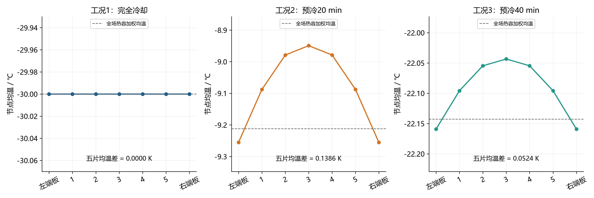

图3 三工况初始节点温度；各子图纵轴独立，避免掩盖细小梯度。矢量版：[SVG](figures/图03_三工况初始温度.svg)。

### 表4 三种平均温度与场的极值口径

| 工况 | 热容加权均温/℃ | 厚度加权均温/℃ | 七节点算术均温/℃ | 全场最低温/℃ | 全场最高温/℃ | 中片−左端板/K | 左外表面/℃ | 右外表面/℃ | 全场温差/剩余均温 | 堆级Bi |
| --- | --- | --- | --- | --- | --- | --- | --- | --- | --- | --- |
| 工况1：完全冷却 | -30 | -30 | -30 | -30 | -30 | 3.55271e-15 | -30 | -30 | 0 | 0.139637 |
| 工况2：预冷20 min | -9.21232 | -9.16252 | -9.08485 | -9.45603 | -8.94905 | 0.306125 | -9.456 | -9.45603 | 0.024388 | 0.139637 |
| 工况3：预冷40 min | -22.14284 | -22.12401 | -22.09466 | -22.23495 | -22.04333 | 0.115707 | -22.23494 | -22.23495 | 0.024388 | 0.139637 |

数据源：[initial_temperature_cases.csv](data/initial_temperature_cases.csv)；共 3 行，CSV保留工作精度。

### 表5 10–100 min预冷的全部19点温度结果

| 预冷/min | 左端板均温/℃ | 电池1均温/℃ | 电池2均温/℃ | 电池3均温/℃ | 电池4均温/℃ | 电池5均温/℃ | 右端板均温/℃ | 热容加权均温/℃ | 全场温差/K | 五片初始温差/K |
| --- | --- | --- | --- | --- | --- | --- | --- | --- | --- | --- |
| 10 | 3.74232 | 4.01482 | 4.19191 | 4.24025 | 4.19191 | 4.0148 | 3.74227 | 3.81241 | 0.824633 | 0.225445 |
| 15 | -3.54305 | -3.32938 | -3.19053 | -3.15262 | -3.19053 | -3.32939 | -3.54308 | -3.48809 | 0.646586 | 0.176769 |
| 20 | -9.25541 | -9.08788 | -8.97901 | -8.94929 | -8.97901 | -9.08789 | -9.25544 | -9.21232 | 0.50698 | 0.138602 |
| 25 | -13.73441 | -13.60305 | -13.51769 | -13.49439 | -13.51769 | -13.60306 | -13.73444 | -13.70063 | 0.397517 | 0.108676 |
| 30 | -17.24635 | -17.14335 | -17.07641 | -17.05814 | -17.07641 | -17.14335 | -17.24636 | -17.21986 | 0.311688 | 0.085212 |
| 35 | -20.00001 | -19.91925 | -19.86677 | -19.85244 | -19.86677 | -19.91926 | -20.00002 | -19.97924 | 0.244391 | 0.066814 |
| 40 | -22.15913 | -22.0958 | -22.05465 | -22.04342 | -22.05465 | -22.09581 | -22.15914 | -22.14284 | 0.191624 | 0.052388 |
| 45 | -23.85206 | -23.80241 | -23.77015 | -23.76134 | -23.77015 | -23.80242 | -23.85207 | -23.83929 | 0.15025 | 0.041077 |
| 50 | -25.17948 | -25.14054 | -25.11525 | -25.10834 | -25.11525 | -25.14055 | -25.17948 | -25.16946 | 0.11781 | 0.032208 |
| 55 | -26.22028 | -26.18976 | -26.16992 | -26.16451 | -26.16992 | -26.18976 | -26.22029 | -26.21243 | 0.092373 | 0.025254 |
| 60 | -27.03637 | -27.01243 | -26.99688 | -26.99263 | -26.99688 | -27.01244 | -27.03637 | -27.03021 | 0.072429 | 0.019801 |
| 65 | -27.67625 | -27.65749 | -27.64529 | -27.64196 | -27.64529 | -27.65749 | -27.67625 | -27.67142 | 0.05679 | 0.015526 |
| 70 | -28.17798 | -28.16326 | -28.1537 | -28.15109 | -28.1537 | -28.16326 | -28.17798 | -28.17419 | 0.044529 | 0.012174 |
| 75 | -28.57137 | -28.55984 | -28.55234 | -28.55029 | -28.55234 | -28.55984 | -28.57137 | -28.56841 | 0.034914 | 0.009545 |
| 80 | -28.87983 | -28.87078 | -28.8649 | -28.8633 | -28.8649 | -28.87078 | -28.87983 | -28.8775 | 0.027376 | 0.007484 |
| 85 | -29.12169 | -29.11459 | -29.10999 | -29.10873 | -29.10999 | -29.1146 | -29.12169 | -29.11986 | 0.021465 | 0.005868 |
| 90 | -29.31133 | -29.30576 | -29.30215 | -29.30116 | -29.30215 | -29.30576 | -29.31133 | -29.3099 | 0.016831 | 0.004601 |
| 95 | -29.46002 | -29.45566 | -29.45282 | -29.45205 | -29.45282 | -29.45566 | -29.46002 | -29.4589 | 0.013197 | 0.003608 |
| 100 | -29.57661 | -29.57319 | -29.57097 | -29.57036 | -29.57097 | -29.57319 | -29.57661 | -29.57573 | 0.010347 | 0.002829 |

数据源：[precooling_nodes.csv](data/precooling_nodes.csv)；共 19 行，CSV保留工作精度。

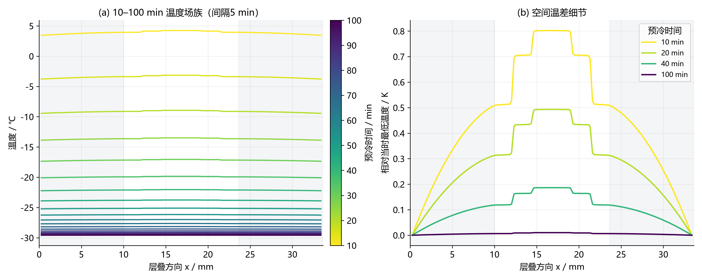

图1 完整预冷温度场族及空间梯度细节。矢量版：[SVG](figures/图01_预冷温度场族.svg)。

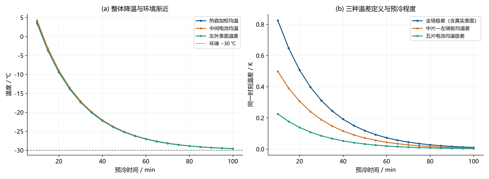

图2 温度向−30 ℃渐近，同时10–100 min范围内绝对温差衰减。矢量版：[SVG](figures/图02_预冷均温与温差.svg)。

用y=C^(1/2)u将热算子转换为对称三对角矩阵，再求特征分解，得到同网格矩阵指数独立参考。整堆主慢时间常数约1233.25648 s（20.5543 min）；存在116.71122 s反对称模态，但均匀初态仅激发约4.14×10⁻⁵ K，不能单看特征时间判定其主导性。全半堆热阻包含一块EP、三块BP与2.5层MEA，Bi_stack=0.13963743。

### 表6 预冷主要特征模态

| 模态 | 特征值/s⁻¹ | 时间常数/s | 当前初场最大激发幅值/K |
| --- | --- | --- | --- |
| 1 | -0.000811 | 1233.25648 | 55.69447 |
| 2 | -0.008568 | 116.71122 | 4.13597e-05 |
| 3 | -0.106717 | 9.37056 | 0.863719 |
| 4 | -0.286451 | 3.49099 | 2.18530e-05 |
| 5 | -0.357023 | 2.80094 | 0.249055 |
| 6 | -0.46932 | 2.13074 | 1.03542e-05 |
| 7 | -0.769579 | 1.29941 | 0.082736 |
| 8 | -1.05745 | 0.945673 | 1.75923e-06 |
| 9 | -1.34871 | 0.741452 | 0.073108 |
| 10 | -1.3519 | 0.739699 | 0.000407 |

数据源：[precooling_slow_modes.csv](data/precooling_slow_modes.csv)；共 10 行，CSV保留工作精度。

### 表7 守恒映射后的七节点热容

| 节点 | 单位面积热容/J·m⁻²·K⁻¹ | 节点总热容/J·K⁻¹ |
| --- | --- | --- |
| T1_C | 4610.79966 | 11.527 |
| T2_C | 3094.11966 | 7.7353 |
| T3_C | 3094.11966 | 7.7353 |
| T4_C | 3094.11966 | 7.7353 |
| T5_C | 4610.79966 | 11.527 |
| TEL_C | 39500 | 98.75 |
| TER_C | 39500 | 98.75 |

数据源：[precooling_node_capacities.csv](data/precooling_node_capacities.csv)；共 7 行，CSV保留工作精度。

## 4. 启动被控对象、成功条件与数值推进

每片MEA采用水蒸气/液水/冰、氢气/氧气库存的一维有限体积离散；以蒸发/凝结、冻结/融化、凝华/升华更新相态，气相扩散与反应消耗耦合。正式每片58个控制体（基础29×网格倍率2）。温度使用七节点热网络：五片平均温度和两个端板温度，节点热容与MEA热阻随水相状态改变。模型完整核函数保存在fast_cell.py；本题新增控制器不删除原电化学可行性诊断。

```text
C_k(X) dT_k/dt = Σ_l G_kl(T_l−T_k) − h_k(T_k−T_amb) + q_gen,k + q_phase,k + 10⁴q_k
q_gen,k = 10⁴j(t)[1.48−V_k]；q_k单位W/cm²，j单位A/cm²
V_k = E_rev − η_act − η_ohm − η_con
η_act = RT/(0.5F) asinh[j_SI/(2j₀(T,ice))]
η_ohm = j_SI R_mem；η_con = −βRT/(4F) ln(1−j/j_lim)
```

顺序推进质量/相变状态后，对后向欧拉热方程和温度依赖电压进行Picard迭代，最大迭代30次，温度迭代终止阈值10⁻⁹ K。时间积分正式Δt=0.025 s，控制周期Δt_c=0.2 s；每个积分步按累计电荷差求该步平均电流，对控制更新、加载拐点、成功跨越和保持终点对齐。首次温度跨越采用最后子步重新积分并二分22次定位，避免简单采样量化启动时间。

```text
主路径约束：0≤q_k≤1 W/cm²；min_(k,t)V_k≥0.30 V；max_(k,x,t)ε_ice<0.99
附加物理诊断：j/j_lim<1；气相孔隙率≥0；质子电导>0；库存不出现超容差负值
首次成功 t_s：五片均温均>10⁻⁷ ℃，当步状态可行，且此前路径约束均满足
关热 t_stop：上述条件连续满足2 s；之后锁定q_k=0
E_aux = 25 Σ_k Σ_n q_(k,n) Δt_n  [J]
```

10⁻⁷ ℃是严格T>0判据的数值阈值。主表冰指标是全MEA所有空间控制体中的局部最大体积分数ε_ice=m_ice/ρ_ice；它不同于孔隙冰饱和度，也不同于仅多孔层冰体积分数。CSV同时保留这些分量用于辨识，主表与0.99阈值比较不混用定义。

动态与constant_hold主表均统计[0,t_stop]；first_success_energy_J单独给出[0,t_s]积分。constant_first使用0 s保持，提供与问题三相同的首次达标窗口。主算例关热后继续按原加载曲线运行60 s，功率严格锁定为0，该段用于检查回落和持续状态，单独成表，不混入主表极值和辅助能耗。

## 5. 可执行的反馈控制律与离线参数整定

每片只输出自己的电热丝功率，五路功率独立。控制器在温度/电压采样上叠加所设测量噪声后，以时间常数0.15 s低通滤波，再以0.20 s时间常数滤波差分速率。内部水相状态用于模型软测量；无冰参考电压与实测电压的非负残差提供有界冰量校正。本实现属于模型辅助状态估计，未将仿真的真实冰量宣称为直接传感器测量，也未声称完成实际硬件观测器辨识。

```text
β=exp(−Δt_c/0.15)，β_r=exp(−Δt_c/0.20)
T_ref,k=T0,k+(T_target−T0,k)min(t/t_plan,1)
e_k=T_ref,k−T_f,k；r_req=max(0,(T_target−T_f,k)/max(t_plan−t,1))
D_r=max(0,(r_req−r_T)/(r_req+0.01))；D_T=max(0,−T_f/30)
q_ff=ff_factor·[C_k·dT_ref/dt+网络净散热−电化学反应热]/10⁴
K_P,eff=K_P[0.6+0.4clip(−T_f/30,0,1)]
I_trial=I_old+K_I e_k Δt_c（饱和方向的积分增量被抑制，I限幅[−2,2]）
q_nom=q_ff+K_P,eff e_k+I+rate_gain·min(D_r,2)min(D_T,1)
```

温度超过0 ℃、估计冰量低于0.5且电压下降率大于−0.05 V/s时启用渐缩：ψ=clip((T_target−T_f)/taper_K,0,1)。安全条件使用逻辑“或”：估计冰量超过ice_warn、滤波电压低于0.30+delta_V、r_V<−0.1 V/s且V_f<0.6 V、或综合风险超过risk_warn，都触发增强。先渐缩，再将功率与安全增强值取较大者，最后限幅[0,1]。

```text
ε_est=clip[ε_model+L_obs·max(0,V_noice−V_measured)/0.1,0,1]
R=0.4 ε_est/0.99+0.4 max(0,(0.30+delta_V−V_f)/delta_V)+0.2 min(max(0,−r_V)/0.1,1)
q_boost=q_boost_min+(1−q_boost_min)clip((R−risk_warn)/(1−risk_warn),0,1)
q=clip(max(q_tapered,q_boost),0,1)  （仅安全预警触发时取max）
```

### 表8 控制状态机

| 状态码 | 识别状态 | 触发说明 | 动作 |
| --- | --- | --- | --- |
| 1 | 冰堵/低压风险 | 任一安全预警成立 | 安全增强最高优先级 |
| 2 | 温度偏低且温升不足 | D_r>0.1，低温时补偿有效 | 前馈+PI+速率补偿 |
| 3 | 正常跟踪 | 未触发其他状态 | 保持/调整名义功率 |
| 4 | 接近目标且风险较低 | 温度>0、冰估计<0.5、电压下降缓和 | 渐缩功率 |
| 5 | 已关热 | 全局成功连续保持2 s | 关断锁存、功率恒为0 |

首先尝试零名义功率策略：令K_P、K_I、rate_gain、ff_factor均为0，保留滤波、状态识别、电压校正和最高优先级安全后备。若正式精度仿真可行且E_aux=0，则已达到主能耗的非负下界，可直接选择该模式。其他工况在六维参数域进行差分进化，随机种子20260926与73，每次18代、种群倍率6；先用Δt=0.1 s、网格倍率1筛选，再将可行候选中目标函数最低的12个以正式Δt=0.025 s、网格倍率2重新排序，最后进行Powell有界局部搜索（最多150次评估）。

本次计算对规划时间的边界进行了审计：工况1保留初始[5,90] s范围搜索，增加90、95、100、110、130、160、190 s规划值的边界候选后，以种子9026在扩展域[5,190] s继续差分进化；最终参数以表9为准。规划时间是参考轨迹参数，不是允许的启动时限，即使t_plan超过96.6667 s，实际关热仍必须在96.6667 s预算内完成。所有候选及阶段标签保存在optimization_search.csv；从头运行最终脚本会直接使用扩展域，已保存参数复算可精确重建交付轨迹。

```text
常规搜索域：T_target∈[0.2,4] ℃；t_plan∈[5,190] s；K_P∈[0.025,0.65]；
K_I∈[0.0005,0.07]；taper_K∈[0.1,2] K；rate_gain∈[0,0.4]
零能耗后备分支：K_P=K_I=rate_gain=ff_factor=0（独立于常规搜索域）
可行域内 J=E_aux/E_const,hold + 0.005 t_stop/t_const,hold + 0.002 ΔTmax/ΔT_const,hold
不可行候选使用显著更大的罚值，并不作为最终可行解
通常固定：hold=2 s；q_boost_min=0.6；ice_warn=0.8；delta_V=0.1 V；
risk_warn=0.7；L_obs=0.02；ff_factor=1（零能耗分支除外）
```

上述权重以能耗为主，但不是严格字典序最小化；启动时间和一致性只占小权重。参考量按每工况同精度粗搜索恒功率保持策略计算。恒功率基准在所有工况使用同一问题三分配q=(1,1,0.6245115587719579,1,1) W/cm²，未给动态组更换电流加载曲线，也未把按工况重新优化后的恒功率与固定恒功率混为一谈。

### 表9 三工况全部控制参数

| 工况 | 目标温度/℃ | 规划时间/s | 比例增益 | 积分增益 | 渐缩带/K | 保持/s | 安全增强起值/W·cm⁻² | 冰量预警 | 电压预警带/V | 综合风险阈值 | 电压校正增益 | 温升不足补偿增益 | 前馈倍率 |
| --- | --- | --- | --- | --- | --- | --- | --- | --- | --- | --- | --- | --- | --- |
| 工况1：完全冷却 | 0.34268 | 95.8007 | 0.029889 | 0.027047 | 0.302043 | 2 | 0.6 | 0.8 | 0.1 | 0.7 | 0.02 | 0.309067 | 1 |
| 工况2：预冷20 min | 1 | 60 | 0 | 0 | 1 | 2 | 0.6 | 0.8 | 0.1 | 0.7 | 0.02 | 0 | 0 |
| 工况3：预冷40 min | 3.31089 | 108.90089 | 0.100018 | 0.069229 | 0.49485 | 2 | 0.6 | 0.8 | 0.1 | 0.7 | 0.02 | 0.223223 | 1 |

数据源：[optimized_parameters.csv](data/optimized_parameters.csv)；共 3 行，CSV保留工作精度。

### 表10 搜索覆盖与最优可行目标值

| 工况 | 搜索阶段 | 候选数 | 可行候选数 | 最低可行J |
| --- | --- | --- | --- | --- |
| 工况1：完全冷却 | DE_seed20260926 | 684 | 609 | 0.909856 |
| 工况1：完全冷却 | DE_seed73 | 684 | 608 | 0.908932 |
| 工况1：完全冷却 | fine_rerank | 24 | 24 | 0.899953 |
| 工况1：完全冷却 | fine_Powell | 147 | 80 | 0.899179 |
| 工况1：完全冷却 | previous_solution_recheck | 1 | 1 | 0.908766 |
| 工况1：完全冷却 | expanded_plan_boundary | 7 | 2 | 0.901922 |
| 工况1：完全冷却 | DE_seed9026 | 684 | 417 | 0.90129 |
| 工况2：预冷20 min | zero_energy_lower_bound | 1 | 1 | 0.059039 |
| 工况3：预冷40 min | DE_seed20260926 | 684 | 402 | 0.825743 |
| 工况3：预冷40 min | DE_seed73 | 684 | 362 | 0.825743 |
| 工况3：预冷40 min | fine_rerank | 12 | 12 | 0.82457 |
| 工况3：预冷40 min | fine_Powell | 67 | 20 | 0.82457 |

数据源：[optimization_search.csv](data/optimization_search.csv)；共 12 行，CSV保留工作精度。

## 6. 第(1)问：三工况完整比较结果

### 表11（题目表4扩展）全部策略的主结果

| 工况 | 策略 | 可行 | 辅助电能/J | 首次达标/s | 关热时刻/s | 最大五片温差/K | 最低电压/V | 最大冰体积分数 | 峰值单片功率/W·cm⁻² |
| --- | --- | --- | --- | --- | --- | --- | --- | --- | --- |
| 工况1：完全冷却 | 动态反馈＋2 s保持 | 是 | 2828.46932 | 94.63969 | 96.63969 | 6.60958 | 0.55135 | 0.341932 | 0.922591 |
| 工况1：完全冷却 | 恒功率＋2 s保持 | 是 | 3207.24083 | 25.74123 | 27.74123 | 26.67604 | 0.661862 | 0.01213 | 1 |
| 工况1：完全冷却 | 恒功率首次过零（Q3口径） | 是 | 2976.01525 | 25.74123 | 25.74123 | 25.18128 | 0.662058 | 0.01213 | 1 |
| 工况2：预冷20 min | 动态反馈＋2 s保持 | 是 | 0 | 84.7246 | 86.7246 | 8.83426 | 0.596473 | 0.135273 | 0 |
| 工况2：预冷20 min | 恒功率＋2 s保持 | 是 | 879.36123 | 5.60609 | 7.60609 | 8.32515 | 0.737725 | 9.52753e-05 | 1 |
| 工况2：预冷20 min | 恒功率首次过零（Q3口径） | 是 | 648.13565 | 5.60609 | 5.60609 | 6.29775 | 0.747379 | 9.52753e-05 | 1 |
| 工况3：预冷40 min | 动态反馈＋2 s保持 | 是 | 1758.7912 | 94.65356 | 96.65356 | 7.46563 | 0.569164 | 0.274468 | 0.548921 |
| 工况3：预冷40 min | 恒功率＋2 s保持 | 是 | 2200.9066 | 17.03688 | 19.03688 | 19.49823 | 0.685121 | 0.002818 | 1 |
| 工况3：预冷40 min | 恒功率首次过零（Q3口径） | 是 | 1969.68103 | 17.03688 | 17.03688 | 17.46864 | 0.686836 | 0.002818 | 1 |

数据源：[main_results.csv](data/main_results.csv)；共 9 行，CSV保留工作精度。

constant_first是辅助参考行，终止窗口较短，不能直接将其能耗差称为与2 s保持动态策略公平比较的节能率。表1及图7的节能比较仅使用dynamic与constant_hold；全部组别均保留，便于复核问题三衔接。

### 各项性能的实际取舍（动态−恒功率保持）

| 工况 | 关热时间增加/s | 关热时间倍率 | 温差变化/K | 最低电压变化/V | 最大冰量变化 | 截止前剩余/s |
| --- | --- | --- | --- | --- | --- | --- |
| 工况1：完全冷却 | 68.89846 | 3.48361 | -20.06646 | -0.110512 | 0.329802 | 0.026978 |
| 工况2：预冷20 min | 79.11851 | 11.402 | 0.509112 | -0.141253 | 0.135178 | 9.94207 |
| 工况3：预冷40 min | 77.61668 | 5.07717 | -12.0326 | -0.115957 | 0.271651 | 0.013107 |

工况1/3的五片一致性明显改善，工况2动态温差则略大；三工况动态最低电压都更低、最大冰量都更大，但名义轨迹仍处于规定安全界限内。因此源推导中“电压更高、冰量更小、时间相近”等预期在本次能耗优先优化中并未普遍实现，不作为结论保留。

### 各片辅助电能完整分配

| 工况 | 策略 | 第1片能耗/J | 第2片能耗/J | 第3片能耗/J | 第4片能耗/J | 第5片能耗/J |
| --- | --- | --- | --- | --- | --- | --- |
| 工况1：完全冷却 | 恒功率首次过零（Q3口径） | 643.53072 | 643.53072 | 401.89237 | 643.53072 | 643.53072 |
| 工况1：完全冷却 | 恒功率＋2 s保持 | 693.53072 | 693.53072 | 433.11795 | 693.53072 | 693.53072 |
| 工况1：完全冷却 | 动态反馈＋2 s保持 | 1372.89484 | 27.5476 | 27.58444 | 27.5476 | 1372.89484 |
| 工况2：预冷20 min | 恒功率首次过零（Q3口径） | 140.15224 | 140.15224 | 87.52669 | 140.15224 | 140.15224 |
| 工况2：预冷20 min | 恒功率＋2 s保持 | 190.15224 | 190.15224 | 118.75227 | 190.15224 | 190.15224 |
| 工况2：预冷20 min | 动态反馈＋2 s保持 | 0 | 0 | 0 | 0 | 0 |
| 工况3：预冷40 min | 恒功率首次过零（Q3口径） | 425.92196 | 425.92196 | 265.99319 | 425.92196 | 425.92196 |
| 工况3：预冷40 min | 恒功率＋2 s保持 | 475.92196 | 475.92196 | 297.21876 | 475.92196 | 475.92196 |
| 工况3：预冷40 min | 动态反馈＋2 s保持 | 854.70911 | 16.50697 | 16.35833 | 16.50702 | 854.70977 |

数据源：[per_cell_heater_energy.csv](data/per_cell_heater_energy.csv)；共 9 行，CSV保留工作精度。

### 各片功率与有效加热时长

| 工况 | 策略 | 电池序号 | 时窗平均功率/W·cm⁻² | 峰值功率/W·cm⁻² | 非零加热时长/s |
| --- | --- | --- | --- | --- | --- |
| 工况1：完全冷却 | 动态反馈＋2 s保持 | 1 | 0.568253 | 0.922591 | 96.63969 |
| 工况1：完全冷却 | 动态反馈＋2 s保持 | 2 | 0.011402 | 0.397273 | 23.8 |
| 工况1：完全冷却 | 动态反馈＋2 s保持 | 3 | 0.011417 | 0.397273 | 24 |
| 工况1：完全冷却 | 动态反馈＋2 s保持 | 4 | 0.011402 | 0.397273 | 23.8 |
| 工况1：完全冷却 | 动态反馈＋2 s保持 | 5 | 0.568253 | 0.922591 | 96.63969 |
| 工况1：完全冷却 | 恒功率＋2 s保持 | 1 | 1 | 1 | 27.74123 |
| 工况1：完全冷却 | 恒功率＋2 s保持 | 2 | 1 | 1 | 27.74123 |
| 工况1：完全冷却 | 恒功率＋2 s保持 | 3 | 0.624512 | 0.624512 | 27.74123 |
| 工况1：完全冷却 | 恒功率＋2 s保持 | 4 | 1 | 1 | 27.74123 |
| 工况1：完全冷却 | 恒功率＋2 s保持 | 5 | 1 | 1 | 27.74123 |
| 工况1：完全冷却 | 恒功率首次过零（Q3口径） | 1 | 1 | 1 | 25.74123 |
| 工况1：完全冷却 | 恒功率首次过零（Q3口径） | 2 | 1 | 1 | 25.74123 |
| 工况1：完全冷却 | 恒功率首次过零（Q3口径） | 3 | 0.624512 | 0.624512 | 25.74123 |
| 工况1：完全冷却 | 恒功率首次过零（Q3口径） | 4 | 1 | 1 | 25.74123 |
| 工况1：完全冷却 | 恒功率首次过零（Q3口径） | 5 | 1 | 1 | 25.74123 |
| 工况2：预冷20 min | 动态反馈＋2 s保持 | 1 | 0 | 0 | 0 |
| 工况2：预冷20 min | 动态反馈＋2 s保持 | 2 | 0 | 0 | 0 |
| 工况2：预冷20 min | 动态反馈＋2 s保持 | 3 | 0 | 0 | 0 |
| 工况2：预冷20 min | 动态反馈＋2 s保持 | 4 | 0 | 0 | 0 |
| 工况2：预冷20 min | 动态反馈＋2 s保持 | 5 | 0 | 0 | 0 |
| 工况2：预冷20 min | 恒功率＋2 s保持 | 1 | 1 | 1 | 7.60609 |
| 工况2：预冷20 min | 恒功率＋2 s保持 | 2 | 1 | 1 | 7.60609 |
| 工况2：预冷20 min | 恒功率＋2 s保持 | 3 | 0.624512 | 0.624512 | 7.60609 |
| 工况2：预冷20 min | 恒功率＋2 s保持 | 4 | 1 | 1 | 7.60609 |
| 工况2：预冷20 min | 恒功率＋2 s保持 | 5 | 1 | 1 | 7.60609 |
| 工况2：预冷20 min | 恒功率首次过零（Q3口径） | 1 | 1 | 1 | 5.60609 |
| 工况2：预冷20 min | 恒功率首次过零（Q3口径） | 2 | 1 | 1 | 5.60609 |
| 工况2：预冷20 min | 恒功率首次过零（Q3口径） | 3 | 0.624512 | 0.624512 | 5.60609 |
| 工况2：预冷20 min | 恒功率首次过零（Q3口径） | 4 | 1 | 1 | 5.60609 |
| 工况2：预冷20 min | 恒功率首次过零（Q3口径） | 5 | 1 | 1 | 5.60609 |
| 工况3：预冷40 min | 动态反馈＋2 s保持 | 1 | 0.353721 | 0.548921 | 96.65356 |
| 工况3：预冷40 min | 动态反馈＋2 s保持 | 2 | 0.006831 | 0.230229 | 17.4 |
| 工况3：预冷40 min | 动态反馈＋2 s保持 | 3 | 0.00677 | 0.229851 | 17.2 |
| 工况3：预冷40 min | 动态反馈＋2 s保持 | 4 | 0.006831 | 0.230229 | 17.4 |
| 工况3：预冷40 min | 动态反馈＋2 s保持 | 5 | 0.353721 | 0.548921 | 96.65356 |
| 工况3：预冷40 min | 恒功率＋2 s保持 | 1 | 1 | 1 | 19.03688 |
| 工况3：预冷40 min | 恒功率＋2 s保持 | 2 | 1 | 1 | 19.03688 |
| 工况3：预冷40 min | 恒功率＋2 s保持 | 3 | 0.624512 | 0.624512 | 19.03688 |
| 工况3：预冷40 min | 恒功率＋2 s保持 | 4 | 1 | 1 | 19.03688 |
| 工况3：预冷40 min | 恒功率＋2 s保持 | 5 | 1 | 1 | 19.03688 |
| 工况3：预冷40 min | 恒功率首次过零（Q3口径） | 1 | 1 | 1 | 17.03688 |
| 工况3：预冷40 min | 恒功率首次过零（Q3口径） | 2 | 1 | 1 | 17.03688 |
| 工况3：预冷40 min | 恒功率首次过零（Q3口径） | 3 | 0.624512 | 0.624512 | 17.03688 |
| 工况3：预冷40 min | 恒功率首次过零（Q3口径） | 4 | 1 | 1 | 17.03688 |
| 工况3：预冷40 min | 恒功率首次过零（Q3口径） | 5 | 1 | 1 | 17.03688 |

数据源：[per_cell_heater_energy.csv](data/per_cell_heater_energy.csv)；共 45 行，CSV保留工作精度。

名义节能主要通过空间重新分配实现：深冷两工况把大部分辅助电能用于端片，以抵消端板热汇；中间片较早退出辅助加热，主要依靠电化学产热和片间传热升温。逐片电能由原始功率区间积分独立汇总，五片之和应与主表E_aux一致。

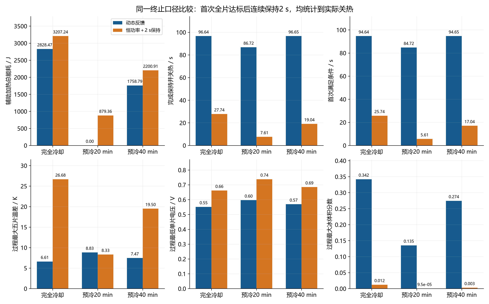

图7 两种策略在相同2 s保持条件下的能耗、时间、一致性、电压与冰量。矢量版：[SVG](figures/图07_三工况主指标比较.svg)。

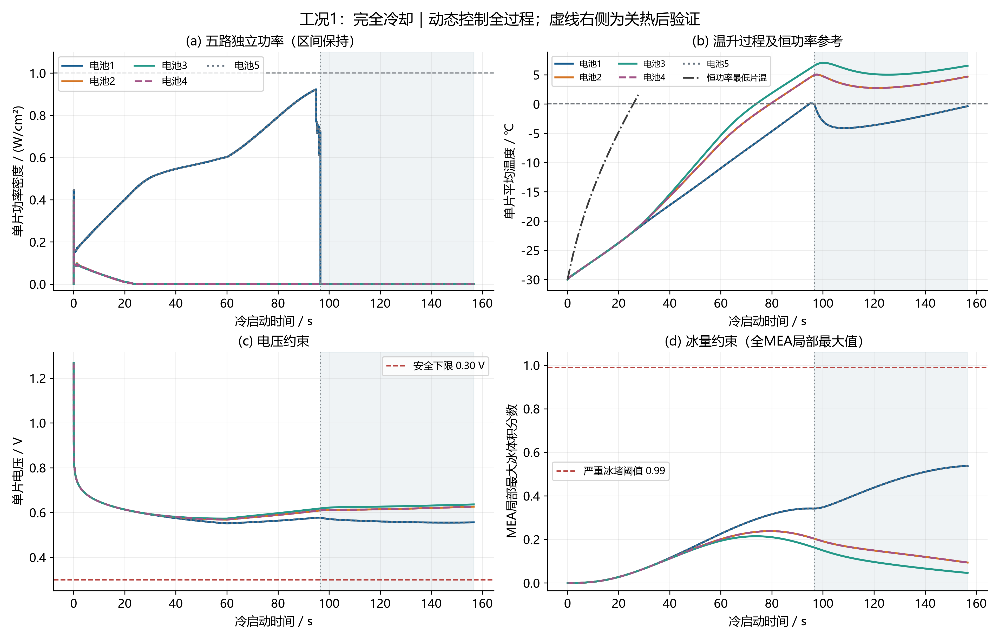

图4 工况1：完全冷却温度、电压、冰量与五路功率；灰色背景为关热后验证段。矢量版：[SVG](figures/图04_case1_动态控制轨迹.svg)。

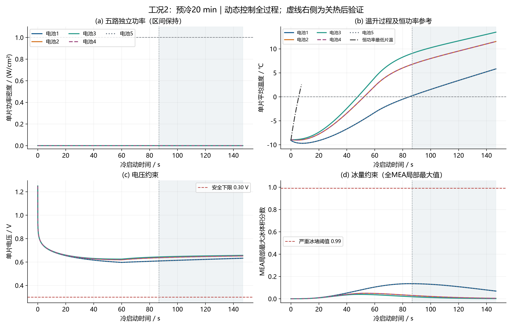

图5 工况2：预冷20 min温度、电压、冰量与五路功率；灰色背景为关热后验证段。矢量版：[SVG](figures/图05_case2_动态控制轨迹.svg)。

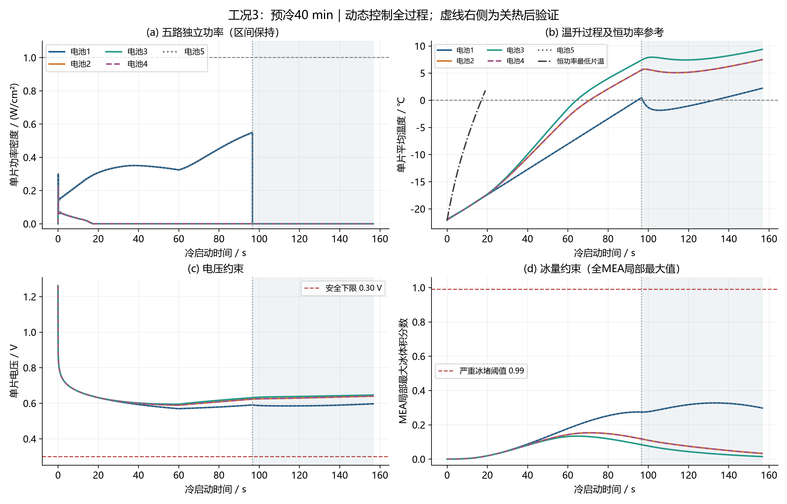

图6 工况3：预冷40 min温度、电压、冰量与五路功率；灰色背景为关热后验证段。矢量版：[SVG](figures/图06_case3_动态控制轨迹.svg)。

### 表12 首次成功、关热状态与加载量

| 工况 | 策略 | 首次达标/s | 首次达标辅助电能/J | 首次达标累计电荷/C·cm⁻² | 关热时刻/s | 关热最低片温/℃ | 关热最高片温/℃ | 关热左端板/℃ | 仿真总时长/s |
| --- | --- | --- | --- | --- | --- | --- | --- | --- | --- |
| 工况1：完全冷却 | 动态反馈＋2 s保持 | 94.63969 | 2752.90011 | 19.39191 | 96.63969 | 0.042633 | 6.54425 | -13.41877 | 156.63969 |
| 工况1：完全冷却 | 恒功率＋2 s保持 | 25.74123 | 2976.01525 | 1.65653 | 27.74123 | 1.57173 | 28.24777 | -23.54492 | 87.74123 |
| 工况1：完全冷却 | 恒功率首次过零（Q3口径） | 25.74123 | 2976.01525 | 1.65653 | 25.74123 | 1.02842e-07 | 25.18128 | -24.27448 | 85.74123 |
| 工况2：预冷20 min | 动态反馈＋2 s保持 | 84.7246 | 0 | 16.41738 | 86.7246 | 0.20903 | 9.04329 | -5.22413 | 146.7246 |
| 工况2：预冷20 min | 恒功率＋2 s保持 | 5.60609 | 648.13565 | 0.078571 | 7.60609 | 2.55265 | 10.8778 | -8.5723 | 67.60609 |
| 工况2：预冷20 min | 恒功率首次过零（Q3口径） | 5.60609 | 648.13565 | 0.078571 | 5.60609 | 1.03082e-07 | 6.29775 | -8.86127 | 65.60609 |
| 工况3：预冷40 min | 动态反馈＋2 s保持 | 94.65356 | 1704.39485 | 19.39607 | 96.65356 | 0.466323 | 7.38806 | -9.90839 | 156.65356 |
| 工况3：预冷40 min | 恒功率＋2 s保持 | 17.03688 | 1969.68103 | 0.725638 | 19.03688 | 1.8008 | 21.29903 | -18.72731 | 79.03688 |
| 工况3：预冷40 min | 恒功率首次过零（Q3口径） | 17.03688 | 1969.68103 | 0.725638 | 17.03688 | 1.02574e-07 | 17.46864 | -19.30634 | 77.03688 |

数据源：[main_results.csv](data/main_results.csv)；共 9 行，CSV保留工作精度。

### 表13 各组物理可行性与非线性迭代诊断

| 工况 | 策略 | 最小气相孔隙率 | 最大j/jlim | 最小质子电导/S·m⁻¹ | 最小库存（内核单位） | 最大Picard误差/K | 最大水量残差绝对值/kg |
| --- | --- | --- | --- | --- | --- | --- | --- |
| 工况1：完全冷却 | 动态反馈＋2 s保持 | 0.27806 | 0.012514 | 0.432998 | 0 | 5.75337e-10 | 1.90862e-16 |
| 工况1：完全冷却 | 恒功率＋2 s保持 | 0.3916 | 0.004672 | 0.433086 | 0 | 3.28093e-11 | 5.80596e-17 |
| 工况1：完全冷却 | 恒功率首次过零（Q3口径） | 0.3916 | 0.004337 | 0.433086 | 0 | 2.78710e-11 | 4.00770e-17 |
| 工况2：预冷20 min | 动态反馈＋2 s保持 | 0.327939 | 0.011852 | 0.636772 | 0 | 9.73758e-10 | 7.10146e-16 |
| 工况2：预冷20 min | 恒功率＋2 s保持 | 0.3916 | 0.001254 | 0.654533 | 0 | 1.90248e-11 | 1.87857e-17 |
| 工况2：预冷20 min | 恒功率首次过零（Q3口径） | 0.3916 | 0.000928 | 0.654533 | 0 | 2.08864e-11 | 1.22333e-17 |
| 工况3：预冷40 min | 动态反馈＋2 s保持 | 0.293989 | 0.012379 | 0.508631 | 0 | 9.41803e-10 | 5.30500e-16 |
| 工况3：预冷40 min | 恒功率＋2 s保持 | 0.3916 | 0.003171 | 0.510362 | 0 | 1.58487e-11 | 1.32986e-17 |
| 工况3：预冷40 min | 恒功率首次过零（Q3口径） | 0.3916 | 0.002842 | 0.510362 | 0 | 1.34968e-11 | 1.32381e-17 |

数据源：[main_results.csv](data/main_results.csv)；共 9 行，CSV保留工作精度。

### 表14 关热后60 s独立验证

| 工况 | 策略 | 关热后最低片温/℃ | 关热后最低电压/V | 关热后最大冰体积分数 | 关热后辅助电能/J |
| --- | --- | --- | --- | --- | --- |
| 工况1：完全冷却 | 动态反馈＋2 s保持 | -4.11508 | 0.554993 | 0.537572 | 0 |
| 工况1：完全冷却 | 恒功率＋2 s保持 | -8.28115 | 0.575303 | 0.27683 | 0 |
| 工况1：完全冷却 | 恒功率首次过零（Q3口径） | -9.57145 | 0.568611 | 0.293493 | 0 |
| 工况2：预冷20 min | 动态反馈＋2 s保持 | 0.20903 | 0.608813 | 0.13517 | 0 |
| 工况2：预冷20 min | 恒功率＋2 s保持 | -2.97648 | 0.616862 | 0.034562 | 0 |
| 工况2：预冷20 min | 恒功率首次过零（Q3口径） | -4.54137 | 0.611225 | 0.058134 | 0 |
| 工况3：预冷40 min | 动态反馈＋2 s保持 | -1.85636 | 0.584814 | 0.327295 | 0 |
| 工况3：预冷40 min | 恒功率＋2 s保持 | -6.80134 | 0.591193 | 0.182526 | 0 |
| 工况3：预冷40 min | 恒功率首次过零（Q3口径） | -8.16285 | 0.584927 | 0.201476 | 0 |

数据源：[main_results.csv](data/main_results.csv)；共 9 行，CSV保留工作精度。

关热后验证中，以下动态工况至少一项持续状态标准未满足：工况1：完全冷却、工况3：预冷40 min。因此应区分“按题设完成首次成功及保持”与“关热后整个验证段持续高于0 ℃且安全”；该结果不应被隐藏或改写为长期稳定成功。

## 7. 第(2)问：10–100 min恒功率冷启动扫描

每隔5 min求一次完整预冷场，将该场的七节点温度传入同一启动模型。使用问题三固定五路功率，保持时间设为0，按照首次满足条件终止；这是第(2)问与问题三恒功率策略一致的统计口径。对每个扫描点保存完整时间序列trajectory_scan_XXXmin.csv，包含实际功率、所有单片温度/电压/冰量、相态诊断、累计能量和残差。

### 表15 全部19点恒功率扫描主指标

| 预冷/min | 热容加权均温/℃ | 可行 | 辅助电能/J | 首次达标/s | 最大五片温差/K | 最低电压/V | 最大冰体积分数 | 关热最低片温/℃ | 关热最高片温/℃ |
| --- | --- | --- | --- | --- | --- | --- | --- | --- | --- |
| 10 | 3.81241 | 是 | 0 | 0 | 0.225445 | 1.23732 | 0 | 4.0148 | 4.24025 |
| 15 | -3.48809 | 是 | 214.37318 | 1.85423 | 2.38859 | 0.802626 | 1.45357e-06 | 1.07957e-07 | 2.38859 |
| 20 | -9.21232 | 是 | 648.13565 | 5.60609 | 6.29775 | 0.747379 | 9.52753e-05 | 1.03082e-07 | 6.29775 |
| 25 | -13.70063 | 是 | 1053.51253 | 9.11242 | 9.67394 | 0.721724 | 0.000463 | 1.05040e-07 | 9.67394 |
| 30 | -17.21986 | 是 | 1412.28787 | 12.21567 | 12.45965 | 0.705668 | 0.001066 | 1.05785e-07 | 12.45965 |
| 35 | -19.97924 | 是 | 1717.17763 | 14.85283 | 15.17377 | 0.694689 | 0.001805 | 1.02569e-07 | 15.17377 |
| 40 | -22.14284 | 是 | 1969.68103 | 17.03688 | 17.46864 | 0.686836 | 0.002818 | 1.02574e-07 | 17.46864 |
| 45 | -23.83929 | 是 | 2175.44349 | 18.81663 | 19.23205 | 0.681054 | 0.004044 | 1.04267e-07 | 19.23205 |
| 50 | -25.16946 | 是 | 2341.36042 | 20.25174 | 20.58296 | 0.676716 | 0.005262 | 1.04333e-07 | 20.58296 |
| 55 | -26.21243 | 是 | 2474.18634 | 21.40063 | 21.61911 | 0.673419 | 0.006398 | 1.00306e-07 | 21.61911 |
| 60 | -27.03021 | 是 | 2579.97772 | 22.31568 | 22.41584 | 0.670891 | 0.007411 | 1.04357e-07 | 22.41584 |
| 65 | -27.67142 | 是 | 2663.92549 | 23.04179 | 23.03035 | 0.668941 | 0.008287 | 1.00178e-07 | 23.03035 |
| 70 | -28.17419 | 是 | 2730.35516 | 23.61638 | 23.50568 | 0.667429 | 0.009026 | 1.01363e-07 | 23.50568 |
| 75 | -28.56841 | 是 | 2782.81204 | 24.07011 | 23.87427 | 0.666255 | 0.009639 | 1.02315e-07 | 23.87427 |
| 80 | -28.8775 | 是 | 2824.16896 | 24.42782 | 24.16071 | 0.665339 | 0.010141 | 1.02847e-07 | 24.16071 |
| 85 | -29.11986 | 是 | 2856.73463 | 24.7095 | 24.38368 | 0.664626 | 0.010548 | 1.01836e-07 | 24.38368 |
| 90 | -29.3099 | 是 | 2882.35394 | 24.9311 | 24.55751 | 0.664068 | 0.010876 | 1.00647e-07 | 24.55751 |
| 95 | -29.4589 | 是 | 2902.49375 | 25.1053 | 24.69318 | 0.663632 | 0.011138 | 1.01142e-07 | 24.69318 |
| 100 | -29.57573 | 是 | 2918.31702 | 25.24216 | 24.79918 | 0.663291 | 0.011347 | 1.03817e-07 | 24.79918 |

数据源：[constant_scan.csv](data/constant_scan.csv)；共 19 行，CSV保留工作精度。

### 表16 全部19点扫描的能量与物理诊断

| 预冷/min | 反应产热/J | 相变净释热/J | 环境散热/J | 离散显热增量/J | 能量残差/J | 终点水量残差/kg | 最小气相孔隙率 | 最大j/jlim | 最小质子电导/S·m⁻¹ | 最大Picard误差/K |
| --- | --- | --- | --- | --- | --- | --- | --- | --- | --- | --- |
| 10 | 0 | 0 | 0 | 0 | 0 | 0 | 0.3916 | 0 | 0.821332 | 0 |
| 15 | 0.702755 | -0.074844 | 10.53053 | 204.47056 | 3.11928e-12 | 3.24202e-20 | 0.3916 | 0.000306 | 0.725169 | 2.83329e-13 |
| 20 | 6.96223 | -0.227269 | 28.89374 | 625.97686 | 2.09113e-11 | 7.23874e-20 | 0.3916 | 0.000928 | 0.654533 | 2.07567e-12 |
| 25 | 19.02389 | -0.36781 | 43.4872 | 1028.68141 | 4.42526e-11 | 1.17585e-19 | 0.3916 | 0.001511 | 0.602078 | 4.98979e-12 |
| 30 | 34.86494 | -0.487541 | 54.80013 | 1391.86515 | 8.01705e-11 | 2.02543e-19 | 0.3916 | 0.00203 | 0.562745 | 8.13216e-12 |
| 35 | 52.20868 | -0.583855 | 63.37267 | 1705.42978 | 1.11001e-10 | 2.55092e-19 | 0.3916 | 0.002473 | 0.533006 | 1.10436e-11 |
| 40 | 69.30619 | -0.659696 | 69.79612 | 1968.53139 | 1.26605e-10 | 2.47537e-19 | 0.3916 | 0.002842 | 0.510362 | 1.34968e-11 |
| 45 | 85.08733 | -0.716073 | 74.59712 | 2185.21762 | 1.61236e-10 | 2.70441e-19 | 0.3916 | 0.003145 | 0.493021 | 1.55183e-11 |
| 50 | 99.03009 | -0.75979 | 78.19402 | 2361.4367 | 1.43388e-10 | 3.01883e-19 | 0.3916 | 0.00339 | 0.479678 | 1.71632e-11 |
| 55 | 110.97996 | -0.791473 | 80.9013 | 2503.47353 | 1.82069e-10 | 3.21398e-19 | 0.3916 | 0.003586 | 0.469371 | 5.69891e-10 |
| 60 | 121.00109 | -0.81564 | 82.95003 | 2617.21314 | 1.97772e-10 | 2.96258e-19 | 0.3916 | 0.003744 | 0.461385 | 1.94618e-11 |
| 65 | 129.27186 | -0.834116 | 84.50901 | 2707.85423 | 2.05546e-10 | 2.87449e-19 | 0.3916 | 0.003869 | 0.455181 | 2.02718e-11 |
| 70 | 136.01718 | -0.84779 | 85.70132 | 2779.82323 | 2.22357e-10 | 2.71999e-19 | 0.3916 | 0.003968 | 0.450353 | 2.09042e-11 |
| 75 | 141.46913 | -0.857932 | 86.61725 | 2836.80598 | 2.00217e-10 | 2.64681e-19 | 0.3916 | 0.004047 | 0.44659 | 2.14015e-11 |
| 80 | 145.84561 | -0.865564 | 87.32357 | 2881.82544 | 2.34309e-10 | 2.22261e-19 | 0.3916 | 0.004109 | 0.443653 | 2.18101e-11 |
| 85 | 149.34035 | -0.871501 | 87.86998 | 2917.3335 | 2.56776e-10 | 2.41574e-19 | 0.3916 | 0.004158 | 0.441358 | 2.21050e-11 |
| 90 | 152.11976 | -0.876318 | 88.29384 | 2945.30355 | 2.26734e-10 | 2.42861e-19 | 0.3916 | 0.004196 | 0.439564 | 2.23501e-11 |
| 95 | 154.32333 | -0.880073 | 88.62334 | 2967.31368 | 2.31182e-10 | 2.24836e-19 | 0.3916 | 0.004227 | 0.43816 | 2.25455e-11 |
| 100 | 156.06613 | -0.882958 | 88.87993 | 2984.62026 | 2.56918e-10 | 2.12165e-19 | 0.3916 | 0.00425 | 0.437061 | 2.26770e-11 |

数据源：[constant_scan.csv](data/constant_scan.csv)；共 19 行，CSV保留工作精度。

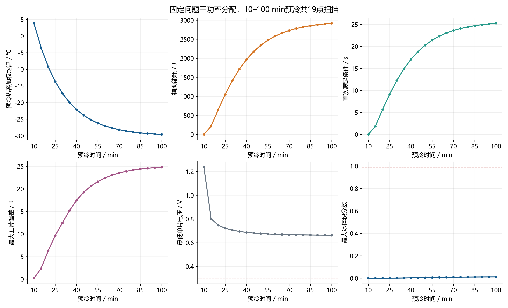

图8 固定恒功率在全部19个预冷时长下的启动结果。矢量版：[SVG](figures/图08_预冷时间扫描.svg)。

本次19个网格点均可行，因此10–100 min离散扫描内没有发现恒功率失败点，也不能声称已识别到临界预冷时间。给定恒功率对完全冷却−30 ℃基准本来就是可行方案，较暖初场全部可行与该设定一致；源文档“必存在临界冷却时间”的定性文字不作为数值结论。

初始温差与启动过程温差不是同一量。预冷越久，整体初温越接近−30 ℃且初始绝对梯度趋小；启动中端板热汇、对流位置、局部产熱/融冰和功率分配仍能重新形成片间温差。因而应联合阅读表5初场与表15过程极值，不能只用初始温差解释启动一致性。

## 8. 能量、水量、网格步长与程序检验

```text
预冷：ΔU_released = A Σ_i C_i[T_i(0)−T_i(τ)]
Q_loss = A Σ_m Δτ_m g_b[u_L^(m+1)+u_R^(m+1)]
预冷残差 = ΔU_released−Q_loss
启动离散残差 = E_sensible−E_aux−E_gen−E_phase+E_loss
水量残差 = A·(最终水库存−初始水库存−累计生成+累计边界流出)
```

预冷累计散热与后向欧拉使用同一时间层端点积分，避免用不一致的梯形公式制造守恒误差。启动E_phase为“净释放到显热方程的相变热”，冻结为正、融化为负。启动显热量逐步累加Σ C(X_new)ΔT；含水量变化使热容变化，它不等于简单的端点C(T)T之差。近机器精度残差证明该离散方程闭合，不能据此宣称实际全部热物理误差为0，特别是携水显焓等继承近似仍存在。

### 表17 三工况各策略完整能量收支

| 工况 | 策略 | 辅助电能/J | 反应产热/J | 相变净释热/J | 环境散热/J | 离散显热增量/J | 能量残差/J | 终点水量残差/kg | 最大水量残差绝对值/kg |
| --- | --- | --- | --- | --- | --- | --- | --- | --- | --- |
| 工况1：完全冷却 | 动态反馈＋2 s保持 | 2828.46932 | 2245.47459 | 17.17384 | 296.20683 | 4794.91093 | 3.96483e-10 | 4.47396e-18 | 1.90862e-16 |
| 工况1：完全冷却 | 恒功率＋2 s保持 | 3207.24083 | 188.68442 | -1.07217 | 102.11834 | 3292.73474 | 2.86761e-10 | 3.34951e-19 | 5.80596e-17 |
| 工况1：完全冷却 | 恒功率首次过零（Q3口径） | 2976.01525 | 162.50699 | -0.892997 | 89.79869 | 3047.83055 | 2.67548e-10 | 2.78369e-19 | 4.00770e-17 |
| 工况2：预冷20 min | 动态反馈＋2 s保持 | 0 | 1818.4682 | -0.254025 | 422.68367 | 1395.5305 | 1.10788e-10 | 3.56356e-17 | 7.10146e-16 |
| 工况2：预冷20 min | 恒功率＋2 s保持 | 879.36123 | 12.9723 | -0.315094 | 41.41926 | 850.59916 | 3.24221e-11 | 8.16370e-20 | 1.87857e-17 |
| 工况2：预冷20 min | 恒功率首次过零（Q3口径） | 648.13565 | 6.96223 | -0.227269 | 28.89374 | 625.97686 | 2.09113e-11 | 7.23874e-20 | 1.22333e-17 |
| 工况3：预冷40 min | 动态反馈＋2 s保持 | 1758.7912 | 2200.7156 | 10.03415 | 371.11602 | 3598.42493 | 1.61322e-10 | 3.64465e-17 | 5.30500e-16 |
| 工况3：预冷40 min | 恒功率＋2 s保持 | 2200.9066 | 86.63212 | -0.784305 | 82.16323 | 2204.59119 | 1.41284e-10 | 3.03035e-19 | 1.32986e-17 |
| 工况3：预冷40 min | 恒功率首次过零（Q3口径） | 1969.68103 | 69.30619 | -0.659696 | 69.79612 | 1968.53139 | 1.26605e-10 | 2.47537e-19 | 1.32381e-17 |

数据源：[main_results.csv](data/main_results.csv)；共 9 行，CSV保留工作精度。

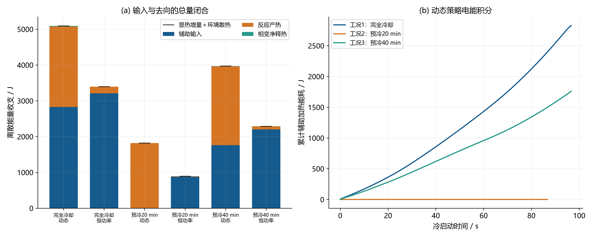

图9 主要能量收支与动态辅助加热累计积分。矢量版：[SVG](figures/图09_能量收支与累积能耗.svg)。

### 表18 全部19点预冷能量守恒

| 预冷/min | 内能减少/J | 端面对流累计散热/J | 残差/J | 相对残差 | 左外表面/℃ | 右外表面/℃ | 热容加权均温/℃ |
| --- | --- | --- | --- | --- | --- | --- | --- |
| 10 | 5164.68582 | 5164.68582 | -6.07490e-08 | 1.17624e-11 | 3.41606 | 3.41601 | 3.81241 |
| 15 | 6944.25419 | 6944.25419 | -8.16700e-08 | 1.17608e-11 | -3.79886 | -3.7989 | -3.48809 |
| 20 | 8339.59277 | 8339.59277 | -9.80834e-08 | 1.17612e-11 | -9.456 | -9.45603 | -9.21232 |
| 25 | 9433.6613 | 9433.6613 | -1.10950e-07 | 1.17610e-11 | -13.89169 | -13.89171 | -13.70063 |
| 30 | 10291.50754 | 10291.50755 | -1.21045e-07 | 1.17617e-11 | -17.36966 | -17.36968 | -17.21986 |
| 35 | 10964.13467 | 10964.13467 | -1.28944e-07 | 1.17605e-11 | -20.0967 | -20.09672 | -19.97924 |
| 40 | 11491.53367 | 11491.53367 | -1.35168e-07 | 1.17624e-11 | -22.23494 | -22.23495 | -22.14284 |
| 45 | 11905.06101 | 11905.06101 | -1.40029e-07 | 1.17621e-11 | -23.91151 | -23.91152 | -23.83929 |
| 50 | 12229.30292 | 12229.30292 | -1.43824e-07 | 1.17606e-11 | -25.22609 | -25.22609 | -25.16946 |
| 55 | 12483.53718 | 12483.53718 | -1.46816e-07 | 1.17608e-11 | -26.25683 | -26.25684 | -26.21243 |
| 60 | 12682.87927 | 12682.87927 | -1.49156e-07 | 1.17604e-11 | -27.06502 | -27.06503 | -27.03021 |
| 65 | 12839.18105 | 12839.18105 | -1.51000e-07 | 1.17609e-11 | -27.69872 | -27.69872 | -27.67142 |
| 70 | 12961.73543 | 12961.73543 | -1.52411e-07 | 1.17585e-11 | -28.19559 | -28.1956 | -28.17419 |
| 75 | 13057.82888 | 13057.82888 | -1.53561e-07 | 1.17601e-11 | -28.58519 | -28.58519 | -28.56841 |
| 80 | 13133.17462 | 13133.17462 | -1.54488e-07 | 1.17632e-11 | -28.89066 | -28.89066 | -28.8775 |
| 85 | 13192.25233 | 13192.25233 | -1.55191e-07 | 1.17638e-11 | -29.13018 | -29.13018 | -29.11986 |
| 90 | 13238.57446 | 13238.57446 | -1.55740e-07 | 1.17641e-11 | -29.31798 | -29.31799 | -29.3099 |
| 95 | 13274.8951 | 13274.8951 | -1.56187e-07 | 1.17656e-11 | -29.46524 | -29.46524 | -29.4589 |
| 100 | 13303.37369 | 13303.37369 | -1.56497e-07 | 1.17637e-11 | -29.5807 | -29.5807 | -29.57573 |

数据源：[precooling_energy_balance.csv](data/precooling_energy_balance.csv)；共 19 行，CSV保留工作精度。

### 表19 预冷模型全部单项验证

| 检验项目 | 观测量 | 容差 | 单位 | 通过 | 说明 |
| --- | --- | --- | --- | --- | --- |
| total_thickness | 6.93889e-18 | 1.00000e-13 | m | 是 | 2 EP + 6 BP + 25 MEA constituent layers |
| total_capacity | 0 | 1.00000e-08 | J/m2/K | 是 | Original material values, no rounded rho*cp |
| seven_node_energy_mapping | 4.65661e-10 | 1.00000e-08 | J/m2 | 是 | All CVs belong to exactly one node; BP halves split geometrically |
| implicit_energy_balance | 1.56497e-07 | 2.00000e-05 | J | 是 | Backward Euler loss quadrature matched to thermal equation |
| BE_vs_matrix_exponential | 0.002076 | 0.004 | K | 是 | dt=0.25 s, 10:5:100 min |
| adiabatic_uniform_limit | 2.71127e-09 | 2.00000e-06 | K | 是 | h=0, initial 25 C |
| adiabatic_nonuniform_conservation | 2.18160e-09 | 1.00000e-06 | J | 是 | h=0, nonuniform initial field |
| long_time_ambient_limit | 0 | 1.00000e-08 | K | 是 | 24 hours |
| maximum_principle | 0 | 1.00000e-10 | K | 是 | No new extrema under cooling |
| pointwise_monotonic_cooling | 0 | 1.00000e-10 | K | 是 | Every control volume cools over the sampled times |
| approximate_mirror_symmetry | 4.69128e-05 | 0.001 | K | 是 | aCL and cCL thicknesses differ; actual oriented five-layer MEA is only approximately mirror symmetric |

数据源：[precooling_validation.csv](data/precooling_validation.csv)；共 11 行，CSV保留工作精度。

### 表20 预冷网格与时间步收敛

| 检验类型 | 网格倍率 | 控制体数 | 数值步长/s | 预冷/min | 最大温度场误差/K | 最大节点投影误差/K | 独立参考 |
| --- | --- | --- | --- | --- | --- | --- | --- |
| time | 1 | 146 | 2 | 20 | 0.016596 | 0.016596 | same mesh, matrix exponential |
| time | 1 | 146 | 2 | 40 | 0.012549 | 0.012549 | same mesh, matrix exponential |
| time | 1 | 146 | 2 | 100 | 0.001696 | 0.001696 | same mesh, matrix exponential |
| time | 1 | 146 | 1 | 20 | 0.008301 | 0.008301 | same mesh, matrix exponential |
| time | 1 | 146 | 1 | 40 | 0.006276 | 0.006276 | same mesh, matrix exponential |
| time | 1 | 146 | 1 | 100 | 0.000847 | 0.000847 | same mesh, matrix exponential |
| time | 1 | 146 | 0.5 | 20 | 0.004151 | 0.004151 | same mesh, matrix exponential |
| time | 1 | 146 | 0.5 | 40 | 0.003138 | 0.003138 | same mesh, matrix exponential |
| time | 1 | 146 | 0.5 | 100 | 0.000424 | 0.000424 | same mesh, matrix exponential |
| time | 1 | 146 | 0.25 | 20 | 0.002076 | 0.002076 | same mesh, matrix exponential |
| time | 1 | 146 | 0.25 | 40 | 0.001569 | 0.001569 | same mesh, matrix exponential |
| time | 1 | 146 | 0.25 | 100 | 0.000212 | 0.000212 | same mesh, matrix exponential |
| time | 1 | 146 | 0.125 | 20 | 0.001038 | 0.001038 | same mesh, matrix exponential |
| time | 1 | 146 | 0.125 | 40 | 0.000785 | 0.000785 | same mesh, matrix exponential |
| time | 1 | 146 | 0.125 | 100 | 0.000106 | 0.000106 | same mesh, matrix exponential |
| space | 1 | 146 | 0 | 20 | — | 0.000179 | scale=8 seven-node energy projection, matrix exponential |
| space | 1 | 146 | 0 | 40 | — | 0.000121 | scale=8 seven-node energy projection, matrix exponential |
| space | 1 | 146 | 0 | 100 | — | 1.53025e-05 | scale=8 seven-node energy projection, matrix exponential |
| space | 2 | 292 | 0 | 20 | — | 4.27272e-05 | scale=8 seven-node energy projection, matrix exponential |
| space | 2 | 292 | 0 | 40 | — | 2.90805e-05 | scale=8 seven-node energy projection, matrix exponential |
| space | 2 | 292 | 0 | 100 | — | 3.66413e-06 | scale=8 seven-node energy projection, matrix exponential |
| space | 4 | 584 | 0 | 20 | — | 8.96079e-06 | scale=8 seven-node energy projection, matrix exponential |
| space | 4 | 584 | 0 | 40 | — | 6.12966e-06 | scale=8 seven-node energy projection, matrix exponential |
| space | 4 | 584 | 0 | 100 | — | 7.75111e-07 | scale=8 seven-node energy projection, matrix exponential |

数据源：[precooling_convergence.csv](data/precooling_convergence.csv)；共 24 行，CSV保留工作精度。

时间收敛对同一预冷网格的矩阵指数参考作比较；空间收敛对8倍网格的七节点热容投影作比较，避免不同控制体中心直接错位比差。启动收敛固定已选控制参数，分别改变时间步、水相控制体数量及控制周期；不在每个加密设置重新优化，以免混淆离散误差与策略改变。

### 表21 三工况全部启动加密结果

| 工况 | 数值步长/s | 网格倍率 | 控制周期/s | 可行 | 辅助电能/J | 首次达标/s | 关热时刻/s | 最大五片温差/K | 最低电压/V | 最大冰体积分数 | 能量残差/J | 最大水量残差绝对值/kg |
| --- | --- | --- | --- | --- | --- | --- | --- | --- | --- | --- | --- | --- |
| 工况1：完全冷却 | 0.1 | 1 | 0.2 | 是 | 2832.72671 | 94.63716 | 96.63716 | 6.58657 | 0.552406 | 0.33233 | -1.76215e-12 | 2.25406e-18 |
| 工况1：完全冷却 | 0.05 | 1 | 0.2 | 是 | 2830.92641 | 94.63883 | 96.63883 | 6.59579 | 0.551969 | 0.327456 | 2.17142e-11 | 3.62611e-18 |
| 工况1：完全冷却 | 0.025 | 1 | 0.2 | 是 | 2830.03299 | 94.63962 | 96.63962 | 6.60042 | 0.551748 | 0.324958 | 4.06203e-10 | 3.55374e-18 |
| 工况1：完全冷却 | 0.025 | 2 | 0.2 | 是 | 2828.46932 | 94.63969 | 96.63969 | 6.60958 | 0.55135 | 0.341932 | 3.96483e-10 | 1.38534e-17 |
| 工况1：完全冷却 | 0.0125 | 2 | 0.2 | 是 | 2828.112 | 94.64008 | 96.64008 | 6.61145 | 0.551252 | 0.339256 | 5.16707e-11 | 2.11419e-17 |
| 工况1：完全冷却 | 0.025 | 4 | 0.2 | 是 | 2827.75155 | 94.6397 | 96.6397 | 6.61393 | 0.551083 | 0.354941 | 4.59636e-10 | 7.40120e-17 |
| 工况1：完全冷却 | 0.025 | 2 | 0.1 | 是 | 2830.21586 | 94.62591 | 96.62591 | 6.60636 | 0.551416 | 0.341577 | 3.95232e-10 | 1.15153e-17 |
| 工况2：预冷20 min | 0.1 | 1 | 0.2 | 是 | 0 | 84.76558 | 86.76558 | 8.8288 | 0.596873 | 0.133672 | 1.81899e-12 | 9.11651e-18 |
| 工况2：预冷20 min | 0.05 | 1 | 0.2 | 是 | 0 | 84.75102 | 86.75102 | 8.83339 | 0.596739 | 0.131646 | -3.92220e-12 | 7.99436e-18 |
| 工况2：预冷20 min | 0.025 | 1 | 0.2 | 是 | 0 | 84.74523 | 86.74523 | 8.83569 | 0.596669 | 0.130603 | 8.70273e-11 | 5.46872e-18 |
| 工况2：预冷20 min | 0.025 | 2 | 0.2 | 是 | 0 | 84.7246 | 86.7246 | 8.83426 | 0.596473 | 0.135273 | 1.10788e-10 | 3.56356e-17 |
| 工况2：预冷20 min | 0.0125 | 2 | 0.2 | 是 | 0 | 84.72281 | 86.72281 | 8.83525 | 0.59644 | 0.134252 | 1.51203e-10 | 3.46744e-17 |
| 工况2：预冷20 min | 0.025 | 4 | 0.2 | 是 | 0 | 84.71328 | 86.71328 | 8.83377 | 0.596356 | 0.139143 | 1.02830e-10 | 9.42595e-17 |
| 工况2：预冷20 min | 0.025 | 2 | 0.1 | 是 | 0 | 84.7246 | 86.7246 | 8.83426 | 0.596473 | 0.135273 | 1.07377e-10 | 3.49503e-17 |
| 工况3：预冷40 min | 0.1 | 1 | 0.2 | 是 | 1761.37902 | 94.65283 | 96.65283 | 7.44694 | 0.569938 | 0.268761 | 1.51203e-11 | 9.68680e-18 |
| 工况3：预冷40 min | 0.05 | 1 | 0.2 | 是 | 1760.24733 | 94.65334 | 96.65334 | 7.45512 | 0.569639 | 0.264893 | 6.54268e-11 | 8.68012e-18 |
| 工况3：预冷40 min | 0.025 | 1 | 0.2 | 是 | 1759.70128 | 94.65358 | 96.65358 | 7.45921 | 0.569487 | 0.262903 | 1.20053e-10 | 7.17362e-18 |
| 工况3：预冷40 min | 0.025 | 2 | 0.2 | 是 | 1758.7912 | 94.65356 | 96.65356 | 7.46563 | 0.569164 | 0.274468 | 1.61322e-10 | 3.64465e-17 |
| 工况3：预冷40 min | 0.0125 | 2 | 0.2 | 是 | 1758.57368 | 94.65368 | 96.65368 | 7.46731 | 0.569095 | 0.272404 | 1.42563e-10 | 3.81146e-17 |
| 工况3：预冷40 min | 0.025 | 4 | 0.2 | 是 | 1758.32995 | 94.65354 | 96.65354 | 7.46883 | 0.568958 | 0.283568 | 1.23180e-10 | 1.16092e-16 |
| 工况3：预冷40 min | 0.025 | 2 | 0.1 | 是 | 1759.72568 | 94.62107 | 96.62107 | 7.46629 | 0.569203 | 0.274201 | 1.12891e-10 | 3.36341e-17 |
| 工况1：完全冷却 | 0.025 | 8 | 0.2 | 是 | 2827.45659 | 94.63969 | 96.63969 | 6.61581 | 0.550934 | 0.369454 | 3.71415e-10 | 1.00619e-16 |
| 工况1：完全冷却 | 0.025 | 16 | 0.2 | 是 | 2827.37369 | 94.63968 | 96.63968 | 6.61645 | 0.550858 | 0.392448 | 3.77327e-10 | 1.35507e-15 |
| 工况2：预冷20 min | 0.025 | 8 | 0.2 | 是 | 0 | 84.70848 | 86.70848 | 8.83352 | 0.596292 | 0.143837 | 9.27685e-11 | 3.88656e-16 |
| 工况2：预冷20 min | 0.025 | 16 | 0.2 | 是 | 0 | 84.70823 | 86.70823 | 8.83332 | 0.596256 | 0.151623 | 1.20508e-10 | 2.76682e-15 |
| 工况3：预冷40 min | 0.025 | 8 | 0.2 | 是 | 1758.13117 | 94.65353 | 96.65353 | 7.47024 | 0.568844 | 0.294075 | 1.00613e-10 | 4.23674e-16 |
| 工况3：预冷40 min | 0.025 | 16 | 0.2 | 是 | 1758.08259 | 94.65352 | 96.65352 | 7.47071 | 0.568784 | 0.311064 | 6.74731e-11 | 2.66978e-15 |

数据源：[startup_convergence.csv](data/startup_convergence.csv)；共 27 行，CSV保留工作精度。

工况1：完全冷却固定Δt=0.025 s，从58控制体加密到464控制体：辅助能耗变化-0.03874%，局部冰峰值从0.341932变为0.392448，相对变化14.774%。

工况2：预冷20 min固定Δt=0.025 s，从58控制体加密到464控制体：辅助能耗变化0.00000%，局部冰峰值从0.135273变为0.151623，相对变化12.087%。

工况3：预冷40 min固定Δt=0.025 s，从58控制体加密到464控制体：辅助能耗变化-0.04029%，局部冰峰值从0.274468变为0.311064，相对变化13.333%。

局部冰峰值具有明显网格依赖，新增细网格上仍未稳定，不能称为“全部物理量网格无关”。总体能耗和关热时间变化小，只支持这些积分量的数值稳定性。冰量对离散和相变分裂敏感，需结合联合减小时间步的结果判断；当前已测试设置中冰峰值仍远离0.99，仅能说这些设置内安全阈值判定未改变，不给出未证明的连续模型误差界。

### 表21补充 空间网格与时间步联合加密

| 工况 | 网格倍率 | 数值步长/s | 控制周期/s | 可行 | 辅助电能/J | 首次达标/s | 关热时刻/s | 最低电压/V | 最大冰体积分数 | 能量残差/J |
| --- | --- | --- | --- | --- | --- | --- | --- | --- | --- | --- |
| 工况1：完全冷却 | 4 | 0.0125 | 0.2 | 是 | 2827.43282 | 94.6401 | 96.6401 | 0.550993 | 0.349593 | 3.59250e-11 |
| 工况1：完全冷却 | 8 | 0.00625 | 0.2 | 是 | 2826.99326 | 94.64029 | 96.64029 | 0.550803 | 0.353531 | 7.79380e-10 |
| 工况1：完全冷却 | 16 | 0.003125 | 0.2 | 是 | 2826.80796 | 94.64038 | 96.64038 | 0.550707 | 0.355519 | 2.51816e-10 |
| 工况2：预冷20 min | 4 | 0.0125 | 0.2 | 是 | 0 | 84.71159 | 86.71159 | 0.596325 | 0.137195 | 1.46656e-10 |
| 工况2：预冷20 min | 8 | 0.00625 | 0.2 | 是 | 0 | 84.70539 | 86.70539 | 0.596249 | 0.138181 | 1.68143e-10 |
| 工况2：预冷20 min | 16 | 0.003125 | 0.2 | 是 | 0 | 84.70251 | 86.70251 | 0.59621 | 0.138674 | -1.01181e-10 |
| 工况3：预冷40 min | 4 | 0.0125 | 0.2 | 是 | 1758.1325 | 94.65366 | 96.65366 | 0.568894 | 0.279509 | 1.93552e-10 |
| 工况3：预冷40 min | 8 | 0.00625 | 0.2 | 是 | 1757.83792 | 94.65371 | 96.65371 | 0.568753 | 0.282089 | 5.42798e-10 |
| 工况3：预冷40 min | 16 | 0.003125 | 0.2 | 是 | 1757.70798 | 94.65374 | 96.65374 | 0.568681 | 0.283386 | 4.60432e-11 |

数据源：[coupled_convergence.csv](data/coupled_convergence.csv)；共 9 行，CSV保留工作精度。

工况1：完全冷却联合加密：局部冰峰值依次为0.349593、0.353531、0.355519；最细设置与主表的能耗差为-0.0587%，首次成功时间差0.00069 s。

工况2：预冷20 min联合加密：局部冰峰值依次为0.137195、0.138181、0.138674；最细设置与主表的能耗差为0.0000%，首次成功时间差-0.02208 s。

工况3：预冷40 min联合加密：局部冰峰值依次为0.279509、0.282089、0.283386；最细设置与主表的能耗差为-0.0616%，首次成功时间差0.00018 s。

联合加密的相邻冰峰值增量近似减半，呈现一阶收敛趋势；固定时间步下单独加密空间得到的较大峰值偏移包含顺序分裂和界面单控制体供体限幅的时间误差。主表保留58控制体、0.025 s的统一设置供公平优化比较，冰峰值仅作有限分辨率估计，不能按显示的小数位解释为实物预测精度。全MEA局部冰峰值可发生在膜内，不能直接称为气道孔隙堵塞；孔隙冰总体积分数、膜冰体积分数及孔隙冰饱和度已在各片轨迹分别保存。

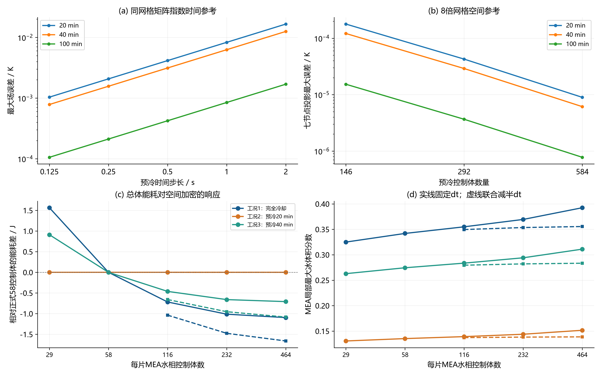

图10 预冷独立参考、固定时间步空间加密与空间时间联合加密对比。矢量版：[SVG](figures/图10_网格步长与控制周期检验.svg)。

### 补充检验：delivery_validation

| check | 通过 | detail |
| --- | --- | --- |
| report_local_links_exist | 是 | [] |
| 13_png_and_13_svg | 是 | 13/13 |
| image_readable_图01_预冷温度场族 | 是 | (3844, 1534) |
| image_readable_图02_预冷均温与温差 | 是 | (3844, 1414) |
| image_readable_图03_三工况初始温度 | 是 | (3964, 1324) |
| image_readable_图04_case1_动态控制轨迹 | 是 | (3844, 2464) |
| image_readable_图05_case2_动态控制轨迹 | 是 | (3844, 2464) |
| image_readable_图06_case3_动态控制轨迹 | 是 | (3844, 2464) |
| image_readable_图07_三工况主指标比较 | 是 | (3964, 2464) |
| image_readable_图08_预冷时间扫描 | 是 | (3964, 2404) |
| image_readable_图09_能量收支与累积能耗 | 是 | (3904, 1564) |
| image_readable_图10_网格步长与控制周期检验 | 是 | (3844, 2404) |
| image_readable_图11_物理参数与控制器敏感性 | 是 | (3964, 2584) |
| image_readable_图12_测量噪声与初场扰动 | 是 | (3844, 2464) |
| image_readable_图13_名义与留裕度备选 | 是 | (3784, 2464) |
| rows_main_results.csv | 是 | 9 |
| rows_constant_scan.csv | 是 | 19 |
| rows_guarded_results.csv | 是 | 3 |
| rows_robustness.csv | 是 | 90 |
| rows_guarded_robustness.csv | 是 | 90 |
| rows_coupled_convergence.csv | 是 | 9 |
| checks_independent_export_validation.csv | 是 | 1851/1851 |
| checks_model_validation.csv | 是 | 13/13 |
| checks_precooling_validation.csv | 是 | 11/11 |

数据源：[delivery_validation.csv](data/delivery_validation.csv)；共 24 行，CSV保留工作精度。

### 补充检验：model_validation

| 检验项目 | value | 容差 | 通过 |
| --- | --- | --- | --- |
| Q3_constant_success_time_error_s | 2.98007e-09 | 1.00000e-06 | 是 |
| Q3_constant_heater_energy_error_J | 3.44535e-07 | 0.0001 | 是 |
| Q3_constant_voltage_error_V | 3.28848e-13 | 1.00000e-07 | 是 |
| Q3_constant_ice_error | 8.17575e-15 | 1.00000e-07 | 是 |
| initially_warm_first_success_zero | 0 | 0 | 是 |
| initially_warm_energy_zero | 0 | 0 | 是 |
| initially_warm_heater_locked_zero | 0 | 0 | 是 |
| shutdown_latch_power_zero | 0 | 0 | 是 |
| shutdown_latch_energy_zero | 0 | 1.00000e-10 | 是 |
| hold_duration_error_s | 0 | 1.00000e-07 | 是 |
| safety_priority_survives_zero_taper | 0 | 1.00000e-12 | 是 |
| per_cell_power_bounds | 0 | 0 | 是 |
| invalid_inputs_rejected | 0 | 0 | 是 |

数据源：[model_validation.csv](data/model_validation.csv)；共 13 行，CSV保留工作精度。

## 9. 物理/控制参数敏感性及测量扰动检验

预冷敏感性分别改变h与BP/MEA等效导热倍率，端板材料导热率不变；该倍率是参数化的有效热阻扰动，不是实测接触热阻。固定20 min或40 min比较不同h时，更大h既增强换热也使温度更快接近环境，因此绝对温差未必单调变大。用全场温差除以剩余热容均温，可区别绝对温差与归一化不均匀程度。

### 表22 全部预冷传热敏感性组合

| 预冷/min | h/W·m⁻²·K⁻¹ | 导热倍率 | 等效G/W·m⁻²·K⁻¹ | 热容加权均温/℃ | 全场温差/K | 五片初始温差/K | 全场温差/剩余均温 | 堆级Bi |
| --- | --- | --- | --- | --- | --- | --- | --- | --- |
| 20 | 20 | 0.1 | 88.84963 | 3.77924 | 1.7682 | 1.15688 | 0.052346 | 0.578187 |
| 40 | 20 | 0.1 | 88.84963 | -9.24999 | 1.08619 | 0.710663 | 0.052347 | 0.578187 |
| 20 | 20 | 0.25 | 222.12408 | 3.73679 | 0.855869 | 0.453935 | 0.025369 | 0.239275 |
| 40 | 20 | 0.25 | 222.12408 | -9.30516 | 0.52501 | 0.278455 | 0.025369 | 0.239275 |
| 20 | 20 | 0.5 | 444.24816 | 3.72212 | 0.55923 | 0.225522 | 0.016583 | 0.126304 |
| 40 | 20 | 0.5 | 444.24816 | -9.32364 | 0.342886 | 0.138277 | 0.016583 | 0.126304 |
| 20 | 20 | 1 | 888.49631 | 3.71469 | 0.412286 | 0.112402 | 0.012229 | 0.069819 |
| 40 | 20 | 1 | 888.49631 | -9.33288 | 0.252731 | 0.068902 | 0.012229 | 0.069819 |
| 20 | 20 | 2 | 1776.99262 | 3.71096 | 0.339155 | 0.056111 | 0.010061 | 0.041576 |
| 40 | 20 | 2 | 1776.99262 | -9.33751 | 0.207879 | 0.034392 | 0.010061 | 0.041576 |
| 20 | 40 | 0.1 | 88.84963 | -9.05106 | 2.24085 | 1.47426 | 0.106967 | 1.15637 |
| 40 | 40 | 0.1 | 88.84963 | -22.01451 | 0.854199 | 0.561975 | 0.106969 | 1.15637 |
| 20 | 40 | 0.25 | 222.12408 | -9.15941 | 1.0621 | 0.565815 | 0.050963 | 0.47855 |
| 40 | 40 | 0.25 | 222.12408 | -22.10183 | 0.402514 | 0.214434 | 0.050963 | 0.47855 |
| 20 | 40 | 0.5 | 444.24816 | -9.19601 | 0.689541 | 0.27907 | 0.033145 | 0.252608 |
| 40 | 40 | 0.5 | 444.24816 | -22.13029 | 0.260839 | 0.105566 | 0.033145 | 0.252608 |
| 20 | 40 | 1 | 888.49631 | -9.21437 | 0.50693 | 0.138589 | 0.024388 | 0.139637 |
| 40 | 40 | 1 | 888.49631 | -22.14439 | 0.191587 | 0.052377 | 0.024388 | 0.139637 |
| 20 | 40 | 2 | 1776.99262 | -9.22357 | 0.416527 | 0.069059 | 0.020048 | 0.083152 |
| 40 | 40 | 2 | 1776.99262 | -22.15141 | 0.157349 | 0.026088 | 0.020048 | 0.083152 |
| 20 | 80 | 0.1 | 88.84963 | -21.69744 | 1.85519 | 1.23372 | 0.223448 | 2.31275 |
| 40 | 80 | 0.1 | 88.84963 | -28.74237 | 0.281017 | 0.186876 | 0.22345 | 2.31275 |
| 20 | 80 | 0.25 | 222.12408 | -21.87841 | 0.835099 | 0.448771 | 0.102825 | 0.957099 |
| 40 | 80 | 0.25 | 222.12408 | -28.79995 | 0.123396 | 0.066311 | 0.102825 | 0.957099 |
| 20 | 80 | 0.5 | 444.24816 | -21.93646 | 0.533778 | 0.217556 | 0.066197 | 0.505216 |
| 40 | 80 | 0.5 | 444.24816 | -28.8175 | 0.078278 | 0.031904 | 0.066197 | 0.505216 |
| 20 | 80 | 1 | 888.49631 | -21.965 | 0.389712 | 0.107126 | 0.048502 | 0.279275 |
| 40 | 80 | 1 | 888.49631 | -28.82598 | 0.056942 | 0.015652 | 0.048502 | 0.279275 |
| 20 | 80 | 2 | 1776.99262 | -21.97915 | 0.319267 | 0.053157 | 0.039805 | 0.166304 |
| 40 | 80 | 2 | 1776.99262 | -28.83016 | 0.046565 | 0.007753 | 0.039805 | 0.166304 |
| 20 | 160 | 0.1 | 88.84963 | -28.52064 | 0.721857 | 0.489781 | 0.487952 | 4.6255 |
| 40 | 160 | 0.1 | 88.84963 | -29.95955 | 0.019738 | 0.013392 | 0.487957 | 4.6255 |
| 20 | 160 | 0.25 | 222.12408 | -28.6602 | 0.280327 | 0.153181 | 0.209229 | 1.9142 |
| 40 | 160 | 0.25 | 222.12408 | -29.96727 | 0.006847 | 0.003742 | 0.20923 | 1.9142 |
| 20 | 160 | 0.5 | 444.24816 | -28.69953 | 0.171654 | 0.07092 | 0.131993 | 1.01043 |
| 40 | 160 | 0.5 | 444.24816 | -29.96922 | 0.004063 | 0.001679 | 0.131993 | 1.01043 |
| 20 | 160 | 1 | 888.49631 | -28.71797 | 0.122954 | 0.034157 | 0.095905 | 0.55855 |
| 40 | 160 | 1 | 888.49631 | -29.9701 | 0.002868 | 0.000797 | 0.095905 | 0.55855 |
| 20 | 160 | 2 | 1776.99262 | -28.7269 | 0.099884 | 0.016766 | 0.078457 | 0.332608 |
| 40 | 160 | 2 | 1776.99262 | -29.97052 | 0.002313 | 0.000388 | 0.078457 | 0.332608 |

数据源：[precooling_sensitivity.csv](data/precooling_sensitivity.csv)；共 40 行，CSV保留工作精度。

启动敏感性以各工况最终参数为基准，分别对片间G、片—端板G_EP、h、目标温度、比例增益、积分增益、冰量预警阈值和电压预警带作±20%单因素扰动；其余参数保持不变，控制器不重新优化。它刻画指定扰动方向的局部数值响应，不代表模型参数已经由试验识别。

### 表23 全部启动敏感性试验

| 工况 | 扰动参数 | 倍率 | 可行 | 辅助电能/J | 首次达标/s | 关热时刻/s | 最大五片温差/K | 最低电压/V | 最大冰体积分数 | 关热最低片温/℃ |
| --- | --- | --- | --- | --- | --- | --- | --- | --- | --- | --- |
| 工况1：完全冷却 | G | 0.8 | 是 | 2863.22461 | 94.64057 | 96.64057 | 7.98886 | 0.551351 | 0.341932 | 0.042416 |
| 工况1：完全冷却 | G | 1.2 | 是 | 2804.07176 | 94.63913 | 96.63913 | 5.6719 | 0.55135 | 0.341931 | 0.042621 |
| 工况1：完全冷却 | G_EP | 0.8 | 是 | 2418.13893 | 94.63984 | 96.63984 | 6.60942 | 0.551348 | 0.341939 | 0.041848 |
| 工况1：完全冷却 | G_EP | 1.2 | 是 | 3165.09614 | 94.63974 | 96.63974 | 6.6098 | 0.551353 | 0.341926 | 0.04209 |
| 工况1：完全冷却 | h | 0.8 | 是 | 2769.23686 | 94.63971 | 96.63971 | 6.60956 | 0.55135 | 0.341932 | 0.042385 |
| 工况1：完全冷却 | h | 1.2 | 是 | 2887.68762 | 94.63966 | 96.63966 | 6.60961 | 0.55135 | 0.341932 | 0.042286 |
| 工况1：完全冷却 | T_target | 0.8 | 否 | 2818.62457 | 94.85422 | -1 | 6.62048 | 0.551163 | 0.343439 | -0.006118 |
| 工况1：完全冷却 | T_target | 1.2 | 是 | 2831.99767 | 94.4262 | 96.4262 | 6.59869 | 0.551537 | 0.340433 | 0.103484 |
| 工况1：完全冷却 | K_P | 0.8 | 是 | 2827.76282 | 94.62059 | 96.62059 | 6.6129 | 0.551348 | 0.341937 | 0.041296 |
| 工况1：完全冷却 | K_P | 1.2 | 是 | 2828.9765 | 94.65326 | 96.65326 | 6.60713 | 0.551352 | 0.341927 | 0.043549 |
| 工况1：完全冷却 | K_I | 0.8 | 否 | 2828.88035 | 94.72232 | -1 | 6.57691 | 0.551264 | 0.342006 | 0.043165 |
| 工况1：完全冷却 | K_I | 1.2 | 否 | 2829.92864 | 94.69236 | -1 | 6.62731 | 0.551439 | 0.341838 | 0.043266 |
| 工况1：完全冷却 | ice_warn | 0.8 | 是 | 2828.46932 | 94.63969 | 96.63969 | 6.60958 | 0.55135 | 0.341932 | 0.042633 |
| 工况1：完全冷却 | ice_warn | 1.2 | 是 | 2828.46932 | 94.63969 | 96.63969 | 6.60958 | 0.55135 | 0.341932 | 0.042633 |
| 工况1：完全冷却 | delta_V | 0.8 | 是 | 2828.46932 | 94.63969 | 96.63969 | 6.60958 | 0.55135 | 0.341932 | 0.042633 |
| 工况1：完全冷却 | delta_V | 1.2 | 是 | 2828.46932 | 94.63969 | 96.63969 | 6.60958 | 0.55135 | 0.341932 | 0.042633 |
| 工况2：预冷20 min | G | 0.8 | 是 | 0 | 87.0123 | 89.0123 | 10.82675 | 0.595526 | 0.143088 | 0.208628 |
| 工况2：预冷20 min | G | 1.2 | 是 | 0 | 83.14273 | 85.14273 | 7.45445 | 0.597171 | 0.129953 | 0.209259 |
| 工况2：预冷20 min | G_EP | 0.8 | 是 | 0 | 76.78338 | 78.78338 | 8.56432 | 0.598752 | 0.116302 | 0.248616 |
| 工况2：预冷20 min | G_EP | 1.2 | 是 | 0 | 91.2766 | 93.2766 | 8.89762 | 0.594709 | 0.154086 | 0.197832 |
| 工况2：预冷20 min | h | 0.8 | 是 | 0 | 80.22103 | 82.22103 | 8.75999 | 0.598236 | 0.122079 | 0.229773 |
| 工况2：预冷20 min | h | 1.2 | 是 | 0 | 89.73634 | 91.73634 | 8.87328 | 0.594752 | 0.150229 | 0.190966 |
| 工况2：预冷20 min | T_target | 0.8 | 是 | 0 | 84.7246 | 86.7246 | 8.83426 | 0.596473 | 0.135273 | 0.20903 |
| 工况2：预冷20 min | T_target | 1.2 | 是 | 0 | 84.7246 | 86.7246 | 8.83426 | 0.596473 | 0.135273 | 0.20903 |
| 工况2：预冷20 min | K_P | 0.8 | 是 | 0 | 84.7246 | 86.7246 | 8.83426 | 0.596473 | 0.135273 | 0.20903 |
| 工况2：预冷20 min | K_P | 1.2 | 是 | 0 | 84.7246 | 86.7246 | 8.83426 | 0.596473 | 0.135273 | 0.20903 |
| 工况2：预冷20 min | K_I | 0.8 | 是 | 0 | 84.7246 | 86.7246 | 8.83426 | 0.596473 | 0.135273 | 0.20903 |
| 工况2：预冷20 min | K_I | 1.2 | 是 | 0 | 84.7246 | 86.7246 | 8.83426 | 0.596473 | 0.135273 | 0.20903 |
| 工况2：预冷20 min | ice_warn | 0.8 | 是 | 0 | 84.7246 | 86.7246 | 8.83426 | 0.596473 | 0.135273 | 0.20903 |
| 工况2：预冷20 min | ice_warn | 1.2 | 是 | 0 | 84.7246 | 86.7246 | 8.83426 | 0.596473 | 0.135273 | 0.20903 |
| 工况2：预冷20 min | delta_V | 0.8 | 是 | 0 | 84.7246 | 86.7246 | 8.83426 | 0.596473 | 0.135273 | 0.20903 |
| 工况2：预冷20 min | delta_V | 1.2 | 是 | 0 | 84.7246 | 86.7246 | 8.83426 | 0.596473 | 0.135273 | 0.20903 |
| 工况3：预冷40 min | G | 0.8 | 是 | 1798.02085 | 94.65382 | 96.65382 | 9.02071 | 0.569164 | 0.274468 | 0.466321 |
| 工况3：预冷40 min | G | 1.2 | 是 | 1731.20211 | 94.65343 | 96.65343 | 6.38074 | 0.569164 | 0.274468 | 0.466323 |
| 工况3：预冷40 min | G_EP | 0.8 | 是 | 1455.51281 | 94.65366 | 96.65366 | 7.46565 | 0.569163 | 0.27447 | 0.466334 |
| 工况3：预冷40 min | G_EP | 1.2 | 是 | 2007.65823 | 94.65355 | 96.65355 | 7.46562 | 0.569164 | 0.274467 | 0.466314 |
| 工况3：预冷40 min | h | 0.8 | 是 | 1684.56813 | 94.65357 | 96.65357 | 7.46563 | 0.569164 | 0.274469 | 0.466323 |
| 工况3：预冷40 min | h | 1.2 | 是 | 1833.01425 | 94.65355 | 96.65355 | 7.46563 | 0.569164 | 0.274468 | 0.466323 |
| 工况3：预冷40 min | T_target | 0.8 | 否 | 1663.36511 | -1 | -1 | 7.5517 | 0.567593 | 0.289297 | -0.118628 |
| 工况3：预冷40 min | T_target | 1.2 | 是 | 1785.20775 | 92.24717 | 94.24717 | 7.38032 | 0.570731 | 0.260581 | 0.478692 |
| 工况3：预冷40 min | K_P | 0.8 | 是 | 1758.75399 | 94.65177 | 96.65177 | 7.46492 | 0.569167 | 0.27447 | 0.466122 |
| 工况3：预冷40 min | K_P | 1.2 | 是 | 1758.80543 | 94.65423 | 96.65423 | 7.466 | 0.569162 | 0.274468 | 0.466419 |
| 工况3：预冷40 min | K_I | 0.8 | 是 | 1758.8334 | 94.65868 | 96.65868 | 7.46644 | 0.569159 | 0.27448 | 0.466474 |
| 工况3：预冷40 min | K_I | 1.2 | 是 | 1758.83039 | 94.65355 | 96.65355 | 7.4659 | 0.56916 | 0.27446 | 0.466469 |
| 工况3：预冷40 min | ice_warn | 0.8 | 是 | 1758.7912 | 94.65356 | 96.65356 | 7.46563 | 0.569164 | 0.274468 | 0.466323 |
| 工况3：预冷40 min | ice_warn | 1.2 | 是 | 1758.7912 | 94.65356 | 96.65356 | 7.46563 | 0.569164 | 0.274468 | 0.466323 |
| 工况3：预冷40 min | delta_V | 0.8 | 是 | 1758.7912 | 94.65356 | 96.65356 | 7.46563 | 0.569164 | 0.274468 | 0.466323 |
| 工况3：预冷40 min | delta_V | 1.2 | 是 | 1758.7912 | 94.65356 | 96.65356 | 7.46563 | 0.569164 | 0.274468 | 0.466323 |

数据源：[sensitivity.csv](data/sensitivity.csv)；共 48 行，CSV保留工作精度。

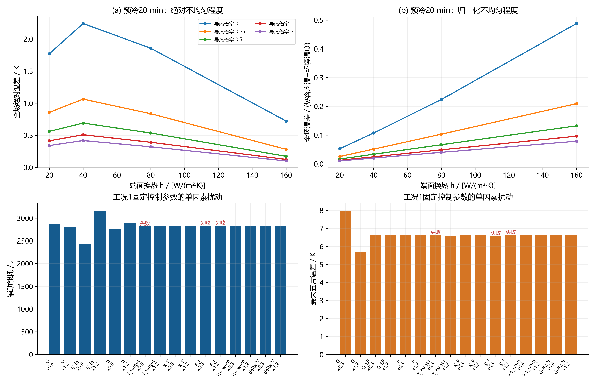

图11 预冷绝对/归一化梯度及工况1启动单因素敏感性；全部工况结果见表23。矢量版：[SVG](figures/图11_物理参数与控制器敏感性.svg)。

测量扰动试验：温度噪声为独立零均值高斯噪声，标准差0.2 K；电压噪声标准差0.005 V；每一初场平移−1、0、+1 K分别使用种子1000–1009共10次，三工况总计90次。初温扰动同时施加到五片和两端板，参考轨迹仍按该试验输入初温生成，增益与整定参数不变。

这里的噪声只进入control函数的温度/电压反馈通道；全局成功判定valid与关热计时仍使用被控模型真值，冰软测量的模型先验状态也理想已知。因此这是一项反馈通道扰动仿真，并非完整实机传感—观测—安全停机链的验证。若部署，需要另行验证带估计误差的成功判定、传感器偏置/故障以及冰状态观测误差。

### 表24 全部90次测量与初场扰动

| 工况 | 随机种子 | 温度噪声标准差/K | 电压噪声标准差/V | 初场平移/K | 可行 | 辅助电能/J | 首次达标/s | 关热时刻/s | 关热最低片温/℃ | 最大五片温差/K | 最低电压/V | 最大冰体积分数 |
| --- | --- | --- | --- | --- | --- | --- | --- | --- | --- | --- | --- | --- |
| 工况1：完全冷却 | 1000 | 0.2 | 0.005 | -1 | 否 | 2955.67665 | 95.90922 | -1 | 0.032028 | 6.51418 | 0.54748 | 0.353484 |
| 工况1：完全冷却 | 1001 | 0.2 | 0.005 | -1 | 否 | 2948.38747 | 94.7536 | -1 | -0.223501 | 6.69479 | 0.547627 | 0.353726 |
| 工况1：完全冷却 | 1002 | 0.2 | 0.005 | -1 | 否 | 2950.41582 | 94.87288 | -1 | -0.299749 | 6.70632 | 0.547528 | 0.354124 |
| 工况1：完全冷却 | 1003 | 0.2 | 0.005 | -1 | 否 | 2954.48439 | 95.2519 | -1 | -0.024808 | 6.61078 | 0.548119 | 0.353785 |
| 工况1：完全冷却 | 1004 | 0.2 | 0.005 | -1 | 否 | 2948.4995 | 94.96206 | -1 | -0.331481 | 6.63473 | 0.547503 | 0.354354 |
| 工况1：完全冷却 | 1005 | 0.2 | 0.005 | -1 | 否 | 2954.1259 | 94.56551 | -1 | -0.101265 | 6.80557 | 0.548171 | 0.35363 |
| 工况1：完全冷却 | 1006 | 0.2 | 0.005 | -1 | 否 | 2955.24418 | 95.19611 | -1 | -0.176249 | 6.59749 | 0.548408 | 0.353404 |
| 工况1：完全冷却 | 1007 | 0.2 | 0.005 | -1 | 否 | 2952.24335 | 95.6637 | -1 | -0.049934 | 6.79907 | 0.547195 | 0.354382 |
| 工况1：完全冷却 | 1008 | 0.2 | 0.005 | -1 | 否 | 2945.34213 | 95.44671 | -1 | -0.335455 | 6.613 | 0.547704 | 0.354497 |
| 工况1：完全冷却 | 1009 | 0.2 | 0.005 | -1 | 否 | 2952.23645 | 95.28301 | -1 | -0.064456 | 6.56848 | 0.547601 | 0.353906 |
| 工况1：完全冷却 | 1000 | 0.2 | 0.005 | 0 | 否 | 2819.82563 | 95.81991 | -1 | 0.037443 | 6.62209 | 0.549787 | 0.344711 |
| 工况1：完全冷却 | 1001 | 0.2 | 0.005 | 0 | 否 | 2812.68572 | 94.73599 | -1 | -0.214933 | 6.80731 | 0.549956 | 0.344929 |
| 工况1：完全冷却 | 1002 | 0.2 | 0.005 | 0 | 否 | 2814.91599 | 94.82199 | -1 | -0.274823 | 6.81192 | 0.549822 | 0.345332 |
| 工况1：完全冷却 | 1003 | 0.2 | 0.005 | 0 | 否 | 2818.51512 | 95.26858 | -1 | -0.024786 | 6.72491 | 0.550429 | 0.345014 |
| 工况1：完全冷却 | 1004 | 0.2 | 0.005 | 0 | 否 | 2812.88335 | 94.9291 | -1 | -0.318478 | 6.73989 | 0.549794 | 0.345606 |
| 工况1：完全冷却 | 1005 | 0.2 | 0.005 | 0 | 否 | 2818.76973 | 94.45835 | -1 | -0.09333 | 6.89548 | 0.550484 | 0.344852 |
| 工况1：完全冷却 | 1006 | 0.2 | 0.005 | 0 | 否 | 2819.29564 | 95.22776 | -1 | -0.168029 | 6.71702 | 0.550717 | 0.344688 |
| 工况1：完全冷却 | 1007 | 0.2 | 0.005 | 0 | 否 | 2816.826 | 94.82097 | -1 | -0.039641 | 6.88717 | 0.549539 | 0.345553 |
| 工况1：完全冷却 | 1008 | 0.2 | 0.005 | 0 | 否 | 2809.6415 | 95.46727 | -1 | -0.323556 | 6.70817 | 0.549999 | 0.345748 |
| 工况1：完全冷却 | 1009 | 0.2 | 0.005 | 0 | 否 | 2816.45298 | 95.29547 | -1 | -0.061709 | 6.66558 | 0.549904 | 0.345091 |
| 工况1：完全冷却 | 1000 | 0.2 | 0.005 | 1 | 否 | 2683.95961 | 95.74454 | -1 | 0.042542 | 6.72865 | 0.552112 | 0.335933 |
| 工况1：完全冷却 | 1001 | 0.2 | 0.005 | 1 | 否 | 2676.83972 | 94.77238 | -1 | -0.20572 | 6.919 | 0.552261 | 0.336169 |
| 工况1：完全冷却 | 1002 | 0.2 | 0.005 | 1 | 否 | 2679.27136 | 94.7669 | -1 | -0.243735 | 6.91792 | 0.552113 | 0.336577 |
| 工况1：完全冷却 | 1003 | 0.2 | 0.005 | 1 | 否 | 2682.49858 | 95.27907 | -1 | -0.023843 | 6.8377 | 0.552764 | 0.336237 |
| 工况1：完全冷却 | 1004 | 0.2 | 0.005 | 1 | 否 | 2677.20878 | 94.88796 | -1 | -0.298383 | 6.84662 | 0.552088 | 0.33689 |
| 工况1：完全冷却 | 1005 | 0.2 | 0.005 | 1 | 否 | 2682.91338 | 94.39244 | -1 | -0.084862 | 6.99844 | 0.552769 | 0.336109 |
| 工况1：完全冷却 | 1006 | 0.2 | 0.005 | 1 | 否 | 2683.27058 | 95.25848 | -1 | -0.159027 | 6.83781 | 0.552981 | 0.335991 |
| 工况1：完全冷却 | 1007 | 0.2 | 0.005 | 1 | 否 | 2681.11779 | 94.76938 | -1 | -0.029334 | 6.97283 | 0.551881 | 0.33675 |
| 工况1：完全冷却 | 1008 | 0.2 | 0.005 | 1 | 否 | 2673.79606 | 95.48197 | -1 | -0.311479 | 6.80483 | 0.552296 | 0.337018 |
| 工况1：完全冷却 | 1009 | 0.2 | 0.005 | 1 | 否 | 2680.45916 | 95.30266 | -1 | -0.057253 | 6.77143 | 0.552208 | 0.336328 |
| 工况2：预冷20 min | 1000 | 0.2 | 0.005 | -1 | 是 | 0 | 93.36317 | 95.36317 | 0.196178 | 8.77937 | 0.591994 | 0.16908 |
| 工况2：预冷20 min | 1001 | 0.2 | 0.005 | -1 | 是 | 0 | 93.36317 | 95.36317 | 0.196178 | 8.77937 | 0.591994 | 0.16908 |
| 工况2：预冷20 min | 1002 | 0.2 | 0.005 | -1 | 是 | 0 | 93.36317 | 95.36317 | 0.196178 | 8.77937 | 0.591994 | 0.16908 |
| 工况2：预冷20 min | 1003 | 0.2 | 0.005 | -1 | 是 | 0 | 93.36317 | 95.36317 | 0.196178 | 8.77937 | 0.591994 | 0.16908 |
| 工况2：预冷20 min | 1004 | 0.2 | 0.005 | -1 | 是 | 0 | 93.36317 | 95.36317 | 0.196178 | 8.77937 | 0.591994 | 0.16908 |
| 工况2：预冷20 min | 1005 | 0.2 | 0.005 | -1 | 是 | 0 | 93.36317 | 95.36317 | 0.196178 | 8.77937 | 0.591994 | 0.16908 |
| 工况2：预冷20 min | 1006 | 0.2 | 0.005 | -1 | 是 | 0 | 93.36317 | 95.36317 | 0.196178 | 8.77937 | 0.591994 | 0.16908 |
| 工况2：预冷20 min | 1007 | 0.2 | 0.005 | -1 | 是 | 0 | 93.36317 | 95.36317 | 0.196178 | 8.77937 | 0.591994 | 0.16908 |
| 工况2：预冷20 min | 1008 | 0.2 | 0.005 | -1 | 是 | 0 | 93.36317 | 95.36317 | 0.196178 | 8.77937 | 0.591994 | 0.16908 |
| 工况2：预冷20 min | 1009 | 0.2 | 0.005 | -1 | 是 | 0 | 93.36317 | 95.36317 | 0.196178 | 8.77937 | 0.591994 | 0.16908 |
| 工况2：预冷20 min | 1000 | 0.2 | 0.005 | 0 | 是 | 0 | 84.7246 | 86.7246 | 0.20903 | 8.83426 | 0.596473 | 0.135273 |
| 工况2：预冷20 min | 1001 | 0.2 | 0.005 | 0 | 是 | 0 | 84.7246 | 86.7246 | 0.20903 | 8.83426 | 0.596473 | 0.135273 |
| 工况2：预冷20 min | 1002 | 0.2 | 0.005 | 0 | 是 | 0 | 84.7246 | 86.7246 | 0.20903 | 8.83426 | 0.596473 | 0.135273 |
| 工况2：预冷20 min | 1003 | 0.2 | 0.005 | 0 | 是 | 0 | 84.7246 | 86.7246 | 0.20903 | 8.83426 | 0.596473 | 0.135273 |
| 工况2：预冷20 min | 1004 | 0.2 | 0.005 | 0 | 是 | 0 | 84.7246 | 86.7246 | 0.20903 | 8.83426 | 0.596473 | 0.135273 |
| 工况2：预冷20 min | 1005 | 0.2 | 0.005 | 0 | 是 | 0 | 84.7246 | 86.7246 | 0.20903 | 8.83426 | 0.596473 | 0.135273 |
| 工况2：预冷20 min | 1006 | 0.2 | 0.005 | 0 | 是 | 0 | 84.7246 | 86.7246 | 0.20903 | 8.83426 | 0.596473 | 0.135273 |
| 工况2：预冷20 min | 1007 | 0.2 | 0.005 | 0 | 是 | 0 | 84.7246 | 86.7246 | 0.20903 | 8.83426 | 0.596473 | 0.135273 |
| 工况2：预冷20 min | 1008 | 0.2 | 0.005 | 0 | 是 | 0 | 84.7246 | 86.7246 | 0.20903 | 8.83426 | 0.596473 | 0.135273 |
| 工况2：预冷20 min | 1009 | 0.2 | 0.005 | 0 | 是 | 0 | 84.7246 | 86.7246 | 0.20903 | 8.83426 | 0.596473 | 0.135273 |
| 工况2：预冷20 min | 1000 | 0.2 | 0.005 | 1 | 是 | 0 | 76.77508 | 78.77508 | 0.231249 | 8.78473 | 0.60096 | 0.106968 |
| 工况2：预冷20 min | 1001 | 0.2 | 0.005 | 1 | 是 | 0 | 76.77508 | 78.77508 | 0.231249 | 8.78473 | 0.60096 | 0.106968 |
| 工况2：预冷20 min | 1002 | 0.2 | 0.005 | 1 | 是 | 0 | 76.77508 | 78.77508 | 0.231249 | 8.78473 | 0.60096 | 0.106968 |
| 工况2：预冷20 min | 1003 | 0.2 | 0.005 | 1 | 是 | 0 | 76.77508 | 78.77508 | 0.231249 | 8.78473 | 0.60096 | 0.106968 |
| 工况2：预冷20 min | 1004 | 0.2 | 0.005 | 1 | 是 | 0 | 76.77508 | 78.77508 | 0.231249 | 8.78473 | 0.60096 | 0.106968 |
| 工况2：预冷20 min | 1005 | 0.2 | 0.005 | 1 | 是 | 0 | 76.77508 | 78.77508 | 0.231249 | 8.78473 | 0.60096 | 0.106968 |
| 工况2：预冷20 min | 1006 | 0.2 | 0.005 | 1 | 是 | 0 | 76.77508 | 78.77508 | 0.231249 | 8.78473 | 0.60096 | 0.106968 |
| 工况2：预冷20 min | 1007 | 0.2 | 0.005 | 1 | 是 | 0 | 76.77508 | 78.77508 | 0.231249 | 8.78473 | 0.60096 | 0.106968 |
| 工况2：预冷20 min | 1008 | 0.2 | 0.005 | 1 | 是 | 0 | 76.77508 | 78.77508 | 0.231249 | 8.78473 | 0.60096 | 0.106968 |
| 工况2：预冷20 min | 1009 | 0.2 | 0.005 | 1 | 是 | 0 | 76.77508 | 78.77508 | 0.231249 | 8.78473 | 0.60096 | 0.106968 |
| 工况3：预冷40 min | 1000 | 0.2 | 0.005 | -1 | 否 | 1877.26412 | 95.324 | -1 | 0.272399 | 7.44952 | 0.566351 | 0.286481 |
| 工况3：预冷40 min | 1001 | 0.2 | 0.005 | -1 | 否 | 1872.91468 | 95.48445 | -1 | 0.302827 | 7.59332 | 0.566434 | 0.287399 |
| 工况3：预冷40 min | 1002 | 0.2 | 0.005 | -1 | 否 | 1871.67816 | 95.74158 | -1 | 0.237709 | 7.4883 | 0.566033 | 0.28742 |
| 工况3：预冷40 min | 1003 | 0.2 | 0.005 | -1 | 否 | 1875.06965 | 95.42276 | -1 | 0.338467 | 7.50171 | 0.566608 | 0.287502 |
| 工况3：预冷40 min | 1004 | 0.2 | 0.005 | -1 | 否 | 1875.76513 | 95.28886 | -1 | 0.359141 | 7.50018 | 0.56654 | 0.28735 |
| 工况3：预冷40 min | 1005 | 0.2 | 0.005 | -1 | 否 | 1878.19434 | 95.28014 | -1 | 0.298982 | 7.48789 | 0.566636 | 0.286876 |
| 工况3：预冷40 min | 1006 | 0.2 | 0.005 | -1 | 否 | 1872.27998 | 95.601 | -1 | 0.288681 | 7.50441 | 0.56622 | 0.287535 |
| 工况3：预冷40 min | 1007 | 0.2 | 0.005 | -1 | 否 | 1876.13787 | 95.25273 | -1 | 0.327346 | 7.43332 | 0.566321 | 0.287429 |
| 工况3：预冷40 min | 1008 | 0.2 | 0.005 | -1 | 否 | 1872.39088 | 95.43279 | -1 | 0.337607 | 7.45838 | 0.566317 | 0.287573 |
| 工况3：预冷40 min | 1009 | 0.2 | 0.005 | -1 | 否 | 1873.13916 | 95.45016 | -1 | 0.330054 | 7.50344 | 0.565795 | 0.287364 |
| 工况3：预冷40 min | 1000 | 0.2 | 0.005 | 0 | 是 | 1757.21229 | 94.56702 | 96.56702 | 0.364067 | 7.54479 | 0.568979 | 0.274603 |
| 工况3：预冷40 min | 1001 | 0.2 | 0.005 | 0 | 否 | 1755.54238 | 95.05544 | -1 | 0.415507 | 7.68948 | 0.569059 | 0.275469 |
| 工况3：预冷40 min | 1002 | 0.2 | 0.005 | 0 | 否 | 1754.2835 | 95.21792 | -1 | 0.349683 | 7.58458 | 0.568663 | 0.275507 |
| 工况3：预冷40 min | 1003 | 0.2 | 0.005 | 0 | 否 | 1757.63235 | 94.96525 | -1 | 0.450432 | 7.59677 | 0.569237 | 0.275589 |
| 工况3：预冷40 min | 1004 | 0.2 | 0.005 | 0 | 否 | 1758.41681 | 94.75025 | -1 | 0.473886 | 7.59992 | 0.569178 | 0.275454 |
| 工况3：预冷40 min | 1005 | 0.2 | 0.005 | 0 | 否 | 1760.80689 | 94.70967 | -1 | 0.411756 | 7.59406 | 0.569239 | 0.275041 |
| 工况3：预冷40 min | 1006 | 0.2 | 0.005 | 0 | 否 | 1754.85233 | 95.13285 | -1 | 0.400655 | 7.60232 | 0.568828 | 0.275613 |
| 工况3：预冷40 min | 1007 | 0.2 | 0.005 | 0 | 是 | 1754.39849 | 94.50812 | 96.50812 | 0.405114 | 7.52861 | 0.568943 | 0.275563 |
| 工况3：预冷40 min | 1008 | 0.2 | 0.005 | 0 | 否 | 1754.9657 | 95.01695 | -1 | 0.450066 | 7.55817 | 0.568949 | 0.275705 |
| 工况3：预冷40 min | 1009 | 0.2 | 0.005 | 0 | 否 | 1755.79434 | 95.00221 | -1 | 0.443764 | 7.6032 | 0.568426 | 0.275429 |
| 工况3：预冷40 min | 1000 | 0.2 | 0.005 | 1 | 是 | 1621.51508 | 93.81715 | 95.81715 | 0.335124 | 7.64164 | 0.571613 | 0.262559 |
| 工况3：预冷40 min | 1001 | 0.2 | 0.005 | 1 | 是 | 1636.37192 | 94.60186 | 96.60186 | 0.51206 | 7.78847 | 0.571688 | 0.263347 |
| 工况3：预冷40 min | 1002 | 0.2 | 0.005 | 1 | 是 | 1635.43311 | 94.61213 | 96.61213 | 0.44933 | 7.68464 | 0.571297 | 0.263426 |
| 工况3：预冷40 min | 1003 | 0.2 | 0.005 | 1 | 是 | 1633.53051 | 94.42151 | 96.42151 | 0.491277 | 7.69578 | 0.571871 | 0.263497 |
| 工况3：预冷40 min | 1004 | 0.2 | 0.005 | 1 | 是 | 1628.6443 | 94.18946 | 96.18946 | 0.470958 | 7.70408 | 0.571822 | 0.263385 |
| 工况3：预冷40 min | 1005 | 0.2 | 0.005 | 1 | 是 | 1627.12987 | 94.02463 | 96.02463 | 0.39411 | 7.70405 | 0.571848 | 0.263028 |
| 工况3：预冷40 min | 1006 | 0.2 | 0.005 | 1 | 是 | 1635.28625 | 94.58635 | 96.58635 | 0.493099 | 7.70395 | 0.571443 | 0.263515 |
| 工况3：预冷40 min | 1007 | 0.2 | 0.005 | 1 | 是 | 1623.17192 | 93.95507 | 95.95507 | 0.402601 | 7.62799 | 0.571567 | 0.263522 |
| 工况3：预冷40 min | 1008 | 0.2 | 0.005 | 1 | 是 | 1634.28283 | 94.5432 | 96.5432 | 0.533873 | 7.66212 | 0.571585 | 0.263666 |
| 工况3：预冷40 min | 1009 | 0.2 | 0.005 | 1 | 是 | 1632.28161 | 94.42917 | 96.42917 | 0.504317 | 7.70587 | 0.571065 | 0.263312 |

数据源：[robustness.csv](data/robustness.csv)；共 90 行，CSV保留工作精度。

### 表25 扰动统计（同组混合初场平移）

| 工况 | 试验数 | 可行数 | 能耗均值/J | 能耗标准差/J | 能耗最小/J | 能耗最大/J | 最低电压/V | 最大冰体积分数 |
| --- | --- | --- | --- | --- | --- | --- | --- | --- |
| 工况1：完全冷却 | 30 | 0 | 2815.92675 | 112.79462 | 2673.79606 | 2955.67665 | 0.547195 | 0.354497 |
| 工况2：预冷20 min | 30 | 30 | 0 | 0 | 0 | 0 | 0.591994 | 0.16908 |
| 工况3：预冷40 min | 30 | 12 | 1753.87955 | 101.2734 | 1621.51508 | 1878.19434 | 0.565795 | 0.287573 |

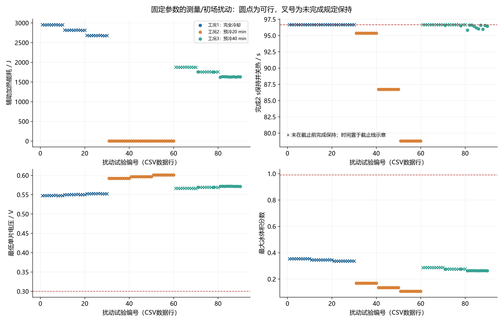

图12 固定整定参数的90次扰动试验；序号与CSV数据行一致。矢量版：[SVG](figures/图12_测量噪声与初场扰动.svg)。

本次扰动试验可行数为42/90。若全部通过，只能称为这组有限种子和扰动幅值内通过；高斯噪声理论上无界，有限蒙特卡洛试验不能证明任意噪声下都安全。可行性判据统计到关热时刻，不能把它与无限时间的闭环鲁棒稳定性等同。

失败轨迹的电压与冰量都没有越过硬安全阈值，主要问题是时间预算与保持条件：有的温度在冰点附近波动导致保持计时重置，有的首次达标太晚，剩余不足2 s。表中stop_s=−1表示在规定时限内没有完成关热条件，不是负的物理关热时间。失败组E_aux_J是截至仿真终止的已消耗电能，不能作为“成功节能”样本混入结论。

### 9.1 留时间与温度裕度的备选方案

在保留名义最小能耗结果的基础上，补做有限候选的裕度设计。工况1/3将名义规划时间乘0.98、0.95、0.90、0.85，同时把目标温度提高到不少于1、2、3 ℃；连同原参数，每工况13个候选。工况2保留零名义功率模式。每候选用初温偏差±1 K及种子2000、2001、2002共6种训练扰动筛选，在所有训练点可行的候选中选名义辅助电能最低者。训练Δt=0.05 s、网格倍率2；最终轨迹以Δt=0.025 s重新计算。

随后采用全新的种子3000–3009、初场偏差−1/0/+1 K，仍为温度噪声标准差0.2 K、电压噪声标准差5 mV，每工况30次，总90次独立验证。训练种子、名义策略原噪声检验种子与本次验证种子互不相同；比较可行比例是各自种子组的经验比例，不是严格配对试验，也不是置信保证。

### 备选方案全部控制参数

| 工况 | 目标温度/℃ | 规划时间/s | 比例增益 | 积分增益 | 渐缩带/K | 保持/s | 安全增强起值/W·cm⁻² | 冰量预警 | 电压预警带/V | 综合风险阈值 | 电压校正增益 | 温升不足补偿增益 | 前馈倍率 |
| --- | --- | --- | --- | --- | --- | --- | --- | --- | --- | --- | --- | --- | --- |
| 工况1：完全冷却 | 1 | 93.88468 | 0.029889 | 0.027047 | 0.302043 | 2 | 0.6 | 0.8 | 0.1 | 0.7 | 0.02 | 0.309067 | 1 |
| 工况2：预冷20 min | 1 | 60 | 0 | 0 | 1 | 2 | 0.6 | 0.8 | 0.1 | 0.7 | 0.02 | 0 | 0 |
| 工况3：预冷40 min | 3.31089 | 106.72287 | 0.100018 | 0.069229 | 0.49485 | 2 | 0.6 | 0.8 | 0.1 | 0.7 | 0.02 | 0.223223 | 1 |

数据源：[guarded_parameters.csv](data/guarded_parameters.csv)；共 3 行，CSV保留工作精度。

### 备选方案主结果与关热后验证

| 工况 | 策略 | 可行 | 辅助电能/J | 首次达标/s | 关热时刻/s | 最大五片温差/K | 最低电压/V | 最大冰体积分数 | 峰值单片功率/W·cm⁻² | 关热最低片温/℃ | 关热后最低片温/℃ | 关热后最低电压/V | 关热后最大冰体积分数 | 关热后辅助电能/J |
| --- | --- | --- | --- | --- | --- | --- | --- | --- | --- | --- | --- | --- | --- | --- |
| 工况1：完全冷却 | 留裕度备选＋2 s保持 | 是 | 2867.69131 | 90.78602 | 92.78602 | 6.40543 | 0.554857 | 0.315098 | 0.971261 | 0.662073 | -4.2986 | 0.556809 | 0.523701 | 0 |
| 工况2：预冷20 min | 留裕度备选＋2 s保持 | 是 | 0 | 84.7246 | 86.7246 | 8.83426 | 0.596473 | 0.135273 | 0 | 0.20903 | 0.20903 | 0.608813 | 0.13517 | 0 |
| 工况3：预冷40 min | 留裕度备选＋2 s保持 | 是 | 1779.69367 | 92.75879 | 94.75879 | 7.39877 | 0.570392 | 0.263515 | 0.561928 | 0.475998 | -1.94226 | 0.585593 | 0.32057 | 0 |

数据源：[guarded_results.csv](data/guarded_results.csv)；共 3 行，CSV保留工作精度。

### 备选成本、时间裕度与验证汇总

| 工况 | 较名义增加电能/J | 较名义增加/% | 较恒功率保持节能/% | 名义截止前裕度/s | 验证通过数 | 验证总数 | 验证最大关热/s |
| --- | --- | --- | --- | --- | --- | --- | --- |
| 工况1：完全冷却 | 39.22199 | 1.38669 | 10.58697 | 3.88065 | 30 | 30 | 93.65782 |
| 工况2：预冷20 min | 0 | 0 | 100 | 9.94207 | 30 | 30 | 95.36317 |
| 工况3：预冷40 min | 20.90247 | 1.18846 | 19.13816 | 1.90787 | 30 | 30 | 95.86261 |

### 备选全部候选及训练筛选

| 工况 | candidate | 目标温度/℃ | 规划时间/s | training_passed | training_count | all_training_passed | training_max_stop_s | 辅助电能/J | 关热时刻/s | 最低电压/V | 最大冰体积分数 |
| --- | --- | --- | --- | --- | --- | --- | --- | --- | --- | --- | --- |
| 工况1：完全冷却 | 0 | 0.34268 | 95.8007 | 0 | 6 | 否 | 96.63889 | 2829.19245 | 96.63889 | 0.551546 | 0.347248 |
| 工况1：完全冷却 | 1 | 1 | 93.88468 | 6 | 6 | 是 | 93.59718 | 2868.42604 | 92.78496 | 0.555046 | 0.320117 |
| 工况1：完全冷却 | 2 | 2 | 93.88468 | 6 | 6 | 是 | 91.25264 | 2882.20976 | 89.96171 | 0.557802 | 0.300577 |
| 工况1：完全冷却 | 3 | 3 | 93.88468 | 6 | 6 | 是 | 89.06779 | 2892.76027 | 87.34923 | 0.560547 | 0.282554 |
| 工况1：完全冷却 | 4 | 1 | 91.01066 | 6 | 6 | 是 | 91.21097 | 2881.99036 | 90.02016 | 0.557744 | 0.30097 |
| 工况1：完全冷却 | 5 | 2 | 91.01066 | 6 | 6 | 是 | 88.97186 | 2892.89758 | 87.32341 | 0.560575 | 0.28237 |
| 工况1：完全冷却 | 6 | 3 | 91.01066 | 6 | 6 | 是 | 86.76371 | 2910.06776 | 85.03004 | 0.563394 | 0.265333 |
| 工况1：完全冷却 | 7 | 1 | 86.22063 | 6 | 6 | 是 | 87.23622 | 2904.78809 | 85.63128 | 0.562612 | 0.269906 |
| 工况1：完全冷却 | 8 | 2 | 86.22063 | 6 | 6 | 是 | 85.09052 | 2925.66394 | 83.45371 | 0.565578 | 0.253136 |
| 工况1：完全冷却 | 9 | 3 | 86.22063 | 6 | 6 | 是 | 83.53735 | 2947.74985 | 81.53771 | 0.568533 | 0.237984 |
| 工况1：完全冷却 | 10 | 1 | 81.43059 | 6 | 6 | 是 | 84.56295 | 2942.13598 | 81.85906 | 0.568012 | 0.240545 |
| 工况1：完全冷却 | 11 | 2 | 81.43059 | 6 | 6 | 是 | 82.20863 | 2967.29135 | 80.02909 | 0.571129 | 0.225889 |
| 工况1：完全冷却 | 12 | 3 | 81.43059 | 6 | 6 | 是 | 80.85551 | 2990.30545 | 78.41685 | 0.574234 | 0.212859 |
| 工况2：预冷20 min | 0 | 1 | 60 | 6 | 6 | 是 | 95.36744 | 0 | 86.72909 | 0.596537 | 0.137299 |
| 工况3：预冷40 min | 0 | 3.31089 | 108.90089 | 3 | 6 | 否 | 96.65332 | 1759.24112 | 96.65332 | 0.5693 | 0.278566 |
| 工况3：预冷40 min | 1 | 3.31089 | 106.72287 | 6 | 6 | 是 | 95.6648 | 1780.14289 | 94.75858 | 0.570526 | 0.2675 |
| 工况3：预冷40 min | 2 | 3.31089 | 106.72287 | 6 | 6 | 是 | 95.6648 | 1780.14289 | 94.75858 | 0.570526 | 0.2675 |
| 工况3：预冷40 min | 3 | 3.31089 | 106.72287 | 6 | 6 | 是 | 95.6648 | 1780.14289 | 94.75858 | 0.570526 | 0.2675 |
| 工况3：预冷40 min | 4 | 3.31089 | 103.45584 | 6 | 6 | 是 | 93.12214 | 1810.07851 | 91.9177 | 0.572457 | 0.251163 |
| 工况3：预冷40 min | 5 | 3.31089 | 103.45584 | 6 | 6 | 是 | 93.12214 | 1810.07851 | 91.9177 | 0.572457 | 0.251163 |
| 工况3：预冷40 min | 6 | 3.31089 | 103.45584 | 6 | 6 | 是 | 93.12214 | 1810.07851 | 91.9177 | 0.572457 | 0.251163 |
| 工况3：预冷40 min | 7 | 3.31089 | 98.0108 | 6 | 6 | 是 | 88.19788 | 1856.20237 | 87.18532 | 0.57595 | 0.224679 |
| 工况3：预冷40 min | 8 | 3.31089 | 98.0108 | 6 | 6 | 是 | 88.19788 | 1856.20237 | 87.18532 | 0.57595 | 0.224679 |
| 工况3：预冷40 min | 9 | 3.31089 | 98.0108 | 6 | 6 | 是 | 88.19788 | 1856.20237 | 87.18532 | 0.57595 | 0.224679 |
| 工况3：预冷40 min | 10 | 3.31089 | 92.56575 | 6 | 6 | 是 | 83.39136 | 1897.42188 | 82.44832 | 0.579836 | 0.199211 |
| 工况3：预冷40 min | 11 | 3.31089 | 92.56575 | 6 | 6 | 是 | 83.39136 | 1897.42188 | 82.44832 | 0.579836 | 0.199211 |
| 工况3：预冷40 min | 12 | 3.31089 | 92.56575 | 6 | 6 | 是 | 83.39136 | 1897.42188 | 82.44832 | 0.579836 | 0.199211 |

数据源：[guarded_design_search.csv](data/guarded_design_search.csv)；共 27 行，CSV保留工作精度。

### 备选完整90次独立验证

| 工况 | 随机种子 | 温度噪声标准差/K | 电压噪声标准差/V | 初场平移/K | 可行 | 辅助电能/J | 首次达标/s | 关热时刻/s | 关热最低片温/℃ | 最大五片温差/K | 最低电压/V | 最大冰体积分数 |
| --- | --- | --- | --- | --- | --- | --- | --- | --- | --- | --- | --- | --- |
| 工况1：完全冷却 | 3000 | 0.2 | 0.005 | -1 | 是 | 3013.66367 | 91.52825 | 93.52825 | 0.661426 | 6.55015 | 0.551191 | 0.327127 |
| 工况1：完全冷却 | 3001 | 0.2 | 0.005 | -1 | 是 | 3015.62096 | 91.44672 | 93.44672 | 0.665299 | 6.33407 | 0.551275 | 0.326706 |
| 工况1：完全冷却 | 3002 | 0.2 | 0.005 | -1 | 是 | 3011.31233 | 91.45619 | 93.45619 | 0.544694 | 6.42094 | 0.551275 | 0.326896 |
| 工况1：完全冷却 | 3003 | 0.2 | 0.005 | -1 | 是 | 3013.27375 | 91.40417 | 93.40417 | 0.659265 | 6.44417 | 0.551027 | 0.326782 |
| 工况1：完全冷却 | 3004 | 0.2 | 0.005 | -1 | 是 | 3020.44438 | 91.65782 | 93.65782 | 0.645374 | 6.60695 | 0.550767 | 0.326977 |
| 工况1：完全冷却 | 3005 | 0.2 | 0.005 | -1 | 是 | 3014.79549 | 91.46761 | 93.46761 | 0.472988 | 6.56466 | 0.551088 | 0.327553 |
| 工况1：完全冷却 | 3006 | 0.2 | 0.005 | -1 | 是 | 3012.23822 | 91.43868 | 93.43868 | 0.471507 | 6.54101 | 0.551317 | 0.326539 |
| 工况1：完全冷却 | 3007 | 0.2 | 0.005 | -1 | 是 | 3017.29443 | 91.56903 | 93.56903 | 0.552291 | 6.59592 | 0.55111 | 0.326876 |
| 工况1：完全冷却 | 3008 | 0.2 | 0.005 | -1 | 是 | 3014.61424 | 91.51134 | 93.51134 | 0.502504 | 6.3353 | 0.551859 | 0.326676 |
| 工况1：完全冷却 | 3009 | 0.2 | 0.005 | -1 | 是 | 3012.08468 | 91.46227 | 93.46227 | 0.61904 | 6.50253 | 0.551213 | 0.326886 |
| 工况1：完全冷却 | 3000 | 0.2 | 0.005 | 0 | 是 | 2872.44142 | 91.2129 | 93.2129 | 0.718482 | 6.65714 | 0.553441 | 0.318412 |
| 工况1：完全冷却 | 3001 | 0.2 | 0.005 | 0 | 是 | 2877.33962 | 91.24202 | 93.24202 | 0.68017 | 6.44625 | 0.553516 | 0.31809 |
| 工况1：完全冷却 | 3002 | 0.2 | 0.005 | 0 | 是 | 2877.92066 | 91.35644 | 93.35644 | 0.510022 | 6.54111 | 0.553554 | 0.318289 |
| 工况1：完全冷却 | 3003 | 0.2 | 0.005 | 0 | 是 | 2874.54753 | 91.23917 | 93.23917 | 0.595702 | 6.54979 | 0.553292 | 0.318111 |
| 工况1：完全冷却 | 3004 | 0.2 | 0.005 | 0 | 是 | 2886.40111 | 91.51414 | 93.51414 | 0.653161 | 6.72214 | 0.553038 | 0.318381 |
| 工况1：完全冷却 | 3005 | 0.2 | 0.005 | 0 | 是 | 2872.14514 | 91.05018 | 93.05018 | 0.718131 | 6.67114 | 0.553353 | 0.318882 |
| 工况1：完全冷却 | 3006 | 0.2 | 0.005 | 0 | 是 | 2873.81401 | 91.23824 | 93.23824 | 0.392845 | 6.65536 | 0.55356 | 0.317912 |
| 工况1：完全冷却 | 3007 | 0.2 | 0.005 | 0 | 是 | 2879.73252 | 91.37361 | 93.37361 | 0.484542 | 6.70155 | 0.55332 | 0.31808 |
| 工况1：完全冷却 | 3008 | 0.2 | 0.005 | 0 | 是 | 2879.12162 | 91.42039 | 93.42039 | 0.464312 | 6.45338 | 0.554129 | 0.318003 |
| 工况1：完全冷却 | 3009 | 0.2 | 0.005 | 0 | 是 | 2875.61218 | 91.31973 | 93.31973 | 0.602066 | 6.61041 | 0.553455 | 0.318208 |
| 工况1：完全冷却 | 3000 | 0.2 | 0.005 | 1 | 是 | 2736.36454 | 91.11793 | 93.11793 | 0.676835 | 6.763 | 0.555694 | 0.309817 |
| 工况1：完全冷却 | 3001 | 0.2 | 0.005 | 1 | 是 | 2740.90107 | 91.14487 | 93.14487 | 0.650679 | 6.55963 | 0.555759 | 0.309526 |
| 工况1：完全冷却 | 3002 | 0.2 | 0.005 | 1 | 是 | 2741.39175 | 91.25302 | 93.25302 | 0.480358 | 6.66292 | 0.555843 | 0.309725 |
| 工况1：完全冷却 | 3003 | 0.2 | 0.005 | 1 | 是 | 2737.7714 | 91.12409 | 93.12409 | 0.550267 | 6.65701 | 0.555561 | 0.30952 |
| 工况1：完全冷却 | 3004 | 0.2 | 0.005 | 1 | 是 | 2751.34695 | 91.43186 | 93.43186 | 0.675685 | 6.83651 | 0.555305 | 0.309798 |
| 工况1：完全冷却 | 3005 | 0.2 | 0.005 | 1 | 是 | 2737.16333 | 90.93857 | 92.93857 | 0.795716 | 6.78167 | 0.555622 | 0.310317 |
| 工况1：完全冷却 | 3006 | 0.2 | 0.005 | 1 | 是 | 2738.49068 | 91.15266 | 93.15266 | 0.366879 | 6.77082 | 0.55582 | 0.309297 |
| 工况1：完全冷却 | 3007 | 0.2 | 0.005 | 1 | 是 | 2743.55492 | 91.27957 | 93.27957 | 0.450166 | 6.80741 | 0.555538 | 0.309506 |
| 工况1：完全冷却 | 3008 | 0.2 | 0.005 | 1 | 是 | 2743.44232 | 91.33499 | 93.33499 | 0.463665 | 6.56922 | 0.556401 | 0.309399 |
| 工况1：完全冷却 | 3009 | 0.2 | 0.005 | 1 | 是 | 2740.41592 | 91.21476 | 93.21476 | 0.634009 | 6.72191 | 0.5557 | 0.309648 |
| 工况2：预冷20 min | 3000 | 0.2 | 0.005 | -1 | 是 | 0 | 93.36317 | 95.36317 | 0.196178 | 8.77937 | 0.591994 | 0.16908 |
| 工况2：预冷20 min | 3001 | 0.2 | 0.005 | -1 | 是 | 0 | 93.36317 | 95.36317 | 0.196178 | 8.77937 | 0.591994 | 0.16908 |
| 工况2：预冷20 min | 3002 | 0.2 | 0.005 | -1 | 是 | 0 | 93.36317 | 95.36317 | 0.196178 | 8.77937 | 0.591994 | 0.16908 |
| 工况2：预冷20 min | 3003 | 0.2 | 0.005 | -1 | 是 | 0 | 93.36317 | 95.36317 | 0.196178 | 8.77937 | 0.591994 | 0.16908 |
| 工况2：预冷20 min | 3004 | 0.2 | 0.005 | -1 | 是 | 0 | 93.36317 | 95.36317 | 0.196178 | 8.77937 | 0.591994 | 0.16908 |
| 工况2：预冷20 min | 3005 | 0.2 | 0.005 | -1 | 是 | 0 | 93.36317 | 95.36317 | 0.196178 | 8.77937 | 0.591994 | 0.16908 |
| 工况2：预冷20 min | 3006 | 0.2 | 0.005 | -1 | 是 | 0 | 93.36317 | 95.36317 | 0.196178 | 8.77937 | 0.591994 | 0.16908 |
| 工况2：预冷20 min | 3007 | 0.2 | 0.005 | -1 | 是 | 0 | 93.36317 | 95.36317 | 0.196178 | 8.77937 | 0.591994 | 0.16908 |
| 工况2：预冷20 min | 3008 | 0.2 | 0.005 | -1 | 是 | 0 | 93.36317 | 95.36317 | 0.196178 | 8.77937 | 0.591994 | 0.16908 |
| 工况2：预冷20 min | 3009 | 0.2 | 0.005 | -1 | 是 | 0 | 93.36317 | 95.36317 | 0.196178 | 8.77937 | 0.591994 | 0.16908 |
| 工况2：预冷20 min | 3000 | 0.2 | 0.005 | 0 | 是 | 0 | 84.7246 | 86.7246 | 0.20903 | 8.83426 | 0.596473 | 0.135273 |
| 工况2：预冷20 min | 3001 | 0.2 | 0.005 | 0 | 是 | 0 | 84.7246 | 86.7246 | 0.20903 | 8.83426 | 0.596473 | 0.135273 |
| 工况2：预冷20 min | 3002 | 0.2 | 0.005 | 0 | 是 | 0 | 84.7246 | 86.7246 | 0.20903 | 8.83426 | 0.596473 | 0.135273 |
| 工况2：预冷20 min | 3003 | 0.2 | 0.005 | 0 | 是 | 0 | 84.7246 | 86.7246 | 0.20903 | 8.83426 | 0.596473 | 0.135273 |
| 工况2：预冷20 min | 3004 | 0.2 | 0.005 | 0 | 是 | 0 | 84.7246 | 86.7246 | 0.20903 | 8.83426 | 0.596473 | 0.135273 |
| 工况2：预冷20 min | 3005 | 0.2 | 0.005 | 0 | 是 | 0 | 84.7246 | 86.7246 | 0.20903 | 8.83426 | 0.596473 | 0.135273 |
| 工况2：预冷20 min | 3006 | 0.2 | 0.005 | 0 | 是 | 0 | 84.7246 | 86.7246 | 0.20903 | 8.83426 | 0.596473 | 0.135273 |
| 工况2：预冷20 min | 3007 | 0.2 | 0.005 | 0 | 是 | 0 | 84.7246 | 86.7246 | 0.20903 | 8.83426 | 0.596473 | 0.135273 |
| 工况2：预冷20 min | 3008 | 0.2 | 0.005 | 0 | 是 | 0 | 84.7246 | 86.7246 | 0.20903 | 8.83426 | 0.596473 | 0.135273 |
| 工况2：预冷20 min | 3009 | 0.2 | 0.005 | 0 | 是 | 0 | 84.7246 | 86.7246 | 0.20903 | 8.83426 | 0.596473 | 0.135273 |
| 工况2：预冷20 min | 3000 | 0.2 | 0.005 | 1 | 是 | 0 | 76.77508 | 78.77508 | 0.231249 | 8.78473 | 0.60096 | 0.106968 |
| 工况2：预冷20 min | 3001 | 0.2 | 0.005 | 1 | 是 | 0 | 76.77508 | 78.77508 | 0.231249 | 8.78473 | 0.60096 | 0.106968 |
| 工况2：预冷20 min | 3002 | 0.2 | 0.005 | 1 | 是 | 0 | 76.77508 | 78.77508 | 0.231249 | 8.78473 | 0.60096 | 0.106968 |
| 工况2：预冷20 min | 3003 | 0.2 | 0.005 | 1 | 是 | 0 | 76.77508 | 78.77508 | 0.231249 | 8.78473 | 0.60096 | 0.106968 |
| 工况2：预冷20 min | 3004 | 0.2 | 0.005 | 1 | 是 | 0 | 76.77508 | 78.77508 | 0.231249 | 8.78473 | 0.60096 | 0.106968 |
| 工况2：预冷20 min | 3005 | 0.2 | 0.005 | 1 | 是 | 0 | 76.77508 | 78.77508 | 0.231249 | 8.78473 | 0.60096 | 0.106968 |
| 工况2：预冷20 min | 3006 | 0.2 | 0.005 | 1 | 是 | 0 | 76.77508 | 78.77508 | 0.231249 | 8.78473 | 0.60096 | 0.106968 |
| 工况2：预冷20 min | 3007 | 0.2 | 0.005 | 1 | 是 | 0 | 76.77508 | 78.77508 | 0.231249 | 8.78473 | 0.60096 | 0.106968 |
| 工况2：预冷20 min | 3008 | 0.2 | 0.005 | 1 | 是 | 0 | 76.77508 | 78.77508 | 0.231249 | 8.78473 | 0.60096 | 0.106968 |
| 工况2：预冷20 min | 3009 | 0.2 | 0.005 | 1 | 是 | 0 | 76.77508 | 78.77508 | 0.231249 | 8.78473 | 0.60096 | 0.106968 |
| 工况3：预冷40 min | 3000 | 0.2 | 0.005 | -1 | 是 | 1907.42248 | 93.09535 | 95.09535 | 0.405776 | 7.38956 | 0.567514 | 0.275846 |
| 工况3：预冷40 min | 3001 | 0.2 | 0.005 | -1 | 是 | 1915.98744 | 93.56655 | 95.56655 | 0.472551 | 7.40845 | 0.567916 | 0.276082 |
| 工况3：预冷40 min | 3002 | 0.2 | 0.005 | -1 | 是 | 1913.93181 | 93.52603 | 95.52603 | 0.501648 | 7.37407 | 0.567844 | 0.276153 |
| 工况3：预冷40 min | 3003 | 0.2 | 0.005 | -1 | 是 | 1917.67771 | 93.55912 | 95.55912 | 0.506223 | 7.43519 | 0.567559 | 0.275912 |
| 工况3：预冷40 min | 3004 | 0.2 | 0.005 | -1 | 是 | 1911.80329 | 93.31019 | 95.31019 | 0.478641 | 7.35792 | 0.567343 | 0.276291 |
| 工况3：预冷40 min | 3005 | 0.2 | 0.005 | -1 | 是 | 1919.40255 | 93.48649 | 95.48649 | 0.496665 | 7.41776 | 0.567698 | 0.275664 |
| 工况3：预冷40 min | 3006 | 0.2 | 0.005 | -1 | 是 | 1925.43404 | 93.86261 | 95.86261 | 0.481131 | 7.382 | 0.567491 | 0.275603 |
| 工况3：预冷40 min | 3007 | 0.2 | 0.005 | -1 | 是 | 1924.7107 | 93.7668 | 95.7668 | 0.511706 | 7.40349 | 0.567665 | 0.275516 |
| 工况3：预冷40 min | 3008 | 0.2 | 0.005 | -1 | 是 | 1907.05942 | 93.23622 | 95.23622 | 0.375898 | 7.3281 | 0.567427 | 0.276287 |
| 工况3：预冷40 min | 3009 | 0.2 | 0.005 | -1 | 是 | 1920.62943 | 93.7383 | 95.7383 | 0.421942 | 7.38655 | 0.567429 | 0.275738 |
| 工况3：预冷40 min | 3000 | 0.2 | 0.005 | 0 | 是 | 1770.75052 | 92.37419 | 94.37419 | 0.366917 | 7.498 | 0.57009 | 0.264432 |
| 工况3：预冷40 min | 3001 | 0.2 | 0.005 | 0 | 是 | 1784.01538 | 93.07682 | 95.07682 | 0.461458 | 7.50429 | 0.570492 | 0.264551 |
| 工况3：预冷40 min | 3002 | 0.2 | 0.005 | 0 | 是 | 1779.61225 | 92.93742 | 94.93742 | 0.474089 | 7.4675 | 0.570415 | 0.264676 |
| 工况3：预冷40 min | 3003 | 0.2 | 0.005 | 0 | 是 | 1786.43352 | 93.10357 | 95.10357 | 0.489536 | 7.5387 | 0.570138 | 0.264381 |
| 工况3：预冷40 min | 3004 | 0.2 | 0.005 | 0 | 是 | 1777.91394 | 92.74331 | 94.74331 | 0.455187 | 7.45944 | 0.569912 | 0.26484 |
| 工况3：预冷40 min | 3005 | 0.2 | 0.005 | 0 | 是 | 1785.96676 | 92.93286 | 94.93286 | 0.460976 | 7.5242 | 0.57027 | 0.264143 |
| 工况3：预冷40 min | 3006 | 0.2 | 0.005 | 0 | 是 | 1788.65121 | 93.2232 | 95.2232 | 0.419137 | 7.49095 | 0.570057 | 0.264027 |
| 工况3：预冷40 min | 3007 | 0.2 | 0.005 | 0 | 是 | 1786.73001 | 93.08554 | 95.08554 | 0.42673 | 7.51122 | 0.57024 | 0.263959 |
| 工况3：预冷40 min | 3008 | 0.2 | 0.005 | 0 | 是 | 1774.09063 | 92.67389 | 94.67389 | 0.379902 | 7.42786 | 0.570004 | 0.264823 |
| 工况3：预冷40 min | 3009 | 0.2 | 0.005 | 0 | 是 | 1786.34925 | 93.16797 | 95.16797 | 0.392314 | 7.48661 | 0.570001 | 0.264186 |
| 工况3：预冷40 min | 3000 | 0.2 | 0.005 | 1 | 是 | 1635.82483 | 91.60567 | 93.60567 | 0.339136 | 7.61056 | 0.572671 | 0.252862 |
| 工况3：预冷40 min | 3001 | 0.2 | 0.005 | 1 | 是 | 1652.62944 | 92.51676 | 94.51676 | 0.457125 | 7.60502 | 0.573075 | 0.252853 |
| 工况3：预冷40 min | 3002 | 0.2 | 0.005 | 1 | 是 | 1648.53092 | 92.37923 | 94.37923 | 0.456885 | 7.56869 | 0.572994 | 0.253036 |
| 工况3：预冷40 min | 3003 | 0.2 | 0.005 | 1 | 是 | 1654.40605 | 92.54573 | 94.54573 | 0.456241 | 7.64666 | 0.572722 | 0.252672 |
| 工况3：预冷40 min | 3004 | 0.2 | 0.005 | 1 | 是 | 1646.6626 | 92.18085 | 94.18085 | 0.455157 | 7.5649 | 0.572487 | 0.253223 |
| 工况3：预冷40 min | 3005 | 0.2 | 0.005 | 1 | 是 | 1655.70911 | 92.41735 | 94.41735 | 0.457545 | 7.63448 | 0.572847 | 0.252454 |
| 工况3：预冷40 min | 3006 | 0.2 | 0.005 | 1 | 是 | 1652.48925 | 92.50388 | 94.50388 | 0.359853 | 7.60387 | 0.572635 | 0.2523 |
| 工况3：预冷40 min | 3007 | 0.2 | 0.005 | 1 | 是 | 1650.40941 | 92.3286 | 94.3286 | 0.370413 | 7.62318 | 0.572819 | 0.252266 |
| 工况3：预冷40 min | 3008 | 0.2 | 0.005 | 1 | 是 | 1646.3386 | 92.2289 | 94.2289 | 0.41768 | 7.53825 | 0.572586 | 0.253184 |
| 工况3：预冷40 min | 3009 | 0.2 | 0.005 | 1 | 是 | 1654.8464 | 92.60373 | 94.60373 | 0.394228 | 7.5907 | 0.57258 | 0.252473 |

数据源：[guarded_robustness.csv](data/guarded_robustness.csv)；共 90 行，CSV保留工作精度。

### 备选离散能量与物理诊断

| 工况 | 辅助电能/J | 反应产热/J | 相变净释热/J | 环境散热/J | 离散显热增量/J | 能量残差/J | 终点水量残差/kg | 最小气相孔隙率 | 最大j/jlim | 最小质子电导/S·m⁻¹ | 最大Picard误差/K |
| --- | --- | --- | --- | --- | --- | --- | --- | --- | --- | --- | --- |
| 工况1：完全冷却 | 2867.69131 | 2110.26033 | 15.69534 | 284.76882 | 4708.87816 | 3.51349e-10 | 8.94033e-18 | 0.285759 | 0.012308 | 0.433086 | 5.81899e-10 |
| 工况2：预冷20 min | 0 | 1818.4682 | -0.254025 | 422.68367 | 1395.5305 | 1.10788e-10 | 3.56356e-17 | 0.327939 | 0.011852 | 0.636772 | 9.73758e-10 |
| 工况3：预冷40 min | 1779.69367 | 2136.25945 | 9.58457 | 363.93455 | 3561.60315 | 1.38016e-10 | 2.43127e-17 | 0.297334 | 0.012291 | 0.508844 | 9.48365e-10 |

数据源：[guarded_results.csv](data/guarded_results.csv)；共 3 行，CSV保留工作精度。

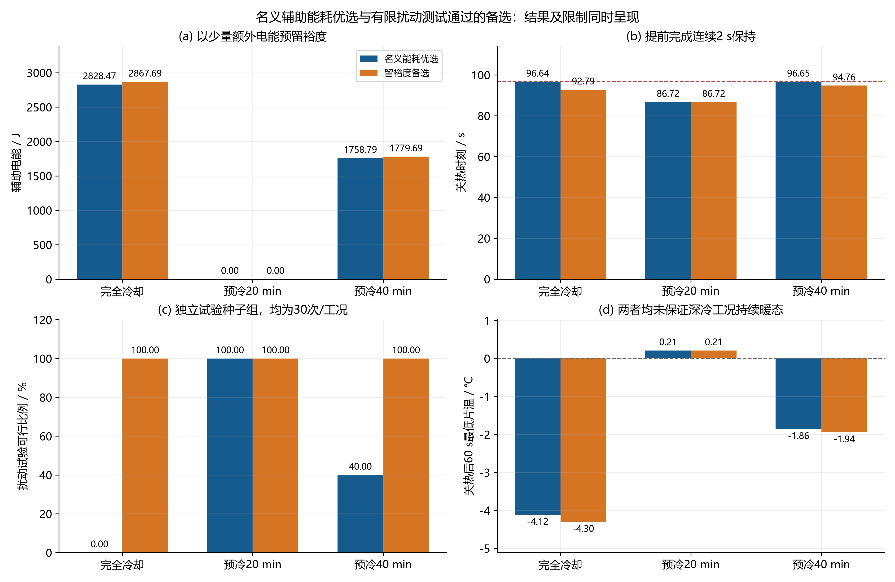

图13 以少量额外辅助电能获得时间裕度的备选；试验通过与持续暖态限制同时呈现。矢量版：[SVG](figures/图13_名义与留裕度备选.svg)。

如果任务要求在本文有限温度/电压反馈扰动范围内更可靠地按时完成保持，优先采用留裕度备选；如果只优化名义模型的辅助电能，保留名义策略作为能耗边界。两者都没有解决工况1/3关热后再次跌破0 ℃的问题。若工程成功定义要求持续暖态，应把关热后最低温度或更长保持窗口显式加入优化约束并重算，不可将本报告现有结果改称持续运行成功。

## 10. 可复现文件、数据字典与交付说明

CSV统一UTF-8 BOM编码，单位写入列名，工作文件保留计算精度；报告表格为排版展示做适量小数截断。温度T单位为℃、t为s、q为W/cm²、j为A/cm²、能量为J。报告中—表示未定义/缺失，不是0；失败方案的负时间哨兵值必须与feasible字段一起解释。

trajectory_*文件中，第n行功率描述“结束于该行time_s的积分区间”，因此独立辅助电能复算采用25Σ_{n≥1,k}q_(n,k)[t_n−t_(n−1)]；不能直接对该列做默认梯形积分，否则会引入开关时刻的半步误差。状态码、风险、滤波速率与冰量估计是最近一次控制更新值，积分子步之间保持。final_fields_*是关热后60 s仿真终态场，不是主表关热时刻的空间场；其time_s列明确给出对应时间。

### 工作数据字段说明

| 字段或字段族 | 含义 | 单位/注意 |
| --- | --- | --- |
| time_s / j_A_cm2 / charge_C_cm2 | 实际时间、瞬时加载电流密度、累计电荷 | s / A·cm⁻² / C·cm⁻² |
| T1_C…T5_C / TEL_C / TER_C | 五片平均温度、左/右端板温度 | ℃ |
| cellk_q_W_cm2 | 第k片在结束于本行的区间内加热功率密度 | W·cm⁻² |
| cellk_V_V | 第k片当前电压 | V |
| cellk_ice_bulk | 第k片全MEA空间最大冰体积分数 | 无量纲 |
| cellk_pore_ice_bulk / cellk_mem_ice_bulk | 多孔层/膜内空间最大冰体积分数 | 无量纲 |
| cellk_pore_ice_saturation | 多孔层局部冰体积/原始孔隙体积的最大值 | 无量纲，与0.99体积分数阈值不同 |
| cellk_lambda | 第k片膜内平均含水量λ | 无量纲 |
| cellk_j_over_jlim / cellk_gas_porosity | 电流与极限电流之比、最小气相孔隙率 | 无量纲 |
| cellk_state / cellk_risk | 最近控制更新的状态码和综合冰堵风险 | 状态码见表8；风险无量纲 |
| cellk_rT_K_s / cellk_rV_V_s | 滤波温升速率/电压变化率 | K·s⁻¹ / V·s⁻¹ |
| cellk_ice_est | 模型加电压残差修正后的冰量估计 | 无量纲 |
| stopped | 该行端点是否已进入不可逆关热状态 | 0/1；关热切换行的q仍记录此前区间 |
| E_aux_J…E_sensible_J | 自t=0累计的五项离散热收支 | J；后验期间反应等累计量继续更新 |
| energy_residual_J / water_residual_kg | 逐行能量/水量平衡残差 | J / kg |
| water_inventory_kg / water_produced_kg / water_out_kg | 水库存、累计生成、累计边界排出 | kg |

### 全部轨迹列的逐列数据字典

| column | 单位 | meaning |
| --- | --- | --- |
| time_s | s | 电流加载开始后的时间，含独立关热后观察段 |
| j_A_cm2 | A/cm2 | 题给斜坡/平台电流密度 |
| charge_C_cm2 | C/cm2 | 题给电流曲线精确积分；后验段独立于启动预算 |
| stopped | 0/1 | 该时刻是否已锁定永久关断；stop行功率仍记刚结束区间 |
| T1_C | degC | 热节点平均温度，EL/ER为端板 |
| T2_C | degC | 热节点平均温度，EL/ER为端板 |
| T3_C | degC | 热节点平均温度，EL/ER为端板 |
| T4_C | degC | 热节点平均温度，EL/ER为端板 |
| T5_C | degC | 热节点平均温度，EL/ER为端板 |
| TEL_C | degC | 热节点平均温度，EL/ER为端板 |
| TER_C | degC | 热节点平均温度，EL/ER为端板 |
| cell1_q_W_cm2 | W/cm2 | 该行时刻结束的前一区间内恒定加热功率；初始行0 |
| cell2_q_W_cm2 | W/cm2 | 该行时刻结束的前一区间内恒定加热功率；初始行0 |
| cell3_q_W_cm2 | W/cm2 | 该行时刻结束的前一区间内恒定加热功率；初始行0 |
| cell4_q_W_cm2 | W/cm2 | 该行时刻结束的前一区间内恒定加热功率；初始行0 |
| cell5_q_W_cm2 | W/cm2 | 该行时刻结束的前一区间内恒定加热功率；初始行0 |
| cell1_V_V | V | 单片电压 |
| cell2_V_V | V | 单片电压 |
| cell3_V_V | V | 单片电压 |
| cell4_V_V | V | 单片电压 |
| cell5_V_V | V | 单片电压 |
| cell1_ice_bulk | 1 | 单片内局部冰总体积分数最大值，含孔隙及膜 |
| cell2_ice_bulk | 1 | 单片内局部冰总体积分数最大值，含孔隙及膜 |
| cell3_ice_bulk | 1 | 单片内局部冰总体积分数最大值，含孔隙及膜 |
| cell4_ice_bulk | 1 | 单片内局部冰总体积分数最大值，含孔隙及膜 |
| cell5_ice_bulk | 1 | 单片内局部冰总体积分数最大值，含孔隙及膜 |
| cell1_pore_ice_bulk | 1 | 多孔层局部冰总体积分数最大值 |
| cell2_pore_ice_bulk | 1 | 多孔层局部冰总体积分数最大值 |
| cell3_pore_ice_bulk | 1 | 多孔层局部冰总体积分数最大值 |
| cell4_pore_ice_bulk | 1 | 多孔层局部冰总体积分数最大值 |
| cell5_pore_ice_bulk | 1 | 多孔层局部冰总体积分数最大值 |
| cell1_mem_ice_bulk | 1 | 膜层局部冰体积分数最大值 |
| cell2_mem_ice_bulk | 1 | 膜层局部冰体积分数最大值 |
| cell3_mem_ice_bulk | 1 | 膜层局部冰体积分数最大值 |
| cell4_mem_ice_bulk | 1 | 膜层局部冰体积分数最大值 |
| cell5_mem_ice_bulk | 1 | 膜层局部冰体积分数最大值 |
| cell1_pore_ice_saturation | 1 | 冰体积/干孔体积最大值；非题给严重冰堵阈值口径 |
| cell2_pore_ice_saturation | 1 | 冰体积/干孔体积最大值；非题给严重冰堵阈值口径 |
| cell3_pore_ice_saturation | 1 | 冰体积/干孔体积最大值；非题给严重冰堵阈值口径 |
| cell4_pore_ice_saturation | 1 | 冰体积/干孔体积最大值；非题给严重冰堵阈值口径 |
| cell5_pore_ice_saturation | 1 | 冰体积/干孔体积最大值；非题给严重冰堵阈值口径 |
| cell1_lambda | 1 | 膜含水量厚度均值 |
| cell2_lambda | 1 | 膜含水量厚度均值 |
| cell3_lambda | 1 | 膜含水量厚度均值 |
| cell4_lambda | 1 | 膜含水量厚度均值 |
| cell5_lambda | 1 | 膜含水量厚度均值 |
| cell1_j_over_jlim | 1 | 电流/极限电流 |
| cell2_j_over_jlim | 1 | 电流/极限电流 |
| cell3_j_over_jlim | 1 | 电流/极限电流 |
| cell4_j_over_jlim | 1 | 电流/极限电流 |
| cell5_j_over_jlim | 1 | 电流/极限电流 |
| cell1_gas_porosity | 1 | 多孔域最小可用气相体积分数 |
| cell2_gas_porosity | 1 | 多孔域最小可用气相体积分数 |
| cell3_gas_porosity | 1 | 多孔域最小可用气相体积分数 |
| cell4_gas_porosity | 1 | 多孔域最小可用气相体积分数 |
| cell5_gas_porosity | 1 | 多孔域最小可用气相体积分数 |
| cell1_state | code | 1安全增强 2低温升温不足 3跟踪维持 4接近成功渐缩 5关断；constant策略0 |
| cell2_state | code | 1安全增强 2低温升温不足 3跟踪维持 4接近成功渐缩 5关断；constant策略0 |
| cell3_state | code | 1安全增强 2低温升温不足 3跟踪维持 4接近成功渐缩 5关断；constant策略0 |
| cell4_state | code | 1安全增强 2低温升温不足 3跟踪维持 4接近成功渐缩 5关断；constant策略0 |
| cell5_state | code | 1安全增强 2低温升温不足 3跟踪维持 4接近成功渐缩 5关断；constant策略0 |
| cell1_risk | 1 | 综合冰堵风险指标 |
| cell2_risk | 1 | 综合冰堵风险指标 |
| cell3_risk | 1 | 综合冰堵风险指标 |
| cell4_risk | 1 | 综合冰堵风险指标 |
| cell5_risk | 1 | 综合冰堵风险指标 |
| cell1_rT_K_s | K/s | 二级滤波温升速率 |
| cell2_rT_K_s | K/s | 二级滤波温升速率 |
| cell3_rT_K_s | K/s | 二级滤波温升速率 |
| cell4_rT_K_s | K/s | 二级滤波温升速率 |
| cell5_rT_K_s | K/s | 二级滤波温升速率 |
| cell1_rV_V_s | V/s | 二级滤波电压变化率 |
| cell2_rV_V_s | V/s | 二级滤波电压变化率 |
| cell3_rV_V_s | V/s | 二级滤波电压变化率 |
| cell4_rV_V_s | V/s | 二级滤波电压变化率 |
| cell5_rV_V_s | V/s | 二级滤波电压变化率 |
| cell1_ice_est | 1 | 模型状态加无冰基准电压残差校正；理想模型软测量 |
| cell2_ice_est | 1 | 模型状态加无冰基准电压残差校正；理想模型软测量 |
| cell3_ice_est | 1 | 模型状态加无冰基准电压残差校正；理想模型软测量 |
| cell4_ice_est | 1 | 模型状态加无冰基准电压残差校正；理想模型软测量 |
| cell5_ice_est | 1 | 模型状态加无冰基准电压残差校正；理想模型软测量 |
| E_aux_J | J | 累计离散热量/能量；相变为净释热，散热取正 |
| E_gen_J | J | 累计离散热量/能量；相变为净释热，散热取正 |
| E_phase_J | J | 累计离散热量/能量；相变为净释热，散热取正 |
| E_loss_J | J | 累计离散热量/能量；相变为净释热，散热取正 |
| E_sensible_J | J | 累计离散热量/能量；相变为净释热，散热取正 |
| energy_residual_J | J | 累计离散热量/能量；相变为净释热，散热取正 |
| water_residual_kg | kg | 累计水量或收支残差；inventory为瞬时总库存 |
| water_inventory_kg | kg | 累计水量或收支残差；inventory为瞬时总库存 |
| water_produced_kg | kg | 累计水量或收支残差；inventory为瞬时总库存 |
| water_out_kg | kg | 累计水量或收支残差；inventory为瞬时总库存 |

数据源：[trajectory_data_dictionary.csv](data/trajectory_data_dictionary.csv)；共 91 行，CSV保留工作精度。

### 表26 全部工作CSV索引

| 文件 | 数据行 | 列数 | 字节 |
| --- | --- | --- | --- |
| constant_scan.csv | 19 | 32 | 8290 |
| controller_state_duration.csv | 225 | 5 | 5984 |
| coupled_convergence.csv | 9 | 35 | 4395 |
| csv_inventory.csv | 81 | 4 | 3737 |
| delivery_validation.csv | 24 | 3 | 1305 |
| final_fields_case1_constant_first.csv | 290 | 8 | 24450 |
| final_fields_case1_constant_hold.csv | 290 | 8 | 23787 |
| final_fields_case1_dynamic.csv | 290 | 8 | 24536 |
| final_fields_case2_constant_first.csv | 290 | 8 | 23172 |
| final_fields_case2_constant_hold.csv | 290 | 8 | 22851 |
| final_fields_case2_dynamic.csv | 290 | 8 | 24572 |
| final_fields_case3_constant_first.csv | 290 | 8 | 23575 |
| final_fields_case3_constant_hold.csv | 290 | 8 | 23601 |
| final_fields_case3_dynamic.csv | 290 | 8 | 24387 |
| guarded_design_search.csv | 27 | 49 | 15344 |
| guarded_parameters.csv | 3 | 14 | 393 |
| guarded_results.csv | 3 | 32 | 1697 |
| guarded_robustness.csv | 90 | 35 | 38428 |
| independent_export_validation.csv | 1851 | 5 | 241971 |
| initial_temperature_cases.csv | 3 | 21 | 1243 |
| main_results.csv | 9 | 32 | 4219 |
| model_validation.csv | 13 | 4 | 671 |
| optimization_search.csv | 3679 | 46 | 1989102 |
| optimization_search_case1.csv | 2231 | 46 | 1208367 |
| optimization_search_case2.csv | 1 | 46 | 1022 |
| optimization_search_case3.csv | 1447 | 46 | 780837 |
| optimized_parameters.csv | 3 | 14 | 406 |
| per_cell_heater_energy.csv | 45 | 7 | 2730 |
| precooling_convergence.csv | 24 | 8 | 2494 |
| precooling_energy_balance.csv | 19 | 8 | 2959 |
| precooling_fields.csv | 2774 | 10 | 239287 |
| precooling_layers.csv | 33 | 11 | 3052 |
| precooling_node_capacities.csv | 7 | 3 | 273 |
| precooling_nodes.csv | 19 | 20 | 7474 |
| precooling_sensitivity.csv | 40 | 24 | 19643 |
| precooling_slow_modes.csv | 10 | 4 | 704 |
| precooling_validation.csv | 11 | 6 | 1120 |
| robustness.csv | 90 | 35 | 37174 |
| run_environment.csv | 1 | 8 | 219 |
| sensitivity.csv | 48 | 33 | 20333 |
| source_manifest.csv | 50 | 3 | 4860 |
| startup_convergence.csv | 27 | 34 | 11799 |
| trajectory_case1_constant_first.csv | 3432 | 91 | 3361877 |
| trajectory_case1_constant_hold.csv | 3513 | 91 | 3445272 |
| trajectory_case1_dynamic.csv | 6268 | 91 | 7870825 |
| trajectory_case1_guarded.csv | 6114 | 91 | 7674959 |
| trajectory_case2_constant_first.csv | 2627 | 91 | 2602571 |
| trajectory_case2_constant_hold.csv | 2708 | 91 | 2682440 |
| trajectory_case2_dynamic.csv | 5871 | 91 | 7272114 |
| trajectory_case2_guarded.csv | 5871 | 91 | 7272114 |
| trajectory_case3_constant_first.csv | 3084 | 91 | 3038768 |
| trajectory_case3_constant_hold.csv | 3165 | 91 | 3119000 |
| trajectory_case3_dynamic.csv | 6269 | 91 | 7897709 |
| trajectory_case3_guarded.csv | 6193 | 91 | 7791841 |
| trajectory_data_dictionary.csv | 91 | 3 | 5872 |
| trajectory_scan_010min.csv | 1 | 91 | 1655 |
| trajectory_scan_015min.csv | 76 | 91 | 76339 |
| trajectory_scan_020min.csv | 226 | 91 | 224955 |
| trajectory_scan_025min.csv | 366 | 91 | 362757 |
| trajectory_scan_030min.csv | 490 | 91 | 484469 |
| trajectory_scan_035min.csv | 596 | 91 | 586723 |
| trajectory_scan_040min.csv | 683 | 91 | 671039 |
| trajectory_scan_045min.csv | 754 | 91 | 739513 |
| trajectory_scan_050min.csv | 812 | 91 | 794725 |
| trajectory_scan_055min.csv | 858 | 91 | 837966 |
| trajectory_scan_060min.csv | 894 | 91 | 872016 |
| trajectory_scan_065min.csv | 923 | 91 | 899059 |
| trajectory_scan_070min.csv | 946 | 91 | 920966 |
| trajectory_scan_075min.csv | 964 | 91 | 938131 |
| trajectory_scan_080min.csv | 979 | 91 | 951964 |
| trajectory_scan_085min.csv | 990 | 91 | 962432 |
| trajectory_scan_090min.csv | 999 | 91 | 970994 |
| trajectory_scan_095min.csv | 1006 | 91 | 977672 |
| trajectory_scan_100min.csv | 1011 | 91 | 982337 |
| 表4_问题四完整结果.csv | 6 | 11 | 1435 |

```text
一键复算冻结控制参数与所有输出：.\run_all.ps1
重新优化并完整运行：.\run_all.ps1 -Reoptimize
单独重算主数值：python code/run_problem4.py --reuse-controls --skip-precool
仅重画全部科研图：python code/plot_results.py
仅重建完整报告：python code/build_report.py
```

运行顺序为数值计算→独立验证→图片生成→报告生成；若修改模型参数，应重新运行数值计算，不能只刷新图片。代码、输入快照与SHA-256清单提供源文件追溯。根目录README.md说明环境安装和关键文件；图像提供300 dpi PNG及SVG矢量版，两者读取同一CSV。

[预冷模型审计与阶段衔接说明](audit/预冷模型审计.md)

[独立审计说明](audit/独立审计说明.md)
